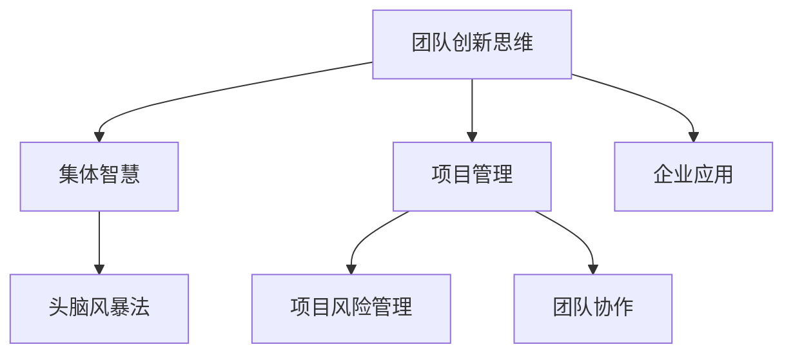

                 

### 文章标题

《团队创新思维：激发集体智慧的头脑风暴法》

### 关键词

团队创新思维、集体智慧、头脑风暴法、项目管理、企业应用、创新挑战与未来

### 摘要

本文深入探讨了团队创新思维的重要性，阐述了集体智慧的概念及其价值，详细介绍了头脑风暴法的原理与应用。通过分析创意思维的技巧、项目管理中的创新实践，以及团队创新思维在企业中的应用，本文旨在为读者提供一套系统化的团队创新思维方法，助力企业实现持续创新与发展。文章最后还探讨了团队创新思维面临的挑战及未来发展趋势，为读者指明创新之路。

---

### 第1章：团队创新思维概述

#### 1.1 创新思维的重要性

在当今这个信息爆炸、技术变革迅速的时代，创新已经成为企业和个人发展的核心竞争力。创新思维，作为一种独特且宝贵的思维能力，它在推动科技进步、经济增长、社会进步等方面发挥着不可替代的作用。

**创新思维的定义**：创新思维是指从新的角度出发，采用独特的方法解决问题，产生新颖、有价值的想法和方案。它包括发散思维、聚合思维、逆向思维、系统思维等多种思维模式。

**创新思维的重要性**：
1. **推动企业竞争力**：创新是企业持续发展的动力，只有不断进行创新，企业才能在激烈的市场竞争中立于不败之地。
2. **促进科技进步**：创新思维是科技进步的重要驱动力，许多重大科学发现和技术突破都源于创新思维的应用。
3. **提高个人素质**：创新思维能力的培养有助于提高个人的综合素质，增强解决问题的能力。

#### 1.2 团队创新思维的基本原则

团队创新思维是一种利用团队成员的集体智慧进行创新的方法。它强调团队协作、知识共享和多元化的观点。

**基本原则**：
1. **协同合作**：团队中的每个成员都应该积极参与，共同解决问题。
2. **知识共享**：团队成员应该开放自己的知识，与他人分享，实现知识互补。
3. **鼓励多样性**：多样性是创新思维的重要来源，鼓励团队成员提出不同观点，有助于发现新的解决方案。

#### 1.3 团队创新思维的发展历程

团队创新思维并非一朝一夕之事，它经历了漫长的发展历程。

1. **早期阶段**：从20世纪初开始，许多企业开始意识到创新的重要性，并尝试建立创新机制。
2. **中期阶段**：20世纪中叶，企业开始注重团队协作和知识管理，创新方法逐渐多样化。
3. **现代阶段**：随着信息技术的发展，团队创新思维得到了更广泛的应用和深入研究，各种创新工具和方法不断涌现。

#### 1.4 团队创新思维的实践案例

**案例一**：谷歌的“20%时间政策”

谷歌实行“20%时间政策”，允许员工将20%的工作时间用于自己感兴趣的项目。这一政策激发了员工的创新热情，诞生了包括Gmail、Google News在内的许多知名产品。

**案例二**：苹果公司的产品设计

苹果公司通过团队协作，不断推出创新产品。其设计团队采用头脑风暴法，激发创意，设计出了一系列备受市场青睐的产品。

通过以上实践案例，我们可以看到，团队创新思维在企业和个人发展中的重要作用。下一章，我们将进一步探讨集体智慧的概念与价值。

---

### 第2章：集体智慧的概念与价值

#### 2.1 集体智慧的定义

集体智慧是指在一个团队或组织中，通过成员之间的沟通、协作和知识共享，形成的一种超越个体智慧和能力的集体思维模式。它强调团队成员之间的互动和协作，通过整合不同成员的知识、技能和经验，产生出更加全面和创新的解决方案。

**定义要点**：
- **知识共享**：集体智慧的形成依赖于团队成员之间的知识共享和协作。
- **协同效应**：集体智慧通过整合不同成员的智慧和经验，产生协同效应，提升整体创新能力和决策质量。
- **多元化**：集体智慧强调团队中多元化的观点和思路，有助于发现更全面的解决方案。

#### 2.2 集体智慧与个体智慧的对比

**集体智慧与个体智慧的对比**：

| 特点            | 集体智慧                 | 个体智慧                 |
|----------------|------------------------|------------------------|
| 资源来源        | 多元化、知识共享       | 单一、个人经验         |
| 决策模式        | 协同、讨论、共识       | 独立、个人判断         |
| 问题解决能力    | 全面的、创新的         | 局限的、单一的         |
| 创新潜力        | 高，基于协同效应       | 低，受限于个人能力     |

**对比分析**：

- **资源来源**：集体智慧来源于团队成员的知识共享和协作，能够整合更多的信息和资源，而个体智慧主要依赖于个人经验和知识。
- **决策模式**：集体智慧通过团队成员的讨论和共识来做出决策，能够更好地考虑各种因素，而个体智慧往往基于个人判断，容易受到个人偏见的影响。
- **问题解决能力**：集体智慧能够从多个角度分析问题，提出更全面的解决方案，而个体智慧在处理复杂问题时往往存在局限性。
- **创新潜力**：集体智慧通过协同效应和多元化的观点，能够产生更多的创新想法，个体智慧的创新潜力相对较低。

#### 2.3 集体智慧的优势

**优势**：

1. **增强创新力**：集体智慧通过团队成员的协作和知识共享，能够产生更多的创新想法和解决方案，提高团队的创新能力。
2. **提升决策质量**：集体智慧通过团队成员的讨论和共识，能够更全面地考虑问题，减少决策失误，提高决策质量。
3. **增强团队合作**：集体智慧强调团队成员之间的协作和互动，有助于增强团队的凝聚力和协作能力。
4. **拓宽视野**：集体智慧通过多元化观点的整合，能够拓宽团队成员的视野，帮助团队更好地应对复杂多变的环境。

#### 2.4 集体智慧的局限性

**局限性**：

1. **沟通成本**：集体智慧的形成需要团队成员之间的有效沟通和协作，这可能会导致沟通成本的增加。
2. **共识困难**：团队成员的观点和意见可能存在差异，达成共识可能需要更多的时间和努力。
3. **个体贡献差异**：在集体智慧中，个体的贡献可能无法得到充分体现，可能会影响团队成员的积极性和创造力。
4. **团队依赖性**：集体智慧过于依赖团队成员之间的互动和协作，一旦团队成员变动，集体智慧可能受到影响。

#### 2.5 集体智慧与团队协作的关系

**关系**：

- **相互促进**：集体智慧和团队协作是相互促进的关系。集体智慧依赖于团队协作来实现知识共享和协同效应，而团队协作则为集体智慧提供了实践的平台。
- **相互依赖**：集体智慧的形成离不开团队协作，而团队协作的效果也会受到集体智慧的影响。只有团队协作和集体智慧相互结合，才能更好地推动团队的创新和发展。

通过以上分析，我们可以看到集体智慧在团队创新中的重要作用。下一章，我们将详细探讨头脑风暴法的原理与应用。

---

### 第3章：头脑风暴法的原理与应用

#### 3.1 头脑风暴法的基本原理

头脑风暴法（Brainstorming）是一种激发团队创新思维的技术手段，最早由美国广告人奥斯本（Alex Osborn）在1940年代提出。它的核心思想是通过团队成员的自由讨论和创意碰撞，产生大量的创意和解决方案。

**基本原理**：

1. **自由畅想**：头脑风暴法鼓励团队成员不受限制地发表自己的想法，无论这些想法是否可行或疯狂，都可以在讨论中进行探讨。
2. **量变到质变**：在头脑风暴过程中，大量的创意和观点会相互碰撞、激发，从而产生更优质的解决方案。
3. **鼓励多样性**：头脑风暴法强调团队中每个成员的不同观点和思路，认为多样化的想法有助于发现新的解决方案。
4. **避免批评和否定**：在头脑风暴过程中，团队成员应避免对别人的想法进行批评和否定，而是尽量理解和接受，以促进创意的生成。

#### 3.2 头脑风暴法的步骤

进行头脑风暴法通常分为以下几个步骤：

1. **明确目标和主题**：在开始头脑风暴之前，首先要明确目标和主题，确保团队成员在讨论时有一个明确的方向。
2. **组建团队**：选择合适的团队成员，确保团队成员具有多样化的背景和观点。
3. **讨论和创意生成**：团队成员围绕目标和主题进行自由讨论，提出各种创意和解决方案。
4. **记录和整理**：将每个成员提出的想法和创意记录下来，并进行整理分类。
5. **评估和筛选**：对记录的创意和解决方案进行评估和筛选，选择最有价值和可行性的创意进行进一步讨论。

**具体步骤示例**：

1. **明确目标和主题**：例如，确定下一个产品的创新功能。
2. **组建团队**：选择具有不同背景和技能的团队成员，如产品经理、设计师、工程师等。
3. **讨论和创意生成**：团队成员围绕产品创新功能进行自由讨论，提出各种创意和解决方案，如增加新功能、改进现有功能、推出全新产品等。
4. **记录和整理**：将每个成员提出的创意和解决方案记录下来，并按照功能、技术难度等进行分类。
5. **评估和筛选**：对记录的创意和解决方案进行评估和筛选，选择最具有创新性和可行性的创意进行进一步讨论和实施。

#### 3.3 头脑风暴法的注意事项

为了确保头脑风暴法的有效进行，需要遵循以下注意事项：

1. **保持开放态度**：鼓励团队成员保持开放的态度，勇于提出各种想法，无论它们是否合理或可行。
2. **避免批评和否定**：在头脑风暴过程中，避免对别人的想法进行批评和否定，而是尽量理解和接受，以促进创意的生成。
3. **尊重多样性**：鼓励团队成员提出不同的观点和思路，认为多样化的想法有助于发现新的解决方案。
4. **合理控制时间**：头脑风暴法不需要过多的时间，通常控制在1-2小时左右，以确保团队成员的参与度和创意的质量。
5. **记录和整理**：及时记录每个成员提出的想法和创意，并进行分类整理，以方便后续评估和筛选。

#### 3.4 头脑风暴法的实战案例

**案例一**：谷歌的“10%创新时间”

谷歌公司允许员工将10%的工作时间用于自己的创新项目，这一政策激发了员工的创新热情，诞生了包括Gmail、Google News在内的许多知名产品。谷歌的“10%创新时间”可以看作是头脑风暴法在企业中的应用，通过自由讨论和创意碰撞，激发了员工的创新思维。

**案例二**：苹果公司的产品设计

苹果公司通过团队协作，不断推出创新产品。其设计团队采用头脑风暴法，激发创意，设计出了一系列备受市场青睐的产品。例如，iPhone的设计过程中，设计团队通过头脑风暴，提出了许多创新的想法，如多点触控技术、Retina显示屏等，最终成功推出了具有革命性意义的产品。

通过以上实战案例，我们可以看到头脑风暴法在激发团队创新思维中的重要作用。下一章，我们将进一步探讨如何激发团队创新思维。

---

### 第4章：激发团队创新思维的方法

在竞争激烈的市场环境中，团队创新思维是企业持续发展的关键。本章将介绍几种常用的激发团队创新思维的方法，包括创意思维的技巧、开放式提问法、SWOT分析法和团队协作的技巧。通过这些方法，团队可以更有效地激发创新思维，推动项目的成功。

#### 4.1 创意思维的技巧

创意思维是创新思维的核心，以下是一些激发创意思维的技巧：

1. **头脑风暴法**：我们已经在前一章详细介绍了头脑风暴法，这里不再赘述。头脑风暴法是一种有效的激发创意的方法，通过自由讨论和创意碰撞，产生大量创意。
2. **思维导图**：思维导图是一种图形化的思维工具，通过将想法以节点和分支的形式绘制出来，有助于发现新的联系和创意。
3. **类比思维**：类比思维是通过将不同领域的问题进行类比，从而找到新的解决方案。例如，可以将互联网与交通系统进行类比，从而提出新的网络架构和算法。
4. **逆向思维**：逆向思维是从相反的角度思考问题，寻找解决方案。例如，在产品设计过程中，可以思考如何设计一个无法被轻易使用的产品，以增加安全性。

#### 4.2 开放式提问法

开放式提问法是一种激发团队成员思考的方法，它鼓励团队成员提出开放式的问题，从而引发更深入的讨论和思考。以下是一些常用的开放式提问技巧：

1. **为什么**：通过不断提问“为什么”，可以挖掘问题的本质，找到更多的解决方案。例如，“为什么这个功能需要这么复杂？”
2. **如果**：通过假设某种条件，激发团队成员思考在特定条件下的解决方案。例如，“如果在没有网络的情况下，这个功能应该如何实现？”
3. **如何**：通过提问“如何”，可以引导团队成员思考具体的执行方案。例如，“如何优化这个流程，使其更加高效？”

#### 4.3 SWOT分析法

SWOT分析法是一种常用的战略规划工具，通过分析团队的优势（Strengths）、劣势（Weaknesses）、机会（Opportunities）和威胁（Threats），帮助团队制定更有效的创新策略。以下是如何使用SWOT分析法：

1. **优势分析**：分析团队在资源、技能、经验等方面的优势，这些优势可以帮助团队在创新过程中更好地利用现有资源。
2. **劣势分析**：识别团队在资源、技能、经验等方面的劣势，这些劣势可能成为创新的障碍，需要通过改进来克服。
3. **机会分析**：分析市场、技术、政策等方面的机会，寻找可以利用的外部资源。
4. **威胁分析**：分析市场竞争、技术变革、政策变化等方面的威胁，为团队的创新活动提供预警。

#### 4.4 团队协作的技巧

团队协作是创新思维的重要保障，以下是一些提升团队协作的技巧：

1. **明确目标**：确保团队成员对项目的目标有清晰的认识，共同追求团队的成功。
2. **建立信任**：通过沟通、合作和共同完成任务，建立团队成员之间的信任，促进团队的协作。
3. **分工合作**：根据团队成员的技能和特长，合理分工，确保每个成员都能在项目中发挥最大的作用。
4. **积极沟通**：鼓励团队成员积极沟通，分享自己的想法和观点，促进知识的共享和交流。
5. **及时反馈**：在项目进行过程中，及时给予团队成员反馈，帮助他们改进工作，提高团队的整体效率。

通过以上方法，团队可以更有效地激发创新思维，推动项目的成功。下一章，我们将探讨团队创新思维在项目管理中的应用。

---

### 第5章：团队创新思维与项目管理

在项目管理中，团队创新思维发挥着至关重要的作用。通过有效的团队创新思维，项目团队可以更好地应对复杂多变的环境，提高项目的成功率。本章将探讨团队创新思维在项目管理中的应用，包括项目管理的创新思维、项目中的团队协作、项目风险管理以及项目创新思维的实践。

#### 5.1 项目管理的创新思维

项目管理的创新思维是指在项目规划、执行、监控和收尾过程中，运用创新方法和思维，以实现项目目标。以下是一些项目管理的创新思维：

1. **敏捷管理**：敏捷管理强调快速响应变化、持续交付价值。通过采用敏捷方法论，如Scrum和Kanban，项目团队可以更好地适应变化，提高项目的灵活性。
2. **精益管理**：精益管理强调消除浪费、优化流程。通过运用精益思想，项目团队可以降低成本、提高效率，实现项目的精益化。
3. **设计思维**：设计思维是一种以用户为中心的创新方法论，通过深入了解用户需求，项目团队可以设计出更符合用户期望的产品和服务。
4. **跨界合作**：跨界合作是指将不同领域、不同背景的人才汇集在一起，通过跨学科、跨领域的合作，激发创新的火花。

#### 5.2 项目中的团队协作

团队协作是项目管理成功的关键。以下是一些促进项目团队协作的技巧：

1. **明确目标**：确保团队成员对项目的目标有清晰的认识，共同追求团队的成功。
2. **建立信任**：通过沟通、合作和共同完成任务，建立团队成员之间的信任，促进团队的协作。
3. **分工合作**：根据团队成员的技能和特长，合理分工，确保每个成员都能在项目中发挥最大的作用。
4. **积极沟通**：鼓励团队成员积极沟通，分享自己的想法和观点，促进知识的共享和交流。
5. **协同工具**：利用协同工具，如项目管理软件、在线协作平台，提高团队协作的效率。

#### 5.3 项目风险管理

项目风险管理是项目管理的重要组成部分。以下是一些项目风险管理的创新方法：

1. **情景分析法**：通过分析可能的项目情景，识别潜在的风险和问题，制定相应的应对策略。
2. **博弈分析法**：通过模拟不同情况下的决策过程，评估项目风险，并制定最优的应对策略。
3. **风险矩阵**：利用风险矩阵对项目风险进行评估和排序，确定优先处理的风险。
4. **动态风险管理**：在项目执行过程中，持续监控风险的变化，及时调整风险管理策略。

#### 5.4 项目创新思维的实践

以下是一些项目创新思维的实践案例：

**案例一**：IBM的“15%创新时间”

IBM公司允许员工将15%的工作时间用于自己的创新项目，这一政策激发了员工的创新热情，诞生了许多创新的产品和服务。例如，IBM的Watson超级计算机就是通过员工的创新项目诞生的。

**案例二**：苹果公司的产品设计

苹果公司通过团队协作和设计思维，不断推出创新产品。例如，iPhone的设计过程中，设计团队通过头脑风暴和设计思维，提出了许多创新的想法，如多点触控技术、Retina显示屏等，最终成功推出了具有革命性意义的产品。

**案例三**：谷歌的“20%时间政策”

谷歌公司允许员工将20%的工作时间用于自己感兴趣的项目，这一政策激发了员工的创新思维，诞生了包括Gmail、Google News在内的许多知名产品。

通过以上案例，我们可以看到，团队创新思维在项目管理中的应用，不仅提高了项目的成功率，也为企业带来了巨大的创新成果。下一章，我们将探讨团队创新思维在企业中的应用。

---

### 第6章：团队创新思维在企业中的应用

团队创新思维在企业发展中扮演着至关重要的角色。通过有效的团队创新思维，企业可以不断推出具有竞争力的新产品，优化现有业务流程，提升市场竞争力。本章将探讨团队创新思维在企业中的应用，包括企业创新文化的建设、团队创新思维在产品研发中的应用、团队创新思维在市场营销中的应用以及团队创新思维在人力资源管理中的应用。

#### 6.1 企业创新文化的建设

企业创新文化是企业持续创新的基石。以下是一些建设企业创新文化的关键措施：

1. **鼓励创新**：企业应鼓励员工勇于提出新的想法和建议，并为员工提供创新的空间和资源。
2. **建立激励机制**：通过奖励机制激励员工积极参与创新活动，提高员工的创新积极性。
3. **提供培训**：为员工提供创新相关的培训，提高员工的创新能力和思维水平。
4. **营造开放氛围**：建立开放的沟通渠道，鼓励员工之间的知识共享和合作，营造一个充满活力和创新氛围的工作环境。

#### 6.2 团队创新思维在产品研发中的应用

团队创新思维在产品研发中具有重要作用。以下是一些团队创新思维在产品研发中的应用方法：

1. **头脑风暴法**：通过头脑风暴法，团队成员可以自由讨论，提出各种创新的想法和解决方案，有助于发现新的产品功能和优化方向。
2. **设计思维**：设计思维以用户为中心，通过深入了解用户需求，帮助团队设计出更符合用户期望的产品。
3. **敏捷开发**：敏捷开发强调快速迭代和持续交付，通过持续反馈和改进，提高产品的质量和用户体验。
4. **跨界合作**：通过与不同领域、不同背景的专家合作，可以借鉴其他领域的创新成果，为产品研发带来新的思路。

#### 6.3 团队创新思维在市场营销中的应用

团队创新思维在市场营销中同样具有重要作用。以下是一些团队创新思维在市场营销中的应用方法：

1. **创意营销**：通过创意营销，如社交媒体营销、内容营销等，吸引消费者的注意力，提高品牌知名度。
2. **个性化营销**：通过大数据分析和用户画像，了解消费者的需求和行为，提供个性化的营销策略，提高营销效果。
3. **跨界营销**：通过与其他行业、品牌的合作，实现资源的整合和互补，为市场营销带来新的可能性。
4. **创新渠道**：通过探索新的营销渠道，如直播电商、短视频营销等，扩大市场覆盖范围。

#### 6.4 团队创新思维在人力资源管理中的应用

团队创新思维在人力资源管理中同样具有重要价值。以下是一些团队创新思维在人力资源管理中的应用方法：

1. **人才招聘**：通过创新的人才招聘策略，如线上招聘、社会化招聘等，吸引更多优秀人才。
2. **员工培训**：通过创新的员工培训方法，如在线培训、实战培训等，提高员工的技能和素质。
3. **绩效考核**：通过创新的绩效考核方法，如KPI考核、360度评估等，激励员工持续提升绩效。
4. **员工福利**：通过创新的员工福利政策，如灵活工作时间、员工福利计划等，提高员工的工作满意度和忠诚度。

通过以上措施，企业可以有效地激发团队创新思维，推动企业的持续创新与发展。下一章，我们将探讨团队创新思维的挑战与未来。

---

### 第7章：团队创新思维的挑战与未来

在当今这个快速变化的时代，团队创新思维面临着诸多挑战。如何应对这些挑战，并展望其未来发展，是企业和团队需要深入思考的问题。本章将探讨团队创新思维面临的挑战、提高团队创新思维的方法、团队创新思维的未来发展趋势以及团队创新思维的案例分析。

#### 7.1 团队创新思维的挑战

**挑战一：组织惯性**

企业往往存在一定的组织惯性，这种惯性可能阻碍创新思维的实践。组织惯性包括固有的管理模式、流程、文化和价值观，它们可能在无形中限制了团队的创新空间。

**解决策略**：为了克服组织惯性，企业需要建立开放的文化，鼓励员工提出批评和建议。同时，管理层应积极倾听员工的意见，并采取实际行动支持创新。

**挑战二：资源限制**

创新往往需要大量的资源投入，包括时间、资金、人力资源等。资源限制可能成为团队创新思维的最大障碍。

**解决策略**：企业可以通过优化资源配置、提高效率来缓解资源限制。此外，可以考虑采用众筹、外包等模式，引入外部资源，以支持团队的创新活动。

**挑战三：团队协作问题**

团队协作问题，如沟通不畅、意见不一致、利益冲突等，都可能影响团队创新思维的发挥。

**解决策略**：为了改善团队协作，企业应加强团队建设，提高团队沟通和协作能力。可以通过定期的团队活动、培训和团队建设游戏，增强团队成员之间的信任和合作。

#### 7.2 提高团队创新思维的方法

**方法一：培训与教育**

为团队成员提供创新相关的培训和教育，提高他们的创新意识和能力。这包括思维技巧培训、创新方法论学习等。

**方法二：建立创新机制**

建立完善的创新机制，包括激励机制、评价机制和反馈机制，鼓励员工积极参与创新活动。

**方法三：建立创新团队**

组建专门的创新团队，负责项目的创新工作。创新团队应具有多元化的背景和技能，以产生更多的创新想法。

**方法四：激发创意环境**

创造一个激发创意的环境，如开放的办公空间、灵活的工作时间、创新实验室等，以鼓励团队成员自由发挥。

#### 7.3 团队创新思维的未来发展趋势

**趋势一：数字化与创新工具的结合**

随着数字技术的不断发展，创新工具将更加智能化和多样化。例如，人工智能、大数据分析等技术将被广泛应用于团队创新过程中，提高创新的效率和效果。

**趋势二：跨界合作与融合**

未来，团队创新将更加注重跨界合作与融合，通过整合不同领域的知识和资源，产生新的创新成果。例如，医学、工程、艺术等领域的跨界合作，将带来更多具有突破性的创新。

**趋势三：持续创新与迭代**

团队创新思维将更加注重持续创新和迭代，通过快速迭代和持续改进，不断优化产品和服务。这需要企业建立敏捷的组织架构和创新流程，以适应快速变化的市场环境。

#### 7.4 团队创新思维的案例分析

**案例一：谷歌的“X实验室”**

谷歌的“X实验室”是一个专门负责未来技术创新的团队。通过跨界合作和创新工具的应用，X实验室成功研发了谷歌眼镜、自动驾驶汽车等颠覆性产品，展示了团队创新思维的巨大潜力。

**案例二：3M公司的“15%时间政策”**

3M公司实行的“15%时间政策”允许员工将15%的工作时间用于自己的创新项目。这一政策激发了员工的创新热情，诞生了包括“思高牌”胶带在内的许多知名产品，成为企业持续创新的成功案例。

**案例三：宝洁公司的“创新实验室”**

宝洁公司建立了一个专门的创新实验室，通过创意竞赛、创新培训等方式，激发员工的创新思维。实验室推出的新产品如汰渍洗衣粉、碧浪洗衣球等，为公司带来了巨大的市场份额。

通过以上案例分析，我们可以看到，团队创新思维在企业和项目中的重要作用。未来，随着科技的不断进步和市场的变化，团队创新思维将迎来更多的发展机遇和挑战。

---

### 结束语

本文系统地探讨了团队创新思维的重要性、集体智慧的概念与价值、头脑风暴法的原理与应用、激发团队创新思维的方法、团队创新思维在项目管理中的应用以及团队创新思维在企业中的应用。通过分析团队创新思维面临的挑战和未来发展趋势，我们为团队和创新者提供了一套全面且实用的指南。

在激烈的市场竞争中，团队创新思维是企业持续发展的关键。通过激发集体智慧，利用头脑风暴法和其他创新方法，团队可以更有效地应对挑战，实现持续创新。

最后，希望本文能为读者提供启示，帮助团队和创新者在实践中不断提升创新思维，为企业的发展注入源源不断的动力。作者：AI天才研究院/AI Genius Institute & 禅与计算机程序设计艺术 /Zen And The Art of Computer Programming。

---

### 附录

#### 1. 核心概念与联系

以下是本文中核心概念及其关系的Mermaid流程图：



#### 2. 头脑风暴法的伪代码实现

以下是一个简单的头脑风暴法的伪代码实现，用于生成创意：

```python
def brainstorming_theme(theme):
    ideas = []
    for member in team_members:
        idea = member.generate_idea(theme)
        ideas.append(idea)
    return ideas

def main():
    theme = "下一代智能家居产品"
    ideas = brainstorming_theme(theme)
    print("创意列表：")
    for idea in ideas:
        print(i)
```

#### 3. 数学公式

以下是一些本文中涉及的数学公式和详细讲解：

**公式1：创意评分公式**

$$
C_i = \frac{I_i \cdot R_i \cdot T_i}{D_i}
$$

其中：
- $C_i$：第$i$个创意的评分
- $I_i$：第$i$个创意的创新度
- $R_i$：第$i$个创意的相关性
- $T_i$：第$i$个创意的可执行性
- $D_i$：第$i$个创意的成本

**公式解释**：创意评分公式用于评估创意的质量，创新度、相关性、可执行性和成本是评估创意的四个关键因素。

**举例说明**：

假设有一个创意是开发一款智能家居健康监测设备，其评估结果如下：
- 创新度（$I_i$）：8
- 相关性（$R_i$）：7
- 可执行性（$T_i$）：6
- 成本（$D_i$）：5

则该创意的评分为：

$$
C_i = \frac{8 \cdot 7 \cdot 6}{5} = 67.2
$$

#### 4. 最佳实践 Tips

**1. 定期进行头脑风暴**：定期组织头脑风暴会议，让团队成员有机会提出新的想法和解决方案。

**2. 尊重多样性**：鼓励团队成员提出不同的观点和思路，认为多样化的想法有助于发现新的解决方案。

**3. 跨部门协作**：鼓励不同部门之间的协作，通过跨部门的合作，可以借鉴其他部门的经验和知识，提高创新效果。

**4. 建立激励机制**：通过建立激励机制，如奖励、晋升等，鼓励团队成员积极参与创新活动。

**5. 持续学习**：鼓励团队成员不断学习和提升自己的技能，以适应快速变化的市场环境。

#### 5. 拓展阅读

- [《创新者的基因》[美]杰夫·狄万、史蒂夫·布兰克]：探讨了创新者的思维模式和行为习惯，提供了实用的创新方法。
- [《精益创业》[美]埃里克·莱斯]：介绍了精益创业方法论，通过快速迭代和用户反馈，提高创新项目的成功率。
- [《设计思维》[美]大卫·凯利]：介绍了设计思维方法，强调以用户为中心的创新，提供了实用的创新工具和流程。

以上是本文的附录部分，包括核心概念与联系、伪代码实现、数学公式、最佳实践 Tips 和拓展阅读。希望这些内容能为读者的研究和实践提供参考。作者：AI天才研究院/AI Genius Institute & 禅与计算机程序设计艺术 /Zen And The Art of Computer Programming。

