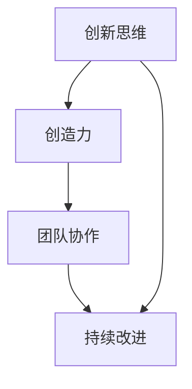
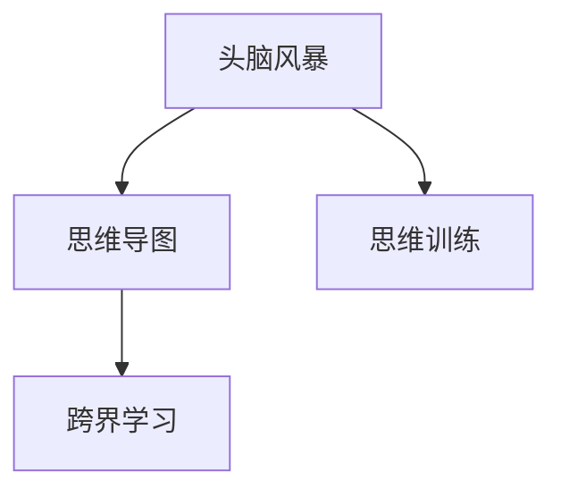
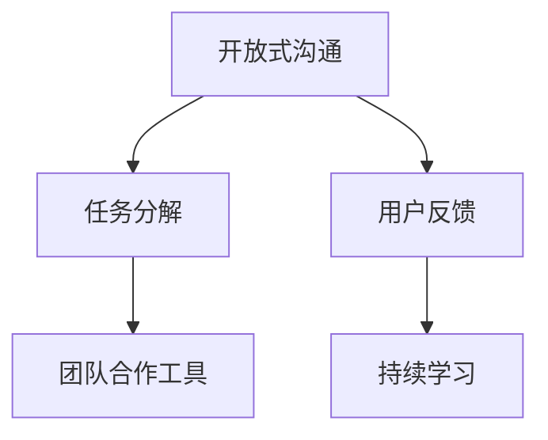
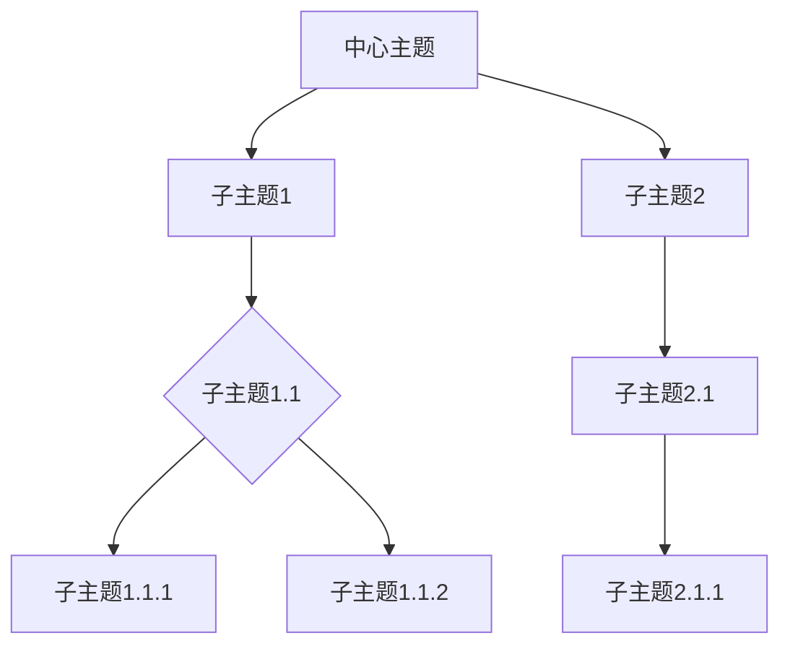
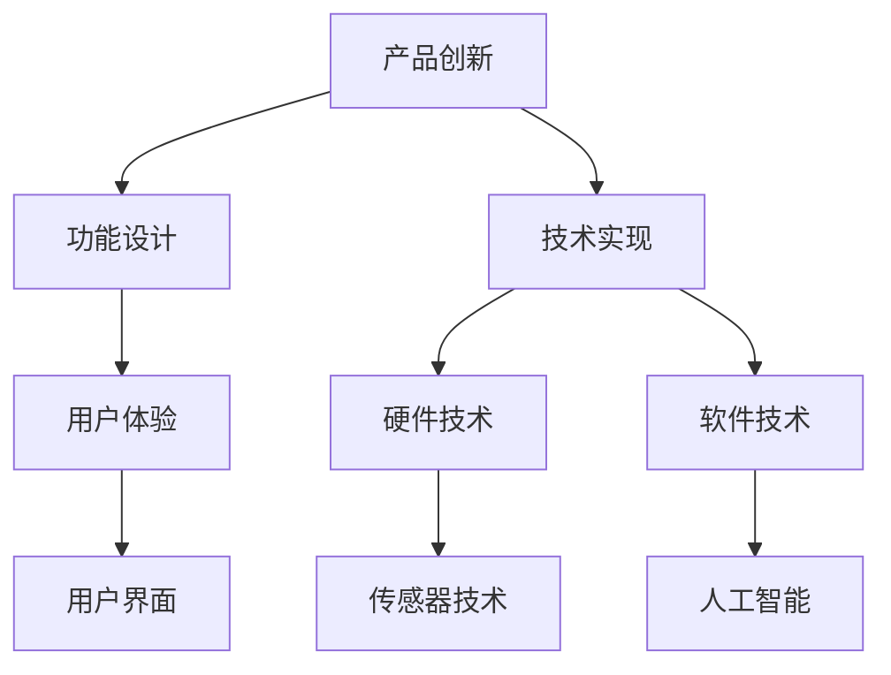

                 

### 文章标题：团队创新文化：鼓励创意和实验的方法

### 关键词：团队创新文化、鼓励创意、实验方法、创新思维、持续改进

### 摘要：
在信息技术快速发展的今天，团队创新文化成为企业竞争的核心力量。本文深入探讨团队创新文化的概念、原理，以及如何通过具体方法和实验设计，鼓励团队成员的创意和实验。通过详细的算法原理讲解、数学模型分析、实际案例研究，本文旨在为IT团队构建一种有效的创新文化，实现持续创新和卓越发展。

---

### 引言

在当今高度竞争的商业环境中，技术创新是企业保持竞争力的关键。而团队创新文化作为推动技术创新的重要力量，越来越受到企业的重视。团队创新文化不仅能够激发团队成员的创造力和积极性，还能促进知识的共享和协作，最终带来创新成果的涌现。

然而，构建一个有效的团队创新文化并非易事。它需要企业从战略层面进行规划和设计，同时在战术层面采取一系列鼓励创意和实验的方法。本文将围绕这两个核心问题展开讨论，旨在为IT团队提供一套系统化的方法和策略，以构建和维持一个充满活力和创新精神的工作环境。

本文将首先介绍团队创新文化的基本概念和架构，接着详细探讨鼓励创意和实验的方法，包括创新思维技巧、创意工具应用以及实验设计原则。随后，通过实际案例研究，展示这些方法在实践中的应用效果。最后，本文将探讨领导力在创新文化中的作用，并给出一些可持续发展的建议。通过这些内容，本文希望能够为IT团队提供有价值的参考和指导，助力他们在技术创新的道路上不断前行。

### 第一部分：团队创新文化基础

#### 第1章：团队创新文化概述

**1.1 核心概念与联系**

团队创新文化是指一种鼓励团队成员自由探索、积极思考、勇于创新的工作氛围和价值观体系。它不仅包括企业的战略规划和资源投入，还涉及团队内部的沟通机制、激励机制以及成员之间的协作方式。核心概念包括创新思维、创造力、团队协作和持续改进。

创新思维是团队创新文化的灵魂，它强调打破传统思维定势，从不同角度思考问题，寻找新的解决方案。创造力则是创新思维的具体表现，是团队成员在创新过程中能够提出独特想法和见解的能力。团队协作是实现创新的重要保障，它要求团队成员之间密切配合，共享知识，共同推进项目进展。持续改进则是团队创新文化的重要组成部分，它要求团队不断反思和优化工作流程，提高效率和质量。

图1.1 团队创新文化的核心概念关系图



**1.2 创新思维与创造力**

创新思维是团队创新文化的基础。它要求团队成员具备以下几种思维能力：

- **跨学科思维**：能够跨越不同领域和学科，寻找创新的交叉点。
- **逆向思维**：从相反的角度思考问题，寻找颠覆性的解决方案。
- **发散思维**：从多个方向思考问题，寻找多种可能的解决方案。

创造力的培养方法包括：

- **头脑风暴**：通过集体讨论，激发团队成员的创意。
- **思维导图**：利用可视化工具，帮助团队成员理清思路。
- **跨界学习**：鼓励团队成员跨学科学习，拓宽知识面。

图1.2 创新思维的培养方法



**1.3 团队协作与持续改进**

团队协作是实现创新的重要保障。它要求团队成员之间建立信任，共同分担责任，积极沟通和分享信息。以下是一些有效的团队协作方法：

- **开放式沟通**：鼓励团队成员自由表达意见和想法，建立开放的沟通渠道。
- **任务分解**：将复杂任务分解为小任务，分阶段完成，提高效率。
- **团队合作工具**：使用如Jira、Trello等项目管理工具，提高团队协作效率。

持续改进是团队创新文化的重要组成部分。它要求团队不断反思和优化工作流程，提高效率和产品质量。以下是一些持续改进的方法：

- **定期回顾**：定期回顾项目进展，总结经验和教训，为下一阶段的工作提供指导。
- **用户反馈**：收集用户反馈，不断优化产品和服务。
- **持续学习**：鼓励团队成员持续学习，提升个人和团队的能力。

图1.3 团队协作与持续改进方法



通过本章的介绍，我们了解了团队创新文化的基本概念、核心概念之间的关系，以及创新思维和创造力的培养方法。在接下来的章节中，我们将进一步探讨如何通过具体方法和实验设计，鼓励团队的创意和实验，从而构建一个充满活力和创新精神的团队文化。

---

### 第二部分：鼓励创意的方法

#### 第2章：鼓励创意的方法

在团队创新文化的构建过程中，鼓励创意是至关重要的环节。创意不仅是创新的源泉，也是团队活力的象征。本章节将详细探讨几种有效的鼓励创意的方法，包括头脑风暴、思维导图和跨界思维。

**2.1 头脑风暴**

头脑风暴是一种常见的创意激发方法，通过集体讨论，团队成员可以自由地提出各种想法，无论这些想法是否合理或可行。这种方法的核心在于消除顾虑，鼓励开放性思维。

**核心算法原理：**

```python
def brainstorming(group):
    ideas = []
    for member in group:
        idea = member.generate_idea()
        ideas.append(idea)
    return ideas
```

**具体步骤：**

1. **准备阶段**：确定讨论的主题和目标，为每个成员提供必要的背景信息。
2. **讨论阶段**：每个成员轮流提出自己的想法，其他人可以补充或扩展这些想法。
3. **筛选阶段**：对提出的所有想法进行筛选，保留有价值的创意。

**案例：**

假设一个软件团队正在为一个新产品进行创意讨论，团队成员提出了以下几种创意：

- **创意1**：开发一个集成多种功能的移动应用。
- **创意2**：引入人工智能技术，为用户提供个性化推荐。
- **创意3**：开发一个基于区块链的共享平台。

通过头脑风暴，团队最终决定将创意1和创意2结合，开发一个集成多种功能的智能移动应用。

**2.2 思维导图**

思维导图是一种直观的思考工具，它通过节点和连接线，将思维过程可视化。这种方法可以帮助团队成员理清思路，发现潜在的关联和创意。

**核心算法原理：**



**具体步骤：**

1. **确定中心主题**：明确讨论的主题和目标。
2. **绘制节点和连接线**：将相关的想法和关联用节点表示，并用连接线连接。
3. **扩展思维导图**：在思维导图的基础上，进一步挖掘潜在的创意。

**案例：**

假设一个设计团队正在为一个新产品进行创意讨论，他们绘制了以下思维导图：



通过这个思维导图，团队发现了一个新的创意：将人工智能技术集成到硬件传感器中，以提升用户体验。

**2.3 跨界思维**

跨界思维是一种通过跨领域、跨行业的思考，寻找创新解决方案的方法。它鼓励团队成员跳出传统思维框架，从不同角度审视问题，从而激发新的创意。

**核心算法原理：**

```python
def cross_domain_thinking(problem, domains):
    solutions = []
    for domain in domains:
        solution = find_solution(problem, domain)
        solutions.append(solution)
    return solutions
```

**具体步骤：**

1. **确定问题领域**：明确需要解决的问题。
2. **选择跨界领域**：选择与问题领域相关的跨界领域。
3. **寻找解决方案**：结合问题领域和跨界领域的特点，寻找创新的解决方案。

**案例：**

假设一个制造企业面临生产效率低下的问题，他们选择了物流和信息技术两个跨界领域。通过物流领域的思路，他们引入了自动化生产线；通过信息技术领域的思路，他们引入了大数据分析和预测模型，最终显著提升了生产效率。

通过本章的介绍，我们了解了头脑风暴、思维导图和跨界思维这三种鼓励创意的方法。这些方法不仅能够激发团队成员的创造力，还能促进知识的共享和团队的协作。在接下来的章节中，我们将进一步探讨实验方法，以帮助团队验证和优化他们的创意。

---

### 第三部分：实验方法与实践

#### 第3章：实验设计原则

在团队创新文化的实践中，实验方法扮演着至关重要的角色。通过实验，团队不仅可以验证创意的有效性，还能在真实环境中发现和解决问题。本章节将详细探讨实验设计原则，包括实验设计框架和数据分析方法。

**3.1 实验设计框架**

实验设计框架是确保实验科学性和有效性的基础。一个完整的实验设计应包括以下步骤：

1. **确定实验目的和假设**：明确实验的目标和预期效果，提出可验证的假设。
2. **选择变量和因变量**：确定实验的自变量、因变量和控制变量，确保实验的独立性。
3. **设计实验过程**：制定实验的具体步骤和方法，包括数据收集、处理和分析。
4. **实施实验**：按照设计好的实验过程，实际操作并收集数据。
5. **分析实验结果**：对收集到的数据进行分析，验证假设的有效性。

**核心算法原理：**

```python
def experiment_design(experiment):
    # 1. 确定实验目的和假设
    purpose = experiment.determine_purpose()
    hypothesis = experiment.form_hypothesis()

    # 2. 选择变量和因变量
    independent_variable = experiment.select_independent_variable()
    dependent_variable = experiment.select_dependent_variable()
    control_variables = experiment.select_control_variables()

    # 3. 设计实验过程
    process = experiment.design_process()

    # 4. 实施实验
    results = experiment.execute_process()

    # 5. 分析实验结果
    analysis = experiment.analyze_results(results, hypothesis)

    return analysis
```

**具体步骤示例：**

1. **实验目的和假设**：提高用户参与度，假设通过优化用户体验可以提高用户留存率。
2. **变量选择**：自变量为用户体验优化，因变量为用户留存率，控制变量为其他可能影响留存率的因素，如广告投放、产品功能等。
3. **实验过程设计**：实施A/B测试，将用户分为两组，一组使用优化后的用户体验，另一组保持原有体验，记录两组用户的留存数据。
4. **实验实施**：按照设计过程进行实验，收集用户数据。
5. **结果分析**：对比两组用户的留存率，分析优化用户体验对留存率的影响。

**3.2 数据收集和分析**

实验的有效性依赖于准确和可靠的数据收集和分析。以下是一些关键步骤：

1. **数据收集**：通过实验过程，收集相关的数据，包括用户行为数据、系统性能数据等。
2. **数据清洗**：对收集到的数据进行分析前，需要清洗数据，去除无效或错误的数据。
3. **数据分析**：使用统计方法和工具对清洗后的数据进行处理，提取有价值的信息。

**核心算法原理：**

```python
def data_analysis(data):
    # 数据清洗
    cleaned_data = clean_data(data)

    # 数据分析
    analysis_results = analyze_data(cleaned_data)

    return analysis_results
```

**具体步骤示例：**

1. **数据收集**：使用日志记录工具，收集用户在优化前后登录、使用产品、退出等行为的数据。
2. **数据清洗**：去除无效的日志记录，如错误登录或异常退出。
3. **数据分析**：使用统计工具（如Python的Pandas库），对用户行为进行时间序列分析，比较优化前后的用户留存趋势。

**3.3 实验结果分析**

实验结果的正确解读对于验证假设和指导后续工作至关重要。以下是一些关键步骤：

1. **结果验证**：通过统计方法和工具，验证实验结果是否符合预期。
2. **结果解释**：对实验结果进行详细解释，找出影响因素和可能的改进方向。
3. **结果应用**：根据实验结果，制定后续的工作计划和改进措施。

**核心算法原理：**

```python
def result_analysis(analysis_results, hypothesis):
    # 验证结果
    validation = validate_results(analysis_results, hypothesis)

    # 结果解释
    explanation = explain_results(analysis_results)

    # 结果应用
    application = apply_results(explanation)

    return application
```

**具体步骤示例：**

1. **结果验证**：使用统计检验方法（如t检验），验证优化后的用户体验是否显著提高了用户留存率。
2. **结果解释**：分析实验结果，确定用户体验优化对用户留存率的具体影响。
3. **结果应用**：根据分析结果，制定进一步优化用户体验的策略。

通过本章的介绍，我们了解了实验设计原则和数据分析方法。这些方法不仅能够帮助团队验证创意的有效性，还能为后续的改进工作提供科学依据。在接下来的章节中，我们将通过实际案例，展示这些方法和原则的具体应用。

---

### 第四部分：案例分析

#### 第4章：成功创新案例研究

在本章节中，我们将通过两个成功创新案例，展示团队如何通过具体的创意和实验方法，实现创新目标，并在实际项目中取得显著成效。

**4.1 案例一：谷歌的“20%时间”**

谷歌的“20%时间”政策是一个广为人知的创新案例。这一政策允许员工将其20%的工作时间用于自由探索和实验。通过这个政策，谷歌推出了一系列创新产品，如Gmail、Google News等，这些产品不仅推动了谷歌的业务发展，也成为了互联网领域的标杆。

**案例介绍：**

谷歌的“20%时间”政策实施于2006年，最初是为了鼓励员工提出新的创意和项目。这个政策允许员工在每周的工作时间内，将其20%的时间用于自行选择的项目。这一政策打破了传统的任务导向工作模式，为员工提供了自由探索的空间。

**创新成果分析：**

1. **项目选择与实施**：员工利用“20%时间”提出和实施了一系列创新项目。这些项目从最初的小创意到后来成长为独立的产品，其中一些甚至成为了谷歌的核心业务。

2. **Gmail**：Gmail是“20%时间”政策的直接产物之一。一位谷歌员工在2004年利用这个政策开发了一个基于网页的电子邮件系统。经过不断优化和改进，Gmail最终在2004年4月1日正式发布，并迅速获得了用户青睐。

3. **Google News**：另一个成功的案例是Google News。这一产品由几名谷歌员工在“20%时间”内开发完成，它通过自动化算法收集和整理全球新闻，为用户提供了一个高效、便捷的新闻平台。

4. **案例总结**：“20%时间”政策为谷歌带来了诸多创新成果，不仅提升了员工的创造力，还推动了公司的业务发展。这一政策成功地营造了一个鼓励创意和实验的工作环境，为谷歌在竞争激烈的互联网市场中保持了领先地位。

**4.2 案例二：亚马逊的“透明实验室”**

亚马逊的“透明实验室”是一个通过实验和迭代推动创新的文化项目。这一项目允许员工在项目中尝试新的想法和技术，并通过迭代和反馈不断优化产品。

**案例介绍：**

亚马逊的“透明实验室”始于2006年，旨在为员工提供一个自由实验和创新的平台。在这个实验室中，员工可以自由地提出新想法，进行小规模的实验，并在真实的业务场景中进行验证。

**实验方法解析：**

1. **实验项目选择**：员工可以从公司现有的项目中选择一个或多个进行实验。实验项目可以是技术层面的，也可以是业务流程优化方面的。

2. **实验设计和实施**：员工需要制定详细的实验计划，包括实验目标、实验方法、数据收集和分析等。实验计划需要经过管理层审批，并确保符合公司的战略目标。

3. **迭代和反馈**：实验过程中，员工需要不断收集用户反馈和业务数据，对实验结果进行分析和评估。根据分析结果，员工可以进行调整和优化，以确保实验目标的实现。

**创新成果分析：**

1. **产品创新**：“透明实验室”项目推出了多个创新产品，如亚马逊的Amazon Prime和Amazon Echo等。这些产品不仅提升了用户体验，还推动了公司的业务增长。

2. **业务流程优化**：通过实验，员工还发现了一些可以优化业务流程的机会。例如，通过自动化和智能化技术，亚马逊显著提高了物流和仓储效率，降低了运营成本。

3. **案例总结**：“透明实验室”项目成功地推动了亚马逊的创新和业务发展。这一项目为员工提供了一个实验和创新的平台，不仅激发了员工的创造力，还为公司带来了实际的经济效益。

通过这两个案例，我们可以看到，成功的创新不仅依赖于创意的提出，更需要通过实验和验证来确保创意的有效性和可行性。谷歌的“20%时间”政策和亚马逊的“透明实验室”项目都成功地营造了一个鼓励创意和实验的工作环境，为公司的持续创新和卓越发展奠定了基础。

---

### 第五部分：领导力与团队管理

#### 第5章：领导力与团队管理

在构建团队创新文化过程中，领导力与团队管理扮演着至关重要的角色。一个成功的团队创新文化离不开领导者的战略规划和积极引导，同时也需要科学有效的团队管理策略。以下将探讨领导力在创新文化中的作用、领导者的特征以及团队管理策略。

**5.1 领导力在创新文化中的作用**

领导力在创新文化中的作用主要体现在以下几个方面：

1. **明确愿景和目标**：领导者需要为团队设定明确的愿景和目标，使团队成员能够清晰地了解创新的方向和意义。
2. **激励和引导**：领导者需要激发团队成员的创造力和积极性，鼓励他们提出新的想法并进行实验。
3. **建立信任和沟通**：领导者需要建立信任和沟通的机制，促进团队成员之间的协作和知识共享。
4. **支持实验和失败**：领导者需要支持团队成员进行实验，并对失败保持开放和包容的态度，以鼓励团队成员不断尝试和创新。
5. **持续改进**：领导者需要推动团队不断反思和优化工作流程，确保创新文化的持续发展。

**5.2 领导者的特征**

一个成功的创新领导者通常具备以下特征：

1. **创新思维**：领导者需要具备创新思维，能够从不同角度审视问题，提出独特的解决方案。
2. **战略眼光**：领导者需要具备战略眼光，能够预见市场变化和趋势，为团队制定长远的发展规划。
3. **沟通能力**：领导者需要具备出色的沟通能力，能够有效地传达愿景和目标，促进团队成员之间的协作。
4. **包容心态**：领导者需要具备包容心态，能够接受团队成员的不同观点和意见，鼓励创新和实验。
5. **决策能力**：领导者需要具备决策能力，能够在复杂情况下快速做出正确决策，推动项目进展。

**5.3 团队管理策略**

有效的团队管理策略是构建和维护创新文化的重要保障。以下是一些有效的团队管理策略：

1. **激励机制**：建立合理的激励机制，如奖励创新成果、提供培训和发展机会等，激发团队成员的积极性和创造力。
2. **人才发展**：注重团队成员的培训和发展，提供多样化的学习机会，提高团队整体能力。
3. **团队协作**：推动团队成员之间的协作，建立开放和包容的团队氛围，促进知识共享和合作。
4. **项目管理**：使用科学的项目管理方法，如敏捷开发、迭代式开发等，提高项目效率和质量。
5. **持续改进**：推动团队不断反思和优化工作流程，确保创新文化的持续发展。

通过有效的领导力和团队管理策略，企业可以构建和维护一个充满活力和创新精神的团队文化，从而在激烈的市场竞争中保持优势。

---

### 第六部分：持续创新与改进

#### 第6章：创新文化的可持续发展

在当今快速变化的市场环境中，持续创新是企业保持竞争力的关键。一个有效的团队创新文化不仅需要在一开始就建立良好的基础，更需要不断进行改进和优化，以适应不断变化的环境和需求。本章节将探讨如何通过文化建设、组织学习和反馈机制，实现创新文化的可持续发展。

**6.1 持续创新的方法**

要实现创新文化的可持续发展，企业需要采取一系列系统化的方法：

1. **文化建设**：创新文化不仅仅是口号，更需要通过日常的运营和管理活动来培养和强化。企业可以通过以下措施来推动文化建设：
   - **建立共同的价值观**：明确企业倡导的创新价值观，如开放、包容、勇于尝试等，确保所有员工都能认同并践行。
   - **塑造创新氛围**：通过组织创新活动、鼓励员工参与创意比赛等方式，营造一个鼓励创新和实验的工作环境。
   - **树立榜样**：通过表彰和奖励在创新方面表现突出的员工，树立榜样，激励更多人参与创新。

2. **组织学习**：创新文化不仅仅是个人能力的体现，更需要团队的协作和知识共享。企业可以通过以下方式促进组织学习：
   - **建立学习机制**：鼓励员工不断学习和提升自身能力，通过内部培训、外部培训、学习小组等方式，提供多样化的学习机会。
   - **知识共享**：建立知识共享平台，如内部论坛、知识库等，使员工能够方便地获取和分享知识和经验。
   - **跨部门协作**：通过跨部门的团队项目，促进不同部门之间的知识交流和协作，激发创新的火花。

3. **反馈机制**：有效的反馈机制是确保创新文化持续发展的重要手段。企业可以通过以下方式建立反馈机制：
   - **建立反馈渠道**：确保员工能够方便地提出建议和反馈，如设立意见箱、定期组织反馈会议等。
   - **及时处理反馈**：对收到的反馈进行及时处理和回复，确保员工的意见得到重视和解决。
   - **反馈总结**：定期对反馈进行总结和分析，找出共性问题和管理漏洞，为后续工作提供改进方向。

**6.2 创新反馈机制**

创新反馈机制不仅能够帮助团队快速发现和解决问题，还能促进创新文化的持续发展。以下是一些具体的反馈机制和方法：

1. **用户反馈**：用户是产品和服务的重要评价者，他们的反馈对产品的改进至关重要。企业可以通过以下方式收集用户反馈：
   - **用户调研**：通过问卷调查、用户访谈等方式，了解用户的需求和期望。
   - **用户评价**：通过产品评分、用户评论等渠道，收集用户对产品的评价和反馈。
   - **用户参与**：邀请用户参与产品的设计和测试，收集他们的真实体验和建议。

2. **内部反馈**：团队内部成员的反馈也是创新的重要来源。企业可以通过以下方式促进内部反馈：
   - **定期会议**：组织定期的团队会议，让员工能够分享自己的想法和发现的问题。
   - **匿名反馈**：建立匿名反馈机制，确保员工能够真实地表达自己的意见和看法。
   - **内部沟通**：通过内部邮件、即时通讯工具等，建立高效的内部沟通渠道，促进信息的快速传递和交流。

3. **反馈处理**：对收集到的反馈进行有效的处理和分析，是反馈机制的关键。以下是一些反馈处理的方法：
   - **分类整理**：对反馈进行分类整理，区分问题的性质和优先级。
   - **问题分析**：对反馈中的问题进行深入分析，找出问题的根本原因。
   - **解决方案制定**：根据问题分析和反馈，制定具体的解决方案和改进措施。
   - **反馈跟踪**：对解决方案的实施进行跟踪和评估，确保问题得到有效解决。

通过文化建设、组织学习和反馈机制的持续优化，企业可以构建和维护一个充满活力和创新精神的团队文化，从而实现持续创新和卓越发展。

---

### 第七部分：未来展望

#### 第7章：团队创新文化的未来趋势

在数字化和智能化加速发展的今天，团队创新文化正面临着前所未有的机遇和挑战。未来，团队创新文化将受到新技术、新模式和新趋势的深刻影响，从而推动企业实现更高效、更可持续的创新。

**7.1 新技术的机遇**

随着人工智能、大数据、物联网等新兴技术的不断成熟，这些技术为团队创新文化带来了新的机遇和可能性。

1. **人工智能（AI）**：人工智能技术在识别趋势、预测市场变化、优化业务流程等方面具有巨大潜力。通过引入AI，企业可以更快速地发现创新机会，提高决策效率。

2. **大数据**：大数据分析可以帮助企业更好地理解用户需求，优化产品设计和营销策略。通过大数据技术，企业可以实现对市场动态的实时监控和响应，从而抓住机遇。

3. **物联网（IoT）**：物联网技术可以连接物理世界和数字世界，为创新提供丰富的数据来源。通过物联网，企业可以开发出更多智能化、自动化的产品和服务。

**7.2 创新文化在数字化转型中的作用**

数字化转型已经成为企业发展的必经之路，而创新文化是推动数字化转型的关键动力。以下是如何将创新文化融入数字化转型的几个建议：

1. **组织架构调整**：建立扁平化、敏捷的组织架构，减少决策层级，提高响应速度。

2. **技术投资**：加大在新兴技术上的投资，如云计算、大数据分析等，为创新提供技术支持。

3. **人才引进**：吸引和培养具有数字化思维和创新能力的人才，为团队注入新鲜血液。

4. **文化变革**：推动企业文化向开放、包容、创新转变，鼓励员工积极参与数字化转型。

**7.3 未来展望**

展望未来，团队创新文化将朝着更加智能化、协同化、全球化的方向发展。以下是一些未来展望：

1. **智能化管理**：利用人工智能技术进行员工绩效评估、项目管理和决策支持，提高管理效率。

2. **全球协作**：随着全球化的深入，团队创新文化将跨越地域和国界，实现全球范围内的知识共享和协作。

3. **可持续创新**：在追求短期商业成功的同时，企业将更加注重长期可持续发展，通过绿色技术、社会责任等方式，实现经济、社会和环境三者的平衡。

4. **人机协作**：人与机器的协作将成为创新文化的重要组成部分，通过人工智能和人类的共同智慧，实现更高效的创新。

通过把握新技术、融入数字化转型以及朝着智能化、全球化方向努力，企业可以构建一个更加充满活力和创新精神的团队文化，从而在激烈的市场竞争中立于不败之地。

---

### 结论

本文围绕团队创新文化：鼓励创意和实验的方法进行了详细探讨，从核心概念、创新思维、实验设计到实际案例，系统地阐述了如何构建和维持一个充满活力和创新精神的团队文化。通过介绍头脑风暴、思维导图和跨界思维等鼓励创意的方法，以及实验设计框架和数据收集分析原则，本文为团队提供了具体的实践指导。同时，通过成功案例的分析，展示了创新文化在实际应用中的成效。展望未来，随着新技术和数字化转型的推进，团队创新文化将继续发挥重要作用，助力企业在激烈的市场竞争中脱颖而出。

### 作者信息

作者：AI天才研究院/AI Genius Institute & 禅与计算机程序设计艺术 /Zen And The Art of Computer Programming

---

通过以上详细的解析和案例分析，我们不仅掌握了团队创新文化的基本概念和实践方法，还了解了如何通过持续改进和创新，推动团队在技术领域取得卓越成就。希望本文能够为您的团队提供有价值的参考和启示。在技术创新的道路上，让我们共同前行，不断追求卓越。

