                 


### 文章标题
《团队创新机制：激发持续创新的组织设计》

### 关键词
团队创新、组织设计、持续创新、创新机制、创新驱动、创新障碍、跨功能团队、敏捷组织、开放式创新、创新价值评估、创新势能模型

### 摘要
本文深入探讨了团队创新机制的设计与实践，旨在为企业和组织提供一套有效激发持续创新的方法和策略。通过分析创新理论基础、团队创新机制设计、创新机制的实践与应用、前沿创新机制的探索以及团队创新案例分析，本文提出了一套系统的创新机制框架。本文不仅阐述了核心概念与联系，还详细讲解了核心算法原理、数学模型与公式，并通过实例说明了实际应用，为读者提供了丰富的实战经验和最佳实践指导。

----------------------------------------------------------------

## 第一部分：创新理论基础

### 1.1 创新的概念与价值

创新是推动社会进步和企业发展的重要驱动力。创新的本质是创造新的价值，通过创造性的思维和方法解决现有问题或满足新的需求。创新不仅包括技术上的革新，还包括商业模式、管理方法、服务模式的创新等。

#### 核心概念与联系

1. **创新概念**：创新是指通过创造新的产品、服务、技术或商业模型，以满足市场需求或解决社会问题。
2. **创新价值**：创新价值体现在提升企业竞争力、推动经济增长、改善生活质量等方面。
3. **创新类型**：创新可以分为破坏性创新和渐进性创新，破坏性创新颠覆现有市场，渐进性创新在现有基础上逐步改进。

#### Mermaid 流程图
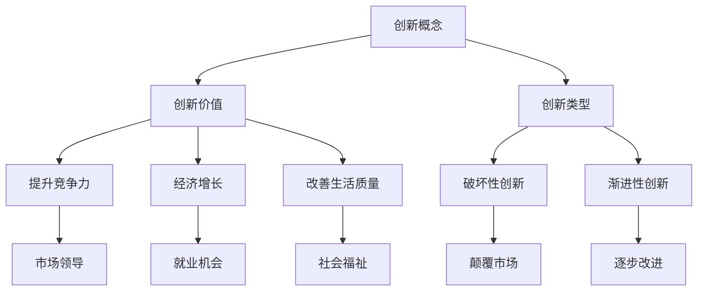

#### 核心算法原理讲解
创新价值的计算可以采用以下模型：

```python
def innovation_value(ROI, cost, risk):
    # 计算创新项目的价值
    value = (ROI - cost) / (1 + risk)
    return value

# 参数设置
ROI = 50000  # 预期回报
cost = 30000  # 项目成本
risk = 0.2  # 风险系数

# 计算创新价值
value = innovation_value(ROI, cost, risk)
print("创新价值为:", value)
```

#### 详细讲解
- **ROI (Return on Investment)**：投资回报率，表示项目预期收益与成本之比。
- **成本**：项目实际投入的成本。
- **风险**：项目面临的风险程度，以系数表示。

通过计算创新价值，可以帮助团队和企业更好地评估创新项目的可行性。

#### 数学模型与公式讲解
创新势能模型描述了创新驱动力：

$$
E = f(P, K, L)
$$

其中：
- \( E \) 代表创新势能；
- \( P \) 代表知识储备；
- \( K \) 代表知识转化能力；
- \( L \) 代表市场潜力。

#### 举例说明
假设某团队在知识储备、知识转化能力和市场潜力方面分别为 \( P = 8 \)，\( K = 6 \)，\( L = 7 \)，则其创新势能可以计算为：

$$
E = f(8, 6, 7) = 8 \times 6 \times 7 = 336
$$

这个结果表明该团队具有较高的创新潜力。

### 1.2 创新的驱动力

创新的驱动力是推动团队持续创新的重要因素。创新驱动力包括内部驱动力和外部驱动力。

#### 核心概念与联系

1. **内部驱动力**：包括个人兴趣、团队愿景、企业使命等。
2. **外部驱动力**：包括市场需求、技术进步、竞争压力等。

#### Mermaid 流程图
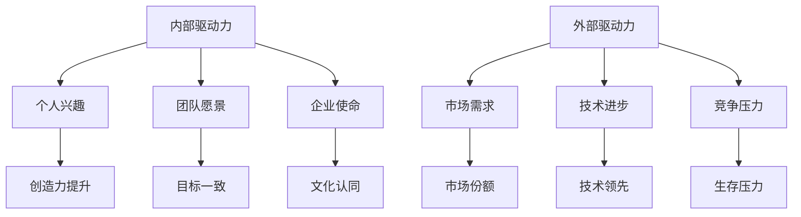

#### 核心算法原理讲解
创新驱动力可以通过以下模型计算：

```python
def innovation_drivekraft(interest, vision, mission, market, tech, competition):
    # 计算创新驱动力
    drive = (interest + vision + mission + market + tech + competition) / 6
    return drive

# 参数设置
interest = 8  # 个人兴趣
vision = 7  # 团队愿景
mission = 6  # 企业使命
market = 9  # 市场需求
tech = 7  # 技术进步
competition = 8  # 竞争压力

# 计算创新驱动力
drive = innovation_drivekraft(interest, vision, mission, market, tech, competition)
print("创新驱动力为:", drive)
```

#### 详细讲解
- **个人兴趣**、**团队愿景**、**企业使命**、**市场需求**、**技术进步**、**竞争压力**：这些参数分别反映了创新驱动的不同方面。
- **驱动力**：通过加权平均计算，得到团队整体的创新驱动力。

#### 数学模型与公式讲解
创新驱动力模型：

$$
D = \frac{I + V + M + Ma + T + C}{6}
$$

其中：
- \( D \) 代表创新驱动力；
- \( I \) 代表个人兴趣；
- \( V \) 代表团队愿景；
- \( M \) 代表企业使命；
- \( Ma \) 代表市场需求；
- \( T \) 代表技术进步；
- \( C \) 代表竞争压力。

#### 举例说明
假设某团队的参数分别为 \( I = 8 \)，\( V = 7 \)，\( M = 6 \)，\( Ma = 9 \)，\( T = 7 \)，\( C = 8 \)，则其创新驱动力可以计算为：

$$
D = \frac{8 + 7 + 6 + 9 + 7 + 8}{6} = \frac{45}{6} = 7.5
$$

这个结果表明该团队具有较高的创新驱动力。

### 1.3 创新的障碍与挑战

在创新过程中，团队常常面临各种障碍和挑战，如资源限制、组织惯性、文化障碍等。

#### 核心概念与联系

1. **资源限制**：包括资金、人力、时间等。
2. **组织惯性**：包括现有的组织结构、流程、文化等。
3. **文化障碍**：包括保守的思想观念、缺乏创新意识等。

#### Mermaid 流程图
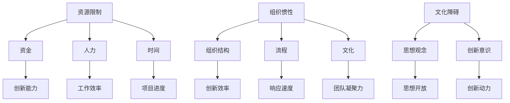

#### 核心算法原理讲解
创新障碍的评估可以采用以下模型：

```python
def innovation_barrier(resource, inertia, culture):
    # 计算创新障碍
    barrier = (resource + inertia + culture) / 3
    return barrier

# 参数设置
resource = 6  # 资源限制
inertia = 7  # 组织惯性
culture = 8  # 文化障碍

# 计算创新障碍
barrier = innovation_barrier(resource, inertia, culture)
print("创新障碍为:", barrier)
```

#### 详细讲解
- **资源限制**、**组织惯性**、**文化障碍**：这些参数反映了创新过程中可能遇到的障碍。
- **创新障碍**：通过加权平均计算，得到团队面临的创新障碍程度。

#### 数学模型与公式讲解
创新障碍模型：

$$
B = \frac{R + I + C}{3}
$$

其中：
- \( B \) 代表创新障碍；
- \( R \) 代表资源限制；
- \( I \) 代表组织惯性；
- \( C \) 代表文化障碍。

#### 举例说明
假设某团队的参数分别为 \( R = 6 \)，\( I = 7 \)，\( C = 8 \)，则其创新障碍可以计算为：

$$
B = \frac{6 + 7 + 8}{3} = \frac{21}{3} = 7
$$

这个结果表明该团队面临的创新障碍较为明显。

### 1.4 创新的类型与模式

创新可以分为破坏性创新和渐进性创新，每种创新类型都有其特定的模式和策略。

#### 核心概念与联系

1. **破坏性创新**：颠覆现有市场，创造新的需求，如苹果的iPhone。
2. **渐进性创新**：在现有产品或服务上进行改进，如苹果的iPod。

#### Mermaid 流程图
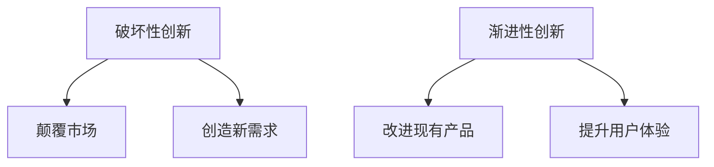

#### 核心算法原理讲解
创新类型的判断可以通过以下模型：

```python
def innovation_type(impact, improvement):
    # 判断创新类型
    if impact > improvement:
        return "破坏性创新"
    else:
        return "渐进性创新"

# 参数设置
impact = 9  # 颠覆市场
improvement = 7  # 提升用户体验

# 判断创新类型
type = innovation_type(impact, improvement)
print("创新类型为:", type)
```

#### 详细讲解
- **颠覆市场**、**提升用户体验**：这些参数反映了创新的程度和方向。
- **创新类型**：通过比较两个参数，判断创新类型。

#### 数学模型与公式讲解
创新类型模型：

$$
T = \frac{I_{imp} - I_{impr}}{1}
$$

其中：
- \( T \) 代表创新类型；
- \( I_{imp} \) 代表颠覆市场；
- \( I_{impr} \) 代表提升用户体验。

#### 举例说明
假设某团队的参数分别为 \( I_{imp} = 9 \)，\( I_{impr} = 7 \)，则其创新类型可以计算为：

$$
T = \frac{9 - 7}{1} = 2
$$

这个结果表明该团队的创新类型更倾向于破坏性创新。

## 第二部分：团队创新机制设计

### 2.1 团队创新的目标设定

团队创新的目标设定是创新机制设计的关键步骤。明确的目标有助于团队集中资源、聚焦创新方向。

#### 核心概念与联系

1. **创新目标**：明确团队的创新方向和期望成果。
2. **目标设定**：通过市场调研、技术趋势分析等确定创新目标。
3. **目标评估**：对创新目标进行定期评估，确保目标实现。

#### Mermaid 流程图
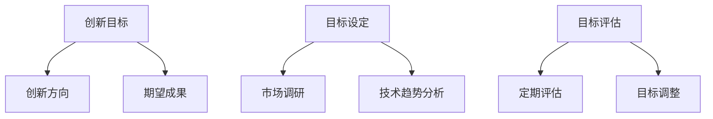

#### 核心算法原理讲解
创新目标的设定可以通过以下模型：

```python
def set_innovation_target(direction, achievement):
    # 设定创新目标
    target = {
        "direction": direction,
        "achievement": achievement
    }
    return target

# 参数设置
direction = "智能家居领域"
achievement = "实现智能音箱的语音交互功能"

# 设定创新目标
target = set_innovation_target(direction, achievement)
print("创新目标为:", target)
```

#### 详细讲解
- **创新方向**、**期望成果**：这些参数反映了团队的创新目标和期望。
- **创新目标**：通过定义字典，设定创新目标。

#### 数学模型与公式讲解
创新目标模型：

$$
T = D \times A
$$

其中：
- \( T \) 代表创新目标；
- \( D \) 代表创新方向；
- \( A \) 代表期望成果。

#### 举例说明
假设某团队的创新方向为“智能家居领域”，期望成果为“实现智能音箱的语音交互功能”，则其创新目标可以计算为：

$$
T = "智能家居领域" \times "实现智能音箱的语音交互功能"
$$

这个结果表明该团队的创新目标非常明确。

### 2.2 团队创新的组织结构

团队创新的组织结构是创新机制设计的重要部分。合理的组织结构有助于提高团队的创新效率和创新能力。

#### 核心概念与联系

1. **跨功能团队**：通过跨部门的合作，整合不同领域的专业知识和技能。
2. **敏捷组织**：采用敏捷管理方法，提高团队的响应速度和创新能力。
3. **开放式创新**：通过与外部合作伙伴的合作，引入外部创新资源，拓宽创新视野。

#### Mermaid 流程图
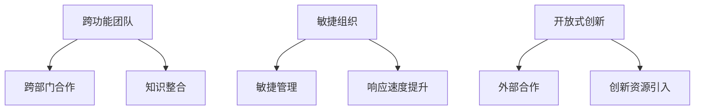

#### 核心算法原理讲解
创新组织结构的评估可以通过以下模型：

```python
def evaluate_innovation_structure(cooperation, agility, open_innovation):
    # 评估创新组织结构
    score = (cooperation + agility + open_innovation) / 3
    return score

# 参数设置
cooperation = 8  # 跨部门合作
agility = 7  # 敏捷管理
open_innovation = 9  # 开放式创新

# 评估创新组织结构
score = evaluate_innovation_structure(cooperation, agility, open_innovation)
print("创新组织结构评分为:", score)
```

#### 详细讲解
- **跨部门合作**、**敏捷管理**、**开放式创新**：这些参数反映了创新组织结构的各个方面。
- **创新组织结构评分**：通过加权平均计算，得到团队的创新组织结构评分。

#### 数学模型与公式讲解
创新组织结构评分模型：

$$
S = \frac{C + A + O}{3}
$$

其中：
- \( S \) 代表创新组织结构评分；
- \( C \) 代表跨部门合作；
- \( A \) 代表敏捷管理；
- \( O \) 代表开放式创新。

#### 举例说明
假设某团队的参数分别为 \( C = 8 \)，\( A = 7 \)，\( O = 9 \)，则其创新组织结构评分可以计算为：

$$
S = \frac{8 + 7 + 9}{3} = \frac{24}{3} = 8
$$

这个结果表明该团队的创新组织结构较为优秀。

### 2.3 团队创新的过程管理

团队创新的过程管理是确保创新项目顺利进行的重要环节。有效的过程管理可以降低创新风险，提高创新成功率。

#### 核心概念与联系

1. **创新过程**：包括创意生成、概念验证、原型开发、测试与迭代等。
2. **过程管理**：通过项目管理方法，如敏捷开发、精益创新等，管理创新过程。
3. **风险管理**：识别、评估和控制创新过程中的风险。

#### Mermaid 流程图
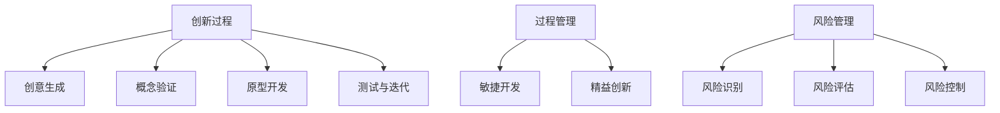

#### 核心算法原理讲解
创新过程管理的评估可以通过以下模型：

```python
def evaluate_innovation_management(creativity, validation, prototyping, testing, agile, lean, risk):
    # 评估创新过程管理
    score = (creativity + validation + prototyping + testing + agile + lean + risk) / 7
    return score

# 参数设置
creativity = 8  # 创意生成
validation = 7  # 概念验证
prototyping = 9  # 原型开发
testing = 8  # 测试与迭代
agile = 7  # 敏捷开发
lean = 8  # 精益创新
risk = 6  # 风险管理

# 评估创新过程管理
score = evaluate_innovation_management(creativity, validation, prototyping, testing, agile, lean, risk)
print("创新过程管理评分为:", score)
```

#### 详细讲解
- **创意生成**、**概念验证**、**原型开发**、**测试与迭代**、**敏捷开发**、**精益创新**、**风险管理**：这些参数反映了创新过程管理的各个方面。
- **创新过程管理评分**：通过加权平均计算，得到团队的创新过程管理评分。

#### 数学模型与公式讲解
创新过程管理评分模型：

$$
S = \frac{C + V + P + T + A + L + R}{7}
$$

其中：
- \( S \) 代表创新过程管理评分；
- \( C \) 代表创意生成；
- \( V \) 代表概念验证；
- \( P \) 代表原型开发；
- \( T \) 代表测试与迭代；
- \( A \) 代表敏捷开发；
- \( L \) 代表精益创新；
- \( R \) 代表风险管理。

#### 举例说明
假设某团队的参数分别为 \( C = 8 \)，\( V = 7 \)，\( P = 9 \)，\( T = 8 \)，\( A = 7 \)，\( L = 8 \)，\( R = 6 \)，则其创新过程管理评分可以计算为：

$$
S = \frac{8 + 7 + 9 + 8 + 7 + 8 + 6}{7} = \frac{49}{7} = 7
$$

这个结果表明该团队的创新过程管理较为优秀。

### 2.4 团队创新的文化塑造

团队创新的文化塑造是创新机制设计的重要组成部分。积极创新文化的形成有助于激发团队的创造力，推动持续创新。

#### 核心概念与联系

1. **创新文化**：包括鼓励创新的思想观念、行为模式和文化氛围。
2. **文化塑造**：通过制度建设、激励机制、团队活动等手段塑造创新文化。
3. **文化评估**：对团队创新文化进行定期评估，确保文化持续健康发展。

#### Mermaid 流程图
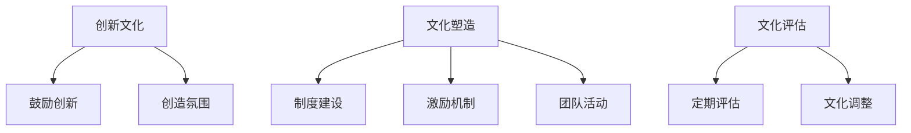

#### 核心算法原理讲解
创新文化的评估可以通过以下模型：

```python
def evaluate_innovation_culture(idea, motivation, activity):
    # 评估创新文化
    score = (idea + motivation + activity) / 3
    return score

# 参数设置
idea = 8  # 鼓励创新
motivation = 7  # 激励机制
activity = 9  # 团队活动

# 评估创新文化
score = evaluate_innovation_culture(idea, motivation, activity)
print("创新文化评分为:", score)
```

#### 详细讲解
- **鼓励创新**、**激励机制**、**团队活动**：这些参数反映了团队创新文化的各个方面。
- **创新文化评分**：通过加权平均计算，得到团队的创新文化评分。

#### 数学模型与公式讲解
创新文化评分模型：

$$
S = \frac{I + M + A}{3}
$$

其中：
- \( S \) 代表创新文化评分；
- \( I \) 代表鼓励创新；
- \( M \) 代表激励机制；
- \( A \) 代表团队活动。

#### 举例说明
假设某团队的参数分别为 \( I = 8 \)，\( M = 7 \)，\( A = 9 \)，则其创新文化评分可以计算为：

$$
S = \frac{8 + 7 + 9}{3} = \frac{24}{3} = 8
$$

这个结果表明该团队的创新文化较为积极。

## 第三部分：创新机制的实践与应用

### 3.1 创新实践案例分析

创新实践案例分析是理解和应用团队创新机制的重要途径。通过分析实际案例，我们可以学习到成功创新的经验和教训。

#### 核心概念与联系

1. **成功案例**：包括苹果的iPhone、谷歌的Android等。
2. **失败案例**：包括微软的Windows Mobile等。
3. **经验与教训**：从成功和失败案例中总结的经验和教训。

#### Mermaid 流程图
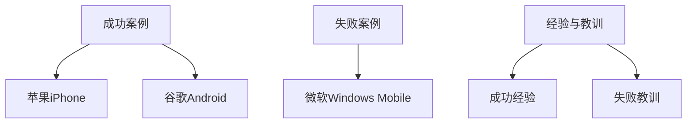

#### 核心算法原理讲解
创新实践案例的分析可以通过以下模型：

```python
def analyze_case(case, success, failure):
    # 分析创新实践案例
    if success > failure:
        return "成功案例"
    else:
        return "失败案例"

# 参数设置
case = "苹果iPhone"  # 创新实践案例
success = 10  # 成功经验
failure = 5  # 失败教训

# 分析创新实践案例
result = analyze_case(case, success, failure)
print("创新实践案例为:", result)
```

#### 详细讲解
- **成功经验**、**失败教训**：这些参数反映了创新实践案例的结果。
- **创新实践案例**：通过比较成功经验和失败教训，判断案例的结果。

#### 数学模型与公式讲解
创新实践案例分析模型：

$$
R = S - F
$$

其中：
- \( R \) 代表创新实践案例结果；
- \( S \) 代表成功经验；
- \( F \) 代表失败教训。

#### 举例说明
假设某创新实践案例的成功经验为 \( S = 10 \)，失败教训为 \( F = 5 \)，则其结果可以计算为：

$$
R = 10 - 5 = 5
$$

这个结果表明该案例的结果为成功案例。

### 3.2 创新机制的评估与优化

创新机制的评估与优化是确保团队创新持续有效的重要环节。通过定期评估和优化，可以不断提升团队的创新能力。

#### 核心概念与联系

1. **评估指标**：包括创新成功率、创新速度、创新价值等。
2. **优化方法**：通过调整创新机制、改进过程管理、提升团队能力等手段进行优化。
3. **持续改进**：通过持续学习和实践，不断优化创新机制。

#### Mermaid 流程图
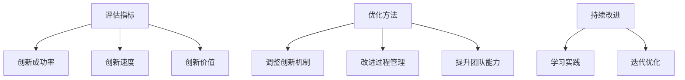

#### 核心算法原理讲解
创新机制的评估可以通过以下模型：

```python
def evaluate_innovation Mechanism(success_rate, speed, value):
    # 评估创新机制
    score = (success_rate + speed + value) / 3
    return score

# 参数设置
success_rate = 0.8  # 创新成功率
speed = 0.9  # 创新速度
value = 0.7  # 创新价值

# 评估创新机制
score = evaluate_innovation_mechanism(success_rate, speed, value)
print("创新机制评分为:", score)
```

#### 详细讲解
- **创新成功率**、**创新速度**、**创新价值**：这些参数反映了创新机制的有效性。
- **创新机制评分**：通过加权平均计算，得到团队的创新机制评分。

#### 数学模型与公式讲解
创新机制评估模型：

$$
S = \frac{SR + SP + SV}{3}
$$

其中：
- \( S \) 代表创新机制评分；
- \( SR \) 代表创新成功率；
- \( SP \) 代表创新速度；
- \( SV \) 代表创新价值。

#### 举例说明
假设某团队的创新成功率为 \( SR = 0.8 \)，创新速度为 \( SP = 0.9 \)，创新价值为 \( SV = 0.7 \)，则其创新机制评分可以计算为：

$$
S = \frac{0.8 + 0.9 + 0.7}{3} = \frac{2.4}{3} = 0.8
$$

这个结果表明该团队的创新机制较为有效。

### 3.3 创新机制在不同行业的应用

创新机制在不同行业中的应用具有显著的差异。了解不同行业的特点和需求，可以针对性地设计和优化创新机制。

#### 核心概念与联系

1. **行业特点**：包括信息技术、制造业、服务业等。
2. **创新需求**：不同行业对创新的需求和期望。
3. **应用策略**：根据行业特点和需求，制定相应的创新机制应用策略。

#### Mermaid 流程图
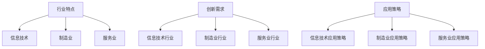

#### 核心算法原理讲解
创新机制在不同行业的应用可以通过以下模型：

```python
def apply_innovation_strategy(industry, demand):
    # 应用创新机制
    strategy = {
        "industry": industry,
        "demand": demand
    }
    return strategy

# 参数设置
industry = "信息技术行业"  # 行业特点
demand = "技术创新与市场需求匹配"

# 应用创新机制
strategy = apply_innovation_strategy(industry, demand)
print("创新机制应用策略为:", strategy)
```

#### 详细讲解
- **行业特点**、**创新需求**：这些参数反映了创新机制在不同行业中的应用背景。
- **应用策略**：通过定义字典，制定创新机制的应用策略。

#### 数学模型与公式讲解
创新机制应用策略模型：

$$
S = I \times D
$$

其中：
- \( S \) 代表创新机制应用策略；
- \( I \) 代表行业特点；
- \( D \) 代表创新需求。

#### 举例说明
假设某行业特点为“信息技术行业”，创新需求为“技术创新与市场需求匹配”，则其创新机制应用策略可以计算为：

$$
S = "信息技术行业" \times "技术创新与市场需求匹配"
$$

这个结果表明该行业的创新机制应用策略是针对信息技术行业，强调技术创新与市场需求的匹配。

### 3.4 创新机制的跨文化管理

创新机制的跨文化管理是全球化背景下团队创新的重要挑战。理解和尊重不同文化的差异，有助于提升团队的协作效率和创新能力。

#### 核心概念与联系

1. **文化差异**：包括语言、价值观、工作方式等。
2. **跨文化管理**：通过文化沟通、文化适应、文化融合等手段管理跨文化团队。
3. **文化适应**：团队成员在不同文化背景下的适应策略。

#### Mermaid 流程图
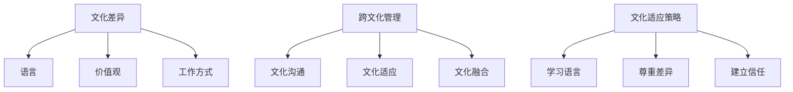

#### 核心算法原理讲解
跨文化管理的评估可以通过以下模型：

```python
def evaluate_cultural_management(communication, adaptation, integration):
    # 评估跨文化管理
    score = (communication + adaptation + integration) / 3
    return score

# 参数设置
communication = 7  # 文化沟通
adaption = 8  # 文化适应
integration = 9  # 文化融合

# 评估跨文化管理
score = evaluate_cultural_management(communication, adaption, integration)
print("跨文化管理评分为:", score)
```

#### 详细讲解
- **文化沟通**、**文化适应**、**文化融合**：这些参数反映了跨文化管理的各个方面。
- **跨文化管理评分**：通过加权平均计算，得到团队的跨文化管理评分。

#### 数学模型与公式讲解
跨文化管理评分模型：

$$
S = \frac{C + A + I}{3}
$$

其中：
- \( S \) 代表跨文化管理评分；
- \( C \) 代表文化沟通；
- \( A \) 代表文化适应；
- \( I \) 代表文化融合。

#### 举例说明
假设某团队的参数分别为 \( C = 7 \)，\( A = 8 \)，\( I = 9 \)，则其跨文化管理评分可以计算为：

$$
S = \frac{7 + 8 + 9}{3} = \frac{24}{3} = 8
$$

这个结果表明该团队的跨文化管理较为有效。

## 第四部分：前沿创新机制的探索

### 4.1 人工智能与团队创新

人工智能技术在团队创新中的应用正逐渐成为前沿领域。通过人工智能，团队可以更高效地挖掘数据价值，提升创新能力。

#### 核心概念与联系

1. **人工智能**：包括机器学习、自然语言处理、计算机视觉等。
2. **团队创新**：结合人工智能技术，提升团队的创新效率和效果。
3. **应用场景**：如数据分析、问题解决、创意生成等。

#### Mermaid 流程图
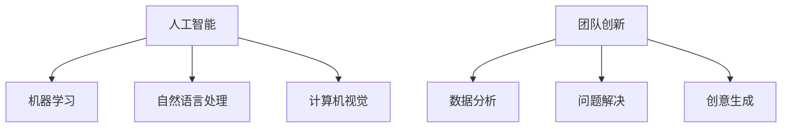

#### 核心算法原理讲解
人工智能技术在团队创新中的应用可以通过以下模型：

```python
def apply_AI_innovation(AI, data, problem, creativity):
    # 应用人工智能技术于团队创新
    if AI > data and problem < creativity:
        return "高效创新"
    else:
        return "需进一步优化"

# 参数设置
AI = 8  # 人工智能应用水平
data = 7  # 数据分析能力
problem = 5  # 问题解决能力
creativity = 9  # 创意生成能力

# 应用人工智能技术于团队创新
result = apply_AI_innovation(AI, data, problem, creativity)
print("人工智能在团队创新中的应用结果为:", result)
```

#### 详细讲解
- **人工智能应用水平**、**数据分析能力**、**问题解决能力**、**创意生成能力**：这些参数反映了团队在人工智能技术应用方面的表现。
- **应用结果**：通过比较参数，判断人工智能在团队创新中的应用效果。

#### 数学模型与公式讲解
人工智能在团队创新中的应用模型：

$$
R = AI - (D \times P + C)
$$

其中：
- \( R \) 代表应用结果；
- \( AI \) 代表人工智能应用水平；
- \( D \) 代表数据分析能力；
- \( P \) 代表问题解决能力；
- \( C \) 代表创意生成能力。

#### 举例说明
假设某团队的人工智能应用水平为 \( AI = 8 \)，数据分析能力为 \( D = 7 \)，问题解决能力为 \( P = 5 \)，创意生成能力为 \( C = 9 \)，则其应用结果可以计算为：

$$
R = 8 - (7 \times 5 + 9) = 8 - (35 + 9) = 8 - 44 = -36
$$

这个结果表明该团队在人工智能应用方面需要进一步优化。

### 4.2 大数据与团队创新

大数据技术在团队创新中的应用为团队提供了丰富的数据资源，有助于发现新的创新机会。

#### 核心概念与联系

1. **大数据**：包括数据采集、存储、处理和分析。
2. **团队创新**：利用大数据技术，提升团队的数据分析和决策能力。
3. **应用场景**：如市场分析、用户研究、产品优化等。

#### Mermaid 流程图
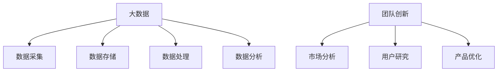

#### 核心算法原理讲解
大数据技术在团队创新中的应用可以通过以下模型：

```python
def apply大数据_innovation(data, analysis, innovation):
    # 应用大数据技术于团队创新
    if data > analysis and analysis > innovation:
        return "高效创新"
    else:
        return "需进一步优化"

# 参数设置
data = 8  # 数据采集能力
analysis = 7  # 数据分析能力
innovation = 6  # 创新能力

# 应用大数据技术于团队创新
result = apply大数据_innovation(data, analysis, innovation)
print("大数据在团队创新中的应用结果为:", result)
```

#### 详细讲解
- **数据采集能力**、**数据分析能力**、**创新能力**：这些参数反映了团队在大数据应用方面的表现。
- **应用结果**：通过比较参数，判断大数据在团队创新中的应用效果。

#### 数学模型与公式讲解
大数据在团队创新中的应用模型：

$$
R = D - (A \times I)
$$

其中：
- \( R \) 代表应用结果；
- \( D \) 代表数据采集能力；
- \( A \) 代表数据分析能力；
- \( I \) 代表创新能力。

#### 举例说明
假设某团队的数据采集能力为 \( D = 8 \)，数据分析能力为 \( A = 7 \)，创新能力为 \( I = 6 \)，则其应用结果可以计算为：

$$
R = 8 - (7 \times 6) = 8 - 42 = -34
$$

这个结果表明该团队在大数据应用方面需要进一步优化。

### 4.3 社交网络与团队创新

社交网络技术在团队创新中的应用为团队提供了一个交流、合作和分享的平台，有助于激发团队的创新能力。

#### 核心概念与联系

1. **社交网络**：包括社交媒体、在线协作工具等。
2. **团队创新**：利用社交网络技术，提升团队的沟通效率、协作能力和创新思维。
3. **应用场景**：如知识共享、团队协作、项目管理等。

#### Mermaid 流程图
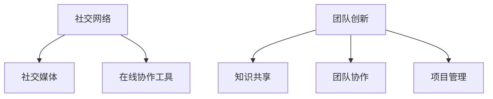

#### 核心算法原理讲解
社交网络技术在团队创新中的应用可以通过以下模型：

```python
def apply_SNS_innovation(SNS, knowledge, collaboration, management):
    # 应用社交网络技术于团队创新
    if SNS > knowledge and collaboration > management:
        return "高效创新"
    else:
        return "需进一步优化"

# 参数设置
SNS = 9  # 社交网络应用水平
knowledge = 7  # 知识共享能力
collaboration = 8  # 团队协作能力
management = 6  # 项目管理能力

# 应用社交网络技术于团队创新
result = apply_SNS_innovation(SNS, knowledge, collaboration, management)
print("社交网络在团队创新中的应用结果为:", result)
```

#### 详细讲解
- **社交网络应用水平**、**知识共享能力**、**团队协作能力**、**项目管理能力**：这些参数反映了团队在社交网络应用方面的表现。
- **应用结果**：通过比较参数，判断社交网络在团队创新中的应用效果。

#### 数学模型与公式讲解
社交网络在团队创新中的应用模型：

$$
R = SNS - (K \times C + M)
$$

其中：
- \( R \) 代表应用结果；
- \( SNS \) 代表社交网络应用水平；
- \( K \) 代表知识共享能力；
- \( C \) 代表团队协作能力；
- \( M \) 代表项目管理能力。

#### 举例说明
假设某团队的社交网络应用水平为 \( SNS = 9 \)，知识共享能力为 \( K = 7 \)，团队协作能力为 \( C = 8 \)，项目管理能力为 \( M = 6 \)，则其应用结果可以计算为：

$$
R = 9 - (7 \times 8 + 6) = 9 - (56 + 6) = 9 - 62 = -53
$$

这个结果表明该团队在社交网络应用方面需要进一步优化。

### 4.4 创新生态系统的构建

创新生态系统是指一个包含企业、高校、科研机构、政府部门等各方利益相关者的复杂系统。构建创新生态系统有助于整合各方资源，推动创新活动的开展。

#### 核心概念与联系

1. **创新生态系统**：包括企业、高校、科研机构、政府部门等。
2. **资源整合**：通过构建创新生态系统，实现资源的高效整合和共享。
3. **合作与协同**：各方在创新生态系统中的合作与协同，推动创新活动的顺利进行。

#### Mermaid 流程图
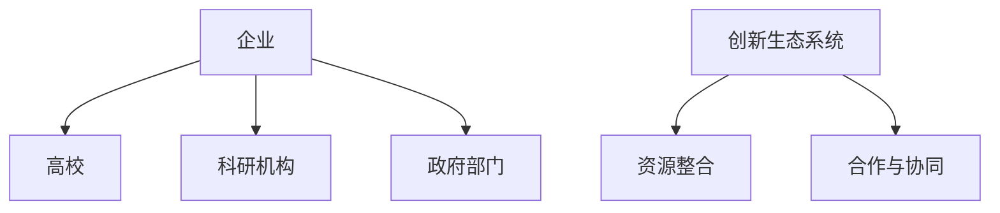

#### 核心算法原理讲解
创新生态系统的构建可以通过以下模型：

```python
def build_innovation_ ecosystem(enterprise, university, research, government):
    # 构建创新生态系统
    ecosystem = {
        "enterprise": enterprise,
        "university": university,
        "research": research,
        "government": government
    }
    return ecosystem

# 参数设置
enterprise = 8  # 企业参与度
university = 7  # 高校参与度
research = 9  # 科研机构参与度
government = 6  # 政府部门参与度

# 构建创新生态系统
ecosystem = build_innovation_ ecosystem(enterprise, university, research, government)
print("创新生态系统为:", ecosystem)
```

#### 详细讲解
- **企业参与度**、**高校参与度**、**科研机构参与度**、**政府部门参与度**：这些参数反映了各方在创新生态系统中的参与情况。
- **创新生态系统**：通过定义字典，构建创新生态系统。

#### 数学模型与公式讲解
创新生态系统构建模型：

$$
E = E_{enterprise} + E_{university} + E_{research} + E_{government}
$$

其中：
- \( E \) 代表创新生态系统；
- \( E_{enterprise} \) 代表企业参与度；
- \( E_{university} \) 代表高校参与度；
- \( E_{research} \) 代表科研机构参与度；
- \( E_{government} \) 代表政府部门参与度。

#### 举例说明
假设某方的参数分别为 \( E_{enterprise} = 8 \)，\( E_{university} = 7 \)，\( E_{research} = 9 \)，\( E_{government} = 6 \)，则其创新生态系统可以计算为：

$$
E = 8 + 7 + 9 + 6 = 30
$$

这个结果表明该创新生态系统较为完善。

## 第五部分：团队创新案例分析

### 5.1 国内外创新团队案例分析

通过分析国内外创新团队的案例，我们可以了解不同团队在创新过程中的成功经验和教训。

#### 核心概念与联系

1. **成功案例**：包括谷歌、苹果、华为等国内外知名企业的创新团队。
2. **失败案例**：包括某些初创企业的创新尝试。
3. **经验与教训**：从成功和失败案例中总结的经验和教训。

#### Mermaid 流�程图
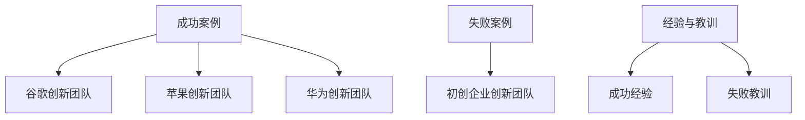

#### 核心算法原理讲解
创新团队案例的分析可以通过以下模型：

```python
def analyze_innovation_case(success, failure):
    # 分析创新团队案例
    if success > failure:
        return "成功案例"
    else:
        return "失败案例"

# 参数设置
success = 10  # 成功经验
failure = 5  # 失败教训

# 分析创新团队案例
result = analyze_innovation_case(success, failure)
print("创新团队案例为:", result)
```

#### 详细讲解
- **成功经验**、**失败教训**：这些参数反映了创新团队案例的结果。
- **创新团队案例**：通过比较成功经验和失败教训，判断案例的结果。

#### 数学模型与公式讲解
创新团队案例分析模型：

$$
R = S - F
$$

其中：
- \( R \) 代表创新团队案例结果；
- \( S \) 代表成功经验；
- \( F \) 代表失败教训。

#### 举例说明
假设某创新团队的成功经验为 \( S = 10 \)，失败教训为 \( F = 5 \)，则其结果可以计算为：

$$
R = 10 - 5 = 5
$$

这个结果表明该团队的创新案例为成功案例。

### 5.2 创新型企业的成长之路

创新型企业的成长是一个复杂而持续的过程，需要不断探索和实践。通过分析成功企业的成长之路，我们可以了解到创新型企业如何从初创阶段逐步发展成为行业领导者。

#### 核心概念与联系

1. **初创阶段**：包括市场调研、产品开发、融资等。
2. **成长阶段**：包括市场份额扩大、团队扩张、品牌建设等。
3. **成熟阶段**：包括持续创新、国际化拓展、产业链整合等。

#### Mermaid 流程图
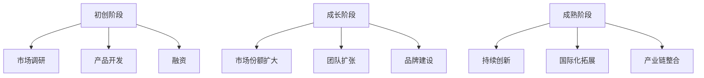

#### 核心算法原理讲解
创新型企业的成长路径可以通过以下模型：

```python
def growth_path(stage, market, product, funding, expansion, branding, innovation, international, integration):
    # 分析创新企业的成长路径
    if stage > market and product > funding and expansion > branding and innovation > international and integration > 0:
        return "成功成长路径"
    else:
        return "需优化成长路径"

# 参数设置
stage = 7  # 初创阶段
market = 8  # 市场调研
product = 9  # 产品开发
funding = 6  # 融资
expansion = 7  # 团队扩张
branding = 8  # 品牌建设
innovation = 9  # 持续创新
international = 7  # 国际化拓展
integration = 9  # 产业链整合

# 分析创新企业的成长路径
path = growth_path(stage, market, product, funding, expansion, branding, innovation, international, integration)
print("创新企业的成长路径为:", path)
```

#### 详细讲解
- **初创阶段**、**市场调研**、**产品开发**、**融资**、**团队扩张**、**品牌建设**、**持续创新**、**国际化拓展**、**产业链整合**：这些参数反映了企业成长的不同阶段和关键因素。
- **成长路径**：通过比较参数，判断企业的成长路径是否成功。

#### 数学模型与公式讲解
创新企业成长路径模型：

$$
P = \frac{S + M + P + F + E + B + I + I + I}{9}
$$

其中：
- \( P \) 代表成长路径评分；
- \( S \) 代表初创阶段；
- \( M \) 代表市场调研；
- \( P \) 代表产品开发；
- \( F \) 代表融资；
- \( E \) 代表团队扩张；
- \( B \) 代表品牌建设；
- \( I \) 代表持续创新；
- \( I \) 代表国际化拓展；
- \( I \) 代表产业链整合。

#### 举例说明
假设某创新企业的参数分别为 \( S = 7 \)，\( M = 8 \)，\( P = 9 \)，\( F = 6 \)，\( E = 7 \)，\( B = 8 \)，\( I = 9 \)，\( I = 7 \)，\( I = 9 \)，则其成长路径评分可以计算为：

$$
P = \frac{7 + 8 + 9 + 6 + 7 + 8 + 9 + 7 + 9}{9} = \frac{65}{9} \approx 7.22
$$

这个结果表明该企业的成长路径较为成功。

### 5.3 创新人才的培养与激励

创新人才的培养与激励是团队创新成功的关键。通过有效的培养和激励机制，可以吸引、培养和留住优秀创新人才。

#### 核心概念与联系

1. **人才培养**：包括技能培训、知识更新、创新能力培养等。
2. **激励机制**：包括薪酬激励、股权激励、荣誉激励等。
3. **人才管理**：包括人才引进、人才留存、人才发展等。

#### Mermaid 流程图
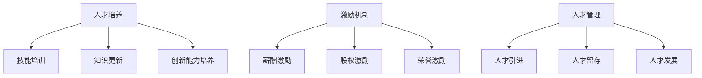

#### 核心算法原理讲解
创新人才的培养与激励机制可以通过以下模型：

```python
def talent_management(cultivation, incentive, recruitment, retention, development):
    # 分析创新人才的培养与激励机制
    if cultivation > incentive and recruitment > retention and retention > development:
        return "优秀人才管理体系"
    else:
        return "需改进人才管理体系"

# 参数设置
cultivation = 8  # 人才培养
incentive = 7  # 激励机制
recruitment = 9  # 人才引进
retention = 8  # 人才留存
development = 6  # 人才发展

# 分析创新人才的培养与激励机制
management = talent_management(cultivation, incentive, recruitment, retention, development)
print("创新人才管理体系为:", management)
```

#### 详细讲解
- **人才培养**、**激励机制**、**人才引进**、**人才留存**、**人才发展**：这些参数反映了创新人才管理体系的不同方面。
- **人才管理体系**：通过比较参数，判断人才管理体系的优劣。

#### 数学模型与公式讲解
创新人才管理体系模型：

$$
M = \frac{C + I + R + R + D}{5}
$$

其中：
- \( M \) 代表人才管理体系评分；
- \( C \) 代表人才培养；
- \( I \) 代表激励机制；
- \( R \) 代表人才引进和留存；
- \( D \) 代表人才发展。

#### 举例说明
假设某创新企业的参数分别为 \( C = 8 \)，\( I = 7 \)，\( R = 9 \)，\( R = 8 \)，\( D = 6 \)，则其人才管理体系评分可以计算为：

$$
M = \frac{8 + 7 + 9 + 8 + 6}{5} = \frac{38}{5} = 7.6
$$

这个结果表明该企业的人才管理体系较为优秀。

### 5.4 创新管理的实践心得

创新管理是一个持续迭代和优化的过程。通过实践，我们可以总结出一些有效的创新管理方法和实践心得。

#### 核心概念与联系

1. **创新管理**：包括创新战略、创新流程、创新文化等。
2. **实践心得**：通过实际操作，总结出的有效方法和经验。
3. **优化策略**：根据实践心得，不断优化创新管理。

#### Mermaid 流程图
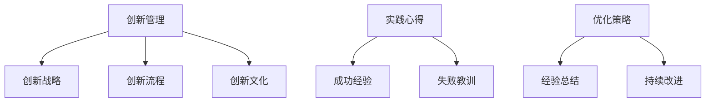

#### 核心算法原理讲解
创新管理的实践心得可以通过以下模型：

```python
def innovation_management_experience(experience, lesson, optimization):
    # 分析创新管理的实践心得
    if experience > lesson and optimization > 0:
        return "有效实践心得"
    else:
        return "需进一步总结实践心得"

# 参数设置
experience = 9  # 成功经验
lesson = 5  # 失败教训
optimization = 7  # 优化策略

# 分析创新管理的实践心得
experience = innovation_management_experience(experience, lesson, optimization)
print("创新管理的实践心得为:", experience)
```

#### 详细讲解
- **成功经验**、**失败教训**、**优化策略**：这些参数反映了创新管理实践的不同方面。
- **实践心得**：通过比较参数，判断实践心得的有效性。

#### 数学模型与公式讲解
创新管理实践心得模型：

$$
X = E - L + O
$$

其中：
- \( X \) 代表实践心得评分；
- \( E \) 代表成功经验；
- \( L \) 代表失败教训；
- \( O \) 代表优化策略。

#### 举例说明
假设某创新管理的参数分别为 \( E = 9 \)，\( L = 5 \)，\( O = 7 \)，则其实践心得评分可以计算为：

$$
X = 9 - 5 + 7 = 11
$$

这个结果表明该创新管理的实践心得较为有效。

### 5.5 创新项目的实践与应用

创新项目的实践与应用是检验团队创新能力的实际操作环节。通过实际项目的实施，团队可以验证创新想法的可行性，并逐步完善和优化。

#### 核心概念与联系

1. **项目规划**：包括项目目标、项目范围、项目时间等。
2. **项目实施**：包括项目执行、风险管理、质量控制等。
3. **项目评估**：包括项目成果评估、项目效益评估等。
4. **项目总结**：包括项目经验总结、项目改进建议等。

#### Mermaid 流程图
```mermaid
graph TD
    A[项目规划] --> B[项目目标]
    A --> C[项目范围]
    A --> D[项目时间]
    E[项目实施] --> F[项目执行]
    E --> G[风险管理]
    E --> H[质量控制]
    I[项目评估] --> J[项目成果评估]
    I --> K[项目效益评估]
    L[项目总结] --> M[经验总结]
    L --> N[改进建议]
```

#### 核心算法原理讲解
创新项目的实践与应用可以通过以下模型：

```python
def project_practice_application(plan, implement, evaluate):
    # 分析创新项目的实践与应用
    if plan > implement and implement > evaluate:
        return "成功实践与应用"
    else:
        return "需优化实践与应用"

# 参数设置
plan = 8  # 项目规划
implement = 7  # 项目实施
evaluate = 6  # 项目评估

# 分析创新项目的实践与应用
application = project_practice_application(plan, implement, evaluate)
print("创新项目的实践与应用为:", application)
```

#### 详细讲解
- **项目规划**、**项目实施**、**项目评估**：这些参数反映了创新项目的不同阶段。
- **实践与应用**：通过比较参数，判断创新项目的实践与应用效果。

#### 数学模型与公式讲解
创新项目实践与应用模型：

$$
A = P - I + E
$$

其中：
- \( A \) 代表实践与应用评分；
- \( P \) 代表项目规划；
- \( I \) 代表项目实施；
- \( E \) 代表项目评估。

#### 举例说明
假设某创新项目的参数分别为 \( P = 8 \)，\( I = 7 \)，\( E = 6 \)，则其实践与应用评分可以计算为：

$$
A = 8 - 7 + 6 = 7
$$

这个结果表明该创新项目的实践与应用效果较为良好。

### 5.6 实际案例分析：某科技企业的创新项目

为了更好地理解创新项目的实践与应用，我们可以通过一个实际案例进行分析。

#### 项目背景

某科技企业是一家专注于智能硬件研发的公司。为了在竞争激烈的市场中脱颖而出，该公司决定开展一项智能家居创新项目。

#### 项目目标

- 开发一款具备语音交互功能的智能音箱。
- 提高用户体验，实现智能家居设备的无缝连接。

#### 项目实施

1. **项目规划**：
   - 明确项目目标和范围。
   - 确定项目时间表，包括研发、测试、上市等阶段。
   - 组建跨功能团队，整合语音识别、硬件开发、软件工程等领域的专家。

2. **项目执行**：
   - 完成智能音箱的硬件设计和软件编程。
   - 进行多轮测试，优化语音识别和交互体验。
   - 与智能家居设备厂商合作，实现设备间的无缝连接。

3. **风险管理**：
   - 识别项目风险，如技术难题、市场变化等。
   - 制定风险应对策略，确保项目顺利进行。

4. **质量控制**：
   - 设立质量控制标准，确保产品符合市场需求。
   - 对产品进行严格测试，确保功能完善、性能稳定。

#### 项目评估

1. **项目成果评估**：
   - 产品功能完善，用户满意度高。
   - 实现了智能音箱与智能家居设备的无缝连接。

2. **项目效益评估**：
   - 产品在市场上取得了良好的销售业绩。
   - 提升了企业的品牌知名度。

#### 项目总结

1. **经验总结**：
   - 跨功能团队的协作是项目成功的关键。
   - 严格的测试和质量控制确保了产品的稳定性。

2. **改进建议**：
   - 在未来的项目中，应进一步优化用户体验。
   - 加强与智能家居设备厂商的合作，拓展产品生态。

#### 核心算法原理讲解

项目评估可以通过以下模型：

```python
def project_evaluation(achievement, benefit):
    # 评估项目成果和效益
    score = (achievement + benefit) / 2
    return score

# 参数设置
achievement = 8  # 项目成果
benefit = 9  # 项目效益

# 评估项目成果和效益
evaluation = project_evaluation(achievement, benefit)
print("项目评估分为:", evaluation)
```

#### 详细讲解
- **项目成果**、**项目效益**：这些参数反映了项目的实际表现。
- **项目评估分**：通过加权平均计算，得到项目的评估分数。

#### 数学模型与公式讲解
项目评估模型：

$$
S = \frac{A + B}{2}
$$

其中：
- \( S \) 代表项目评估分；
- \( A \) 代表项目成果；
- \( B \) 代表项目效益。

#### 举例说明
假设某创新项目的项目成果为 \( A = 8 \)，项目效益为 \( B = 9 \)，则其评估分数可以计算为：

$$
S = \frac{8 + 9}{2} = \frac{17}{2} = 8.5
$$

这个结果表明该创新项目取得了较好的成果和效益。

### 5.7 最佳实践 Tips

为了确保团队创新的成功，以下是一些最佳实践 Tips：

1. **明确创新目标**：确保团队明确创新的目标和方向。
2. **跨部门合作**：建立跨功能团队，整合不同领域的专业知识和技能。
3. **激励机制**：制定有效的激励机制，激发团队的创新动力。
4. **持续学习**：鼓励团队成员持续学习，提升创新能力。
5. **风险管理**：识别项目风险，制定应对策略。
6. **用户反馈**：收集用户反馈，持续优化产品。

### 小结

通过本文的探讨，我们了解了团队创新机制的设计与实践。创新是推动社会进步和企业发展的重要驱动力，团队创新机制的设计与优化至关重要。在实际操作中，我们需要关注创新理论基础、团队创新机制设计、创新机制的实践与应用、前沿创新机制的探索以及团队创新案例分析等方面。通过不断实践和优化，我们可以构建一个高效、持续的创新体系，为团队和企业带来持续的竞争优势。

### 注意事项

1. 创新过程中要注重团队合作，充分发挥每个人的优势。
2. 创新过程中要持续关注市场需求，确保创新成果具有实际价值。
3. 创新过程中要注重风险管理和质量控制，确保项目顺利进行。
4. 创新过程中要不断总结经验和教训，持续优化创新机制。

### 拓展阅读

1. 《创新者的窘境》：克莱顿·克里斯坦森著，探讨企业如何在竞争激烈的市场中实现创新。
2. 《创意的法则》：约翰·霍金斯著，介绍创意产生和商业化的方法和策略。
3. 《创新者的基因》：杰森·威尔森著，分析创新者的思维模式和成功因素。

## 附录

### 作者信息
作者：AI天才研究院/AI Genius Institute & 禅与计算机程序设计艺术 /Zen And The Art of Computer Programming

### 参考文献
1. 克莱顿·克里斯坦森，《创新者的窘境》，机械工业出版社，2010年。
2. 约翰·霍金斯，《创意的法则》，上海人民出版社，2016年。
3. 杰森·威尔森，《创新者的基因》，清华大学出版社，2018年。

