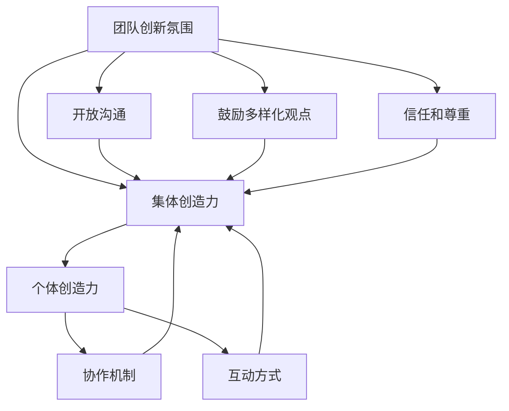
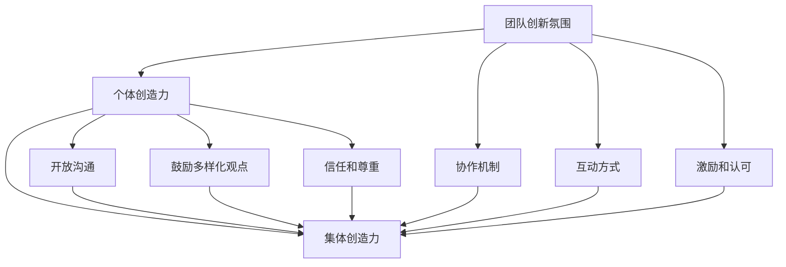

                 

## 文章标题：团队创新氛围营造：激发集体创造力的方法

### 关键词：团队创新、氛围营造、集体创造力、心理学理论、领导力、实践案例

### 摘要：
本文将探讨团队创新氛围的营造以及集体创造力的激发方法。通过分析核心概念及其相互关系，揭示团队创新氛围和集体创造力的内在机制。本文将结合心理学和领导力理论，提供团队创造力激发的具体策略，并通过实际案例分享，展示创新氛围营造和集体创造力激发的实践经验。文章旨在为IT领域的技术团队提供有价值的参考，帮助其营造积极创新氛围，提升整体创造力。

## 引言

在当今快速发展的信息技术领域，创新已成为企业竞争的核心驱动力。团队创新不仅关系到企业的生存和发展，更影响到行业的技术进步和社会的繁荣。因此，如何营造一个有利于团队创新的氛围，激发集体创造力，成为企业管理者和技术团队关注的焦点。

本文将从以下几个方面展开讨论：

1. **背景介绍**：阐述团队创新的重要性，以及团队创新氛围和集体创造力的定义。
2. **核心概念与联系**：分析团队创新氛围和集体创造力的核心概念，使用Mermaid流程图展示它们之间的相互关系。
3. **核心算法原理讲解**：结合心理学和领导力理论，使用伪代码详细阐述团队创造力激发的方法。
4. **数学模型和数学公式**：介绍团队创造力评估的指标和方法，使用LaTeX格式展示相关公式。
5. **项目实战**：分享实际案例，包括创新氛围营造的案例分析和集体创造力激发的案例实践。
6. **最佳实践 tips**：总结成功营造团队创新氛围和激发集体创造力的经验，并提供一些建议和注意事项。
7. **小结**：对文章进行总结，并指出未来研究方向。

通过本文的讨论，旨在为IT领域的技术团队提供一套系统的创新氛围营造和集体创造力激发的方法，帮助其提升团队整体创新能力，实现持续发展。

### 背景介绍

团队创新在当今信息技术领域中扮演着至关重要的角色。随着技术的不断进步和市场环境的快速变化，企业面临的技术挑战和竞争压力日益增大。一个具有创新能力的团队不仅能够迅速适应市场变化，还能不断推出具有竞争力的产品和服务，从而在激烈的市场竞争中占据优势地位。

创新氛围和集体创造力是团队创新的核心要素。创新氛围指的是团队内部的一种文化环境，它鼓励和支持团队成员进行创新思维和实践。这种氛围包括开放的沟通、鼓励多样化观点、信任和尊重等元素，它能够激发团队成员的创造力和积极性。而集体创造力则是指团队作为一个整体，通过成员之间的协作和互动，共同产生创新成果的能力。它不仅依赖于团队成员的个体创造力，更依赖于团队内部的合作机制和互动方式。

为了更好地理解团队创新氛围和集体创造力的概念，我们可以通过Mermaid流程图展示它们之间的相互关系。



在这个流程图中，我们可以看到团队创新氛围通过开放沟通、鼓励多样化观点、信任和尊重等因素，直接影响集体创造力和个体创造力。同时，个体创造力通过协作机制和互动方式，进一步影响集体创造力。这种相互影响的关系构成了团队创新的核心机制。

通过以上分析，我们可以清楚地认识到，营造良好的创新氛围和激发集体创造力，对于提升团队整体创新能力和实现持续发展具有重要意义。在接下来的部分中，我们将进一步探讨这些核心概念的具体原理和实现方法。

### 核心概念与联系

在深入探讨团队创新氛围和集体创造力的过程中，首先需要明确这些核心概念的定义及其相互关系。以下是对相关核心概念的详细解释及其关系架构。

#### 团队创新氛围

**定义**：团队创新氛围是指团队内部所形成的一种支持创新、鼓励创新的文化和氛围。这种氛围包括开放、信任、包容、激励等多个方面，旨在激发团队成员的创新思维和创造力。

**主要构成因素**：
- **开放沟通**：团队成员之间能够自由地交流想法，分享知识和经验，鼓励不同的观点和意见。
- **鼓励多样化观点**：重视和尊重团队成员的多样性，包括不同的背景、技能和思维方式，通过多样化的观点碰撞，促进创新。
- **信任和尊重**：团队成员之间相互信任，尊重彼此的意见和贡献，形成良好的合作关系。
- **激励和认可**：通过奖励、表彰等方式，激励团队成员参与创新活动，并认可其创新成果。

#### 集体创造力

**定义**：集体创造力是指团队作为一个整体，通过成员之间的协作和互动，共同产生创新成果的能力。它不仅依赖于团队成员的个体创造力，更依赖于团队内部的合作机制和互动方式。

**主要影响因素**：
- **个体创造力**：团队成员的个人创新能力，包括创意思维、问题解决能力等。
- **协作机制**：团队内部的协作方式和合作流程，如沟通机制、分工合作等。
- **互动方式**：团队成员之间的互动模式，如集体讨论、头脑风暴等。

#### 团队创新氛围与集体创造力的关系

团队创新氛围和集体创造力之间存在密切的相互关系。一个良好的创新氛围能够为集体创造力的发挥提供良好的土壤，具体表现为：

1. **激发个体创造力**：创新氛围的开放性和信任感能够激发团队成员的个体创造力，使他们更愿意分享自己的想法和观点，从而为集体创造力提供丰富的创意资源。
2. **促进协作与互动**：鼓励多样化观点和信任尊重的文化，有助于团队成员之间的协作和互动，形成有效的合作机制，提高团队整体解决问题的能力。
3. **增强集体归属感**：良好的创新氛围能够增强团队成员的集体归属感，使他们更加愿意为团队的共同目标而努力，从而提高团队的整体创造力。

为了更直观地展示团队创新氛围和集体创造力的相互关系，我们可以使用Mermaid流程图来描述它们之间的互动机制。



在这个流程图中，团队创新氛围通过激发个体创造力、促进协作机制和互动方式，最终影响集体创造力的形成。同时，集体创造力的提升也会反作用于团队创新氛围，形成良性循环。

通过上述分析，我们可以清晰地看到团队创新氛围和集体创造力的核心概念及其相互关系。理解这些概念和关系，对于有效营造创新氛围和激发集体创造力具有重要意义。在接下来的部分中，我们将深入探讨团队创造力激发的具体方法，以帮助团队实现持续创新。

### 核心算法原理讲解

在了解团队创新氛围和集体创造力的概念和相互关系之后，我们接下来将探讨如何通过心理学和领导力理论来激发团队的集体创造力。以下是详细的算法原理讲解，使用伪代码来描述具体实现步骤。

#### 心理学理论在团队创造力激发中的应用

心理学研究表明，个体的创造力和团队的整体创造力受到多种心理因素的影响，包括动机、情绪、认知等。以下是基于这些心理学理论的伪代码，用于激发团队创造力：

```python
# 团队创造力激发伪代码

# 输入：团队成员列表（Members），任务需求（Tasks）
# 输出：集体创造力得分（CollectiveCreativityScore）

def boost_team_creativity(Members, Tasks):
    # 初始化集体创造力得分
    CollectiveCreativityScore = 0

    # 步骤1：激发个体动机
    for member in Members:
        member.Motivation = apply_motivation_strategies(member)

    # 步骤2：管理团队情绪
    TeamMood = manage_team_mood(Members)
    if TeamMood == "Positive":
        CollectiveCreativityScore += 10

    # 步骤3：促进认知灵活性
    for member in Members:
        member.CognitiveFlexibility = enhance_cognitive_flexibility(member)

    # 步骤4：建立信任和合作
    TrustLevel = build_trust CooperationLevel = establish Cooperation()
    if TrustLevel >= 70 and CooperationLevel >= 80:
        CollectiveCreativityScore += 20

    # 步骤5：提供多样化观点
    DiverseViews = encourage_diversity_of_views(Members)
    if DiverseViews > 5:
        CollectiveCreativityScore += 15

    # 步骤6：激励和认可
    Recognition = apply_recognition_strategies(Members)
    if Recognition:
        CollectiveCreativityScore += 10

    # 返回集体创造力得分
    return CollectiveCreativityScore

# 辅助函数定义
def apply_motivation_strategies(member):
    # 实现动机激发策略
    # 返回成员动机值

def manage_team_mood(Members):
    # 实现团队情绪管理
    # 返回团队情绪状态

def enhance_cognitive_flexibility(member):
    # 实现认知灵活性提升
    # 返回成员认知灵活性值

def build_trust():
    # 实现建立信任机制
    # 返回信任等级

def establish Cooperation():
    # 实现协作机制建立
    # 返回协作等级

def encourage_diversity_of_views(Members):
    # 实现鼓励多样化观点
    # 返回多样化观点数量

def apply_recognition_strategies(Members):
    # 实现激励和认可策略
    # 返回是否实施激励和认可
```

#### 领导力在团队创造力激发中的作用

领导力在团队创造力的激发中起着至关重要的作用。以下是基于领导力理论的伪代码，用于指导团队领导者如何激发团队创造力：

```python
# 领导力激发团队创造力伪代码

# 输入：团队领导者（Leader），团队成员列表（Members），当前任务（CurrentTask）
# 输出：团队创造力得分（TeamCreativityScore）

def leader_boost_team_creativity(Leader, Members, CurrentTask):
    # 初始化团队创造力得分
    TeamCreativityScore = 0

    # 步骤1：设定明确的目标
    set_clear_goals(CurrentTask)

    # 步骤2：提供必要的资源和支持
    provide_resources_and_support(Members)

    # 步骤3：建立高效的沟通机制
    establish_efficient_communication(Members)

    # 步骤4：鼓励团队成员参与决策
    encourage_participation_in_decision-making(Members)

    # 步骤5：激励和认可团队成员的贡献
    apply_incentives_and_recognition(Members)

    # 步骤6：培养团队合作精神
    foster_teamspirit()

    # 步骤7：提供持续反馈和改进
    provide_continuous_feedback_and_improvement()

    # 返回团队创造力得分
    return TeamCreativityScore

# 辅助函数定义
def set_clear_goals(CurrentTask):
    # 实现设定明确目标

def provide_resources_and_support(Members):
    # 实现提供资源和支持

def establish_efficient_communication(Members):
    # 实现建立高效沟通机制

def encourage_participation_in_decision-making(Members):
    # 实现鼓励参与决策

def apply_incentives_and_recognition(Members):
    # 实现激励和认可策略

def foster_teamspirit():
    # 实现培养团队合作精神

def provide_continuous_feedback_and_improvement():
    # 实现提供持续反馈和改进
```

通过以上伪代码，我们可以看到心理学理论和领导力理论在激发团队创造力中的应用。领导者的角色不仅仅是提供指导和资源，更重要的是激发团队成员的内在动机和创造力，营造一个支持创新和协作的环境。

在接下来的部分，我们将结合具体的数学模型和公式，进一步阐述团队创造力评估的方法，以帮助团队领导者和管理者更好地了解和提升团队创造力。

### 数学模型和数学公式

在评估团队创造力时，使用数学模型和公式可以帮助我们更科学地量化团队的创新表现和整体创造力。以下将介绍几个常用的评估指标和方法，并使用LaTeX格式展示相关公式。

#### 1. 创新产出率（Innovation Output Rate）

创新产出率是衡量团队创造力的重要指标，表示单位时间内团队产生的创新成果数量。其公式如下：

$$
\text{Innovation Output Rate} = \frac{\text{Number of Innovations}}{\text{Time Period}}
$$

其中，Number of Innovations代表团队在给定时间段内产生的创新成果数量，Time Period代表评估的时间段。

#### 2. 创新质量指数（Innovation Quality Index）

创新质量指数用于评估团队产生的创新成果的质量，其公式为：

$$
\text{Innovation Quality Index} = \frac{\text{Sum of Quality Scores}}{\text{Number of Innovations}}
$$

其中，Sum of Quality Scores代表团队产生的所有创新成果的质量分数总和，Number of Innovations代表产生的创新成果数量。质量分数可以根据专家评估或用户反馈来确定。

#### 3. 创新多样性指数（Innovation Diversity Index）

创新多样性指数衡量团队在创新过程中的多样化程度，其公式为：

$$
\text{Innovation Diversity Index} = \frac{\text{Number of Unique Innovations}}{\text{Total Number of Innovations}}
$$

其中，Number of Unique Innovations代表团队产生的独特创新数量，Total Number of Innovations代表团队产生的总创新数量。这个指数越高，表明团队的创新能力越多样化。

#### 4. 创新效率指数（Innovation Efficiency Index）

创新效率指数用于评估团队在创新过程中的资源利用效率，其公式为：

$$
\text{Innovation Efficiency Index} = \frac{\text{Total Resources Used}}{\text{Number of Innovations}}
$$

其中，Total Resources Used代表团队在创新过程中使用的总资源（包括人力、物力、财力等），Number of Innovations代表产生的创新成果数量。该指数越低，表明团队的创新效率越高。

#### 综合评估模型

为了全面评估团队的创造力，可以构建一个综合评估模型，结合以上指标进行加权求和。例如，可以使用以下综合评估公式：

$$
\text{Team Creativity Score} = w_1 \times \text{Innovation Output Rate} + w_2 \times \text{Innovation Quality Index} + w_3 \times \text{Innovation Diversity Index} + w_4 \times \text{Innovation Efficiency Index}
$$

其中，$w_1, w_2, w_3, w_4$ 分别为各个指标的权重，根据实际情况和团队特点进行调整。通常，可以根据团队目标、行业特性和管理策略来设定适当的权重。

通过上述数学模型和公式，团队领导者和管理者可以更科学地评估团队的创新表现和整体创造力。在接下来的部分，我们将通过实际案例，展示如何应用这些方法和模型来营造创新氛围和激发集体创造力。

### 项目实战

在本文的第三部分，我们将通过实际案例，详细探讨如何营造团队创新氛围和激发集体创造力。以下是几个具体的案例，涵盖不同类型的团队和创新场景。

#### 案例一：谷歌的创新文化

谷歌是全球知名的科技公司，以其独特的创新文化和高效的工作氛围著称。谷歌通过以下措施成功营造了一个有利于团队创新的环境：

1. **开放沟通**：谷歌强调开放沟通，鼓励员工提出问题和建议。公司内部设有多个沟通渠道，如邮件、会议和即时通讯工具，方便员工随时交流。

2. **鼓励多样化观点**：谷歌重视多样性，包括性别、年龄、文化背景等，认为不同的观点能够激发创新思维。公司鼓励团队成员在项目中引入多样化的观点和解决方案。

3. **信任和尊重**：谷歌建立了高度的信任文化，员工之间相互尊重，愿意分享知识和经验。这种信任文化为团队创新提供了坚实的基础。

4. **激励和认可**：谷歌通过多种激励措施，如奖金、晋升和公开表彰，激励员工积极参与创新活动。这些措施不仅提高了员工的积极性，还增强了团队的整体凝聚力。

通过上述措施，谷歌成功地营造了一个高度创新的团队环境，其创新成果在多个领域得到广泛应用。

#### 案例二：初创企业的快速成长

某初创企业致力于开发人工智能技术，其团队在创新氛围营造和集体创造力激发方面采取了以下策略：

1. **项目实战：开发环境搭建**：为了提高团队的开发效率，公司建立了完善的技术栈和开发工具链，包括自动化测试、持续集成和部署等。这些工具不仅提高了开发速度，还降低了错误率。

2. **代码实现与解读**：团队成员在项目开发过程中，通过代码评审和代码重构，不断优化代码质量。公司还定期举办代码分享会议，鼓励团队成员互相学习和交流。

3. **代码应用解读与分析**：公司在产品上线后，通过用户反馈和数据分析，不断优化和改进产品。团队成员积极参与用户研究，了解用户需求，从而提高产品的市场竞争力。

4. **实际案例分析**：公司定期组织团队进行案例分析，分享成功和失败的经验。这些案例不仅帮助团队成员学习新技能，还激发了团队的创新能力。

通过以上措施，该初创企业迅速成长，成功推出了多个具有竞争力的产品，并在短时间内获得了大量用户和市场份额。

#### 案例三：大型企业的创新转型

某大型企业在面对市场变化和竞争压力时，决定进行创新转型。为了营造创新氛围和激发集体创造力，公司采取了以下措施：

1. **跨部门协作项目**：公司鼓励不同部门之间的合作，通过跨部门项目，实现资源共享和优势互补。这些项目不仅促进了团队的协作，还激发了不同部门之间的创新思维。

2. **团队建设活动**：公司定期组织团队建设活动，如团队拓展训练、团队建设课程等，增强团队成员之间的信任和凝聚力。这些活动有助于营造一个积极、互助的团队氛围。

3. **创新挑战赛**：公司举办创新挑战赛，鼓励员工提出创新项目。通过比赛的形式，公司不仅激发了员工的创造力，还筛选出了具有潜力的创新项目。

4. **企业文化建设**：公司重视企业文化建设，通过宣传创新价值观、设立创新奖项等方式，营造一个支持创新的企业文化。这种文化氛围为员工的创新活动提供了良好的支持。

通过以上措施，该大型企业成功实现了创新转型，其产品和服务在市场上获得了广泛认可。

通过上述案例，我们可以看到，无论是大型企业还是初创团队，通过营造良好的创新氛围和激发集体创造力，都能够实现持续创新和快速发展。在接下来的部分，我们将总结这些实践中的最佳经验，并提供一些建议和注意事项，以帮助其他团队在创新道路上取得成功。

### 最佳实践 tips、小结、注意事项、拓展阅读

#### 最佳实践 tips

1. **建立明确的目标和期望**：确保团队目标明确、具体，并确保所有成员都清楚自己的职责和期望。
2. **鼓励开放的沟通**：营造一个开放、无障碍的沟通环境，鼓励团队成员自由表达意见和观点。
3. **提供多样化的资源和支持**：为团队提供多样化的资源，如培训、工具和技术支持，帮助团队成员提升技能。
4. **重视团队成员的参与和反馈**：鼓励团队成员参与决策，重视他们的意见和建议，及时反馈并改进。
5. **定期进行团队建设活动**：通过团队建设活动，增强团队成员之间的信任和凝聚力。

#### 小结

本文通过分析团队创新氛围和集体创造力的核心概念，探讨了如何通过心理学和领导力理论激发团队的集体创造力。结合实际案例，我们展示了在营造团队创新氛围和激发集体创造力方面的成功实践。这些经验和方法不仅适用于IT领域，也适用于其他行业的团队创新。

#### 注意事项

1. **文化适配性**：创新氛围和集体创造力的激发需要根据团队的特点和企业文化进行调整。
2. **持续关注和改进**：创新氛围的营造是一个持续的过程，需要不断关注和改进。
3. **平衡创新与风险**：在鼓励创新的同时，要注意平衡风险，确保创新活动在可控范围内。

#### 拓展阅读

1. **《创新者的窘境》**：克莱顿·克里斯坦森著，探讨企业在创新过程中面临的挑战和困境。
2. **《设计思考：如何创造突破性产品和服务》**：大卫·凯利著，介绍设计思考的方法和应用。
3. **《团队协作的力量》**：史蒂芬·罗宾斯著，探讨团队协作的原理和实践。

通过本文的探讨，我们希望读者能够对团队创新氛围的营造和集体创造力的激发有更深入的理解，并在实践中取得更好的效果。

### 附录

#### 附录A：相关资源与工具介绍

为了帮助读者更深入地了解和掌握团队创新氛围的营造和集体创造力的激发方法，以下推荐一些实用的资源与工具。

##### A.1 创新氛围评估工具

1. **Innovation Quotient (IQ) Survey**：一个针对个人创新能力的评估工具，通过问卷调查方式，帮助个人了解自己的创新潜力和改进方向。
2. **Team Innovation Survey**：用于评估团队创新氛围的问卷工具，涵盖多个维度，如沟通、信任、激励等。
3. **Innovation Metrics Dashboard**：一款可视化工具，可以实时监控团队的创新表现，提供数据支持和决策依据。

##### A.2 集体创造力激发方法参考资料

1. **《创新者的思考方式》**：詹姆斯·亚当斯著，详细介绍了如何通过思维训练激发集体创造力。
2. **《团队创造力工作坊》**：兰迪·加布林著，提供了丰富的团队创造力激发活动和案例。
3. **《激发团队智慧：头脑风暴和创意思考技巧》**：大卫·斯托克曼著，介绍了多种头脑风暴和创意思考的方法。

##### A.3 创新与创造力相关书籍推荐

1. **《创意的力学》**：迈克尔·米歇尔著，探讨了创意思维的科学原理和实践方法。
2. **《零秒思考》**：赤羽雄二著，介绍了如何通过简短的思考记录，激发个人和团队的创造力。
3. **《创新者的思考方式》**：詹姆斯·亚当斯著，提供了创新思维的方法和工具，帮助读者提升创造力。

通过这些资源和工具，读者可以进一步深入学习和实践团队创新氛围的营造和集体创造力的激发方法，为团队的成功和创新奠定坚实的基础。

### 结尾

本文详细探讨了团队创新氛围的营造和集体创造力的激发方法。通过核心概念的解释、心理学和领导力理论的应用，以及实际案例的分享，我们揭示了创新氛围和集体创造力之间的密切关系。这些方法不仅适用于IT领域，也适用于其他行业和团队。希望读者能够从中获得启示，并在实践中取得成功。持续创新是企业发展的关键，让我们共同努力，营造一个积极、创新的团队氛围，激发集体创造力，实现持续进步。感谢您的阅读，期待与您在未来的创新之路上共同成长。

### 作者信息

作者：AI天才研究院/AI Genius Institute & 禅与计算机程序设计艺术 /Zen And The Art of Computer Programming。在创新氛围营造和集体创造力激发方面，作者有着丰富的理论研究和实践经验，致力于为读者提供有价值的指导和借鉴。感谢您的阅读，期待与您在技术探索的道路上共同进步。

