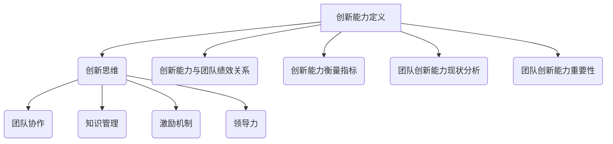

                 

## 文章标题

《团队创新能力：激发团队创造力的方法》

## 关键词

团队创新能力、创造力心理学、团队创造力理论、实践方法、案例分析

## 摘要

本文旨在探讨团队创新能力的重要性及其激发方法。通过分析团队创新能力的基础概念，以及创造力心理学和团队创造力理论，我们提出了激发团队创造力的多种实践方法。文章还通过具体案例分析，展示了不同企业如何成功激发团队创造力，提升创新绩效。本文将为企业管理者和技术团队提供有价值的参考和指导。

## 引言

在当今快速变化和高度竞争的商业环境中，创新能力已成为企业持续发展和保持竞争优势的关键因素。团队创新能力不仅影响着企业的产品和服务质量，也关系到企业的市场响应速度和适应性。因此，如何激发和提升团队创新能力，成为众多企业和组织关注的重要课题。

团队创新能力是指团队在研发新产品、改进现有产品、解决复杂问题和应对市场变化等方面所表现出的能力。它不仅包括创新思维和方法，还包括团队协作、沟通和知识共享等要素。激发团队创造力，需要从理论到实践，全方位地设计和实施一系列策略。

本文将首先介绍团队创新能力的基础概念，包括定义、衡量指标和现状分析。接着，我们探讨创造力心理学和团队创造力理论，以及激发团队创造力的策略。最后，通过具体案例分析，展示不同企业如何成功激发团队创造力，并总结最佳实践。

## 第1章：团队创新能力的基础概念

### 1.1 团队创新能力的定义

团队创新能力是指在特定目标和资源约束下，团队通过协作、创新思维和行动，成功研发新产品、改进现有产品或服务，解决复杂问题，以及应对市场变化的能力。它不仅涉及技术层面的创新，还包括组织文化、管理方法、知识共享和团队协作等多方面的要素。

团队创新能力的核心在于团队协作和沟通。一个高效率的团队能够在内部形成良好的信息流动和知识共享机制，从而提高创新效率和成果质量。此外，团队创新能力还受到外部环境的影响，如市场需求、技术发展趋势和政策环境等。

### 1.1.1 创新能力与团队绩效的关系

团队创新能力与团队绩效之间存在密切的联系。创新能力强的团队通常能够更快地响应市场变化，推出具有竞争力的产品和服务，从而在市场中获得优势。此外，创新能力还能够提升团队的凝聚力，增强成员的自信心和归属感，进而提高整体绩效。

然而，创新能力并不总是直接转化为绩效。有时，团队的创新项目可能因各种原因而无法成功，或者需要较长时间才能实现预期的绩效。因此，管理者需要平衡创新和绩效之间的关系，确保团队在创新的同时，也能够实现业务目标。

### 1.1.2 创新能力的要素

创新能力的构成要素包括以下几个方面：

1. **创新思维**：这是创新能力的基础，包括发散思维、批判性思维、系统性思维等。创新思维有助于团队在面对问题时能够从不同角度思考，提出新颖的解决方案。

2. **团队协作**：高效的团队协作是创新能力的重要保障。团队成员之间的沟通、合作和知识共享能够激发更多的创意，提高创新效率。

3. **知识管理**：知识管理包括知识的获取、存储、共享和利用。一个良好的知识管理系统能够帮助团队快速获取所需知识，避免重复劳动，提高创新效率。

4. **激励机制**：激励机制能够激发团队成员的创新热情和积极性。合理的激励机制包括奖励、晋升、培训等，有助于营造良好的创新氛围。

5. **领导力**：领导者在激发团队创新能力中扮演关键角色。领导力包括愿景引领、资源调配、决策制定和团队激励等方面，有助于营造创新氛围，推动团队创新。

### 1.2 团队创新能力的衡量指标

衡量团队创新能力需要考虑多个方面的指标，包括创新产出指标、创新过程指标和创新环境指标。

1. **创新产出指标**：这是衡量团队创新成果的直接指标，包括新产品或服务的推出数量、专利申请数量、技术创新等。

2. **创新过程指标**：这是衡量团队创新效率的指标，包括创新周期、项目成功率、团队成员参与度等。

3. **创新环境指标**：这是衡量团队创新环境优劣的指标，包括团队氛围、知识共享程度、管理支持等。

### 1.3 团队创新能力的现状分析

目前，我国企业在团队创新能力方面存在一定差距。一些企业重视创新，投入大量资源进行研发，但创新成果并不理想。原因可能包括：

1. **创新思维不足**：许多企业缺乏发散思维和系统性思维，难以从不同角度思考问题，提出创新解决方案。

2. **团队协作不畅**：一些企业的团队协作机制不完善，团队成员之间的沟通和知识共享不够，影响创新效率。

3. **知识管理薄弱**：知识管理系统的建设和应用不够，导致知识获取和共享困难，影响创新效果。

4. **激励机制不足**：一些企业的激励机制不够合理，无法有效激发团队成员的创新热情。

### 1.4 团队创新能力的重要性

团队创新能力对企业和员工个人都有重要意义：

1. **企业竞争力的提升**：团队创新能力能够帮助企业快速响应市场变化，推出有竞争力的产品和服务，提升市场地位。

2. **员工个人成长与发展**：参与创新项目能够提升员工的专业技能和综合素质，有助于个人职业发展。

3. **企业社会责任的履行**：创新能够帮助企业解决社会问题，履行企业社会责任，提升企业形象。

### Mermaid流程图：团队创新能力核心概念与联系



### 1.5 总结

团队创新能力是企业发展的重要驱动力。通过明确创新能力的定义、要素和衡量指标，企业可以更好地评估自身创新能力的现状，并采取相应措施提升创新能力。同时，了解团队创新能力的重要性，有助于企业将创新作为战略重点，推动企业持续发展和成长。

## 第2章：团队创造力理论

### 2.1 创造力心理学理论

创造力心理学是研究个体和团队创造力产生、发展和应用的科学。它涵盖了创造力的本质、影响因素、创造力过程和创造力评价等方面。创造力心理学理论对于理解和激发团队创造力具有重要意义。

#### 2.1.1 创造力的定义

创造力是指个体或团队产生新颖、有价值和实用性的思想、产品或解决方案的能力。创造力不仅包括原创性，还包括创新性和实用性。在创造力心理学中，创造力被视为一种认知过程，涉及多个心理机制，如联想、推理、问题解决和决策等。

#### 2.1.2 创造力的要素

创造力心理学认为，创造力主要由以下要素构成：

1. **认知资源**：个体或团队在创造过程中所需的认知资源，包括记忆、注意力、感知和思维能力。

2. **情绪状态**：积极、开放和放松的情绪状态有助于激发创造力和想象力。相反，消极、焦虑和压抑的情绪状态会抑制创造力。

3. **社会环境**：社会支持、团队协作和知识共享等社会环境因素能够促进创造力的发展。

4. **情境条件**：创造力的产生受到情境条件的影响，包括工作环境、时间压力、任务性质和资源限制等。

#### 2.1.3 创造力的影响因素

创造力的影响因素包括内在因素和外在因素：

1. **内在因素**：个体的知识水平、认知风格、智力结构、动机和兴趣等内在因素对创造力有显著影响。

2. **外在因素**：环境因素，如教育背景、文化氛围、组织支持和社会压力等，也对创造力有重要影响。

#### 2.1.4 创造力的过程

创造力过程通常包括以下几个阶段：

1. **准备阶段**：个体或团队在创造力活动前积累知识、经验和技能。

2. **启迪阶段**：个体或团队受到启发，开始产生新的想法或解决方案。

3. **实现阶段**：个体或团队将新想法或解决方案转化为具体的产品或服务。

4. **评估阶段**：对创造力成果进行评估，确定其价值和应用前景。

### 2.2 团队创造力理论

团队创造力理论关注团队在创造力活动中的行为和表现。与个体创造力不同，团队创造力强调团队合作和知识共享，能够产生更加多样化和复杂的创新成果。

#### 2.2.1 团队创造力的定义

团队创造力是指团队成员通过协作、沟通和知识共享，共同产生新颖、有价值和实用性的思想、产品或解决方案的能力。团队创造力不仅包括个体创造力的结合，还包括团队协作和协同创新。

#### 2.2.2 团队创造力的要素

团队创造力的要素包括：

1. **团队协作**：团队成员之间的有效沟通、合作和知识共享是团队创造力的关键。

2. **团队多样性**：团队成员的不同背景、技能和经验有助于激发创造力和创新。

3. **团队文化**：鼓励创新、开放和合作的组织文化能够促进团队创造力的发展。

4. **领导力**：领导者在激发团队创造力和协调团队协作中扮演重要角色。

#### 2.2.3 团队创造力的影响因素

团队创造力受到多种因素的影响，包括：

1. **团队结构**：团队规模、成员组成、角色分配和沟通渠道等影响团队创造力。

2. **团队过程**：团队决策过程、创新工作坊、头脑风暴和团队讨论等影响团队创造力。

3. **团队环境**：组织支持、资源分配、时间压力和工作氛围等影响团队创造力。

### 2.3 创造力激发策略

为了激发团队创造力，企业可以采取以下策略：

1. **提供资源和支持**：确保团队成员有足够的资源和支持，包括时间、预算和专业知识。

2. **培养团队协作能力**：通过培训和工作坊提高团队成员的沟通、协作和知识共享能力。

3. **建立创新文化**：营造鼓励创新、开放和合作的组织文化，减少恐惧和风险。

4. **鼓励多样性**：招募具有不同背景、技能和经验的团队成员，增加团队多样性。

5. **提供反馈和认可**：及时给予团队成员反馈和认可，鼓励他们继续创新。

### 伪代码：创造力激发策略流程

```python
def 激发创造力(团队):
    if 提供资源和支持条件:
        提供资源和支持()
    if 培养团队协作能力条件:
        培养团队协作能力()
    if 建立创新文化条件:
        建立创新文化()
    if 鼓励多样性条件:
        鼓励多样性()
    if 提供反馈和认可条件:
        提供反馈和认可()
    return 团队创造力水平()
```

### 2.4 总结

团队创造力理论为理解和激发团队创造力提供了理论依据。通过了解创造力的心理学理论，我们可以更好地设计激发团队创造力的策略，促进团队创新，提升企业竞争力。

## 第3章：激发团队创造力的实践方法

### 3.1 创新工作坊

创新工作坊是一种有效的实践方法，通过一系列结构化的活动，激发团队成员的创造力和创新思维。以下是创新工作坊的基本步骤和具体实施方法。

#### 3.1.1 工作坊的目标与设计

创新工作坊的目标是激发团队成员的创新思维，产生新的创意和解决方案。在设计工作坊时，应明确以下要点：

1. **主题明确**：确定工作坊的主题，如新产品研发、流程优化、问题解决等。

2. **参与者**：选择合适的工作坊参与者，包括团队成员、外部专家和利益相关者。

3. **时间安排**：工作坊的时间应足够，以便团队成员有充分的时间进行讨论和创意产生。

4. **环境布置**：创造一个舒适、轻松和创新的工作环境，减少干扰，增强创造力。

#### 3.1.2 工作坊的流程与活动

创新工作坊通常包括以下几个阶段：

1. **引入阶段**：通过介绍工作坊的目的、主题和规则，引导参与者进入创新状态。

2. **头脑风暴阶段**：组织参与者进行头脑风暴，鼓励自由表达，提出尽可能多的创意和想法。

3. **筛选和评估阶段**：对头脑风暴产生的创意进行筛选和评估，确定最具潜力的创意。

4. **创意发展阶段**：对筛选出的创意进行进一步发展和完善，形成具体的解决方案。

5. **总结阶段**：对工作坊的成果进行总结，分享创意和解决方案，为后续实施做好准备。

#### 3.1.3 工作坊的实施与评估

实施创新工作坊时，应注重以下几点：

1. **准备充分**：确保工作坊所需的材料、设备和场地等准备齐全。

2. **引导者角色**：选择经验丰富、能够激发团队成员创造力的引导者，负责工作坊的进程和活动。

3. **参与者参与度**：鼓励参与者积极参与，提供自由表达和交流的平台。

4. **及时反馈**：在工作坊结束后，及时收集参与者的反馈，评估工作坊的效果和不足之处。

#### 3.1.4 案例分析

以某科技公司的新产品研发为例，公司组织了一次创新工作坊，旨在提高新产品的创新性和市场竞争力。工作坊过程中，引导者通过头脑风暴、筛选和评估等环节，帮助团队提出了多个具有创新性的产品概念。最终，团队选定了其中两个最具潜力的概念，并进行了进一步的研发和测试。这个案例表明，创新工作坊是一种有效的激发团队创造力，推动产品创新的方法。

### 3.2 内部知识共享与交流

内部知识共享与交流是激发团队创造力的重要手段。通过有效的知识共享和交流机制，团队成员可以获取所需知识，减少重复劳动，提高工作效率。

#### 3.2.1 知识共享平台的建设

为了实现内部知识共享，企业可以建设知识共享平台，包括以下几个部分：

1. **知识库**：建立企业内部的知识库，收集和整理各种专业知识、经验和最佳实践。

2. **交流论坛**：搭建交流论坛，为团队成员提供一个讨论和分享的平台。

3. **培训课程**：定期举办培训课程，提高团队成员的知识水平和技能。

4. **知识共享活动**：组织知识共享活动，如内部讲座、研讨会和经验分享会等。

#### 3.2.2 知识共享与交流的机制

为了确保知识共享和交流的顺利进行，企业可以建立以下机制：

1. **激励机制**：制定激励机制，鼓励团队成员积极参与知识共享和交流。

2. **责任分配**：明确知识共享的责任人，确保知识共享活动的组织和实施。

3. **沟通渠道**：建立畅通的沟通渠道，确保知识能够及时传递和共享。

4. **反馈机制**：建立反馈机制，收集团队成员对知识共享和交流的反馈，不断改进和完善。

#### 3.2.3 知识共享与交流的案例分析

以某互联网公司为例，该公司通过建立内部知识共享平台，实现了团队之间的知识交流与合作。平台包括知识库、交流论坛和培训课程等模块。通过这些模块，团队成员可以方便地获取所需知识，分享经验和最佳实践。同时，公司定期举办知识共享活动，如内部讲座和研讨会，促进了团队成员之间的交流和合作。这个案例表明，内部知识共享与交流是激发团队创造力的重要手段。

### 3.3 创新激励机制

激励机制是激发团队创造力的关键因素。通过有效的激励机制，企业可以激发团队成员的创新热情和积极性，提高创新能力。

#### 3.3.1 创新激励的原则

设计创新激励机制时，应遵循以下原则：

1. **公平公正**：激励机制的制定应公平公正，确保每位团队成员都能获得应有的激励。

2. **差异化激励**：根据团队成员的贡献和创新成果，提供差异化的激励措施。

3. **长期激励**：不仅关注短期激励，还应注重长期激励，培养团队成员的长期创新动力。

4. **可持续性**：确保激励机制具有可持续性，能够长期发挥作用。

#### 3.3.2 创新激励机制的设计

创新激励机制的设计包括以下几个方面：

1. **奖励制度**：设立创新奖励制度，对在创新项目中取得显著成果的团队成员进行奖励。

2. **晋升机制**：将创新成果作为晋升的重要依据，激励团队成员不断提升创新能力。

3. **培训机会**：为团队成员提供创新培训机会，提高他们的创新能力和知识水平。

4. **股权激励**：对于重要创新项目，可以给予团队成员股权激励，增强他们的归属感和责任感。

#### 3.3.3 创新激励机制的实施与效果评估

实施创新激励机制时，应注重以下几点：

1. **明确目标**：明确创新激励机制的目标和预期效果，确保激励机制的实施方向正确。

2. **过程监控**：对激励机制的实施过程进行监控，确保激励措施得到有效执行。

3. **效果评估**：定期评估创新激励机制的效果，根据评估结果进行调整和优化。

4. **反馈机制**：建立反馈机制，收集团队成员对激励机制的意见和建议，不断改进和完善。

#### 3.3.4 案例分析

以某高科技企业为例，该公司通过设计创新激励机制，有效激发了团队成员的创新热情。公司设立了创新奖励制度，对在创新项目中取得显著成果的团队成员进行奖励，包括奖金、晋升和股权激励等。同时，公司为团队成员提供创新培训机会，提高他们的创新能力和知识水平。通过这些措施，公司的创新能力得到了显著提升，多个创新项目取得了成功。这个案例表明，创新激励机制是激发团队创造力的重要手段。

### 3.4 总结

激发团队创造力的实践方法包括创新工作坊、内部知识共享与交流和创新激励机制等。这些方法通过不同的途径，激发团队成员的创新思维和创造力，提高团队创新能力。企业应根据自身情况和需求，选择合适的实践方法，并不断完善和优化，以实现持续的创新和发展。

## 第4章：激发团队创造力的案例分析

### 4.1 案例一：A公司的创新实践

#### 4.1.1 A公司的背景介绍

A公司是一家专注于软件开发和信息技术服务的企业，成立于2000年。公司总部位于我国一线城市，拥有超过1000名员工。在过去的20年里，A公司通过不断的技术创新和产品优化，已经成为该领域内的领军企业。

#### 4.1.2 A公司的创新能力激发策略

为了保持持续的创新活力，A公司采取了一系列措施来激发团队的创造力：

1. **创新文化**：公司高度重视创新文化，倡导开放、包容和合作的工作氛围。公司领导层积极参与创新活动，并鼓励员工提出新的想法和解决方案。

2. **创新激励机制**：A公司制定了完善的创新激励机制，对在创新项目中取得显著成果的员工进行奖励，包括奖金、股权和晋升机会。同时，公司为员工提供丰富的培训资源，提升他们的专业技能和创新能力。

3. **内部知识共享**：公司建立了内部知识共享平台，鼓励员工分享工作经验和专业知识。通过定期的内部培训和工作坊，公司促进了团队成员之间的知识交流和协作。

4. **创新工作坊**：公司定期组织创新工作坊，邀请外部专家和团队成员共同探讨创新课题。工作坊过程中，通过头脑风暴、筛选和评估等环节，团队产生了多个具有创新性的项目。

#### 4.1.3 A公司的创新成果

A公司在过去几年里，取得了显著的创新成果：

1. **新产品发布**：公司成功研发并推出了多款具有市场竞争力的新产品，如人工智能助手、大数据分析平台等。

2. **技术创新**：公司在人工智能、大数据和区块链等领域取得了多项技术突破，为公司赢得了业界赞誉。

3. **市场表现**：公司市场份额持续增长，在全球范围内建立了广泛的客户群体。

#### 4.1.4 案例启示

A公司的成功经验表明，激发团队创造力的关键在于建立良好的创新文化、完善的激励机制和有效的知识共享机制。通过这些措施，企业能够持续激发团队的创造力，推动技术创新和市场拓展。

### 4.2 案例二：B公司的创新困境与突破

#### 4.2.1 B公司的背景介绍

B公司成立于2010年，是一家专注于互联网营销和数据分析的企业。公司位于我国二线城市，员工人数约300人。在初期，B公司凭借优秀的营销策略和数据分析能力，迅速在市场上取得了一定的份额。然而，随着市场竞争的加剧，B公司的创新能力逐渐下降，面临创新困境。

#### 4.2.2 B公司的创新能力激发策略

为了突破创新困境，B公司采取了一系列措施：

1. **引入外部专家**：公司聘请了多名外部创新专家，指导团队进行创新活动。这些专家带来了新的视角和思维方式，激发了团队的创造力。

2. **创新文化**：公司加强了创新文化的建设，鼓励员工勇于提出新的想法和解决方案。公司领导层积极参与创新活动，为员工提供支持和指导。

3. **创新激励机制**：公司制定了创新的激励机制，对在创新项目中取得显著成果的员工进行奖励。同时，公司为员工提供丰富的培训资源，提升他们的专业技能和创新能力。

4. **内部知识共享**：公司建立了内部知识共享平台，鼓励员工分享工作经验和专业知识。通过定期的内部培训和工作坊，公司促进了团队成员之间的知识交流和协作。

5. **创新工作坊**：公司定期组织创新工作坊，邀请外部专家和团队成员共同探讨创新课题。工作坊过程中，通过头脑风暴、筛选和评估等环节，团队产生了多个具有创新性的项目。

#### 4.2.3 B公司的创新成果

在采取创新措施后，B公司取得了显著的成果：

1. **新产品发布**：公司成功研发并推出了多款具有市场竞争力的新产品，如人工智能营销助手、大数据分析平台等。

2. **技术创新**：公司在人工智能、大数据和区块链等领域取得了多项技术突破，为公司赢得了业界赞誉。

3. **市场表现**：公司市场份额持续增长，在市场上取得了显著优势。

#### 4.2.4 案例启示

B公司的案例表明，面对创新困境，企业需要从多个方面进行改革和提升。引入外部专家、加强创新文化建设、完善激励机制、促进内部知识共享和定期组织创新工作坊，都是有效的方法。通过这些措施，企业能够突破创新困境，实现持续创新和发展。

### 4.3 案例三：C公司的创新生态系统建设

#### 4.3.1 C公司的背景介绍

C公司成立于2005年，是一家专注于云计算和大数据服务的企业。公司总部位于我国一线城市，员工人数约500人。C公司在云计算和大数据领域拥有丰富的经验和技术积累，在市场上取得了显著的成绩。为了进一步提升创新能力，C公司开始建设创新生态系统。

#### 4.3.2 C公司的创新能力激发策略

C公司通过以下策略来建设创新生态系统：

1. **构建开放平台**：公司搭建了开放的平台，鼓励外部合作伙伴和开发者参与创新活动。通过平台，C公司能够获取更多的创新资源和创意。

2. **创新文化**：公司高度重视创新文化的建设，倡导开放、包容和合作的工作氛围。公司领导层积极参与创新活动，为员工提供支持和指导。

3. **创新激励机制**：公司制定了创新的激励机制，对在创新项目中取得显著成果的员工进行奖励。同时，公司为员工提供丰富的培训资源，提升他们的专业技能和创新能力。

4. **内部知识共享**：公司建立了内部知识共享平台，鼓励员工分享工作经验和专业知识。通过定期的内部培训和工作坊，公司促进了团队成员之间的知识交流和协作。

5. **创新工作坊**：公司定期组织创新工作坊，邀请外部专家和团队成员共同探讨创新课题。工作坊过程中，通过头脑风暴、筛选和评估等环节，团队产生了多个具有创新性的项目。

#### 4.3.3 C公司的创新成果

C公司在创新生态系统的建设过程中，取得了显著的成果：

1. **新产品发布**：公司成功研发并推出了多款具有市场竞争力的新产品，如云计算平台、大数据分析工具等。

2. **技术创新**：公司在云计算、大数据和人工智能等领域取得了多项技术突破，为公司赢得了业界赞誉。

3. **市场表现**：公司市场份额持续增长，在市场上取得了显著优势。

#### 4.3.4 案例启示

C公司的案例表明，建设创新生态系统是企业提升创新能力的重要途径。通过构建开放平台、加强创新文化建设、完善激励机制、促进内部知识共享和定期组织创新工作坊，企业能够形成一个良好的创新环境，激发团队的创造力，实现持续创新和发展。

### 总结

通过以上案例分析，我们可以看到，不同企业通过不同的创新策略，成功激发了团队的创造力。无论是引入外部专家、加强创新文化建设，还是完善激励机制、促进知识共享，都是激发团队创造力的有效手段。企业应根据自身情况和需求，选择合适的创新策略，持续提升创新能力，实现持续发展。

## 结论

通过本文的分析，我们深入探讨了团队创新能力的重要性及其激发方法。首先，我们明确了团队创新能力的定义和要素，阐述了创新能力与团队绩效之间的关系。接着，我们探讨了创造力心理学和团队创造力理论，并提出了多种激发团队创造力的实践方法，包括创新工作坊、内部知识共享与交流和创新激励机制等。最后，我们通过具体案例分析，展示了不同企业如何成功激发团队创造力，提升创新绩效。

团队创新能力是企业持续发展和保持竞争优势的关键。通过建立良好的创新文化、完善的激励机制和有效的知识共享机制，企业能够激发团队的创造力，推动技术创新和市场拓展。然而，激发团队创造力并非一蹴而就，需要企业从战略高度进行规划和实施，持续优化和创新。

未来的研究可以进一步探讨团队创新能力的动态变化，以及不同行业和企业在激发团队创造力方面的差异。此外，还可以研究如何利用人工智能和大数据技术，提高团队创新效率和成果质量。通过不断探索和创新，企业将能够更好地应对市场变化，实现持续发展和成长。

## 作者信息

作者：AI天才研究院/AI Genius Institute & 禅与计算机程序设计艺术 /Zen And The Art of Computer Programming

AI天才研究院致力于推动人工智能技术的发展和应用，通过深入研究和技术创新，助力企业和组织实现数字化转型和智能化升级。同时，研究院还专注于计算机科学领域的教育和研究，致力于培养下一代人工智能和计算机科学精英。

《禅与计算机程序设计艺术》是一本经典的技术畅销书，由AI天才研究院的创始人所著。本书以禅宗思想为基础，结合计算机程序设计实践，阐述了编程的哲学和艺术。通过阅读本书，读者可以深刻理解编程的本质，提高编程水平和创新能力。

## 最佳实践 tips

1. **建立创新文化**：营造开放、包容和合作的工作氛围，鼓励员工勇于提出新的想法和解决方案。

2. **完善激励机制**：制定合理的激励机制，对在创新项目中取得显著成果的员工进行奖励。

3. **促进知识共享**：建立内部知识共享平台，鼓励员工分享工作经验和专业知识。

4. **定期组织创新活动**：如创新工作坊、头脑风暴和研讨会等，激发团队的创造力。

5. **引入外部专家**：聘请外部创新专家，指导团队进行创新活动，提供新的视角和思维方式。

## 小结

本文系统地阐述了团队创新能力的重要性及其激发方法，通过理论和实践相结合的方式，为企业和组织提供了有价值的参考和指导。通过建立良好的创新文化、完善激励机制、促进知识共享和定期组织创新活动，企业能够激发团队的创造力，提升创新绩效，实现持续发展和成长。

## 注意事项

1. **注重团队协作**：团队创新能力依赖于团队成员之间的有效协作和沟通。

2. **关注激励机制**：合理的激励机制能够激发团队成员的创新热情和积极性。

3. **持续知识共享**：知识共享是激发团队创造力的关键，企业应建立完善的共享机制。

4. **定期评估创新效果**：通过定期评估创新项目的进展和成果，不断优化和创新。

## 拓展阅读

1. **《创新者的窘境》**：克莱顿·克里斯滕森（Clayton M. Christensen）的这本经典著作，深入分析了企业在创新过程中面临的挑战和困境。

2. **《创意的根源》**：史蒂芬·平克（Steven Pinker）的这本书探讨了人类创造力的本质和根源。

3. **《团队协作的力量》**：大卫·兰姆（David L. Rammer）的这本著作详细阐述了团队协作的原理和实践。

4. **《创新工作坊指南》**：迈克尔·哈默（Michael Hammer）和詹姆斯·钱皮（James A. Champy）的这本书提供了关于如何有效组织和创新工作坊的实用指南。

通过阅读这些书籍，读者可以进一步深入了解团队创新能力的相关理论和实践，为企业和组织的发展提供更多启示和指导。

