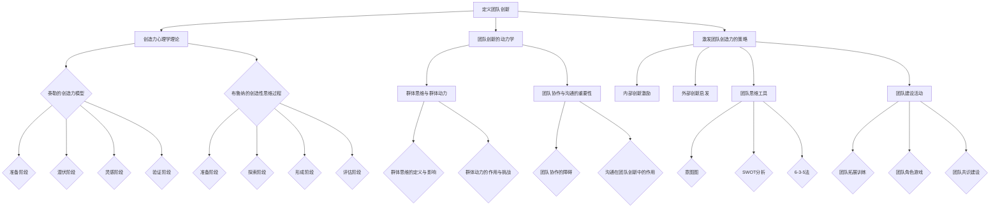

                 


## 文章标题：团队创新：激发集体创造力

### 文章关键词
- 团队创新
- 创造力
- 群体动力学
- 创新策略
- 项目管理
- 成功案例

### 文章摘要
本文旨在探讨团队创新的重要性和如何激发集体创造力。通过分析理论基础、方法和策略，并结合实际案例，我们将了解团队创新的过程、管理和优化。文章将提供实用的技巧和最佳实践，帮助读者在团队中有效推动创新。

## 引言

### 什么是团队创新

团队创新是指在团队协作过程中，通过集体智慧和创造力，解决复杂问题、开发新产品或改进现有流程。与个体创新不同，团队创新强调团队合作和多元化视角，能够更全面地考虑问题，提高解决方案的可行性和成功率。

### 团队创造力的重要性

团队创造力对于组织的成功至关重要。一个富有创造力的团队可以快速适应市场变化，提高竞争力，并持续推动业务增长。此外，团队创造力还能够增强员工的工作满意度和忠诚度，提升团队凝聚力和合作效率。

### 书籍目标和读者群体

本文的目标是为读者提供全面、系统的团队创新指南，帮助读者理解团队创新的概念和重要性，掌握激发团队创造力的方法和策略。读者包括企业管理者、项目经理、团队领导以及任何对团队创新感兴趣的专业人士。

## 理论基础

### 创造力的心理学理论

创造力是团队创新的核心要素。以下介绍两种重要的创造力心理学理论：

#### 泰勒的创造力模型

泰勒的创造力模型认为创造力是一个过程，包括以下几个阶段：

1. **准备阶段**：积累知识、技能和经验。
2. **潜伏阶段**：在潜意识中整合信息，形成初步想法。
3. **灵感阶段**：突然产生创新想法。
4. **验证阶段**：检验和验证创新想法的可行性。

#### 布鲁纳的创造性思维过程

布鲁纳的创造性思维过程包括以下几个步骤：

1. **准备阶段**：明确问题，收集相关信息。
2. **探索阶段**：尝试不同的解决方案，发挥想象力。
3. **形成阶段**：将探索阶段的想法进行整合，形成初步方案。
4. **评估阶段**：评估方案的优缺点，选择最佳方案。

### 团队创新的动力学

团队创新不仅依赖于个人创造力，还受到团队内部动力和外部环境的影响。以下介绍两个关键概念：

#### 群体思维与群体动力

群体思维是指团队成员在讨论问题时，倾向于遵循共识，忽视异议。群体动力则是指团队成员之间的相互作用，包括信任、协作和冲突等。

#### 团队协作与沟通的重要性

团队协作和沟通是团队创新的基础。有效的团队协作和沟通能够促进信息共享，激发创新思维，提高团队解决问题的能力。

## 方法与策略

### 激发团队创造力的策略

#### 内部创新激励

内部创新激励是指通过激发团队成员的内在动机，提高团队创造力。以下是一些有效的方法：

1. **提供自主权**：让团队成员在项目中有更多的自主决策权，激发他们的创新动力。
2. **鼓励失败**：鼓励团队成员在创新过程中尝试新想法，即使失败也无罪。
3. **奖励创新**：设立创新奖励机制，鼓励团队成员积极参与创新活动。

#### 外部创新启发

外部创新启发是指通过引入外部资源、知识和经验，激发团队创造力。以下是一些有效的方法：

1. **参加行业会议和研讨会**：了解行业最新动态，学习其他团队的创新经验。
2. **与外部合作伙伴合作**：引入外部专家和合作伙伴，共同探讨创新解决方案。
3. **参观竞争对手和标杆企业**：了解竞争对手和行业领先企业的创新实践，寻找灵感。

### 团队思维工具

团队思维工具是激发团队创造力的重要手段。以下介绍几种常用的团队思维工具：

#### 意图图

意图图是一种帮助团队明确目标和方向的思维工具。通过绘制意图图，团队可以更好地理解项目的核心目标，并制定相应的创新策略。

#### SWOT分析

SWOT分析是一种用于评估团队优势、劣势、机会和威胁的思维方式。通过SWOT分析，团队可以全面了解自身状况，找到创新的机会和切入点。

#### 6-3-5法

6-3-5法是一种快速产生创新想法的思维方式。团队先列出6个主要目标，然后每个目标分解为3个关键步骤，最后每个步骤再分解为5个具体行动。这种方法有助于团队系统化地开展创新活动。

### 团队建设活动

团队建设活动是激发团队创造力的重要手段。以下介绍几种常见的团队建设活动：

#### 团队拓展训练

团队拓展训练是一种通过户外活动激发团队协作和创造力的训练方式。例如，团队建造挑战、定向越野等，可以提高团队成员之间的信任和沟通能力。

#### 团队角色游戏

团队角色游戏是一种通过模拟真实工作场景，激发团队创造力和解决问题的能力的活动。例如，模拟公司运营、项目管理等，可以让团队成员在模拟环境中体验创新的过程。

#### 团队共识建设

团队共识建设是一种通过讨论、辩论和共识达成，激发团队创造力的活动。例如，头脑风暴、世界咖啡等，可以让团队成员在开放的氛围中分享想法，形成共识。

## 实践与应用

### 成功的团队创新案例

#### 案例一：谷歌的“20%时间”

谷歌的“20%时间”是指员工可以在工作时间的20%内自由探索感兴趣的项目。这种创新机制激发了员工的创造力，产生了许多成功的项目，如Gmail和Google News。

#### 案例二：苹果的iPod创新

苹果公司在iPod的开发过程中，通过团队协作和不断优化，成功地将MP3播放器推向市场。iPod的创新不仅改变了音乐行业，还成为苹果公司盈利的重要来源。

#### 案例三：网飞公司的“失控组织”

网飞公司采用“失控组织”管理模式，允许团队成员自主决策，自由探索创新项目。这种模式激发了团队创造力，推动了公司快速发展。

### 团队创新过程管理

#### 团队创新项目管理

团队创新项目管理是确保团队创新项目顺利进行的关键。以下介绍团队创新项目管理的主要内容：

1. **项目立项**：明确创新项目的目标、范围和时间表。
2. **团队组建**：选择合适的团队成员，建立高效的项目团队。
3. **资源分配**：确保项目所需的资源和预算。
4. **项目监控**：定期评估项目进展，及时调整策略。
5. **项目总结**：对项目过程和成果进行总结，为后续项目提供经验。

#### 团队创新团队的组建与管理

团队创新团队的组建和管理是确保团队创造力持续发挥作用的关键。以下介绍团队创新团队的组建和管理方法：

1. **团队规模**：确保团队规模适中，既能保持高效协作，又能激发创新思维。
2. **成员背景**：选择具有不同背景和技能的团队成员，以促进多元化思维。
3. **角色分工**：明确团队成员的角色和职责，确保团队高效运作。
4. **激励机制**：设立创新奖励机制，激励团队成员积极参与创新活动。
5. **沟通与协作**：建立有效的沟通和协作机制，确保团队内部信息畅通。

#### 团队创新资源的配置

团队创新资源的配置是保障团队创新顺利进行的重要环节。以下介绍团队创新资源的配置方法：

1. **人力配置**：根据项目需求，合理配置团队成员。
2. **时间配置**：确保团队成员有足够的时间进行创新活动。
3. **预算配置**：为创新项目提供充足的预算支持。
4. **技术支持**：为团队成员提供必要的技术支持和工具。
5. **外部资源**：积极寻求外部资源合作，拓展创新空间。

### 团队创新能力的持续发展

#### 团队创新文化的建设

团队创新文化的建设是激发团队创造力的重要保障。以下介绍团队创新文化建设的方法：

1. **鼓励创新**：营造鼓励创新的氛围，让团队成员敢于尝试新想法。
2. **开放沟通**：建立开放、坦诚的沟通机制，促进团队成员之间的信息共享。
3. **共同目标**：明确团队共同目标，激发团队成员的集体荣誉感和责任感。
4. **认可与奖励**：对创新成果进行认可和奖励，提高团队成员的创新积极性。

#### 团队创新能力的提升

团队创新能力的提升是团队持续发展的关键。以下介绍团队创新能力提升的方法：

1. **培训与学习**：定期开展培训和学习活动，提高团队成员的专业技能和创新能力。
2. **知识共享**：建立知识共享平台，促进团队成员之间的知识交流和传递。
3. **跨部门合作**：推动跨部门合作，拓宽团队成员的视野和思维。
4. **创新实践**：鼓励团队成员参与创新实践，将理论知识转化为实际成果。

## 结论

团队创新是组织成功的关键因素，激发集体创造力对于团队的持续发展具有重要意义。本文从理论基础、方法和策略、实践与应用等方面，全面探讨了团队创新的相关问题。通过理解和应用这些方法和策略，团队可以更好地激发集体创造力，推动组织创新和业务增长。

## 附录

### 附录 A：团队创新工具与资源

#### A.1 创新思维工具

- 意图图
- SWOT分析
- 6-3-5法

#### A.2 团队建设活动指南

- 团队拓展训练
- 团队角色游戏
- 团队共识建设

#### A.3 创新研究文献与参考书

- 《创新与企业家精神》作者：彼得·德鲁克
- 《创新者的窘境》作者：克里斯坦森
- 《集体创造力：如何激发团队的无限潜能》作者：安德斯·艾利克森

## 作者信息

作者：AI天才研究院/AI Genius Institute & 禅与计算机程序设计艺术 /Zen And The Art of Computer Programming 

### Mermaid 流程图

以下是关于团队创新过程中的核心概念和原理的Mermaid流程图：



### 核心算法原理讲解

#### 泰勒的创造力模型

伪代码如下：

```python
def Tyler_Creativity_Model():
    prepare_stage()
    latency_stage()
    inspiration_stage()
    verification_stage()

def prepare_stage():
    # 收集知识、技能和经验
    knowledge = collect_knowledge()
    skills = collect_skills()
    experience = collect_experience()

def latency_stage():
    # 在潜意识中整合信息
    integrated_info = integrate_info(knowledge, skills, experience)

def inspiration_stage():
    # 突然产生创新想法
    innovation_idea = generate_idea(integrated_info)

def verification_stage():
    # 检验和验证创新想法的可行性
    feasibility = verify_idea(innovation_idea)
    if feasibility:
        print("创新想法可行")
    else:
        print("创新想法不可行")
```

#### 布鲁纳的创造性思维过程

伪代码如下：

```python
def Bruner_Creativity_Process():
    preparation_stage()
    exploration_stage()
    formation_stage()
    evaluation_stage()

def preparation_stage():
    # 明确问题，收集相关信息
    problem = define_problem()
    related_info = collect_info(problem)

def exploration_stage():
    # 尝试不同的解决方案，发挥想象力
    solutions = explore_solutions(related_info)

def formation_stage():
    # 将探索阶段的想法进行整合，形成初步方案
    initial_solution = integrate_ideas(solutions)

def evaluation_stage():
    # 评估方案的优缺点，选择最佳方案
    best_solution = evaluate_solutions(initial_solution)
    print("最佳方案：", best_solution)
```

### 数学模型和公式

#### SWOT分析模型

SWOT分析是一个用于评估团队优势、劣势、机会和威胁的模型。公式如下：

$$
SWOT = \begin{bmatrix}
    S & W \\
    O & T \\
\end{bmatrix}
$$

其中，$S$ 表示优势，$W$ 表示劣势，$O$ 表示机会，$T$ 表示威胁。

#### 6-3-5法

6-3-5法是一种用于快速产生创新想法的模型。公式如下：

$$
6-3-5 = \begin{cases}
    6 \text{个主要目标} \\
    3 \text{个关键步骤} \\
    5 \text{个具体行动} \\
\end{cases}
$$

### 举例说明

#### 泰勒的创造力模型举例

假设一个团队想要开发一款新型手机应用，可以按照泰勒的创造力模型进行以下步骤：

1. **准备阶段**：收集手机应用开发相关的知识、技能和经验。
2. **潜伏阶段**：在潜意识中整合信息，思考如何开发一款有竞争力的手机应用。
3. **灵感阶段**：突然产生一个创新想法：开发一款基于人工智能的手机应用，可以预测用户需求，提供个性化的服务。
4. **验证阶段**：评估这个创新想法的可行性，通过市场调研、技术评估等手段，确认该想法具有可行性。

#### 布鲁纳的创造性思维过程举例

假设一个团队要解决一个复杂的问题：如何提高生产效率。可以按照布鲁纳的创造性思维过程进行以下步骤：

1. **准备阶段**：明确问题，收集与生产效率相关的信息，如生产线流程、员工工作情况等。
2. **探索阶段**：尝试不同的解决方案，如改进生产线流程、提高员工技能等。
3. **形成阶段**：将探索阶段的想法进行整合，形成初步方案，如优化生产线流程、提供员工培训等。
4. **评估阶段**：评估这些方案的优缺点，选择最佳方案，如优化生产线流程、提供员工培训等。

### 项目实战

#### 开发环境搭建

为了更好地展示团队创新的过程，我们将以开发一个简单的团队协作工具为例，介绍开发环境搭建、源代码实现和代码解读。

1. **开发环境搭建**：
   - 安装Python 3.x版本
   - 安装Django框架
   - 安装SQLite数据库

2. **源代码实现**：

```python
# models.py
from django.db import models

class Task(models.Model):
    title = models.CharField(max_length=200)
    description = models.TextField()
    status = models.CharField(max_length=20)
    created_at = models.DateTimeField(auto_now_add=True)
    updated_at = models.DateTimeField(auto_now=True)
```

```python
# views.py
from django.shortcuts import render
from .models import Task

def task_list(request):
    tasks = Task.objects.all()
    return render(request, 'task_list.html', {'tasks': tasks})
```

```html
<!-- task_list.html -->
<!DOCTYPE html>
<html>
<head>
    <title>Team Collaboration Tool</title>
</head>
<body>
    <h1>Task List</h1>
    
        <div>
            <h2>{{ task.title }}</h2>
            <p>{{ task.description }}</p>
            <p>Status: {{ task.status }}</p>
        </div>
    
</body>
</html>
```

3. **代码解读**：

- `models.py`：定义了任务模型，包括任务标题、描述、状态、创建时间和更新时间等字段。
- `views.py`：定义了任务列表视图，用于获取所有任务并渲染到页面。
- `task_list.html`：定义了任务列表页面的HTML结构，用于展示任务标题、描述和状态。

#### 代码应用解读与分析

通过上述代码实现，我们可以搭建一个简单的团队协作工具。团队可以在这个工具中创建、更新和查看任务。以下是对代码应用的解读和分析：

1. **任务模型**：
   - 任务模型定义了任务的基本属性，如标题、描述和状态。这些属性可以帮助团队跟踪任务的进展情况。
   - 创建时间和更新时间字段记录了任务的相关时间信息，有助于团队了解任务的历史记录。

2. **任务列表视图**：
   - 任务列表视图获取所有任务对象，并将其传递给模板进行渲染。这样可以方便地展示所有任务的信息。
   - 视图函数使用`render`函数将任务列表传递给模板，并返回一个HTML页面。

3. **任务列表页面**：
   - 任务列表页面使用了简单的HTML结构，将每个任务的信息以列表形式展示出来。
   - 模板使用 `` 循环语句遍历任务对象，并输出任务标题、描述和状态。

通过这个简单的团队协作工具示例，我们可以看到团队创新过程中涉及的各个环节，如需求分析、设计、开发和测试。在实际项目中，团队可以根据具体需求进行扩展和优化，提高工具的功能和用户体验。

### 实际案例分析和详细讲解剖析

#### 案例一：谷歌的“20%时间”

谷歌的“20%时间”是指员工可以在工作时间的20%内自由探索感兴趣的项目。这一创新机制激发了员工的创造力，产生了许多成功的项目，如Gmail和Google News。

1. **案例分析**：
   - 谷歌通过“20%时间”鼓励员工自主探索，激发了他们的创造力和创新精神。
   - 通过这一机制，谷歌获得了许多有价值的项目，提升了公司的竞争力。

2. **详细讲解剖析**：
   - “20%时间”为员工提供了一个自主决策的空间，让他们自由探索感兴趣的项目。
   - 谷歌通过提供资源和支持，帮助员工顺利开展项目，提高了项目的成功率。
   - “20%时间”的成功经验为其他公司提供了借鉴，许多企业开始尝试类似的创新机制。

#### 案例二：苹果的iPod创新

苹果公司在iPod的开发过程中，通过团队协作和不断优化，成功地将MP3播放器推向市场。iPod的创新不仅改变了音乐行业，还成为苹果公司盈利的重要来源。

1. **案例分析**：
   - 苹果公司通过团队协作，实现了iPod的快速开发和优化。
   - iPod的成功推动了苹果公司的业务增长，提升了公司在音乐播放器市场的地位。

2. **详细讲解剖析**：
   - 苹果公司的团队在iPod开发过程中，充分沟通、协作，确保项目顺利进行。
   - 团队不断优化iPod的设计和功能，使其成为市场上最受欢迎的MP3播放器之一。
   - 苹果公司的成功经验表明，团队协作和创新是推动企业成功的关键因素。

#### 案例三：网飞公司的“失控组织”

网飞公司采用“失控组织”管理模式，允许团队成员自主决策，自由探索创新项目。这种模式激发了团队创造力，推动了公司快速发展。

1. **案例分析**：
   - 网飞公司通过“失控组织”管理模式，激发了团队的创造力和创新精神。
   - “失控组织”模式帮助网飞公司快速发展，成为流媒体行业的领军企业。

2. **详细讲解剖析**：
   - 网飞公司为团队成员提供了充分的自主权，让他们自由探索创新项目。
   - 公司通过信任和开放沟通，确保团队成员能够顺利开展项目。
   - “失控组织”模式为其他企业提供了借鉴，许多公司开始尝试类似的管理模式。

### 项目小结

通过上述案例分析和详细讲解，我们可以看到团队创新在组织成功中的重要作用。团队创新不仅能够推动企业业务增长，还能提升团队凝聚力和员工满意度。以下是对项目的小结：

1. **团队创新的重要性**：
   - 团队创新是组织成功的关键因素，能够提高企业的竞争力。
   - 团队创新能够激发员工的创造力和工作积极性，提升团队凝聚力。

2. **激发团队创造力的策略**：
   - 提供自主权，鼓励团队成员自由探索。
   - 设立创新奖励机制，激励团队成员积极参与创新活动。
   - 组织团队建设活动，增强团队成员之间的沟通和协作。

3. **团队创新过程管理**：
   - 建立有效的团队创新流程，确保项目顺利进行。
   - 管理团队创新资源，确保项目所需的资源和预算。
   - 定期评估项目进展，及时调整策略。

4. **持续发展团队创新能力**：
   - 建设创新文化，鼓励团队成员敢于尝试新想法。
   - 提供培训和学习机会，提高团队成员的专业技能和创新能力。
   - 促进知识共享，将创新经验应用到实际工作中。

### 最佳实践 Tips

1. **明确团队目标**：确保团队成员对项目目标有清晰的认识，有助于激发团队创造力。

2. **建立信任文化**：建立信任和尊重的氛围，促进团队成员之间的沟通和协作。

3. **鼓励多元化思维**：尊重团队成员的不同意见和观点，有助于形成更全面的解决方案。

4. **提供自主权**：给予团队成员足够的自主权，让他们自由探索和创新。

5. **设立创新奖励机制**：激励团队成员积极参与创新活动，提升团队创造力。

6. **组织团队建设活动**：通过团队建设活动，增强团队成员之间的信任和协作。

7. **持续学习与进步**：鼓励团队成员不断学习新知识、新技能，提升团队整体创新能力。

### 注意事项

1. **避免过度创新**：确保创新活动与团队目标保持一致，避免因过度创新而导致资源浪费。

2. **关注项目进展**：定期评估项目进展，确保项目按计划进行。

3. **合理分配资源**：确保项目所需的资源和预算得到合理分配，避免资源浪费。

4. **尊重团队成员**：尊重团队成员的不同意见和观点，避免因个人偏见导致团队分裂。

5. **避免创新疲劳**：确保团队成员有足够的时间和精力参与创新活动，避免过度劳累。

### 拓展阅读

1. 《创新与企业家精神》作者：彼得·德鲁克
2. 《创新者的窘境》作者：克里斯坦森
3. 《集体创造力：如何激发团队的无限潜能》作者：安德斯·艾利克森

通过阅读这些书籍，可以深入了解团队创新的相关理论和实践，进一步提升团队创新能力。

### 作者信息

作者：AI天才研究院/AI Genius Institute & 禅与计算机程序设计艺术 /Zen And The Art of Computer Programming 

