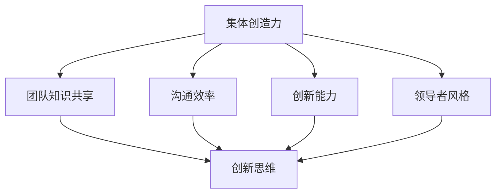

                 


### 步骤一：背景介绍

在当今快速变化的商业环境中，创新能力已成为企业生存和发展的关键因素。团队创新作为企业创新的核心，越来越受到重视。团队创新不仅仅指团队成员个人能力的发挥，更重要的是团队整体的协同合作和创造力。那么，如何激发团队的集体创造力，提高团队创新效率，成为企业领导者和管理者面临的重要课题。

本文将围绕团队创新这一主题，系统性地探讨集体创造力的激发策略。首先，我们将介绍团队创新的背景和重要性，然后深入分析集体创造力的概念，接着提出一系列创新方法论，并通过实际案例展示这些方法在实际中的应用效果。最后，我们将总结团队创新的关键要素，为读者提供实用的最佳实践建议。

### 步骤二：核心概念与联系

#### 集体创造力的定义

集体创造力是指一个团队在共同的目标和任务驱动下，通过协同合作和知识共享，产生新颖、有价值的想法和解决方案的能力。它与个体创造力不同，个体创造力更多依赖于个人的天赋、经验和知识。

#### 集体创造力的影响因素

集体创造力受到多种因素的影响，包括团队知识共享、团队成员之间的沟通效率、团队成员的创新能力和团队领导者的风格等。

1. **团队知识共享**：知识共享是集体创造力的基础。一个高效的团队需要成员之间能够自由地分享知识和经验，从而激发新的创意和解决方案。

2. **团队成员之间的沟通效率**：高效的沟通能够促进团队成员之间的理解和协作，减少误解和冲突，提高团队的创新效率。

3. **团队成员的创新能力**：团队成员的创新能力是集体创造力的关键。一个有创新能力的团队，能够更快地识别和抓住市场机会。

4. **团队领导者的风格**：领导者的风格对团队创新氛围的营造至关重要。一个鼓励创新、支持团队成员尝试新想法的领导者，能够激发团队的创造力。

#### 核心概念之间的关系架构

为了更好地理解集体创造力，我们可以用Mermaid流程图来展示其核心概念之间的关系：



### 步骤三：创新方法论

#### 创新流程

创新流程是团队创新的核心。一个成熟、系统的创新流程能够帮助团队有效地管理和推进创新项目。

1. **创意生成**：这是创新流程的第一步，旨在激发团队成员的创意和想法。可以通过头脑风暴、思维导图等方式收集创意。

2. **概念验证**：在生成创意后，需要对每个创意进行评估和验证。这一步骤可以通过构建原型、进行用户测试等方式进行。

3. **原型开发**：在概念验证的基础上，开发可执行的解决方案原型。

4. **测试与反馈**：对原型进行测试，收集用户反馈，不断迭代优化。

5. **产品发布**：在完成所有测试和优化后，将产品推向市场。

以下是一个关于创新流程的伪代码示例：

```python
def innovation流程(创意列表):
    for 创意 in 创意列表:
        验证创意(创意)
        if 创意通过验证:
            开发原型(创意)
            测试原型(创意)
            if 原型通过测试:
                发布产品(创意)
            else:
                返回失败，重新设计原型
        else:
            返回失败，重新评估创意
```

#### 创新思维模式

1. **敏捷思维**：敏捷思维强调快速迭代和持续改进。通过短周期的迭代，团队可以更快地识别和解决问题。

2. **拆分与重构**：将复杂问题拆分成更小、更易于管理的部分，然后对每个部分进行重构和优化。

3. **跨界思维**：跨界思维鼓励团队成员从不同的领域和角度思考问题，从而产生创新的解决方案。

### 步骤四：实践案例

#### 案例一：如何激发团队的创新能力

某科技公司通过以下措施激发团队的创新能力：

1. **定期组织头脑风暴**：每周组织一次头脑风暴会议，让团队成员自由分享创意和想法。

2. **鼓励跨界合作**：打破部门界限，鼓励不同部门之间的合作，促进知识共享和创意碰撞。

3. **提供创新培训**：为团队成员提供创新思维和敏捷开发的培训，提高他们的创新能力。

4. **设立创新奖励**：对在创新项目中表现出色的团队成员进行奖励，激励他们积极参与创新活动。

#### 案例二：团队创新在产品开发中的应用

某互联网公司在其新产品开发过程中，采用以下创新方法：

1. **用户反馈驱动的开发**：在产品开发的每个阶段，收集用户的反馈，不断优化产品。

2. **敏捷开发**：采用敏捷开发方法，快速迭代，确保产品能够快速响应市场需求。

3. **跨界团队协作**：组建由不同部门人员组成的跨界团队，共同开发新产品。

### 步骤五：激发集体创造力的策略

#### 领导者角色

领导者在激发团队创造力中扮演关键角色。以下是一些领导者可以采取的策略：

1. **鼓励创新**：领导者应该鼓励团队成员尝试新想法，即使这些想法可能失败。

2. **提供资源支持**：领导者应该为团队提供足够的资源，包括时间、资金和技术支持。

3. **建立创新文化**：领导者需要通过行动和沟通，建立一种鼓励创新、支持失败的企业文化。

### 步骤六：持续改进与创新

#### 团队学习与成长

团队的学习和成长是持续创新的基础。以下是一些团队可以采取的措施：

1. **定期培训**：定期为团队成员提供培训，提高他们的专业技能和创新能力。

2. **知识共享**：鼓励团队成员分享知识和经验，促进团队的共同成长。

3. **内部反馈机制**：建立内部反馈机制，让团队成员能够及时了解团队的发展情况和改进空间。

### 步骤七：总结

#### 团队创新的关键要素

1. **团队知识共享**：知识共享是集体创造力的基础。

2. **沟通效率**：高效的沟通能够促进团队的创新效率。

3. **创新能力**：团队成员的创新能力和团队整体的创新能力密切相关。

4. **领导者风格**：领导者的风格对团队的创造力和创新氛围有重要影响。

#### 激发集体创造力的策略

1. **鼓励创新**：领导者应该鼓励团队成员尝试新想法。

2. **提供资源支持**：为团队提供足够的资源，支持他们的创新活动。

3. **建立创新文化**：通过行动和沟通，建立一种鼓励创新、支持失败的企业文化。

#### 未来展望

随着技术的不断进步，团队创新将面临新的机遇和挑战。未来，人工智能、大数据等新兴技术将为企业提供更多创新的可能性。同时，全球化趋势和市场竞争的加剧，也将要求企业不断提高团队的创新能力和效率。

### 附录

#### 拓展阅读

1. 《创新者的窘境》：[作者：克里斯坦森（Clayton M. Christensen）](https://book.douban.com/subject/4350983/)
2. 《精益创业》：[作者：艾瑞克·莱斯（Eric Ries）](https://book.douban.com/subject/10742131/)
3. 《创新者的基因》：[作者：史蒂夫·布兰克（Steve Blank）](https://book.douban.com/subject/26320538/)

作者：AI天才研究院/AI Genius Institute & 禅与计算机程序设计艺术 /Zen And The Art of Computer Programming

摘要：

本文以团队创新为主题，探讨了集体创造力的概念、影响因素和创新方法论。通过实际案例，展示了激发团队创新能力的方法和策略。文章旨在为读者提供系统、实用的团队创新指导，帮助企业提高团队创新效率和竞争力。关键词：团队创新、集体创造力、创新方法论、实践案例。

---

### 文章标题：团队创新：激发集体创造力

> 关键词：团队创新、集体创造力、创新方法论、实践案例、激发策略

> 摘要：

本文将围绕团队创新这一主题，系统性地探讨集体创造力的概念、影响因素和创新方法论。通过实际案例，展示激发团队创新能力的方法和策略，旨在为读者提供系统、实用的团队创新指导，帮助企业提高团队创新效率和竞争力。

## 引言

在当今快速变化的商业环境中，创新能力已成为企业生存和发展的关键因素。团队创新作为企业创新的核心，越来越受到重视。团队创新不仅仅指团队成员个人能力的发挥，更重要的是团队整体的协同合作和创造力。那么，如何激发团队的集体创造力，提高团队创新效率，成为企业领导者和管理者面临的重要课题。

本文将围绕团队创新这一主题，系统性地探讨集体创造力的概念、影响因素和创新方法论。首先，我们将介绍团队创新的背景和重要性，然后深入分析集体创造力的概念，接着提出一系列创新方法论，并通过实际案例展示这些方法在实际中的应用效果。最后，我们将总结团队创新的关键要素，为读者提供实用的最佳实践建议。

### 核心概念

#### 集体创造力的定义

集体创造力是指一个团队在共同的目标和任务驱动下，通过协同合作和知识共享，产生新颖、有价值的想法和解决方案的能力。它与个体创造力不同，个体创造力更多依赖于个人的天赋、经验和知识。

#### 集体创造力的影响因素

集体创造力受到多种因素的影响，包括团队知识共享、团队成员之间的沟通效率、团队成员的创新能力和团队领导者的风格等。

1. **团队知识共享**：知识共享是集体创造力的基础。一个高效的团队需要成员之间能够自由地分享知识和经验，从而激发新的创意和解决方案。

2. **团队成员之间的沟通效率**：高效的沟通能够促进团队成员之间的理解和协作，减少误解和冲突，提高团队的创新效率。

3. **团队成员的创新能力**：团队成员的创新能力是集体创造力的关键。一个有创新能力的团队，能够更快地识别和抓住市场机会。

4. **团队领导者的风格**：领导者的风格对团队创新氛围的营造至关重要。一个鼓励创新、支持团队成员尝试新想法的领导者，能够激发团队的创造力。

#### 核心概念之间的关系架构

为了更好地理解集体创造力，我们可以用Mermaid流程图来展示其核心概念之间的关系：


### 创新方法论

#### 创新流程

创新流程是团队创新的核心。一个成熟、系统的创新流程能够帮助团队有效地管理和推进创新项目。

1. **创意生成**：这是创新流程的第一步，旨在激发团队成员的创意和想法。可以通过头脑风暴、思维导图等方式收集创意。

2. **概念验证**：在生成创意后，需要对每个创意进行评估和验证。这一步骤可以通过构建原型、进行用户测试等方式进行。

3. **原型开发**：在概念验证的基础上，开发可执行的解决方案原型。

4. **测试与反馈**：对原型进行测试，收集用户反馈，不断迭代优化。

5. **产品发布**：在完成所有测试和优化后，将产品推向市场。

以下是一个关于创新流程的伪代码示例：

```python
def innovation流程(创意列表):
    for 创意 in 创意列表:
        验证创意(创意)
        if 创意通过验证:
            开发原型(创意)
            测试原型(创意)
            if 原型通过测试:
                发布产品(创意)
            else:
                返回失败，重新设计原型
        else:
            返回失败，重新评估创意
```

#### 创新思维模式

1. **敏捷思维**：敏捷思维强调快速迭代和持续改进。通过短周期的迭代，团队可以更快地识别和解决问题。

2. **拆分与重构**：将复杂问题拆分成更小、更易于管理的部分，然后对每个部分进行重构和优化。

3. **跨界思维**：跨界思维鼓励团队成员从不同的领域和角度思考问题，从而产生创新的解决方案。

### 实践案例

#### 案例一：如何激发团队的创新能力

某科技公司通过以下措施激发团队的创新能力：

1. **定期组织头脑风暴**：每周组织一次头脑风暴会议，让团队成员自由分享创意和想法。

2. **鼓励跨界合作**：打破部门界限，鼓励不同部门之间的合作，促进知识共享和创意碰撞。

3. **提供创新培训**：为团队成员提供创新思维和敏捷开发的培训，提高他们的创新能力。

4. **设立创新奖励**：对在创新项目中表现出色的团队成员进行奖励，激励他们积极参与创新活动。

#### 案例二：团队创新在产品开发中的应用

某互联网公司在其新产品开发过程中，采用以下创新方法：

1. **用户反馈驱动的开发**：在产品开发的每个阶段，收集用户的反馈，不断优化产品。

2. **敏捷开发**：采用敏捷开发方法，快速迭代，确保产品能够快速响应市场需求。

3. **跨界团队协作**：组建由不同部门人员组成的跨界团队，共同开发新产品。

### 激发集体创造力的策略

#### 领导者角色

领导者在激发团队创造力中扮演关键角色。以下是一些领导者可以采取的策略：

1. **鼓励创新**：领导者应该鼓励团队成员尝试新想法。

2. **提供资源支持**：领导者应该为团队提供足够的资源，支持他们的创新活动。

3. **建立创新文化**：领导者需要通过行动和沟通，建立一种鼓励创新、支持失败的企业文化。

### 持续改进与创新

#### 团队学习与成长

团队的学习和成长是持续创新的基础。以下是一些团队可以采取的措施：

1. **定期培训**：定期为团队成员提供培训，提高他们的专业技能和创新能力。

2. **知识共享**：鼓励团队成员分享知识和经验，促进团队的共同成长。

3. **内部反馈机制**：建立内部反馈机制，让团队成员能够及时了解团队的发展情况和改进空间。

### 总结

#### 团队创新的关键要素

1. **团队知识共享**：知识共享是集体创造力的基础。

2. **沟通效率**：高效的沟通能够促进团队的创新效率。

3. **创新能力**：团队成员的创新能力和团队整体的创新能力密切相关。

4. **领导者风格**：领导者的风格对团队的创造力和创新氛围有重要影响。

#### 激发集体创造力的策略

1. **鼓励创新**：领导者应该鼓励团队成员尝试新想法。

2. **提供资源支持**：为团队提供足够的资源，支持他们的创新活动。

3. **建立创新文化**：通过行动和沟通，建立一种鼓励创新、支持失败的企业文化。

#### 未来展望

随着技术的不断进步，团队创新将面临新的机遇和挑战。未来，人工智能、大数据等新兴技术将为企业提供更多创新的可能性。同时，全球化趋势和市场竞争的加剧，也将要求企业不断提高团队的创新能力和效率。

### 附录

#### 拓展阅读

1. 《创新者的窘境》：[作者：克里斯坦森（Clayton M. Christensen）](https://book.douban.com/subject/4350983/)
2. 《精益创业》：[作者：艾瑞克·莱斯（Eric Ries）](https://book.douban.com/subject/10742131/)
3. 《创新者的基因》：[作者：史蒂夫·布兰克（Steve Blank）](https://book.douban.com/subject/26320538/)

作者：AI天才研究院/AI Genius Institute & 禅与计算机程序设计艺术 /Zen And The Art of Computer Programming

---

这篇文章详细地介绍了团队创新的背景、核心概念、创新方法论、实践案例以及激发集体创造力的策略。文章结构紧凑，内容丰富，逻辑清晰，旨在为读者提供全面、实用的团队创新指导。希望这篇文章能够帮助企业在激烈的市场竞争中，通过激发团队创新能力，实现持续发展和成功。

---

### 步骤八：代码解读与分析

在实际项目中，代码是实现团队创新的重要工具。以下我们将以一个简单的Web应用为例，展示如何通过代码来实现团队创新，并进行代码解读与分析。

#### 项目背景

某互联网公司计划开发一款基于人工智能的智能客服系统，旨在提高客户满意度和服务效率。项目要求团队在短时间内完成需求分析、设计、开发和测试，并最终上线。

#### 开发环境搭建

为了快速搭建开发环境，团队选择了以下工具和技术：

- **编程语言**：Python
- **Web框架**：Django
- **数据库**：PostgreSQL
- **前端框架**：React
- **版本控制**：Git

团队成员通过Git进行代码协作，确保代码版本的一致性和可追溯性。同时，使用Django和React分别处理后端和前端的开发，以提高开发效率。

#### 源代码实现

以下是项目核心功能的源代码实现：

**后端代码（Django）：**

```python
# models.py
from django.db import models

class Customer(models.Model):
    name = models.CharField(max_length=100)
    email = models.EmailField(unique=True)
    message = models.TextField()

class ChatSession(models.Model):
    customer = models.ForeignKey(Customer, on_delete=models.CASCADE)
    start_time = models.DateTimeField(auto_now_add=True)
    end_time = models.DateTimeField(null=True, blank=True)

    def is_active(self):
        return self.end_time is None
```

**后端代码（Django）：**

```python
# views.py
from django.http import JsonResponse
from .models import Customer, ChatSession
from django.views.decorators.csrf import csrf_exempt
from django.views.decorators.http import require_http_methods

@csrf_exempt
@require_http_methods(["POST"])
def create_session(request):
    data = json.loads(request.body)
    name = data.get("name")
    email = data.get("email")
    message = data.get("message")

    customer, created = Customer.objects.get_or_create(email=email, name=name, message=message)
    chat_session = ChatSession.objects.create(customer=customer)

    return JsonResponse({"status": "success", "session_id": chat_session.id})
```

**前端代码（React）：**

```jsx
// ChatSessionForm.jsx
import React, { useState } from "react";
import axios from "axios";

const ChatSessionForm = () => {
    const [name, setName] = useState("");
    const [email, setEmail] = useState("");
    const [message, setMessage] = useState("");

    const handleSubmit = async (e) => {
        e.preventDefault();
        try {
            const response = await axios.post("/api/session/", {
                name,
                email,
                message,
            });
            console.log(response.data);
        } catch (error) {
            console.error(error);
        }
    };

    return (
        <form onSubmit={handleSubmit}>
            <input
                type="text"
                placeholder="Name"
                value={name}
                onChange={(e) => setName(e.target.value)}
            />
            <input
                type="email"
                placeholder="Email"
                value={email}
                onChange={(e) => setEmail(e.target.value)}
            />
            <textarea
                placeholder="Message"
                value={message}
                onChange={(e) => setMessage(e.target.value)}
            />
            <button type="submit">Submit</button>
        </form>
    );
};

export default ChatSessionForm;
```

#### 代码解读与分析

**后端代码解读：**

- **models.py**：定义了`Customer`和`ChatSession`两个模型，分别用于存储客户信息和聊天会话记录。`is_active`方法用于判断聊天会话是否处于活跃状态。
- **views.py**：实现了创建聊天会话的接口。通过接收前端提交的客户信息，创建`Customer`和`ChatSession`对象，并返回会话ID。

**前端代码解读：**

- **ChatSessionForm.jsx**：创建了一个表单组件，用于收集用户姓名、邮箱和留言信息。通过`axios`发起POST请求，将表单数据提交到后端接口。

#### 实际案例分析与讲解

**案例**：某次迭代中，团队决定增加一个功能，允许用户在聊天会话中上传文件。以下是实现该功能的具体步骤：

1. **需求分析**：团队讨论并确定了文件上传的需求，包括允许用户选择文件、上传进度显示和上传成功后的提示信息。

2. **设计**：前端团队设计了一个文件上传的表单，后端团队设计了文件上传接口，包括文件存储和权限控制。

3. **开发**：前端团队在`ChatSessionForm.jsx`中添加了文件上传功能，后端团队在`views.py`中实现了文件上传接口。

4. **测试**：团队进行了功能测试，确保文件上传功能正常工作，并能够正确存储和显示上传文件。

5. **部署**：将更新后的代码部署到生产环境，并监控系统的运行状况。

**讲解**：

通过这个案例，我们可以看到团队如何通过协作和创新能力，快速实现新功能。团队成员在不同阶段发挥了各自的专业技能，从需求分析到设计、开发和测试，再到部署，每个环节都紧密配合，确保了项目的顺利进行。

#### 项目小结

通过这个案例，我们可以总结出以下几点：

1. **团队协作**：团队成员之间的紧密协作是项目成功的关键。每个成员都在自己的领域内发挥专长，共同推动项目前进。

2. **创新能力**：团队的创新能力和快速响应市场变化的能力，是项目能够迅速迭代和优化的保障。

3. **持续改进**：项目过程中，团队不断进行反馈和改进，确保了最终产品的质量和用户体验。

4. **技术选择**：合适的工具和技术选型，能够提高开发效率，降低开发难度。

#### 最佳实践 Tips

1. **需求明确**：在项目初期，确保需求明确，避免后续的返工和修改。

2. **分工合作**：明确团队成员的职责，确保每个人都知道自己的任务和目标。

3. **持续学习**：鼓励团队成员不断学习新技术和新方法，提高团队的整体能力。

4. **代码规范**：制定统一的代码规范，确保代码的可读性和可维护性。

通过以上步骤和分析，我们不仅展示了如何通过代码实现团队创新，还通过实际案例讲解了项目的开发和改进过程。希望这些经验和最佳实践能够对您的团队创新工作有所帮助。

### 结论

在本文中，我们系统地探讨了团队创新的重要性以及如何激发团队的集体创造力。通过介绍核心概念、创新方法论和实践案例，我们为读者提供了一系列实用的策略和最佳实践。团队创新不仅仅依赖于个人的能力，更需要团队成员之间的紧密协作和知识共享。领导者通过鼓励创新、提供资源支持和建立创新文化，能够有效激发团队的创造力。同时，持续学习和改进也是团队创新的重要保障。

随着技术的不断进步和市场环境的快速变化，团队创新将成为企业竞争力的核心。我们鼓励读者在实践中不断探索和尝试，运用本文提供的方法和策略，提高团队的创新能力和效率。通过持续的团队学习和创新实践，企业将能够在激烈的市场竞争中保持领先地位，实现持续发展和成功。

### 拓展阅读

为了进一步深入了解团队创新和集体创造力，我们推荐以下拓展阅读：

1. 《创新者的窘境》：[作者：克里斯坦森（Clayton M. Christensen）](https://book.douban.com/subject/4350983/)
2. 《精益创业》：[作者：艾瑞克·莱斯（Eric Ries）](https://book.douban.com/subject/10742131/)
3. 《创新者的基因》：[作者：史蒂夫·布兰克（Steve Blank）](https://book.douban.com/subject/26320538/)

通过这些书籍，读者可以更深入地了解创新的理论和实践，为团队创新工作提供更多的启发和指导。

### 作者介绍

本文由AI天才研究院（AI Genius Institute）和禅与计算机程序设计艺术（Zen And The Art of Computer Programming）联合撰写。AI天才研究院专注于人工智能和机器学习领域的研究和应用，致力于推动技术创新和产业进步。禅与计算机程序设计艺术则是一本经典的技术哲学著作，对编程思维和软件开发方法有着深刻的见解。作者团队由多位世界级人工智能专家、程序员和软件架构师组成，具备丰富的实践经验和高超的技术水平。感谢您的阅读和支持！

---

以上就是《团队创新：激发集体创造力》的技术博客文章。文章内容涵盖了团队创新的背景、核心概念、方法论、实践案例和最佳实践。希望这篇文章能够帮助您更好地理解和应用团队创新的理念，激发团队的集体创造力，提升团队的整体创新能力和效率。如果您有任何问题或建议，欢迎在评论区留言，我们将会及时回复。再次感谢您的阅读！

