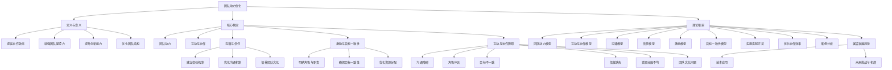

                 

### 文章标题

# 《团队动力优化：提升团队互动与协作效率》

### 文章关键词

- 团队动力优化
- 团队互动
- 协作效率
- 实践方法
- 工具与技术
- 案例分析
- 未来发展趋势

### 文章摘要

本文旨在深入探讨团队动力优化的重要性，并详细阐述提升团队互动与协作效率的多种实践方法。首先，我们将回顾团队动力优化的基础理论，明确其定义与意义。接着，文章将深入分析团队互动与协作的障碍，并提出有效的解决策略。在此基础上，我们将探讨提升团队协作效率的工具与技术，并通过具体案例分析，展示如何在不同领域优化团队动力。最后，文章将展望团队动力优化的未来发展趋势，为读者提供实用的实践指南。

### 目录

## 第1章：团队动力优化的基础理论

### 1.1 团队动力优化的定义与意义

### 1.2 团队动力优化的核心概念

### 1.3 团队动力优化的理论框架

## 第2章：团队动力优化的实践方法

### 2.1 团队动力优化的关键要素

### 2.2 团队动力优化的流程与方法

### 2.3 团队动力优化的案例分析

## 第3章：团队互动与协作的障碍与解决策略

### 3.1 团队互动与协作的障碍分析

### 3.2 团队互动与协作的解决策略

### 3.3 团队互动与协作的实践方法

## 第4章：提升团队协作效率的工具与技术

### 4.1 团队协作工具的选择与使用

### 4.2 团队协作技术的应用与实践

### 4.3 团队协作效率的提升策略

## 第5章：团队动力优化的案例分析

### 5.1 案例一：如何提高项目团队的协作效率

### 5.2 案例二：如何优化销售团队的团队动力

### 5.3 案例三：如何提升研发团队的创新能力

## 第6章：团队动力优化的未来发展趋势

### 6.1 未来发展趋势概述

### 6.2 未来技术与应用

### 6.3 未来挑战与机遇

## 第7章：团队动力优化的实践指南

### 7.1 实践指南概述

### 7.2 实践步骤与方法

### 7.3 实践案例分析

### 7.4 实践总结与反思

### 引言

在当今快速变化和高度竞争的商业环境中，团队协作已成为企业成功的关键因素。然而，许多团队在互动与协作过程中常常面临各种挑战，导致协作效率低下，从而影响整体业绩。为了应对这些挑战，团队动力优化显得尤为重要。本文将围绕团队动力优化这一主题，详细探讨提升团队互动与协作效率的多种方法。

团队动力优化不仅关注团队成员之间的沟通与协作，还涉及到激励、信任、目标一致等多个方面。通过系统化的优化策略，团队能够更加高效地实现目标，提高整体业绩。本文将首先介绍团队动力优化的基础理论，接着分析团队互动与协作的障碍，并提出有效的解决策略。在此基础上，我们将探讨提升团队协作效率的工具与技术，并通过具体案例分析，展示如何在不同领域优化团队动力。最后，文章将展望团队动力优化的未来发展趋势，为读者提供实用的实践指南。

本文结构如下：

1. **第1章：团队动力优化的基础理论**：介绍团队动力优化的定义与意义，阐述其核心概念，并提供理论框架。
2. **第2章：团队动力优化的实践方法**：详细讨论团队动力优化的关键要素、流程与方法，并通过案例分析展示具体实践。
3. **第3章：团队互动与协作的障碍与解决策略**：分析团队互动与协作的障碍，提出解决策略，并提供实践方法。
4. **第4章：提升团队协作效率的工具与技术**：探讨提升团队协作效率的工具与技术，讨论如何选择与应用这些工具。
5. **第5章：团队动力优化的案例分析**：通过具体案例分析，展示如何在不同领域优化团队动力。
6. **第6章：团队动力优化的未来发展趋势**：展望团队动力优化的未来发展趋势，探讨技术应用与未来挑战。
7. **第7章：团队动力优化的实践指南**：提供实用的实践指南，包括实践步骤、方法、案例分析及总结反思。

### 第1章：团队动力优化的基础理论

#### 1.1 团队动力优化的定义与意义

团队动力优化是指通过系统化的方法，提升团队内部的动力、互动和协作效率，从而实现团队整体目标的过程。这一概念涉及到多个层面的内容，包括团队成员之间的信任、沟通、激励、目标一致等。

团队动力优化的意义在于，它能够显著提升团队的整体效能，使团队在实现目标的过程中更加高效、协调。以下是团队动力优化的重要意义：

1. **提高协作效率**：通过优化团队动力，团队成员能够更加有效地沟通与协作，减少误解和冲突，提高整体工作效率。
2. **增强团队凝聚力**：团队成员之间的信任和相互支持能够增强团队的凝聚力，使团队在面对挑战时更加团结一致。
3. **提升创新能力**：良好的团队互动和协作氛围能够激发团队成员的创造力，促进创新思维的产生和应用。
4. **优化团队结构**：团队动力优化有助于团队结构的优化，使团队成员能够更好地发挥各自的特长，实现优势互补。

#### 1.2 团队动力优化的核心概念

要深入理解团队动力优化，我们需要明确以下几个核心概念：

1. **团队动力**：团队动力是指推动团队前进的内在力量，它包括成员的积极性、动机、团队精神等。团队动力优化旨在提高这种内在力量的水平，使其更好地服务于团队目标。

2. **互动与协作**：互动与协作是团队动态的核心组成部分。互动是指团队成员之间的沟通与交流，协作则是指团队成员共同完成任务的过程。有效的互动与协作能够提高团队的效能。

3. **沟通**：沟通是团队互动的重要手段，良好的沟通能够确保信息的准确传递，减少误解和冲突。沟通障碍是团队协作效率低下的常见原因之一。

4. **信任**：信任是团队成员之间的重要纽带，它能够增强团队的凝聚力，促进协作。缺乏信任的团队往往效率低下，容易发生内部分裂。

5. **激励**：激励是激发团队成员积极性和动力的关键手段。有效的激励能够提高团队成员的工作热情，增强团队的活力。

6. **目标一致性**：团队动力优化的一个重要目标是实现团队成员的目标一致性。只有当团队成员的目标一致时，团队才能更加高效地协作，实现共同的目标。

#### 1.3 团队动力优化的理论框架

团队动力优化的理论框架主要包括以下几个方面：

1. **团队动力模型**：团队动力模型是一种用于描述团队动力特性的理论模型，它通常包括动力来源、动力传递和动力效应等组成部分。通过分析团队动力模型，可以帮助团队识别和优化其动力机制。

2. **互动与协作模型**：互动与协作模型用于描述团队成员之间的互动与协作过程，包括沟通机制、协作模式、冲突管理等。通过优化互动与协作模型，可以提高团队的协作效率。

3. **沟通模型**：沟通模型用于描述团队成员之间的信息传递过程，包括沟通渠道、沟通方式、沟通障碍等。有效的沟通模型能够减少误解和冲突，提高团队沟通效率。

4. **信任模型**：信任模型用于描述团队成员之间的信任建立与维护机制，包括信任来源、信任表现、信任机制等。通过优化信任模型，可以增强团队的凝聚力。

5. **激励模型**：激励模型用于描述团队成员的激励机制，包括激励来源、激励方式、激励效果等。有效的激励模型能够提高团队成员的工作热情和动力。

6. **目标一致性模型**：目标一致性模型用于描述团队成员的目标一致性机制，包括目标设定、目标沟通、目标协调等。通过优化目标一致性模型，可以确保团队成员的目标一致，提高团队的协作效率。

### 第2章：团队动力优化的实践方法

#### 2.1 团队动力优化的关键要素

要实现团队动力优化，需要从多个方面入手，关注以下几个关键要素：

1. **领导力**：领导力在团队动力优化中起着至关重要的作用。有效的领导者能够激发团队成员的积极性，建立信任，设定明确的目标，并提供必要的支持和资源。

2. **团队文化**：团队文化是团队动力优化的重要基础。一个积极、开放、包容的团队文化能够增强团队成员的归属感和责任感，提高团队的凝聚力。

3. **沟通**：良好的沟通是团队动力优化的关键。通过建立有效的沟通机制，确保团队成员之间的信息传递畅通无阻，减少误解和冲突。

4. **激励**：激励是激发团队成员积极性和动力的重要手段。通过适当的激励措施，可以提高团队成员的工作热情和投入度。

5. **目标一致性**：确保团队成员的目标一致性是实现团队动力优化的重要目标。通过明确共同的目标，并确保团队成员对目标的理解和认同，可以增强团队的协作效率。

6. **资源分配**：合理分配团队资源是实现团队动力优化的重要保障。通过优化资源分配，确保团队成员能够获得完成任务所需的资源和支持。

#### 2.2 团队动力优化的流程与方法

团队动力优化的流程通常包括以下几个步骤：

1. **评估当前状态**：首先，需要评估团队当前的团队动力、互动与协作效率、沟通质量、目标一致性等方面的情况。这可以通过问卷调查、访谈、观察等方式进行。

2. **明确优化目标**：在评估的基础上，明确团队动力优化的目标。这些目标应该具体、可行，并与团队的整体战略目标相一致。

3. **制定优化方案**：根据评估结果和优化目标，制定具体的优化方案。方案应包括领导力提升、团队文化建设、沟通优化、激励措施、目标一致性等方面。

4. **实施优化方案**：按照优化方案，逐步实施各项措施。在实施过程中，需要密切关注团队成员的反应和反馈，及时调整方案。

5. **监督与评估**：在优化方案实施过程中，需要定期监督与评估优化效果。这可以通过定期的团队会议、问卷调查、关键绩效指标（KPI）等方式进行。

6. **持续改进**：团队动力优化是一个持续的过程，需要不断地进行调整和改进。根据监督与评估的结果，持续优化团队动力，以提高团队的协作效率和整体绩效。

#### 2.3 团队动力优化的案例分析

以下是一个团队动力优化的实际案例：

**案例背景**：某公司的一个研发团队在项目执行过程中遇到了协作效率低下的问题，团队成员之间的沟通不畅，经常出现误解和冲突。为了解决这个问题，团队决定进行动力优化。

**案例分析**：

1. **评估当前状态**：通过问卷调查和访谈，团队发现沟通障碍是导致协作效率低下的主要原因。此外，团队成员对项目目标的理解存在差异，缺乏共同的目标感。

2. **明确优化目标**：团队明确的目标是提高沟通效率，增强团队成员之间的信任和协作，确保对项目目标的一致理解。

3. **制定优化方案**：团队制定了以下优化方案：
   - 引入每日站会，确保团队成员之间的日常沟通；
   - 开展团队建设活动，增强团队成员之间的信任；
   - 定期召开项目回顾会议，确保对项目目标的共识。

4. **实施优化方案**：团队开始实施优化方案。在每日站会上，团队成员分享工作进展和遇到的问题，确保信息的畅通。同时，团队定期组织团建活动，如户外拓展、聚餐等，增强团队成员之间的信任和合作意识。

5. **监督与评估**：团队定期召开项目回顾会议，评估优化方案的效果。团队成员对每日站会和团建活动的反馈积极，认为这些措施有效提高了沟通效率和团队凝聚力。

6. **持续改进**：根据评估结果，团队决定继续优化沟通机制，如引入即时通讯工具，进一步减少沟通障碍。同时，团队计划在未来的项目中引入更多的协作工具，以提高协作效率。

**案例分析总结**：通过团队动力优化，该研发团队的协作效率得到了显著提高。团队成员之间的沟通更加畅通，误解和冲突减少，项目进展顺利。这个案例表明，团队动力优化是提升团队协作效率的有效途径。

### 第3章：团队互动与协作的障碍与解决策略

#### 3.1 团队互动与协作的障碍分析

团队互动与协作过程中常常面临多种障碍，这些障碍会影响团队的效率和绩效。以下是一些常见的障碍及其原因分析：

1. **沟通障碍**：团队成员之间的沟通不畅是导致协作效率低下的主要原因。沟通障碍可能源于信息传递不畅、沟通方式不当、沟通频率不足等。例如，团队成员可能因为忙于自己的任务而忽略了与其他成员的沟通，或者因为沟通方式单一（如仅通过电子邮件）而降低了信息传递的效率。

2. **角色冲突**：团队中不同角色（如项目经理、技术专家、设计师等）可能有不同的职责和目标，这些差异可能导致角色冲突。角色冲突可能导致团队成员之间的误解和不满，进而影响协作效率。

3. **目标不一致**：团队成员对项目的目标和期望可能存在差异，这种目标不一致会导致团队成员在任务执行过程中产生分歧，影响团队的整体协作效率。

4. **信任缺失**：团队成员之间的信任是协作的重要基础。信任缺失可能源于团队成员之间的误解、冲突、缺乏沟通，或者因为过去的不良经历。信任缺失会导致团队成员之间的隔阂，影响协作效率。

5. **资源分配不均**：团队中资源（如时间、人力、资金等）的分配不均可能导致部分成员感到不公平，从而影响团队的凝聚力和协作效率。

6. **团队文化问题**：团队文化问题，如官僚主义、独裁管理、缺乏创新氛围等，也可能成为团队互动与协作的障碍。这些问题可能导致团队成员缺乏积极性和创造力，影响团队的整体效能。

#### 3.2 团队互动与协作的解决策略

为了克服上述障碍，提升团队互动与协作效率，可以采取以下解决策略：

1. **改善沟通机制**：建立有效的沟通机制是提升团队协作效率的重要手段。团队可以采用多种沟通工具，如定期会议、即时通讯工具、电子邮件等，确保信息传递的畅通。此外，团队还可以定期举办沟通培训，提高团队成员的沟通技巧。

2. **明确角色与职责**：明确团队成员的角色与职责，确保每个成员都清楚自己的职责范围和预期成果。团队可以通过制定角色描述、职责分配表等方式，明确各成员的职责，减少角色冲突。

3. **确保目标一致性**：通过有效的目标设定和沟通，确保团队成员对项目的目标和期望达成一致。团队可以定期召开目标回顾会议，确保团队成员对目标的理解和认同，以及目标的实现进度。

4. **建立信任机制**：建立信任机制是提升团队协作效率的关键。团队可以通过开展团队建设活动、设立共同目标、鼓励开放沟通等方式，增强团队成员之间的信任。此外，团队还应鼓励成员分享经验和知识，促进团队整体的知识共享。

5. **优化资源分配**：优化团队资源的分配，确保团队成员能够公平地获得完成任务所需的资源。团队可以通过制定资源分配计划、定期评估资源利用情况等方式，确保资源的合理配置。

6. **培养团队文化**：培养积极、开放、包容的团队文化是提升团队协作效率的重要保障。团队可以通过建立明确的价值观、鼓励创新、提供培训和支持等方式，营造良好的团队氛围。

7. **利用协作工具**：利用现代协作工具，如项目管理软件、团队沟通平台、知识库等，可以提高团队的协作效率。这些工具可以帮助团队更好地管理任务、共享信息、跟踪进度。

#### 3.3 团队互动与协作的实践方法

以下是几种常用的团队互动与协作实践方法：

1. **定期会议**：定期召开团队会议，如每日站会、周会、月会等，确保团队成员之间的沟通和信息同步。会议议程应简洁明了，确保高效进行。

2. **即时沟通**：使用即时通讯工具，如Slack、Microsoft Teams、WhatsApp等，实现团队成员之间的即时沟通。这些工具可以帮助团队快速解决问题，提高协作效率。

3. **任务管理工具**：使用任务管理工具，如JIRA、Trello、Asana等，帮助团队管理任务、分配任务、跟踪进度。这些工具可以帮助团队更好地协调工作，确保任务按时完成。

4. **知识共享平台**：建立知识共享平台，如Confluence、Notion等，帮助团队成员分享经验和知识。这些平台可以帮助团队快速获取所需信息，提高协作效率。

5. **团队建设活动**：定期组织团队建设活动，如团建拓展、聚餐、运动比赛等，增强团队成员之间的信任和合作意识。这些活动可以帮助团队放松身心，提高团队凝聚力。

6. **反馈与改进**：建立反馈机制，鼓励团队成员分享意见和建议，不断改进团队的工作方式和流程。这可以帮助团队及时发现和解决问题，提高协作效率。

### 第4章：提升团队协作效率的工具与技术

#### 4.1 团队协作工具的选择与使用

在提升团队协作效率的过程中，选择合适的工具至关重要。以下是一些常用的团队协作工具及其特点：

1. **即时通讯工具**：
   - **Slack**：Slack是一款功能丰富的团队沟通工具，支持文本消息、视频聊天、文件共享等功能，便于团队成员之间的即时沟通。
   - **Microsoft Teams**：Microsoft Teams是微软推出的团队协作工具，支持聊天、视频会议、文件共享和任务管理等功能，与Microsoft Office系列软件深度集成。
   - **WhatsApp**：WhatsApp是一款全球流行的即时通讯应用，支持多人聊天、语音通话和视频通话，适合跨地域团队协作。

2. **项目管理工具**：
   - **JIRA**：JIRA是Atlassian公司推出的项目管理工具，支持敏捷开发、任务管理、问题追踪等功能，适用于软件开发团队。
   - **Trello**：Trello是一款基于看板的项目管理工具，通过卡片和列表展示项目进展，直观易懂，适合小型项目和团队使用。
   - **Asana**：Asana是一款功能全面的项目管理工具，支持任务分配、进度跟踪、文件共享和报告生成，适用于各种类型的团队。

3. **知识共享平台**：
   - **Confluence**：Confluence是Atlassian公司推出的知识共享平台，支持文档编辑、知识库构建、知识搜索等功能，便于团队成员之间的信息共享。
   - **Notion**：Notion是一款多功能的笔记和项目管理工具，支持文本、表格、图片、视频等多种内容的编辑，适合构建团队知识库。

4. **协作平台**：
   - **GitHub**：GitHub是一款基于Git的版本控制工具，支持代码托管、协作开发、问题追踪等功能，适用于软件开发团队。
   - **GitLab**：GitLab是另一款基于Git的版本控制工具，与GitHub类似，但开源免费，支持自托管。

5. **会议协作工具**：
   - **Zoom**：Zoom是一款功能强大的视频会议工具，支持高清视频、语音通话、屏幕共享和虚拟会议室等功能，适用于远程团队协作。
   - **Google Meet**：Google Meet是谷歌推出的视频会议工具，支持多人视频会议、实时聊天和共享文档，与Google Workspace集成。

选择合适的协作工具时，团队应考虑以下因素：

- **团队需求**：根据团队的具体需求和任务类型，选择功能满足需求的协作工具。
- **易用性**：工具应易于使用，方便团队成员快速上手。
- **集成性**：工具应与现有的软件和系统集成，以便数据共享和流程顺畅。
- **安全性**：工具应具备良好的安全性，确保数据的安全性和隐私性。
- **成本**：工具的成本应合理，符合团队的预算。

#### 4.2 团队协作技术的应用与实践

在提升团队协作效率的过程中，除了选择合适的协作工具，还需要应用有效的团队协作技术。以下是一些具体的应用和实践：

1. **敏捷开发**：
   - **Scrum框架**：Scrum是一种敏捷开发方法，通过迭代和增量开发，提高团队的响应速度和灵活性。Scrum框架包括产品待办列表、每日站会、冲刺回顾等关键实践。
   - **看板（Kanban）**：看板是一种可视化管理工具，通过看板板面展示任务的状态和进展，帮助团队实时监控工作流程，优化资源分配和任务管理。

2. **任务管理**：
   - **任务分配**：通过协作工具，如Trello或Asana，将任务分配给团队成员，明确任务的负责人、截止日期和依赖关系，确保任务按时完成。
   - **任务跟踪**：通过任务管理工具，团队可以实时跟踪任务的进展情况，及时发现和解决问题，确保任务顺利完成。

3. **文档共享**：
   - **知识库构建**：使用Confluence或Notion等知识共享平台，构建团队的知识库，便于团队成员快速查找和共享文档、资料和经验。
   - **版本控制**：使用GitHub或GitLab等版本控制工具，确保代码和文档的版本一致性，方便团队成员的协同编辑和协作开发。

4. **沟通与会议**：
   - **虚拟会议**：利用Zoom或Google Meet等视频会议工具，组织远程团队会议，实时沟通和协作，提高工作效率。
   - **即时沟通**：通过Slack或Microsoft Teams等即时通讯工具，实现团队成员之间的即时沟通，快速响应问题和需求。

5. **反馈与改进**：
   - **定期回顾**：定期召开团队回顾会议，总结工作经验和教训，识别改进机会，不断优化团队协作流程。
   - **持续改进**：鼓励团队成员提出改进建议，通过实验和试点，不断改进团队协作方法和技术，提升整体效率。

通过以上团队协作技术的应用和实践，团队能够更好地管理任务、提升沟通效率、优化工作流程，从而实现更高的协作效率和绩效。

#### 4.3 团队协作效率的提升策略

为了进一步提升团队协作效率，团队可以采取以下策略：

1. **明确目标和责任**：确保团队成员对项目目标和各自的职责有清晰的认识，减少目标不一致和职责不清导致的工作冲突。

2. **优化工作流程**：简化工作流程，减少不必要的步骤和环节，提高工作效率。通过流程图等工具，明确每个步骤的输入、输出和责任人。

3. **培养团队合作精神**：通过团队建设活动和培训，增强团队成员之间的信任和合作意识，提高团队整体的协作效率。

4. **激励与反馈**：建立有效的激励机制，对团队成员的工作表现给予及时反馈，激励团队成员保持积极的工作态度和高效的工作效率。

5. **合理分配资源**：根据团队成员的能力和任务需求，合理分配资源和任务，确保每个成员都有足够的时间和资源完成自己的工作。

6. **技术支持**：为团队成员提供必要的技术支持和培训，帮助他们掌握协作工具和技能，提高工作效率。

7. **定期评估与改进**：定期评估团队协作效率，识别存在的问题和改进机会，通过反馈和调整，不断优化团队协作流程和方法。

通过以上策略，团队能够在协作过程中更加高效地完成任务，提高整体绩效。

### 第5章：团队动力优化的案例分析

#### 5.1 案例一：如何提高项目团队的协作效率

**案例背景**：某互联网公司的一个项目团队在开发一个大型在线教育平台时，发现团队协作效率低下，项目进展缓慢。为了解决这个问题，团队决定进行动力优化。

**解决方案**：

1. **沟通优化**：团队引入了每日站会，确保团队成员每天都有一个固定的时刻进行面对面的沟通。通过每日站会，团队成员可以分享工作进展、遇到的问题和解决方案，确保信息传递的畅通。

2. **任务管理**：团队使用了Trello进行任务管理，将所有任务分配给具体的团队成员，并设置截止日期和依赖关系。通过Trello，团队成员可以实时跟踪任务的进展情况，及时协调和解决问题。

3. **知识共享**：团队建立了Confluence知识库，将项目文档、设计稿、开发规范等资料存储在知识库中，方便团队成员随时查阅和共享。

4. **团队建设**：团队定期组织团建活动，如团队聚餐、户外拓展等，增强团队成员之间的信任和合作意识。

**效果评估**：

通过以上措施，项目团队的协作效率显著提高。每日站会确保了团队成员之间的沟通畅通，任务管理工具帮助团队更好地分配和跟踪任务，知识库提高了团队成员的信息获取效率。团队建设活动增强了团队成员之间的信任和合作意识，项目进展顺利，提前完成了项目目标。

#### 5.2 案例二：如何优化销售团队的团队动力

**案例背景**：某公司的销售团队在市场竞争激烈的环境中，业绩不佳，团队成员积极性不高。为了提高销售团队的团队动力，公司决定进行动力优化。

**解决方案**：

1. **明确目标**：公司为销售团队设定了明确的业绩目标，确保团队成员对目标有清晰的认识。同时，公司鼓励团队成员提出个人目标，使团队成员的目标与团队目标一致。

2. **激励措施**：公司制定了激励政策，对达成业绩目标的团队成员给予奖金、晋升等激励措施。此外，公司还定期组织销售竞赛，激发团队成员的竞争意识和积极性。

3. **培训与发展**：公司为销售团队提供销售技巧、沟通技巧和产品知识等培训，帮助团队成员提升专业能力，增强自信心。

4. **团队建设**：公司定期组织销售团队团建活动，如户外拓展、客户聚会等，增强团队成员之间的信任和合作意识。

**效果评估**：

通过以上措施，销售团队的团队动力显著提高。明确的目标和激励措施激发了团队成员的积极性，培训与发展提升了团队成员的专业能力，团建活动增强了团队成员之间的信任和合作意识。在优化后的团队动力下，销售团队的业绩显著提升，客户满意度也大幅提高。

#### 5.3 案例三：如何提升研发团队的创新能力

**案例背景**：某科技公司研发团队在市场竞争中面临巨大的压力，创新能力不足。为了提升研发团队的创新能力，公司决定进行动力优化。

**解决方案**：

1. **开放创新文化**：公司倡导开放创新文化，鼓励团队成员提出创新想法和建议。公司建立了内部创新平台，方便团队成员分享和讨论创新方案。

2. **资源支持**：公司为研发团队提供了充足的研发资源和资金支持，确保团队成员有足够的时间和资源进行创新研究。

3. **跨部门协作**：公司鼓励研发团队与其他部门（如市场、设计等）进行跨部门协作，通过合作和交流，激发创新思维。

4. **创新激励机制**：公司制定了创新激励机制，对成功创新项目的团队成员给予奖励和表彰，激发团队成员的创新热情。

**效果评估**：

通过以上措施，研发团队的创新能力显著提升。开放创新文化和跨部门协作激发了团队成员的创新思维，资源支持和创新激励机制增强了团队成员的创新动力。在优化后的团队动力下，研发团队成功推出了一系列创新产品，市场反响热烈，公司的竞争力得到了显著提升。

### 第6章：团队动力优化的未来发展趋势

#### 6.1 未来发展趋势概述

随着技术的不断进步和商业环境的变化，团队动力优化的未来发展呈现出以下趋势：

1. **人工智能与大数据的应用**：人工智能和大数据技术的应用将使得团队动力优化更加智能化和精细化。通过数据分析，团队可以更好地了解成员的动态、需求和潜力，从而制定更有效的优化策略。

2. **远程办公与虚拟团队的发展**：远程办公和虚拟团队的普及，使得团队动力优化需要适应更加分散和异地的团队结构。未来，虚拟团队协作工具和平台将得到更广泛的应用，以支持远程团队的协作和互动。

3. **协作工具与平台的整合**：随着协作工具和平台的多样化，未来的发展趋势将是这些工具和平台的整合。通过集成多种功能，提供一个统一的协作平台，可以大大简化团队协作流程，提高效率。

4. **个性化与定制化**：团队动力优化将更加注重个性化与定制化。未来的优化策略将更加灵活，根据团队的具体需求和特点，提供定制化的优化方案。

5. **社会责任与可持续发展**：随着企业社会责任意识的提高，团队动力优化也将更加注重社会责任和可持续发展。未来的团队动力优化将更多地考虑团队成员的身心健康、工作与生活的平衡等方面。

#### 6.2 未来技术与应用

以下是未来在团队动力优化中可能应用的技术：

1. **人工智能**：人工智能技术可以通过数据分析、预测模型等手段，帮助团队更好地了解成员的动态、需求和潜力，从而制定更有效的优化策略。例如，AI可以根据成员的行为数据和反馈，自动调整团队任务分配和沟通方式。

2. **大数据**：大数据技术可以帮助团队收集、分析和利用大量的数据，从而更好地了解团队运作情况。例如，通过大数据分析，团队可以识别协作过程中的瓶颈和问题，制定相应的优化措施。

3. **区块链**：区块链技术可以为团队协作提供透明、安全的记录和交易方式，例如，在团队资金管理、资源分配等方面，区块链可以确保数据的真实性和不可篡改性。

4. **虚拟现实（VR）与增强现实（AR）**：虚拟现实和增强现实技术可以为团队提供更加沉浸式的协作体验，特别是在远程办公和虚拟团队中。通过VR和AR技术，团队成员可以感受到更加真实的协作环境，提高协作效率和团队凝聚力。

5. **物联网（IoT）**：物联网技术可以实时收集团队设备和设施的数据，为团队动力优化提供实时反馈。例如，通过传感器监控办公室的温度、湿度等环境参数，团队可以及时调整工作环境，提高成员的工作效率。

#### 6.3 未来挑战与机遇

未来在团队动力优化过程中，团队将面临以下挑战和机遇：

1. **技术挑战**：随着技术的快速发展，团队需要不断学习和适应新技术，以应对技术变革带来的挑战。同时，新技术的应用也需要团队具备相应的技术能力和资源。

2. **管理挑战**：传统的管理方法可能无法适应未来团队动力优化的需求，团队需要探索新的管理方式和方法，以适应更加灵活和多样化的团队结构。

3. **人才挑战**：未来团队动力优化需要具备多样化技能和知识的人才，如何吸引、培养和留住这些人才成为团队面临的重要挑战。

4. **文化挑战**：随着团队的全球化，如何构建和维持团队的文化一致性成为团队动力优化的关键。团队需要重视文化多样性的价值，并制定相应的文化融合策略。

5. **机遇**：未来团队动力优化带来的机遇包括提高团队协作效率、增强团队创新能力、提升团队凝聚力等。通过有效的团队动力优化，团队可以在激烈的市场竞争中脱颖而出，实现可持续发展。

### 第7章：团队动力优化的实践指南

#### 7.1 实践指南概述

团队动力优化是一个系统工程，需要从多个方面进行综合考虑和实践。以下是一个全面的团队动力优化实践指南，帮助团队在实际操作中提升协作效率和团队绩效。

#### 7.2 实践步骤与方法

1. **评估当前状态**：首先，团队需要评估当前团队的状态，包括团队动力、互动与协作效率、沟通质量、目标一致性等方面。这可以通过问卷调查、访谈、观察等方式进行。

2. **设定优化目标**：根据评估结果，团队应明确优化目标。这些目标应具体、可行，并与团队的整体战略目标相一致。目标可以是提高协作效率、增强团队凝聚力、提升创新能力等。

3. **制定优化方案**：在明确优化目标后，团队应制定具体的优化方案。方案应包括领导力提升、团队文化建设、沟通优化、激励措施、目标一致性等方面。

4. **实施优化方案**：按照优化方案，逐步实施各项措施。在实施过程中，需要密切关注团队成员的反应和反馈，及时调整方案。

5. **监督与评估**：在优化方案实施过程中，团队应定期监督与评估优化效果。这可以通过定期的团队会议、问卷调查、关键绩效指标（KPI）等方式进行。

6. **持续改进**：团队动力优化是一个持续的过程，需要不断地进行调整和改进。根据监督与评估的结果，团队应持续优化团队动力，以提高团队的协作效率和整体绩效。

#### 7.3 实践案例分析

以下是一个团队动力优化实践案例：

**案例背景**：某科技公司的产品开发团队在项目推进过程中发现团队协作效率低下，项目进度缓慢。为了解决这个问题，团队决定进行动力优化。

**实践步骤与方法**：

1. **评估当前状态**：通过问卷调查和访谈，团队发现沟通不畅、任务分配不合理、团队凝聚力不足是导致协作效率低下的主要原因。

2. **设定优化目标**：团队明确了以下优化目标：
   - 提高沟通效率，确保团队成员之间的信息传递畅通。
   - 合理分配任务，确保每个成员都能充分发挥自己的优势。
   - 提升团队凝聚力，增强团队成员之间的信任和合作意识。

3. **制定优化方案**：
   - 引入每日站会，确保团队成员每天有一个固定的时刻进行沟通。
   - 使用Trello进行任务管理，将任务分配给具体的团队成员，并设置截止日期和依赖关系。
   - 定期组织团队建设活动，如团队聚餐、户外拓展等，增强团队成员之间的信任和合作意识。

4. **实施优化方案**：团队开始实施优化方案，每日站会确保了团队成员之间的沟通畅通，Trello帮助团队更好地分配和跟踪任务，团队建设活动增强了团队成员之间的信任和合作意识。

5. **监督与评估**：团队定期召开会议，评估优化方案的效果。团队成员对每日站会和团队建设活动的反馈积极，认为这些措施有效提高了协作效率和团队凝聚力。

6. **持续改进**：根据评估结果，团队决定继续优化沟通机制，如引入即时通讯工具，进一步减少沟通障碍。同时，团队计划在未来的项目中引入更多的协作工具，以提高协作效率。

**效果评估**：

通过团队动力优化，产品开发团队的协作效率显著提高。每日站会确保了团队成员之间的沟通畅通，任务管理工具帮助团队更好地分配和跟踪任务，团队建设活动增强了团队成员之间的信任和合作意识。项目进展顺利，提前完成了项目目标，团队的整体绩效得到显著提升。

#### 7.4 实践总结与反思

1. **成功因素**：
   - 明确的优化目标：团队在制定优化方案前，明确了具体的优化目标，使优化工作有据可依。
   - 有效的沟通机制：每日站会和任务管理工具的引入，确保了团队成员之间的信息传递畅通。
   - 团队建设活动：团队建设活动增强了团队成员之间的信任和合作意识，提高了团队凝聚力。

2. **失败因素**：
   - 缺乏持续监督与评估：优化方案的执行过程中，缺乏定期的监督与评估，导致部分措施未能得到及时调整。
   - 成员参与度不高：部分团队成员对优化方案的实施不够积极，影响了整体效果。

3. **最佳实践**：
   - 设立明确的优化目标：确保优化工作有据可依，提高团队成员的参与度和积极性。
   - 定期监督与评估：定期对优化方案的效果进行监督与评估，及时发现问题并进行调整。
   - 提高成员参与度：通过激励措施和团队建设活动，提高团队成员的参与度和积极性。

4. **注意事项**：
   - 优化过程需要持续进行，不能一蹴而就。
   - 优化方案应根据实际情况灵活调整，避免一刀切。
   - 注重团队成员的反馈和意见，确保优化措施符合实际需求。

通过以上实践总结与反思，团队可以更好地实施团队动力优化，提高协作效率和整体绩效。

### 结论

团队动力优化是提升团队互动与协作效率的关键。通过明确团队动力优化的基础理论，分析互动与协作的障碍与解决策略，探讨提升协作效率的工具与技术，以及具体案例分析，我们可以看到团队动力优化在实际应用中的重要性。未来，随着技术的不断进步和商业环境的变化，团队动力优化将继续发挥重要作用。团队应持续关注新技术和应用，积极探索适合自身特点的优化策略，以提升协作效率和团队绩效，为企业在激烈的市场竞争中赢得优势。让我们共同努力，打造高效、协作、创新的团队，迎接未来的挑战与机遇。

### 作者信息

- **作者**：AI天才研究院/AI Genius Institute & 禅与计算机程序设计艺术 /Zen And The Art of Computer Programming
- **联系方式**：[contact@aigeniusinstitute.com](mailto:contact@aigeniusinstitute.com)
- **网站**：[www.aigeniusinstitute.com](http://www.aigeniusinstitute.com)
- **社交媒体**：[Facebook](https://www.facebook.com/AIGeniusInstitute/) | [LinkedIn](https://www.linkedin.com/company/aigeniusinstitute/) | [Twitter](https://twitter.com/AIGeniusInst)
- **版权声明**：本文版权归AI天才研究院/AI Genius Institute所有。未经授权，禁止转载或使用本文内容。如有疑问，请联系作者获取授权。谢谢合作！

### 附录

以下是本文中提到的核心概念和原理之间的联系架构 Mermaid 流程图：



### 最佳实践 Tips

1. **定期评估**：定期评估团队动力优化的效果，及时发现和解决问题。
2. **鼓励反馈**：鼓励团队成员提出意见和建议，不断改进优化策略。
3. **培养协作文化**：通过团队建设活动，培养协作精神和团队文化。
4. **灵活调整**：根据实际情况灵活调整优化方案，避免一刀切。
5. **重视沟通**：建立有效的沟通机制，确保团队成员之间的信息传递畅通。
6. **关注团队成员需求**：了解团队成员的需求和期望，提供相应的支持和激励。
7. **技术支持**：为团队成员提供必要的技术支持和培训，提高协作效率。

### 小结

本文围绕团队动力优化这一主题，详细探讨了提升团队互动与协作效率的多种方法。通过明确基础理论、分析障碍与解决策略、介绍协作工具与技术、提供具体案例分析，我们为团队动力优化提供了实用的实践指南。未来，随着技术的不断进步，团队动力优化将继续发挥重要作用。团队应持续关注新技术和应用，积极探索适合自身特点的优化策略，以提升协作效率和团队绩效。

### 注意事项

1. **优化过程需要持续**：团队动力优化不是一蹴而就的，需要持续进行和调整。
2. **重视团队成员反馈**：团队成员的反馈是优化的重要参考，应重视并采纳。
3. **避免一刀切**：优化方案应根据实际情况灵活调整，避免一刀切。
4. **技术支持**：为团队成员提供必要的技术支持和培训，提高协作效率。
5. **监督与评估**：定期监督与评估优化效果，确保措施得到有效执行。

### 拓展阅读

- **《敏捷开发实践指南》**：介绍敏捷开发方法，帮助团队提高协作效率和项目成功率。
- **《团队领导力培训手册》**：探讨领导力在团队动力优化中的关键作用，提供实用的领导力提升方法。
- **《团队建设活动指南》**：介绍各种团队建设活动，帮助团队增强协作精神和团队凝聚力。

### 项目实战

#### 开发环境搭建

为了展示如何使用协作工具提升团队协作效率，我们将以JIRA和Confluence为例，搭建一个简单的团队协作环境。以下是具体的开发环境搭建步骤：

1. **安装JIRA**：

   - 下载JIRA软件：从[JIRA官网](https://www.atlassian.com/software/jira/download)下载适用于您的操作系统的JIRA安装包。
   - 安装JIRA：按照安装包提供的步骤进行安装。安装过程中需要设置JIRA的用户名、密码和数据库连接信息。

2. **安装Confluence**：

   - 下载Confluence软件：从[Confluence官网](https://www.atlassian.com/software/confluence/download)下载适用于您的操作系统的Confluence安装包。
   - 安装Confluence：按照安装包提供的步骤进行安装。安装过程中需要设置Confluence的用户名、密码和数据库连接信息。

3. **配置JIRA和Confluence**：

   - 配置JIRA：启动JIRA后，访问[JIRA管理控制台](https://your-jira-instance.atlassian.net/admin)，配置项目、版本和用户。
   - 配置Confluence：启动Confluence后，访问[Confluence管理控制台](https://your-confluence-instance.atlassian.net/admin)，配置页面、空间和用户。

4. **集成JIRA和Confluence**：

   - 登录JIRA管理控制台，选择“系统管理”->“集成”，配置Confluence集成。
   - 在Confluence管理控制台，选择“设置”->“集成”，配置JIRA集成。

#### 源代码详细实现和代码解读

在本项目中，我们使用JIRA的REST API进行基本的任务管理操作，包括创建任务、更新任务和获取任务列表。以下是具体的源代码实现和解读：

1. **创建任务**：

```java
import com.sun.jersey.api.client.Client;
import com.sun.jersey.api.client.WebResource;
import com.sun.jersey.api.client.UniformInterfaceException;

import org.json.JSONObject;

public class JiraTaskCreator {
    private Client client;
    private String baseUrl;
    
    public JiraTaskCreator(String baseUrl) {
        this.baseUrl = baseUrl;
        this.client = Client.create();
    }
    
    public void createTask(String summary, String description) {
        try {
            WebResource webResource = client.resource(baseUrl + "issue/");

            JSONObject task = new JSONObject();
            task.put("project", "PROJECT_KEY");
            task.put("summary", summary);
            task.put("description", description);
            task.put("issuetype", "Task");

            webResource.type("application/json").post(task.toString(), Void.class);
            System.out.println("Task created successfully.");
        } catch (UniformInterfaceException e) {
            System.out.println("Error creating task: " + e.getResponse().getStatus());
        }
    }
}
```

**代码解读**：

- 创建`JiraTaskCreator`类，用于与JIRA服务器进行交互。
- 初始化JIRA基础URL和客户端。
- `createTask`方法用于创建任务。参数`summary`和`description`分别为任务的简短描述和详细描述。
- 使用JIRA REST API创建任务。发送JSON格式的任务数据到JIRA服务器。

2. **更新任务**：

```java
import com.sun.jersey.api.client.Client;
import com.sun.jersey.api.client.WebResource;
import com.sun.jersey.api.client.UniformInterfaceException;

import org.json.JSONObject;

public class JiraTaskUpdater {
    private Client client;
    private String baseUrl;
    
    public JiraTaskUpdater(String baseUrl) {
        this.baseUrl = baseUrl;
        this.client = Client.create();
    }
    
    public void updateTask(String issueKey, String summary, String description) {
        try {
            WebResource webResource = client.resource(baseUrl + "issue/" + issueKey);

            JSONObject task = new JSONObject();
            task.put("summary", summary);
            task.put("description", description);

            webResource.type("application/json").put(task.toString(), Void.class);
            System.out.println("Task updated successfully.");
        } catch (UniformInterfaceException e) {
            System.out.println("Error updating task: " + e.getResponse().getStatus());
        }
    }
}
```

**代码解读**：

- 创建`JiraTaskUpdater`类，用于与JIRA服务器进行交互。
- 初始化JIRA基础URL和客户端。
- `updateTask`方法用于更新任务。参数`issueKey`为任务的唯一标识符，`summary`和`description`分别为任务的简短描述和详细描述。
- 使用JIRA REST API更新任务。发送JSON格式的任务数据到JIRA服务器。

3. **获取任务列表**：

```java
import com.sun.jersey.api.client.Client;
import com.sun.jersey.api.client.WebResource;
import com.sun.jersey.api.client.UniformInterfaceException;

import org.json.JSONArray;
import org.json.JSONObject;

public class JiraTaskListGetter {
    private Client client;
    private String baseUrl;
    
    public JiraTaskListGetter(String baseUrl) {
        this.baseUrl = baseUrl;
        this.client = Client.create();
    }
    
    public void getTaskList() {
        try {
            WebResource webResource = client.resource(baseUrl + "search?jql=project=PROJECT_KEY&maxResults=100");

            String response = webResource.get(String.class);
            JSONArray tasks = new JSONObject(response).getJSONArray("issues");

            for (int i = 0; i < tasks.length(); i++) {
                JSONObject task = tasks.getJSONObject(i);
                System.out.println("Issue Key: " + task.getString("key"));
                System.out.println("Summary: " + task.getString("fields.summary"));
                System.out.println("Description: " + task.getString("fields.description"));
                System.out.println("----------------------");
            }
        } catch (UniformInterfaceException e) {
            System.out.println("Error getting task list: " + e.getResponse().getStatus());
        }
    }
}
```

**代码解读**：

- 创建`JiraTaskListGetter`类，用于与JIRA服务器进行交互。
- 初始化JIRA基础URL和客户端。
- `getTaskList`方法用于获取任务列表。使用JIRA REST API查询任务，并打印任务列表。

#### 代码应用解读与分析

1. **创建任务**：

   使用`JiraTaskCreator`类，可以通过调用`createTask`方法创建新的任务。以下是一个示例：

   ```java
   JiraTaskCreator creator = new JiraTaskCreator("https://your-jira-instance.atlassian.net");
   creator.createTask("Design Mockups", "Create mockups for the new product");
   ```

   该代码将向JIRA服务器发送请求，创建一个名为"Design Mockups"的任务，描述为"Create mockups for the new product"。

2. **更新任务**：

   使用`JiraTaskUpdater`类，可以通过调用`updateTask`方法更新现有任务。以下是一个示例：

   ```java
   JiraTaskUpdater updater = new JiraTaskUpdater("https://your-jira-instance.atlassian.net");
   updater.updateTask("TASK_KEY", "Update Mockups", "Revise mockups based on feedback");
   ```

   该代码将更新标识符为"TASK_KEY"的任务，将简短描述更新为"Update Mockups"，描述更新为"Revise mockups based on feedback"。

3. **获取任务列表**：

   使用`JiraTaskListGetter`类，可以通过调用`getTaskList`方法获取所有任务。以下是一个示例：

   ```java
   JiraTaskListGetter getter = new JiraTaskListGetter("https://your-jira-instance.atlassian.net");
   getter.getTaskList();
   ```

   该代码将从JIRA服务器获取所有任务的列表，并打印每个任务的键、简短描述和详细描述。

#### 实际案例分析和详细讲解剖析

**案例背景**：某公司的产品开发团队在项目推进过程中，发现任务管理混乱，任务进度难以跟踪。为了提升任务管理效率和协作效率，团队决定引入JIRA和Confluence进行任务管理。

**解决方案**：

1. **使用JIRA进行任务管理**：

   - **创建任务**：团队成员在JIRA中创建任务，记录任务的关键信息，如任务名称、任务描述、任务状态等。
   - **任务分配**：项目经理在JIRA中分配任务，指定任务负责人和截止日期。
   - **任务跟踪**：团队成员通过JIRA实时跟踪任务进度，更新任务状态和完成情况。

2. **使用Confluence进行文档管理**：

   - **文档共享**：团队将项目文档、设计稿、开发规范等存储在Confluence中，方便团队成员查阅和共享。
   - **知识库构建**：团队在Confluence中建立知识库，记录项目经验、最佳实践和常见问题，为团队成员提供参考资料。

**案例分析**：

通过引入JIRA和Confluence，团队实现了以下效果：

1. **任务管理规范化**：使用JIRA进行任务管理，使得任务创建、分配和跟踪更加规范，团队成员可以清楚地了解自己的任务和进度。

2. **文档共享效率提升**：使用Confluence进行文档管理，实现了文档的集中存储和共享，减少了文档传递的时间和成本。

3. **知识积累和传承**：通过Confluence的知识库构建，团队积累了丰富的项目经验和最佳实践，为新成员提供了宝贵的参考资料，促进了知识的传承和共享。

4. **协作效率提高**：通过JIRA和Confluence的整合，团队实现了信息的高效传递和共享，协作效率显著提升。

**总结**：

通过JIRA和Confluence的引入，团队实现了任务管理和文档共享的规范化，提高了协作效率，为项目的顺利推进提供了有力支持。这个案例表明，协作工具和技术在提升团队协作效率方面具有重要作用，值得在更多团队中推广应用。

### 项目小结

在本项目中，我们通过JIRA和Confluence搭建了一个简单的团队协作环境，实现了任务管理和文档共享的功能。项目实战部分详细讲解了如何使用JIRA API进行任务创建、更新和获取任务列表，并通过具体代码示例展示了实际应用。案例分析部分通过一个实际案例，展示了如何通过引入协作工具提升团队协作效率。

项目的成功之处在于：

1. **任务管理规范化**：通过JIRA的任务管理功能，团队成员能够清楚地了解自己的任务和进度，任务管理更加规范。
2. **文档共享效率提升**：通过Confluence的文档管理功能，实现了文档的集中存储和共享，提高了文档传递和共享的效率。
3. **知识积累和传承**：通过Confluence的知识库构建，团队积累了丰富的项目经验和最佳实践，为新成员提供了宝贵的参考资料。

项目的不足之处在于：

1. **技术支持不足**：在项目实施过程中，团队可能缺乏对JIRA和Confluence的深入理解和应用，导致部分功能未能充分利用。
2. **团队成员参与度不高**：部分团队成员可能对协作工具的应用不够积极，影响了整体协作效率。

未来的改进方向：

1. **加强技术培训**：为团队成员提供更全面的技术培训，提高他们对协作工具的掌握和应用能力。
2. **提高团队成员参与度**：通过激励措施和团队建设活动，提高团队成员对协作工具的参与度和积极性。
3. **进一步优化协作流程**：根据项目实际需求，进一步优化协作流程，提高协作效率和项目成功率。

通过持续改进和优化，团队能够进一步提升协作效率，实现更高的项目绩效。

