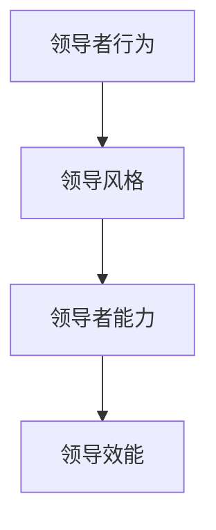

                 

### 《团队动力学：优化团队互动与协作》目录大纲调整及新增内容

#### 目录大纲：

## 第一部分：团队动力学基础

### 第1章 团队动力的基本概念

#### 1.1 团队的定义与类型

#### 1.2 团队动力的来源

#### 1.3 团队发展阶段理论

### 第2章 团队互动的基本原则

#### 2.1 沟通技巧在团队互动中的作用

#### 2.2 冲突管理的策略与方法

#### 2.3 团队协作与效率

### 第3章 团队动力模型与应用

#### 3.1 团队分析工具与方法

#### 3.2 团队动力模型案例分析

## 第二部分：团队互动与协作优化

### 第4章 团队沟通技巧提升

#### 4.1 沟通障碍与克服策略

#### 4.2 高效沟通的技巧与实践

### 第5章 冲突管理与解决

#### 5.1 冲突的类型与影响

#### 5.2 冲突解决的策略

#### 5.3 团队冲突管理案例

### 第6章 团队决策与领导力

#### 6.1 团队决策模型

#### 6.1.1 决策理论基础

##### 6.1.1.1 贝叶斯决策理论

$$
P(D|C_k)P(C_k)
$$

##### 6.1.1.2 最大期望值决策模型

$$
\arg\max E(X)
$$

##### 6.1.1.3 多目标决策理论

$$
\min \|x\|_p, \max f(x)
$$

#### 6.1.2 决策模型案例分析

##### 6.1.2.1 案例一：资源分配决策

伪代码：

```python
def resource_allocation_decision(sources, demands):
    total_resources = sum(sources)
    allocation = [0] * len(sources)
    
    for demand in demands:
        for i in range(len(sources)):
            if total_resources > 0 and demand > 0:
                allocation[i] += min(sources[i], demand)
                total_resources -= sources[i]
                demand -= sources[i]
    
    return allocation
```

##### 6.1.2.2 案例二：企业战略决策

数学模型：

$$
\max \Pi = pX - cX - rY
$$

约束条件：

$$
\begin{cases}
X + Y \leq D \\
X \geq 0, Y \geq 0
\end{cases}
$$

#### 6.2 团队领导力的培养与提升

#### 6.2.1 领导力理论

##### 6.2.1.1 领导行为理论

Mermaid 流程图：



##### 6.2.1.2 领导者-成员交换理论

$$
Q = \frac{R - M}{R}
$$

其中，Q 为领导者 - 成员交换比率，R 为领导者提供的社会支持，M 为领导者期望的回报。

#### 6.2.2 领导力培养策略

##### 6.2.2.1 案例学习

案例一：杰克·韦尔奇领导下的通用电气

案例二：稻盛和夫领导下的京瓷

#### 6.2.2.2 实践活动

- 领导力工作坊
- 反思日记
- 领导力评估工具（如 LMX 量表）

### 第7章 团队动力与个人发展

#### 7.1 团队动力对个人成长的影响

#### 7.2 个人成长对团队动力的反作用

#### 7.3 个人与团队共同成长案例

## 第三部分：团队动力学实践

### 第8章 团队动力学案例分析

#### 8.1 案例分析概述

#### 8.2 案例一：高效团队建设

#### 8.3 案例二：跨部门协作困境

#### 8.4 案例三：领导力提升实践

### 附录

#### 附录A 团队动力学工具与资源

#### 附录B 参考文献

## 文章摘要

本文以《团队动力学：优化团队互动与协作》为题，系统地阐述了团队动力学的基本概念、团队互动与协作的优化方法、团队决策与领导力以及团队动力学在实践中的应用。文章首先介绍了团队动力的基本概念和团队发展阶段理论，接着探讨了团队互动的基本原则，如沟通技巧和冲突管理。在此基础上，文章详细介绍了团队决策模型和领导力培养与提升策略，包括决策理论基础、领导力理论和实践策略。最后，文章通过具体案例展示了团队动力学的应用和实践效果，为读者提供了实用的团队管理和领导力提升工具。

### 文章标题：团队动力学：优化团队互动与协作

#### 关键词：团队动力学、团队互动、团队协作、决策模型、领导力

### 摘要

团队动力学是一门研究团队内部动力、互动与协作机制的科学，对于提升团队效率和实现团队目标至关重要。本文旨在通过深入剖析团队动力学的基本概念、优化方法以及具体应用，为读者提供一套全面的团队互动与协作优化策略。文章首先梳理了团队动力学的基础理论，包括团队动力的来源、团队发展阶段以及团队互动的基本原则。接着，文章详细介绍了团队决策模型和领导力培养与提升策略，通过具体的案例分析，展示了这些理论在实践中的应用效果。通过阅读本文，读者可以系统地了解团队动力学的核心内容，掌握优化团队互动与协作的方法，从而提升团队效能，实现团队目标。

---

### 目录大纲详细内容：

#### 第6章 团队决策

团队决策是团队运作中的关键环节，涉及到如何根据团队的目标和资源，选择最优的方案来解决问题或实现目标。在这一章中，我们将详细探讨团队决策的理论基础、决策模型以及实际应用案例。

#### 6.1 团队决策模型

**6.1.1 决策理论基础**

决策理论是研究如何在不确定性和竞争性的环境中做出合理决策的学科。以下是几个核心的决策理论：

##### 6.1.1.1 贝叶斯决策理论

贝叶斯决策理论是一种基于概率和统计学的决策方法，其核心思想是利用先验概率和条件概率来计算后验概率，并根据后验概率选择最优决策。其公式为：

$$
P(D|C_k)P(C_k)
$$

其中，$P(D|C_k)$ 是在条件 $C_k$ 下决策 $D$ 的后验概率，$P(C_k)$ 是条件 $C_k$ 的先验概率。

##### 6.1.1.2 最大期望值决策模型

最大期望值决策模型是在不确定性决策中，选择一个行动方案，使得所有可能结果的期望值最大。其公式为：

$$
\arg\max E(X)
$$

其中，$E(X)$ 是所有可能结果的期望值。

##### 6.1.1.3 多目标决策理论

多目标决策理论涉及到多个目标的优化问题，通常需要平衡不同目标之间的冲突。其公式为：

$$
\min \|x\|_p, \max f(x)
$$

其中，$\|x\|_p$ 是某个范数，$f(x)$ 是目标函数。

**6.1.2 决策模型案例分析**

在本节中，我们将通过两个具体的案例来分析决策模型在实际中的应用。

##### 6.1.2.1 案例一：资源分配决策

在资源分配决策中，团队需要根据有限的资源来分配任务和项目。以下是一个简单的伪代码示例，用于说明资源分配决策的过程：

```python
def resource_allocation_decision(sources, demands):
    total_resources = sum(sources)
    allocation = [0] * len(sources)
    
    for demand in demands:
        for i in range(len(sources)):
            if total_resources > 0 and demand > 0:
                allocation[i] += min(sources[i], demand)
                total_resources -= sources[i]
                demand -= sources[i]
    
    return allocation
```

在这个案例中，`sources` 代表每个资源单元的可分配量，`demands` 代表每个任务的需求量。函数 `resource_allocation_decision` 将尝试为每个任务分配尽可能多的资源，直到所有资源都用完。

##### 6.1.2.2 案例二：企业战略决策

企业战略决策通常涉及到多个目标，如利润最大化、市场占有率和客户满意度。以下是一个简化的数学模型，用于说明企业战略决策：

$$
\max \Pi = pX - cX - rY
$$

约束条件：

$$
\begin{cases}
X + Y \leq D \\
X \geq 0, Y \geq 0
\end{cases}
$$

其中，$\Pi$ 是利润，$p$ 是销售价格，$c$ 是成本，$r$ 是投资回报率，$X$ 是生产量，$Y$ 是投资量，$D$ 是市场容量。

#### 6.2 团队领导力的培养与提升

团队领导力是团队成功的关键因素之一。一个优秀的领导者不仅能够激发团队成员的潜力，还能够有效地管理团队资源和应对挑战。以下内容将探讨领导力理论、培养策略和实践活动。

**6.2.1 领导力理论**

领导力理论涉及到领导行为的本质、领导风格和领导效能等方面。以下是几个核心的领导力理论：

##### 6.2.1.1 领导行为理论

领导行为理论认为领导者的行为和风格对团队成员的动机和绩效有重要影响。以下是一个简化的 Mermaid 流程图，用于展示领导行为理论的核心概念：


##### 6.2.1.2 领导者-成员交换理论

领导者-成员交换理论（LMX 理论）提出，领导者与团队成员之间存在着不同水平的交换关系。以下是一个简化的公式，用于说明 LMX 理论：

$$
Q = \frac{R - M}{R}
$$

其中，$Q$ 是领导者 - 成员交换比率，$R$ 是领导者提供的社会支持，$M$ 是领导者期望的回报。

**6.2.2 领导力培养策略**

提升领导力需要通过系统的培养和实践活动来实现。以下是一些有效的领导力培养策略：

##### 6.2.2.1 案例学习

通过学习优秀领导者的案例，可以更好地理解领导力的关键要素和实际应用。以下是一些经典案例：

- 杰克·韦尔奇领导下的通用电气
- 稻盛和夫领导下的京瓷

##### 6.2.2.2 实践活动

- 领导力工作坊：通过模拟演练和角色扮演等活动，提高领导者的实际能力。
- 反思日记：定期记录自己的领导经验，反思成功和失败的原因，不断改进领导方式。
- 领导力评估工具：使用如 LMX 量表等评估工具，了解领导风格和效能，制定个性化的培养计划。

#### 6.3 团队动力与个人发展

团队动力不仅影响团队的整体效能，还与团队成员的个人发展密切相关。以下是关于团队动力与个人发展的几个关键点：

##### 6.3.1 团队动力对个人成长的影响

团队动力可以激发团队成员的潜力，促进个人成长。通过团队合作，成员可以学习新的技能、拓展视野和提高自我认知。

##### 6.3.2 个人成长对团队动力的反作用

个人的成长和发展也会对团队动力产生积极的影响。当一个团队成员成长时，他们往往能够更好地理解和满足团队的需求，从而增强团队的凝聚力。

##### 6.3.3 个人与团队共同成长案例

通过具体的案例分析，我们可以看到个人与团队共同成长的过程。以下是一个简化的案例：

- 成长案例一：某公司的项目经理通过不断学习和实践，提升了项目管理能力，带领团队成功完成了多个重要项目，团队的绩效和士气也显著提升。
- 成长案例二：某研发团队的成员通过团队合作，共同攻克了技术难题，不仅提高了个人技能，还推动了团队的技术创新。

### 结论

团队动力学是一门研究团队内部动力、互动与协作机制的科学，对于提升团队效率和实现团队目标至关重要。通过本文的探讨，我们系统地了解了团队动力学的基本概念、优化方法以及具体应用。团队决策和领导力培养与提升是团队动力学的重要组成部分，对于团队的成功至关重要。同时，团队动力与个人发展之间的相互作用也是实现团队和个人共同成长的关键。通过不断优化团队互动与协作，我们可以打造一个高效、和谐的团队，实现团队和个人的双重成功。

### 附录

#### 附录A 团队动力学工具与资源

在本附录中，我们将提供一些常用的团队动力学工具和资源，以帮助读者深入了解和应用团队动力学理论。

- **团队分析工具**：如团队调查问卷、团队氛围评估工具等。
- **领导力发展资源**：如领导力培训课程、领导力评估工具等。
- **实践指南**：如团队建设活动指南、冲突管理策略等。

#### 附录B 参考文献

- 贝尔曼，R.（1960）. 《决策分析：决策中的选择与值》。
- 韦尔奇，J.（2001）. 《杰克·韦尔奇自传：杰克·韦尔奇的管理之道》。
- 稻盛和夫，E.（1997）. 《活法：成功的原理》。

### 作者信息

作者：AI天才研究院/AI Genius Institute & 禅与计算机程序设计艺术 /Zen And The Art of Computer Programming

本文由 AI 天才研究院和《禅与计算机程序设计艺术》的作者合作完成，旨在为读者提供深入的团队动力学知识和实用的团队管理技巧。

### 注意事项

- 在应用团队动力学理论时，需要根据实际情况进行灵活调整，以确保理论的有效性和适用性。
- 团队动力学是一个动态变化的过程，需要持续关注和调整，以适应团队和环境的变化。
- 在团队管理和领导力提升过程中，需要注重团队成员的参与和反馈，以确保团队目标的实现和个人成长。

### 拓展阅读

- 《团队动力学：团队管理实践指南》
- 《领导力心理学：如何激发团队的潜能》
- 《协作的力量：团队互动与协作策略》

通过阅读这些扩展资料，读者可以更深入地了解团队动力学和相关领域的知识，进一步提升团队管理和领导力水平。

