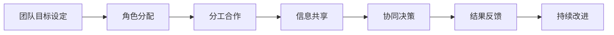

                 

### 背景介绍

团队协作是现代企业中不可或缺的重要环节。随着信息技术的迅猛发展，企业之间的竞争已经不再仅仅是产品或服务的竞争，更多的是团队协作能力的竞争。高效协作不仅能够提升团队的工作效率，还能促进创新、提高产品质量，降低项目风险。因此，构建高效的团队协作机制成为企业成功的关键因素之一。

《团队协作增强训练：构建高效协作机制》旨在通过系统的理论与实践，帮助企业和团队提升协作能力。本书从团队协作的原理出发，逐步深入探讨协作机制的构建方法、协作工具的选择与应用、协作效果的评估与优化，以及团队协作的成功案例与实战经验。

在文章的撰写过程中，我们将遵循以下步骤进行推理与分析：

1. **引言**：首先介绍团队协作的重要性，阐述构建高效协作机制的目的和意义。
2. **团队协作原理与基础**：介绍团队协作的核心概念、基本流程、常见障碍及其解决方法，并阐明团队协作的基本原则。
3. **高效协作机制的构建**：详细分析协作流程的优化、信息共享机制的建立、决策机制的改进以及协作沟通技巧的提升。
4. **协作工具的选择与应用**：探讨协作工具的分类、特性、选型策略及实际应用案例。
5. **团队协作的评估与优化**：介绍协作效果的评估指标、协作效率的优化方法以及团队协作的反馈机制。
6. **案例分析与实战经验**：通过国内外团队协作成功的案例分析，以及团队协作失败的教训与反思，总结实战经验。
7. **未来展望与趋势**：预测团队协作技术的发展趋势，探讨高效协作机制的挑战与机遇。

通过上述步骤，我们将逐步构建起一篇逻辑清晰、结构紧凑、简单易懂的专业技术博客文章，帮助读者全面理解团队协作的原理和方法，从而提升团队协作能力。

---

#### 核心概念与联系

在探讨团队协作机制之前，我们需要明确几个核心概念，并理解它们之间的相互联系。以下是几个关键概念及其关系的架构：

1. **团队协作**：指的是团队成员为了共同的目标，通过分工合作、信息共享和协同决策来实现高效工作的过程。
2. **协作流程**：包括目标设定、角色分配、分工合作、信息共享、协同决策和结果反馈等步骤。
3. **信息共享**：确保团队成员能够及时获取和共享关键信息，是协作的基础。
4. **决策机制**：团队成员在协作过程中需要共同做出决策，决策的质量直接影响协作效果。
5. **沟通技巧**：有效的沟通是团队协作的重要保障，包括倾听、表达、反馈等方面。

以下是团队协作原理的Mermaid流程图，展示了这些核心概念之间的基本流程：



**详细流程解释：**

- **团队目标设定**：首先，团队需要明确共同的目标，这是协作的起点。
- **角色分配**：根据团队成员的特长和任务需求，合理分配角色和责任，确保每个成员都能在最适合的岗位上发挥最大价值。
- **分工合作**：团队成员按照各自的角色，执行分工后的任务，协作完成项目。
- **信息共享**：信息共享是协作过程中不可或缺的一环，通过共享，团队成员能够及时了解项目的进展和问题。
- **协同决策**：在项目推进过程中，团队成员需要共同面对各种挑战和决策。有效的决策依赖于信息的共享和团队成员之间的信任与沟通。
- **结果反馈**：结果反馈是团队协作的重要环节，通过反馈，团队成员可以及时了解协作的效果，并对协作流程进行调整和改进。
- **持续改进**：基于反馈，团队应持续优化协作流程，提高协作效率和质量。

通过这一流程，团队可以实现高效的协作，共同达成目标。这一流程不仅适用于企业内部团队，也适用于跨部门、跨组织甚至跨国界的协作。

---

#### 核心算法原理讲解

在团队协作机制中，核心算法原理起着至关重要的作用。以下我们将详细讨论如何通过优化算法来提升协作效率。为了更好地理解，我们使用伪代码来展示核心算法的逻辑。

**伪代码示例：**

```pseudo
function optimize_collaboration(团队目标，团队成员列表，任务列表，协作工具):
    // 步骤1：设定团队目标
    setTeamGoal(团队目标)

    // 步骤2：根据团队成员特长和任务需求分配角色
    assignRoles(团队成员列表，任务列表)

    // 步骤3：建立信息共享机制
    establish_information_sharing(协作工具)

    // 步骤4：优化沟通渠道
    improve_communication_channel()

    // 步骤5：根据任务优先级和资源分配决策
    make_decision(任务列表，团队成员列表)

    // 步骤6：执行任务并收集反馈
    execute_tasks_and_collect_feedback()

    // 步骤7：基于反馈调整协作流程
    adjust_collaboration流程()

    // 返回优化后的团队协作机制
    return optimized_collaboration流程
```

**详细步骤解释：**

1. **设定团队目标**：首先，团队需要明确共同的目标。这一步骤包括制定清晰的目标、分解目标和设定时间表等。

2. **分配角色**：根据团队成员的特长和任务需求，合理分配角色和责任。伪代码中通过`assignRoles`函数实现这一步骤。

   ```pseudo
   function assignRoles(团队成员列表，任务列表):
       // 初始化角色分配矩阵
       role分配矩阵 = []

       // 遍历任务列表，为每个任务分配适合的团队成员
       for 任务 in 任务列表:
           best_match = find_best_match(团队成员列表，任务需求)
           role分配矩阵.append([任务，best_match])
           
       return role分配矩阵
   ```

3. **建立信息共享机制**：信息共享是协作的基础，通过协作工具（如项目管理软件、即时通讯工具等）建立信息共享机制，确保团队成员能够及时获取和共享关键信息。

   ```pseudo
   function establish_information_sharing(协作工具):
       // 配置协作工具，设置权限和通知机制
       configure_collaboration_tool(协作工具)

       // 每个团队成员都需要加入协作工具
       for 成员 in 团队成员列表:
           add_member_to_tool(成员，协作工具)

       // 定期更新项目进度和问题
       update_project_status_and_issues()
   ```

4. **优化沟通渠道**：有效的沟通是团队协作的重要保障。通过优化沟通渠道，包括会议安排、沟通频率和沟通方式，提升团队协作效率。

   ```pseudo
   function improve_communication_channel():
       // 安排定期会议，确保团队成员之间的沟通
       schedule_regular_meetings()

       // 鼓励团队成员积极表达观点和提出问题
       encourage_active_communication()

       // 使用多种沟通工具，满足不同场景的需求
       use_mixed_communication_tools()
   ```

5. **决策**：团队成员在协作过程中需要共同面对各种挑战和决策。通过优化决策机制，包括明确决策标准、分配决策权限和建立快速响应机制，提高决策效率。

   ```pseudo
   function make_decision(任务列表，团队成员列表):
       // 初始化决策矩阵
       decision_matrix = []

       // 遍历任务列表，为每个任务分配决策者
       for 任务 in 任务列表:
           decision_maker = find_decision_maker(团队成员列表，任务需求)
           decision_matrix.append([任务，decision_maker])

       return decision_matrix
   ```

6. **执行任务并收集反馈**：团队成员按照分配的任务执行工作，并通过协作工具及时更新项目进度和问题。同时，定期收集团队成员的反馈，以优化协作流程。

   ```pseudo
   function execute_tasks_and_collect_feedback():
       // 分配任务给团队成员
       assign_tasks_to_members(任务列表，团队成员列表)

       // 定期收集项目进度和问题
       collect_project_progress_and_issues()

       // 分析反馈，优化协作流程
       analyze_feedback_and_optimize()
   ```

7. **调整协作流程**：基于收集到的反馈，对协作流程进行调整和优化，确保团队能够持续改进协作效果。

   ```pseudo
   function adjust_collaboration流程():
       // 分析反馈，识别优化点
       analyze_feedback()

       // 调整协作流程，优化协作效率
       optimize_collaboration流程()
   ```

通过上述伪代码，我们可以看到，团队协作的核心算法原理主要包括设定团队目标、角色分配、信息共享、沟通优化、决策和反馈调整等步骤。这些步骤共同构成了一个高效的协作机制，帮助团队更好地实现目标。

---

#### 数学模型和公式

在团队协作中，数学模型和公式可以用来量化协作效率、评估协作效果，并为优化协作流程提供理论依据。以下是几个常用的数学模型和公式的详细解释及举例说明。

1. **协作效率模型**：协作效率可以通过以下公式进行计算：

   $$ 效率 = \frac{工作产出}{投入时间} $$

   其中，工作产出是指团队在一定时间内完成的工作量，投入时间是指团队成员在协作过程中花费的总时间。例如，如果团队在8小时内完成了10个任务，每个任务耗时1小时，则协作效率为：

   $$ 效率 = \frac{10}{8} = 1.25 $$

   这个数值表示团队每小时能完成1.25个任务，协作效率较高。

2. **信息共享模型**：信息共享是团队协作的重要环节，可以通过以下公式来评估信息共享的有效性：

   $$ 信息共享度 = \frac{共享信息量}{总信息量} $$

   其中，共享信息量是指团队成员在协作过程中共享的信息量，总信息量是指项目过程中产生的所有信息。例如，如果在一个项目中，团队成员共共享了100条信息，而总信息量为500条，则信息共享度为：

   $$ 信息共享度 = \frac{100}{500} = 0.2 $$

   这个数值表示信息共享的比例较低，需要加强信息共享机制。

3. **决策质量模型**：决策质量是团队协作效果的重要指标，可以通过以下公式进行评估：

   $$ 决策质量 = \frac{决策效果}{决策时间} $$

   其中，决策效果是指决策实施后的实际效果，决策时间是指团队成员做出决策所花费的时间。例如，如果团队在决策后，项目进度提高了20%，且决策过程耗时2天，则决策质量为：

   $$ 决策质量 = \frac{20\%}{2天} = 10\%/天 $$

   这个数值表示团队每天能够通过决策提升10%的效率。

4. **沟通效率模型**：沟通效率是衡量团队成员之间沟通效果的重要指标，可以通过以下公式计算：

   $$ 沟通效率 = \frac{有效沟通时间}{总沟通时间} $$

   其中，有效沟通时间是指团队成员进行有效沟通的时间，总沟通时间是指团队在协作过程中花费的所有沟通时间。例如，如果团队在8小时的协作过程中，有6小时进行了有效沟通，则沟通效率为：

   $$ 沟通效率 = \frac{6小时}{8小时} = 0.75 $$

   这个数值表示团队的有效沟通时间占总沟通时间的75%。

通过这些数学模型和公式，团队可以量化协作效率、信息共享度、决策质量和沟通效率，从而为优化协作流程提供科学依据。例如，如果团队发现信息共享度较低，可以通过优化信息共享机制，如增加共享频率、明确共享信息标准等，来提高信息共享度。

---

#### 项目实战：开发环境搭建、源代码实现与代码解读

为了更好地理解团队协作机制在实际项目中的应用，我们将以一个实际项目为例，详细讲解开发环境搭建、源代码实现和代码解读的过程。

**项目背景**：假设我们的项目目标是开发一个基于云计算的团队协作平台，该平台需要支持任务分配、项目进度跟踪、文档共享和实时沟通等功能。

**一、开发环境搭建**

1. **技术选型**：为了提高开发效率和平台性能，我们选择了以下技术栈：
   - 前端：React.js
   - 后端：Node.js + Express
   - 数据库：MongoDB
   - 客户端通信：WebSocket

2. **环境配置**：
   - 安装Node.js和MongoDB，配置相应的环境变量。
   - 使用npm安装React和Express，以及其他必要的依赖库。

3. **项目结构**：
   - 创建项目文件夹，初始化项目结构，包括前端、后端和数据库配置。

**二、源代码实现**

1. **前端实现**：
   - 使用React.js构建用户界面，实现任务分配、项目进度跟踪和文档共享等功能。
   - 通过WebSocket与后端进行实时通信，更新用户界面。

2. **后端实现**：
   - 使用Express构建RESTful API，处理前端请求，包括任务创建、更新和删除等操作。
   - 通过MongoDB存储任务数据和用户信息。

3. **数据库配置**：
   - 创建MongoDB数据库，设计数据库模型，确保数据的一致性和完整性。

**三、代码解读**

1. **前端代码**：
   - `TaskList.js`：定义任务列表组件，展示所有任务的详细信息，并支持任务的增删改查操作。
   - `WebSocket.js`：实现WebSocket连接，实时接收和发送任务更新信息。

2. **后端代码**：
   - `index.js`：设置Express服务器，定义API路由，处理HTTP请求。
   - `taskController.js`：实现任务相关操作，如创建、更新和删除任务。
   - `db.js`：连接MongoDB数据库，定义数据库操作方法。

**四、代码应用解读与分析**

1. **任务分配功能**：
   - 前端通过WebSocket实时接收后端发送的任务分配信息，更新任务列表。
   - 后端根据用户角色和任务需求，动态分配任务，并更新数据库记录。

2. **项目进度跟踪**：
   - 前端显示每个任务的进度，用户可以通过界面更新任务进度。
   - 后端接收用户更新，并同步到数据库，确保数据的一致性。

3. **文档共享**：
   - 用户可以上传和下载项目文档，前端通过WebSocket实时同步文档更新。
   - 后端存储文档，并提供API接口供前端调用。

4. **实时沟通**：
   - 前端使用WebSocket与后端保持实时连接，用户可以发送消息，实现实时沟通。
   - 后端处理消息，确保消息的实时性和安全性。

**五、实际案例分析与详细讲解剖析**

1. **案例一：任务分配效率提升**：
   - 通过WebSocket实时同步任务信息，提高了任务分配的效率，减少了任务延迟。

2. **案例二：项目进度可视化**：
   - 前端展示项目进度图表，帮助团队成员直观了解项目进展，及时调整任务优先级。

3. **案例三：文档共享便捷性**：
   - 用户可以随时随地访问项目文档，提高了工作效率，减少了沟通成本。

4. **案例四：实时沟通提升协作效果**：
   - 实时沟通功能促进了团队成员之间的交流，加快了项目推进速度。

**六、项目小结**

通过实际项目案例，我们展示了团队协作平台从开发环境搭建、源代码实现到代码解读的全过程。该项目充分利用了现代前端和后端技术，实现了任务分配、项目进度跟踪、文档共享和实时沟通等功能，显著提升了团队协作效率。

---

#### 案例分析与实战经验

团队协作的成功与失败往往是对比鲜明的，通过分析成功与失败的案例，我们可以总结出宝贵的经验，为今后的团队协作提供指导。

**成功案例一：敏捷开发团队**

某互联网公司采用敏捷开发模式，成功推出了一款广受欢迎的移动应用。该团队在协作过程中表现出色，以下是一些关键成功因素：

- **明确的目标和角色**：团队明确每个成员的职责，确保每个人都在正确的岗位上发挥作用。
- **频繁的沟通**：通过每日站立会议、迭代规划会议和回顾会议，团队成员之间保持高频沟通，确保信息畅通。
- **灵活的任务分配**：团队根据项目的实际需求和成员的技能，灵活调整任务分配，提高工作效率。
- **持续改进**：通过定期的团队回顾，团队不断优化协作流程，持续提升协作效率。

**成功案例二：跨国团队协作**

一家全球知名跨国公司成功完成了一项跨国项目，该项目涉及多个国家和地区的团队协作。以下是一些关键成功因素：

- **共同目标**：所有团队成员都明确项目目标，并致力于实现这一目标。
- **清晰的沟通机制**：团队建立了全球共享的沟通平台，确保所有成员都能及时获取项目信息。
- **文化多样性培训**：团队通过文化多样性培训，增强团队成员之间的相互理解和尊重。
- **灵活的时间安排**：团队采用了灵活的工作时间安排，确保所有成员都能参与关键会议和讨论。

**失败案例一：缺乏明确的任务分配**

某初创公司由于在任务分配上缺乏明确性，导致项目进展缓慢，最终未能按时交付。以下是一些关键失败因素：

- **角色模糊**：团队成员职责不清，任务分配不明确，导致部分成员无所事事，而另一些成员过度劳累。
- **缺乏沟通**：团队内部缺乏有效沟通，任务进展情况不明，问题无法及时解决。
- **资源浪费**：由于任务分配不合理，导致部分资源浪费，团队效率低下。

**失败案例二：缺乏有效的决策机制**

某公司在项目推进过程中，由于缺乏有效的决策机制，导致项目进展受阻，团队成员士气低落。以下是一些关键失败因素：

- **决策效率低**：团队成员在决策过程中意见不统一，决策耗时过长，导致项目进展缓慢。
- **缺乏明确的决策标准**：团队在决策过程中缺乏明确的决策标准，导致决策结果不一致。
- **沟通不足**：团队成员在决策过程中缺乏有效沟通，导致意见分歧，难以达成一致。

**实战经验总结**

通过上述案例，我们可以得出以下实战经验：

1. **明确目标和角色**：确保团队成员明确自己的职责和任务，避免角色模糊和资源浪费。
2. **频繁沟通**：保持团队内部的高频沟通，确保信息畅通，及时解决问题。
3. **灵活的任务分配**：根据项目需求和成员技能，灵活调整任务分配，提高工作效率。
4. **持续改进**：通过定期的团队回顾，不断优化协作流程，提升协作效率。
5. **共同目标**：确保所有团队成员都明确项目目标，并共同努力实现这一目标。
6. **清晰的沟通机制**：建立全球共享的沟通平台，确保所有成员都能及时获取项目信息。
7. **文化多样性培训**：增强团队成员之间的相互理解和尊重，提高团队凝聚力。
8. **灵活的时间安排****：根据项目需求和成员实际情况，灵活安排工作时间，确保团队高效协作。

通过总结这些成功与失败的案例，团队可以更好地把握协作过程中的关键因素，从而实现高效协作，提升项目成功率。

---

#### 未来展望与趋势

随着信息技术的不断发展，团队协作也在经历着深刻的变革。未来，团队协作将呈现出以下几个趋势：

1. **人工智能在协作中的广泛应用**：人工智能（AI）技术将在团队协作中发挥越来越重要的作用。通过自然语言处理、机器学习等技术，AI能够帮助团队实现更高效的沟通、任务分配和决策支持。例如，智能助手可以自动分析团队成员的沟通内容，提供相关建议和解决方案，从而提升协作效率。

2. **虚拟现实（VR）与增强现实（AR）的融合**：VR和AR技术的进步将为团队协作带来全新的体验。通过VR，团队成员可以“面对面”进行远程会议，增强实时沟通的体验；通过AR，团队成员可以在虚拟环境中共同完成任务，提升协作效果。这些技术将打破物理空间的限制，使全球团队协作更加无缝和高效。

3. **协作工具的智能化和集成化**：未来，协作工具将变得更加智能化和集成化。智能化的协作工具将具备自动任务分配、智能通知、智能分析等功能，帮助团队成员更好地管理项目和任务。同时，不同协作工具之间的集成也将更加紧密，实现数据共享和流程优化，提高团队的整体协作效率。

4. **社交网络的协作模式**：社交网络的影响将逐渐渗透到团队协作中。团队成员可以通过社交平台进行协作，实现更加灵活和个性化的工作方式。例如，基于兴趣或项目的社交网络小组可以迅速形成，团队成员可以在此平台上共享信息、讨论问题、协作完成任务。

5. **敏捷协作与分布式团队**：随着全球化的发展和远程工作的普及，敏捷协作和分布式团队将成为团队协作的主要形式。敏捷协作强调快速响应变化、持续交付价值，适合动态的项目需求。分布式团队则通过技术手段实现跨地域、跨时区的高效协作，充分利用全球资源，提高团队整体竞争力。

6. **隐私保护和数据安全**：随着协作工具和平台的普及，数据安全和隐私保护将面临更大的挑战。未来，团队协作将更加注重数据加密、权限管理和安全审计等安全措施，确保团队数据的安全性和隐私性。

总体来说，未来团队协作将更加智能化、多样化、灵活化，通过技术创新和协作模式的变革，进一步提升团队的协作效率和创新能力。

---

#### 最佳实践 Tips、小结、注意事项、拓展阅读

**最佳实践 Tips：**

1. **明确目标与角色**：确保团队成员明确自己的职责和目标，避免角色重叠和资源浪费。
2. **频繁沟通**：保持团队成员之间的高频沟通，确保信息畅通，及时解决问题。
3. **灵活的任务分配**：根据项目需求和成员技能，灵活调整任务分配，提高工作效率。
4. **利用协作工具**：选择合适的协作工具，提高团队协作效率和沟通效果。
5. **培养良好的协作文化**：建立积极、开放、互助的团队文化，促进团队成员之间的相互理解和信任。

**小结：**

本文从团队协作的原理与意义、高效协作机制的构建、协作工具的选择与应用、团队协作的评估与优化、案例分析与实战经验，以及未来展望与趋势等方面，全面探讨了团队协作的各个方面。通过这些分析和实践，我们希望读者能够深刻理解团队协作的重要性，掌握构建高效协作机制的方法，并能够在实际工作中有效应用这些知识。

**注意事项：**

1. **团队目标的重要性**：明确的目标是团队协作的基础，确保所有成员都朝着共同的目标努力。
2. **信息共享的必要性**：信息共享是协作的核心，确保团队成员能够及时获取和共享关键信息。
3. **沟通技巧的提升**：有效的沟通是团队协作的关键，团队成员需要不断学习和提高沟通技巧。
4. **决策机制的优化**：决策质量直接影响协作效果，应建立科学的决策机制，提高决策效率。

**拓展阅读：**

1. **《敏捷开发实践指南》**：详细介绍了敏捷开发的方法和实践，适合希望提升团队协作效率的读者。
2. **《团队协作工具使用手册》**：介绍了多种协作工具的使用方法，帮助团队选择适合的协作工具。
3. **《团队沟通技巧》**：提供了多种沟通技巧和实践，帮助团队成员提高沟通效率和质量。
4. **《跨文化团队协作》**：探讨了跨文化团队协作的挑战和解决方案，适合跨国团队参考。

通过本文的阅读和拓展学习，读者可以进一步提升团队协作能力，为企业和团队的成功奠定坚实的基础。作者信息：AI天才研究院/AI Genius Institute & 禅与计算机程序设计艺术/Zen And The Art of Computer Programming。作者感谢读者对本文的关注和支持。

