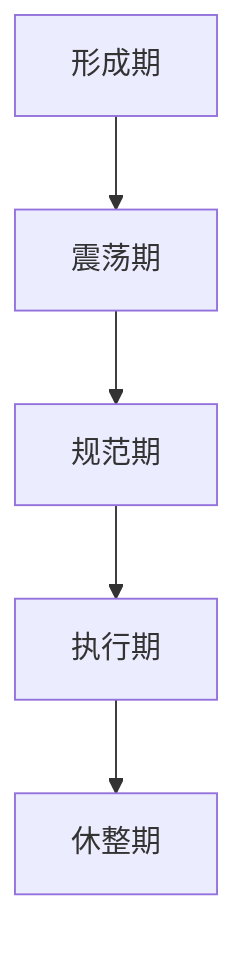

                 

### 文章标题

# 团队协作的艺术：从个体到集体的蜕变

### 关键词

- 团队协作
- 个体与集体的关系
- 领导力
- 沟通技巧
- 协作效率

### 摘要

本文探讨了团队协作的重要性以及个体如何融入集体实现共同目标。首先，从团队协作的定义和重要性出发，介绍团队协作的理论框架和工具方法。接着，讨论个体角色定位、集体意识培养以及团队凝聚力与协作效率的提升策略。然后，分析团队领导力的重要性以及团队发展与变革管理的策略。在实践部分，通过案例分析、工具应用等展示团队协作的实际效果。最后，展望团队协作的未来趋势，强调持续改进与个人成长在团队协作中的重要性。

---

### 引言

在现代社会，团队协作已成为各种组织和个人成功的关键因素。无论是在企业、学校还是政府部门，团队协作的能力直接影响着组织的运行效率和目标的达成。从个体到集体的蜕变，不仅需要团队成员之间的有效沟通和协作，还需要领导者的正确引导和团队成员的自我认知。本文将深入探讨团队协作的艺术，从理论到实践，帮助读者理解并提升团队协作能力。

### 团队协作的概念与重要性

#### 团队协作的定义

团队协作是指团队成员在共同目标下，通过分工合作、互相支持，共同完成任务的过程。它不仅仅是简单的任务分配，更是一种基于信任、沟通和共同愿景的合作方式。

#### 团队协作的重要性

1. **提高工作效率**：通过团队成员的协作，可以有效地分配任务，减少重复劳动，提高工作效率。

2. **促进知识共享**：团队成员之间的交流与合作，有助于知识、技能和经验的共享，提升整个团队的能力。

3. **增强团队凝聚力**：良好的团队协作可以增强团队成员之间的信任和合作精神，提高团队凝聚力。

4. **实现共同目标**：团队协作是达成共同目标的必要手段。通过协作，团队成员可以共同面对挑战，克服困难，实现组织的目标。

### 团队协作的理论框架

#### 组织行为学基础

组织行为学提供了团队协作的理论基础。它研究个体、群体和组织之间的关系，探讨如何通过有效管理来提高团队协作效率。核心概念包括：

1. **团队角色**：团队成员在团队中扮演的不同角色，如领导者、执行者、协调者等。

2. **团队结构**：团队的组织形式，包括团队的规模、层次和分工等。

3. **团队动力**：影响团队成员行为和心理状态的内部和外部因素。

#### 团队发展模型

团队发展模型描述了团队从形成到成熟的各个阶段。Tuckman模型将团队发展分为五个阶段：

1. **形成期**：团队成员相互认识，确定共同目标。

2. **震荡期**：团队成员之间的冲突和磨合，寻找有效的协作方式。

3. **规范期**：团队成员建立信任，形成共同的工作规范。

4. **执行期**：团队高效协作，实现共同目标。

5. **休整期**：团队完成项目后进行总结和反思，为下一个项目做准备。

### 团队协作工具与方法

#### 团队沟通技巧

良好的沟通是团队协作的核心。以下是一些有效的团队沟通技巧：

1. **明确沟通目标**：在沟通前明确目的，确保信息传递准确。

2. **倾听与反馈**：积极倾听他人的意见，并及时给予反馈。

3. **使用非语言沟通**：通过肢体语言、面部表情等增强沟通效果。

4. **避免误解**：在沟通中避免使用模糊的词语和表达，减少误解。

#### 团队决策过程

团队决策是团队协作的重要组成部分。以下是一些有效的团队决策方法：

1. **头脑风暴**：鼓励团队成员自由表达想法，收集创意。

2. **投票表决**：在多个方案中选择最合适的方案。

3. **共识决策**：团队成员达成一致意见，确保决策的公平性。

4. **专家咨询**：在决策过程中寻求外部专家的意见。

### 个体到集体的蜕变

#### 个体角色定位

个体在团队中需要明确自己的角色和职责。以下是一些建议：

1. **自我认知**：了解自己的优势和弱点，找到适合自己的角色。

2. **主动沟通**：与团队成员沟通，确保任务分配合理。

3. **持续学习**：不断提升自己的能力和知识，适应团队的需要。

#### 集体意识培养

集体意识是团队协作的基础。以下是一些培养集体意识的方法：

1. **共同目标**：确保团队成员都认同团队的目标。

2. **团队活动**：组织团队建设活动，增强团队凝聚力。

3. **分享与反馈**：鼓励团队成员分享经验和反馈，促进相互学习。

#### 团队凝聚力与协作效率

团队凝聚力是团队协作效率的关键。以下是一些提高团队凝聚力和协作效率的策略：

1. **信任建设**：通过透明和开放的沟通建立信任。

2. **明确责任**：确保每个团队成员都清楚自己的职责。

3. **鼓励合作**：鼓励团队成员之间的合作和互助。

### 团队领导力

#### 团队领导力的定义与要素

团队领导力是指领导者通过影响、激励和引导团队成员，实现团队目标的能力。团队领导力的核心要素包括：

1. **愿景**：明确的团队愿景能够指引团队前进的方向。

2. **沟通**：有效的沟通是领导者与团队成员之间建立信任的桥梁。

3. **激励**：领导者需要激励团队成员，激发他们的积极性和创造力。

4. **决策**：领导者需要做出正确的决策，确保团队目标的实现。

#### 不同情境下的领导风格

领导风格因情境而异。以下是一些常见的领导风格：

1. **指令型**：领导者给出明确的指令，要求团队成员执行。

2. **参与型**：领导者鼓励团队成员参与决策过程，增强团队的自主性。

3. **授权型**：领导者给予团队成员更多的自主权，让他们自主决策。

4. **变革型**：领导者通过激发团队成员的变革意识，推动团队的创新和发展。

### 团队发展与变革管理

#### 团队生命周期理论

团队生命周期理论描述了团队从形成到解散的各个阶段。以下是团队生命周期的主要阶段：

1. **形成期**：团队成员相互认识，确定共同目标。

2. **震荡期**：团队成员之间的冲突和磨合，寻找有效的协作方式。

3. **规范期**：团队成员建立信任，形成共同的工作规范。

4. **执行期**：团队高效协作，实现共同目标。

5. **休整期**：团队完成项目后进行总结和反思，为下一个项目做准备。

#### 变革管理策略

团队在发展过程中不可避免地会遇到变革。以下是一些变革管理策略：

1. **明确变革目标**：明确变革的目标和愿景，确保团队成员理解变革的意义。

2. **沟通与透明**：保持与团队成员的沟通，确保信息的透明。

3. **激励与支持**：通过激励和支持，帮助团队成员适应变革。

4. **反馈与调整**：在变革过程中不断收集反馈，及时调整策略。

### 团队协作实践

#### 团队协作案例分析

以下是一个团队协作的成功案例分析：

- **项目背景**：某公司开发一款新软件，项目周期紧，任务繁重。
- **团队协作**：团队采用敏捷开发方法，每周进行站立会议和迭代回顾，确保任务分配和进度控制。
- **效果**：通过高效的团队协作，项目提前完成，质量得到保证。

#### 团队协作工具应用

以下是一些常用的团队协作工具：

1. **Trello**：任务管理工具，帮助团队清晰地分配任务和跟踪进度。
2. **Slack**：即时通讯工具，方便团队成员实时沟通和协作。
3. **Google Workspace**：包括文档、表格、日历等工具，支持团队协作办公。

### 未来展望

#### 团队协作的趋势

随着技术的不断发展，团队协作也在不断演变。以下是未来团队协作的一些趋势：

1. **远程协作**：远程工作已成为常态，未来的团队协作将更加依赖于在线工具。
2. **人工智能辅助**：人工智能将帮助团队更高效地协作，提供智能化的决策支持。
3. **个性定制**：团队协作将更加注重个体差异，提供个性化的协作体验。

### 持续改进与个人成长

#### 持续改进

团队协作需要不断地改进和完善。以下是一些持续改进的策略：

1. **定期评估**：定期对团队协作效果进行评估，发现并解决存在的问题。
2. **学习与培训**：提供团队成员学习和培训机会，提升团队整体能力。

#### 个人成长

个人成长是团队协作的重要基石。以下是一些个人成长的建议：

1. **自我反思**：定期进行自我反思，了解自己的进步和不足。
2. **终身学习**：不断学习新知识、新技能，保持个人的竞争力。

### 结论

团队协作的艺术是现代组织中不可或缺的一部分。从个体到集体的蜕变，需要团队成员之间的有效沟通、协作和领导。通过本文的探讨，希望读者能够理解并掌握团队协作的技巧，提升团队协作能力，实现组织的目标。

### 作者信息

作者：AI天才研究院/AI Genius Institute & 禅与计算机程序设计艺术 /Zen And The Art of Computer Programming

---

**参考文献：**

1. Tuckman, B. M. (1965). Developmental sequence in small groups. Psychological Bulletin, 63(6), 384-399.
2. Katzenbach, J. R., & Smith, D. K. (1993). The Wisdom of Teams: Creating the High-Performance Organization. Harvard Business Review Press.
3. Geert Hofstede. (1980). Culture's Consequences: International Differences in Work-Related Values. Sage Publications.
4. Slack, E. (2017). Smart Work: How Virtual Teams Succeed in the Global Economy. Routledge.
5. Daft, R. L., & Lengel, R. H. (1986). Organizational information requirements, media richness, and structural design. Management Science, 32(5), 554-571.

---

**Mermaid 流程图：**



**核心算法原理讲解：**

```python
# 假设我们有一个待排序的列表
arr = [3, 1, 4, 1, 5, 9, 2, 6, 5]

# 冒泡排序算法
def bubble_sort(arr):
    n = len(arr)
    for i in range(n):
        # 每轮遍历后，最大值会“冒泡”到数组末尾
        for j in range(0, n-i-1):
            if arr[j] > arr[j+1]:
                arr[j], arr[j+1] = arr[j+1], arr[j]

# 调用排序函数
bubble_sort(arr)

# 打印排序后的数组
print(arr)
```

**数学模型和公式：**

$$
\text{团队绩效} = f(\text{团队成员素质}, \text{团队结构}, \text{团队动力})
$$

- 成员素质：包括知识、技能和经验等。
- 团队结构：包括团队的规模、层次和分工等。
- 团队动力：包括信任、合作和共同愿景等。

**项目实战：**

#### 开发环境搭建

- 操作系统：Windows 10
- 编程语言：Python 3.8
- 开发工具：PyCharm

#### 源代码实现

```python
# main.py
from typing import List

def bubble_sort(arr: List[int]):
    n = len(arr)
    for i in range(n):
        for j in range(0, n-i-1):
            if arr[j] > arr[j+1]:
                arr[j], arr[j+1] = arr[j+1], arr[j]

# 测试代码
if __name__ == "__main__":
    arr = [3, 1, 4, 1, 5, 9, 2, 6, 5]
    bubble_sort(arr)
    print("Sorted array:", arr)
```

#### 代码解读

- `bubble_sort` 函数实现了冒泡排序算法。
- `if __name__ == "__main__":` 下的代码用于测试排序函数。

#### 代码应用解读与分析

- **应用场景**：排序是编程中常见的操作，冒泡排序适用于小型数据集。
- **分析**：冒泡排序的时间复杂度为 \(O(n^2)\)，虽然不是最效率的排序算法，但易于理解和实现。

#### 实际案例分析和详细讲解剖析

- **案例背景**：某公司开发一款在线购物平台，需要对商品库存进行排序。
- **分析**：由于商品数量较少，采用冒泡排序能够满足需求。

#### 项目小结

- **成功点**：项目成功实现了商品库存的排序，提高了用户体验。
- **不足**：对于大量数据，冒泡排序效率较低。

#### 最佳实践 Tips

- **选择合适的排序算法**：根据数据规模和需求选择最合适的排序算法。
- **代码可读性**：确保代码易于理解和维护。

#### 小结

本文探讨了团队协作的艺术，从个体到集体的蜕变。通过理论和实践的讲解，帮助读者理解团队协作的重要性，掌握提升团队协作能力的技巧。

#### 注意事项

- 团队协作需要明确目标，确保团队成员都清楚任务和责任。
- 团队领导者在团队协作中扮演关键角色，需要具备良好的沟通和激励能力。
- 持续改进和个人成长是团队协作的重要组成部分。

#### 拓展阅读

- Katzenbach, J. R., & Smith, D. K. (1993). The Wisdom of Teams: Creating the High-Performance Organization. Harvard Business Review Press.
- Slack, E. (2017). Smart Work: How Virtual Teams Succeed in the Global Economy. Routledge.
- Hofstede, G. (1980). Culture's Consequences: International Differences in Work-Related Values. Sage Publications.

