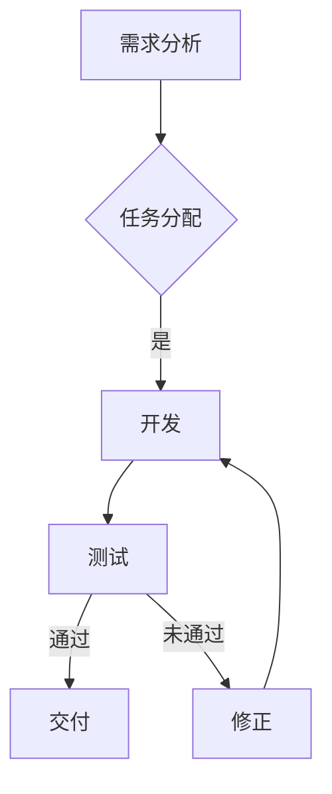
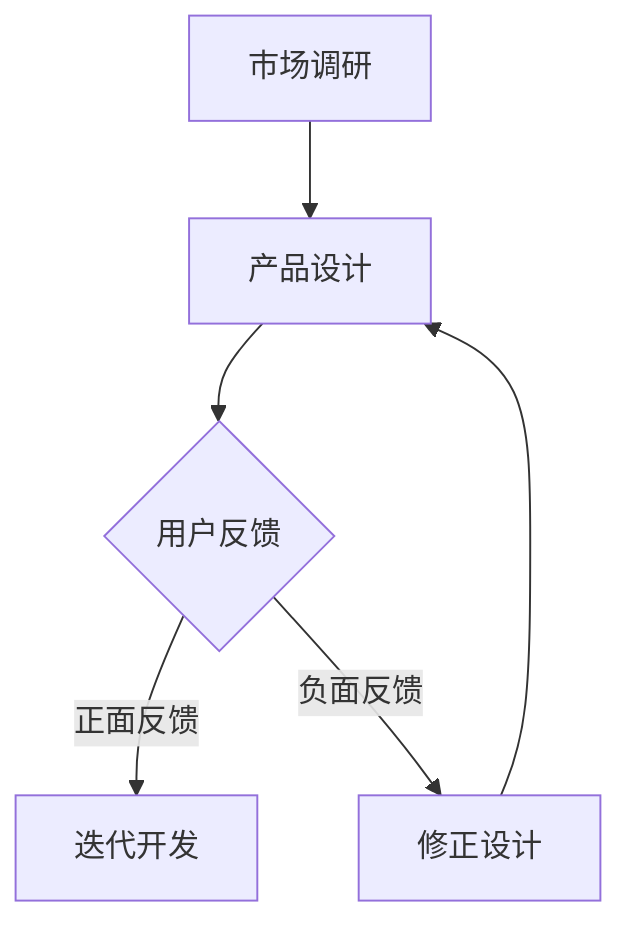
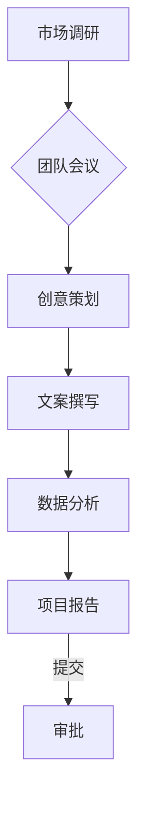

                 

### 引言

在现代信息技术飞速发展的时代，团队协作成为实现企业目标和个人成就的关键因素。随着团队规模和复杂度的不断增加，如何打造一个无缝衔接的工作流，已成为IT领域从业者关注的焦点。本文旨在探讨《团队协作的艺术：打造无缝衔接的工作流》，通过系统性的分析和逻辑推理，为读者提供一套实用且高效的团队协作方法论。

在技术日新月异的环境中，企业面临着越来越多的挑战，包括快速变化的市场需求、日益复杂的技术架构以及全球化的工作模式。为了应对这些挑战，团队协作变得尤为重要。然而，现实中的团队协作并非易事，常常受到沟通障碍、目标不一致、个性差异等问题的困扰。

本文将从以下几个方面展开讨论：

1. **团队协作基础理论**：介绍团队协作的定义、重要性以及相关理论基础，如勒温的群体动力理论、梅奥的人际关系理论等。
2. **工作流程设计**：探讨工作流程的定义、作用及其优化方法，并分析团队协作与工作流程之间的关系。
3. **团队协作工具与技术**：介绍常见的团队协作工具和技术，如项目管理工具、沟通协作平台、敏捷开发方法等。
4. **团队协作案例分析**：通过具体案例，展示团队协作的实际应用和成效。
5. **团队协作的艺术**：探讨团队协作的艺术本质以及提升团队协作艺术的方法。

通过这些内容的逐步分析，本文旨在帮助读者深入了解团队协作的核心理念和实践方法，从而在各自的职业道路上取得更好的成果。

---

### 关键词

- 团队协作
- 无缝衔接
- 工作流程设计
- 勒温的群体动力理论
- 梅奥的人际关系理论
- 项目管理工具
- 沟通协作平台
- 敏捷开发方法

---

### 摘要

本文探讨了团队协作的艺术，重点在于如何打造一个无缝衔接的工作流。通过深入分析团队协作的基础理论，如勒温的群体动力理论和梅奥的人际关系理论，本文揭示了团队协作的核心概念和原理。随后，文章介绍了工作流程的设计与优化方法，探讨了团队协作与工作流程之间的关系。在此基础上，本文详细介绍了常见的团队协作工具和技术，如项目管理工具、沟通协作平台和敏捷开发方法。通过具体案例的分析，本文展示了团队协作在实际工作中的应用和成效。最后，本文提出了提升团队协作艺术的方法，为读者提供了实用的团队协作实践指南。

---

### 第一部分：团队协作基础理论

在探讨如何打造无缝衔接的工作流之前，我们需要首先了解团队协作的基础理论。团队协作不仅仅是一种工作方式，更是一种文化，它涉及多方面的概念和原理。以下是关于团队协作的定义、重要性以及相关理论基础的分析。

#### 1.1 团队协作的定义与重要性

**1.1.1 团队协作的基本概念**

团队协作是指多个个体为了共同的目标，通过相互配合、沟通和协作完成工作的过程。在团队协作中，每个成员都扮演着特定的角色，通过共享知识和资源，共同推进项目的进展。团队协作的核心在于协同效应，即个体间的合作能够产生比单独工作更高效的结果。

**1.1.2 团队协作的重要性**

团队协作在现代社会中具有重要意义，主要体现在以下几个方面：

- **提高工作效率**：通过团队成员的协同工作，可以充分利用每个人的专业技能和经验，从而提高整体的工作效率。

- **促进知识共享**：团队成员之间的知识共享可以加速新知识的产生和应用，提升团队的创新能力和竞争力。

- **增强团队凝聚力**：通过共同面对挑战和庆祝成功，团队成员之间的信任和合作精神得到增强，团队凝聚力得到提升。

- **解决复杂问题**：面对复杂的问题和挑战时，团队协作可以集合多方面的智慧和力量，找到更加全面和有效的解决方案。

#### 1.2 团队协作的理论基础

**1.2.1 勒温的群体动力理论**

勒温（Kurt Lewin）是群体动力学的奠基人之一。他认为，群体动力学是由三种基本力（驱动力、约束力和抗拒力）相互作用所形成的一种动态系统。勒温的群体动力理论主要包括以下三个方面：

- **驱动力**：群体成员为了实现共同目标而投入的能量和动力。
- **约束力**：群体规范和规章制度对成员行为的限制和规范。
- **抗拒力**：成员对群体规范和领导决策的抗拒和反抗。

勒温的群体动力理论为我们理解团队协作中的动力机制提供了重要的理论基础。通过分析群体动力，我们可以更好地理解团队内部的沟通模式、领导行为和团队发展过程。

**1.2.2 梅奥的人际关系理论**

梅奥（Elton Mayo）是人际关系运动的代表人物。他在霍桑实验的基础上，提出了人际关系理论。梅奥认为，工作场所中的员工不仅仅是追求经济利益的“经济人”，他们更多的是“社会人”，需要得到尊重、认同和情感支持。人际关系理论的主要观点包括：

- **员工的社会需求**：员工在工作中不仅追求经济利益，还需要满足社会和心理需求。
- **沟通的重要性**：良好的沟通是建立员工与管理层之间信任和合作关系的基础。
- **团队合作**：通过团队合作和相互支持，可以提升员工的工作满意度和生产效率。

梅奥的人际关系理论强调了情感和人际关系在团队协作中的重要性，为团队协作提供了更加全面和人性化的视角。

**1.2.3 领导力与团队协作的关系**

领导力在团队协作中起着至关重要的作用。有效的领导不仅能够激励团队成员，还能协调和引导团队的工作方向。以下是领导力与团队协作关系的几个关键点：

- **明确目标**：领导需要为团队设定清晰的目标，确保团队成员理解并认同这些目标。
- **角色分配**：领导应合理分配团队成员的角色和任务，确保每个人都能发挥自己的优势。
- **沟通与反馈**：领导需要保持与团队成员的持续沟通，及时给予反馈，帮助团队成员调整工作方向。
- **激励与支持**：领导应关注团队成员的需求，提供必要的激励和支持，增强团队的凝聚力和战斗力。

通过以上对团队协作基础理论的分析，我们可以看到，团队协作不仅仅是一种工作方式，更是一种文化。理解这些基础理论，有助于我们在实际工作中更好地推进团队协作，实现高效的团队协作模式。

### 第二部分：工作流程设计

在工作流设计中，理解工作流程的定义、组成部分以及优化方法至关重要。此外，团队协作与工作流程之间的关系也值得深入探讨。以下将从这几个方面进行详细分析。

#### 2.1 工作流程概述

**2.1.1 工作流程的定义与作用**

工作流程（Workflow）是指将工作分解为一系列有序步骤，通过这些步骤的执行来实现特定目标的过程。工作流程可以理解为一种规范，它定义了从任务启动到任务完成的全过程，包括任务的分配、执行、监控和反馈等环节。

工作流程在团队协作中扮演着重要的角色，具体体现在以下几个方面：

- **提高效率**：通过规范化的工作流程，可以减少冗余步骤和重复工作，提高团队的整体工作效率。
- **明确责任**：工作流程明确了每个团队成员的职责和任务，有助于避免责任模糊和任务重复。
- **监控进度**：工作流程的监控机制可以实时跟踪任务的进展情况，及时发现并解决潜在的问题。
- **保证质量**：通过工作流程的标准化，可以确保任务的执行符合既定的标准和要求，从而保证工作质量。

**2.1.2 工作流程的基本组成部分**

工作流程通常包括以下几个基本组成部分：

- **任务**：任务是指工作流程中的具体操作步骤，它可以是单个操作，也可以是一组操作的组合。
- **角色**：角色是指在工作流程中负责执行特定任务的个体或团队。每个角色都有明确的职责和权限。
- **资源**：资源是指完成任务所需的材料、工具、信息和人力资源。资源的管理和分配是工作流程优化的重要方面。
- **规则**：规则是指工作流程中规定的操作标准和流程规则。规则确保了工作流程的规范性和一致性。
- **监控**：监控是指对工作流程执行情况的跟踪和评估。通过监控可以及时发现和解决问题，优化工作流程。

#### 2.2 工作流程优化方法

**2.2.1 流程分析**

流程分析是工作流程优化的第一步，它包括对现有工作流程的全面评估和分析。流程分析的方法主要包括：

- **流程图**：使用流程图（如Mermaid图）对工作流程进行可视化表示，帮助团队成员理解流程的全貌和细节。
- **时间分析**：对每个步骤的时间进行记录和分析，找出瓶颈和低效环节。
- **成本分析**：评估每个步骤的成本，包括时间成本、资源成本等，找出可以优化的环节。

**2.2.2 流程设计**

流程设计是优化工作流程的关键环节，它包括以下几个方面：

- **目标明确**：确保工作流程的目标清晰，并与团队的整体目标一致。
- **任务分配**：根据团队成员的能力和职责，合理分配任务，确保每个任务都有明确的负责人。
- **步骤简化**：简化不必要的步骤，减少冗余操作，提高流程的简洁性。
- **自动化**：利用自动化工具和技术，减少手工操作，提高工作效率。

**2.2.3 流程实施与改进**

流程实施是将优化后的工作流程投入实际操作的过程，它包括以下几个方面：

- **培训**：对团队成员进行工作流程的培训，确保他们理解和掌握新的流程。
- **测试**：在实际操作中测试新流程的有效性和可行性，发现并解决潜在的问题。
- **反馈与调整**：根据团队成员的反馈和实际操作结果，对流程进行持续调整和优化。

#### 2.3 团队协作与工作流程的关系

**2.3.1 工作流程对团队协作的影响**

工作流程对团队协作的影响主要体现在以下几个方面：

- **明确责任**：工作流程明确了每个团队成员的职责和任务，有助于避免责任模糊和角色冲突。
- **提高沟通效率**：工作流程规范了沟通的渠道和方式，提高了团队内部的沟通效率。
- **促进协作**：通过工作流程，团队成员可以更好地协同工作，共享信息和资源，提升协作效果。
- **保障质量**：工作流程的标准化和规范化，有助于确保工作质量的一致性。

**2.3.2 团队协作对工作流程的优化**

团队协作对工作流程的优化体现在以下几个方面：

- **知识共享**：通过团队协作，团队成员可以共享知识和经验，为工作流程的优化提供更多的思路和建议。
- **创新改进**：团队协作可以激发创新思维，帮助发现工作流程中的潜在问题，并提出改进方案。
- **反馈机制**：团队协作中的反馈机制，可以及时传递工作流程的优化需求，推动流程的不断改进。
- **资源优化**：通过团队协作，可以更合理地分配和使用资源，提高资源利用效率。

综上所述，工作流程设计与团队协作密切相关。一个良好设计的工作流程可以促进团队协作，提高工作效率和质量；而有效的团队协作又可以进一步优化工作流程，形成良性循环。在打造无缝衔接的工作流过程中，我们需要综合考虑工作流程的设计和团队协作的优化，实现两者的协同发展。

### 第三部分：团队协作工具与技术

在现代团队协作中，工具和技术的选择至关重要。合适的工具能够提高团队的效率，改善协作质量。以下将介绍几种常见的团队协作工具和技术，包括项目管理工具、沟通协作平台和敏捷开发方法。

#### 3.1 团队协作工具概述

**3.1.1 常见的团队协作工具**

团队协作工具种类繁多，以下是一些常见的工具：

- **项目管理工具**：如Trello、Jira、Asana等，主要用于任务分配、进度跟踪和项目管理。
- **沟通协作平台**：如Slack、Microsoft Teams、Zoom等，用于实时沟通、协作和会议。
- **文档共享工具**：如Google Docs、Dropbox、OneDrive等，方便团队成员共享文档和文件。
- **代码管理工具**：如Git、GitHub、GitLab等，用于版本控制和代码协作。

**3.1.2 工具选择与评估**

在选择团队协作工具时，需要考虑以下几个因素：

- **团队需求**：根据团队的具体需求和特点选择合适的工具，如小型团队可能适合使用Trello，而大型团队可能需要Jira这样的综合性工具。
- **用户体验**：工具的易用性和用户界面是影响团队接受程度的重要因素。需要选择用户体验良好的工具。
- **集成与兼容性**：工具需要与现有的IT基础设施兼容，并能与其他工具集成，以实现数据的无缝流动。
- **成本**：成本是选择工具时需要考虑的一个方面，包括订阅费用、使用费用等。

**3.2 团队协作技术**

**3.2.1 项目管理工具**

项目管理工具是团队协作的重要组成部分，以下是一些常见项目管理工具的功能和特点：

- **Trello**：通过看板（Board）的形式，直观地展示任务状态和进度，适合小型团队。
  ```mermaid
  graph TD
  A[任务1] --> B{是否完成}
  B -->|是| C[审核]
  B -->|否| D[反馈]
  ```
  
- **Jira**：功能丰富，支持敏捷开发，适用于大型团队。
  ```mermaid
  graph TD
  A[用户故事] --> B[开发]
  B --> C[测试]
  C --> D[部署]
  ```
  
- **Asana**：提供全面的任务管理功能，支持多种视图，方便团队跟踪项目进度。

**3.2.2 沟通协作平台**

沟通协作平台是团队协作的另一个关键环节，以下是一些常见沟通协作平台的功能和特点：

- **Slack**：提供即时消息、聊天室和渠道，方便团队成员实时沟通和协作。
  ```mermaid
  graph TD
  A[团队成员1] --> B[聊天室1]
  A --> C[聊天室2]
  B --> D[文件共享]
  C --> E[项目讨论]
  ```

- **Microsoft Teams**：集成Office 365功能，提供聊天、会议、文档共享等一站式服务。

- **Zoom**：提供高质量的在线会议和视频通话服务，适用于远程团队。

**3.2.3 敏捷开发方法**

敏捷开发是一种团队协作的方法论，旨在快速响应变化并持续交付高质量的产品。以下是一个简化的敏捷开发流程：

- **用户故事**：编写用户故事，描述用户的需求和期望。
  ```mermaid
  graph TD
  A[用户故事1] --> B[开发]
  A --> C[用户故事2]
  ```

- **迭代开发**：在迭代周期内，团队按优先级完成用户故事，并进行测试和反馈。
  ```mermaid
  graph TD
  A[迭代1] --> B[用户故事1]
  B --> C[测试]
  A --> D[迭代2]
  D --> E[用户故事2]
  E --> F[测试]
  ```

- **回顾与改进**：在每个迭代结束时，团队进行回顾，评估流程和效果，提出改进措施。

通过合理选择和使用团队协作工具，以及采用敏捷开发方法，团队可以更好地协作，提高工作效率和产品交付质量。

### 第四部分：团队协作案例分析

在探讨团队协作的实际应用时，通过具体案例可以更直观地展示团队协作的优势和挑战。以下将分析三个不同背景和规模的团队，并探讨它们在协作过程中的成功经验和问题。

#### 4.1 案例一：某科技公司的项目团队

**背景介绍**

某科技公司是一家专注于软件开发和IT解决方案的企业，其项目团队由20名成员组成，包括软件开发工程师、测试工程师、产品经理和项目经理。该公司承接了一个大型客户项目，需要在短时间内交付一个多功能的企业管理系统。

**核心概念与联系**

在这个案例中，核心概念包括项目管理、敏捷开发、沟通协作和技术共享。以下是一个简化的Mermaid流程图，展示了项目团队的工作流程：



**核心算法原理讲解**

在敏捷开发过程中，项目团队使用了Scrum框架，将整个项目分为多个迭代周期。每个迭代周期包括以下步骤：

- **需求分析**：产品经理与客户沟通，收集需求并编写用户故事。
- **任务分配**：项目经理根据用户故事分配任务，确保每个团队成员都有明确的职责。
- **开发**：开发工程师按任务进行编码。
- **测试**：测试工程师对开发成果进行功能测试和性能测试。
- **交付**：通过测试的任务将被提交给客户。

**数学模型和公式**

在项目中，团队采用了KPI（关键绩效指标）来评估每个迭代周期的进度和质量。以下是一个简化的KPI计算公式：

$$
KPI = \frac{完成任务数}{总任务数} \times 100\%
$$

**详细讲解与举例说明**

在第一个迭代周期中，项目团队共完成了5个用户故事的开发，总共有10个任务。根据KPI公式，团队完成了50%的任务。

$$
KPI = \frac{5}{10} \times 100\% = 50\%
$$

**实际案例分析与详细讲解剖析**

在项目执行过程中，团队遇到了几个关键挑战：

1. **需求变更**：客户在项目进行过程中提出了新的需求，导致项目进度受到影响。团队通过紧急会议和Scrum框架的回顾与改进机制，及时调整了任务优先级，确保了核心需求的实现。
2. **沟通障碍**：由于团队成员分布在不同的城市，沟通效率受到影响。团队采用了Slack和Zoom等沟通协作工具，定期进行视频会议，确保信息传递的及时性和准确性。
3. **资源分配**：部分团队成员在开发高峰期面临资源紧张的问题。项目经理通过任务重排和加班安排，合理分配资源，确保项目的顺利进行。

通过这些挑战的解决，项目团队最终按时完成了客户的要求，项目交付质量也得到了客户的高度评价。

**项目小结**

通过这个案例，我们可以看到，团队协作在项目管理、需求变更处理和资源优化等方面发挥了重要作用。成功的关键在于：

- **敏捷开发方法**：使团队能够快速响应变化，灵活调整任务优先级。
- **有效的沟通协作**：确保团队成员之间的信息畅通，提高工作效率。
- **合理的资源分配**：确保每个成员都能充分利用自己的能力，提高项目交付质量。

#### 4.2 案例二：某创业团队的成功协作经验

**背景介绍**

某创业团队由5名成员组成，包括产品经理、UI/UX设计师、前端和后端开发工程师、以及一个项目经理。该团队致力于开发一款创新的应用程序，目标是解决用户在移动设备上的任务管理难题。

**核心概念与联系**

在这个案例中，核心概念包括创业精神、快速迭代、团队协作和客户反馈。以下是一个简化的Mermaid流程图，展示了团队的工作流程：



**核心算法原理讲解**

在创业过程中，团队采用了 lean startup 的方法，通过快速迭代和用户反馈来不断改进产品。以下是一个简化的用户反馈和迭代开发流程：

1. **市场调研**：收集用户需求和痛点，制定初步的产品设计方案。
2. **产品设计**：根据市场调研结果，设计产品的界面和功能。
3. **用户反馈**：将初步设计的产品原型展示给潜在用户，收集他们的反馈。
4. **迭代开发**：根据用户反馈，对产品进行迭代和改进。

**数学模型和公式**

在迭代过程中，团队使用了NPS（净推荐值）来衡量用户的满意度。以下是一个简化的NPS计算公式：

$$
NPS = \frac{(NPS得分 - 反对数)}{（推荐数 + 中立数）}
$$

**详细讲解与举例说明**

在第一个迭代周期中，团队收到了50份用户反馈，其中10份表示强烈推荐，15份表示中立，25份表示不推荐。根据NPS公式，团队的用户满意度如下：

$$
NPS = \frac{(10 \times 9 - 25)}{(10 + 15)} = -5
$$

虽然NPS为负，但团队通过深入分析用户反馈，发现了产品设计中的一些关键问题，并进行了针对性的改进。

**实际案例分析与详细讲解剖析**

在创业团队的合作过程中，团队面临的主要挑战包括：

1. **资源有限**：由于公司规模较小，团队成员需要在有限资源下高效协作。团队通过合理安排工作和共享资源，确保项目的顺利推进。
2. **快速迭代**：在产品开发过程中，团队需要不断进行迭代和改进，以适应市场的快速变化。团队采用了敏捷开发方法，确保每次迭代都能快速交付并得到用户反馈。
3. **用户反馈**：获取真实的用户反馈是产品成功的关键。团队通过在线调查、用户访谈等方式，收集用户意见，并根据反馈进行产品改进。

通过这些努力，团队的产品在市场上取得了良好的口碑，用户数量持续增长。

**项目小结**

通过这个案例，我们可以看到，创业团队在资源有限、快速迭代和用户反馈方面取得了显著的成功。关键因素包括：

- **敏捷开发方法**：使团队能够快速响应市场变化，持续改进产品。
- **用户反馈**：通过收集和分析用户意见，团队能够更好地理解用户需求，提高产品满意度。
- **团队协作**：通过有效的沟通和资源管理，团队能够高效地推进项目。

#### 4.3 案例三：跨国团队如何实现无缝衔接

**背景介绍**

某跨国公司由来自不同国家和地区的200名员工组成，他们分布在多个时区，需要协同完成一个全球性的市场营销项目。项目涉及市场调研、广告创意、文案撰写、数据分析等多个环节。

**核心概念与联系**

在这个案例中，核心概念包括跨国协作、跨文化沟通、实时协作和项目监控。以下是一个简化的Mermaid流程图，展示了跨国团队的工作流程：



**核心算法原理讲解**

在跨国协作中，团队使用了多个项目管理工具和协作平台，以确保工作流程的顺畅。以下是一个简化的项目管理流程：

1. **市场调研**：每个团队成员独立完成市场调研，并将结果汇总到统一的文档中。
2. **团队会议**：通过视频会议和在线协作平台，团队成员定期召开会议，讨论项目进展和问题。
3. **创意策划**：团队成员协作完成广告创意和文案撰写。
4. **数据分析**：数据分析师对市场调研结果和广告效果进行分析，为后续工作提供数据支持。
5. **项目报告**：每个团队成员提交自己的工作成果，项目经理汇总后提交给管理层。
6. **审批**：管理层对项目报告进行审批，提出反馈和改进建议。

**数学模型和公式**

在项目监控中，团队使用了CPM（关键路径法）来确保项目按时交付。以下是一个简化的CPM计算公式：

$$
CPM = \frac{总工期}{任务数}
$$

**详细讲解与举例说明**

在项目执行过程中，团队的总工期为120天，共有10个主要任务。根据CPM公式，项目的关键路径如下：

$$
CPM = \frac{120}{10} = 12
$$

**实际案例分析与详细讲解剖析**

在跨国团队合作过程中，团队面临的主要挑战包括：

1. **时间差异**：由于团队成员分布在不同的时区，会议和协作的时间安排成为了一大难题。团队通过使用在线协作平台和视频会议工具，确保了实时沟通的顺利进行。
2. **文化差异**：团队成员来自不同的文化背景，沟通和协作中存在文化差异。团队通过建立跨文化培训机制，提高团队成员的文化敏感度和沟通能力。
3. **资源协调**：跨国团队需要协调不同地区的资源，包括人力资源和物资资源。团队通过集中管理和资源共享，提高了资源利用效率。

通过这些努力，跨国团队成功完成了项目，并得到了客户和公司管理层的高度评价。

**项目小结**

通过这个案例，我们可以看到，跨国团队在时间差异、文化差异和资源协调等方面取得了显著的成功。关键因素包括：

- **实时协作**：通过视频会议和在线协作平台，实现了跨国团队的实时沟通和协作。
- **跨文化沟通**：通过文化敏感度和沟通能力的提升，解决了文化差异带来的沟通难题。
- **资源协调**：通过集中管理和资源共享，提高了资源利用效率，确保了项目的顺利进行。

综上所述，通过具体案例的分析，我们可以看到团队协作在项目管理、需求变更处理、用户反馈和跨国协作等方面的重要性和实际应用。这些案例不仅展示了团队协作的优势，也为其他团队提供了宝贵的经验和借鉴。

### 第五部分：团队协作的艺术

在长期的团队协作实践中，我们发现团队协作不仅仅是技术问题，更是一种艺术。这种艺术不仅涉及到团队成员之间的沟通、合作和协调，还包括了对人性的理解和激励。本部分将探讨团队协作的艺术本质，以及如何通过一系列方法提升团队协作的艺术水平。

#### 5.1 团队协作的艺术

**5.1.1 团队协作的艺术本质**

团队协作的艺术本质在于，它不仅仅是遵循一定的方法和规则，更是一种心灵的交融和智慧的碰撞。艺术性的团队协作具备以下几个特点：

- **人性化**：艺术性的团队协作重视团队成员的情感需求，关注个体的发展和成长，创造一个温暖、和谐的工作环境。
- **创造性**：团队协作的艺术性体现在团队成员能够超越常规思维，提出创新的想法和解决方案，推动团队不断进步。
- **协调性**：艺术性的团队协作强调团队成员之间的协调和配合，通过有效的沟通和协作，实现整体效益最大化。
- **包容性**：艺术性的团队协作能够容纳不同的观点和意见，尊重个性，使每个成员都能在团队中找到自己的价值和位置。

**5.1.2 提升团队协作艺术的方法**

为了提升团队协作的艺术水平，我们可以采取以下几种方法：

1. **建立信任**：信任是团队协作的基石。通过开放的沟通、真诚的反馈和互相支持，建立团队成员之间的信任关系。

2. **促进沟通**：有效的沟通是团队协作的关键。通过定期会议、交流活动和反馈机制，确保信息传递的及时性和准确性。

3. **激发创新**：鼓励团队成员提出创新的想法和建议，通过头脑风暴、思维导图等方式激发团队的创造力。

4. **关注个体**：关注每个团队成员的需求和成长，提供个性化的支持和指导，帮助他们在团队中找到自己的价值和成就感。

5. **培养团队文化**：建立积极向上的团队文化，倡导共享、合作和共赢的理念，使团队成员在共同的目标下齐心协力。

#### 5.2 无缝衔接的工作流

**5.2.1 无缝衔接的工作流概念**

无缝衔接的工作流是指在一个高度协作的团队中，工作流程能够顺畅地衔接和执行，各个环节之间没有明显的缝隙和断点。无缝衔接的工作流具有以下几个特征：

- **高效率**：工作流程的高效运行，减少了等待时间和重复工作，提高了团队的整体效率。
- **高可靠性**：工作流程的各个环节紧密衔接，减少了错误和遗漏的风险，提高了工作质量和可靠性。
- **灵活性**：无缝衔接的工作流能够快速适应变化的需求和环境，保持团队的灵活性和敏捷性。

**5.2.2 实现无缝衔接的工作流策略**

为了实现无缝衔接的工作流，我们可以采取以下策略：

1. **标准化流程**：制定标准化的工作流程，确保每个团队成员都清楚自己的职责和任务，减少模糊和误解。

2. **自动化**：利用自动化工具和技术，减少手工操作和人为干预，提高工作流程的自动化水平。

3. **实时监控**：通过实时监控工具，对工作流程的各个环节进行监控和跟踪，及时发现和解决问题。

4. **反馈与改进**：建立反馈和改进机制，鼓励团队成员对工作流程提出意见和建议，不断优化和改进。

5. **培养协作文化**：通过培训和活动，培养团队成员的协作意识和能力，营造一个合作共赢的团队氛围。

通过上述方法，团队可以打造出一个无缝衔接的工作流，提高工作效率和质量，实现团队的长期发展。

### 第六部分：未来团队协作的趋势

在技术不断进步和市场竞争日益激烈的今天，团队协作也在不断演变和发展。以下将探讨未来团队协作的趋势，以及新兴技术对团队协作的影响。

#### 6.1 新兴技术对团队协作的影响

**6.1.1 人工智能**

人工智能（AI）技术的发展正在深刻改变团队协作的方式。通过智能助理和自动化工具，AI可以帮助团队成员处理重复性高、计算量大或需要高精度的工作，从而解放团队成员的时间和精力，让他们专注于更具创造性和战略性的任务。例如，AI可以自动分析数据、生成报告、预测市场趋势，为团队提供实时且精确的信息支持。

**6.1.2 区块链**

区块链技术为团队协作带来了新的可能性，特别是在数据安全和隐私保护方面。通过区块链，团队成员可以安全地共享和存储数据，而不必担心数据泄露或篡改。此外，区块链的去中心化特性有助于打破传统的层级结构和流程限制，实现更高效的信息流动和资源共享。

**6.1.3 虚拟现实（VR）和增强现实（AR）**

虚拟现实和增强现实技术为团队协作提供了全新的交互方式。通过VR和AR，团队成员可以在虚拟环境中进行模拟训练、协同设计和远程会议，从而增强现实合作体验，提高协作效率。例如，设计团队可以通过VR来虚拟展示产品原型，获得更直观的反馈和修改意见。

**6.1.4 5G和物联网（IoT）**

5G和物联网技术的发展，使得实时协作和远程监控变得更加便捷和高效。5G的高速网络和低延迟特性，支持实时视频会议、远程操作和控制，使得团队成员即使分布在不同的地理位置，也能进行高效的协作。物联网则通过连接各种设备和传感器，实现了数据的实时采集和监控，为团队提供了更加全面和实时的信息支持。

#### 6.2 未来团队协作的发展方向

**6.2.1 智能化**

随着人工智能和大数据技术的应用，团队协作将变得更加智能化。智能工具和分析系统可以自动识别团队协作中的问题和瓶颈，提供实时反馈和建议，帮助团队进行自我优化和提升。

**6.2.2 平台化**

未来团队协作将趋向平台化，即通过构建协作平台，集成多种工具和服务，提供一站式协作解决方案。平台化协作可以减少工具切换的复杂度，提高团队的整体效率和用户体验。

**6.2.3 个性化**

随着对个体需求的关注不断增加，团队协作将更加个性化。团队可以根据成员的能力、兴趣和需求，提供个性化的协作支持和资源，帮助成员充分发挥潜力，实现个人和团队的双赢。

**6.2.4 生态化**

未来的团队协作将不再局限于单一团队或组织内部，而是形成一种协作生态。通过跨组织、跨领域的协作，团队可以整合更多的资源和智慧，共同应对复杂的问题和挑战。

### 结论

本文从多个角度探讨了团队协作的艺术，分析了如何通过合理的设计和高效的工具技术，打造一个无缝衔接的工作流。我们通过基础理论、工作流程设计、协作工具与技术、案例分析以及未来趋势的探讨，为读者提供了一套系统性的团队协作方法论。随着技术的不断进步，团队协作也在不断创新和发展，我们期待未来能够看到更加智能化、平台化、个性化、生态化的团队协作模式，推动企业和团队在竞争激烈的市场中取得更大的成功。

### 结语

本文由AI天才研究院（AI Genius Institute）和《禅与计算机程序设计艺术》（Zen And The Art of Computer Programming）的资深专家联合撰写。我们致力于通过深入分析和逻辑推理，为读者提供高质量的技术博客和知识分享。感谢您的阅读，希望本文能为您在团队协作和IT领域的实践带来新的启示和帮助。如果您对团队协作有任何疑问或建议，欢迎在评论区留言，我们会在第一时间回复。同时，推荐您关注我们的公众号和网站，获取更多技术资讯和深度文章。

作者：AI天才研究院 / AI Genius Institute & 《禅与计算机程序设计艺术》/ Zen And The Art of Computer Programming

