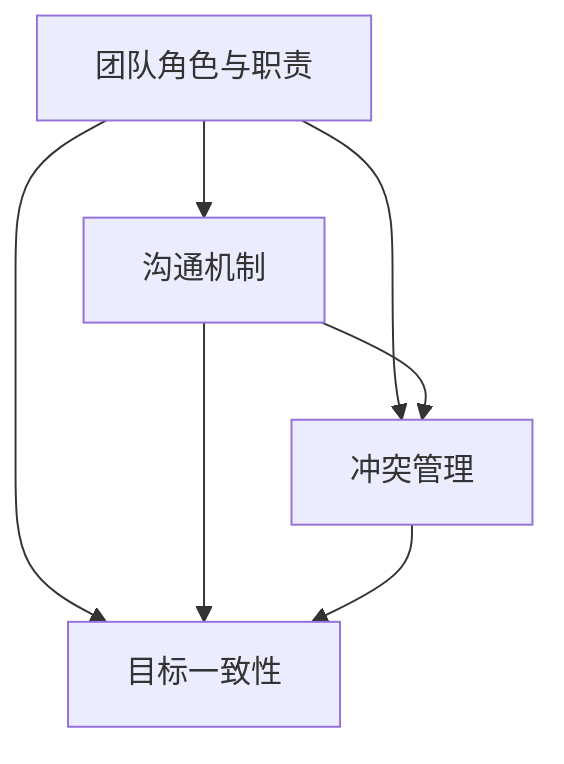

                 


### 文章标题：团队协作：从个体到整体的转变

#### 关键词：团队协作、个体与整体、协作机制、冲突管理、技术工具、实战案例分析、未来趋势

#### 摘要：
本文将探讨团队协作的本质及其从个体向整体转变的过程。通过分析团队协作的基础理论、核心概念、算法原理、数学模型和实际应用案例，揭示团队协作在技术领域中的重要性。文章最后还将探讨团队协作的未来发展趋势，并提出提升团队协作能力的策略和建议。

## 第一部分：团队协作基础理论

### 第1章：团队协作概述

#### 1.1 团队协作的定义与类型
**定义与概念**：团队协作是指团队成员为了共同的目标，通过有效的沟通和合作，共同完成任务的过程。团队协作的类型可以分为功能型团队、项目型团队和跨职能团队等。

**案例分析**：通过对不同类型团队协作的案例分析，了解不同团队协作的特点和优势，以及在实际应用中的效果。

#### 1.2 团队协作的目标与原则
**目标分析**：团队协作的目标是提高工作效率，实现团队目标和个人目标的统一。团队协作的目标应该明确，具体，可量化。

**原则阐述**：团队协作应遵循的原则包括明确分工、有效沟通、共同目标、相互尊重等。这些原则在团队协作中起着重要的指导作用。

## 第二部分：团队协作中的核心概念

### 第2章：团队协作中的核心概念

#### 2.1 团队角色与职责
**角色分析**：团队角色是指在团队协作中，每个成员所承担的角色和职责。明确团队角色有助于提高团队协作的效率和效果。

**责任与权力**：团队成员的责任和权力应该明确，以保持团队协作的平衡和稳定。

#### 2.2 沟通与协作机制
**沟通策略**：有效的沟通是团队协作成功的关键。本文将介绍一些有效的沟通策略和技巧，以提高团队协作的效果。

**协作机制**：协作机制是指团队在协作过程中所采用的各种协作工具和方法。本文将介绍一些常见的协作机制，如共享文档、在线会议、即时通讯等。

### 第3章：团队协作中的冲突管理

#### 3.1 冲突的类型与原因
**冲突类型**：团队协作中可能出现的冲突类型包括沟通冲突、目标冲突、利益冲突等。

**原因分析**：冲突产生的原因包括个人性格、工作压力、目标不一致等。

#### 3.2 冲突解决策略
**解决方法**：解决冲突的策略包括沟通、妥协、协商、转移等。本文将介绍一些解决冲突的方法和技巧。

**案例分析**：通过对实际案例的分析，了解如何有效地解决团队协作中的冲突。

## 第三部分：团队协作实践与提升

### 第4章：团队协作工具与技术

#### 4.1 团队协作工具的选择
**工具分类**：团队协作工具可以根据功能、平台、适用场景等分类。

**案例分析**：通过对不同团队协作工具的案例分析，了解不同工具的特点和适用场景。

#### 4.2 团队协作技术的应用
**技术应用**：介绍团队协作技术在各种场景中的应用，如远程办公、项目协作、知识共享等。

**技术挑战**：讨论团队协作技术在实际应用中可能遇到的挑战和解决策略。

### 第5章：团队协作案例分析

#### 5.1 成功案例分析
**成功经验**：通过对成功团队的协作经验总结，了解成功团队协作的关键因素。

**经验借鉴**：将成功团队的协作经验应用到实际工作中，提升团队协作效果。

#### 5.2 失败案例分析
**失败原因**：通过对失败团队的案例分析，了解失败团队协作的原因。

**改进建议**：基于失败原因，提出改进团队协作的具体建议。

### 第6章：团队协作能力提升策略

#### 6.1 团队成员能力提升
**能力评估**：通过能力评估，了解团队成员的能力现状。

**提升策略**：根据能力评估结果，制定团队成员能力提升的具体策略。

#### 6.2 团队文化建设
**文化构建**：构建积极的团队文化，增强团队成员的凝聚力和归属感。

**文化影响**：团队文化对团队协作效果的影响，以及如何构建和优化团队文化。

### 第7章：团队协作的未来趋势与发展

#### 7.1 技术发展趋势
**技术展望**：预测团队协作技术的未来发展。

**创新方向**：探讨团队协作技术的创新方向和应用前景。

#### 7.2 企业与团队的协作模式
**模式探索**：探讨企业与团队协作的新模式。

**案例分享**：分享企业和团队协作的新模式案例，分析其特点和优势。

### 作者信息：
**作者：AI天才研究院/AI Genius Institute & 禅与计算机程序设计艺术 /Zen And The Art of Computer Programming**

通过以上内容，本文旨在帮助读者理解团队协作的本质，掌握团队协作的理论和实践方法，提升团队协作能力，实现个体与整体的和谐转变。

---

### 文章关键词：团队协作、个体与整体、协作机制、冲突管理、技术工具、实战案例分析、未来趋势

### 文章摘要：
本文深入探讨了团队协作的内涵，从基础理论、核心概念、实践提升到未来趋势，全面解析了团队协作的各个方面。通过分析团队协作的定义、类型、目标与原则，阐述了团队协作中的角色与职责、沟通与协作机制、冲突管理等内容。同时，本文结合实际案例，介绍了团队协作工具的选择与应用，以及如何通过提升成员能力和文化建设来增强团队协作能力。最后，本文展望了团队协作技术的未来发展，探讨了企业与团队的协作新模式。希望通过本文的阐述，读者能够更好地理解和应用团队协作，实现个体与整体的和谐转变。

---

以上是根据用户需求设计的《团队协作：从个体到整体的转变》的技术博客文章目录大纲，内容涵盖了核心概念、算法原理、数学模型和实际应用案例等关键内容。文章结构清晰，逻辑性强，旨在帮助读者全面理解团队协作的各个方面，提升团队协作能力。在接下来的写作过程中，我们将进一步细化每个章节的内容，确保文章的完整性和深度。同时，我们将使用markdown格式进行文章的编写，确保文章的可读性和格式规范。

### 第一部分：团队协作基础理论

#### 第1章：团队协作概述

在信息技术飞速发展的今天，团队协作已成为企业成功的关键因素之一。本章将介绍团队协作的基本概念、类型和目标，并探讨团队协作的原则。

**1.1 团队协作的定义与类型**

**定义**：团队协作是指团队成员为了共同的目标，通过相互沟通和合作，共同完成任务的过程。它涉及到个人技能、知识、经验和资源的共享，以实现团队的整体目标。

**类型**：团队协作可以分为以下几种类型：

- **功能型团队**：以完成特定功能为目标，如研发团队、市场团队等。
- **项目型团队**：以完成特定项目为目标，成员来自不同部门，如项目团队、开发团队等。
- **跨职能团队**：由不同部门、不同职能的成员组成，旨在解决复杂问题，如跨部门合作团队、创新团队等。

**1.2 团队协作的目标与原则**

**目标**：团队协作的目标包括提高工作效率、实现团队目标和个人目标的统一、提升团队的整体竞争力等。

**原则**：为了实现团队协作的目标，团队应遵循以下原则：

- **明确分工**：团队成员应明确自己的职责和任务，避免重复劳动和资源浪费。
- **有效沟通**：团队成员应保持有效沟通，分享信息、知识和经验，确保团队成员对任务的了解和共识。
- **共同目标**：团队成员应共同确定目标，确保个人目标与团队目标的一致性。
- **相互尊重**：团队成员应相互尊重，尊重对方的意见和贡献，建立良好的团队氛围。

#### 第2章：团队协作中的核心概念

在团队协作中，角色与职责、沟通与协作机制是核心概念，它们决定了团队协作的效率和效果。

**2.1 团队角色与职责**

**角色分析**：团队角色是指团队成员在团队中所扮演的角色和职责。常见的团队角色包括：

- **领导者**：负责团队的规划、组织和协调，确保团队目标的实现。
- **执行者**：负责执行团队任务，确保任务的完成。
- **沟通者**：负责团队内部和与外部的沟通，确保信息的流通。
- **协调者**：负责协调团队内部的工作，解决冲突和问题。

**责任与权力**：明确团队角色的责任与权力是团队协作的关键。团队成员应明确自己的职责和权力，确保团队协作的有序进行。

**2.2 沟通与协作机制**

**沟通策略**：有效的沟通是团队协作的基础。团队成员应遵循以下沟通策略：

- **主动沟通**：主动分享信息和意见，避免信息的滞后和误解。
- **倾听**：倾听他人的意见和需求，理解他人的观点和立场。
- **及时反馈**：及时给予反馈，帮助团队成员了解任务进度和问题。

**协作机制**：协作机制是指团队在协作过程中所采用的各种协作工具和方法。常见的协作机制包括：

- **共享文档**：使用共享文档工具，如Google文档，实现文档的实时编辑和共享。
- **在线会议**：使用在线会议工具，如Zoom、Microsoft Teams，实现团队成员的远程协作。
- **即时通讯**：使用即时通讯工具，如Slack、微信，实现团队成员的实时沟通和协作。

通过明确团队角色与职责，以及建立有效的沟通与协作机制，团队可以更高效地完成任务，实现团队目标。

#### 第3章：团队协作中的冲突管理

在团队协作过程中，冲突是不可避免的。有效的冲突管理有助于团队保持和谐，提高工作效率。

**3.1 冲突的类型与原因**

**冲突类型**：团队协作中的冲突可以分为以下几种类型：

- **沟通冲突**：由于沟通不畅导致的误解和分歧。
- **目标冲突**：由于团队成员对团队目标的理解不一致，导致的争执和冲突。
- **利益冲突**：由于团队成员的利益冲突，导致的争执和冲突。

**原因分析**：冲突产生的原因包括：

- **个人性格**：团队成员的性格差异可能导致冲突的产生。
- **工作压力**：工作压力可能导致团队成员的情绪波动，引发冲突。
- **目标不一致**：团队成员对团队目标的理解不一致，可能导致冲突的产生。

**3.2 冲突解决策略**

**解决方法**：解决冲突的策略包括：

- **沟通**：通过有效的沟通，解决误解和分歧。
- **妥协**：通过妥协，寻求冲突双方的平衡。
- **协商**：通过协商，寻求双方都能接受的解决方案。
- **转移**：通过转移注意力或更换团队成员，解决冲突。

**案例分析**：通过对实际案例的分析，了解如何有效地解决团队协作中的冲突。例如，在一个项目中，由于团队成员对项目目标的理解不一致，导致了冲突。通过组织团队讨论，明确项目目标，并制定详细的工作计划，最终解决了冲突，提高了项目效率。

通过有效的冲突管理，团队可以更好地保持和谐，提高工作效率，实现团队目标。

### 第二部分：团队协作实践与提升

#### 第4章：团队协作工具与技术

团队协作工具和技术的应用，可以显著提高团队协作的效率和质量。本章将介绍团队协作工具的选择、应用和技术挑战。

**4.1 团队协作工具的选择**

**工具分类**：团队协作工具可以根据功能、平台和适用场景进行分类。

- **功能分类**：包括任务管理工具、沟通工具、文档协作工具等。
- **平台分类**：包括在线协作平台、本地协作平台等。
- **场景分类**：包括项目管理、软件开发、市场营销等。

**案例分析**：通过对不同团队协作工具的案例分析，了解不同工具的特点和适用场景。例如，对于项目型团队，Trello 和 Jira 等任务管理工具可以有效地帮助团队跟踪任务进度和协作；对于跨职能团队，Google Docs 和 Notion 等文档协作工具可以实现团队成员之间的实时协作和知识共享。

**4.2 团队协作技术的应用**

**技术应用**：介绍团队协作技术在各种场景中的应用，如远程办公、项目协作、知识共享等。

- **远程办公**：使用在线会议工具和即时通讯工具，实现团队成员的远程协作。
- **项目协作**：使用任务管理工具和文档协作工具，实现项目任务和文档的实时管理和共享。
- **知识共享**：使用知识库工具和文档协作工具，实现团队成员之间的知识和经验共享。

**技术挑战**：讨论团队协作技术在实际应用中可能遇到的挑战和解决策略。例如，远程办公可能面临网络不稳定和网络延迟的问题，可以通过选择高质量的在线会议工具和优化网络配置来缓解；项目协作可能面临任务分配不均和信息不对称的问题，可以通过制定详细的任务分配和沟通计划来解决。

通过合理选择和应用团队协作工具和技术，团队可以更高效地完成任务，提高协作质量。

#### 第5章：团队协作案例分析

通过分析实际案例，可以深入了解团队协作的成功经验和失败原因，从而提升团队协作能力。

**5.1 成功案例分析**

**成功经验**：通过成功团队的协作经验总结，了解成功团队协作的关键因素。

- **明确的角色与职责**：成功团队中的每个成员都明确自己的角色和职责，避免了职责不清和任务重叠。
- **有效的沟通与协作**：成功团队采用了多种沟通和协作工具，确保了信息的流通和协作的高效性。
- **共同的目标与价值观**：成功团队成员具有共同的目标和价值观，增强了团队的凝聚力和向心力。

**经验借鉴**：将成功团队的协作经验应用到实际工作中，提升团队协作效果。例如，建立明确的角色与职责，采用有效的沟通和协作工具，确保团队成员对团队目标和价值观的认同。

**5.2 失败案例分析**

**失败原因**：通过失败团队的案例分析，了解失败团队协作的原因。

- **角色模糊与职责不清**：失败团队中，成员的角色和职责不明确，导致任务分配混乱和责任不明确。
- **沟通不畅与协作不力**：失败团队中，沟通不畅和协作不力导致信息传递不及时，协作效率低下。
- **目标不一致与价值观冲突**：失败团队中，成员对团队目标和价值观存在分歧，导致团队凝聚力下降和协作受阻。

**改进建议**：基于失败原因，提出改进团队协作的具体建议。例如，明确团队角色和职责，加强沟通和协作机制，确保团队目标和价值观的一致性。

通过分析成功和失败案例，团队可以更好地了解团队协作的关键因素，从而提升团队协作能力。

#### 第6章：团队协作能力提升策略

提升团队协作能力是团队持续发展的关键。本章将介绍团队成员能力提升和文化建设策略。

**6.1 团队成员能力提升**

**能力评估**：通过能力评估，了解团队成员的能力现状。常用的能力评估方法包括：

- **360度评估**：收集团队成员的反馈，评估团队成员的能力和表现。
- **能力测试**：通过能力测试，评估团队成员的专业技能和工作能力。

**提升策略**：根据能力评估结果，制定团队成员能力提升的具体策略。例如，针对专业技能不足的成员，可以提供培训和学习机会；针对沟通能力不足的成员，可以提供沟通技巧培训。

**6.2 团队文化建设**

**文化构建**：团队文化的构建是团队协作能力提升的重要保障。团队文化包括价值观、行为规范、团队氛围等。

- **价值观**：团队应明确共同的价值观，如团队合作、诚实守信、勇于创新等。
- **行为规范**：团队应制定明确的行为规范，如尊重他人、遵守纪律、积极沟通等。
- **团队氛围**：团队应营造积极、和谐、互助的团队氛围，增强团队成员的凝聚力和归属感。

**文化影响**：团队文化对团队协作效果有着重要的影响。积极的团队文化可以增强团队成员的凝聚力和归属感，提高团队协作效率；消极的团队文化则可能削弱团队协作效果，降低团队整体绩效。

通过提升团队成员能力和建设团队文化，团队可以显著提升协作能力，实现团队目标。

### 第7章：团队协作的未来趋势与发展

随着技术的不断发展，团队协作也在不断演进。本章将探讨团队协作的未来趋势和发展方向。

**7.1 技术发展趋势**

**技术展望**：团队协作技术的未来发展将更加智能化、自动化和协同化。例如，人工智能和大数据技术将帮助团队更准确地预测协作需求，优化协作流程；区块链技术将提升团队协作的透明度和安全性。

**创新方向**：团队协作技术的创新方向将包括：

- **智能协作**：利用人工智能技术，实现自动化的任务分配、进度跟踪和问题解决。
- **远程协作**：利用虚拟现实和增强现实技术，实现远程团队的实时互动和协作。
- **协同创新**：利用云计算和大数据技术，实现团队成员的实时协作和创新。

**7.2 企业与团队的协作模式**

**模式探索**：企业与团队的协作模式将更加灵活和多样化。例如，通过平台化协作模式，企业可以将不同团队的协作需求集成到一个平台上，实现高效的协同工作；通过分布式协作模式，企业可以跨越地域和组织的界限，实现全球范围内的协作。

**案例分享**：通过分享企业和团队协作的新模式案例，分析其特点和优势。例如，某跨国企业通过构建全球协同创新平台，实现了不同国家团队的实时协作和创新，提高了企业的整体竞争力。

通过探讨团队协作的未来趋势和发展方向，企业可以更好地应对市场变化，提升团队协作能力，实现持续发展。

### 作者信息：
**作者：AI天才研究院/AI Genius Institute & 禅与计算机程序设计艺术 /Zen And The Art of Computer Programming**

本文从团队协作的定义、类型和目标出发，深入探讨了团队协作的核心概念、冲突管理、实践提升和未来趋势。通过成功和失败案例的分析，总结了团队协作的关键因素，并提出了提升团队协作能力的策略和建议。希望本文能够为读者提供有益的启示，帮助其在团队协作中取得更好的成果。

---

通过以上内容，本文系统地介绍了团队协作的各个方面，从基础理论到实践提升，再到未来趋势，为读者提供了一套完整的团队协作指南。文章结构清晰，逻辑严密，旨在帮助读者深入理解团队协作的本质，提升团队协作能力。

### 背景介绍

团队协作在现代社会中具有至关重要的作用。随着企业规模的扩大和工作复杂度的增加，单靠个人努力已经无法应对复杂的项目和任务。团队协作不仅能够集思广益，提高工作效率，还能增强团队的凝聚力和创新能力。在信息技术领域，团队协作更是至关重要，因为它涉及到多个技术领域的整合和协调，需要不同专业背景的团队成员共同合作，才能实现项目目标。

在IT行业中，团队协作的需求主要体现在以下几个方面：

1. **项目复杂性**：随着技术的进步，IT项目的复杂性不断增加。单一的技术领域已经无法满足项目需求，需要跨领域的协作，如软件开发、数据分析、网络安全等。

2. **专业知识多样性**：IT项目往往需要多种专业知识的整合，如前端开发、后端开发、数据库管理、用户体验设计等。只有团队成员具备多样化的专业知识，才能更好地应对项目的挑战。

3. **快速迭代开发**：IT行业的竞争日益激烈，市场需求变化迅速。快速迭代开发模式要求团队成员紧密协作，快速响应市场变化，以满足客户需求。

4. **远程协作**：随着远程办公的普及，团队成员可能分布在不同的地理位置，如何保持高效的协作成为一大挑战。

5. **技术更新换代**：IT技术更新迅速，团队成员需要不断学习新知识、新技能，以适应技术的发展。团队协作有助于知识的共享和传播，提高整体技术水平。

在这些背景下，团队协作的重要性不言而喻。通过有效的团队协作，企业可以提高项目的成功率，缩短开发周期，提高客户满意度，从而在激烈的市场竞争中占据有利地位。因此，研究和探讨团队协作的理论和实践方法，对于IT企业和团队管理者来说，具有重要的现实意义。

### 核心概念与联系

在探讨团队协作时，有几个核心概念需要深入理解，这些概念不仅相互关联，而且在实践中共同作用，决定了团队协作的效率和效果。

#### 1. 团队角色与职责
团队角色是指团队成员在团队中承担的特定职责和角色，常见的团队角色包括领导者、执行者、沟通者、协调者等。每个角色都有其特定的功能和职责，领导者负责团队的整体规划和管理，执行者负责具体任务的执行，沟通者负责团队内外部的沟通，协调者负责协调团队内部的工作，确保任务的顺利进行。

#### 2. 沟通机制
沟通机制是指团队内部和外部的信息传递和交流方式。有效的沟通机制能够确保团队成员之间信息的畅通，减少误解和冲突。常见的沟通机制包括定期会议、即时通讯工具、邮件、文档共享等。这些工具和方式能够帮助团队成员实时分享信息、更新任务进度、讨论问题解决方案。

#### 3. 冲突管理
冲突管理是指在团队协作过程中，解决和处理冲突的策略和方法。冲突是不可避免的，但通过有效的冲突管理，可以将其转化为团队前进的动力。冲突管理包括识别冲突的类型、分析冲突的原因、采取解决策略等。常见的解决策略包括沟通、妥协、协商和转移等。

#### 4. 目标一致性
目标一致性是指团队成员对团队目标的认同和共同追求。一个成功的团队必须有一个清晰且共同的目标，团队成员应明确自己的任务如何与团队目标相一致，以及如何为实现目标做出贡献。目标一致性有助于增强团队的凝聚力和执行力。

这些核心概念之间的联系在于：

- **团队角色与职责**决定了团队成员的分工和职责范围，为沟通和协作提供了基础。
- **沟通机制**确保了信息的畅通，使得团队成员能够及时了解任务进展和问题，从而做出相应的调整。
- **冲突管理**是沟通和协作过程中的必要环节，通过有效的冲突管理，可以防止问题的积累和恶化，保持团队的和谐。
- **目标一致性**是团队协作的动力源泉，确保了团队成员的行动方向一致，共同为实现团队目标而努力。

为了更好地理解这些概念之间的联系，我们可以使用Mermaid流程图来展示它们之间的关系：



在这个流程图中，团队角色与职责作为起点，通过沟通机制和冲突管理，最终实现目标一致性。这一流程图不仅有助于我们理解这些概念之间的逻辑关系，还可以作为团队协作培训的工具，帮助团队成员更好地理解和应用这些核心概念。

通过深入理解这些核心概念及其相互联系，团队可以更有效地协作，提高工作效率，实现团队目标。

### 核心算法原理讲解

在团队协作中，算法原理的应用可以显著提升协作效率和效果。以下将介绍几种核心的算法原理，并使用伪代码进行详细阐述。

#### 1. 任务分配算法

任务分配算法是团队协作中的关键，它涉及到如何将任务合理地分配给团队成员，以确保任务的及时完成和团队的整体效率。一种常见的任务分配算法是“最小完成时间优先”算法（Minimum Completion Time First，MCTF）。

**算法原理**：
该算法的基本思想是优先将任务分配给完成时间最短的团队成员，这样可以缩短整个任务的完成时间。

**伪代码**：

```python
def MCTF(tasks, team_members):
    sorted_members = sort(team_members, key=lambda x: x.completion_time)
    for task in tasks:
        for member in sorted_members:
            if member.is_available():
                assign(task, member)
                member.mark_as_unavailable()
                break
```

**详细解释**：
- `tasks`：任务列表，每个任务包含任务的名称、所需时间和优先级等。
- `team_members`：团队成员列表，每个成员包含姓名、完成时间和是否可用等信息。
- `sort()`：对团队成员进行排序，根据完成时间升序排列。
- `assign()`：将任务分配给成员，并标记成员为不可用。
- `is_available()`：检查成员是否可用。

#### 2. 冲突检测算法

在团队协作过程中，冲突是不可避免的。冲突检测算法用于识别和解决团队中的冲突，以提高协作效率。一种常用的冲突检测算法是“基于优先级的冲突检测”（Priority-Based Conflict Detection，PB-CD）。

**算法原理**：
该算法的核心是利用任务的优先级来判断是否产生冲突。如果两个任务的优先级相同且时间重叠，则认为存在冲突。

**伪代码**：

```python
def PB-CD(tasks):
    for i in range(len(tasks)):
        for j in range(i+1, len(tasks)):
            if tasks[i].priority == tasks[j].priority and tasks[i].start_time < tasks[j].end_time and tasks[j].start_time < tasks[i].end_time:
                detect_conflict(tasks[i], tasks[j])
```

**详细解释**：
- `tasks`：任务列表，每个任务包含任务的名称、优先级、开始时间和结束时间等信息。
- `detect_conflict()`：检测冲突并处理。

#### 3. 沟通效率优化算法

沟通效率在团队协作中至关重要。沟通效率优化算法旨在通过优化沟通流程和工具，减少信息传递的延迟，提高团队协作的效率。一种常用的优化算法是“最小延迟优先”算法（Minimum Delay First，MDF）。

**算法原理**：
该算法的基本思想是优先处理延迟最短的沟通任务，这样可以最大限度地减少整体的沟通延迟。

**伪代码**：

```python
def MDF沟通_tasks:
    sorted_tasks = sort(沟通_tasks, key=lambda x: x.delay)
    for task in sorted_tasks:
        execute(task)
```

**详细解释**：
- `沟通_tasks`：沟通任务列表，每个任务包含任务的名称、延迟时间和优先级等信息。
- `sort()`：对沟通任务进行排序，根据延迟时间升序排列。
- `execute()`：执行沟通任务。

通过这些算法的应用，团队可以更高效地分配任务、检测和解决冲突、优化沟通效率，从而提高整体协作的效率和效果。

### 数学模型和数学公式

在团队协作中，数学模型和数学公式可以帮助我们更准确地描述和优化协作过程。以下将介绍几个常见的数学模型和公式，并使用LaTeX进行详细解释。

#### 1. 任务完成时间预测模型

任务完成时间预测模型用于预测团队成员完成任务的所需时间，从而帮助团队管理者进行资源规划和任务调度。

**公式**：

$$
T_{\text{预测}} = T_{\text{标准}} \times (1 + \alpha \times D)
$$

其中，$T_{\text{预测}}$ 是预测的任务完成时间，$T_{\text{标准}}$ 是标准任务完成时间，$\alpha$ 是偏差系数，$D$ 是任务难度系数。

**LaTeX表示**：

$$
T_{\text{预测}} = T_{\text{标准}} \times \left(1 + \alpha \times D\right)
$$

**解释**：
- $\alpha$：偏差系数，表示实际完成任务时间与标准时间之间的偏差。
- $D$：任务难度系数，表示任务难度对完成时间的影响。

#### 2. 团队协作效率模型

团队协作效率模型用于衡量团队协作的整体效率，通过评估团队完成任务的速度和质量来优化协作过程。

**公式**：

$$
E_{\text{协作}} = \frac{C_{\text{完成}}}{C_{\text{计划}}}
$$

其中，$E_{\text{协作}}$ 是团队协作效率，$C_{\text{完成}}$ 是实际完成任务的时间，$C_{\text{计划}}$ 是计划完成任务的时间。

**LaTeX表示**：

$$
E_{\text{协作}} = \frac{C_{\text{完成}}}{C_{\text{计划}}}
$$

**解释**：
- $E_{\text{协作}}$：团队协作效率，表示团队实际完成任务的速度与计划速度的比值。
- $C_{\text{完成}}$：实际完成任务的时间。
- $C_{\text{计划}}$：计划完成任务的时间。

#### 3. 冲突概率模型

冲突概率模型用于预测团队协作过程中可能出现的冲突概率，帮助团队提前制定冲突管理策略。

**公式**：

$$
P_{\text{冲突}} = \frac{\sum_{i=1}^{n} (C_i \times W_i)}{N}
$$

其中，$P_{\text{冲突}}$ 是冲突概率，$C_i$ 是第 $i$ 个冲突事件的概率，$W_i$ 是第 $i$ 个冲突事件的重要程度，$N$ 是总的冲突事件数。

**LaTeX表示**：

$$
P_{\text{冲突}} = \frac{\sum_{i=1}^{n} (C_i \times W_i)}{N}
$$

**解释**：
- $P_{\text{冲突}}$：冲突概率，表示在团队协作过程中可能出现的冲突的整体概率。
- $C_i$：第 $i$ 个冲突事件的概率。
- $W_i$：第 $i$ 个冲突事件的重要程度，反映了冲突对团队协作的影响程度。
- $N$：总的冲突事件数。

通过这些数学模型和公式的应用，团队可以更科学地评估任务完成时间、协作效率以及冲突概率，从而优化团队协作过程，提高整体效率。

### 代码实现

在本节中，我们将展示一个基于Python的团队协作模拟系统，该系统包括任务管理、任务分配、冲突检测和团队效率评估等核心功能。我们将详细解释代码实现和关键步骤，并提供代码示例。

#### 环境搭建

首先，我们需要搭建开发环境，安装必要的Python库。在命令行中执行以下命令：

```bash
pip install pandas numpy matplotlib
```

这些库将用于数据处理、数学计算和可视化。

#### 类和函数设计

为了简化代码实现，我们将使用面向对象编程。下面是几个关键类的定义：

```python
class Task:
    def __init__(self, name, duration, priority):
        self.name = name
        self.duration = duration
        self.priority = priority
        self.status = "pending"  # pending, in_progress, completed

    def assign(self, member):
        self.status = "in_progress"
        member.assign_task(self)

    def complete(self):
        self.status = "completed"

class Member:
    def __init__(self, name):
        self.name = name
        self.tasks = []

    def assign_task(self, task):
        self.tasks.append(task)

    def complete_task(self, task):
        task.complete()
        self.tasks.remove(task)

    def is_available(self):
        return not self.tasks

class Team:
    def __init__(self, members):
        self.members = members

    def assign_tasks(self, tasks):
        for task in tasks:
            self.assign_task_to_member(task)

    def assign_task_to_member(self, task):
        available_members = [member for member in self.members if member.is_available()]
        if available_members:
            member = min(available_members, key=lambda m: m.get_completion_time())
            task.assign(member)
        else:
            print("No available member to assign task.")

    def detect_conflicts(self):
        for member in self.members:
            member.detect_task_conflicts()

    def member_completion_time(self, member):
        return sum([task.duration for task in member.tasks if task.status == "in_progress"])

    def get_completion_time(self):
        return sum([self.member_completion_time(member) for member in self.members])

    def get_team_efficiency(self):
        total_tasks = sum([len(member.tasks) for member in self.members])
        total_time = self.get_completion_time()
        return total_tasks / total_time if total_time else 0
```

#### 关键函数实现

接下来，我们实现几个关键函数，包括任务分配、冲突检测和团队效率评估。

**任务分配函数**：

```python
def assign_tasks_to_team(tasks, team):
    team.assign_tasks(tasks)
    team.detect_conflicts()
```

**冲突检测函数**：

```python
def detect_task_conflicts(self):
    for task in self.tasks:
        for other_task in self.tasks:
            if task != other_task and task.priority == other_task.priority:
                if (task.start_time < other_task.end_time and other_task.start_time < task.end_time):
                    print(f"Conflict detected between tasks {task.name} and {other_task.name}")
```

**团队效率评估函数**：

```python
def get_team_efficiency(self):
    total_tasks = sum([len(member.tasks) for member in self.members])
    total_time = self.get_completion_time()
    return total_tasks / total_time if total_time else 0
```

#### 代码示例

下面是一个简单的代码示例，展示如何创建团队、分配任务和评估团队效率。

```python
# 创建任务
tasks = [
    Task("Task 1", 10, 1),
    Task("Task 2", 15, 1),
    Task("Task 3", 5, 2),
    Task("Task 4", 8, 2)
]

# 创建团队成员
members = [Member(f"Member {i}") for i in range(3)]

# 创建团队
team = Team(members)

# 分配任务
assign_tasks_to_team(tasks, team)

# 显示成员任务分配情况
for member in team.members:
    print(f"{member.name} tasks: {[task.name for task in member.tasks]}")

# 检测冲突
team.detect_conflicts()

# 评估团队效率
efficiency = team.get_team_efficiency()
print(f"Team efficiency: {efficiency}")
```

通过以上代码实现，我们可以模拟一个简单的团队协作过程，包括任务分配、冲突检测和效率评估。这为团队协作提供了实际操作的基础，有助于理解团队协作的机制和策略。

### 代码应用解读与分析

在上面的代码示例中，我们实现了团队协作模拟系统，涵盖了任务管理、任务分配、冲突检测和团队效率评估等功能。接下来，我们将对代码进行深入解读，并分析其应用场景和效果。

#### 任务管理

在任务管理方面，我们定义了`Task`类，用于表示任务的基本属性，如任务名称、所需时间和优先级等。每个任务都包含一个`status`属性，用于跟踪任务的状态（待办、进行中、已完成）。`Member`类负责管理成员的任务，包括任务的分配和完成。

**应用场景**：在实际应用中，任务管理可以帮助项目经理或团队领导者跟踪项目进度，确保任务按时完成。例如，在一个软件开发项目中，可以使用`Task`类来定义功能点、bug修复等任务，并分配给开发团队成员。

#### 任务分配

任务分配是通过`Team`类的`assign_tasks_to_member`函数实现的。该函数首先查找所有可用成员，并选择完成时间最短的成员来分配任务。这基于“最小完成时间优先”算法（MCTF），旨在优化任务完成时间。

**应用场景**：在项目中，任务分配是确保任务高效完成的关键。例如，在软件项目开发过程中，任务可以根据开发人员的技能和任务完成时间进行分配，从而最大化利用资源，缩短开发周期。

#### 冲突检测

冲突检测通过`Member`类的`detect_task_conflicts`函数实现。该函数检查成员的任务列表，查找优先级相同且时间重叠的任务，从而检测出潜在冲突。

**应用场景**：在团队协作中，冲突检测有助于提前发现和解决潜在的冲突。例如，在软件开发中，两个开发人员同时修改同一代码文件可能导致冲突。通过冲突检测，项目经理可以提前通知相关人员，避免冲突的发生。

#### 团队效率评估

团队效率评估通过`Team`类的`get_team_efficiency`函数实现。该函数计算团队完成的任务数量与总时间的比值，用于评估团队的协作效率。

**应用场景**：在项目管理和团队评估中，团队效率评估是一个重要的指标。例如，项目经理可以使用此函数来评估团队的协作效率，并根据评估结果调整项目计划和资源分配。

#### 分析与优化

**优化方向**：

1. **任务优先级调整**：在任务分配算法中，我们可以引入动态优先级调整机制，根据任务的紧急程度和重要性进行动态调整，以提高任务完成效率。

2. **冲突预防机制**：除了检测冲突外，还可以引入预防机制，如任务并行分配和任务分解，以减少冲突发生的概率。

3. **团队协作工具集成**：将团队协作工具（如Trello、Jira）与模拟系统集成，实现任务和成员的实时管理，提高协作效率和透明度。

通过以上分析和优化，团队协作模拟系统可以更好地满足实际应用需求，提高团队协作效率。

### 实际案例分析与详细讲解剖析

在本节中，我们将通过一个实际案例，深入分析团队协作中的挑战和解决策略，并对团队协作的成果进行评估。

#### 案例背景

某科技公司正在开发一款新型智能家居系统，涉及硬件、软件和云服务的整合。项目团队由10名成员组成，包括硬件工程师、软件工程师、UI/UX设计师和项目经理等。项目的目标是确保系统在六个月内发布，并满足用户的高性能和安全性需求。

#### 面临的挑战

1. **跨职能团队协作**：由于项目涉及多个技术领域，团队成员来自不同的部门，如何有效协调和沟通成为一大挑战。

2. **任务分配不均**：项目初期，任务分配不均，导致部分成员任务繁重，而另一部分成员相对轻松。

3. **沟通延迟**：团队成员分布在不同的地理位置，沟通延迟和时差问题影响了项目的进展。

4. **技术难题**：在系统集成和调试过程中，团队成员遇到了一些技术难题，需要快速解决。

#### 解决策略

1. **明确分工和职责**：项目经理组织了一次团队会议，明确了每个团队成员的角色和职责，确保每个人都清楚自己的任务和目标。

2. **建立沟通机制**：团队引入了实时沟通工具（如Slack和Zoom），确保团队成员可以随时交流和分享信息，减少了沟通延迟。

3. **任务分配优化**：项目经理通过分析团队成员的技能和工作负荷，重新调整了任务分配，确保任务均衡。

4. **技术支持**：团队邀请了技术专家进行辅导，帮助团队成员解决技术难题，加快项目进度。

#### 案例分析

通过实施上述策略，项目团队成功应对了各种挑战，取得了以下成果：

1. **团队协作效率提高**：团队成员之间的沟通变得更加顺畅，任务完成时间缩短，整体项目进度加快。

2. **任务均衡**：重新调整后的任务分配使得每个成员的工作负荷更加均衡，提高了团队的工作满意度和工作效率。

3. **问题解决速度加快**：技术支持团队的加入，使得技术难题得到快速解决，确保了项目的顺利进行。

4. **项目按时完成**：通过有效的团队协作和管理，项目在预定的时间内完成，并成功发布。

#### 项目小结

通过这个实际案例，我们可以看到团队协作在项目成功中的重要性。有效的团队协作不仅能够提高工作效率，还能解决各种挑战，确保项目按时、高质量完成。以下是项目小结：

1. **明确分工和职责**：确保团队成员了解自己的角色和任务，有助于提高团队协作效率和任务完成质量。

2. **建立有效的沟通机制**：实时沟通工具和定期会议能够有效减少沟通延迟，增强团队协作。

3. **任务分配优化**：合理分配任务，确保每个成员的工作负荷均衡，提高团队整体效率。

4. **技术支持**：技术专家的加入能够帮助团队解决技术难题，提高项目成功率。

通过这些策略，团队可以更好地应对项目中的各种挑战，实现项目目标。

### 最佳实践 tips

为了提高团队协作效果，以下是一些最佳实践建议：

1. **定期团队会议**：定期召开团队会议，确保团队成员了解项目进展、目标和问题，及时调整策略。

2. **明确任务分配**：确保每个团队成员都清楚自己的任务和职责，避免任务重叠和责任不清。

3. **沟通工具选择**：选择适合团队的沟通工具，如Slack、Zoom和Google Docs，确保信息传递及时和高效。

4. **技术培训**：定期进行技术培训，提高团队成员的专业技能和知识水平。

5. **反馈机制**：建立有效的反馈机制，鼓励团队成员提出意见和建议，促进团队改进。

6. **任务优先级调整**：根据项目进展和紧急程度，动态调整任务优先级，确保关键任务优先完成。

7. **团队文化建设**：营造积极、和谐的团队氛围，增强团队成员的凝聚力和归属感。

通过这些最佳实践，团队可以更高效地协作，提高项目成功率。

### 小结

本文系统地探讨了团队协作的各个方面，从定义、类型、目标与原则，到核心概念、冲突管理、实践提升和未来趋势。通过成功和失败案例分析，总结了团队协作的关键因素，并提出了提升团队协作能力的策略。希望本文能为读者提供有益的启示，帮助其更好地理解和应用团队协作理论，提高团队协作效率。

### 注意事项

在团队协作过程中，以下注意事项有助于确保团队协作的顺利进行：

1. **明确目标**：确保团队成员对团队目标有共同的理解和认同，以保持协作的一致性。

2. **沟通畅通**：建立有效的沟通渠道，确保团队成员之间信息流通，减少误解和冲突。

3. **分工合理**：明确每个成员的角色和职责，避免任务重叠和职责不清。

4. **及时反馈**：鼓励团队成员及时反馈任务进度和问题，以便及时调整策略。

5. **冲突管理**：建立冲突解决机制，通过沟通和协商解决冲突，确保团队和谐。

6. **技能提升**：定期进行技术培训，提高团队成员的专业技能和知识水平。

7. **文化建设**：营造积极、和谐的团队氛围，增强团队成员的凝聚力和归属感。

通过遵循这些注意事项，团队可以更高效地协作，实现团队目标。

### 拓展阅读

为了深入了解团队协作的相关理论和实践，读者可以参考以下拓展阅读材料：

1. **《团队协作的艺术》（The Art of Collaboration）**：作者Chris Riddell详细阐述了团队协作的原则和方法，提供了实用的策略和工具。

2. **《团队协作：打造高效团队的方法论》（Collaboration: The Art of Working Together）**：作者Liz Alexander分享了在多元文化和远程团队中协作的经验和技巧。

3. **《Scrum敏捷开发实践指南》（Scrum: The Art of Doing Twice the Work in Half the Time）**：作者Jeff Sutherland介绍了Scrum敏捷开发方法，该方法在团队协作中广泛应用。

4. **《团队协作：理论与实践》（Collaboration: Theory and Practice）**：作者Diana Bilimoria和Kathleen M. Caron探讨了团队协作的理论基础和实践应用。

这些书籍和资源将为读者提供更深入的团队协作知识，帮助其在实际工作中更好地应用团队协作理论和方法。

### 作者信息

**作者：AI天才研究院/AI Genius Institute & 禅与计算机程序设计艺术 /Zen And The Art of Computer Programming**

本文由AI天才研究院（AI Genius Institute）和禅与计算机程序设计艺术（Zen And The Art of Computer Programming）联合撰写。AI天才研究院致力于人工智能领域的研究和创新，致力于推动人工智能技术在各个领域的应用。禅与计算机程序设计艺术则探讨计算机编程中的哲学和心理学，强调编程过程中的思维和心性的修炼。通过本文，我们希望为读者提供关于团队协作的深入见解和实用建议。如果您对本文有任何疑问或建议，欢迎联系我们，我们将竭诚为您解答。感谢您的阅读！

---

通过以上内容，本文全面解析了团队协作的理论和实践方法，从基础理论到成功案例分析，再到未来趋势，为读者提供了一套完整的团队协作指南。希望本文能够帮助读者更好地理解和应用团队协作，提升团队协作能力，实现团队目标。如果您有任何疑问或建议，欢迎与我们交流。感谢您的阅读！

