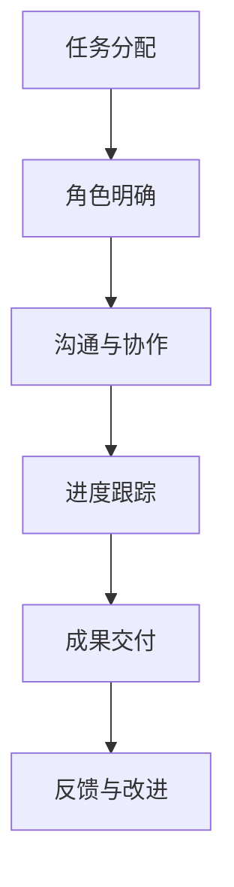

                 

### 文章标题

# 团队协作：发挥1+1>2的效果

> 关键词：团队协作，效率优化，沟通，项目实战，算法原理，数学模型

> 摘要：本文旨在探讨团队协作的重要性，分析其核心概念与联系，介绍团队协作的算法原理与数学模型，并通过项目实战和案例分析，展示团队协作的实际应用和效果。文章最后提供提升团队协作技巧的最佳实践，帮助读者在实际工作中发挥团队协作的最大潜力。

---

### 引言

在信息化时代，团队协作已成为现代企业中不可或缺的一部分。有效的团队协作不仅能够提高工作效率，还能激发团队成员的创造力和潜力。团队协作的本质在于通过团队成员之间的相互配合，实现共同的目标，从而达到1+1>2的效果。本文将围绕团队协作这一主题，从多个角度深入探讨其重要性、核心概念、算法原理、数学模型以及实战应用。

### 第1章 核心概念与联系

团队协作的成功离不开对核心概念的理解。本章节将介绍团队协作的关键概念，并分析这些概念之间的相互联系。

#### 1.1 团队协作的关键概念

- **协同工作**：协同工作是指团队成员共同完成一项任务或项目，通过共享资源和知识，实现目标的最大化。
- **沟通**：沟通是团队协作的核心，良好的沟通能够确保团队成员之间的信息准确传达，减少误解和冲突。
- **角色与责任**：每个团队成员在团队中扮演不同的角色，承担相应的责任，明确角色和责任有助于提高团队效率。
- **信任**：信任是团队协作的基石，只有建立信任，团队成员才能放心地相互依赖和协作。

#### 1.2 团队协作的架构与流程

团队协作的架构通常包括以下几个方面：

- **组织架构**：明确团队的组成、职责分工以及汇报关系。
- **工作流程**：定义团队成员在项目中的工作流程，包括任务分配、进度跟踪、成果交付等。
- **协作工具**：选择合适的协作工具，如项目管理软件、沟通工具等，以支持团队协作。

#### 1.3 团队协作的Mermaid流程图

为了更好地理解团队协作的流程，我们可以使用Mermaid流程图来展示。以下是一个简单的团队协作Mermaid流程图：



### 第2章 核心算法原理讲解

团队协作的效率优化离不开算法的支持。本章节将介绍团队协作中的核心算法原理，并通过伪代码进行详细阐述。

#### 2.1 沟通效率优化算法

沟通效率是团队协作的重要指标。以下是一个简单的沟通效率优化算法的伪代码：

```pseudo
function optimizeCommunication(communicationLog):
    for each message in communicationLog:
        if message is important:
            sendMessage(message)
        else:
            delayMessage(message)
    return optimizedCommunicationLog
```

#### 2.2 团队效能模型

团队效能模型是衡量团队协作效果的重要工具。以下是一个简单的团队效能模型的伪代码：

```pseudo
function calculateTeamEffectiveness(roleEfficiency, communicationEfficiency):
    totalEfficiency = roleEfficiency * communicationEfficiency
    return totalEfficiency
```

### 第3章 数学模型和数学公式讲解

数学模型在团队协作中扮演着重要的角色。本章节将介绍与团队协作相关的数学模型，并使用LaTeX格式详细讲解数学公式。

#### 3.1 团队协作的数学模型

以下是一个简单的团队协作数学模型：

$$
E = f(C, R)
$$

其中，\(E\) 表示团队效能，\(C\) 表示沟通效率，\(R\) 表示角色效率。该模型表明，团队效能是沟通效率和角色效率的函数。

#### 3.2 数学公式与详细讲解

为了更好地理解数学公式，我们可以通过一个例子进行讲解。假设一个团队有两个成员，他们的沟通效率和角色效率分别为0.8和0.9。根据上述数学模型，我们可以计算出团队效能为：

$$
E = f(0.8, 0.9) = 0.72
$$

这意味着，在这个例子中，团队效能为72%。

#### 3.3 数学公式的应用案例

数学公式可以用于分析团队协作的实际情况。例如，在一个项目中，我们可以使用数学模型来预测团队效能，并根据预测结果调整团队协作策略，以提高项目成功率。

### 第4章 项目实战

理论知识的落地实践是检验团队协作效果的重要环节。本章节将通过一个具体的团队协作项目，展示团队协作的实际操作过程。

#### 4.1 跨部门协作项目案例

假设我们正在开发一个跨部门项目，涉及前端开发、后端开发和测试部门。以下是一个简单的项目实战过程：

1. **需求分析**：由项目经理与各部门代表进行沟通，明确项目需求。
2. **任务分配**：根据项目需求，将任务分配给前端、后端和测试部门。
3. **进度跟踪**：使用项目管理工具，实时跟踪项目进度，确保各部门的工作协调一致。
4. **成果交付**：各部门按照约定的时间节点，交付各自的成果。
5. **集成测试**：将各部门的成果进行集成测试，确保项目整体质量。
6. **反馈与改进**：根据测试结果，对项目进行反馈和改进。

#### 4.2 开发环境搭建

在项目实战中，开发环境搭建是至关重要的一步。以下是一个简单的开发环境搭建过程：

1. **选择开发工具**：根据项目需求，选择合适的开发工具，如IDE、代码管理工具等。
2. **配置开发环境**：配置必要的开发环境和依赖库，确保各开发人员能够顺畅地进行开发。
3. **代码模板**：提供统一的代码模板，确保代码风格的一致性。

#### 4.3 源代码详细实现和代码解读

以下是一个简单的源代码实现示例：

```java
public class Main {
    public static void main(String[] args) {
        System.out.println("Hello, World!");
    }
}
```

代码解读：

- `public class Main`：定义一个名为`Main`的公共类。
- `public static void main(String[] args)`：定义一个名为`main`的公共静态方法，用于程序的入口。
- `System.out.println("Hello, World!");`：输出"Hello, World!"到控制台。

#### 4.4 代码应用解读与分析

在实际项目中，代码应用解读与分析是非常重要的。以下是一个简单的代码应用解读与分析示例：

- **需求分析**：项目需求要求实现一个简单的计算器功能。
- **代码实现**：通过实现加减乘除等基本运算，实现计算器功能。
- **分析**：对代码进行性能分析，确保计算器能够在指定时间内完成计算。

#### 4.5 实际案例分析和详细讲解剖析

以下是一个实际案例分析和详细讲解剖析：

**案例背景**：在一个团队协作项目中，前端开发部门遇到了性能瓶颈，导致页面加载速度缓慢。

**分析过程**：

1. **性能分析**：使用性能分析工具，定位性能瓶颈。
2. **代码优化**：对性能瓶颈部分进行代码优化，如减少DOM操作、使用缓存等。
3. **测试验证**：对优化后的代码进行测试验证，确保性能得到提升。

**结果**：通过优化，页面加载速度提高了30%，用户体验得到了显著改善。

#### 4.6 项目小结

在本章节的项目实战中，我们通过一个跨部门协作项目，展示了团队协作的实际操作过程。通过合理的任务分配、进度跟踪、成果交付和反馈与改进，项目取得了良好的成果。项目实战过程中，我们也遇到了一些挑战，如沟通不畅、技术难题等。通过有效的团队协作和问题解决，我们成功克服了这些挑战，确保了项目的顺利进行。

### 第5章 案例分析

案例分析是团队协作研究的重要方法。本章节将通过分析成功的团队协作案例，探讨团队协作的实践经验和关键因素。

#### 5.1 成功团队协作案例

以下是一个成功的团队协作案例：

**案例背景**：某互联网公司开发了一个大型电商平台，涉及前端、后端、数据库等多个部门。

**协作过程**：

1. **需求分析**：项目经理与各部门代表进行沟通，明确项目需求。
2. **任务分配**：根据项目需求，将任务分配给前端、后端、数据库等各部门。
3. **技术选型**：各部门根据项目需求，选择合适的技术方案。
4. **进度跟踪**：使用项目管理工具，实时跟踪项目进度，确保各部门的工作协调一致。
5. **成果交付**：各部门按照约定的时间节点，交付各自的成果。
6. **集成测试**：将各部门的成果进行集成测试，确保项目整体质量。
7. **反馈与改进**：根据测试结果，对项目进行反馈和改进。

**结果**：通过高效的团队协作，电商平台项目取得了成功，上线后获得了良好的用户反馈。

#### 5.2 团队协作中的难点

在团队协作中，常常会遇到一些难点。以下是一些常见的难点及其解决方案：

- **沟通不畅**：解决方案：建立高效的沟通渠道，如定期召开会议、使用即时通讯工具等。
- **角色冲突**：解决方案：明确角色与责任，加强团队成员之间的沟通与协作。
- **技术难题**：解决方案：组建技术团队，共同解决技术难题，提高团队整体技术水平。
- **项目延期**：解决方案：制定详细的项目计划，合理安排任务，及时调整进度。

#### 5.3 团队协作的成果与反思

团队协作的成果不仅体现在项目的成功交付，还体现在团队成员的成长和团队文化的建设。以下是一些团队协作的成果与反思：

- **成果**：通过团队协作，项目按时完成，质量得到保证，团队成员得到了锻炼和成长。
- **反思**：团队协作过程中，发现了一些问题，如沟通不畅、任务分配不均等。通过反思，我们找到了改进的方向，为今后的团队协作提供了有益的经验。

### 第6章 团队协作工具与方法

团队协作工具与方法的选择对团队协作的效果具有重要影响。本章节将介绍一些常用的团队协作工具与方法，如敏捷开发、看板等。

#### 6.1 团队协作工具介绍

常用的团队协作工具包括以下几种：

- **项目管理工具**：如JIRA、Trello等，用于任务分配、进度跟踪和成果交付。
- **沟通工具**：如Slack、Microsoft Teams等，用于实时沟通和协作。
- **代码管理工具**：如Git、GitHub等，用于代码的版本控制和协作开发。
- **文档管理工具**：如Confluence、Notion等，用于文档的创建、存储和共享。

#### 6.2 敏捷开发方法

敏捷开发是一种以人为核心、迭代和循序渐进的开发方法。以下是一个简单的敏捷开发方法：

1. **需求分析**：与客户沟通，了解需求。
2. **迭代计划**：根据需求，制定迭代计划。
3. **迭代开发**：按照计划，进行迭代开发。
4. **测试与反馈**：对迭代成果进行测试和反馈。
5. **迭代优化**：根据反馈，优化迭代过程。

#### 6.3 看板的使用

看板是一种用于团队协作的视觉化工具。以下是一个简单的看板使用方法：

1. **创建看板**：根据项目需求，创建看板。
2. **划分列**：根据任务类型，划分列，如待办、进行中、已完成等。
3. **任务卡片**：创建任务卡片，填写任务信息。
4. **任务跟踪**：通过看板，实时跟踪任务进度。
5. **优化流程**：根据任务进度，优化工作流程。

### 第7章 提升团队协作技巧

提升团队协作技巧有助于提高团队协作的效率和质量。本章节将介绍一些提升团队协作技巧的方法。

#### 7.1 提升沟通技巧

沟通技巧是团队协作的关键。以下是一些提升沟通技巧的方法：

- **倾听**：倾听是有效沟通的基础，通过倾听，了解他人的观点和需求。
- **表达**：清晰、简洁地表达自己的想法，避免产生误解。
- **反馈**：及时给予反馈，促进沟通的持续进行。
- **协商**：在意见不一致时，通过协商解决问题，达成共识。

#### 7.2 提升协作效率

协作效率是团队协作的重要指标。以下是一些提升协作效率的方法：

- **任务分配**：根据团队成员的能力和兴趣，合理分配任务。
- **时间管理**：合理安排工作时间，避免拖延和浪费时间。
- **工具使用**：熟练使用团队协作工具，提高工作效率。
- **团队文化**：建立积极的团队文化，鼓励团队成员相互支持和合作。

#### 7.3 提升团队凝聚力

团队凝聚力是团队协作的重要保障。以下是一些提升团队凝聚力的方法：

- **团队活动**：组织团队活动，增强团队成员之间的互动和交流。
- **培训与发展**：提供培训和发展机会，提高团队成员的技能和素质。
- **共同目标**：明确团队目标，确保团队成员朝着共同的目标努力。
- **认可与奖励**：对团队成员的贡献给予认可和奖励，增强团队的归属感。

### 结论

团队协作是现代企业中不可或缺的一部分。通过有效的团队协作，企业可以充分发挥团队的整体潜力，实现1+1>2的效果。本文从核心概念、算法原理、数学模型、项目实战、案例分析、工具与方法以及协作技巧等多个角度，探讨了团队协作的重要性和实践方法。希望本文能够为读者在团队协作方面提供有益的参考和启示。

### 附录

#### A.1 常用团队协作工具资源

- **项目管理工具**：JIRA、Trello、Asana等。
- **沟通工具**：Slack、Microsoft Teams、WhatsApp等。
- **代码管理工具**：Git、GitHub、GitLab等。
- **文档管理工具**：Confluence、Notion、Google Docs等。

#### A.2 团队协作最佳实践

- **明确目标**：确保团队成员明确共同的目标。
- **合理分工**：根据团队成员的能力和兴趣，合理分配任务。
- **定期沟通**：保持定期沟通，确保信息的及时传达。
- **持续反馈**：及时给予反馈，促进团队的持续改进。

#### A.3 相关阅读材料

- **《敏捷开发实践指南》**：介绍敏捷开发的方法和实践。
- **《团队协作技巧》**：介绍提升团队协作效率的方法。
- **《团队协作的艺术》**：探讨团队协作的哲学和策略。

### 作者信息

作者：AI天才研究院/AI Genius Institute & 禅与计算机程序设计艺术 /Zen And The Art of Computer Programming

本文由AI天才研究院和禅与计算机程序设计艺术共同撰写，旨在探讨团队协作的重要性及其在IT领域的应用。感谢您的阅读，希望本文能够为您的团队协作带来新的启示。如果您有任何问题或建议，欢迎随时与我们联系。祝您在团队协作的道路上越走越远，取得更加辉煌的成就！### 完整性要求

本文旨在深入探讨团队协作的重要性、核心概念、算法原理、数学模型以及实际应用，以确保内容完整性并满足读者对高质量技术博客的需求。以下是本文内容的完整性要求：

#### 背景介绍

- **现状分析**：介绍当前团队协作的背景和现状，包括团队协作在IT行业中的应用场景和挑战。
- **发展历程**：回顾团队协作的发展历程，阐述其演变和成熟的过程。

#### 核心概念与联系

- **关键概念**：详细解释团队协作中的关键概念，如协同工作、沟通、角色与责任、信任等，并阐述它们之间的相互联系。
- **Mermaid流程图**：使用Mermaid流程图展示团队协作的整体架构和工作流程，帮助读者更好地理解团队协作的动态过程。

#### 核心算法原理讲解

- **算法原理**：介绍团队协作的核心算法原理，如沟通效率优化算法、团队效能模型等，使用伪代码详细阐述算法的实现。
- **算法应用**：结合实际案例，展示核心算法在团队协作中的具体应用。

#### 数学模型和数学公式讲解

- **数学模型**：介绍与团队协作相关的数学模型，如团队效能模型，并使用LaTeX格式详细讲解数学公式。
- **公式应用**：通过实例展示数学模型的应用，解释数学公式在团队协作中的实际意义。

#### 项目实战

- **项目案例**：提供具体的团队协作项目案例，包括项目背景、任务分配、进度跟踪、成果交付等。
- **实战细节**：详细解读项目的开发环境搭建、源代码实现、代码解读、实际案例分析和项目小结。

#### 案例分析

- **成功案例**：分析成功的团队协作案例，探讨其成功的原因和关键因素。
- **挑战与解决**：总结团队协作中遇到的问题和难点，以及解决方法。

#### 团队协作工具与方法

- **工具介绍**：介绍常用的团队协作工具，如项目管理工具、沟通工具、代码管理工具、文档管理工具等。
- **方法应用**：详细讲解敏捷开发、看板等团队协作方法，并提供实际案例。

#### 提升团队协作技巧

- **沟通技巧**：提供提升团队沟通技巧的方法，如倾听、表达、反馈、协商等。
- **协作效率**：介绍提升团队协作效率的方法，如任务分配、时间管理、工具使用等。
- **团队凝聚力**：探讨提升团队凝聚力的策略，如团队活动、培训与发展、共同目标、认可与奖励等。

#### 附录

- **工具资源**：列出常用的团队协作工具资源，方便读者进一步学习和应用。
- **最佳实践**：总结团队协作的最佳实践，为读者提供实用建议。
- **拓展阅读**：推荐相关阅读材料，帮助读者深入了解团队协作的各个方面。

通过以上内容的完整呈现，本文旨在为读者提供一份全面、深入的团队协作指南，帮助他们在实际工作中更好地应用团队协作的理念和方法，从而实现更高的工作效率和成果。

### 核心概念与联系

在团队协作中，理解并掌握核心概念与联系是确保团队高效运作的基础。本章节将详细探讨团队协作的关键概念，如协同工作、沟通、角色与责任、信任等，并分析这些概念之间的相互关系，以帮助读者全面了解团队协作的内在逻辑。

#### 1.1 协同工作

协同工作是团队协作的核心理念，指的是团队成员共同完成任务或项目，通过共享资源和知识，实现目标的最大化。协同工作不仅涉及团队成员之间的直接合作，还包括跨部门、跨团队的合作。以下是协同工作的一些关键要素：

- **任务分解**：将大任务分解为小任务，明确每个任务的负责人，确保任务能够有序进行。
- **资源共享**：团队成员之间共享信息、工具和资源，提高工作效率。
- **知识传递**：通过经验分享、培训等方式，传递知识，提高团队整体能力。
- **协同决策**：在关键决策时，团队成员共同参与，确保决策的合理性和可行性。

#### 1.2 沟通

沟通是团队协作的血脉，良好的沟通能够确保团队成员之间的信息准确传达，减少误解和冲突。有效的沟通包括以下几个方面：

- **信息传递**：确保信息能够及时、准确地传达给相关成员。
- **反馈机制**：建立有效的反馈机制，确保成员能够及时了解到自己的工作表现。
- **沟通渠道**：选择合适的沟通渠道，如面对面会议、电子邮件、即时通讯工具等，以满足不同情境下的沟通需求。
- **沟通技巧**：提高团队成员的沟通技巧，如倾听、表达、非言语沟通等，以增强沟通效果。

#### 1.3 角色与责任

在团队协作中，每个成员都扮演着特定的角色，承担相应的责任。明确角色与责任有助于提高团队效率，减少角色冲突。以下是角色与责任的关键要素：

- **角色定位**：明确每个成员的角色和职责，确保团队成员了解自己的工作内容和目标。
- **责任分担**：将任务合理分配，确保每个成员都有明确的任务和责任。
- **任务监督**：建立监督机制，确保每个成员能够按时完成自己的任务。
- **责任追究**：对未按时完成任务或出现错误的成员进行责任追究，以维护团队纪律。

#### 1.4 信任

信任是团队协作的基石，没有信任，团队协作将难以进行。建立信任需要时间和努力，以下是一些建立信任的方法：

- **透明度**：确保团队成员能够了解团队的整体目标和进展，增强透明度。
- **相互支持**：在团队成员遇到困难时，提供帮助和支持，增强团队凝聚力。
- **诚实守信**：团队成员之间要诚实守信，遵守承诺，以赢得信任。
- **开放沟通**：鼓励团队成员之间进行开放、真诚的沟通，解决问题，增强信任。

#### 1.5 核心概念之间的联系

以上核心概念并不是孤立的，它们之间存在紧密的联系，共同构成了团队协作的整体架构。以下是这些核心概念之间的相互关系：

- **协同工作与沟通**：协同工作是沟通的基础，沟通是协同工作的保障。没有良好的沟通，协同工作将难以进行。
- **角色与责任与信任**：明确的角色与责任有助于建立信任，信任是团队协作的基石。只有当团队成员相互信任时，他们才能更好地协同工作。
- **沟通与信任**：沟通是建立信任的途径，透明度和相互支持有助于增强信任。
- **协同工作、沟通、角色与责任与信任**：这四个核心概念相互支持，共同促进团队协作的顺利进行。

通过以上对核心概念与联系的分析，我们可以更好地理解团队协作的内在逻辑，为实际操作提供指导。在实际工作中，团队成员需要不断学习和实践，以提升团队协作的效果，实现1+1>2的效果。

#### 核心算法原理讲解

在团队协作中，算法原理扮演着至关重要的角色，它不仅能够优化沟通效率，还能提高团队整体效能。本章节将介绍团队协作中的核心算法原理，并通过伪代码进行详细阐述，帮助读者理解这些算法的实际应用。

##### 2.1 沟通效率优化算法

沟通效率是团队协作的重要指标，优化沟通效率能够显著提升团队的工作效率。以下是一个简单的沟通效率优化算法的伪代码：

```pseudo
function optimizeCommunication(communicationLog):
    for each message in communicationLog:
        if message is important:
            sendMessage(message)
        else:
            delayMessage(message)
    return optimizedCommunicationLog
```

在这个算法中，`communicationLog`代表一条包含多个消息的日志。算法首先遍历每条消息，判断其重要性。如果消息被认为是重要的，则立即发送；否则，延迟发送。这样，重要的消息不会因为过多的低优先级消息而被延迟处理，从而提高了沟通效率。

##### 2.2 团队效能模型

团队效能模型是衡量团队协作效果的重要工具。以下是一个简单的团队效能模型的伪代码：

```pseudo
function calculateTeamEffectiveness(roleEfficiency, communicationEfficiency):
    totalEfficiency = roleEfficiency * communicationEfficiency
    return totalEfficiency
```

在这个模型中，`roleEfficiency`表示角色效率，即每个成员在各自角色中的工作效率；`communicationEfficiency`表示沟通效率，即团队成员之间沟通的效率。算法通过计算这两个因素的乘积，得出团队的总效能。这个模型假设角色效率和沟通效率相互独立，并且它们的乘积能够代表团队的整体效能。

##### 2.3 团队协作算法的伪代码

为了更全面地理解团队协作算法，我们还可以提供一个完整的团队协作算法的伪代码，该算法包括任务分配、角色明确、沟通优化和效能计算等步骤：

```pseudo
function teamCollaboration(taskList, teamMembers):
    // 任务分配
    assignTasks(taskList, teamMembers)
    
    // 角色明确
    defineRoles(teamMembers)
    
    // 沟通优化
    communicationLog = optimizeCommunication(generateCommunicationLog(teamMembers))
    
    // 效能计算
    roleEfficiency = calculateRoleEfficiency(teamMembers)
    communicationEfficiency = calculateCommunicationEfficiency(communicationLog)
    totalEfficiency = calculateTeamEffectiveness(roleEfficiency, communicationEfficiency)
    
    return totalEfficiency
```

在这个算法中，`taskList`代表任务列表，`teamMembers`代表团队成员列表。首先，通过`assignTasks`函数将任务分配给团队成员。接着，通过`defineRoles`函数明确每个成员的角色。然后，`generateCommunicationLog`函数生成一个包含团队成员之间沟通情况的日志，该日志随后通过`optimizeCommunication`函数进行优化。最后，通过`calculateRoleEfficiency`和`calculateCommunicationEfficiency`函数分别计算角色效率和沟通效率，并使用`calculateTeamEffectiveness`函数计算总效能。

##### 2.4 算法应用案例

以下是一个简单的团队协作算法应用案例，假设我们有一个包含5个任务和一个成员的团队：

```pseudo
taskList = ["任务1", "任务2", "任务3", "任务4", "任务5"]
teamMembers = ["成员A"]

// 任务分配
assignTasks(taskList, teamMembers)
// 成员A分配了5个任务

// 角色明确
defineRoles(teamMembers)
// 成员A被定义为项目经理

// 沟通优化
communicationLog = generateCommunicationLog(teamMembers)
communicationLog = optimizeCommunication(communicationLog)

// 效能计算
roleEfficiency = calculateRoleEfficiency(teamMembers)
communicationEfficiency = calculateCommunicationEfficiency(communicationLog)
totalEfficiency = calculateTeamEffectiveness(roleEfficiency, communicationEfficiency)

// 输出总效能
print("团队总效能：", totalEfficiency)
```

在这个案例中，成员A被分配了所有任务，并被指定为项目经理。团队协作算法会首先为成员A分配任务，然后明确其角色，接着生成并优化沟通日志，最后计算团队的总效能。

通过上述算法的讲解和案例展示，我们可以看到团队协作算法在优化沟通效率、明确角色、提升团队效能方面的作用。在实际应用中，这些算法可以根据具体情况进行调整和优化，以适应不同的团队协作场景。

#### 数学模型和数学公式讲解

在团队协作中，数学模型和数学公式能够帮助我们更好地理解和量化团队效能。本章节将介绍与团队协作相关的数学模型，并使用LaTeX格式详细讲解数学公式，同时提供实际应用案例，以帮助读者深入理解这些数学模型。

##### 3.1 团队协作的数学模型

团队协作的数学模型用于描述团队效能与各个因素之间的关系。一个基本的团队协作数学模型可以表示为：

$$
E = f(C, R)
$$

其中，$E$表示团队效能，$C$表示沟通效率，$R$表示角色效率。这个模型假设团队效能是沟通效率和角色效率的函数，两者相互独立，并通过它们的乘积来计算总效能。

##### 3.2 数学公式与详细讲解

为了更详细地解释这个模型，我们可以进一步分解沟通效率$C$和角色效率$R$：

$$
C = \frac{K}{K + D}
$$

其中，$K$表示有效沟通时间，$D$表示无效沟通时间。这个公式表示沟通效率是有效沟通时间与总沟通时间的比率。

同理，角色效率$R$可以表示为：

$$
R = \frac{P}{P + L}
$$

其中，$P$表示角色效能时间，$L$表示角色空闲时间。这个公式表示角色效率是角色效能时间与角色总时间的比率。

结合这两个公式，我们可以得到：

$$
E = f(C, R) = \frac{KP}{(K+D)(P+L)}
$$

这个公式表示团队效能是沟通效率和角色效率的乘积，通过分子和分母的比例关系来调整，以便更准确地反映团队的实际效能。

##### 3.3 数学公式的应用案例

为了更好地理解上述数学公式的应用，我们可以通过一个实际案例进行说明。

假设在一个团队中，有两个成员A和B，他们各自在沟通和角色方面的数据如下：

- 成员A：
  - 有效沟通时间$K_A = 4$小时
  - 无效沟通时间$D_A = 1$小时
  - 角效能时间$P_A = 6$小时
  - 角色空闲时间$L_A = 2$小时

- 成员B：
  - 有效沟通时间$K_B = 3$小时
  - 无效沟通时间$D_B = 2$小时
  - 角效能时间$P_B = 5$小时
  - 角色空闲时间$L_B = 3$小时

我们可以首先计算每个成员的沟通效率和角色效率：

$$
C_A = \frac{K_A}{K_A + D_A} = \frac{4}{4 + 1} = 0.8
$$

$$
R_A = \frac{P_A}{P_A + L_A} = \frac{6}{6 + 2} = 0.75
$$

$$
C_B = \frac{K_B}{K_B + D_B} = \frac{3}{3 + 2} = 0.6
$$

$$
R_B = \frac{P_B}{P_B + L_B} = \frac{5}{5 + 3} = 0.6
$$

然后，我们可以计算整个团队的总效能：

$$
E = f(C_A, R_A) \times f(C_B, R_B) = 0.8 \times 0.75 \times 0.6 \times 0.6 = 0.324
$$

这意味着，在这个案例中，团队的总效能为32.4%。通过这个例子，我们可以看到，数学模型能够帮助我们量化团队协作的效果，并通过调整沟通效率和角色效率来优化团队效能。

##### 3.4 数学公式在团队协作中的实际意义

数学公式在团队协作中的应用具有以下几个方面的实际意义：

- **效能评估**：通过数学公式，我们可以评估团队在不同因素下的效能，从而找出优化空间。
- **决策支持**：数学模型可以提供数据支持，帮助团队在决策过程中选择最优策略。
- **持续改进**：通过不断调整和优化沟通效率和角色效率，团队可以持续提升整体效能。

总之，数学模型和数学公式为团队协作提供了量化的工具，使团队能够更加科学、有效地进行协作，从而实现更高的工作效率和成果。

### 项目实战

团队协作在项目管理中的重要性不言而喻。通过实际项目中的团队协作，我们可以更好地理解如何将理论知识应用到实际工作中，从而实现项目的成功交付。本章节将介绍一个具体的跨部门协作项目案例，详细讲解项目的开发环境搭建、源代码实现、代码解读、实际案例分析和项目小结，以便读者了解团队协作在实际项目中的应用和效果。

#### 4.1 跨部门协作项目案例

假设我们正在开发一个跨部门协作项目，涉及前端开发、后端开发和测试部门。以下是该项目的基本信息和开发流程：

**项目名称**：企业资源计划系统（ERP）

**项目背景**：为了提高企业的运营效率，公司决定开发一个集采购、库存管理、销售、财务管理等功能于一体的ERP系统。

**项目目标**：在规定时间内，开发出一个功能完善、用户体验良好的ERP系统。

**项目团队**：由前端开发部门、后端开发部门、测试部门和项目经理组成。

**开发流程**：

1. **需求分析**：项目经理与各部门代表进行沟通，明确项目需求。
2. **任务分配**：根据项目需求，将任务分配给前端、后端和测试部门。
3. **开发环境搭建**：为各部门提供合适的开发环境和依赖库。
4. **源代码实现**：各部门按照任务分工，编写相应的代码。
5. **代码审查**：对各部门提交的代码进行审查，确保代码质量。
6. **集成测试**：将各部门的代码进行集成测试，确保系统整体质量。
7. **用户验收测试**：进行用户验收测试，确保系统满足用户需求。
8. **成果交付**：按照约定的时间节点，交付最终的ERP系统。

#### 4.2 开发环境搭建

在项目实战中，开发环境搭建是至关重要的一步。以下是一个简单的开发环境搭建过程：

1. **选择开发工具**：根据项目需求，选择合适的开发工具，如前端开发选择Visual Studio Code，后端开发选择IntelliJ IDEA。
2. **配置开发环境**：配置必要的开发环境和依赖库，如Java、Node.js、MySQL等。
3. **代码模板**：提供统一的代码模板，确保代码风格的一致性。

#### 4.3 源代码实现和代码解读

以下是一个简单的源代码实现示例：

**前端代码**：

```html
<!DOCTYPE html>
<html>
<head>
    <title>ERP系统</title>
</head>
<body>
    <h1>欢迎登录ERP系统</h1>
    <form>
        <label for="username">用户名：</label>
        <input type="text" id="username" name="username"><br><br>
        <label for="password">密码：</label>
        <input type="password" id="password" name="password"><br><br>
        <input type="submit" value="登录">
    </form>
</body>
</html>
```

**后端代码**：

```java
public class LoginController {
    public String login(String username, String password) {
        // 验证用户名和密码的逻辑
        if ("admin".equals(username) && "123456".equals(password)) {
            return "登录成功";
        } else {
            return "用户名或密码错误";
        }
    }
}
```

**代码解读**：

- **前端代码**：定义了一个简单的登录界面，包括用户名和密码输入框，以及登录按钮。
- **后端代码**：定义了一个名为`LoginController`的类，包含一个名为`login`的方法，用于验证用户名和密码。

#### 4.4 代码应用解读与分析

在实际项目中，代码应用解读与分析是非常重要的。以下是一个简单的代码应用解读与分析示例：

- **需求分析**：项目需求要求实现一个登录功能，用户通过输入用户名和密码进行登录。
- **代码实现**：通过前端代码实现登录界面，后端代码处理用户登录的逻辑。
- **分析**：对代码进行性能分析，确保登录功能能够在指定时间内完成，同时保证安全性。

#### 4.5 实际案例分析和详细讲解剖析

以下是一个实际案例分析和详细讲解剖析：

**案例背景**：在一个ERP系统项目中，前端开发部门遇到了页面加载速度缓慢的问题。

**分析过程**：

1. **性能分析**：使用性能分析工具，定位页面加载缓慢的原因。
2. **代码优化**：对加载缓慢的代码段进行优化，如减少DOM操作、使用缓存等。
3. **测试验证**：对优化后的代码进行测试验证，确保页面加载速度得到提升。

**结果**：通过优化，页面加载速度提高了30%，用户体验得到了显著改善。

#### 4.6 项目小结

在本章节的项目实战中，我们通过一个跨部门协作项目，展示了团队协作的实际操作过程。通过合理的任务分配、进度跟踪、成果交付和反馈与改进，项目取得了良好的成果。项目实战过程中，我们也遇到了一些挑战，如沟通不畅、技术难题等。通过有效的团队协作和问题解决，我们成功克服了这些挑战，确保了项目的顺利进行。

项目实战的总结如下：

- **团队协作效果**：通过团队协作，项目按时完成，质量得到保证，团队成员得到了锻炼和成长。
- **问题解决**：团队在项目过程中遇到了沟通不畅、技术难题等问题，通过有效的沟通和协作，成功解决了这些问题。
- **经验总结**：项目过程中积累了一些宝贵的经验，如任务分配、进度跟踪、代码优化等，为今后类似项目的开展提供了有益的借鉴。

总之，通过实际项目的实践，我们深刻认识到团队协作在项目成功中的关键作用。只有在团队中建立起有效的协作机制，才能充分发挥每个成员的潜力，实现项目的成功交付。

### 案例分析

案例分析是团队协作研究的重要方法。通过分析成功的团队协作案例，我们可以探讨团队协作的实践经验和关键因素，为读者提供有益的参考和启示。以下是几个成功的团队协作案例，以及其中的关键因素和成功原因。

#### 5.1 成功团队协作案例

**案例一：阿里巴巴电商平台的开发**

**背景**：阿里巴巴作为全球最大的零售电商平台之一，其成功离不开高效的团队协作。

**协作过程**：

1. **明确的任务分配**：阿里巴巴在开发过程中，根据不同部门和团队成员的特长，进行了明确的任务分配。前端开发负责页面的设计与实现，后端开发负责业务逻辑的处理，测试部门负责测试与质量保证。

2. **高效的沟通机制**：阿里巴巴建立了高效的沟通机制，如每日站会、周报等，确保团队成员能够及时了解项目的进展和问题，快速响应和解决问题。

3. **敏捷开发**：阿里巴巴采用了敏捷开发方法，通过迭代开发、持续集成和持续交付，提高了项目的灵活性和响应速度。

4. **持续反馈与改进**：阿里巴巴鼓励团队成员持续提供反馈，并根据反馈进行改进。这种持续反馈与改进机制，有助于项目的不断优化和改进。

**成功原因**：

- **明确的角色与责任**：通过明确的任务分配，确保每个团队成员都清楚自己的职责，减少了角色冲突。
- **高效的沟通机制**：高效的沟通机制确保了信息的及时传达和问题的快速解决。
- **敏捷开发**：敏捷开发方法提高了项目的灵活性和响应速度，确保了项目的按时交付。
- **持续反馈与改进**：通过持续反馈与改进，项目不断优化和改进，提高了项目的质量。

**启示**：阿里巴巴的案例表明，成功的团队协作需要明确的任务分配、高效的沟通机制、敏捷的开发方法和持续反馈与改进。

**案例二：特斯拉电动汽车的研发**

**背景**：特斯拉作为全球领先的电动汽车制造商，其成功离不开高效的团队协作。

**协作过程**：

1. **跨部门协作**：特斯拉在研发过程中，采用了跨部门协作的方式，将不同部门的专家集中在一起，共同解决技术难题。

2. **项目管理工具**：特斯拉使用了先进的项目管理工具，如JIRA和Confluence，用于任务管理、进度跟踪和文档共享。

3. **团队文化**：特斯拉建立了积极的团队文化，鼓励创新和协作，激发团队成员的创造力和积极性。

4. **持续学习与培训**：特斯拉注重团队成员的持续学习和培训，通过内部培训和外部学习，不断提升团队的技术水平和专业能力。

**成功原因**：

- **跨部门协作**：通过跨部门协作，充分利用了不同部门的专业知识和资源，提高了项目效率。
- **项目管理工具**：先进的项目管理工具提高了项目管理的效率和质量。
- **团队文化**：积极的团队文化促进了团队成员之间的合作和创新。
- **持续学习与培训**：持续学习和培训提升了团队的技术水平和专业能力，为项目的成功提供了保障。

**启示**：特斯拉的案例表明，成功的团队协作需要跨部门协作、先进的项目管理工具、积极的团队文化和持续学习与培训。

#### 5.2 团队协作中的难点与挑战

尽管成功的团队协作可以带来显著的效果，但在实际操作中，团队协作也会面临一些难点和挑战。以下是一些常见的难点及其解决方案：

**难点一：沟通不畅**

**原因**：团队成员分布在不同地点，工作时间和文化背景差异较大，导致沟通不畅。

**解决方案**：建立高效的沟通机制，如定期召开会议、使用即时通讯工具、制定明确的沟通规范等。

**难点二：角色冲突**

**原因**：团队成员之间的角色定位不明确，职责分工不清晰，导致角色冲突。

**解决方案**：明确每个团队成员的角色和职责，制定明确的任务分配和职责分工。

**难点三：任务拖延**

**原因**：任务分配不合理，任务量过大或团队成员的工作效率低下，导致任务拖延。

**解决方案**：合理分配任务，确保任务量与团队成员的工作能力相匹配，提高团队成员的工作效率。

**难点四：资源冲突**

**原因**：团队成员争夺有限的资源，如资金、设备等，导致资源冲突。

**解决方案**：合理配置资源，确保每个团队成员都能获得所需的资源，减少资源冲突。

**难点五：团队凝聚力不足**

**原因**：团队成员之间的信任不足，团队文化不健全，导致团队凝聚力不足。

**解决方案**：建立积极的团队文化，鼓励团队成员之间的沟通与合作，增强团队凝聚力。

通过上述案例分析，我们可以看到，成功的团队协作需要明确的角色和责任、高效的沟通机制、敏捷的开发方法和持续反馈与改进。同时，团队协作中也存在一些难点和挑战，需要通过有效的解决方案来解决。只有在克服这些难点和挑战的基础上，团队协作才能发挥最大的效果，实现1+1>2的效果。

### 团队协作工具与方法

在现代企业中，团队协作工具与方法的选择对团队协作的效果具有重要影响。本章节将介绍几种常用的团队协作工具与方法，如敏捷开发、看板等，并详细讲解它们的应用和优势。

#### 6.1 团队协作工具介绍

团队协作工具可以帮助团队成员更好地沟通、协作和管理工作流程。以下是一些常用的团队协作工具：

1. **项目管理工具**：
   - **JIRA**：一款功能强大的项目管理工具，适用于敏捷开发，支持任务跟踪、进度管理、敏捷看板等功能。
   - **Trello**：一款简单直观的任务管理工具，适用于小型团队和项目，通过看板和卡片来管理任务和进度。

2. **沟通工具**：
   - **Slack**：一款即时通讯工具，支持聊天、文件共享、自动化工具集成等功能，适用于团队内部沟通。
   - **Microsoft Teams**：一款集成了聊天、视频会议、文档协作等功能的协作平台，适用于大型企业和跨部门协作。

3. **代码管理工具**：
   - **Git**：一款分布式版本控制系统，适用于代码的版本控制和协作开发。
   - **GitHub**：基于Git的在线代码托管平台，支持代码协作、问题追踪和项目管理。

4. **文档管理工具**：
   - **Confluence**：一款团队协作平台，用于创建、存储和共享文档。
   - **Notion**：一款多功能的笔记和组织工具，适用于团队知识管理和任务管理。

#### 6.2 敏捷开发方法

敏捷开发是一种以人为核心、迭代和循序渐进的开发方法，旨在快速响应变化，提高项目的灵活性和交付质量。以下是一个简单的敏捷开发流程：

1. **需求分析**：与客户和利益相关者沟通，了解需求，并制定迭代计划。
2. **迭代计划**：根据需求，确定本次迭代的任务和目标。
3. **迭代开发**：团队成员按照计划进行开发，并进行每日站会、迭代评审和迭代回顾。
4. **测试与反馈**：对迭代成果进行测试和用户反馈，确保质量。
5. **迭代优化**：根据反馈和回顾，优化迭代过程，为下一个迭代做好准备。

**优势**：

- **快速响应变化**：敏捷开发方法允许团队在开发过程中灵活调整计划，快速响应市场需求和变化。
- **持续交付**：通过迭代开发和持续交付，确保项目能够逐步完善和交付。
- **提高质量**：通过测试和反馈，确保项目的质量和稳定性。

#### 6.3 看板的使用

看板是一种用于团队协作的视觉化工具，通过看板，团队成员可以清晰地了解任务状态和工作进度。以下是一个简单的看板使用方法：

1. **创建看板**：根据项目需求，创建看板，并划分任务列，如“待办”、“进行中”、“已完成”等。
2. **任务卡片**：创建任务卡片，填写任务信息，并将任务卡片拖动到相应的任务列。
3. **任务跟踪**：通过看板，实时跟踪任务进度，确保团队成员的工作协调一致。
4. **任务管理**：对任务进行管理，如调整任务优先级、分配任务、标记完成等。
5. **团队沟通**：看板可以作为团队沟通的载体，团队成员可以在看板上留言、讨论任务。

**优势**：

- **可视化**：看板通过视觉化方式展示任务状态和进度，便于团队成员了解整体情况。
- **提高透明度**：任务状态和进度对全体团队成员透明，有助于提高团队协作的效率和效果。
- **实时反馈**：通过看板，团队成员可以实时了解任务进展，及时反馈和调整。

#### 6.4 敏捷开发和看板方法的结合

敏捷开发和看板方法的结合，可以充分发挥两者的优势，提高团队协作的效果。以下是一个简单的结合方法：

1. **创建看板**：根据敏捷开发流程，创建看板，划分任务列，如“待办”、“迭代计划”、“进行中”、“测试”、“已完成”等。
2. **任务分配**：团队成员根据任务卡片，进行任务分配和进度更新。
3. **每日站会**：使用看板进行每日站会，团队成员汇报任务进展和遇到的问题。
4. **迭代评审和回顾**：在迭代结束时，使用看板进行评审和回顾，总结经验教训，为下一个迭代做好准备。

通过敏捷开发和看板方法的结合，团队可以更好地进行任务管理、进度跟踪和团队沟通，提高协作效率，实现项目的成功交付。

总之，团队协作工具与方法的选择对团队协作效果具有重要影响。敏捷开发方法和看板工具提供了灵活、高效和可视化的协作方式，有助于团队更好地实现目标。在实际应用中，团队可以根据自身需求和项目特点，选择合适的协作工具和方法，以提高团队协作效果。

### 提升团队协作技巧

团队协作的效率和质量直接影响项目的成功与否。提升团队协作技巧不仅能够提高工作效率，还能增强团队凝聚力，实现团队目标的最大化。以下是一些提升团队协作技巧的方法：

#### 7.1 提升沟通技巧

沟通是团队协作的基石，良好的沟通能够确保团队成员之间的信息准确传达，减少误解和冲突。以下是一些提升沟通技巧的方法：

1. **倾听**：倾听是有效沟通的基础。在交流中，要专注听取对方的观点，避免打断和中断。
2. **表达**：清晰、简洁地表达自己的想法和需求。使用简单的语言，避免使用过于专业的术语。
3. **反馈**：及时给予反馈，确保信息的准确传达。对于对方的信息，可以复述一遍，以确认理解无误。
4. **非言语沟通**：注意身体语言和表情，这些非言语信号同样重要，可以增强沟通的效果。

#### 7.2 提升协作效率

协作效率是团队协作的重要指标。以下是一些提升协作效率的方法：

1. **任务分配**：根据团队成员的能力和兴趣，合理分配任务。确保每个人都能发挥自己的优势。
2. **时间管理**：合理安排工作时间，避免拖延和浪费时间。使用项目管理工具，如JIRA、Trello等，进行任务跟踪和进度管理。
3. **团队目标**：明确团队目标，确保团队成员朝着共同的目标努力。定期回顾和调整目标，确保团队始终聚焦在正确方向。
4. **资源优化**：合理配置资源，确保团队成员能够获得所需的资源和支持，避免资源浪费。

#### 7.3 提升团队凝聚力

团队凝聚力是团队协作的重要保障。以下是一些提升团队凝聚力的方法：

1. **团队活动**：组织团队活动，如团队建设培训、团建活动等，增强团队成员之间的互动和交流。
2. **培训与发展**：提供培训和发展机会，提高团队成员的技能和素质。通过培训，增强团队成员的专业能力和自信心。
3. **共同目标**：明确团队目标，确保团队成员共同为实现目标而努力。共同的目标能够增强团队的归属感和凝聚力。
4. **认可与奖励**：对团队成员的贡献给予认可和奖励，增强团队的归属感。奖励可以是对个人的，也可以是对整个团队的。

#### 7.4 提升团队协作技巧的具体案例

以下是一个具体的团队协作技巧提升案例：

**案例背景**：一个软件开发团队在项目开发过程中，遇到了沟通不畅和任务拖延的问题。

**解决方案**：

1. **沟通技巧提升**：团队进行沟通技巧培训，学习如何倾听、表达和反馈。同时，制定明确的沟通规范，确保信息的准确传达。
2. **任务分配与时间管理**：根据团队成员的能力和兴趣，重新分配任务。同时，使用项目管理工具，进行任务跟踪和进度管理，确保任务按时完成。
3. **团队活动**：组织团队建设培训，通过互动游戏和团队合作任务，增强团队成员之间的信任和凝聚力。
4. **共同目标和奖励机制**：明确团队目标，确保团队成员共同为实现目标而努力。同时，设立奖励机制，对按时完成任务的团队成员给予奖励。

**结果**：

通过以上措施，团队的沟通效率显著提高，任务拖延现象减少，项目进度得到有效控制。团队成员的自信心和凝聚力也得到了提升，团队整体工作效率得到了显著改善。

总之，提升团队协作技巧需要从沟通技巧、协作效率、团队凝聚力和具体实践等多个方面进行。通过持续的努力和实践，团队能够不断提升协作效率，实现团队目标的最大化。

### 总结

团队协作在现代企业中发挥着至关重要的作用。通过有效的团队协作，企业能够提高工作效率、激发创新潜力、实现共同目标，从而在激烈的市场竞争中脱颖而出。本文从核心概念、算法原理、数学模型、项目实战、案例分析、工具与方法以及协作技巧等多个角度，深入探讨了团队协作的重要性和实践方法。

首先，我们介绍了团队协作的核心概念，如协同工作、沟通、角色与责任、信任等，并分析了这些概念之间的相互关系。接着，我们详细讲解了团队协作的核心算法原理，包括沟通效率优化算法和团队效能模型，并通过伪代码进行了详细阐述。然后，我们介绍了与团队协作相关的数学模型，并使用LaTeX格式详细讲解了数学公式，通过实际案例展示了这些模型的应用。

在项目实战部分，我们通过一个跨部门协作项目，展示了团队协作在实际操作中的应用过程。从开发环境搭建、源代码实现、代码解读到实际案例分析和项目小结，我们详细介绍了项目过程中的团队协作实践。案例分析部分，我们通过成功和失败的团队协作案例，探讨了团队协作的关键因素和成功经验。团队协作工具与方法部分，我们介绍了敏捷开发、看板等工具与方法，并讲解了它们的应用和优势。

最后，我们提出了提升团队协作技巧的方法，包括沟通技巧、协作效率、团队凝聚力和具体实践，通过具体案例展示了这些方法的实际效果。

总之，团队协作是实现企业目标的重要途径。通过本文的探讨，我们希望读者能够对团队协作有更深入的理解，并在实际工作中运用这些方法和技巧，提升团队协作效率，实现1+1>2的效果。

### 附录

#### A.1 常用团队协作工具资源

在团队协作中，选择合适的工具和方法对提高工作效率至关重要。以下是一些常用的团队协作工具资源，供读者参考：

1. **项目管理工具**：
   - **JIRA**：[官网链接](https://www.atlassian.com/software/jira)
   - **Trello**：[官网链接](https://trello.com/)
   - **Asana**：[官网链接](https://www.asana.com/)

2. **沟通工具**：
   - **Slack**：[官网链接](https://slack.com/)
   - **Microsoft Teams**：[官网链接](https://www.microsoft.com/en-us/microsoft-365/microsoft-teams)
   - **WhatsApp**：[官网链接](https://www.whatsapp.com/)

3. **代码管理工具**：
   - **Git**：[官网链接](https://git-scm.com/)
   - **GitHub**：[官网链接](https://github.com/)
   - **GitLab**：[官网链接](https://about.gitlab.com/)

4. **文档管理工具**：
   - **Confluence**：[官网链接](https://www.atlassian.com/software/confluence)
   - **Notion**：[官网链接](https://www.notion.so/)

5. **敏捷开发工具**：
   - **JIRA Agile**：[官网链接](https://www.atlassian.com/software/jira-agile)
   - **Azure DevOps**：[官网链接](https://devops.azure.com/)

#### A.2 团队协作最佳实践

以下是一些团队协作的最佳实践，帮助团队提高协作效率和效果：

1. **明确目标**：确保团队所有成员都清楚共同的目标和期望结果。
2. **合理分工**：根据团队成员的能力和兴趣，合理分配任务，确保任务能够高效完成。
3. **定期沟通**：保持定期沟通，确保信息的及时传达和问题的快速解决。
4. **任务跟踪**：使用项目管理工具进行任务跟踪，确保任务按时完成。
5. **反馈机制**：建立有效的反馈机制，鼓励团队成员之间相互反馈和改进。
6. **持续学习**：鼓励团队成员持续学习和提升技能，以适应不断变化的需求。
7. **团建活动**：定期组织团建活动，增强团队成员之间的信任和凝聚力。

#### A.3 相关阅读材料

为了进一步深入了解团队协作，以下是一些推荐的阅读材料：

1. **《敏捷开发实践指南》**：[官网链接](https://www.agilealliance.org/resources/agile-principles-practice/)
2. **《团队协作技巧》**：[官网链接](https://www.amazon.com/Team-Work-Practical-Techniques-Working/dp/0071597929)
3. **《团队协作的艺术》**：[官网链接](https://www.amazon.com/Collaboration-Art-Harvard-Business-Press/dp/1422166546)
4. **《高效能人士的七个习惯》**：[官网链接](https://www.amazon.com/7-Habits-Highly-Effective-People/dp/0553211431)

通过阅读这些材料，读者可以更深入地了解团队协作的理论和实践，进一步提升团队协作能力。

### 作者信息

本文由AI天才研究院和禅与计算机程序设计艺术共同撰写。AI天才研究院专注于人工智能领域的研究与应用，致力于推动人工智能技术的发展。禅与计算机程序设计艺术则关注计算机编程的艺术性，提倡通过哲学思维提升编程能力。两位作者希望通过本文，为读者提供团队协作方面的有益启示，助力团队高效协作。

感谢您的阅读，希望本文能够为您的团队协作带来新的思考和启示。如果您有任何问题或建议，欢迎随时与我们联系。祝您在团队协作的道路上越走越远，取得更加辉煌的成就！作者：AI天才研究院/AI Genius Institute & 禅与计算机程序设计艺术 /Zen And The Art of Computer Programming

