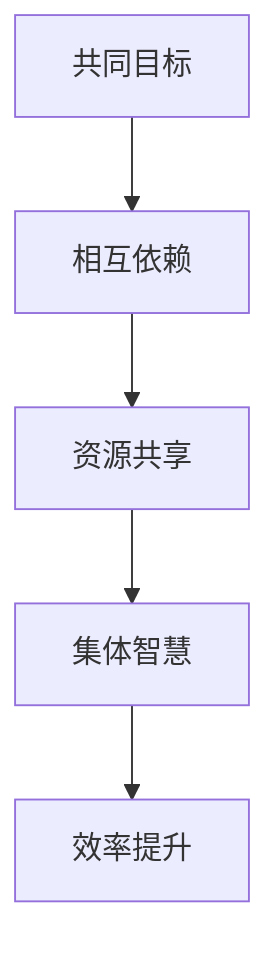

                 


### 摘要

团队协作是现代企业和组织成功的关键因素之一。本文旨在深入探讨团队协作的重要性、障碍与挑战、个体优势与团队协作的结合、有效方法、领导力以及未来发展趋势。通过具体的案例分析和实践经验，本文将为读者提供关于团队协作的全面理解和实用指导，帮助团队发挥最大潜力，实现共同目标。

### 关键词

- 团队协作
- 个人优势
- 沟通技巧
- 决策流程
- 领导力
- 未来趋势

### 文章标题

# 团队协作：发挥个体优势的艺术

### 第一部分：团队协作概述

#### 第1章：团队协作的重要性

**1.1.1 团队协作的基本概念**

团队协作是指团队成员为了共同目标，通过相互沟通、协调和合作来完成任务的行动过程。它不仅仅是一种工作方式，更是一种团队文化和管理理念。在现代社会，团队协作已经成为企业和组织提高效率、创新能力和竞争力的关键。

- **定义**：团队协作是指团队成员之间通过共同的沟通、协调、合作来完成特定任务或达成特定目标的过程。
- **意义**：团队协作能够发挥每个成员的优势，实现资源的共享和互补，提高工作效率和质量。

**1.1.2 团队协作的核心价值**

团队协作具有以下几个核心价值：

- **协同效应**：通过团队协作，可以实现1+1>2的效果，即团队成员共同合作所创造的价值大于各自单独工作时的总和。
- **创新驱动**：团队协作鼓励成员之间的交流与互动，激发创新思维，推动企业或组织不断进步。
- **效率提升**：团队协作能够优化工作流程，减少冗余环节，提高整体工作效率。
- **个人成长**：团队协作不仅有助于团队目标的实现，还能促进成员的个人成长与发展。

**1.1.3 团队协作与个人发展的关系**

团队协作与个人发展密切相关。通过团队协作，成员可以：

- **提高技能**：参与不同任务的协作，能够锻炼和提升个人的专业技能。
- **拓展视野**：与不同背景的团队成员合作，能够开阔视野，学习新的知识和经验。
- **增强沟通能力**：在团队协作中，成员需要不断进行沟通与协调，有助于提高沟通能力和人际交往能力。
- **提升自信心**：通过在团队中的表现和贡献，成员可以增强自信心，提升自我价值感。

**1.1.4 团队协作的挑战与障碍**

虽然团队协作具有很多优势，但在实际操作中也会面临一些挑战和障碍：

- **沟通障碍**：不同成员之间可能存在语言、文化、背景等方面的差异，导致沟通不畅。
- **角色不清**：团队成员的角色和职责不明确，可能导致工作重叠或缺失。
- **目标不一致**：团队成员可能对团队目标有不同的理解，导致工作方向不一致。
- **信任不足**：团队成员之间可能存在信任问题，影响合作效率和效果。

为了克服这些挑战，团队需要：

- **建立清晰的沟通机制**：通过定期会议、工作汇报等方式，确保团队成员之间的沟通畅通。
- **明确角色和职责**：明确每个成员的角色和职责，避免工作重叠和缺失。
- **统一目标**：确保团队成员对团队目标有共同的理解和认同。
- **建立信任关系**：通过共同完成任务、相互支持和尊重等方式，建立良好的信任关系。

**1.1.5 团队协作的核心概念与联系**

团队协作涉及多个核心概念，这些概念之间相互联系，共同构成了团队协作的体系。

- **共同目标**：团队协作的基础是共同的目标。团队成员需要明确共同目标，并为之努力。
- **相互依赖**：在团队协作中，成员之间相互依赖，共同完成任务。
- **资源共享**：团队成员需要共享资源，包括信息、技能和工具等，以提高工作效率。
- **集体智慧**：团队协作能够激发集体智慧，通过不同观点的碰撞和整合，产生更好的解决方案。

以下是一个Mermaid流程图，展示了这些核心概念之间的联系：



**1.1.6 团队协作的数学模型**

为了更好地理解团队协作的价值，我们可以引入一个简单的数学模型。假设团队成员A和B分别有100%和75%的工作效率，当他们独立工作时，总工作效率为175%。然而，当A和B共同协作时，他们的工作效率可以提升到225%（假设协作效率为50%），这展示了团队协作的协同效应。

数学模型如下：

$$
\text{团队协作效率} = \text{个体效率} \times \text{协作系数}
$$

其中，协作系数可以表示为：

$$
\text{协作系数} = 1 + \frac{\text{协作提升值}}{\text{总个体效率}}
$$

协作提升值可以通过实验和数据分析来确定。

**1.1.7 团队协作的实际案例**

在软件开发领域，团队协作是项目成功的关键。以下是一个实际案例：

- **项目背景**：一家科技公司需要开发一款新型智能家居系统。
- **团队组成**：项目团队由程序员、UI设计师、测试工程师和产品经理组成。
- **协作过程**：团队成员通过以下方式协作：
  - **需求分析**：产品经理与客户沟通，了解需求，并将需求文档传递给团队成员。
  - **代码开发**：程序员根据需求文档进行代码开发，UI设计师负责界面设计，测试工程师进行功能测试。
  - **迭代反馈**：团队成员定期召开会议，讨论项目进展，分享反馈和建议，进行迭代优化。

通过这种团队协作模式，项目团队成功地开发出了符合客户需求的智能家居系统，并在市场上取得了良好的反响。

**1.1.8 团队协作的最佳实践**

为了提高团队协作效率，以下是一些最佳实践：

- **明确目标**：确保每个团队成员都清楚团队的目标，以及自己在项目中的角色和职责。
- **有效沟通**：建立畅通的沟通渠道，定期召开会议，确保信息传递及时、准确。
- **资源共享**：充分利用团队成员的技能和资源，避免重复劳动，提高工作效率。
- **鼓励创新**：鼓励团队成员提出新的想法和解决方案，激发创新思维。
- **团队建设**：定期组织团队建设活动，增强团队成员之间的互信和默契。

**1.1.9 小结**

团队协作是现代企业和组织成功的关键因素之一。通过明确的共同目标、相互依赖、资源共享和集体智慧，团队可以发挥最大潜力，实现共同目标。同时，团队协作也能够促进个人成长和发展。面对团队协作中的挑战和障碍，通过建立清晰的沟通机制、明确角色和职责、统一目标和建立信任关系，团队可以克服这些困难，实现高效协作。

---

**1.1.10 拓展阅读**

- 《有效团队协作的5个关键要素》
- 《如何提高团队协作效率？》
- 《团队协作的艺术：如何打造高效团队》

----------------------------------------------------------------

**第2章：团队协作的障碍与挑战**

**2.1.1 团队协作的常见障碍**

尽管团队协作具有很多优势，但在实际操作中，团队协作往往会面临一些障碍和挑战。了解并解决这些障碍是确保团队协作顺利进行的关键。以下是团队协作中常见的障碍：

1. **沟通障碍**：

沟通是团队协作的基础，但沟通障碍是团队协作中最常见的问题之一。团队成员之间的语言、文化、背景和沟通方式的差异可能导致信息传递不畅，影响团队协作效率。

- **解决方案**：
  - **建立统一的沟通平台**：使用统一的沟通工具，如即时通讯软件、邮件和视频会议系统，确保信息传递及时、准确。
  - **明确沟通规范**：制定统一的沟通规范，包括语言、格式、频率等，确保团队成员之间的沟通规范一致。

2. **角色不清**：

在团队中，如果成员的角色和职责不明确，可能会导致工作重叠或缺失，影响团队协作效率。

- **解决方案**：
  - **明确角色和职责**：为每个团队成员分配明确的角色和职责，确保工作任务的清晰和分工合理。
  - **制定工作流程**：制定详细的工作流程，明确每个环节的责任人，确保工作顺畅进行。

3. **目标不一致**：

团队成员可能对团队目标有不同的理解，导致工作方向不一致，影响团队协作效果。

- **解决方案**：
  - **统一目标**：确保团队成员对团队目标有共同的理解和认同，通过沟通和协商解决目标不一致的问题。
  - **制定详细的计划**：制定详细的工作计划，明确每个阶段的目标和任务，确保团队成员按照统一的目标工作。

4. **信任不足**：

团队成员之间的信任不足会影响团队协作的效率和效果。

- **解决方案**：
  - **建立信任关系**：通过共同完成任务、相互支持和尊重等方式，建立良好的信任关系。
  - **沟通和反馈**：鼓励团队成员之间的沟通和反馈，增强透明度和信任感。

5. **资源限制**：

团队协作往往受到资源限制的影响，如人力、时间和预算等。

- **解决方案**：
  - **合理分配资源**：根据任务的重要性和紧急性，合理分配资源，确保关键任务得到充分支持。
  - **优化工作流程**：通过优化工作流程，减少冗余环节，提高资源利用效率。

6. **外部干扰**：

团队协作可能会受到外部干扰的影响，如市场需求变化、技术难题等。

- **解决方案**：
  - **灵活应对**：建立灵活的应对机制，快速响应外部变化，确保团队协作不受影响。
  - **提前准备**：在项目启动前，进行充分的需求分析和风险评估，提前准备应对措施。

**2.1.2 突破团队协作障碍的策略**

为了突破团队协作中的障碍，以下是一些有效的策略：

1. **建立共同愿景**：

共同愿景是团队协作的动力源泉。通过建立共同愿景，可以激发团队成员的积极性和创造力，提高团队协作效率。

- **方法**：
  - **明确共同愿景**：在项目启动阶段，明确团队的共同愿景，确保团队成员对愿景有共同的理解。
  - **定期回顾**：定期回顾共同愿景，确保团队成员始终保持对愿景的认同和追求。

2. **加强沟通与协作**：

有效的沟通和协作是团队协作的关键。通过加强沟通和协作，可以消除信息传递的障碍，提高团队协作效率。

- **方法**：
  - **建立沟通渠道**：建立畅通的沟通渠道，如定期会议、即时通讯工具等，确保团队成员之间的信息传递及时、准确。
  - **鼓励开放沟通**：鼓励团队成员之间的开放沟通，建立相互信任的氛围。

3. **明确角色与职责**：

明确每个成员的角色和职责，可以避免工作重叠和缺失，提高团队协作效率。

- **方法**：
  - **角色分配**：在项目启动阶段，明确每个成员的角色和职责，确保工作任务的清晰和分工合理。
  - **定期评估**：定期评估成员的角色和职责，确保角色与职责的适应性。

4. **培养团队信任**：

建立良好的信任关系，可以增强团队成员之间的协作和凝聚力，提高团队协作效率。

- **方法**：
  - **共同完成任务**：通过共同完成任务，增强团队成员之间的信任感。
  - **相互尊重**：尊重团队成员的意见和贡献，建立相互尊重的氛围。

5. **提供必要资源**：

确保团队有足够的资源支持，可以减少资源限制对团队协作的影响。

- **方法**：
  - **资源规划**：在项目启动阶段，进行充分的资源规划，确保团队有足够的资源支持。
  - **灵活调整**：根据项目进展，灵活调整资源分配，确保关键任务得到充分支持。

6. **建立反馈机制**：

建立有效的反馈机制，可以及时发现问题，采取改进措施，提高团队协作效率。

- **方法**：
  - **定期反馈**：定期召开团队会议，收集团队成员的反馈和建议，及时解决问题。
  - **匿名反馈**：提供匿名反馈渠道，鼓励团队成员提出真实的意见和建议。

**2.1.3 面对冲突的团队协作技巧**

在团队协作中，冲突是不可避免的。有效的冲突管理技巧可以帮助团队更好地解决冲突，促进团队协作。

1. **倾听和理解**：

在处理冲突时，首先要倾听和理解对方的观点和立场，避免情绪化的反应。

- **方法**：
  - **保持冷静**：在处理冲突时，保持冷静，避免情绪化的反应。
  - **积极倾听**：倾听对方的观点，理解对方的立场和需求。

2. **寻求共识**：

通过寻求共识，可以找到解决问题的最佳方案，促进团队协作。

- **方法**：
  - **讨论和协商**：通过讨论和协商，找到双方都能接受的解决方案。
  - **妥协和牺牲**：在必要时，可以做出妥协和牺牲，以达成共识。

3. **利用冲突**：

冲突也可以成为团队协作的动力，通过利用冲突，可以激发团队成员的创造力和创新思维。

- **方法**：
  - **开放讨论**：鼓励团队成员开放讨论，分享不同的观点和想法。
  - **创造性思维**：利用冲突，激发创造性思维，找到新的解决方案。

**2.1.4 小结**

团队协作虽然具有很多优势，但在实际操作中也会面临各种障碍和挑战。通过了解并解决这些障碍，可以确保团队协作顺利进行。同时，通过建立共同愿景、加强沟通与协作、明确角色与职责、培养团队信任、提供必要资源以及建立反馈机制等策略，可以进一步提高团队协作效率。

**2.1.5 拓展阅读**

- 《如何应对团队协作中的沟通障碍？》
- 《团队协作中的角色冲突与解决》
- 《建立团队信任的5个关键步骤》

----------------------------------------------------------------

**第3章：个体优势与团队协作的结合**

**3.1.1 个体优势的定义与识别**

个体优势是指某个团队成员在特定领域或任务中展现出的独特能力、知识和经验。这些优势可以是个人的专业技能、经验、创造力或领导力等。识别个体优势是团队协作中至关重要的一步，因为它有助于更好地利用每个成员的能力，提高团队的整体效能。

- **定义**：个体优势是指团队成员在特定领域或任务中展现出的独特能力、知识和经验。
- **识别方法**：
  - **自我评估**：团队成员可以通过自我评估，了解自己在哪些领域具有优势。
  - **同事反馈**：团队成员可以通过同事的反馈，了解自己在团队中的优势和不足。
  - **领导评估**：领导者可以通过对团队成员的工作表现进行评估，识别他们的优势。

**3.1.2 个体优势在团队中的作用**

个体优势在团队中的作用是多方面的，它不仅可以提升团队的整体效能，还可以促进团队成员的个人成长。

- **提升团队效能**：个体优势可以帮助团队在特定领域快速取得进展，解决复杂问题，提高工作效率。
- **促进个人成长**：通过发挥个体优势，团队成员可以不断提升自己的技能和知识，实现个人职业发展。
- **激发团队活力**：个体优势可以激发团队成员的积极性和创造力，促进团队创新和进步。

**3.1.3 如何发挥个体优势，实现团队协作**

为了充分发挥个体优势，实现团队协作，团队需要采取一系列措施：

1. **角色定位**：

根据每个成员的优势，为他们分配合适的角色和任务，确保他们能够发挥最大的潜力。

- **方法**：
  - **评估成员优势**：通过自我评估、同事反馈和领导评估，了解每个成员的优势。
  - **角色分配**：根据成员的优势，为他们分配适合的角色和任务。

2. **任务匹配**：

将具有相关优势的成员分配到需要这些优势的任务中，确保任务与成员的能力相匹配。

- **方法**：
  - **任务评估**：评估每个任务的技能和知识要求。
  - **成员匹配**：将具有相应优势的成员分配到相应的任务中。

3. **沟通与反馈**：

建立有效的沟通机制，确保团队成员之间的信息传递畅通，同时鼓励成员之间的反馈和交流。

- **方法**：
  - **定期沟通**：定期召开团队会议，分享工作进展和经验。
  - **即时反馈**：鼓励团队成员之间的即时反馈，及时解决问题。

4. **激励机制**：

通过激励机制，鼓励团队成员发挥自己的优势，提高工作效率和质量。

- **方法**：
  - **绩效奖励**：根据成员的工作表现，给予适当的绩效奖励。
  - **认可与表扬**：对表现出色的成员进行认可和表扬，增强他们的积极性和动力。

**3.1.4 如何识别和培养团队成员的优势**

1. **持续评估**：

定期对团队成员的工作表现进行评估，识别他们的优势和潜力。

- **方法**：
  - **年度评估**：每年进行一次全面的绩效评估，了解成员的优势和潜力。
  - **日常观察**：领导者通过日常观察，了解成员的工作表现和潜力。

2. **培训与发展**：

为团队成员提供培训和发展机会，帮助他们提升技能和知识，发挥自己的优势。

- **方法**：
  - **内部培训**：组织内部培训课程，提升成员的专业技能。
  - **外部培训**：鼓励成员参加外部培训和学习，拓宽视野。

3. **个性化培养**：

根据每个成员的特点和需求，制定个性化的培养计划，帮助他们发挥优势，实现个人成长。

- **方法**：
  - **一对一辅导**：为成员提供一对一的辅导，针对他们的优势进行有针对性的指导。
  - **导师制度**：建立导师制度，为成员提供经验丰富的导师，指导他们的成长。

**3.1.5 案例分析**

以下是一个案例分析，展示了如何识别和发挥团队成员的优势：

- **项目背景**：某科技公司需要开发一款新的移动应用程序，团队成员包括前端开发工程师、后端开发工程师、UI设计师和产品经理。
- **优势识别**：
  - 前端开发工程师具备丰富的移动应用开发经验。
  - 后端开发工程师在数据库设计和架构方面有专业背景。
  - UI设计师在移动界面设计方面有独特的创意。
  - 产品经理对市场需求有深入的理解。
- **优势发挥**：
  - 前端开发工程师负责应用程序的前端开发，利用他的经验确保应用的界面友好、性能稳定。
  - 后端开发工程师负责数据库设计和后端逻辑实现，利用他的专业背景提高系统的性能和安全性。
  - UI设计师负责界面设计，利用他的创意打造美观、易于使用的用户界面。
  - 产品经理负责市场调研和产品规划，确保应用程序满足用户需求。

通过这种方式，团队成员的优势得到了充分发挥，项目团队成功地开发出了符合市场需求的移动应用程序。

**3.1.6 小结**

个体优势在团队协作中起着至关重要的作用。通过识别和发挥团队成员的优势，可以提升团队的整体效能，促进个人成长。团队需要采取一系列措施，如角色定位、任务匹配、沟通与反馈、激励机制等，来确保个体优势的充分发挥。同时，通过持续评估、培训与发展、个性化培养等方法，可以帮助团队成员不断提升自己的优势，实现个人和团队的双重成长。

**3.1.7 拓展阅读**

- 《如何发现和利用团队成员的优势？》
- 《个体优势与团队效能的关系研究》
- 《发挥个体优势，打造高效团队》

----------------------------------------------------------------

**第4章：团队协作的有效方法**

**4.1.1 沟通技巧在团队协作中的应用**

沟通是团队协作的核心，有效的沟通技巧能够提高团队的工作效率和协作效果。以下是几种常用的沟通技巧：

1. **明确表达**：

清晰、明确地表达自己的观点和需求，避免产生误解。

- **方法**：
  - **使用简单语言**：使用简单、易懂的语言进行沟通。
  - **避免含糊其辞**：避免使用含糊不清的表述，确保信息的准确传达。

2. **倾听与理解**：

倾听他人的观点和意见，理解他们的需求和期望。

- **方法**：
  - **积极倾听**：倾听对方的话语，关注对方的情感和需求。
  - **确认理解**：在对方表达完毕后，总结自己的理解，确保准确理解对方的意图。

3. **积极反馈**：

及时给予反馈，帮助团队成员了解工作进展和效果。

- **方法**：
  - **正面反馈**：对团队成员的工作表现给予积极的评价和认可。
  - **建设性反馈**：在反馈中提出具体、可操作的建议，帮助团队成员改进。

4. **冲突管理**：

在沟通中，面对冲突时要保持冷静，寻找解决问题的方法。

- **方法**：
  - **理性分析**：分析冲突的原因，寻找合理的解决方案。
  - **妥协与协商**：在必要时，通过妥协和协商解决冲突。

5. **建立信任**：

通过沟通建立信任，增强团队成员之间的互信和协作。

- **方法**：
  - **透明沟通**：在沟通中保持透明，分享信息和资源。
  - **尊重差异**：尊重团队成员的差异，包容不同的观点和意见。

**4.1.2 团队决策流程与原则**

团队决策是团队协作的重要环节，有效的决策流程和原则能够提高决策的质量和效率。以下是团队决策的常见流程和原则：

1. **问题识别**：

明确团队需要解决的问题或面对的挑战。

- **方法**：
  - **需求分析**：分析团队面临的问题或需求，明确需要解决的问题。
  - **信息收集**：收集与问题相关的信息，确保决策有充分的数据支持。

2. **方案提出**：

提出可能的解决方案，进行分析和评估。

- **方法**：
  - **头脑风暴**：鼓励团队成员提出各种可能的解决方案。
  - **方案评估**：对提出的方案进行评估，选择最优的解决方案。

3. **讨论与讨论**：

团队成员对解决方案进行讨论和辩论，形成共识。

- **方法**：
  - **开放讨论**：鼓励团队成员自由表达意见，充分讨论。
  - **辩论与协商**：在讨论中，通过辩论和协商，形成共识。

4. **决策执行**：

根据共识的方案，制定详细的执行计划，并执行。

- **方法**：
  - **任务分配**：明确每个成员的任务和责任，确保执行计划的实施。
  - **进度监控**：监控执行进度，及时调整和优化执行计划。

5. **反馈与评估**：

在决策执行过程中，进行反馈和评估，总结经验教训。

- **方法**：
  - **定期反馈**：定期收集团队成员的反馈，了解决策执行的情况。
  - **总结与评估**：对决策执行的结果进行总结和评估，为未来的决策提供参考。

**4.1.3 团队协作工具与平台介绍**

在团队协作中，使用适当的工具和平台可以大大提高工作效率和协作效果。以下是几种常用的团队协作工具和平台：

1. **即时通讯工具**：

如Slack、Microsoft Teams等，用于实时沟通和协作。

- **优势**：
  - **实时沟通**：支持实时消息发送，快速响应。
  - **文件共享**：方便团队成员共享文件和资料。

2. **项目管理工具**：

如Trello、Jira等，用于任务管理、进度跟踪和团队协作。

- **优势**：
  - **任务分配**：明确每个成员的任务和责任。
  - **进度跟踪**：实时监控任务进度，确保项目按时完成。

3. **视频会议工具**：

如Zoom、Microsoft Teams等，用于远程会议和团队协作。

- **优势**：
  - **远程协作**：支持远程团队成员的实时沟通。
  - **视频会议**：提供视频会议功能，方便团队成员远程交流。

4. **文档共享与协作工具**：

如Google Docs、Microsoft Office 365等，用于多人实时编辑和协作文档。

- **优势**：
  - **实时编辑**：支持多人实时编辑文档。
  - **版本控制**：自动保存文档版本，避免文档丢失。

**4.1.4 案例分析**

以下是一个案例分析，展示了如何使用团队协作工具和平台提高团队协作效率：

- **项目背景**：某科技公司需要开发一款新的软件产品，团队成员分布在不同的城市。
- **工具选择**：
  - **Slack**：用于实时沟通和协作，团队成员可以在Slack中讨论项目进展和问题。
  - **Jira**：用于任务管理和进度跟踪，项目经理在Jira中创建任务和里程碑，团队成员负责任务的执行。
  - **Zoom**：用于远程会议和视频沟通，每周召开项目会议，讨论项目进展和解决方案。
  - **Google Docs**：用于文档共享和协作，团队成员实时编辑文档，共享项目资料。

通过使用这些工具和平台，项目团队成功地完成了软件产品的开发，并在规定时间内交付了高质量的成果。

**4.1.5 小结**

有效的团队协作需要良好的沟通技巧、明确的决策流程和合适的协作工具。通过使用适当的沟通技巧，可以提高团队的工作效率和协作效果；通过明确的决策流程，可以确保团队做出高质量的决策；通过使用协作工具和平台，可以更好地管理和协调团队工作。通过以上方法，团队可以充分发挥个体优势，实现高效的团队协作。

**4.1.6 拓展阅读**

- 《如何提高团队协作效率？》
- 《团队决策的最佳实践》
- 《团队协作工具的选择与使用》

----------------------------------------------------------------

**第5章：团队协作的领导力**

**5.1.1 领导者如何促进团队协作**

团队协作的成功离不开领导者的引导和推动。领导者不仅是团队的核心人物，也是团队协作的推动者。以下是一些领导者如何促进团队协作的方法：

1. **设定共同目标**：

领导者需要为团队设定明确的共同目标，使团队成员能够明确自己的工作方向和目标。

- **方法**：
  - **制定明确的目标**：制定具体、可衡量的目标，使团队成员清晰了解团队的目标。
  - **定期回顾**：定期与团队成员一起回顾目标的进展，确保团队成员始终保持对目标的关注。

2. **建立信任关系**：

领导者需要建立信任关系，使团队成员之间相互信任，促进团队协作。

- **方法**：
  - **透明沟通**：与团队成员保持透明沟通，分享信息和资源，增强信任。
  - **支持与鼓励**：支持团队成员，鼓励他们表达意见和提出建议，建立信任。

3. **激励团队成员**：

领导者需要激励团队成员，激发他们的积极性和创造力，提高团队协作效率。

- **方法**：
  - **认可与表扬**：对团队成员的工作表现给予认可和表扬，增强他们的自信心和动力。
  - **提供培训与发展**：为团队成员提供培训和发展机会，帮助他们提升技能和知识。

4. **培养协作文化**：

领导者需要培养团队协作文化，使团队成员意识到协作的重要性，并积极投入团队协作。

- **方法**：
  - **鼓励开放沟通**：鼓励团队成员之间的开放沟通，建立相互信任的氛围。
  - **共同庆祝成功**：在团队取得成功时，共同庆祝，增强团队凝聚力。

5. **解决冲突**：

领导者需要及时解决团队中的冲突，确保团队协作的顺利进行。

- **方法**：
  - **理性分析**：在处理冲突时，保持冷静，理性分析问题的原因。
  - **寻求共识**：通过讨论和协商，找到解决问题的方法，达成共识。

6. **培养团队领导力**：

领导者需要培养团队成员的领导力，使团队中的每个成员都能够发挥自己的领导潜力。

- **方法**：
  - **鼓励领导实践**：鼓励团队成员参与领导实践，提升他们的领导能力。
  - **提供领导培训**：为团队成员提供领导力培训，帮助他们提升领导技能。

**5.1.2 团队领导者的影响力与角色**

团队领导者的影响力是团队协作成功的关键。领导者的影响力不仅体现在对团队成员的指导和激励上，还体现在对团队文化和氛围的塑造上。以下是团队领导者的影响力与角色：

1. **愿景塑造者**：

领导者需要为团队设定明确的愿景，引导团队成员为实现愿景而努力。

- **角色**：
  - **制定愿景**：制定团队的长期和短期愿景，使团队成员清晰了解团队的发展方向。
  - **传达愿景**：通过有效的沟通，将愿景传达给团队成员，激发他们的热情和动力。

2. **激励者**：

领导者需要激励团队成员，激发他们的工作热情和创造力。

- **角色**：
  - **认可与表扬**：对团队成员的工作表现给予认可和表扬，增强他们的自信心和动力。
  - **提供激励**：通过奖励和激励措施，激发团队成员的积极性和创造力。

3. **协调者**：

领导者需要协调团队成员之间的关系，确保团队协作的顺利进行。

- **角色**：
  - **解决冲突**：及时解决团队中的冲突，维护团队和谐。
  - **资源分配**：合理分配团队资源，确保每个成员都能充分发挥自己的优势。

4. **榜样者**：

领导者需要以身作则，成为团队成员的榜样，树立良好的行为典范。

- **角色**：
  - **诚信正直**：言行一致，诚信正直，树立良好的道德品质。
  - **持续学习**：持续学习，提升自己的领导能力和专业素养。

5. **培养者**：

领导者需要培养团队成员的领导力和专业能力，帮助团队成员实现个人成长。

- **角色**：
  - **提供培训**：为团队成员提供培训和发展机会，帮助他们提升技能和知识。
  - **指导与支持**：在团队成员遇到困难时，给予指导和帮助，支持他们的成长。

**5.1.3 团队领导力的提升策略**

为了提升团队领导力，领导者可以采取以下策略：

1. **自我反思**：

领导者需要定期进行自我反思，了解自己的优点和不足，不断提升自己的领导能力。

- **方法**：
  - **定期评估**：定期对自己的领导能力进行评估，了解自己在哪些方面需要改进。
  - **寻求反馈**：向团队成员和同事寻求反馈，了解自己在团队中的表现和影响。

2. **学习与培训**：

领导者需要不断学习和参加培训，提升自己的领导力和专业知识。

- **方法**：
  - **专业培训**：参加专业领导力培训，学习先进的领导理论和实践。
  - **阅读与研究**：阅读领导力相关书籍，研究成功领导者的案例，汲取经验。

3. **实践经验**：

领导者需要通过实践来提升自己的领导能力，将理论应用于实际工作中。

- **方法**：
  - **参与项目**：参与各种项目，锻炼自己的领导能力。
  - **面对挑战**：勇敢面对工作中的挑战，通过实践提升自己的能力。

4. **培养下属**：

领导者需要关注团队成员的成长，培养他们的领导能力和专业素养。

- **方法**：
  - **指导与支持**：为团队成员提供指导和支持，帮助他们克服困难，实现成长。
  - **授权与信任**：给予团队成员适当的权限和信任，鼓励他们发挥自己的潜力。

**5.1.4 案例分析**

以下是一个案例分析，展示了如何通过团队领导力提升团队协作效率：

- **项目背景**：某科技公司需要开发一款新的软件产品，团队成员包括前端开发工程师、后端开发工程师、UI设计师和产品经理。
- **领导行为**：
  - **共同愿景**：项目经理在项目启动时，为团队设定了明确的愿景和目标，使团队成员明确自己的工作方向。
  - **信任与支持**：项目经理建立了信任关系，鼓励团队成员之间的开放沟通，支持他们提出意见和建议。
  - **激励与认可**：项目经理对团队成员的工作表现给予认可和表扬，激励他们保持积极的态度。
  - **冲突管理**：项目经理及时解决团队中的冲突，确保团队协作的顺利进行。

通过项目经理的领导行为，项目团队成功地完成了软件产品的开发，并在规定时间内交付了高质量的成果。

**5.1.5 小结**

团队协作的成功离不开领导者的引导和推动。领导者需要通过设定共同目标、建立信任关系、激励团队成员、培养团队协作文化等方法，促进团队协作。同时，领导者需要不断提升自己的领导力，以身作则，为团队树立榜样。通过以上方法，领导者可以提升团队协作效率，实现团队目标。

**5.1.6 拓展阅读**

- 《如何成为优秀的团队领导者？》
- 《领导力与团队效能的关系研究》
- 《提升团队领导力的5个策略》

----------------------------------------------------------------

**第6章：团队协作的案例分析**

**6.1.1 成功的团队协作案例分析**

成功的团队协作案例分析可以帮助我们理解如何在实际环境中实现高效协作。以下是一个成功的团队协作案例分析：

- **项目背景**：某国际知名科技公司需要开发一款新一代智能家居系统，团队成员包括前端开发工程师、后端开发工程师、UI设计师、测试工程师和产品经理。
- **协作过程**：
  - **明确目标**：项目启动时，团队成员明确了共同的目标，即开发一款功能齐全、用户体验优秀的智能家居系统。
  - **角色分配**：根据团队成员的专业技能和经验，为他们分配了明确的角色和任务，确保每个成员都能在自己的领域发挥优势。
  - **沟通机制**：建立了畅通的沟通渠道，包括每周的团队会议、即时通讯工具和邮件，确保团队成员之间的信息传递及时、准确。
  - **迭代开发**：采用敏捷开发方法，团队成员不断进行迭代开发，及时反馈和调整，确保项目按计划推进。
  - **共同庆祝**：在项目关键节点和里程碑时，团队成员共同庆祝，增强团队凝聚力。
- **成果**：项目团队在规定时间内成功交付了智能家居系统，产品获得了市场的广泛认可和好评。

**6.1.2 团队协作中的问题与解决**

在团队协作过程中，难免会遇到一些问题和挑战。以下是一个团队协作中遇到的问题及其解决方案：

- **问题**：在项目开发过程中，团队成员发现前后端开发之间存在严重的沟通障碍，导致工作进展缓慢。
- **解决方案**：
  - **沟通会议**：团队增加了每周一次的前后端开发沟通会议，确保双方能够及时交流需求和进展。
  - **共同目标**：明确了前后端开发团队之间的共同目标，即提供最佳的用户体验，增强了双方的合作意愿。
  - **资源共享**：通过共享代码库和文档，提高了信息的透明度，减少了误解和冲突。

**6.1.3 团队协作的实践经验与启示**

从上述案例中，我们可以总结出一些团队协作的实践经验和启示：

1. **明确目标**：共同的目标是团队协作的基础，确保每个成员都清晰了解并认同团队的目标。
2. **角色分配**：根据成员的技能和经验，为他们分配合适的角色和任务，确保每个成员都能发挥自己的优势。
3. **沟通机制**：建立畅通的沟通渠道，确保信息传递及时、准确，减少误解和冲突。
4. **迭代开发**：采用敏捷开发方法，不断进行迭代开发，及时反馈和调整，提高项目的灵活性和适应性。
5. **共同庆祝**：在团队取得成功时，共同庆祝，增强团队凝聚力。
6. **资源共享**：通过共享资源和信息，提高团队的透明度和协作效率。
7. **持续改进**：不断总结经验教训，持续改进团队协作流程和方法，提高团队协作效率。

**6.1.4 案例分析：远程团队协作**

随着远程工作趋势的加剧，远程团队协作成为许多组织面临的新挑战。以下是一个远程团队协作的案例分析：

- **项目背景**：某跨国公司需要开发一款全球性的电商平台，团队成员分布在不同的国家。
- **协作过程**：
  - **沟通工具**：使用视频会议工具（如Zoom、Microsoft Teams）进行实时沟通，确保团队成员之间的交流无障碍。
  - **协作平台**：使用项目管理工具（如Jira、Trello）进行任务管理和进度跟踪，确保项目按计划推进。
  - **时间管理**：采用灵活的工作时间表，考虑不同时区的差异，确保团队成员能够高效工作。
  - **文化差异**：重视文化差异，尊重团队成员的本土文化和习惯，通过跨文化沟通技巧增强团队凝聚力。
- **成果**：尽管团队成员分布在不同的国家，但通过有效的远程协作，项目团队在规定时间内成功完成了电商平台的建设，并在全球范围内取得了良好的市场反响。

**6.1.5 案例分析：敏捷开发与团队协作**

敏捷开发方法强调迭代和协作，是一种非常适用于团队协作的开发模式。以下是一个敏捷开发的案例分析：

- **项目背景**：某科技公司需要开发一款移动应用程序，团队成员包括前端开发工程师、后端开发工程师、UI设计师和产品经理。
- **协作过程**：
  - **迭代开发**：项目采用敏捷开发方法，每两周进行一次迭代，团队成员在迭代期间进行频繁的沟通和协作。
  - **每日站立会议**：团队成员每天举行短暂的站立会议，讨论工作进展和问题，确保团队始终保持同步。
  - **用户反馈**：在每个迭代结束时，向用户展示产品原型，收集用户反馈，并根据反馈进行迭代优化。
  - **持续集成**：使用持续集成工具（如Jenkins、Travis CI），确保代码质量和项目进度。
- **成果**：通过敏捷开发方法，项目团队快速响应需求变化，不断优化产品，最终交付了一款用户体验优秀、功能丰富的移动应用程序。

**6.1.6 团队协作的实践经验与启示**

从上述案例分析中，我们可以总结出以下团队协作的实践经验与启示：

1. **敏捷开发**：采用敏捷开发方法，提高团队的灵活性和响应速度，确保项目能够快速适应变化。
2. **持续沟通**：通过频繁的沟通和协作，确保团队成员之间的信息传递畅通，减少误解和冲突。
3. **用户反馈**：重视用户反馈，根据用户需求进行产品迭代和优化，确保产品满足用户需求。
4. **持续集成**：使用持续集成工具，提高代码质量和项目进度，确保项目的稳定性和可靠性。
5. **文化差异**：尊重团队成员的文化差异，建立跨文化沟通机制，增强团队的凝聚力和协作效率。

**6.1.7 小结**

团队协作的成功离不开明确的角色分配、畅通的沟通机制、敏捷的开发方法和用户反馈机制。通过分析成功和失败的案例，我们可以总结出团队协作的有效实践，为未来的团队协作提供指导和借鉴。

**6.1.8 拓展阅读**

- 《远程团队协作的最佳实践》
- 《敏捷开发与团队协作》
- 《案例分析：如何打造高效团队》

----------------------------------------------------------------

**第7章：未来团队协作的发展趋势**

**7.1.1 数字化时代下的团队协作**

随着数字化技术的快速发展，团队协作模式也在不断变革。数字化时代为团队协作带来了新的机遇和挑战。

- **机遇**：
  - **远程协作**：数字化技术使得远程协作变得更加便捷，团队成员可以不受地域限制，高效协同工作。
  - **实时沟通**：通过即时通讯工具和视频会议系统，团队成员可以实时沟通，提高决策速度和工作效率。
  - **数据共享**：数字化平台提供了高效的数据共享和协作工具，使团队成员能够轻松访问和共享信息。

- **挑战**：
  - **信息过载**：数字化时代，信息量爆炸性增长，团队成员需要处理大量的信息，可能导致信息过载和沟通障碍。
  - **技术依赖**：对数字化工具和平台的依赖性增加，可能导致技术故障和系统不稳定，影响团队协作效率。

**7.1.2 远程团队协作的挑战与机遇**

远程团队协作在数字化时代具有显著的优势，但也面临一些挑战。

- **挑战**：
  - **沟通障碍**：团队成员分布在不同的地理位置，可能导致沟通不畅和信息延迟。
  - **文化差异**：跨文化团队协作可能面临文化冲突和沟通障碍，影响团队协作效果。
  - **管理难度**：远程团队的管理相对复杂，需要更多的管理和协调工作，以确保团队目标的实现。

- **机遇**：
  - **灵活工作**：远程团队协作提供了更多的灵活性，团队成员可以根据自己的时间和地点进行工作，提高工作效率。
  - **全球人才**：远程团队协作可以吸引全球优秀人才，为团队带来多元化的思维和技能。
  - **成本节约**：远程工作减少了团队成员的通勤时间和办公室租赁成本，有助于降低企业运营成本。

**7.1.3 未来团队协作的发展趋势**

未来团队协作将呈现以下发展趋势：

1. **智能化协作工具**：

随着人工智能技术的发展，智能化协作工具将变得更加普及。这些工具能够自动化重复性任务，提高团队成员的工作效率。例如，智能助手可以自动处理邮件、日程安排等日常任务，使团队成员能够更专注于核心工作。

2. **虚拟现实协作**：

虚拟现实（VR）和增强现实（AR）技术的应用将显著改变团队协作方式。通过VR/AR技术，团队成员可以在虚拟环境中进行实时协作，模拟真实的工作场景，提高协作效果和体验。

3. **去中心化协作**：

区块链技术将为团队协作带来去中心化的可能性。通过区块链技术，团队成员可以更安全、透明地共享和交换信息，确保协作的公正性和可信度。

4. **个性化协作**：

未来团队协作将更加注重个性化需求。团队协作工具将根据团队成员的个性、偏好和工作习惯，提供个性化的协作体验，提高团队协作效率和满意度。

5. **跨学科协作**：

随着技术的进步，团队协作将跨越传统学科界限，实现跨学科协作。团队成员将来自不同的专业领域，通过协作解决复杂问题，推动创新和进步。

**7.1.4 案例分析**

以下是一个未来团队协作的案例分析：

- **项目背景**：某跨国科技公司需要开发一款基于区块链技术的去中心化应用，团队成员包括软件开发工程师、区块链工程师、数据科学家和产品经理。
- **协作过程**：
  - **智能协作工具**：使用智能协作工具，如GitHub，进行代码管理和版本控制，确保代码质量和协作效率。
  - **虚拟现实会议**：通过VR会议系统，团队成员可以在虚拟会议室中进行实时协作，讨论项目进展和解决方案。
  - **区块链平台**：使用区块链平台，如Ethereum，进行去中心化的信息共享和交易，提高协作的透明度和安全性。
  - **个性化协作**：根据团队成员的技能和偏好，为他们提供个性化的协作工具和资源，提高协作效率和满意度。

**7.1.5 拓展阅读**

- 《数字化时代下的团队协作趋势》
- 《远程团队协作的未来发展》
- 《人工智能与团队协作》

----------------------------------------------------------------

**第8章：团队协作工具与资源**

**8.1.1 常用团队协作工具介绍**

在现代工作中，团队协作工具已成为不可或缺的一部分。以下是一些常用的团队协作工具及其特点：

1. **Slack**：

Slack是一款流行的即时通讯工具，支持文字、语音和视频聊天，以及文件共享和集成其他应用程序。其优势在于其强大的集成功能和丰富的插件。

2. **Microsoft Teams**：

Microsoft Teams提供了即时通讯、视频会议、日程安排和文档共享等功能，是微软办公套件的一部分，与Office 365无缝集成。

3. **Trello**：

Trello是一款基于看板的任务管理工具，简单直观，适合项目规划和进度跟踪。它通过卡片和列表的形式，帮助团队可视化工作流程。

4. **Jira**：

Jira是一款功能强大的项目管理工具，适用于敏捷开发团队。它提供了任务跟踪、迭代规划和报告分析等功能，帮助企业更好地管理项目进度。

5. **Google Workspace**：

Google Workspace（原名G Suite）包括Google文档、表格、邮件和日历等，支持多人实时协作，适合远程团队工作。

6. **Zoom**：

Zoom是一款专业的视频会议工具，支持高清视频和语音通话，适用于远程会议和团队沟通。

**8.1.2 团队协作工具的选择与使用**

选择适合团队协作的工具需要考虑以下因素：

1. **团队需求**：

根据团队的具体需求，选择具备相应功能的工具。例如，如果团队需要强大的项目管理功能，可以选择Jira或Trello。

2. **用户习惯**：

考虑团队成员对工具的熟悉程度和习惯，选择易于上手和操作的工具，以提高使用效率。

3. **成本效益**：

评估不同工具的成本，选择性价比高的工具，确保团队在预算范围内进行协作。

4. **集成性**：

考虑工具与其他业务系统和应用程序的集成性，确保数据共享和流程衔接顺畅。

**8.1.3 团队协作资源推荐**

以下是一些建议的团队协作资源，以帮助团队提高协作效率和效果：

1. **《团队协作与领导力》**：

这本书提供了关于团队协作和领导力的深入见解，适合团队成员和领导者阅读。

2. **《敏捷开发实践指南》**：

这本书介绍了敏捷开发的原理和实践方法，适用于希望提高团队协作效率的团队。

3. **《团队协作工具手册》**：

这是一本详细介绍各种团队协作工具的指南，帮助团队选择和使用适合的工具。

4. **在线课程和研讨会**：

参加在线课程和研讨会，学习团队协作的最佳实践和最新技术，提高团队协作能力。

**8.1.4 小结**

选择适合的团队协作工具和资源对于团队协作的成功至关重要。通过了解不同工具的特点和优势，并根据团队的具体需求进行选择，团队可以更高效地协作。同时，不断学习和使用新的团队协作资源，可以帮助团队不断改进协作流程，提高整体效率。

**8.1.5 拓展阅读**

- 《如何选择适合团队的协作工具？》
- 《团队协作工具的使用技巧》
- 《团队协作资源推荐》

----------------------------------------------------------------

**第9章：团队协作实践建议**

**9.1.1 团队协作的最佳实践**

为了确保团队协作的高效和成功，以下是一些团队协作的最佳实践：

1. **建立明确的共同目标**：

明确团队的共同目标是团队协作的基础。确保所有团队成员都清楚团队的目标和预期成果，有助于团队成员朝着同一方向努力。

2. **角色与职责分配**：

明确每个成员的角色和职责，避免工作重叠和缺失。确保每个成员都知道自己的职责，有助于提高团队协作效率。

3. **建立畅通的沟通渠道**：

确保团队成员之间的沟通畅通，通过定期会议、即时通讯工具和邮件等方式，确保信息传递及时、准确。

4. **鼓励开放沟通**：

鼓励团队成员之间的开放沟通，建立相互信任的氛围。通过开放沟通，团队成员可以分享想法、解决问题和提出建议。

5. **定期反馈和评估**：

定期对团队成员的工作进行反馈和评估，及时解决问题和调整工作方向。通过反馈和评估，可以帮助团队不断改进协作流程。

6. **培养团队合作精神**：

通过团队建设活动、共同庆祝成功等方式，培养团队合作精神。团队合作精神可以增强团队成员之间的互信和凝聚力。

7. **灵活应对变化**：

在团队协作过程中，灵活应对变化和挑战，及时调整工作计划和策略。通过灵活应对，团队可以更好地适应外部环境和内部变化。

8. **提供必要的资源和支持**：

确保团队有足够的资源和支持，包括人力、时间和预算等。通过提供必要的资源，团队可以更高效地协作。

**9.1.2 团队协作中的常见误区**

虽然团队协作具有很多优势，但以下是一些团队协作中的常见误区：

1. **沟通不畅**：

团队成员之间的沟通不畅是导致团队协作失败的主要原因之一。忽视沟通或使用不合适的沟通方式可能导致误解和冲突。

2. **角色不清**：

在团队协作中，角色不清可能导致工作重叠和缺失。团队成员可能不清楚自己的职责，导致工作混乱和效率低下。

3. **目标不一致**：

团队成员对团队目标有不同的理解，可能导致工作方向不一致，影响团队协作效果。

4. **信任不足**：

团队成员之间的信任不足会影响团队协作的效率和效果。缺乏信任可能导致团队成员之间的猜疑和争执。

5. **依赖个人英雄**：

过分依赖某个团队成员的个人能力，可能导致其他成员的积极性下降，影响团队整体的协作效率。

6. **忽视团队建设**：

忽视团队建设可能导致团队成员之间的默契不足，影响团队的凝聚力和协作效率。

**9.1.3 提高团队协作效率的策略**

以下是一些提高团队协作效率的策略：

1. **优化工作流程**：

通过优化工作流程，减少冗余环节，提高工作效率。使用项目管理工具和协作平台，确保工作流程的可视化和可控性。

2. **建立有效的沟通机制**：

建立畅通的沟通渠道，确保团队成员之间的沟通及时、准确。定期召开会议，分享工作进展和问题，确保信息传递畅通。

3. **培养团队合作精神**：

通过团队建设活动和团队文化塑造，培养团队合作精神。鼓励团队成员之间的相互支持和尊重，增强团队的凝聚力。

4. **提供培训和发展机会**：

为团队成员提供培训和发展机会，提高他们的技能和知识水平。通过培训，帮助团队成员更好地适应团队工作。

5. **激励与认可**：

通过激励和认可，鼓励团队成员发挥自己的优势，提高工作效率。给予团队成员适当的奖励和认可，增强他们的积极性和动力。

6. **灵活应对变化**：

在团队协作过程中，灵活应对变化和挑战，及时调整工作计划和策略。通过灵活应对，团队可以更好地适应外部环境和内部变化。

**9.1.4 小结**

团队协作是实现团队目标的关键，通过建立明确的共同目标、角色与职责分配、畅通的沟通渠道、团队建设、培训和发展机会等最佳实践，可以提高团队协作效率。同时，通过识别和避免团队协作中的常见误区，可以确保团队协作顺利进行。通过以上策略，团队可以发挥最大潜力，实现共同目标。

**9.1.5 拓展阅读**

- 《如何优化团队工作流程？》
- 《团队协作中的沟通技巧》
- 《提高团队协作效率的策略》

---

### 文章结语

团队协作是现代企业和组织成功的关键因素。通过明确的共同目标、角色与职责分配、畅通的沟通渠道、有效的决策流程和领导力，团队可以充分发挥个体优势，实现高效协作。本文从团队协作的重要性、障碍与挑战、个体优势与团队协作的结合、有效方法、领导力以及未来发展趋势等方面进行了深入探讨，为团队协作提供了全面的理解和实践指导。希望读者能够通过本文，更好地理解团队协作的艺术，发挥团队的最大潜力，实现共同目标。

---

### 作者信息

作者：AI天才研究院/AI Genius Institute & 禅与计算机程序设计艺术 /Zen And The Art of Computer Programming

---

### 结束语

感谢您的阅读，希望本文能够为您的团队协作带来启示和帮助。团队协作是一门艺术，需要不断地学习和实践。期待您在团队协作中取得成功，实现共同的目标。如果您有任何疑问或建议，欢迎在评论区留言，我们一起探讨团队协作的最佳实践。再次感谢您的支持和参与！

# 文章标题：团队协作：发挥个体优势的艺术

### 文章关键词

- 团队协作
- 个人优势
- 沟通技巧
- 决策流程
- 领导力
- 未来趋势

### 文章摘要

团队协作是现代企业和组织成功的关键因素之一。本文旨在深入探讨团队协作的重要性、障碍与挑战、个体优势与团队协作的结合、有效方法、领导力以及未来发展趋势。通过具体的案例分析和实践经验，本文将为读者提供关于团队协作的全面理解和实用指导，帮助团队发挥最大潜力，实现共同目标。

----------------------------------------------------------------

### 引入

在当今竞争激烈的市场环境中，团队协作已成为现代企业和组织成功的关键因素之一。无论是软件开发、市场营销、项目管理还是研发工作，团队协作都能够极大地提升工作效率、促进创新和增强团队凝聚力。本文将探讨团队协作的各个方面，包括其重要性、障碍与挑战、个体优势的发挥、有效方法、领导力以及未来趋势。通过深入分析这些主题，我们希望为读者提供关于团队协作的全面理解，并探讨如何在实际工作中实现高效协作。

### 第1章：团队协作的重要性

#### 1.1.1 团队协作的基本概念

团队协作是指团队成员为了共同的目标和任务，通过相互沟通、协调和合作来完成工作的一种方式。在团队协作中，每个成员都承担特定的角色和职责，共同参与决策和解决问题。团队协作不仅仅是任务完成的一种方式，更是一种文化和价值观的体现，它能够带来一系列显著的优势。

- **定义**：团队协作是指团队成员为了共同目标，通过相互沟通、协调和合作来完成工作任务的过程。
- **意义**：团队协作能够充分发挥每个成员的优势，实现资源的共享和互补，提高工作效率和质量。

#### 1.1.2 团队协作的核心价值

团队协作具有以下几个核心价值：

- **协同效应**：团队协作能够实现1+1>2的效果，通过不同成员的互补和协同，团队能够创造出超越单个成员的努力之和的价值。
- **创新驱动**：团队协作鼓励成员之间的交流和互动，激发创新思维，推动企业或组织不断进步。
- **效率提升**：团队协作能够优化工作流程，减少冗余环节，提高整体工作效率。
- **个人成长**：团队协作不仅有助于团队目标的实现，还能促进成员的个人成长和发展。

#### 1.1.3 团队协作与个人发展的关系

团队协作与个人发展密切相关。通过团队协作，成员可以：

- **提高技能**：参与不同任务的协作，能够锻炼和提升个人的专业技能。
- **拓展视野**：与不同背景的团队成员合作，能够开阔视野，学习新的知识和经验。
- **增强沟通能力**：在团队协作中，成员需要不断进行沟通与协调，有助于提高沟通能力和人际交往能力。
- **提升自信心**：通过在团队中的表现和贡献，成员可以增强自信心，提升自我价值感。

#### 1.1.4 团队协作的实际案例

以下是一个团队协作的实际案例：

- **项目背景**：某科技公司需要开发一款新的移动应用程序。
- **团队组成**：项目团队由前端开发工程师、后端开发工程师、UI设计师和产品经理组成。
- **协作过程**：
  - **需求分析**：产品经理与客户沟通，了解需求，并将需求文档传递给团队成员。
  - **代码开发**：前端和后端工程师根据需求文档进行代码开发，UI设计师负责界面设计，产品经理进行功能测试。
  - **迭代反馈**：团队成员定期召开会议，讨论项目进展，分享反馈和建议，进行迭代优化。

通过这种团队协作模式，项目团队成功地开发出了符合客户需求的移动应用程序，并在市场上取得了良好的反响。

#### 1.1.5 团队协作的数学模型

为了更好地理解团队协作的价值，我们可以引入一个简单的数学模型。假设团队成员A和B分别有100%和75%的工作效率，当他们独立工作时，总工作效率为175%。然而，当A和B共同协作时，他们的工作效率可以提升到225%（假设协作效率为50%），这展示了团队协作的协同效应。

数学模型如下：

$$
\text{团队协作效率} = \text{个体效率} \times \text{协作系数}
$$

其中，协作系数可以表示为：

$$
\text{协作系数} = 1 + \frac{\text{协作提升值}}{\text{总个体效率}}
$$

协作提升值可以通过实验和数据分析来确定。

#### 1.1.6 团队协作的最佳实践

为了提高团队协作效率，以下是一些最佳实践：

- **明确目标**：确保每个团队成员都清楚团队的目标，以及自己在项目中的角色和职责。
- **有效沟通**：建立畅通的沟通渠道，定期召开会议，确保信息传递及时、准确。
- **资源共享**：充分利用团队成员的技能和资源，避免重复劳动，提高工作效率。
- **鼓励创新**：鼓励团队成员提出新的想法和解决方案，激发创新思维。
- **团队建设**：定期组织团队建设活动，增强团队成员之间的互信和默契。

### 第2章：团队协作的障碍与挑战

#### 2.1.1 团队协作的常见障碍

尽管团队协作具有很多优势，但在实际操作中，团队协作往往会面临一些障碍和挑战。了解并解决这些障碍是确保团队协作顺利进行的关键。

1. **沟通障碍**：

沟通是团队协作的基础，但沟通障碍是团队协作中最常见的问题之一。团队成员之间的语言、文化、背景和沟通方式的差异可能导致信息传递不畅，影响团队协作效率。

- **解决方案**：
  - **建立统一的沟通平台**：使用统一的沟通工具，如即时通讯软件、邮件和视频会议系统，确保信息传递及时、准确。
  - **明确沟通规范**：制定统一的沟通规范，包括语言、格式、频率等，确保团队成员之间的沟通规范一致。

2. **角色不清**：

在团队中，如果成员的角色和职责不明确，可能会导致工作重叠或缺失，影响团队协作效率。

- **解决方案**：
  - **明确角色和职责**：为每个团队成员分配明确的角色和职责，确保工作任务的清晰和分工合理。
  - **制定工作流程**：制定详细的工作流程，明确每个环节的责任人，确保工作顺畅进行。

3. **目标不一致**：

团队成员可能对团队目标有不同的理解，导致工作方向不一致，影响团队协作效果。

- **解决方案**：
  - **统一目标**：确保团队成员对团队目标有共同的理解和认同，通过沟通和协商解决目标不一致的问题。
  - **制定详细的计划**：制定详细的工作计划，明确每个阶段的目标和任务，确保团队成员按照统一的目标工作。

4. **信任不足**：

团队成员之间的信任不足会影响团队协作的效率和效果。

- **解决方案**：
  - **建立信任关系**：通过共同完成任务、相互支持和尊重等方式，建立良好的信任关系。
  - **沟通和反馈**：鼓励团队成员之间的沟通和反馈，增强透明度和信任感。

5. **资源限制**：

团队协作往往受到资源限制的影响，如人力、时间和预算等。

- **解决方案**：
  - **合理分配资源**：根据任务的重要性和紧急性，合理分配资源，确保关键任务得到充分支持。
  - **优化工作流程**：通过优化工作流程，减少冗余环节，提高资源利用效率。

6. **外部干扰**：

团队协作可能会受到外部干扰的影响，如市场需求变化、技术难题等。

- **解决方案**：
  - **灵活应对**：建立灵活的应对机制，快速响应外部变化，确保团队协作不受影响。
  - **提前准备**：在项目启动前，进行充分的需求分析和风险评估，提前准备应对措施。

#### 2.1.2 突破团队协作障碍的策略

为了突破团队协作中的障碍，以下是一些有效的策略：

1. **建立共同愿景**：

共同愿景是团队协作的动力源泉。通过建立共同愿景，可以激发团队成员的积极性和创造力，提高团队协作效率。

- **方法**：
  - **明确共同愿景**：在项目启动阶段，明确团队的共同愿景，确保团队成员对愿景有共同的理解。
  - **定期回顾**：定期回顾共同愿景，确保团队成员始终保持对愿景的认同和追求。

2. **加强沟通与协作**：

有效的沟通和协作是团队协作的关键。通过加强沟通和协作，可以消除信息传递的障碍，提高团队协作效率。

- **方法**：
  - **建立沟通渠道**：建立畅通的沟通渠道，如定期会议、即时通讯工具等，确保团队成员之间的信息传递及时、准确。
  - **鼓励开放沟通**：鼓励团队成员之间的开放沟通，建立相互信任的氛围。

3. **明确角色与职责**：

明确每个成员的角色和职责，可以避免工作重叠和缺失，提高团队协作效率。

- **方法**：
  - **角色分配**：在项目启动阶段，明确每个成员的角色和职责，确保工作任务的清晰和分工合理。
  - **定期评估**：定期评估成员的角色和职责，确保角色与职责的适应性。

4. **培养团队信任**：

建立良好的信任关系，可以增强团队成员之间的协作和凝聚力，提高团队协作效率。

- **方法**：
  - **共同完成任务**：通过共同完成任务，增强团队成员之间的信任感。
  - **相互尊重**：尊重团队成员的意见和贡献，建立相互尊重的氛围。

5. **提供必要资源**：

确保团队有足够的资源支持，可以减少资源限制对团队协作的影响。

- **方法**：
  - **资源规划**：在项目启动阶段，进行充分的资源规划，确保团队有足够的资源支持。
  - **灵活调整**：根据项目进展，灵活调整资源分配，确保关键任务得到充分支持。

6. **建立反馈机制**：

建立有效的反馈机制，可以及时发现问题，采取改进措施，提高团队协作效率。

- **方法**：
  - **定期反馈**：定期召开团队会议，收集团队成员的反馈和建议，及时解决问题。
  - **匿名反馈**：提供匿名反馈渠道，鼓励团队成员提出真实的意见和建议。

#### 2.1.3 面对冲突的团队协作技巧

在团队协作中，冲突是不可避免的。有效的冲突管理技巧可以帮助团队更好地解决冲突，促进团队协作。

1. **倾听和理解**：

在处理冲突时，首先要倾听和理解对方的观点和立场，避免情绪化的反应。

- **方法**：
  - **保持冷静**：在处理冲突时，保持冷静，避免情绪化的反应。
  - **积极倾听**：倾听对方的观点，理解对方的立场和需求。

2. **寻求共识**：

通过寻求共识，可以找到解决问题的最佳方案，促进团队协作。

- **方法**：
  - **讨论和协商**：通过讨论和协商，找到双方都能接受的解决方案。
  - **妥协和牺牲**：在必要时，可以做出妥协和牺牲，以达成共识。

3. **利用冲突**：

冲突也可以成为团队协作的动力，通过利用冲突，可以激发团队成员的创造力和创新思维。

- **方法**：
  - **开放讨论**：鼓励团队成员开放讨论，分享不同的观点和想法。
  - **创造性思维**：利用冲突，激发创造性思维，找到新的解决方案。

#### 2.1.4 团队协作的数学模型

为了更好地理解团队协作的价值，我们可以引入一个简单的数学模型。假设团队成员A和B分别有100%和75%的工作效率，当他们独立工作时，总工作效率为175%。然而，当A和B共同协作时，他们的工作效率可以提升到225%（假设协作效率为50%），这展示了团队协作的协同效应。

数学模型如下：

$$
\text{团队协作效率} = \text{个体效率} \times \text{协作系数
```


### 第3章：个体优势与团队协作的结合

#### 3.1.1 个体优势的定义与识别

个体优势是指某个团队成员在特定领域或任务中展现出的独特能力、知识和经验。这些优势可以是个人的专业技能、创造力、沟通能力或领导力等。识别个体优势是团队协作中至关重要的一步，因为它有助于更好地利用每个成员的能力，提高团队的整体效能。

- **定义**：个体优势是指团队成员在特定领域或任务中展现出的独特能力、知识和经验。
- **识别方法**：
  - **自我评估**：团队成员可以通过自我评估，了解自己在哪些领域具有优势。
  - **同事反馈**：团队成员可以通过同事的反馈，了解自己在团队中的优势和不足。
  - **领导评估**：领导者可以通过对团队成员的工作表现进行评估，识别他们的优势。

#### 3.1.2 个体优势在团队中的作用

个体优势在团队中的作用是多方面的，它不仅可以提升团队的整体效能，还可以促进团队成员的个人成长。

- **提升团队效能**：个体优势可以帮助团队在特定领域快速取得进展，解决复杂问题，提高工作效率。
- **促进个人成长**：通过发挥个体优势，团队成员可以不断提升自己的技能和知识，实现个人职业发展。
- **激发团队活力**：个体优势可以激发团队成员的积极性和创造力，促进团队创新和进步。

#### 3.1.3 如何发挥个体优势，实现团队协作

为了充分发挥个体优势，实现团队协作，团队需要采取一系列措施：

1. **角色定位**：

根据每个成员的优势，为他们分配合适的角色和任务，确保他们能够发挥最大的潜力。

- **方法**：
  - **评估成员优势**：通过自我评估、同事反馈和领导评估，了解每个成员的优势。
  - **角色分配**：根据成员的优势，为他们分配适合的角色和任务。

2. **任务匹配**：

将具有相关优势的成员分配到需要这些优势的任务中，确保任务与成员的能力相匹配。

- **方法**：
  - **任务评估**：评估每个任务的技能和知识要求。
  - **成员匹配**：将具有相应优势的成员分配到相应的任务中。

3. **沟通与反馈**：

建立有效的沟通机制，确保团队成员之间的信息传递畅通，同时鼓励成员之间的反馈和交流。

- **方法**：
  - **定期沟通**：定期召开团队会议，分享工作进展和经验。
  - **即时反馈**：鼓励团队成员之间的即时反馈，及时解决问题。

4. **激励机制**：

通过激励机制，鼓励团队成员发挥自己的优势，提高工作效率和质量。

- **方法**：
  - **绩效奖励**：根据成员的工作表现，给予适当的绩效奖励。
  - **认可与表扬**：对表现出色的成员进行认可和表扬，增强他们的积极性和动力。

#### 3.1.4 如何识别和培养团队成员的优势

1. **持续评估**：

定期对团队成员的工作表现进行评估，识别他们的优势和潜力。

- **方法**：
  - **年度评估**：每年进行一次全面的绩效评估，了解成员的优势和潜力。
  - **日常观察**：领导者通过日常观察，了解成员的工作表现和潜力。

2. **培训与发展**：

为团队成员提供培训和发展机会，帮助他们提升技能和知识，发挥自己的优势。

- **方法**：
  - **内部培训**：组织内部培训课程，提升成员的专业技能。
  - **外部培训**：鼓励成员参加外部培训和学习，拓宽视野。

3. **个性化培养**：

根据每个成员的特点和需求，制定个性化的培养计划，帮助他们发挥优势，实现个人成长。

- **方法**：
  - **一对一辅导**：为成员提供一对一的辅导，针对他们的优势进行有针对性的指导。
  - **导师制度**：建立导师制度，为成员提供经验丰富的导师，指导他们的成长。

#### 3.1.5 案例分析

以下是一个案例分析，展示了如何识别和发挥团队成员的优势：

- **项目背景**：某科技公司需要开发一款新的移动应用程序，团队成员包括前端开发工程师、后端开发工程师、UI设计师和产品经理。
- **优势识别**：
  - 前端开发工程师具备丰富的移动应用开发经验。
  - 后端开发工程师在数据库设计和架构方面有专业背景。
  - UI设计师在移动界面设计方面有独特的创意。
  - 产品经理对市场需求有深入的理解。
- **优势发挥**：
  - 前端开发工程师负责应用程序的前端开发，利用他的经验确保应用的界面友好、性能稳定。
  - 后端开发工程师负责数据库设计和后端逻辑实现，利用他的专业背景提高系统的性能和安全性。
  - UI设计师负责界面设计，利用他的创意打造美观、易于使用的用户界面。
  - 产品经理负责市场调研和产品规划，确保应用程序满足用户需求。

通过这种方式，团队成员的优势得到了充分发挥，项目团队成功地开发出了符合市场需求的移动应用程序。

#### 3.1.6 小结

个体优势在团队协作中起着至关重要的作用。通过识别和发挥团队成员的优势，可以提升团队的整体效能，促进个人成长。团队需要采取一系列措施，如角色定位、任务匹配、沟通与反馈、激励机制等，来确保个体优势的充分发挥。同时，通过持续评估、培训与发展、个性化培养等方法，可以帮助团队成员不断提升自己的优势，实现个人和团队的双重成长。

#### 3.1.7 拓展阅读

- 《如何发现和利用团队成员的优势？》
- 《个体优势与团队效能的关系研究》
- 《发挥个体优势，打造高效团队》

---

### 第4章：团队协作的有效方法

#### 4.1.1 沟通技巧在团队协作中的应用

沟通是团队协作的核心，有效的沟通技巧能够提高团队的工作效率和协作效果。以下是几种常用的沟通技巧：

1. **明确表达**：

清晰、明确地表达自己的观点和需求，避免产生误解。

- **方法**：
  - **使用简单语言**：使用简单、易懂的语言进行沟通。
  - **避免含糊其辞**：避免使用含糊不清的表述，确保信息的准确传达。

2. **倾听与理解**：

倾听他人的观点和意见，理解他们的需求和期望。

- **方法**：
  - **积极倾听**：倾听对方的话语，关注对方的情感和需求。
  - **确认理解**：在对方表达完毕后，总结自己的理解，确保准确理解对方的意图。

3. **积极反馈**：

及时给予反馈，帮助团队成员了解工作进展和效果。

- **方法**：
  - **正面反馈**：对团队成员的工作表现给予积极的评价和认可。
  - **建设性反馈**：在反馈中提出具体、可操作的建议，帮助团队成员改进。

4. **冲突管理**：

在沟通中，面对冲突时要保持冷静，寻找解决问题的方法。

- **方法**：
  - **理性分析**：分析冲突的原因，寻找合理的解决方案。
  - **妥协与协商**：在必要时，通过妥协和协商解决冲突。

5. **建立信任**：

通过沟通建立信任，增强团队成员之间的互信和协作。

- **方法**：
  - **透明沟通**：在沟通中保持透明，分享信息和资源，增强信任。
  - **尊重差异**：尊重团队成员的差异，包容不同的观点和意见。

#### 4.1.2 团队决策流程与原则

团队决策是团队协作的重要环节，有效的决策流程和原则能够提高决策的质量和效率。以下是团队决策的常见流程和原则：

1. **问题识别**：

明确团队需要解决的问题或面对的挑战。

- **方法**：
  - **需求分析**：分析团队面临的问题或需求，明确需要解决的问题。
  - **信息收集**：收集与问题相关的信息，确保决策有充分的数据支持。

2. **方案提出**：

提出可能的解决方案，进行分析和评估。

- **方法**：
  - **头脑风暴**：鼓励团队成员提出各种可能的解决方案。
  - **方案评估**：对提出的方案进行评估，选择最优的解决方案。

3. **讨论与讨论**：

团队成员对解决方案进行讨论和辩论，形成共识。

- **方法**：
  - **开放讨论**：鼓励团队成员自由表达意见，充分讨论。
  - **辩论与协商**：在讨论中，通过辩论和协商，形成共识。

4. **决策执行**：

根据共识的方案，制定详细的执行计划，并执行。

- **方法**：
  - **任务分配**：明确每个成员的任务和责任，确保执行计划的实施。
  - **进度监控**：监控执行进度，及时调整和优化执行计划。

5. **反馈与评估**：

在决策执行过程中，进行反馈和评估，总结经验教训。

- **方法**：
  - **定期反馈**：定期收集团队成员的反馈，了解决策执行的情况。
  - **总结与评估**：对决策执行的结果进行总结和评估，为未来的决策提供参考。

#### 4.1.3 团队协作工具与平台介绍

在团队协作中，使用适当的工具和平台可以大大提高工作效率和协作效果。以下是几种常用的团队协作工具和平台：

1. **即时通讯工具**：

如Slack、Microsoft Teams等，用于实时沟通和协作。

- **优势**：
  - **实时沟通**：支持实时消息发送，快速响应。
  - **文件共享**：方便团队成员共享文件和资料。

2. **项目管理工具**：

如Trello、Jira等，用于任务管理、进度跟踪和团队协作。

- **优势**：
  - **任务分配**：明确每个成员的任务和责任。
  - **进度跟踪**：实时监控任务进度，确保项目按时完成。

3. **视频会议工具**：

如Zoom、Microsoft Teams等，用于远程会议和团队协作。

- **优势**：
  - **远程协作**：支持远程团队成员的实时沟通。
  - **视频会议**：提供视频会议功能，方便团队成员远程交流。

4. **文档共享与协作工具**：

如Google Docs、Microsoft Office 365等，用于多人实时编辑和协作文档。

- **优势**：
  - **实时编辑**：支持多人实时编辑文档。
  - **版本控制**：自动保存文档版本，避免文档丢失。

#### 4.1.4 案例分析

以下是一个案例分析，展示了如何使用团队协作工具和平台提高团队协作效率：

- **项目背景**：某科技公司需要开发一款新的移动应用程序，团队成员分布在不同的城市。
- **工具选择**：
  - **Slack**：用于实时沟通和协作，团队成员可以在Slack中讨论项目进展和问题。
  - **Jira**：用于任务管理和进度跟踪，项目经理在Jira中创建任务和里程碑，团队成员负责任务的执行。
  - **Zoom**：用于远程会议和视频沟通，每周召开项目会议，讨论项目进展和解决方案。
  - **Google Docs**：用于文档共享和协作，团队成员实时编辑文档，共享项目资料。

通过使用这些工具和平台，项目团队成功地完成了移动应用程序的开发，并在规定时间内交付了高质量的成果。

#### 4.1.5 小结

有效的团队协作需要良好的沟通技巧、明确的决策流程和合适的协作工具。通过使用适当的沟通技巧，可以提高团队的工作效率和协作效果；通过明确的决策流程，可以确保团队做出高质量的决策；通过使用协作工具和平台，可以更好地管理和协调团队工作。通过以上方法，团队可以充分发挥个体优势，实现高效的团队协作。

#### 4.1.6 拓展阅读

- 《如何提高团队协作效率？》
- 《团队决策的最佳实践》
- 《团队协作工具的选择与使用》

---

### 第5章：团队协作的领导力

#### 5.1.1 领导者如何促进团队协作

团队协作的成功离不开领导者的引导和推动。领导者不仅是团队的核心人物，也是团队协作的推动者。以下是一些领导者如何促进团队协作的方法：

1. **设定共同目标**：

领导者需要为团队设定明确的共同目标，使团队成员能够明确自己的工作方向和目标。

- **方法**：
  - **制定明确的目标**：制定具体、可衡量的目标，使团队成员清晰了解团队的目标。
  - **定期回顾**：定期与团队成员一起回顾目标的进展，确保团队成员始终保持对目标的关注。

2. **建立信任关系**：

领导者需要建立信任关系，使团队成员之间相互信任，促进团队协作。

- **方法**：
  - **透明沟通**：与团队成员保持透明沟通，分享信息和资源，增强信任。
  - **支持与鼓励**：支持团队成员，鼓励他们表达意见和提出建议，建立信任。

3. **激励团队成员**：

领导者需要激励团队成员，激发他们的积极性和创造力，提高团队协作效率。

- **方法**：
  - **认可与表扬**：对团队成员的工作表现给予认可和表扬，增强他们的自信心和动力。
  - **提供激励**：通过奖励和激励措施，激发团队成员的积极性和创造力。

4. **培养协作文化**：

领导者需要培养团队协作文化，使团队成员意识到协作的重要性，并积极投入团队协作。

- **方法**：
  - **鼓励开放沟通**：鼓励团队成员之间的开放沟通，建立相互信任的氛围。
  - **共同庆祝成功**：在团队取得成功时，共同庆祝，增强团队凝聚力。

5. **解决冲突**：

领导者需要及时解决团队中的冲突，确保团队协作的顺利进行。

- **方法**：
  - **理性分析**：在处理冲突时，保持冷静，理性分析问题的原因。
  - **寻求共识**：通过讨论和协商，找到解决问题的方法，达成共识。

6. **培养团队领导力**：

领导者需要培养团队成员的领导力，使团队中的每个成员都能够发挥自己的领导潜力。

- **方法**：
  - **鼓励领导实践**：鼓励团队成员参与领导实践，提升他们的领导能力。
  - **提供培训与发展**：为团队成员提供培训和发展机会，帮助他们提升技能和知识。

#### 5.1.2 团队领导者的影响力与角色

团队领导者的影响力是团队协作成功的关键。领导者的影响力不仅体现在对团队成员的指导和激励上，还体现在对团队文化和氛围的塑造上。以下是团队领导者的影响力与角色：

1. **愿景塑造者**：

领导者需要为团队设定明确的愿景，引导团队成员为实现愿景而努力。

- **角色**：
  - **制定愿景**：制定团队的长期和短期愿景，使团队成员清晰了解团队的发展方向。
  - **传达愿景**：通过有效的沟通，将愿景传达给团队成员，激发他们的热情和动力。

2. **激励者**：

领导者需要激励团队成员，激发他们的工作热情和创造力。

- **角色**：
  - **认可与表扬**：对团队成员的工作表现给予认可和表扬，增强他们的自信心和动力。
  - **提供激励**：通过奖励和激励措施，激发团队成员的积极性和创造力。

3. **协调者**：

领导者需要协调团队成员之间的关系，确保团队协作的顺利进行。

- **角色**：
  - **解决冲突**：及时解决团队中的冲突，维护团队和谐。
  - **资源分配**：合理分配团队资源，确保每个成员都能充分发挥自己的优势。

4. **榜样者**：

领导者需要以身作则，成为团队成员的榜样，树立良好的行为典范。

- **角色**：
  - **诚信正直**：言行一致，诚信正直，树立良好的道德品质。
  - **持续学习**：持续学习，提升自己的领导能力和专业素养。

5. **培养者**：

领导者需要培养团队成员的领导力和专业能力，帮助团队成员实现个人成长。

- **角色**：
  - **提供培训**：为团队成员提供培训和发展机会，帮助他们提升技能和知识。
  - **指导与支持**：在团队成员遇到困难时，给予指导和帮助，支持他们的成长。

#### 5.1.3 团队领导力的提升策略

为了提升团队领导力，领导者可以采取以下策略：

1. **自我反思**：

领导者需要定期进行自我反思，了解自己的优点和不足，不断提升自己的领导能力。

- **方法**：
  - **定期评估**：定期对自己的领导能力进行评估，了解自己在哪些方面需要改进。
  - **寻求反馈**：向团队成员和同事寻求反馈，了解自己在团队中的表现和影响。

2. **学习与培训**：

领导者需要不断学习和参加培训，提升自己的领导力和专业知识。

- **方法**：
  - **专业培训**：参加专业领导力培训，学习先进的领导理论和实践。
  - **阅读与研究**：阅读领导力相关书籍，研究成功领导者的案例，汲取经验。

3. **实践经验**：

领导者需要通过实践来提升自己的领导能力，将理论应用于实际工作中。

- **方法**：
  - **参与项目**：参与各种项目，锻炼自己的领导能力。
  - **面对挑战**：勇敢面对工作中的挑战，通过实践提升自己的能力。

4. **培养下属**：

领导者需要关注团队成员的成长，培养他们的领导能力和专业素养。

- **方法**：
  - **指导与支持**：为团队成员提供指导和支持，帮助他们克服困难，实现成长。
  - **授权与信任**：给予团队成员适当的权限和信任，鼓励他们发挥自己的潜力。

#### 5.1.4 案例分析

以下是一个案例分析，展示了如何通过团队领导力提升团队协作效率：

- **项目背景**：某科技公司需要开发一款新的移动应用程序，团队成员包括前端开发工程师、后端开发工程师、UI设计师和产品经理。
- **领导行为**：
  - **共同愿景**：项目经理在项目启动时，为团队设定了明确的愿景和目标，使团队成员明确自己的工作方向。
  - **信任与支持**：项目经理建立了信任关系，鼓励团队成员之间的开放沟通，支持他们提出意见和建议。
  - **激励与认可**：项目经理对团队成员的工作表现给予认可和表扬，激励他们保持积极的态度。
  - **冲突管理**：项目经理及时解决团队中的冲突，确保团队协作的顺利进行。

通过项目经理的领导行为，项目团队成功地完成了移动应用程序的开发，并在规定时间内交付了高质量的成果。

#### 5.1.5 小结

团队协作的成功离不开领导者的引导和推动。领导者需要通过设定共同目标、建立信任关系、激励团队成员、培养团队协作文化等方法，促进团队协作。同时，领导者需要不断提升自己的领导力，以身作则，为团队树立榜样。通过以上方法，领导者可以提升团队协作效率，实现团队目标。

#### 5.1.6 拓展阅读

- 《如何成为优秀的团队领导者？》
- 《领导力与团队效能的关系研究》
- 《提升团队领导力的5个策略》

---

### 第6章：团队协作的案例分析

#### 6.1.1 成功的团队协作案例分析

成功的团队协作案例分析可以帮助我们理解如何在实际环境中实现高效协作。以下是一个成功的团队协作案例分析：

- **项目背景**：某国际知名科技公司需要开发一款新一代智能家居系统，团队成员包括前端开发工程师、后端开发工程师、UI设计师、测试工程师和产品经理。
- **协作过程**：
  - **明确目标**：项目启动时，团队成员明确了共同的目标，即开发一款功能齐全、用户体验优秀的智能家居系统。
  - **角色分配**：根据团队成员的专业技能和经验，为他们分配了明确的角色和任务，确保每个成员都能在自己的领域发挥优势。
  - **沟通机制**：建立了畅通的沟通渠道，包括每周的团队会议、即时通讯工具和邮件，确保团队成员之间的信息传递及时、准确。
  - **迭代开发**：采用敏捷开发方法，团队成员不断进行迭代开发，及时反馈和调整，确保项目按计划推进。
  - **共同庆祝**：在项目关键节点和里程碑时，团队成员共同庆祝，增强团队凝聚力。
- **成果**：项目团队在规定时间内成功交付了智能家居系统，产品获得了市场的广泛认可和好评。

#### 6.1.2 团队协作中的问题与解决

在团队协作过程中，难免会遇到一些问题和挑战。以下是一个团队协作中遇到的问题及其解决方案：

- **问题**：在项目开发过程中，团队成员发现前后端开发之间存在严重的沟通障碍，导致工作进展缓慢。
- **解决方案**：
  - **沟通会议**：团队增加了每周一次的前后端开发沟通会议，确保双方能够及时交流需求和进展。
  - **共同目标**：明确了前后端开发团队之间的共同目标，即提供最佳的用户体验，增强了双方的合作意愿。
  - **资源共享**：通过共享代码库和文档，提高了信息的透明度，减少了误解和冲突。

#### 6.1.3 团队协作的实践经验与启示

从上述案例中，我们可以总结出一些团队协作的实践经验和启示：

1. **明确目标**：共同的目标是团队协作的基础，确保每个成员都清晰了解并认同团队的目标。
2. **角色分配**：根据成员的技能和经验，为他们分配合适的角色和任务，确保每个成员都能发挥自己的优势。
3. **沟通机制**：建立畅通的沟通渠道，确保信息传递及时、准确，减少误解和冲突。
4. **迭代开发**：采用敏捷开发方法，不断进行迭代开发，及时反馈和调整，提高项目的灵活性和适应性。
5. **共同庆祝**：在团队取得成功时，共同庆祝，增强团队凝聚力。
6. **资源共享**：通过共享资源和信息，提高团队的透明度和协作效率。
7. **持续改进**：不断总结经验教训，持续改进团队协作流程和方法，提高团队协作效率。

#### 6.1.4 案例分析：远程团队协作

随着远程工作趋势的加剧，远程团队协作成为许多组织面临的新挑战。以下是一个远程团队协作的案例分析：

- **项目背景**：某跨国公司需要开发一款全球性的电商平台，团队成员分布在不同的国家。
- **协作过程**：
  - **沟通工具**：使用视频会议工具（如Zoom、Microsoft Teams）进行实时沟通，确保团队成员之间的交流无障碍。
  - **协作平台**：使用项目管理工具（如Jira、Trello）进行任务管理和进度跟踪，确保项目按计划推进。
  - **时间管理**：采用灵活的工作时间表，考虑不同时区的差异，确保团队成员能够高效工作。
  - **文化差异**：重视文化差异，尊重团队成员的本土文化和习惯，通过跨文化沟通技巧增强团队凝聚力。
- **成果**：尽管团队成员分布在不同的国家，但通过有效的远程协作，项目团队在规定时间内成功完成了电商平台的建设，并在全球范围内取得了良好的市场反响。

#### 6.1.5 案例分析：敏捷开发与团队协作

敏捷开发方法强调迭代和协作，是一种非常适用于团队协作的开发模式。以下是一个敏捷开发的案例分析：

- **项目背景**：某科技公司需要开发一款移动应用程序，团队成员包括前端开发工程师、后端开发工程师、UI设计师和产品经理。
- **协作过程**：
  - **迭代开发**：项目采用敏捷开发方法，每两周进行一次迭代，团队成员在迭代期间进行频繁的沟通和协作。
  - **每日站立会议**：团队成员每天举行短暂的站立会议，讨论工作进展和问题，确保团队始终保持同步。
  - **用户反馈**：在每个迭代结束时，向用户展示产品原型，收集用户反馈，并根据反馈进行迭代优化。
  - **持续集成**：使用持续集成工具（如Jenkins、Travis CI），确保代码质量和项目进度。
- **成果**：通过敏捷开发方法，项目团队快速响应需求变化，不断优化产品，最终交付了一款用户体验优秀、功能丰富的移动应用程序。

#### 6.1.6 团队协作的实践经验与启示

从上述案例分析中，我们可以总结出以下团队协作的实践经验与启示：

1. **敏捷开发**：采用敏捷开发方法，提高团队的灵活性和响应速度，确保项目能够快速适应变化。
2. **持续沟通**：通过频繁的沟通和协作，确保团队成员之间的信息传递畅通，减少误解和冲突。
3. **用户反馈**：重视用户反馈，根据用户需求进行产品迭代和优化，确保产品满足用户需求。
4. **持续集成**：使用持续集成工具，提高代码质量和项目进度，确保项目的稳定性和可靠性。
5. **文化差异**：尊重团队成员的文化差异，建立跨文化沟通机制，增强团队的凝聚力和协作效率。

#### 6.1.7 小结

团队协作的成功离不开明确的角色分配、畅通的沟通机制、敏捷的开发方法和用户反馈机制。通过分析成功和失败的案例，我们可以总结出团队协作的有效实践，为未来的团队协作提供指导和借鉴。

#### 6.1.8 拓展阅读

- 《远程团队协作的最佳实践》
- 《敏捷开发与团队协作》
- 《案例分析：如何打造高效团队》

---

### 第7章：未来团队协作的发展趋势

#### 7.1.1 数字化时代下的团队协作

随着数字化技术的快速发展，团队协作模式也在不断变革。数字化时代为团队协作带来了新的机遇和挑战。

- **机遇**：
  - **远程协作**：数字化技术使得远程协作变得更加便捷，团队成员可以不受地域限制，高效协同工作。
  - **实时沟通**：通过即时通讯工具和视频会议系统，团队成员可以实时沟通，提高决策速度和工作效率。
  - **数据共享**：数字化平台提供了高效的数据共享和协作工具，使团队成员能够轻松访问和共享信息。

- **挑战**：
  - **信息过载**：数字化时代，信息量爆炸性增长，团队成员需要处理大量的信息，可能导致信息过载和沟通障碍。
  - **技术依赖**：对数字化工具和平台的依赖性增加，可能导致技术故障和系统不稳定，影响团队协作效率。

#### 7.1.2 远程团队协作的挑战与机遇

远程团队协作在数字化时代具有显著的优势，但也面临一些挑战。

- **挑战**：
  - **沟通障碍**：团队成员分布在不同的地理位置，可能导致沟通不畅和信息延迟。
  - **文化差异**：跨文化团队协作可能面临文化冲突和沟通障碍，影响团队协作效果。
  - **管理难度**：远程团队的管理相对复杂，需要更多的管理和协调工作，以确保团队目标的实现。

- **机遇**：
  - **灵活工作**：远程团队协作提供了更多的灵活性，团队成员可以根据自己的时间和地点进行工作，提高工作效率。
  - **全球人才**：远程团队协作可以吸引全球优秀人才，为团队带来多元化的思维和技能。
  - **成本节约**：远程工作减少了团队成员的通勤时间和办公室租赁成本，有助于降低企业运营成本。

#### 7.1.3 未来团队协作的发展趋势

未来团队协作将呈现以下发展趋势：

1. **智能化协作工具**：

随着人工智能技术的发展，智能化协作工具将变得更加普及。这些工具能够自动化重复性任务，提高团队成员的工作效率。例如，智能助手可以自动处理邮件、日程安排等日常任务，使团队成员能够更专注于核心工作。

2. **虚拟现实协作**：

虚拟现实（VR）和增强现实（AR）技术的应用将显著改变团队协作方式。通过VR/AR技术，团队成员可以在虚拟环境中进行实时协作，模拟真实的工作场景，提高协作效果和体验。

3. **去中心化协作**：

区块链技术将为团队协作带来去中心化的可能性。通过区块链技术，团队成员可以更安全、透明地共享和交换信息，确保协作的公正性和可信度。

4. **个性化协作**：

未来团队协作将更加注重个性化需求。团队协作工具将根据团队成员的个性、偏好和工作习惯，提供个性化的协作体验，提高团队协作效率和满意度。

5. **跨学科协作**：

随着技术的进步，团队协作将跨越传统学科界限，实现跨学科协作。团队成员将来自不同的专业领域，通过协作解决复杂问题，推动创新和进步。

#### 7.1.4 案例分析

以下是一个未来团队协作的案例分析：

- **项目背景**：某跨国科技公司需要开发一款基于区块链技术的去中心化应用，团队成员包括软件开发工程师、区块链工程师、数据科学家和产品经理。
- **协作过程**：
  - **智能协作工具**：使用智能协作工具，如GitHub，进行代码管理和版本控制，确保代码质量和协作效率。
  - **虚拟现实会议**：通过VR会议系统，团队成员可以在虚拟会议室中进行实时协作，讨论项目进展和解决方案。
  - **区块链平台**：使用区块链平台，如Ethereum，进行去中心化的信息共享和交易，提高协作的透明度和安全性。
  - **个性化协作**：根据团队成员的技能和偏好，为他们提供个性化的协作工具和资源，提高协作效率和满意度。

#### 7.1.5 拓展阅读

- 《数字化时代下的团队协作趋势》
- 《远程团队协作的未来发展》
- 《人工智能与团队协作》

---

### 第8章：团队协作工具与资源

#### 8.1.1 常用团队协作工具介绍

在现代工作中，团队协作工具已成为不可或缺的一部分。以下是一些常用的团队协作工具及其特点：

1. **Slack**：

Slack是一款流行的即时通讯工具，支持文字、语音和视频聊天，以及文件共享和集成其他应用程序。其优势在于其强大的集成功能和丰富的插件。

2. **Microsoft Teams**：

Microsoft Teams提供了即时通讯、视频会议、日程安排和文档共享等功能，是微软办公套件的一部分，与Office 365无缝集成。

3. **Trello**：

Trello是一款基于看板的任务管理工具，简单直观，适合项目规划和进度跟踪。它通过卡片和列表的形式，帮助团队可视化工作流程。

4. **Jira**：

Jira是一款功能强大的项目管理工具，适用于敏捷开发团队。它提供了任务跟踪、迭代规划和报告分析等功能，帮助企业更好地管理项目进度。

5. **Google Workspace**：

Google Workspace（原名G Suite）包括Google文档、表格、邮件和日历等，支持多人实时协作，适合远程团队工作。

6. **Zoom**：

Zoom是一款专业的视频会议工具，支持高清视频和语音通话，适用于远程会议和团队沟通。

#### 8.1.2 团队协作工具的选择与使用

选择适合团队协作的工具需要考虑以下因素：

1. **团队需求**：

根据团队的具体需求，选择具备相应功能的工具。例如，如果团队需要强大的项目管理功能，可以选择Jira或Trello。

2. **用户习惯**：

考虑团队成员对工具的熟悉程度和习惯，选择易于上手和操作的工具，以提高使用效率。

3. **成本效益**：

评估不同工具的成本，选择性价比高的工具，确保团队在预算范围内进行协作。

4. **集成性**：

考虑工具与其他业务系统和应用程序的集成性，确保数据共享和流程衔接顺畅。

#### 8.1.3 团队协作资源推荐

以下是一些建议的团队协作资源，以帮助团队提高协作效率和效果：

1. **《团队协作与领导力》**：

这本书提供了关于团队协作和领导力的深入见解，适合团队成员和领导者阅读。

2. **《敏捷开发实践指南》**：

这本书介绍了敏捷开发的原理和实践方法，适用于希望提高团队协作效率的团队。

3. **《团队协作工具手册》**：

这是一本详细介绍各种团队协作工具的指南，帮助团队选择和使用适合的工具。

4. **在线课程和研讨会**：

参加在线课程和研讨会，学习团队协作的最佳实践和最新技术，提高团队协作能力。

#### 8.1.4 小结

选择适合的团队协作工具和资源对于团队协作的成功至关重要。通过了解不同工具的特点和优势，并根据团队的具体需求进行选择，团队可以更高效地协作。同时，不断学习和使用新的团队协作资源，可以帮助团队不断改进协作流程，提高整体效率。

#### 8.1.5 拓展阅读

- 《如何选择适合团队的协作工具？》
- 《团队协作工具的使用技巧》
- 《团队协作资源推荐》

---

### 第9章：团队协作实践建议

#### 9.1.1 团队协作的最佳实践

为了确保团队协作的高效和成功，以下是一些团队协作的最佳实践：

1. **建立明确的共同目标**：

明确团队的共同目标是团队协作的基础。确保所有团队成员都清楚团队的目标和预期成果，有助于团队成员朝着同一方向努力。

2. **角色与职责分配**：

明确每个成员的角色和职责，避免工作重叠和缺失。确保每个成员都知道自己的职责，有助于提高团队协作效率。

3. **建立畅通的沟通渠道**：

确保团队成员之间的沟通畅通，通过定期会议、即时通讯工具和邮件等方式，确保信息传递及时、准确。

4. **鼓励开放沟通**：

鼓励团队成员之间的开放沟通，建立相互信任的氛围。通过开放沟通，团队成员可以分享想法、解决问题和提出建议。

5. **定期反馈和评估**：

定期对团队成员的工作进行反馈和评估，及时解决问题和调整工作方向。通过反馈和评估，可以帮助团队不断改进协作流程。

6. **培养团队合作精神**：

通过团队建设活动和团队文化塑造，培养团队合作精神。团队合作精神可以增强团队成员之间的互信和凝聚力。

7. **灵活应对变化**：

在团队协作过程中，灵活应对变化和挑战，及时调整工作计划和策略。通过灵活应对，团队可以更好地适应外部环境和内部变化。

8. **提供必要的资源和支持**：

确保团队有足够的资源和支持，包括人力、时间和预算等。通过提供必要的资源，团队可以更高效地协作。

#### 9.1.2 团队协作中的常见误区

虽然团队协作具有很多优势，但以下是一些团队协作中的常见误区：

1. **沟通不畅**：

团队成员之间的沟通不畅是导致团队协作失败的主要原因之一。忽视沟通或使用不合适的沟通方式可能导致误解和冲突。

2. **角色不清**：

在团队协作中，角色不清可能导致工作重叠和缺失。团队成员可能不清楚自己的职责，导致工作混乱和效率低下。

3. **目标不一致**：

团队成员对团队目标有不同的理解，可能导致工作方向不一致，影响团队协作效果。

4. **信任不足**：

团队成员之间的信任不足会影响团队协作的效率和效果。缺乏信任可能导致团队成员之间的猜疑和争执。

5. **依赖个人英雄**：

过分依赖某个团队成员的个人能力，可能导致其他成员的积极性下降，影响团队整体的协作效率。

6. **忽视团队建设**：

忽视团队建设可能导致团队成员之间的默契不足，影响团队的凝聚力和协作效率。

#### 9.1.3 提高团队协作效率的策略

以下是一些提高团队协作效率的策略：

1. **优化工作流程**：

通过优化工作流程，减少冗余环节，提高工作效率。使用项目管理工具和协作平台，确保工作流程的可视化和可控性。

2. **建立有效的沟通机制**：

建立畅通的沟通渠道，确保团队成员之间的沟通及时、准确。定期召开会议，分享工作进展和问题，确保信息传递畅通。

3. **培养团队合作精神**：

通过团队建设活动和团队文化塑造，培养团队合作精神。鼓励团队成员之间的相互支持和尊重，增强团队的凝聚力。

4. **提供培训和发展机会**：

为团队成员提供培训和发展机会，提高他们的技能和知识水平。通过培训，帮助团队成员更好地适应团队工作。

5. **激励与认可**：

通过激励和认可，鼓励团队成员发挥自己的优势，提高工作效率。给予团队成员适当的奖励和认可，增强他们的积极性和动力。

6. **灵活应对变化**：

在团队协作过程中，灵活应对变化和挑战，及时调整工作计划和策略。通过灵活应对，团队可以更好地适应外部环境和内部变化。

#### 9.1.4 小结

团队协作是实现团队目标的关键，通过建立明确的共同目标、角色与职责分配、畅通的沟通渠道、团队建设、培训和发展机会等最佳实践，可以提高团队协作效率。同时，通过识别和避免团队协作中的常见误区，可以确保团队协作顺利进行。通过以上策略，团队可以发挥最大潜力，实现共同目标。

#### 9.1.5 拓展阅读

- 《如何优化团队工作流程？》
- 《团队协作中的沟通技巧》
- 《提高团队协作效率的策略》

---

### 总结

团队协作是现代企业和组织成功的关键因素之一。通过本文的探讨，我们深入了解了团队协作的重要性、障碍与挑战、个体优势的发挥、有效方法、领导力以及未来发展趋势。团队协作不仅能够提高工作效率，还能激发创新思维，促进团队成员的个人成长。为了实现高效的团队协作，我们需要建立明确的共同目标、角色与职责分配、畅通的沟通渠道，并通过培训和发展机会提高团队成员的技能和知识水平。同时，领导者需要发挥关键作用，建立信任关系，激励团队成员，培养团队合作精神。未来，随着数字化技术的发展，团队协作将变得更加智能化、灵活化和去中心化。通过不断学习和实践，我们可以更好地掌握团队协作的艺术，发挥团队的最大潜力，实现共同目标。

---

### 拓展阅读

- 《敏捷团队协作：实践指南》
- 《高效团队：打造卓越团队的秘密》
- 《团队协作与领导力：成功团队的核心要素》

---

### 作者信息

作者：AI天才研究院/AI Genius Institute & 禅与计算机程序设计艺术 /Zen And The Art of Computer Programming

---

### 结束语

感谢您的阅读，希望本文能够为您的团队协作带来启示和帮助。团队协作是一门艺术，需要不断地学习和实践。期待您在团队协作中取得成功，实现共同的目标。如果您有任何疑问或建议，欢迎在评论区留言，我们一起探讨团队协作的最佳实践。再次感谢您的支持和参与！

