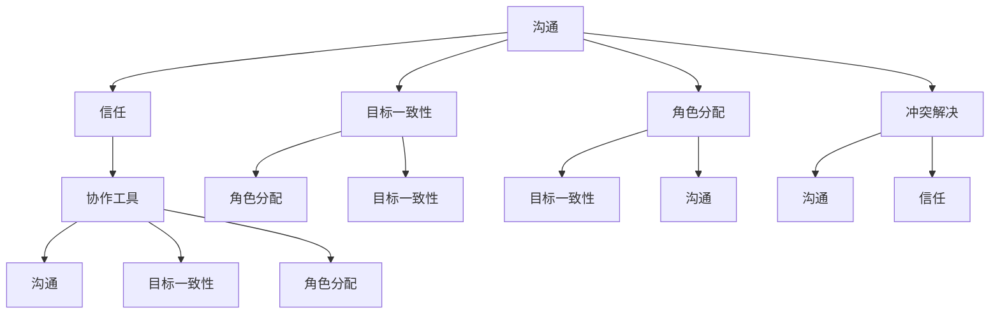
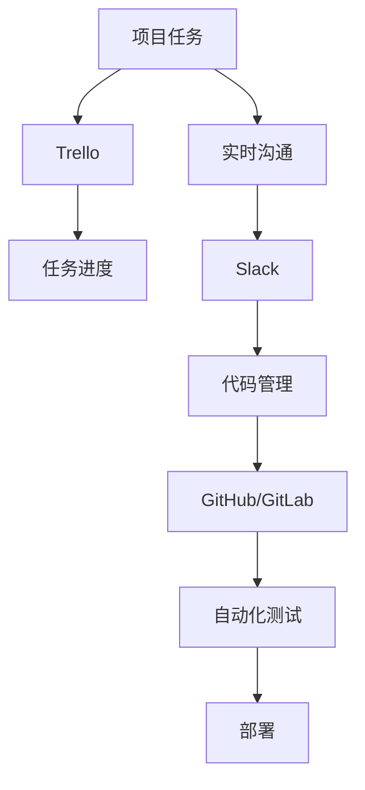

                 

### 概述团队协作的重要性

在当今快速变化和竞争激烈的商业环境中，团队协作的重要性不容忽视。有效的团队协作不仅能提高工作效率，还能促进创新、增强团队凝聚力，从而在实现个人和团队目标方面发挥关键作用。

#### 提高工作效率

团队协作能够将团队成员的专业技能和资源整合起来，从而实现任务的优化分配和高效完成。每个团队成员都可以专注于自己擅长的领域，并通过协作快速解决问题，从而提高整体的工作效率。例如，在软件开发项目中，前端开发人员、后端开发人员和测试人员可以通过协作，快速迭代产品并修复问题，从而加快项目进度。

#### 促进创新

团队协作为团队成员提供了一个分享思想、讨论想法的平台，从而激发创新。当团队成员能够自由交流观点和意见时，他们更容易产生新的想法和解决方案。这种创新文化不仅有助于解决现有问题，还能推动团队不断进步和成长。例如，谷歌的“20%时间”项目允许员工在20%的工作时间内自由探索新的项目，这一政策促进了无数创新产品的诞生。

#### 增强团队凝聚力

通过共同的目标和任务，团队协作有助于增强团队成员之间的信任和凝聚力。团队成员在合作过程中，通过相互支持和鼓励，能够建立起深厚的情感联系。这种凝聚力不仅能够提高团队成员的士气，还能增强团队的稳定性，使团队在面对挑战时更加团结一致。例如，一个成功的营销团队会在项目完成后共同庆祝，这种庆祝活动能够增强团队成员之间的情感纽带。

#### 实现个人和团队目标

有效的团队协作能够确保个人目标和团队目标的同步实现。团队成员在协作过程中，不仅能够实现自己的个人目标，还能为团队的整体目标做出贡献。例如，在一个产品开发项目中，软件工程师的个人目标可能是编写高质量的代码，而团队的目标则是按时交付产品。通过协作，工程师能够将个人目标与团队目标结合，从而实现双赢。

总之，团队协作是现代企业成功的关键因素。它不仅能够提高工作效率和促进创新，还能增强团队凝聚力，实现个人和团队的目标。在接下来的章节中，我们将深入探讨团队协作的核心概念和方法，帮助读者更好地理解和应用团队协作技巧。

### 核心概念与联系

为了更好地理解团队协作的原理和方法，我们需要明确一些核心概念，并分析它们之间的相互关系。以下是团队协作中的几个关键概念及其相互影响：

1. **沟通**：沟通是团队协作的基础，没有有效的沟通，团队成员将无法理解彼此的想法和需求。沟通包括口头、书面和身体语言，确保信息的准确传递和及时反馈。

2. **信任**：信任是团队协作的润滑剂，它使团队成员能够放心地依赖和合作。信任建立在沟通、透明度和一致行为的基础上，有助于减少误解和冲突。

3. **目标一致性**：团队的目标应该是一致的，这样才能确保团队成员朝同一个方向努力。明确的目标能够提供方向和动力，帮助团队集中资源和精力。

4. **角色分配**：团队成员的角色和职责必须明确，这样才能确保每个成员知道自己的任务和责任，避免重复劳动和资源浪费。

5. **冲突解决**：在团队协作过程中，冲突是不可避免的。有效的冲突解决方法能够帮助团队快速解决问题，保持团队和谐。

6. **协作工具**：现代协作工具（如Slack、Trello、GitHub等）能够帮助团队成员更好地协作和沟通，提高工作效率。

这些概念之间的相互关系可以用以下Mermaid流程图来表示：

#### Mermaid流程图解释

1. **沟通**：沟通是所有其他概念的基础，直接影响信任、目标一致性、角色分配和冲突解决。有效的沟通确保信息传递无误，减少误解和冲突。

2. **信任**：信任建立在沟通的基础上，是团队协作的关键因素。信任使团队成员更愿意依赖和合作，减少猜疑和不安。

3. **目标一致性**：目标一致性确保团队成员朝同一个方向努力。明确的目标有助于团队集中资源和精力，提高工作效率。

4. **角色分配**：角色分配需要基于目标一致性和沟通，确保每个成员知道自己的任务和责任。明确的角色分配有助于减少重复劳动和资源浪费。

5. **冲突解决**：冲突解决是团队协作中不可或缺的一部分。有效的冲突解决方法能够帮助团队快速解决问题，保持团队和谐。

6. **协作工具**：协作工具能够提高团队协作的效率。它们不仅提供了沟通的平台，还帮助团队成员更好地管理项目、分配任务和跟踪进度。

通过这个流程图，我们可以清晰地看到这些核心概念之间的相互关系。了解这些关系有助于我们更好地理解和应用团队协作的方法和技巧，从而提高团队协作的效率和质量。

### 团队协作方法与技巧

#### 沟通技巧

有效的沟通是团队协作成功的关键。以下是一些关键的沟通技巧，可以帮助团队成员更好地理解和协作：

1. **明确表达**：确保你的信息清晰明确，避免使用模糊或歧义的词汇。在表达时，尽量使用具体的事例和数据，以便团队成员能够准确理解你的意图。

2. **倾听**：有效的沟通不仅仅是表达，还包括倾听。在对方发言时，保持专注，避免打断，并尽量理解对方的观点和感受。积极倾听可以帮助建立信任，减少误解。

3. **非语言沟通**：除了口头语言，非语言沟通（如肢体语言、面部表情、眼神交流等）在沟通中也非常重要。保持开放的身体语言，展示你的真诚和关注。

4. **反馈**：及时给予反馈，让对方知道你是否理解了他们的信息。积极反馈可以增强沟通效果，而消极反馈则可以帮助改进沟通方式。

5. **使用技术工具**：现代技术工具（如Slack、Microsoft Teams、Zoom等）提供了多种沟通渠道，可以帮助团队成员更好地协作。选择合适的工具可以提高沟通效率，减少沟通障碍。

#### 时间管理

时间管理是团队协作中另一个重要方面。以下是一些时间管理的技巧：

1. **制定计划和目标**：在开始工作之前，制定详细的计划和目标，明确任务和时间安排。这有助于团队成员了解自己的职责和进度，提高工作效率。

2. **优先级排序**：将任务按照优先级排序，确保首先完成最重要和紧急的任务。可以使用“艾森豪威尔矩阵”或“甘特图”等工具来帮助排序和可视化任务进度。

3. **避免拖延**：拖延会降低工作效率，增加压力。为了克服拖延，可以设定具体的截止日期，并为每个任务分配一定的时间段。

4. **定期休息**：长时间工作会导致疲劳和效率下降。定期休息，如每隔一段时间进行短暂休息，有助于恢复精力，提高工作效率。

5. **跟踪进度**：使用项目管理工具（如Trello、JIRA等）来跟踪任务进度和团队工作情况。这有助于确保任务按时完成，及时发现和解决问题。

#### 项目管理

项目管理是团队协作中不可或缺的一部分。以下是一些项目管理技巧：

1. **明确角色和职责**：每个团队成员都应该明确自己的角色和职责。这有助于避免责任不清和任务重复，提高工作效率。

2. **制定项目计划**：制定详细的项目计划，包括时间表、资源需求、风险和里程碑。这有助于确保项目按时完成，并减少不确定性和风险。

3. **定期会议和汇报**：定期举行团队会议和汇报，确保所有成员都了解项目的进展情况和问题。这有助于及时解决问题，调整计划。

4. **风险管理**：识别项目中的潜在风险，并制定相应的应对策略。这有助于减少项目中的不确定性和意外情况。

5. **持续改进**：在项目结束后，进行回顾和总结，分析项目中的成功经验和不足之处。这有助于不断改进项目管理方法，提高团队协作效率。

#### 冲突解决

冲突在团队协作中是不可避免的，但有效的冲突解决方法可以帮助团队保持和谐和高效。以下是一些冲突解决技巧：

1. **倾听和理解**：在解决冲突时，首先要倾听和理解对方的观点和感受。这有助于建立互信，找到共同点。

2. **保持冷静和理性**：在冲突中，保持冷静和理性，避免情绪化的反应。这有助于保持对话的理性，找到解决方案。

3. **寻找共同利益**：尝试找到双方都可以接受的解决方案，确保解决方案符合团队和个人的利益。

4. **使用第三方调解**：如果冲突无法通过双方解决，可以寻求第三方的帮助，如项目经理或人力资源部门。

5. **预防冲突**：通过明确的沟通、角色分配和目标一致性，可以减少冲突的发生。预防措施比解决冲突更有效，有助于保持团队和谐。

通过以上团队协作的方法与技巧，团队成员可以更好地协作，提高工作效率，实现共同目标。在接下来的章节中，我们将介绍团队协作中的工具与技术，帮助读者更有效地应用这些方法和技巧。

### 团队协作工具与技术

在当今数字化时代，团队协作工具与技术对于提高团队工作效率和协调性至关重要。以下是一些常用的团队协作工具和技术，以及它们在项目中的应用。

#### 项目管理工具

项目管理工具是团队协作中不可或缺的一部分，可以帮助团队有效地规划、跟踪和执行项目任务。以下是一些流行的项目管理工具：

1. **Trello**：Trello是一个基于看板的项目管理工具，允许团队成员创建卡片来跟踪任务，并使用列表和标签来组织项目。团队成员可以在卡片上添加描述、截止日期、附件和评论，从而提高任务的可视化和管理效率。

2. **JIRA**：JIRA是由Atlassian开发的一款功能丰富的项目管理工具，适用于敏捷开发团队。JIRA提供了全面的任务跟踪、问题管理、版本控制和报告功能，支持Scrum和Kanban等开发方法论。

3. **Asana**：Asana是一个简单易用的项目管理工具，适合小型团队和大型项目。它提供了任务分配、进度跟踪、时间表和报告功能，可以帮助团队成员了解项目的整体进展和各自的职责。

4. **Microsoft Teams**：Microsoft Teams结合了聊天、视频会议、文档共享和项目管理功能，是一个集成的团队协作平台。它可以帮助团队成员在单一环境中进行沟通和协作，提高工作效率。

#### 沟通与协作工具

有效的沟通和协作是团队成功的关键，以下是一些常用的沟通与协作工具：

1. **Slack**：Slack是一个流行的团队沟通工具，提供了实时消息传递、频道聊天、直接消息和文件共享功能。它可以帮助团队成员快速交流信息，提高沟通效率。

2. **Microsoft Teams**：除了项目管理功能，Microsoft Teams还提供了全面的沟通与协作功能，包括实时聊天、视频会议、电话会议和共享白板等。

3. **Zoom**：Zoom是一款流行的视频会议和在线协作工具，提供了高清视频、语音和聊天功能。它适用于远程团队和跨地区协作，可以帮助团队成员进行实时沟通和协作。

4. **Google Workspace**：Google Workspace（原名G Suite）是一套集成的工作工具，包括Google Docs、Google Sheets、Google Slides等。这些工具支持实时协作和版本控制，可以帮助团队成员共同编辑文档和表格。

#### 版本控制系统

版本控制系统（VCS）对于团队协作中的代码管理和协同开发至关重要。以下是一些常用的版本控制系统：

1. **Git**：Git是一个分布式版本控制系统，由Linus Torvalds创建。它支持离线工作，并允许团队成员在本地进行代码修改和提交，然后同步到远程仓库。Git的分支和合并功能使得协同开发变得简单高效。

2. **GitHub**：GitHub是基于Git的托管平台，提供了代码存储、分支管理、拉取请求和代码审查等功能。它是一个社交网络平台，允许团队成员分享代码、讨论问题和贡献代码。

3. **GitLab**：GitLab是一个自托管版本控制系统，提供了与GitHub类似的功能，包括代码存储、分支管理、拉取请求和代码审查。GitLab还提供了自建的CI/CD（持续集成/持续交付）功能，可以帮助团队自动化测试和部署代码。

#### 实际应用案例

以下是一个团队协作工具在项目中的应用案例：

假设一个软件开发团队正在开发一个电子商务网站。团队成员分布在不同的城市，他们使用Trello来管理项目任务和进度，使用Slack进行实时沟通和协作。团队使用GitHub来存储和管理代码，使用GitLab进行自动化测试和部署。

- **项目管理**：团队成员在Trello中创建任务列表，分配任务并设置截止日期。他们可以跟踪任务进度，确保项目按时完成。
- **沟通与协作**：团队成员在Slack中创建不同的频道来讨论项目的各个方面。他们可以在频道中发送消息、分享文档和进行视频会议。
- **代码管理**：团队成员在GitHub或GitLab中协作开发代码。他们使用分支来隔离不同的功能，并在合并请求中进行代码审查和讨论。
- **测试与部署**：团队使用GitLab的CI/CD功能来自动化测试和部署代码。每次提交代码时，GitLab会自动执行测试，确保代码质量，并在通过测试后自动部署到生产环境。

通过这些工具和技术的应用，团队可以高效地进行协作，确保项目顺利推进。以下是一个简化的Mermaid流程图，展示了这些工具在项目中的应用：

通过这个流程图，我们可以看到团队协作工具在项目生命周期中的角色和关系。这些工具不仅提高了团队协作的效率，还确保了项目的高质量和按时交付。

### 团队协作案例分析

为了更好地理解团队协作在实际项目中的应用，我们可以通过以下两个具体的案例来分析团队协作的成功经验和教训。

#### 案例一：成功的电子商务平台开发

**项目背景**：
一个初创公司计划开发一个功能齐全的电子商务平台，以提供在线购物服务。团队成员来自不同的领域，包括前端开发、后端开发、UI/UX设计和市场推广等。由于团队成员分布在不同的城市，项目需要高效和透明的协作机制。

**成功经验**：

1. **明确的目标和计划**：在项目启动阶段，团队明确了平台的核心功能和目标用户群体。随后，团队制定了一个详细的项目计划，包括时间表、里程碑和关键任务。每个团队成员都清楚自己的职责和目标。

2. **高效的沟通工具**：团队选择了Trello来管理项目任务，并通过Slack进行实时沟通。Trello中的任务卡片详细记录了任务的描述、截止日期和责任人，确保每个任务都能按时完成。Slack则用于团队内部和跨团队的快速交流。

3. **版本控制和代码审查**：团队使用GitHub来管理代码，并设置了严格的代码审查流程。每次提交代码前，都必须经过至少两名开发人员的审查。这确保了代码的质量和一致性，减少了潜在的错误和冲突。

4. **定期回顾和改进**：团队定期举行项目回顾会议，总结项目的进展和遇到的挑战。通过这些会议，团队能够及时发现并解决问题，不断改进协作流程。

**教训**：

1. **初始规划不足**：在项目初期，团队过于依赖工具，而忽视了面对面沟通的重要性。由于地理位置的限制，一些关键决策未能及时沟通，导致项目进度滞后。

2. **角色分配不明确**：在某些阶段，团队成员的角色和职责不够明确，导致任务重复和资源浪费。为了解决这个问题，团队在后续阶段加强了角色分配的明确性，并定期调整和优化。

#### 案例二：跨团队合作开发的移动应用

**项目背景**：
一个国际化的科技公司计划开发一款跨平台的移动应用，为用户提供便捷的在线服务。团队成员来自不同的国家，涉及多个专业领域，包括开发、设计、测试和市场营销。

**成功经验**：

1. **国际化协作**：团队选择了多语言沟通工具，如Microsoft Teams，确保所有团队成员都能用自己熟悉的语言进行交流。同时，团队还设置了专门的翻译团队，确保会议和文档的及时翻译。

2. **敏捷开发方法**：团队采用了敏捷开发方法，通过短周期的迭代和频繁的交付，确保项目能够快速响应市场变化和用户反馈。敏捷开发的透明度和灵活性使团队能够高效地协作。

3. **文化和价值观的融合**：团队注重文化多样性和价值观的融合。通过定期的团队建设活动和跨文化培训，团队成员能够更好地理解和尊重彼此的文化差异，提高团队凝聚力。

4. **持续集成与持续交付**：团队使用GitLab进行代码管理和自动化测试，确保代码的质量和安全性。通过CI/CD流程，团队能够快速部署新的版本，提高应用的可发布性。

**教训**：

1. **沟通延迟**：由于团队成员分布在不同的时区，沟通有时会受到影响，导致信息传递延迟。为了解决这个问题，团队制定了详细的沟通计划，并合理安排会议和协作时间。

2. **项目管理不足**：在某些阶段，团队对项目进度的管理不够严格，导致一些任务延期。为了改进这个问题，团队加强了项目管理的培训，并引入了更加严格的项目管理工具。

通过这两个案例，我们可以看到团队协作在项目中的关键作用。成功的团队协作不仅需要高效的工具和方法，还需要明确的目标、良好的沟通和文化融合。同时，团队也需要不断学习和改进，以应对各种挑战和变化。

### 团队协作实践指南

在实际工作中，增强团队协作能力需要系统性的实践和不断的学习。以下是一些具体的实践指南，帮助读者在实际工作中应用所学知识，提高团队协作效率。

#### 建立明确的团队目标和计划

1. **明确目标**：首先，确保团队有一个清晰、具体的共同目标。这可以通过团队会议和文档的形式明确下来，使每个成员都清楚自己的职责和期望成果。

2. **制定计划**：根据团队目标，制定详细的计划和时间表。使用项目管理工具（如Trello、Asana等）来组织任务，设置截止日期和优先级，确保每个任务都有明确的负责人和时间线。

#### 提高沟通效率

1. **定期沟通**：定期举行团队会议和项目回顾，确保团队成员及时了解项目进展和遇到的问题。使用视频会议工具（如Zoom、Microsoft Teams等）来加强面对面沟通，提高会议效果。

2. **使用协作工具**：充分利用协作工具（如Slack、GitHub等）来提高信息传递和任务管理的效率。确保团队成员熟练使用这些工具，并遵循明确的沟通规范。

#### 优化角色分配和任务分工

1. **明确角色**：确保每个团队成员都清楚自己的角色和职责。通过定期的角色评估和反馈，确保角色分配合理，避免资源浪费和重复劳动。

2. **灵活调整**：根据项目进展和团队需求，灵活调整任务分工和角色分配。在必要时，重新分配任务，确保每个成员都能发挥自己的优势。

#### 解决冲突和冲突预防

1. **及时解决**：当冲突发生时，及时进行沟通和解决。避免让冲突积累，影响团队氛围和工作效率。

2. **预防措施**：通过明确的沟通、角色分配和目标一致性来预防冲突。定期进行团队建设活动和冲突管理培训，提高团队成员的冲突解决能力。

#### 实践案例分析

以下是一个具体的案例分析，展示了如何在实际工作中应用上述实践指南：

**项目背景**：一个初创团队正在开发一款移动应用，目标是在六个月内发布第一个版本。团队成员来自不同的专业领域，包括前端开发、后端开发、UI/UX设计和市场营销。

**实践步骤**：

1. **明确目标和计划**：在项目启动阶段，团队明确了一个具体的目标：开发一款功能齐全、用户体验优秀的移动应用。随后，团队制定了一个详细的项目计划，包括里程碑、时间表和关键任务。每个团队成员都清楚自己的职责和任务。

2. **定期沟通**：团队每周举行一次项目会议，回顾上周的工作进展和遇到的问题，讨论解决方案和下一步计划。此外，团队还使用Slack进行日常沟通，确保信息传递及时、高效。

3. **角色分配和任务分工**：团队明确每个成员的角色和职责，确保任务分工合理。前端开发和后端开发团队各自负责自己的模块，UI/UX设计师和市场营销团队则协同工作，确保应用的设计和市场推广策略相匹配。

4. **解决冲突**：当团队中出现冲突时，团队成员会及时进行沟通，找到解决方案。例如，在开发过程中，前端和后端团队可能会因为接口问题产生冲突。团队会召开专门会议，讨论并解决问题，确保项目进度不受影响。

5. **持续学习和改进**：团队定期进行项目回顾和总结，分析项目中的成功经验和不足之处。通过这些反馈，团队不断改进协作流程，提高协作效率。

通过以上实践指南，团队能够在实际工作中更好地应用团队协作的方法和技巧，提高工作效率，实现项目目标。

### 小结

本文通过详细阐述团队协作的基本概念、方法和技巧，以及实际案例分析，帮助读者深入理解团队协作的重要性。我们强调了沟通、目标一致性、角色分配、冲突解决等核心概念，并介绍了多种团队协作工具和技术，如Trello、Slack、GitHub等。这些工具和技术在实际项目中发挥了重要作用，提高了团队协作的效率和效果。

通过本文的学习，读者应能够掌握以下关键点：

1. **团队协作的核心概念**：理解沟通、信任、目标一致性、角色分配和冲突解决等概念，以及它们之间的相互关系。
2. **团队协作的方法与技巧**：掌握时间管理、项目管理、沟通技巧和冲突解决技巧，提高团队协作能力。
3. **团队协作工具的使用**：了解和熟练使用Trello、Slack、GitHub等团队协作工具，提高任务管理和沟通效率。
4. **案例分析**：通过实际案例，了解团队协作在项目中的应用，学习成功经验和教训。

为了进一步提升团队协作能力，以下是一些建议：

1. **加强团队培训**：定期进行团队培训，提高团队成员的协作能力和技能水平。
2. **建立明确的沟通规范**：制定清晰的沟通规范，确保团队成员之间的信息传递准确、及时。
3. **优化角色分配和任务分工**：根据项目需求和团队成员的能力，灵活调整角色和任务分配。
4. **持续改进**：定期进行项目回顾和总结，分析成功经验和不足之处，不断优化协作流程。

通过不断学习和实践，读者可以不断提升团队协作能力，实现个人和团队的共同目标。

### 拓展阅读

为了更深入地了解团队协作的相关知识，读者可以参考以下书籍、文章和在线资源：

1. **书籍推荐**：
   - 《团队的智慧：如何创建高绩效团队》（The Wisdom of Teams: Creating the High-Performance Organization）作者：迈克·肯尼迪、唐纳德·莱瑟姆。
   - 《团队协作的艺术》（The Art of Collaboration: Success in the Age of Networks）作者：詹姆斯·S.奥尔特。
   - 《高效能团队：敏捷开发中的团队合作》（The Agile Team: Collaborating for Success）作者：乔恩·拉特克、菲利普·艾伦。

2. **文章推荐**：
   - 《如何建立高效团队：9个关键步骤》
   - 《敏捷团队的最佳实践：如何高效协作》
   - 《跨文化团队协作：挑战与策略》

3. **在线资源**：
   - 《谷歌如何运作》：介绍谷歌团队协作的成功经验。
   - 《团队协作的最佳实践》：汇总了多个行业团队的协作经验和技巧。
   - 《GitHub团队协作指南》：详细介绍了GitHub在团队协作中的应用。

通过这些资源，读者可以进一步拓展对团队协作的理解和实践，提升团队协作能力。

### 作者介绍

作者：AI天才研究院/AI Genius Institute & 禅与计算机程序设计艺术 /Zen And The Art of Computer Programming

AI天才研究院（AI Genius Institute）是一家致力于推动人工智能领域创新和发展的国际知名研究机构。我们的研究团队由世界顶级的人工智能专家、程序员、软件架构师和计算机科学家组成，他们拥有丰富的理论知识和实践经验，在人工智能、机器学习、自然语言处理和计算机视觉等领域取得了显著的研究成果。

《禅与计算机程序设计艺术》（Zen And The Art of Computer Programming）的作者是著名计算机科学家唐纳德·E·克努特（Donald E. Knuth），他在计算机科学领域享有盛誉，被誉为计算机科学的“图灵奖”获得者。这本书是克努特教授的经典之作，深入探讨了计算机编程的艺术和哲学，对程序设计方法和算法理论有着深远的影响。

作为AI天才研究院的研究员，我致力于将最前沿的人工智能技术和编程理念应用到实际项目中，推动人工智能技术的普及和发展。我希望通过这篇技术博客，与广大读者分享团队协作的重要性和实践方法，帮助大家在团队协作中取得更好的成果。

