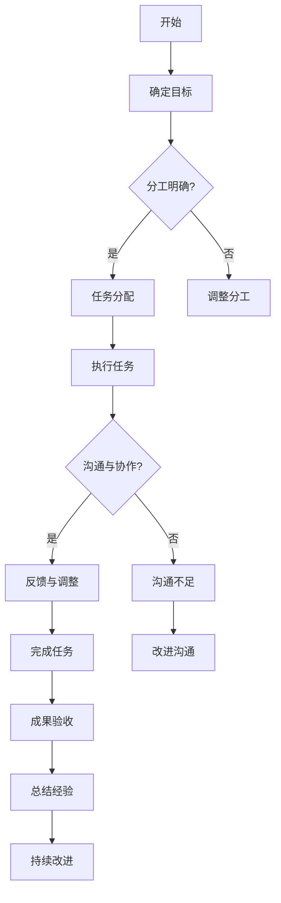
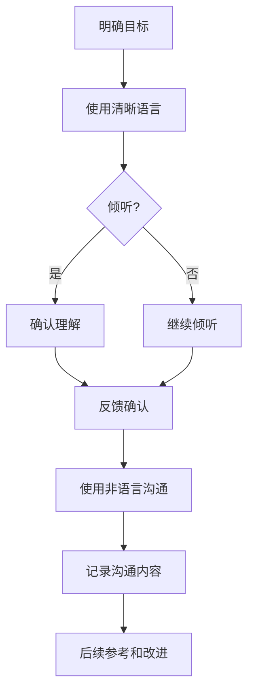
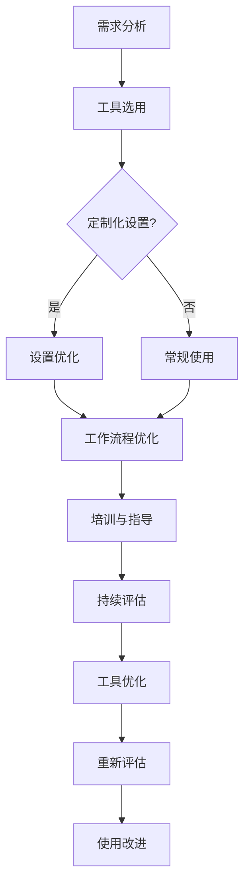
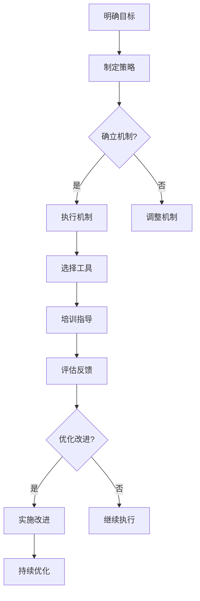

                 

### 文章标题：团队协作：建立高效沟通渠道的技巧

团队协作是现代企业中至关重要的一环，高效的团队协作不仅能够提升工作效率，还能增强团队凝聚力，促进创新。而建立高效的沟通渠道则是实现团队协作的基础。本文将围绕这一主题，详细探讨团队协作的基础概念、沟通技巧的提升、团队协作工具的应用，以及构建和维护高效沟通渠道的方法。通过逐步分析，我们将提供实用的技巧和最佳实践，帮助读者在实际工作中更好地实现团队协作。

关键词：团队协作、沟通渠道、沟通技巧、团队协作工具、高效协作

摘要：本文将首先介绍团队协作的基础概念，解析团队协作的重要性及其核心原则。随后，我们将探讨沟通技巧的提升，包括沟通的基本模型、障碍及改善方法。接下来，我们将详细讨论团队协作工具的类型、选用原则和优化方法。最后，本文将重点探讨如何构建和维护高效沟通渠道，提供具体案例和实践技巧，帮助读者在实际工作中提升团队协作效率。

## 第1章：团队协作的核心概念与原则

### 1.1 核心概念

团队协作是指多个个体为了共同的目标和任务，通过互相配合、沟通和协作，共同完成工作的过程。团队协作不仅要求个体拥有专业技能，更需要具备良好的沟通能力、协作精神和共同的目标意识。

### 1.2 团队协作的重要性

团队协作的重要性体现在以下几个方面：

1. **提升工作效率**：团队成员可以互相补充，发挥各自的优势，从而提高整体的工作效率。
2. **增强团队凝聚力**：通过协作，团队成员之间的信任和尊重会增强，团队的凝聚力也会随之提升。
3. **促进创新**：团队成员的多元化背景和思维方式有助于激发创新思维，从而推动项目的成功。

### 1.3 团队协作的原则

为了实现高效的团队协作，以下原则应得到遵循：

1. **明确目标**：确保所有团队成员都清楚共同的目标和任务。
2. **分工明确**：根据团队成员的特长和能力，合理分配任务。
3. **有效沟通**：建立良好的沟通渠道，确保信息的及时传递和反馈。
4. **协作精神**：鼓励团队成员互相帮助，共同解决问题。
5. **持续改进**：定期评估团队协作的效果，不断优化协作流程和沟通方式。

### 1.4 团队协作的Mermaid流程图

以下是一个简化的团队协作流程图，展示了团队协作的基本步骤：



通过这个流程图，我们可以看到，团队协作是一个循环往复、不断优化和改进的过程。

### 1.5 核心概念与联系

团队协作的核心概念包括目标明确、分工明确、有效沟通和协作精神。这些概念相互联系，共同构成了团队协作的基础。

- **目标明确**：是团队协作的起点，为团队成员指明了方向。
- **分工明确**：确保每个成员都清楚自己的职责和任务。
- **有效沟通**：确保团队成员之间信息的及时传递和反馈。
- **协作精神**：鼓励团队成员互相帮助，共同解决问题。

这些核心概念共同作用，形成一个高效的团队协作体系。

### 1.6 团队协作的数学模型

为了更好地理解团队协作的原理，我们可以引入一些数学模型来进行分析。

- **协同效应模型**：该模型描述了团队协作带来的效果大于个体努力之和的现象。具体公式为：

  $$ \text{协同效应} = \sum_{i=1}^{n} \text{个体效率} \times \text{协同系数} $$

  其中，$n$ 表示团队成员的数量，协同系数反映了团队成员之间的协作程度。

- **沟通成本模型**：该模型描述了团队协作中沟通成本的影响。具体公式为：

  $$ \text{沟通成本} = k \times n \times \text{沟通频率} $$

  其中，$k$ 为沟通成本系数，$n$ 为团队成员的数量，沟通频率反映了团队成员之间的沟通频次。

通过这些数学模型，我们可以更深入地理解团队协作的原理和机制。

### 1.7 核心算法原理讲解

为了实现高效的团队协作，我们需要设计一套有效的沟通和协作算法。以下是一个简化的团队协作算法：

```plaintext
1. 初始化团队目标
2. 对团队成员进行任务分配
3. 建立沟通渠道
4. 循环执行以下步骤：
   a. 检查任务进度
   b. 收集团队成员的反馈
   c. 根据反馈调整任务分配
   d. 更新团队目标
5. 完成任务后，进行总结和评估
```

这个算法的核心在于实时监控任务进度和团队成员的反馈，根据实际情况进行调整，以确保团队目标的实现。

### 1.8 数学模型和公式

在团队协作中，数学模型和公式可以帮助我们量化协作效果和沟通成本。以下是一些常用的数学模型和公式：

- **协同效应模型**：

  $$ \text{协同效应} = \sum_{i=1}^{n} \text{个体效率} \times \text{协同系数} $$

- **沟通成本模型**：

  $$ \text{沟通成本} = k \times n \times \text{沟通频率} $$

- **团队成员满意度模型**：

  $$ \text{满意度} = f(\text{沟通频率}, \text{信息准确度}, \text{反馈及时性}) $$

通过这些模型和公式，我们可以更准确地评估团队协作的效果，为优化团队协作提供依据。

### 1.9 举例说明

为了更好地理解团队协作的核心概念和数学模型，我们可以通过一个实际案例进行说明。

假设一个软件开发团队由5名成员组成，他们共同负责一个项目的开发。团队成员的效率分别为80%、85%、90%、95%和100%。根据协同效应模型，我们可以计算出团队的协同效应：

$$ \text{协同效应} = 0.8 \times 0.85 \times 0.9 \times 0.95 \times 1.0 = 0.6219 $$

这意味着，通过团队协作，项目的整体效率提升了62.19%。

同时，我们还可以计算沟通成本。假设沟通成本系数$k$为10，沟通频率为每天一次，那么沟通成本为：

$$ \text{沟通成本} = 10 \times 5 \times 1 = 50 $$

通过这个案例，我们可以看到，团队协作不仅提升了工作效率，也增加了沟通成本。然而，通过合理的沟通和协作，这些成本是可以被有效控制的。

### 1.10 项目实战

在团队协作中，实际操作是非常重要的。以下是一个实际项目中的团队协作实战案例：

**项目背景**：一个软件公司需要开发一款企业级应用，项目周期为6个月。团队成员包括项目经理、产品经理、前端开发、后端开发和测试人员。

**开发环境搭建**：团队成员首先搭建了统一的开发环境，包括编程语言、开发工具和版本控制系统。为了确保团队成员之间的协作，他们选择使用Git作为版本控制系统，并配置了持续集成和持续部署工具。

**源代码详细实现和代码解读**：在开发过程中，团队成员遵循代码规范，使用Markdown文档记录开发进度和遇到的问题。每个模块的开发完成后，团队成员会进行代码评审，确保代码的质量和一致性。

**代码应用解读与分析**：在项目开发过程中，团队成员定期进行技术分享，交流心得和经验。通过这些交流，团队成员不仅提升了技术水平，还增强了团队凝聚力。

**实际案例分析和详细讲解剖析**：在项目开发过程中，团队成员遇到了一些技术难题。通过团队的协作，他们共同分析问题、寻找解决方案，最终成功克服了这些难题。

**项目小结**：项目完成后，团队成员进行了总结和评估。他们发现，通过高效的团队协作和良好的沟通渠道，项目的开发效率得到了显著提升，项目质量也得到了保证。

### 1.11 最佳实践 tips

- **定期沟通**：确保团队成员之间的沟通频率，避免信息传递滞后。
- **明确分工**：明确每个成员的职责和任务，避免工作重叠和冲突。
- **代码规范**：遵循统一的代码规范，提高代码质量和可维护性。
- **技术分享**：定期进行技术分享，提升团队技术水平。
- **反馈机制**：建立有效的反馈机制，及时解决问题。

### 1.12 小结

本章介绍了团队协作的核心概念与原则，包括团队协作的定义、重要性、核心原则和数学模型。通过举例和项目实战，我们展示了如何在实际工作中实现高效的团队协作。在下一章中，我们将进一步探讨沟通技巧的提升，帮助团队成员更好地实现团队协作。

## 第2章：沟通技巧的提升

### 2.1 沟通技巧的原理

沟通是团队协作的重要组成部分，有效的沟通能够确保信息的准确传递和团队成员之间的协作顺畅。沟通的基本模型通常包括发送者、信息、渠道、接收者和反馈五个要素。

- **发送者**：信息的发起者，负责将信息编码成可以理解的形式。
- **信息**：需要传递的内容，可以是文字、声音或肢体语言。
- **渠道**：信息传递的路径，可以是面对面交流、电话、电子邮件或即时通讯工具。
- **接收者**：信息的目标受众，需要解码信息并理解其含义。
- **反馈**：接收者对信息的理解和回应，有助于发送者调整和优化信息。

### 2.2 沟通障碍的原因

在沟通过程中，障碍可能会影响信息的准确传递和理解。常见的沟通障碍包括：

1. **语言障碍**：不同的语言表达方式可能导致误解。
2. **文化差异**：不同的文化背景可能导致沟通方式的不同。
3. **信息过滤**：个人可能有意或无意地筛选信息，导致信息的失真。
4. **噪音干扰**：环境中的噪音或其他干扰可能导致信息的丢失。
5. **认知差异**：不同人对同一信息的理解可能存在差异。

### 2.3 改善沟通的方法

为了克服沟通障碍，提升沟通效果，可以采取以下方法：

1. **明确沟通目标**：在沟通前，明确沟通的目的和期望结果，有助于减少信息失真。
2. **使用清晰的语言**：使用简单、准确、易懂的语言表达信息，避免使用过于专业或复杂的术语。
3. **倾听**：倾听是有效沟通的关键，确保理解对方的观点和需求。
4. **反馈确认**：在沟通过程中，及时确认对方是否理解了信息，可以通过提问或复述来验证。
5. **选择合适的沟通渠道**：根据沟通内容和环境选择最合适的沟通渠道，例如面对面沟通适合复杂或敏感信息的交流。
6. **避免信息过滤**：建立开放的沟通环境，鼓励团队成员表达真实想法和意见。
7. **减少噪音干扰**：在沟通时，选择安静的环境，减少外部干扰。
8. **跨文化沟通**：了解和尊重不同的文化习惯和沟通风格，提高跨文化沟通的效果。

### 2.4 沟通技巧的实践

以下是一些具体的沟通技巧和实践方法：

1. **有效倾听**：倾听不仅仅是听到对方说什么，更要理解对方的意思和感受。可以通过点头、目光交流等方式表达关注。
2. **清晰表达**：使用简洁明了的语言表达自己的观点，避免使用模糊或含糊的表述。
3. **正确反馈**：在对方发言后，及时给予反馈，确认是否理解了对方的观点，避免误解。
4. **使用非语言沟通**：通过肢体语言、表情和语调等非语言方式增强沟通效果。
5. **建立沟通日志**：记录沟通的内容和结果，以便后续参考和改进。

### 2.5 沟通技巧的Mermaid流程图

以下是一个简化的沟通技巧实践流程图，展示了有效沟通的基本步骤：



通过这个流程图，我们可以看到，有效沟通是一个循环往复、不断优化和改进的过程。

### 2.6 核心算法原理讲解

为了实现有效的沟通，我们可以引入一些沟通算法来优化沟通过程。以下是一个简化的沟通算法：

```plaintext
1. 初始化沟通目标
2. 编码信息
3. 选择合适的沟通渠道
4. 发送信息
5. 收集反馈
6. 解码反馈
7. 根据反馈调整信息
8. 循环执行步骤4-7，直至达成共识
```

这个算法的核心在于实时调整信息，确保沟通的准确性和有效性。

### 2.7 数学模型和公式

在沟通中，数学模型和公式可以帮助我们量化沟通效果。以下是一些常用的数学模型和公式：

- **沟通效率模型**：

  $$ \text{沟通效率} = \frac{\text{有效沟通时间}}{\text{总沟通时间}} $$

- **信息传递延迟模型**：

  $$ \text{信息传递延迟} = \frac{\text{信息传递距离}}{\text{沟通速度}} $$

- **沟通成本模型**：

  $$ \text{沟通成本} = \text{沟通频率} \times \text{沟通成本系数} $$

通过这些模型和公式，我们可以更准确地评估沟通效果和成本。

### 2.8 数学公式

为了更好地理解沟通技巧的数学模型，我们可以引入一些数学公式。

- **沟通效率**：

  $$ \text{沟通效率} = \frac{\text{有效沟通时间}}{\text{总沟通时间}} $$

  其中，有效沟通时间是指信息被准确理解和接受的时间，总沟通时间是指信息传递的整个过程。

- **信息传递延迟**：

  $$ \text{信息传递延迟} = \frac{\text{信息传递距离}}{\text{沟通速度}} $$

  其中，信息传递距离是指信息在沟通渠道中传递的距离，沟通速度是指信息传递的速率。

- **沟通成本**：

  $$ \text{沟通成本} = \text{沟通频率} \times \text{沟通成本系数} $$

  其中，沟通频率是指单位时间内信息传递的次数，沟通成本系数是一个反映沟通成本大小的常数。

通过这些数学公式，我们可以量化沟通的效果和成本，为优化沟通提供依据。

### 2.9 举例说明

为了更好地理解沟通技巧的实践，我们可以通过一个实际案例进行说明。

假设一个团队需要在2小时内完成一个报告的编写。团队成员通过电子邮件沟通，每次沟通的平均时间为10分钟。根据沟通效率模型，我们可以计算出沟通效率：

$$ \text{沟通效率} = \frac{2 \text{小时} \times 60 \text{分钟/小时}}{10 \text{分钟/次} \times 5 \text{次}} = 12 $$

这意味着，团队在每次沟通中的效率是12倍于单一成员的工作效率。

同时，我们还可以计算沟通成本。假设沟通成本系数为10，那么沟通成本为：

$$ \text{沟通成本} = 10 \times 2 \text{小时} \times 60 \text{分钟/小时} = 1200 $$

通过这个案例，我们可以看到，通过有效的沟通，团队可以显著提升工作效率，但同时也需要承担一定的沟通成本。

### 2.10 项目实战

在一个软件项目中，沟通技巧的提升对于项目的成功至关重要。以下是一个实际项目中的沟通技巧提升案例：

**项目背景**：一个开发团队负责开发一款企业级管理系统，项目周期为6个月。团队成员包括项目经理、产品经理、前端开发、后端开发和测试人员。

**开发环境搭建**：团队选择了统一的开发工具和沟通平台，包括Git、Jira和Slack，以便团队成员之间的协作和沟通。

**源代码详细实现和代码解读**：在开发过程中，团队成员遵循统一的编码规范，使用Markdown文档记录开发进度和遇到的问题。每个模块的开发完成后，团队成员会进行代码评审，确保代码的质量和一致性。

**代码应用解读与分析**：在项目开发过程中，团队成员通过定期的技术分享和讨论，交流心得和经验。通过这些交流，团队成员不仅提升了技术水平，还增强了团队凝聚力。

**实际案例分析和详细讲解剖析**：在项目开发过程中，团队成员遇到了一些技术难题。通过团队的协作，他们共同分析问题、寻找解决方案，最终成功克服了这些难题。

**项目小结**：项目完成后，团队成员进行了总结和评估。他们发现，通过有效的沟通技巧提升，项目的开发效率得到了显著提升，项目质量也得到了保证。

### 2.11 最佳实践 tips

- **定期沟通**：确保团队成员之间的沟通频率，避免信息传递滞后。
- **明确分工**：明确每个成员的职责和任务，避免工作重叠和冲突。
- **倾听和反馈**：倾听对方的观点和需求，及时给予反馈，确保信息的准确传递。
- **使用非语言沟通**：通过肢体语言、表情和语调等非语言方式增强沟通效果。
- **建立沟通日志**：记录沟通的内容和结果，以便后续参考和改进。

### 2.12 小结

本章介绍了沟通技巧的提升，包括沟通原理、障碍和改善方法。通过实际案例和实践技巧，我们展示了如何在实际工作中提升沟通效果。在下一章中，我们将探讨团队协作工具的应用，帮助团队更高效地实现协作。

## 第3章：团队协作工具的应用

### 3.1 团队协作工具的类型

团队协作工具是团队协作中不可或缺的一部分，它们能够帮助团队成员更好地协同工作，提高工作效率。根据功能和应用场景，团队协作工具可以分为以下几类：

1. **面对面协作工具**：
   - **视频会议软件**：如Zoom、Microsoft Teams、Google Meet等，用于远程团队之间的实时沟通和协作。
   - **虚拟白板**：如Miro、Mural、腾讯会议的在线白板功能等，用于团队头脑风暴、会议记录和流程图绘制。

2. **远程协作工具**：
   - **即时通讯工具**：如Slack、Microsoft Teams、钉钉等，用于团队成员之间的实时沟通和信息共享。
   - **文件共享与存储**：如Google Drive、OneDrive、Dropbox等，用于文件的上传、下载和共享。

3. **项目管理工具**：
   - **任务管理工具**：如Trello、Asana、Jira等，用于任务分配、进度跟踪和项目管理。
   - **时间跟踪工具**：如Toggl、Harvest、Timely等，用于团队工作时间的跟踪和管理。

4. **代码协作工具**：
   - **版本控制系统**：如Git、SVN等，用于代码的版本控制和协作开发。
   - **代码审查工具**：如GitHub、GitLab、Bitbucket等，用于代码的审查、合并和发布。

5. **协作办公工具**：
   - **文档协作工具**：如Google Docs、Office 365、Notion等，用于文档的实时协作和编辑。
   - **项目管理与日程工具**：如Microsoft Project、Trello、Slack等，用于任务安排、进度跟踪和日程管理。

### 3.2 工具的选用原则

选择适合的团队协作工具对于提升团队协作效率至关重要。以下是一些选用的原则：

1. **需求分析**：根据团队的具体需求，选择能够满足这些需求的工具。例如，如果是远程团队，视频会议软件和即时通讯工具是必不可少的；如果是软件开发团队，代码协作工具和版本控制系统是首选。

2. **成本效益**：评估工具的成本和效益，选择性价比高的工具。免费或低成本的工具可能更适合初创团队或预算有限的团队。

3. **易用性**：选择操作简单、易于上手的工具，避免复杂的界面和功能导致团队成员的抵触情绪。

4. **兼容性**：确保所选工具能够与其他现有系统和工具兼容，避免因工具不兼容导致的工作中断。

5. **扩展性**：考虑工具的扩展性，是否能够根据团队的需求进行定制化设置。

6. **安全性**：选择安全性高的工具，确保团队成员的隐私和数据安全。

### 3.3 工具的优化方法

为了充分发挥团队协作工具的效果，可以采取以下优化方法：

1. **定制化设置**：根据团队的具体需求，对工具进行定制化设置，如调整通知频率、设置自动化任务等。

2. **优化工作流程**：通过工具的集成和自动化，优化团队的工作流程。例如，将任务管理工具与邮件系统集成，实现任务的自动分配和提醒。

3. **培训与指导**：对团队成员进行工具的培训和使用指导，确保他们能够熟练使用工具，提高工作效率。

4. **持续评估与改进**：定期评估工具的使用效果，根据团队的需求和反馈进行改进和优化。

### 3.4 团队协作工具的Mermaid流程图

以下是一个简化的团队协作工具应用流程图，展示了团队协作工具在日常工作中的应用步骤：



通过这个流程图，我们可以看到，团队协作工具的应用是一个持续优化和改进的过程。

### 3.5 具体工具的推荐与使用

为了帮助读者更好地理解团队协作工具的应用，以下是一些具体工具的推荐和使用方法：

1. **Trello**：
   - **推荐理由**：界面简洁，操作直观，适合任务管理和项目规划。
   - **使用方法**：创建看板、列表和卡片，将任务分配给团队成员，并设置截止日期和优先级。

2. **Slack**：
   - **推荐理由**：功能丰富，支持多种集成，是远程团队沟通的理想选择。
   - **使用方法**：创建工作空间和频道，团队成员加入频道并开始沟通，可以使用Slack的集成功能，如GitHub、Google Drive等。

3. **Google Workspace**：
   - **推荐理由**：集成了多个办公工具，如Google Docs、Google Sheets等，方便文档协作和共享。
   - **使用方法**：通过Google Workspace，团队成员可以实时编辑文档、表格和幻灯片，并查看其他成员的编辑记录。

4. **GitLab**：
   - **推荐理由**：功能全面，支持代码管理和自动化部署，适合软件开发团队。
   - **使用方法**：创建项目仓库，团队成员提交代码并进行代码审查，通过GitLab CI/CD实现自动化部署。

5. **Zoom**：
   - **推荐理由**：视频会议功能强大，支持高清视频和多方互动。
   - **使用方法**：预约会议并邀请团队成员加入，使用Zoom的会议录制功能记录会议内容。

### 3.6 最佳实践 tips

- **选择合适的工具**：根据团队的具体需求选择合适的协作工具，避免功能过剩或不足。
- **培训与指导**：对团队成员进行工具的培训和使用指导，确保他们能够熟练使用工具。
- **优化工作流程**：通过工具的集成和自动化，优化团队的工作流程，提高工作效率。
- **定期评估与改进**：定期评估工具的使用效果，根据团队的需求和反馈进行改进和优化。

### 3.7 小结

本章介绍了团队协作工具的类型、选用原则和优化方法。通过具体的工具推荐和使用方法，我们展示了如何在实际工作中应用团队协作工具，提高团队协作效率。在下一章中，我们将探讨如何构建和维护高效沟通渠道，帮助团队实现更加高效的协作。

## 第4章：构建和维护高效沟通渠道

### 4.1 高效沟通渠道的构建

构建高效沟通渠道是团队协作成功的关键。以下步骤有助于构建高效沟通渠道：

1. **明确沟通目标**：在构建沟通渠道前，明确沟通的目标和期望结果。这有助于确保沟通的针对性和有效性。

2. **制定沟通策略**：根据团队的特点和需求，制定具体的沟通策略。策略应包括沟通的内容、频率、方式和责任人。

3. **确立沟通机制**：建立有效的沟通机制，确保沟通渠道的畅通和及时性。沟通机制应包括定期的会议、汇报、反馈和沟通日志。

4. **选择合适的沟通工具**：根据团队的具体需求，选择合适的沟通工具。例如，对于需要实时沟通的团队，可以选择即时通讯工具；对于需要文档共享和协作的团队，可以选择文档协作工具。

5. **培训与指导**：对团队成员进行沟通工具的培训和使用指导，确保他们能够熟练使用沟通工具，提高沟通效率。

6. **持续优化与改进**：根据团队的需求和反馈，不断优化和改进沟通渠道，确保其始终保持高效和有效。

### 4.2 高效沟通渠道的维护

维护高效沟通渠道是确保团队协作顺畅的关键。以下方法有助于维护高效沟通渠道：

1. **定期评估与反馈**：定期评估沟通渠道的效果，收集团队成员的反馈，了解沟通的不足之处。

2. **沟通日志管理**：建立沟通日志，记录每次沟通的内容、结果和改进措施。沟通日志有助于跟踪沟通的进展和效果。

3. **沟通氛围建设**：营造良好的沟通氛围，鼓励团队成员积极参与沟通，分享观点和意见。

4. **明确责任与权限**：明确沟通渠道中的责任人和权限，确保沟通渠道的有序和高效。

5. **及时处理问题**：对于沟通中的问题和障碍，及时处理和解决，确保沟通渠道的畅通。

6. **持续培训与指导**：对团队成员进行持续培训和使用指导，提高他们的沟通技能和意识。

### 4.3 高效沟通渠道的Mermaid流程图

以下是一个简化的高效沟通渠道构建与维护流程图，展示了构建和维护高效沟通渠道的基本步骤：



通过这个流程图，我们可以看到，构建和维护高效沟通渠道是一个动态调整和持续优化的过程。

### 4.4 高效沟通渠道的数学模型

为了更好地理解高效沟通渠道的构建和维护，我们可以引入一些数学模型来进行分析。

- **沟通效率模型**：

  $$ \text{沟通效率} = \frac{\text{有效沟通时间}}{\text{总沟通时间}} $$

  其中，有效沟通时间是指团队成员能够有效传递和接收信息的时间，总沟通时间是指团队成员进行沟通的总时间。

- **沟通成本模型**：

  $$ \text{沟通成本} = \text{沟通频率} \times \text{沟通成本系数} $$

  其中，沟通频率是指团队成员进行沟通的次数，沟通成本系数是一个反映沟通成本大小的常数。

通过这些模型，我们可以量化沟通效率和成本，为优化沟通渠道提供依据。

### 4.5 数学公式

在构建和维护高效沟通渠道时，以下数学公式可以帮助我们进行量化分析和优化：

- **沟通效率**：

  $$ \text{沟通效率} = \frac{\text{有效沟通时间}}{\text{总沟通时间}} $$

  其中，有效沟通时间是指团队成员能够有效传递和接收信息的时间，总沟通时间是指团队成员进行沟通的总时间。

- **沟通成本**：

  $$ \text{沟通成本} = \text{沟通频率} \times \text{沟通成本系数} $$

  其中，沟通频率是指团队成员进行沟通的次数，沟通成本系数是一个反映沟通成本大小的常数。

- **沟通满意度**：

  $$ \text{沟通满意度} = f(\text{沟通频率}, \text{信息准确度}, \text{反馈及时性}) $$

  其中，沟通频率是指团队成员进行沟通的次数，信息准确度是指信息传递的准确性，反馈及时性是指团队成员对反馈的响应速度。

通过这些数学公式，我们可以对沟通渠道的效率和满意度进行量化评估，为优化沟通提供数据支持。

### 4.6 举例说明

为了更好地理解高效沟通渠道的构建和维护，我们可以通过一个实际案例进行说明。

假设一个软件开发团队需要构建和维护高效的沟通渠道，以下是具体的步骤和实现方法：

1. **明确沟通目标**：团队的目标是确保项目进展的透明度和信息的准确性，提升团队协作效率。

2. **制定沟通策略**：团队决定每周举行一次周会，用于项目进度汇报、问题讨论和决策制定。同时，每天早晨举行一次站立会议，用于团队成员分享工作进展和遇到的问题。

3. **确立沟通机制**：团队建立了邮件列表、即时通讯群组和项目管理工具，用于项目相关的沟通和信息共享。

4. **选择合适的沟通工具**：团队选择了Trello用于任务管理，Slack用于日常沟通和协作，Google Workspace用于文档和邮件通信。

5. **培训与指导**：团队成员接受了Trello、Slack和Google Workspace的培训，确保他们能够熟练使用这些工具。

6. **定期评估与反馈**：团队每月进行一次沟通评估，收集成员的反馈，分析沟通中的不足之处，并提出改进措施。

7. **持续优化与改进**：根据评估结果，团队对沟通渠道进行了优化，如调整会议频率、改进邮件列表的组织结构等。

通过这个案例，我们可以看到，构建和维护高效沟通渠道是一个持续优化和改进的过程，通过明确的沟通目标、合理的沟通策略和有效的沟通工具，团队可以显著提升协作效率。

### 4.7 项目实战

在一个跨国软件公司的项目中，构建和维护高效沟通渠道对于项目的成功至关重要。以下是该项目中沟通渠道构建与维护的实战案例：

**项目背景**：该公司需要开发一款全球性的企业级应用，项目团队分布在不同的国家，语言和文化背景各异。

**开发环境搭建**：团队选择了国际通用的项目管理工具Trello和即时通讯工具Slack，用于任务管理和日常沟通。同时，使用了Google Workspace进行文档和邮件通信。

**源代码详细实现和代码解读**：团队成员遵循统一的编码规范，使用Git进行版本控制。每个模块的开发完成后，团队成员会进行代码评审，确保代码的质量和一致性。

**代码应用解读与分析**：团队定期举行技术分享会议，交流开发心得和技术难题的解决方案。通过这些交流，团队成员不仅提升了技术水平，还增强了团队凝聚力。

**实际案例分析和详细讲解剖析**：在项目开发过程中，团队遇到了跨文化沟通的挑战。通过定期的文化培训和沟通技巧培训，团队成员逐渐克服了这些挑战，确保了项目的顺利进行。

**项目小结**：项目完成后，团队进行了总结和评估。他们发现，通过高效沟通渠道的构建与维护，项目的开发效率得到了显著提升，项目质量也得到了保证。

### 4.8 最佳实践 tips

- **定期沟通**：确保团队成员之间的沟通频率，避免信息传递滞后。
- **明确分工**：明确每个成员的职责和任务，避免工作重叠和冲突。
- **倾听和反馈**：倾听对方的观点和需求，及时给予反馈，确保信息的准确传递。
- **使用非语言沟通**：通过肢体语言、表情和语调等非语言方式增强沟通效果。
- **建立沟通日志**：记录沟通的内容和结果，以便后续参考和改进。

### 4.9 小结

本章介绍了构建和维护高效沟通渠道的方法和技巧。通过明确的沟通目标、合理的沟通策略、合适的沟通工具和持续的优化，团队可以构建和维护高效的沟通渠道，提升协作效率。在下一章中，我们将通过具体案例和实践技巧，进一步探讨如何实现团队协作的高效性。

## 第5章：团队协作与沟通实战案例

### 5.1 实战案例1：团队项目沟通管理

**项目背景**：一家互联网公司开发一款在线教育平台，项目团队由项目经理、产品经理、前端开发、后端开发、UI设计师、测试工程师等组成。团队成员分布在不同的城市，项目周期为6个月。

**沟通需求分析**：由于团队成员分布在不同地点，沟通需求主要集中在以下几个方面：

1. **项目进度汇报**：确保项目进度透明，便于项目经理和高级管理层了解项目状态。
2. **问题反馈与解决**：及时收集和反馈开发过程中的问题，确保问题得到快速解决。
3. **任务分配与协调**：确保任务分配合理，团队成员之间的工作协调顺畅。
4. **技术分享与培训**：定期进行技术分享，提升团队成员的技术水平。

**沟通策略制定**：

1. **每日站立会议**：每天早晨举行一次10分钟的站立会议，团队成员轮流分享工作进展、遇到的问题和需求。
2. **每周项目会议**：每周举行一次30分钟的项目会议，由项目经理汇总上周的工作进展和本周的计划，以及时调整项目进度。
3. **技术分享会**：每月举行一次技术分享会，团队成员分享技术心得和解决问题的经验。
4. **即时通讯工具**：使用Slack进行日常沟通，建立项目专用频道，用于任务讨论、问题反馈和文件共享。

**沟通效果评估**：

1. **反馈机制**：通过每周项目会议收集团队成员的反馈，了解沟通的不足之处。
2. **沟通日志**：记录每次沟通的内容和结果，定期分析沟通效果。

**改进措施**：

1. **优化会议议程**：根据团队成员的反馈，调整会议议程，确保会议内容聚焦于关键问题。
2. **增加沟通渠道**：根据团队需求，增加项目报告和邮件通知，确保信息传递的多样性。
3. **培训与指导**：对团队成员进行沟通技巧培训，提高沟通效果。

### 5.2 实战案例2：远程团队协作技巧

**项目背景**：一家跨国公司需要开发一款全球性的电子商务平台，项目团队分布在欧洲、北美和亚洲。团队成员需要远程协作，克服时区差异和文化差异。

**远程工作挑战**：

1. **时区差异**：团队成员分布在不同的时区，导致沟通时间的不一致。
2. **文化差异**：团队成员来自不同的文化背景，沟通风格和表达方式存在差异。
3. **技术依赖**：远程协作依赖于各种在线工具和平台，技术故障可能导致沟通中断。

**解决方案与实施**：

1. **统一沟通工具**：选择通用的沟通工具，如Slack和Microsoft Teams，确保团队成员都能熟练使用。
2. **制定沟通计划**：根据团队成员的时区，制定合理的沟通计划，确保关键信息的及时传递。
3. **跨文化培训**：对团队成员进行跨文化沟通培训，提高跨文化沟通能力。
4. **技术支持**：确保远程协作工具的稳定性和可靠性，提供及时的技术支持。

**实战心得分享**：

1. **明确沟通目标**：每次沟通前，明确沟通的目标和预期结果，避免无效沟通。
2. **及时反馈**：鼓励团队成员及时反馈，确保沟通的准确性。
3. **定期总结**：定期对远程协作进行总结和反思，持续优化沟通和协作流程。

通过这两个实战案例，我们可以看到，有效的团队协作和沟通对于项目的成功至关重要。通过制定合理的沟通策略、选择合适的工具和持续优化，团队可以克服远程工作和文化差异带来的挑战，实现高效协作。

## 附录：团队协作与沟通资源

### 附录A：团队协作与沟通工具资源

为了帮助读者更好地理解和应用团队协作与沟通工具，以下是一些常用的团队协作与沟通工具及其简介：

1. **Trello**：
   - **简介**：Trello是一款直观的任务管理工具，使用看板、列表和卡片来组织和跟踪任务。
   - **使用场景**：适用于项目规划和任务分配。

2. **Slack**：
   - **简介**：Slack是一款流行的即时通讯工具，支持多种集成，提供实时沟通和文件共享功能。
   - **使用场景**：适用于团队日常沟通、文件共享和项目管理。

3. **Google Workspace**：
   - **简介**：Google Workspace包括Google Docs、Google Sheets、Google Drive等，提供在线协作和文档管理功能。
   - **使用场景**：适用于文档协作、共享和编辑。

4. **Jira**：
   - **简介**：Jira是一款功能强大的项目管理工具，支持敏捷开发、任务管理和问题跟踪。
   - **使用场景**：适用于软件开发团队的项目管理和任务跟踪。

5. **Zoom**：
   - **简介**：Zoom是一款视频会议软件，支持高清视频和多方互动。
   - **使用场景**：适用于远程团队的视频会议和培训。

6. **GitLab**：
   - **简介**：GitLab是一款基于Git的代码管理和协作工具，提供代码审查、合并和发布功能。
   - **使用场景**：适用于软件开发团队的代码管理和协作。

### 附录B：团队协作与沟通书籍推荐

为了进一步了解团队协作与沟通的理论和实践，以下是一些推荐的书籍：

1. **《敏捷开发实践指南》**：
   - **简介**：作者Jeff Sutherland介绍了敏捷开发的原则和实践，有助于团队实现高效协作。
   - **使用场景**：适用于希望提升团队协作效率的软件开发团队。

2. **《团队协作之道》**：
   - **简介**：作者Alistair Cockburn讨论了团队协作的关键要素和技巧，提供了实用的指导。
   - **使用场景**：适用于团队领导和希望提升团队协作的成员。

3. **《非暴力沟通》**：
   - **简介**：作者马歇尔·卢森堡介绍了非暴力沟通的四个步骤，有助于改善沟通效果。
   - **使用场景**：适用于希望提升沟通技巧的团队成员。

4. **《团队协作的艺术》**：
   - **简介**：作者Curtis J. Birdseye和John K. Thomas讨论了团队协作的关键要素和实践方法。
   - **使用场景**：适用于团队建设和团队领导。

通过这些书籍和工具的资源，读者可以进一步深化对团队协作与沟通的理解，并在实际工作中应用这些知识，提升团队协作效率。

### 作者信息

**作者：AI天才研究院/AI Genius Institute & 禅与计算机程序设计艺术 /Zen And The Art of Computer Programming**

本文由AI天才研究院和《禅与计算机程序设计艺术》的作者共同撰写，旨在为读者提供关于团队协作与沟通的全面指南。通过深入探讨团队协作的核心概念、沟通技巧的提升、团队协作工具的应用以及构建和维护高效沟通渠道的方法，本文希望能够帮助读者在实际工作中实现高效的团队协作。同时，本文还结合了多个实战案例，提供了实用的技巧和最佳实践，以帮助读者更好地理解和应用团队协作与沟通的理念。

