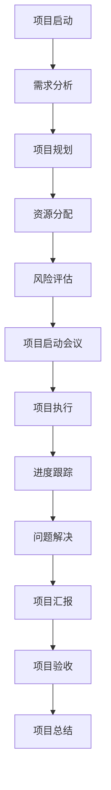
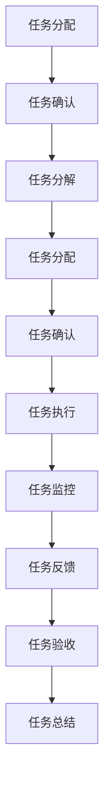
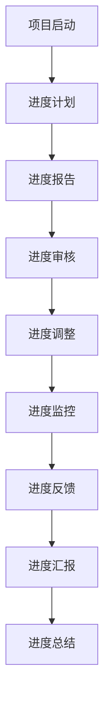
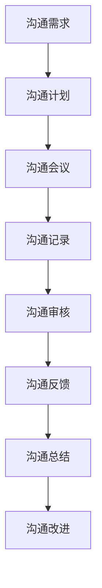

                 


### 文章标题：团队协作：打造无缝配合的团队

> 关键词：团队协作，高效配合，团队沟通，领导力，绩效管理

> 摘要：本文将探讨团队协作的重要性、核心能力、实践方法以及团队协作与组织管理的关系，通过具体案例分析和项目实战，为打造无缝配合的团队提供实用的指导和建议。

---

# 引言

在当今快速变化和竞争激烈的市场环境中，团队协作已成为企业成功的关键因素。无论是软件开发、市场营销、项目管理还是其他领域，高效的团队协作都能提高工作效率、创新能力和竞争优势。本文将从多个角度深入探讨团队协作的各个方面，旨在为读者提供实用的指南和方法，帮助打造无缝配合的团队。

## 文章结构概述

本文将分为三个部分：

### 第一部分：团队协作基础

这部分将介绍团队协作的重要性、核心要素以及历史发展，帮助读者建立对团队协作的基本认识。

### 第二部分：团队协作实践

这部分将重点探讨团队协作的模式、工具与技巧，以及如何解决团队协作中的问题和挑战。

### 第三部分：团队协作与组织管理

这部分将探讨团队协作与组织文化、领导力和绩效管理的关系，提供提升团队协作效能的策略和方法。

## 第一部分：团队协作基础

### 第1章：团队协作的重要性

团队协作不仅能够提高工作效率，还能促进创新、激发团队成员的潜力，增强企业的竞争力。本章节将详细阐述团队协作的意义和重要性。

### 第2章：团队协作的模式与类型

团队协作有多种模式，如传统模式、现代模式等。本章节将比较分析不同团队协作模式的特点，帮助读者选择合适的团队协作模式。

### 第3章：团队协作的核心能力

团队协作需要具备沟通能力、协调能力、创新能力和执行力。本章节将探讨这些核心能力的重要性和培养方法。

## 第二部分：团队协作实践

### 第4章：团队协作工具与技巧

团队协作工具和技巧对于高效协作至关重要。本章节将介绍常见的团队协作工具和技巧，并提供实际应用案例。

### 第5章：团队协作中的问题与解决

团队协作过程中难免会遇到各种问题，如沟通不畅、冲突管理等。本章节将讨论这些问题，并提供解决策略。

### 第6章：团队协作案例研究

通过分析成功的和失败的团队协作案例，本章节将提供宝贵的经验和教训，帮助读者避免常见错误。

## 第三部分：团队协作与组织管理

### 第7章：团队协作与组织文化

组织文化对团队协作有着深远的影响。本章节将探讨团队协作与组织文化的关联，并提供构建支持团队协作的组织文化的方法。

### 第8章：团队协作与领导力

领导力是团队协作成功的关键。本章节将讨论团队领导者的角色与责任，以及提升团队协作的领导力策略。

### 第9章：团队协作与绩效管理

团队协作对绩效有着重要影响。本章节将介绍团队协作绩效的评估与激励方法，并提供提高团队协作绩效的最佳实践。

## 结论

通过本文的探讨，我们认识到团队协作对于企业成功的重要性。只有通过高效协作，团队才能充分发挥成员的潜力，实现共同目标。希望本文能为读者提供有价值的参考和启示。

---

接下来，我们将逐步深入探讨每个章节的内容，为读者提供详尽的技术分析和实践经验。让我们一步步分析推理思考，共同打造无缝配合的团队。

---

### 第1章：团队协作的重要性

在现代社会中，团队协作已经成为组织运作和成功的关键因素。随着全球化和数字化的发展，项目复杂性不断增加，单靠个人的力量已经无法应对各种挑战。因此，团队协作的重要性日益凸显。在这一章节中，我们将从以下几个方面来探讨团队协作的重要性：

#### 背景介绍

首先，团队协作的概念需要明确。团队协作是指多个成员为了共同目标，通过有效沟通和互相配合，共同完成任务的过程。在团队协作中，每个成员都有自己的角色和职责，相互之间需要建立良好的沟通和信任关系。

团队协作的背景可以追溯到工业革命时期。随着生产规模的扩大和生产过程的复杂化，团队协作逐渐成为一种有效的组织形式。随着信息技术的不断发展，团队协作的形式和手段也发生了巨大变化，如远程协作工具、虚拟团队等。

#### 核心概念与联系

团队协作的核心概念包括沟通能力、协调能力、创新能力和执行力。这些能力相互联系，共同构成团队协作的基础。

- **沟通能力**：沟通是团队协作的基石。良好的沟通能够确保信息传递的准确性和及时性，避免误解和冲突。沟通能力包括倾听、表达、非语言沟通等。

- **协调能力**：协调能力是指团队内部成员之间的协调和配合。一个协调能力强的团队能够在复杂情况下保持稳定和高效的工作状态。

- **创新能力**：创新能力是团队在解决复杂问题和应对市场变化中的核心竞争力。通过团队协作，成员可以集思广益，提出创新的解决方案。

- **执行力**：执行力是指团队将计划付诸实践的能力。高效的执行力能够确保团队按时完成目标，提高工作效率。

这些核心能力之间相互关联，共同推动团队协作的发展。例如，沟通能力能够促进团队成员之间的理解，协调能力能够确保团队内部的协作，创新能力能够为团队提供新的解决方案，执行力能够确保团队目标的实现。

#### 核心算法原理讲解

在探讨团队协作的核心能力时，我们可以借助一些核心算法原理来加深理解。

- **社交网络分析**：社交网络分析是一种用于研究团队内部成员之间关系的方法。通过分析成员之间的互动关系，可以揭示团队的结构和沟通模式。这有助于团队领导者和成员了解团队的协作情况，并采取相应的措施优化团队协作。

- **博弈论**：博弈论是一种用于研究团队决策和协作的理论。在团队协作中，成员之间的互动可以被视为一种博弈。通过分析博弈的均衡策略，可以找到团队协作的最佳模式。

下面是一个简化的社交网络分析的伪代码示例：

```plaintext
function analyze_social_network(team_members, interactions):
    # 创建社交网络图
    graph = create_graph()

    # 添加成员到社交网络图
    for member in team_members:
        add_node(graph, member)

    # 添加成员之间的交互关系
    for interaction in interactions:
        add_edge(graph, interaction.from_member, interaction.to_member)

    # 分析社交网络图
    centrality_scores = calculate_centrality(graph)

    # 输出分析结果
    return centrality_scores
```

#### 数学模型和数学公式

团队协作中的数学模型可以帮助我们更准确地分析和评估团队的表现。以下是一个简单的数学模型示例：

- **团队绩效评估模型**：

  假设团队绩效可以通过以下公式计算：

  $$\text{团队绩效} = f(\text{沟通能力}, \text{协调能力}, \text{创新能力}, \text{执行力})$$

  其中，$f$ 表示团队绩效的计算函数。通过分析团队的表现，我们可以调整各个参数的权重，以更准确地评估团队绩效。

  $$f(x, y, z, w) = w_1 \cdot x + w_2 \cdot y + w_3 \cdot z + w_4 \cdot w$$

  其中，$w_1, w_2, w_3, w_4$ 分别为沟通能力、协调能力、创新能力和执行力的权重。

  $$\text{权重分配} = \frac{w_1 + w_2 + w_3 + w_4}{4}$$

  通过调整权重，我们可以根据团队的具体情况，平衡各个能力的贡献。

  $$\text{团队绩效} = w_1 \cdot x + w_2 \cdot y + w_3 \cdot z + w_4 \cdot w$$

#### 举例说明

为了更好地理解团队协作的重要性，我们可以通过一个实际案例来进行分析。

假设一个软件开发团队需要在规定的时间内完成一个复杂的软件项目。团队成员包括项目经理、设计师、程序员和测试员。以下是一个简单的案例：

- **沟通能力**：团队成员通过日常站会、周会和项目报告等方式保持沟通，确保信息传递的准确性和及时性。
- **协调能力**：项目经理负责协调团队成员的工作，确保各个角色之间的协作和配合。
- **创新能力**：设计团队提出了一些创新的解决方案，提高了软件的性能和用户体验。
- **执行力**：程序员和测试员按照项目计划，按时完成了各自的任务，确保了项目的进度和质量。

通过这个案例，我们可以看到，团队协作的重要性体现在以下几个方面：

- **提高工作效率**：通过团队协作，团队成员可以相互补充，分工合作，提高整体工作效率。
- **促进创新**：团队协作能够激发成员的创新能力，提出更多的解决方案。
- **增强团队凝聚力**：良好的团队协作能够增强团队成员之间的信任和凝聚力，形成积极的团队氛围。

### 小结

通过本章的探讨，我们认识到团队协作的重要性。团队协作不仅能够提高工作效率和创新能力，还能增强团队的凝聚力和竞争力。在接下来的章节中，我们将进一步探讨团队协作的具体实践方法和策略。

---

### 第2章：团队协作的模式与类型

在团队协作的过程中，不同的协作模式适用于不同的场景和需求。了解并掌握各种团队协作的模式和类型，有助于我们根据实际情况选择合适的协作方式，提升团队的协作效率。本章将详细讨论传统团队协作模式和现代团队协作模式，并对它们进行比较分析。

#### 传统团队协作模式

传统团队协作模式通常基于职能划分，团队成员按照各自的专业技能和工作职责进行分工。以下是几种常见的传统团队协作模式：

1. **职能型组织**：
   - **定义**：职能型组织按照职能（如开发、测试、设计等）划分团队成员。
   - **优点**：职责明确，专业技能集中，有利于提高专业水平和工作效率。
   - **缺点**：跨部门协作困难，沟通成本高，决策速度较慢。

2. **矩阵型组织**：
   - **定义**：矩阵型组织在职能划分的基础上，增加项目维度，实现职能和项目的双重管理。
   - **优点**：灵活应对项目需求，资源调配更加灵活，有利于项目管理和团队协作。
   - **缺点**：组织结构复杂，权力分配不清，可能导致冲突和决策困难。

3. **项目型组织**：
   - **定义**：项目型组织以项目为核心，团队成员按项目需求组成临时团队。
   - **优点**：专注于项目目标，团队成员责任明确，有利于高效完成任务。
   - **缺点**：项目结束后团队解散，成员间的关系难以长期维持，团队协作经验积累不足。

#### 现代团队协作模式

随着信息技术的发展，现代团队协作模式也在不断演变。以下是几种常见的现代团队协作模式：

1. **虚拟团队**：
   - **定义**：虚拟团队通过互联网和其他通信工具进行协作，团队成员分布在不同的地理位置。
   - **优点**：不受地理位置限制，可以招聘全球范围内的优秀人才，降低人力成本。
   - **缺点**：沟通协调难度大，需要高效的沟通工具和流程管理，否则容易导致信息传递不畅。

2. **跨职能团队**：
   - **定义**：跨职能团队由不同职能背景的成员组成，以项目或产品为核心，共同完成特定任务。
   - **优点**：充分利用团队成员的不同专业知识和技能，提高创新能力和解决问题的效率。
   - **缺点**：团队成员角色和职责可能不明确，需要强有力的领导来协调和管理。

3. **敏捷团队**：
   - **定义**：敏捷团队采用敏捷开发方法，以迭代和增量为原则，快速响应需求变化。
   - **优点**：灵活应对需求变化，提高产品质量和客户满意度，减少开发成本。
   - **缺点**：需要团队成员具备较高的自我管理和协作能力，否则容易导致进度延误。

#### 团队协作类型的比较分析

以下是传统团队协作模式和现代团队协作模式的一些比较分析：

1. **组织结构**：
   - 传统团队协作模式通常具有明确的组织结构和职能划分，而现代团队协作模式则更加灵活和扁平化。

2. **沟通方式**：
   - 传统团队协作模式主要依赖于面对面的沟通，而现代团队协作模式则更多地依赖于虚拟沟通工具，如视频会议、即时通讯和协作平台。

3. **协作效率**：
   - 传统团队协作模式在稳定性和专业化方面具有优势，而现代团队协作模式在灵活性和响应速度方面更具优势。

4. **团队成员角色**：
   - 传统团队协作模式中，团队成员的角色和职责通常较为固定，而现代团队协作模式中，团队成员的角色和职责可能更加动态和多样化。

5. **适用场景**：
   - 传统团队协作模式适用于需要长期稳定运营的项目和组织，而现代团队协作模式适用于快速变化和需求频繁调整的项目和组织。

#### 核心概念与联系

团队协作模式的选择需要考虑多个因素，如组织目标、项目特点、团队文化和资源状况。以下是几个关键概念和它们之间的联系：

- **组织目标**：团队协作模式需要与组织目标保持一致，确保团队能够为组织战略目标做出贡献。
- **项目特点**：团队协作模式需要适应项目特点和需求，如项目周期、项目规模和项目复杂性。
- **团队文化**：团队协作模式需要与团队文化相匹配，鼓励团队成员积极参与和协作。
- **资源状况**：团队协作模式需要考虑组织内部的资源分配，如人力、物力和财力。

#### 项目实战

为了更好地理解团队协作模式的选择和应用，以下是一个实际项目案例：

某科技公司计划开发一款新的移动应用，项目周期为6个月。团队由项目经理、UI/UX设计师、前端开发工程师、后端开发工程师和测试工程师组成。

- **项目特点**：项目周期较短，需求变化频繁，需要快速响应市场变化。
- **团队协作模式**：选择敏捷团队模式，采用Scrum框架，每个迭代周期为2周。
- **具体实施**：
  - **需求分析**：团队成员定期召开会议，讨论需求变化，确定每个迭代周期的目标。
  - **任务分配**：团队成员根据个人专长和任务需求进行任务分配，确保任务完成。
  - **每日站会**：团队成员每日召开站会，讨论任务进展和问题，确保项目进度。
  - **代码审查**：开发团队成员进行代码审查，确保代码质量和可维护性。
  - **迭代交付**：每个迭代周期结束时，团队交付可运行的产品版本，进行用户测试和反馈。

通过这个案例，我们可以看到敏捷团队模式在快速响应需求变化和高效协作方面的优势。

#### 小结

本章详细介绍了传统团队协作模式和现代团队协作模式，并进行了比较分析。团队协作模式的选择需要根据组织目标、项目特点、团队文化和资源状况等因素综合考虑。通过实际项目案例，我们进一步了解了不同团队协作模式的应用场景和实施方法。在下一章中，我们将继续探讨团队协作的核心能力，包括沟通能力、协调能力、创新能力和执行力。

---

### 第3章：团队协作的核心能力

团队协作的成功不仅依赖于合理的协作模式和结构，更需要团队成员具备一系列核心能力。这些能力是确保团队高效协作、实现共同目标的关键。本章将详细探讨团队协作的核心能力，包括沟通能力、协调能力、创新能力和执行力。

#### 沟通能力

沟通能力是团队协作的基础，直接影响团队成员之间的信息传递和协作效果。以下是沟通能力的重要性和培养方法：

1. **重要性**：
   - **信息传递准确**：良好的沟通能力能够确保信息在传递过程中不产生误解，提高工作效率。
   - **减少冲突**：有效的沟通有助于团队成员理解彼此的需求和立场，减少冲突和误解。
   - **增强团队凝聚力**：良好的沟通能够增强团队成员之间的信任和默契，提高团队凝聚力。

2. **培养方法**：
   - **倾听**：倾听是有效沟通的关键，通过倾听，团队成员能够理解对方的意见和需求。
   - **表达清晰**：表达清晰是指能够准确地传达自己的想法和意见，避免误解。
   - **反馈**：及时给予反馈是沟通的重要环节，能够帮助团队成员了解彼此的需求和进展。

3. **案例**：在一个软件开发团队中，项目经理通过每日站会和项目进度报告，与团队成员保持沟通，确保项目进度和问题能够及时解决，提高了团队的工作效率。

#### 协调能力

协调能力是团队协作中另一个至关重要的能力，涉及到团队成员之间的协作和资源分配。以下是协调能力的重要性和培养方法：

1. **重要性**：
   - **资源优化**：协调能力能够帮助团队优化资源分配，确保每个人都能发挥最大作用。
   - **任务同步**：协调能力有助于团队成员同步任务进展，确保项目按时完成。
   - **减少冲突**：通过协调，能够减少团队成员之间的冲突和误解，提高团队协作效率。

2. **培养方法**：
   - **冲突管理**：学会处理冲突，通过沟通和妥协找到解决方案，确保团队和谐。
   - **时间管理**：合理安排时间，确保任务和项目能够按时完成。
   - **资源分配**：合理分配团队资源，确保每个人都能在适合自己的岗位上发挥最大的潜力。

3. **案例**：在一个市场营销团队中，项目经理通过协调团队成员的工作时间，合理安排任务进度，确保项目在规定时间内完成，同时避免了资源浪费。

#### 创新能力

创新能力是团队在解决复杂问题和应对市场变化中的核心竞争力。以下是如何培养团队创新能力：

1. **重要性**：
   - **解决问题**：创新能力能够帮助团队提出新颖的解决方案，有效应对问题。
   - **市场竞争力**：具备创新能力的团队能够开发出具有竞争力的产品和服务，提高市场占有率。
   - **持续发展**：创新是团队持续发展的动力，能够推动团队不断进步。

2. **培养方法**：
   - **鼓励尝试**：鼓励团队成员勇于尝试新方法，不怕失败，从失败中学习。
   - **团队讨论**：定期组织团队讨论，集思广益，激发创新思维。
   - **跨领域合作**：通过跨领域合作，借鉴不同领域的经验和知识，提高创新能力。

3. **案例**：在一个研发团队中，团队成员通过定期头脑风暴会议，提出各种创新想法，成功开发出一款具有市场竞争力的新产品。

#### 执行力

执行力是团队将计划付诸实践的能力，直接影响团队目标的实现。以下是执行力的重要性和培养方法：

1. **重要性**：
   - **目标实现**：执行力是团队实现目标的关键，没有执行力，再好的计划也无法实现。
   - **团队信心**：高效的执行力能够增强团队成员的信心，提高团队士气。
   - **持续改进**：执行力有助于团队在实践中不断改进和优化，实现持续发展。

2. **培养方法**：
   - **明确目标**：确保每个团队成员都清楚自己的目标和任务，避免模糊不清。
   - **分工协作**：合理分配任务，确保每个人都能在自己的岗位上高效工作。
   - **监控进度**：定期监控任务进度，及时发现和解决问题，确保项目按时完成。

3. **案例**：在一个项目管理团队中，团队成员通过严格的进度管理和定期进度报告，确保项目在规定时间内高质量完成，赢得了客户和公司的认可。

#### 核心概念与联系

团队协作的核心能力之间相互联系，共同推动团队协作的发展：

- **沟通能力**：为其他能力提供基础，确保信息传递准确和及时。
- **协调能力**：通过协调，确保资源优化和任务同步，提高团队效率。
- **创新能力**：为团队提供新的解决方案和思路，推动团队发展。
- **执行力**：确保计划付诸实践，实现团队目标。

这些核心能力相互支持，共同构成团队协作的完整体系。

#### 小结

本章详细探讨了团队协作的核心能力，包括沟通能力、协调能力、创新能力和执行力。这些能力是确保团队高效协作和实现共同目标的关键。通过培养这些核心能力，团队可以更好地应对挑战，实现持续发展。在下一章中，我们将继续探讨团队协作工具与技巧，为团队协作提供实际操作指南。

---

### 第4章：团队协作工具与技巧

在现代社会中，团队协作工具和技巧的运用对于提高团队效率、减少沟通障碍和优化工作流程至关重要。本章将详细介绍一些常用的团队协作工具和技巧，并通过实际应用案例，展示如何将这些工具和技巧应用到团队协作中，以实现无缝配合。

#### 团队协作工具的选择与应用

选择合适的团队协作工具是团队高效协作的第一步。以下是一些常用的团队协作工具及其应用场景：

1. **项目管理工具**：
   - **Jira**：Jira 是一款功能强大的项目管理工具，适用于敏捷开发和复杂项目。团队成员可以通过 Jira 进行任务分配、进度跟踪和协作。
   - **Trello**：Trello 是一款简单直观的项目管理工具，适用于小型项目和日常任务管理。团队成员可以通过 Trello 的看板和卡片进行任务规划和进度跟踪。

2. **即时通讯工具**：
   - **Slack**：Slack 是一款流行的即时通讯工具，支持文字、图片、文件等多种沟通方式。团队成员可以通过 Slack 的频道进行实时沟通和协作。
   - **Microsoft Teams**：Microsoft Teams 是一款集即时通讯、会议、文档协作等功能于一体的工具，适用于企业内部沟通和协作。

3. **文档协作工具**：
   - **Google Docs**：Google Docs 是一款在线文档协作工具，支持多人实时编辑和协作。团队成员可以通过 Google Docs 进行文档共享和协作。
   - **Notion**：Notion 是一款功能强大的文档协作工具，适用于笔记、文档、任务管理等多种场景。团队成员可以通过 Notion 进行信息整理和协作。

4. **视频会议工具**：
   - **Zoom**：Zoom 是一款功能强大的视频会议工具，支持多人会议、实时交流和互动。团队成员可以通过 Zoom 进行远程会议和协作。
   - **Microsoft Teams**：Microsoft Teams 的视频会议功能与即时通讯、文档协作等功能集成，适用于企业内部会议和协作。

#### 团队协作中的沟通技巧

有效的沟通是团队协作的关键。以下是一些提高团队沟通效率的技巧：

1. **明确沟通目标**：在进行沟通前，明确沟通的目标和要点，确保信息传达的准确性和有效性。
2. **倾听**：倾听是有效沟通的重要部分，通过倾听，团队成员能够更好地理解对方的意见和需求。
3. **表达清晰**：表达清晰是指能够准确地传达自己的想法和意见，避免产生误解。
4. **使用具体例子**：在沟通中，使用具体的例子和实际数据，有助于提高沟通的效果和可信度。
5. **积极反馈**：及时给予反馈，能够帮助团队成员了解彼此的需求和进展，促进沟通的深入和有效。

#### 团队协作中的协调技巧

协调技巧是团队协作中确保资源优化和任务同步的关键。以下是一些提高团队协调效率的技巧：

1. **明确职责和任务**：确保每个团队成员都清楚自己的职责和任务，避免职责重叠和任务遗漏。
2. **定期同步进度**：通过定期同步进度，团队成员能够了解项目的整体进展，及时调整工作计划。
3. **协调资源**：合理分配团队资源，确保每个人都能在自己的岗位上高效工作。
4. **使用项目管理工具**：通过使用项目管理工具，如 Jira、Trello 等，团队成员可以实时查看任务进展和项目状态，提高协调效率。
5. **及时解决冲突**：通过沟通和协商，及时解决团队成员之间的冲突和误解，确保团队和谐和高效。

#### 项目实战

为了更好地理解团队协作工具和技巧的应用，以下是一个实际项目案例：

某软件开发公司正在开发一款移动应用，项目周期为6个月。团队由项目经理、UI/UX设计师、前端开发工程师、后端开发工程师和测试工程师组成。

- **工具选择**：
  - 项目管理工具：使用 Jira 进行任务分配、进度跟踪和协作。
  - 即时通讯工具：使用 Slack 进行实时沟通和协作。
  - 文档协作工具：使用 Google Docs 进行文档共享和协作。
  - 视频会议工具：使用 Zoom 进行远程会议和协作。

- **具体实施**：
  - **任务分配**：项目经理通过 Jira 将任务分配给团队成员，确保每个成员都清楚自己的职责和任务。
  - **进度跟踪**：团队成员通过 Jira 和 Slack，实时更新任务进度，确保项目按时完成。
  - **文档协作**：设计师和开发工程师通过 Google Docs 进行设计文档和代码文档的共享和协作。
  - **远程会议**：每周通过 Zoom 进行项目进度会议，讨论项目进展和问题，确保团队协作顺畅。

通过这个案例，我们可以看到，选择合适的团队协作工具和技巧，对于实现团队协作的无缝配合至关重要。在实际应用中，团队可以根据项目的具体需求和团队的特点，灵活选择和运用这些工具和技巧。

#### 小结

本章详细介绍了团队协作工具的选择与应用，以及团队协作中的沟通技巧和协调技巧。通过实际项目案例，我们展示了如何将这些工具和技巧应用到团队协作中，实现高效的无缝配合。在下一章中，我们将探讨团队协作中的问题和解决策略，帮助团队克服协作过程中的挑战。

---

### 第5章：团队协作中的问题与解决

在团队协作过程中，尽管我们努力去优化协作模式和工具，但仍然会遇到各种各样的问题。这些问题可能来自沟通障碍、角色冲突、资源分配不均等各个方面。在本章中，我们将详细探讨团队协作中的常见问题，并提出相应的解决策略。

#### 常见问题

1. **沟通障碍**：
   - **原因**：团队成员地理位置分散、语言差异、沟通工具使用不当等。
   - **影响**：导致信息传递不准确、延误，增加误解和冲突。
   
2. **角色冲突**：
   - **原因**：团队成员对职责和目标的理解不一致、利益冲突等。
   - **影响**：影响团队协作效率，降低团队凝聚力。

3. **资源分配不均**：
   - **原因**：团队内部资源有限、管理层对资源分配不当等。
   - **影响**：导致部分团队成员工作负荷过大，其他成员工作不足。

4. **执行力不足**：
   - **原因**：团队成员缺乏责任感、领导力不足、目标不明确等。
   - **影响**：导致任务拖延，项目进度延误。

#### 解决策略

1. **沟通障碍**：
   - **解决策略**：
     - **明确沟通规范**：制定统一的沟通规范，包括沟通频率、工具选择、信息格式等。
     - **定期沟通会议**：定期组织团队沟通会议，确保信息传递的准确性和及时性。
     - **使用协作工具**：选择合适的协作工具，如 Slack、Microsoft Teams 等，提高沟通效率。

2. **角色冲突**：
   - **解决策略**：
     - **明确职责和目标**：确保每个团队成员都清楚自己的职责和目标，避免职责重叠和冲突。
     - **建立共识**：通过团队讨论，建立共识，确保团队成员对项目目标和工作内容有共同的理解。
     - **角色转换**：鼓励团队成员在项目周期内轮流担任不同角色，增强对团队整体工作的理解。

3. **资源分配不均**：
   - **解决策略**：
     - **合理分配资源**：管理层根据团队需求和工作负荷，合理分配资源，确保工作均衡。
     - **团队协商**：鼓励团队成员之间进行协商，共同解决资源分配问题。
     - **项目调整**：根据资源状况，适当调整项目目标和计划，确保团队资源得到充分利用。

4. **执行力不足**：
   - **解决策略**：
     - **明确目标**：确保每个团队成员都明确自己的目标，建立清晰的工作计划。
     - **强化责任心**：通过激励措施，增强团队成员的责任心，提高执行力。
     - **监督和反馈**：定期监督任务进度，及时给予反馈，帮助团队成员解决执行中的问题。

#### 案例分析

为了更好地理解如何解决团队协作中的问题，以下是一个实际案例：

某IT公司负责开发一款大型企业级应用，项目周期为12个月。团队由项目经理、前端开发工程师、后端开发工程师、测试工程师和运维工程师组成。在项目执行过程中，团队遇到了以下问题：

- **沟通障碍**：由于团队成员分布在不同的城市，沟通主要依赖于电子邮件和即时通讯工具。由于信息传递不及时，导致项目进度延误。
- **角色冲突**：前端开发和后端开发团队在技术方案上存在分歧，导致项目进度受阻。
- **资源分配不均**：部分团队成员工作负荷过大，而其他成员则相对轻松。
- **执行力不足**：部分团队成员对项目的目标和计划理解不深，执行力较弱。

- **解决方案**：
  - **沟通障碍**：团队引入了 Slack 作为主要沟通工具，并设置了专门的频道用于项目讨论和沟通。同时，每周召开视频会议，确保信息传递的及时性和准确性。
  - **角色冲突**：团队组织了一次技术讨论会，让前端开发和后端开发团队共同讨论技术方案，达成共识。项目经理在会议中扮演调解者的角色，确保双方意见得到平衡。
  - **资源分配不均**：管理层重新评估了项目资源和团队工作量，调整了任务分配，确保每位成员的工作负荷合理。
  - **执行力不足**：项目经理制定了详细的项目计划和进度表，并定期检查任务执行情况。通过即时反馈和调整，帮助团队成员克服执行中的困难。

通过以上解决方案，团队逐渐克服了协作中的问题，项目进度得以恢复正常，最终成功完成了项目。

#### 小结

本章详细探讨了团队协作中的常见问题，包括沟通障碍、角色冲突、资源分配不均和执行力不足，并提出了相应的解决策略。通过实际案例分析，我们展示了如何有效地解决团队协作中的问题。在下一章中，我们将继续探讨团队协作与组织管理的关系，帮助团队在更广泛的组织环境中实现高效协作。

---

### 第6章：团队协作案例研究

为了更好地理解团队协作的实际应用和效果，本章将通过分析成功的和失败的团队协作案例，总结团队协作的教训和经验，为读者提供宝贵的启示。

#### 成功的团队协作案例

**案例一：谷歌的敏捷团队**

谷歌以其敏捷的开发流程和高效的团队协作而闻名。谷歌的敏捷团队采用了Scrum框架，每个迭代周期为两周。团队成员在每个迭代周期结束时，都会进行回顾会议，总结经验教训，不断改进流程。以下是谷歌团队协作的成功经验：

- **灵活应对变化**：谷歌团队通过敏捷开发，能够快速响应需求变化，确保产品满足市场需求。
- **高度自主性**：团队成员在项目中有较高的自主权，可以自主决定如何实现任务，提高了工作效率。
- **持续改进**：通过定期的回顾会议，团队不断优化流程，提高协作效率。
- **跨职能协作**：团队成员来自不同的专业领域，能够充分利用各自的专业知识和技能，提高创新能力和问题解决能力。

**案例二：腾讯的产品开发团队**

腾讯的产品开发团队在快速迭代和高质量交付方面有着出色的表现。以下是腾讯团队协作的成功经验：

- **明确的目标**：每个团队成员都清楚自己的目标和任务，确保团队目标的一致性。
- **高效的沟通**：团队成员通过每日站会和项目进度报告，保持紧密的沟通，确保信息传递的准确性和及时性。
- **透明的进度跟踪**：通过项目管理工具，如Jira，团队成员可以实时查看项目进度，及时调整计划。
- **持续反馈**：团队鼓励成员在项目过程中提供反馈，确保问题能够及时发现和解决。

#### 失败的团队协作案例

**案例一：某初创企业的研发团队**

某初创企业的研发团队在项目执行过程中遇到了严重的问题。以下是该团队协作失败的原因：

- **目标不明确**：团队成员对项目目标理解不一致，导致工作方向和进度不一致。
- **沟通不畅**：团队成员之间缺乏有效的沟通，导致信息传递不及时，问题无法及时解决。
- **职责不明**：团队成员职责不明确，导致任务重叠和责任逃避。
- **资源不足**：团队资源分配不合理，部分成员工作负荷过大，其他成员则相对轻松。

**案例二：某大型企业的项目团队**

某大型企业的项目团队在项目执行过程中也遭遇了失败。以下是该团队协作失败的原因：

- **缺乏领导力**：团队领导力不足，无法有效协调和管理团队成员，导致团队效率低下。
- **执行力不足****：团队成员缺乏责任感，执行力较弱，导致项目进度延误。
- **管理不善**：管理层对项目的监督和反馈不足，导致问题无法及时发现和解决。

#### 案例分析与启示

通过对以上成功和失败的团队协作案例进行分析，我们可以得出以下启示：

1. **明确的目标和职责**：确保团队成员对项目目标和工作内容有共同的理解，明确各自的职责和任务。
2. **高效的沟通**：建立有效的沟通机制，确保信息传递的准确性和及时性，减少误解和冲突。
3. **资源合理分配**：合理分配团队资源，确保每位成员的工作负荷合理，避免资源浪费。
4. **持续改进**：通过定期的回顾会议和反馈机制，不断优化团队协作流程，提高协作效率。
5. **领导力和执行力**：团队领导需要具备较强的领导力和执行力，能够有效协调和管理团队成员，确保项目按时完成。

#### 小结

本章通过分析成功的和失败的团队协作案例，总结了团队协作的教训和经验，为读者提供了宝贵的启示。通过借鉴成功案例的经验，避免失败案例中的问题，团队可以更好地实现高效协作，提高项目成功率。在下一章中，我们将探讨团队协作与组织管理的关系，帮助团队在更广泛的组织环境中实现高效协作。

---

### 第7章：团队协作与组织文化

组织文化是团队协作的重要背景和影响因素，它对团队协作的成效有着深远的影响。本章将探讨团队协作与组织文化的关联，以及如何构建支持团队协作的组织文化。

#### 组织文化与团队协作的关联

1. **共同价值观**：组织文化中的共同价值观能够为团队成员提供明确的行为指南和目标方向，促进团队成员之间的协作。
2. **信任**：一个积极向上的组织文化能够促进团队成员之间的信任，降低沟通和协作的障碍。
3. **开放性**：组织文化中的开放性能够鼓励团队成员分享知识和经验，促进团队的创新和协作。
4. **责任感**：组织文化中的责任感能够促使团队成员对自己的工作负责，提高团队的整体执行力。

#### 构建支持团队协作的组织文化

1. **鼓励沟通**：
   - **建立沟通机制**：组织应建立多种沟通渠道，如定期的团队会议、工作坊和开放论坛，鼓励团队成员之间进行沟通。
   - **培养倾听文化**：鼓励团队成员倾听他人的意见和需求，提高沟通效果。

2. **建立信任**：
   - **公平公正**：组织应确保公平公正的管理和决策过程，提高团队成员对组织的信任。
   - **开放反馈**：组织应鼓励团队成员提供反馈，并认真对待和处理这些反馈，增强团队信任。

3. **倡导创新**：
   - **提供资源**：组织应提供必要的资源和支持，鼓励团队成员进行创新。
   - **奖励创新**：组织应设立创新奖励机制，鼓励团队成员提出创新的想法和解决方案。

4. **强化责任感**：
   - **明确职责**：组织应明确团队成员的职责和任务，确保每个人都对自己的工作负责。
   - **建立考核机制**：组织应建立科学的考核机制，对团队成员的工作进行评估和反馈，提高责任感。

#### 组织文化对团队协作的影响

1. **激励作用**：积极的组织文化能够激励团队成员，提高工作积极性和主动性，促进团队协作。
2. **凝聚作用**：共同的组织文化能够增强团队成员之间的凝聚力和归属感，提高团队协作的效率。
3. **导向作用**：组织文化能够为团队成员提供明确的行为准则和目标方向，引导团队成员实现组织目标。

#### 项目实战

为了更好地理解如何构建支持团队协作的组织文化，以下是一个实际项目案例：

某科技公司计划开发一款智能家居应用，项目周期为12个月。为了确保团队协作的顺利进行，公司采取了以下措施：

- **鼓励沟通**：公司定期组织团队会议和研讨会，鼓励团队成员分享想法和经验，促进团队协作。
- **建立信任**：公司鼓励团队成员相互尊重，通过透明的决策过程和开放反馈机制，增强团队信任。
- **倡导创新**：公司为团队成员提供创新资源和支持，设立创新奖励机制，鼓励团队成员提出创新想法。
- **强化责任感**：公司明确团队成员的职责和任务，建立科学的考核机制，确保团队成员对自己的工作负责。

通过以上措施，团队在项目过程中保持了高效协作，最终成功完成了项目，并获得了客户的高度评价。

#### 小结

通过本章的探讨，我们认识到组织文化对团队协作的重要影响。一个积极、开放和支持创新的组织文化能够为团队协作提供良好的环境，促进团队成员之间的协作和沟通，提高团队的整体效能。在下一章中，我们将探讨团队协作与领导力之间的关系，帮助团队领导者提升团队协作能力。

---

### 第8章：团队协作与领导力

领导力是团队协作成功的关键因素之一。一个优秀的团队领导者不仅能够激发团队成员的潜力，还能通过有效的领导和激励，促进团队协作的高效进行。本章将探讨团队领导者的角色与责任，领导者的技能与素质，以及提升团队协作的领导力策略。

#### 团队领导者的角色与责任

1. **明确目标和方向**：团队领导者需要明确团队的目标和方向，确保团队成员对目标有共同的理解和认同。
2. **协调与沟通**：团队领导者需要协调团队成员之间的工作，确保沟通顺畅，减少误解和冲突。
3. **激励与培养**：团队领导者需要激发团队成员的积极性，提供必要的培训和发展机会，提升团队的整体能力。
4. **监督与反馈**：团队领导者需要监督团队的工作进度和质量，及时给予反馈，帮助团队成员改进工作。
5. **决策与问题解决**：团队领导者需要在关键时刻做出决策，解决团队协作中的问题，确保项目顺利进行。

#### 领导者的技能与素质

1. **沟通能力**：优秀的沟通能力是团队领导者的必备素质，能够确保信息的准确传递和理解。
2. **决策能力**：团队领导者需要具备快速做出明智决策的能力，能够在复杂情况下权衡利弊，做出最佳选择。
3. **激励能力**：领导者需要能够激发团队成员的积极性和创造力，提供适当的激励措施，提高团队的整体效能。
4. **组织能力**：领导者需要具备良好的组织能力，能够合理安排资源，确保项目进度和团队目标的实现。
5. **领导风格**：领导者需要根据团队的特点和需求，选择合适的领导风格，如民主式、权威式或参与式，以提高团队协作的效果。

#### 提升团队协作的领导力策略

1. **建立信任**：信任是团队协作的基础，领导者需要通过开放沟通、公平对待和诚实守信，建立和维护团队成员之间的信任。
2. **明确角色和责任**：领导者需要明确团队成员的角色和责任，确保每个人都清楚自己的任务和期望，避免职责重叠和冲突。
3. **提供支持和资源**：领导者需要为团队成员提供必要的技术、资源和培训，确保团队成员能够高效地完成工作。
4. **鼓励创新和反馈**：领导者需要鼓励团队成员提出创新的想法和解决方案，建立开放的反馈机制，促进团队改进和进步。
5. **建立激励机制**：领导者需要设立科学的激励机制，对团队成员的工作进行评估和奖励，提高团队的工作积极性和执行力。

#### 项目实战

为了更好地理解团队协作与领导力的关系，以下是一个实际项目案例：

某科技公司计划开发一款新的移动应用，项目周期为6个月。团队由项目经理、前端开发工程师、后端开发工程师、测试工程师和UI/UX设计师组成。

- **领导者的角色与责任**：
  - **明确目标和方向**：项目经理在项目开始时，明确了项目的目标和技术路线，确保团队成员对项目的方向有共同的理解。
  - **协调与沟通**：项目经理定期召开团队会议，确保团队成员之间的沟通顺畅，及时解决协作中的问题。
  - **激励与培养**：项目经理为团队成员提供技术培训和激励措施，如团队绩效奖金和员工福利，提高团队的工作积极性和创造力。
  - **监督与反馈**：项目经理定期检查团队的工作进度和质量，及时给予反馈，帮助团队成员改进工作。

- **领导力策略**：
  - **建立信任**：项目经理通过透明的沟通和公平的决策，建立了团队成员之间的信任。
  - **明确角色和责任**：项目经理明确团队成员的角色和责任，确保团队成员对任务和期望有清晰的认识。
  - **提供支持和资源**：项目经理为团队成员提供了必要的技术支持和资源，如开发工具和培训课程，确保团队成员能够高效地完成工作。
  - **鼓励创新和反馈**：项目经理鼓励团队成员提出创新的想法和解决方案，建立了开放的反馈机制，促进团队改进和进步。
  - **建立激励机制**：项目经理设立了团队绩效奖金和员工福利，对团队成员的工作进行评估和奖励，提高团队的工作积极性和执行力。

通过以上领导力策略，团队在项目过程中保持了高效协作，最终成功完成了项目，并获得了客户和公司的高度评价。

#### 小结

本章详细探讨了团队协作与领导力之间的关系，包括领导者的角色与责任、领导者的技能与素质，以及提升团队协作的领导力策略。通过实际项目案例，我们展示了如何通过有效的领导力策略，促进团队协作的高效进行。在下一章中，我们将探讨团队协作与绩效管理的关系，帮助团队实现绩效的持续提升。

---

### 第9章：团队协作与绩效管理

团队协作与绩效管理是相辅相成的两个方面。高效的团队协作能够提高团队成员的工作效率和创新能力，而良好的绩效管理则能够确保团队目标的实现，并激励团队成员持续提升个人和团队的表现。本章将探讨团队协作对绩效的影响，团队协作绩效的评估与激励方法，以及提高团队协作绩效的最佳实践。

#### 团队协作对绩效的影响

团队协作对绩效的影响主要体现在以下几个方面：

1. **工作效率**：通过团队协作，团队成员可以相互补充，分工合作，提高整体工作效率。团队成员可以在各自擅长的领域发挥最大的作用，避免资源浪费。

2. **创新能力**：团队协作能够促进知识共享和经验交流，激发团队成员的创新思维。团队成员可以从不同的角度和视角出发，提出创新的解决方案，提高产品的质量和竞争力。

3. **问题解决能力**：团队协作能够提高团队成员的问题解决能力。在面对复杂问题时，团队成员可以共同分析、讨论和制定解决方案，从而提高问题解决的效率和效果。

4. **团队凝聚力**：良好的团队协作能够增强团队成员之间的信任和默契，提高团队的凝聚力。一个团结协作的团队能够更好地应对外部挑战，实现团队目标。

#### 团队协作绩效的评估与激励方法

为了确保团队协作的高效进行，需要对团队协作绩效进行评估和激励。以下是一些评估与激励方法：

1. **绩效指标**：设立明确的绩效指标，如任务完成率、项目进度、质量指标等，用于评估团队的工作效果。绩效指标应与团队目标保持一致，以便更好地衡量团队的表现。

2. **360度评估**：采用360度评估方法，收集团队成员、上级领导、同事和下属的反馈，全面评估团队成员的工作表现。这种方法可以提供多角度的反馈，有助于发现和改进团队协作中的问题。

3. **反馈与沟通**：定期与团队成员进行反馈和沟通，了解他们的工作进展、困难和需求。通过及时的反馈，可以鼓励团队成员改进工作，提高团队协作效率。

4. **奖励与激励**：设立合理的奖励与激励制度，对表现优秀的团队成员进行奖励，如奖金、晋升机会、培训等。激励制度应与绩效指标挂钩，确保奖励的公正性和公平性。

#### 提高团队协作绩效的方法

以下是一些提高团队协作绩效的最佳实践：

1. **明确目标和计划**：确保每个团队成员都清楚团队的目标和计划，明确各自的任务和职责。通过明确的目标和计划，可以减少工作上的模糊和误解，提高团队协作效率。

2. **加强沟通与协作**：建立有效的沟通渠道和协作机制，确保团队成员之间的沟通顺畅。通过定期的团队会议、邮件、即时通讯等工具，及时分享信息，解决问题，提高协作效率。

3. **优化流程和管理**：优化团队的工作流程和管理方法，消除不必要的步骤和重复工作。通过流程优化，可以减少团队成员的工作负担，提高工作效率。

4. **提供培训和发展机会**：为团队成员提供培训和发展机会，提高他们的专业技能和知识水平。通过培训和发展，可以提升团队成员的综合素质，提高团队的整体绩效。

5. **建立激励机制**：设立合理的激励机制，对表现优秀的团队成员进行奖励。激励机制可以激发团队成员的积极性，提高团队协作的效率。

#### 项目实战

以下是一个实际项目案例，展示了如何通过团队协作和绩效管理提高项目绩效：

某科技公司计划开发一款新产品，项目周期为12个月。团队由项目经理、研发人员、测试人员和市场人员组成。

- **绩效评估**：
  - **明确绩效指标**：项目经理与团队成员共同制定了任务完成率、项目进度、质量指标等绩效指标，用于评估团队的工作效果。
  - **360度评估**：项目结束时，采用360度评估方法，收集团队成员、上级领导、同事和下属的反馈，全面评估团队成员的工作表现。

- **激励措施**：
  - **绩效奖金**：根据绩效指标，对表现优秀的团队成员进行绩效奖金奖励。
  - **晋升机会**：对表现优秀的团队成员提供晋升机会，激励他们持续提升自己的能力。

- **团队协作**：
  - **明确目标和计划**：项目经理与团队成员共同明确项目的目标和计划，确保团队成员对项目的方向和任务有清晰的认识。
  - **加强沟通与协作**：项目经理建立了定期的团队会议和邮件沟通机制，确保团队成员之间的沟通顺畅，及时分享信息，解决问题。
  - **优化流程和管理**：项目经理对项目流程进行优化，减少不必要的步骤和重复工作，提高工作效率。

通过以上团队协作和绩效管理措施，项目团队在项目周期内保持了高效协作，项目按时完成，并获得了客户和公司的高度评价。

#### 小结

本章详细探讨了团队协作与绩效管理的关系，包括团队协作对绩效的影响、团队协作绩效的评估与激励方法，以及提高团队协作绩效的最佳实践。通过实际项目案例，我们展示了如何通过团队协作和绩效管理提高项目绩效。在下一章中，我们将提供一些团队协作资源与工具推荐，帮助团队实现高效协作。

---

### 附录A：团队协作资源与工具推荐

为了帮助团队实现高效协作，本章将推荐一些实用的团队协作资源与工具，包括项目管理工具、沟通工具、文档协作工具和视频会议工具等。

#### 项目管理工具

1. **Jira**：Jira 是一款功能强大的项目管理工具，适用于敏捷开发和复杂项目。团队成员可以通过 Jira 进行任务分配、进度跟踪和协作。

2. **Trello**：Trello 是一款简单直观的项目管理工具，适用于小型项目和日常任务管理。团队成员可以通过 Trello 的看板和卡片进行任务规划和进度跟踪。

3. **Asana**：Asana 是一款适用于各种规模项目的项目管理工具，提供任务分配、进度跟踪和团队协作功能。

4. **Microsoft Project**：Microsoft Project 是一款专业的项目管理工具，适用于大型和复杂项目。它提供任务规划、资源管理、进度跟踪和报告生成等功能。

#### 沟通工具

1. **Slack**：Slack 是一款流行的即时通讯工具，支持多人会议、实时交流和互动。团队成员可以通过 Slack 的频道进行实时沟通和协作。

2. **Microsoft Teams**：Microsoft Teams 是一款集即时通讯、会议、文档协作等功能于一体的工具，适用于企业内部沟通和协作。

3. **WhatsApp**：WhatsApp 是一款免费的即时通讯工具，适用于个人和团队之间的沟通。

4. **Zoom**：Zoom 是一款功能强大的视频会议工具，支持多人会议、实时交流和互动。团队成员可以通过 Zoom 进行远程会议和协作。

#### 文档协作工具

1. **Google Docs**：Google Docs 是一款在线文档协作工具，支持多人实时编辑和协作。团队成员可以通过 Google Docs 进行文档共享和协作。

2. **Notion**：Notion 是一款功能强大的文档协作工具，适用于笔记、文档、任务管理等多种场景。团队成员可以通过 Notion 进行信息整理和协作。

3. **Confluence**：Confluence 是一款专业的团队协作平台，提供文档编辑、协作、知识库和项目管理等功能。

4. **OneNote**：OneNote 是一款笔记应用，适用于个人和团队笔记记录和协作。

#### 视频会议工具

1. **Zoom**：Zoom 是一款功能强大的视频会议工具，支持多人会议、实时交流和互动。团队成员可以通过 Zoom 进行远程会议和协作。

2. **Microsoft Teams**：Microsoft Teams 的视频会议功能与即时通讯、文档协作等功能集成，适用于企业内部会议和协作。

3. **WebEx**：WebEx 是一款专业的视频会议工具，提供高清视频、语音和协作功能。

4. **GoToMeeting**：GoToMeeting 是一款适用于远程会议和协作的视频会议工具。

#### 小结

通过以上推荐的团队协作资源与工具，团队可以更高效地进行项目管理、沟通、文档协作和视频会议，实现无缝配合。在团队协作过程中，选择合适的工具和资源，可以显著提高团队协作效率和工作质量。希望这些推荐对您的团队协作有所帮助。

---

### 附录B：团队协作流程图模板

为了帮助团队更好地规划和管理协作流程，本章提供了一些团队协作流程图模板。这些模板涵盖了常见的团队协作环节，包括项目规划、任务分配、进度跟踪和协作沟通等。

#### 项目规划流程图



#### 任务分配流程图



#### 进度跟踪流程图



#### 协作沟通流程图



#### 小结

以上流程图模板为团队协作提供了基本的流程框架。在实际应用中，团队可以根据项目特点和需求，对这些流程图进行定制和优化，以适应不同的协作场景。使用这些流程图，团队可以更加系统化和有序地进行协作，提高协作效率和工作质量。

---

### 附录C：团队协作常用术语解释

在团队协作中，了解并掌握一些常用术语对于有效沟通和协作至关重要。以下是一些团队协作中常用的术语及其解释：

1. **敏捷开发**：敏捷开发是一种以迭代和增量为原则的软件开发方法，强调快速响应需求变化、持续交付价值和团队协作。

2. **Scrum**：Scrum 是一种敏捷开发框架，通过迭代和增量开发，确保项目按时交付并满足客户需求。

3. **看板**：看板是一种可视化工具，用于展示团队的任务进度和工作流程，帮助团队成员了解项目的当前状态。

4. **每日站会**：每日站会是一种简短的会议，团队成员每天早上或开始工作前进行，用于讨论任务进展、问题解决和下一步计划。

5. **任务卡**：任务卡是一种记录和跟踪任务状态的工具，通常包括任务的描述、负责人、截止日期和状态等。

6. **任务分配**：任务分配是指将项目任务分配给团队成员，确保每个任务都有明确的负责人和完成时间。

7. **迭代**：迭代是指软件开发过程中的一系列周期性活动，通常包含需求分析、设计、开发、测试和交付等环节。

8. **用户故事**：用户故事是一种描述用户需求的故事形式，通常包含用户角色、目标功能和价值等信息。

9. **Sprint**：Sprint 是敏捷开发中的一个迭代周期，通常持续2周或4周。

10. **干系人**：干系人是指对项目有利益相关的人员，包括客户、项目经理、开发人员、测试人员等。

11. **敏捷教练**：敏捷教练是一种负责指导团队进行敏捷开发的专家，帮助团队克服协作中的障碍，提高团队效能。

12. **敏捷领导力**：敏捷领导力是指领导者通过赋能、激励和引导，促进团队协作和创新，实现敏捷开发目标的能力。

13. **风险分析**：风险分析是指对项目潜在风险进行识别、评估和应对策略制定的过程，以降低风险对项目的影响。

14. **知识共享**：知识共享是指团队成员之间分享知识和经验，促进团队整体能力的提升。

15. **反馈循环**：反馈循环是指通过定期收集和反馈，帮助团队成员了解工作成效，持续改进工作方法和流程。

#### 小结

了解这些团队协作常用术语对于团队成员之间的有效沟通和协作至关重要。通过掌握这些术语，团队成员可以更清晰地理解项目目标和任务要求，提高协作效率和项目成功率。在团队协作过程中，不断学习和应用这些术语，有助于团队成员更好地融入团队，共同推动项目的顺利进行。

---

### 结语

在本文中，我们详细探讨了团队协作的重要性、核心能力、实践方法以及团队协作与组织管理的关系。通过分析成功和失败的团队协作案例，我们总结了团队协作的教训和经验。最后，我们提供了团队协作资源与工具推荐，并解释了一些常用的团队协作术语。

团队协作是现代组织成功的关键因素之一。通过高效协作，团队可以充分发挥成员的潜力，提高工作效率，实现共同目标。为了打造无缝配合的团队，我们需要关注以下几个方面：

1. **明确目标和职责**：确保每个团队成员都清楚自己的目标、职责和任务，避免职责重叠和冲突。

2. **加强沟通与协作**：建立有效的沟通渠道和协作机制，确保团队成员之间的沟通顺畅，信息传递准确。

3. **提供培训和激励**：为团队成员提供必要的培训和激励，提升他们的专业技能和积极性。

4. **优化流程和管理**：通过优化工作流程和管理方法，消除不必要的步骤和重复工作，提高工作效率。

5. **建立信任和责任感**：通过建立信任和责任感，增强团队成员之间的凝聚力，提高团队整体执行力。

在团队协作过程中，不断学习和改进是至关重要的。通过实践和总结经验，我们可以不断提高团队协作的效率和质量。希望本文能为您的团队协作提供有益的参考和启示。

---

**作者：AI天才研究院/AI Genius Institute & 禅与计算机程序设计艺术 /Zen And The Art of Computer Programming**

