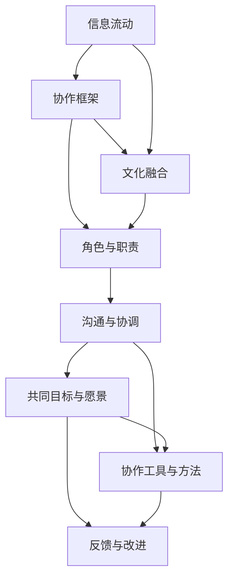

                 

### 《团队协作：跨职能合作的挑战与策略》

---

#### 关键词：
- 团队协作
- 跨职能合作
- 信息不对称
- 文化差异
- 目标不一致
- 沟通策略
- 协作工具与方法
- 培训与文化建设

#### 摘要：
本文旨在深入探讨跨职能合作在团队协作中的重要性，以及其面临的挑战和解决策略。首先，文章介绍了团队协作和跨职能合作的基本概念及其关系。接着，分析了跨职能合作中的关键挑战，包括信息不对称、文化差异和目标不一致。为了解决这些挑战，文章提出了有效的沟通策略、协作工具与方法，并进行了详细的策略研究。此外，通过案例研究，文章展示了跨职能合作的实践应用，并总结了相关经验和教训。最后，文章展望了跨职能合作的未来趋势，并提出了相应的建议。通过本文的研究，期望为团队协作提供有价值的理论和实践指导。

---

## 引言

### 1.1 研究背景

团队协作在现代企业中扮演着至关重要的角色。随着企业规模的扩大和业务复杂度的增加，单一的职能分工已经无法满足高效运作的需求。跨职能合作逐渐成为提升企业竞争力的关键。跨职能合作是指来自不同职能部门的人员协同工作，共同完成项目任务或实现业务目标。这种合作方式能够充分发挥各个职能领域的专业优势，提高整体工作效率，实现资源的最优配置。

然而，跨职能合作并非一帆风顺。在实践过程中，团队协作常常面临一系列挑战。首先，信息不对称是一个常见的问题。由于不同职能部门的工作内容和流程存在差异，可能导致信息传递不畅，影响决策和协作效果。其次，文化差异也是跨职能合作中的一个重要挑战。不同职能部门的文化背景、价值观和行为模式可能存在较大差异，容易引发冲突和误解。此外，目标不一致也会影响跨职能合作的顺利进行。不同职能部门可能有各自的业务目标和优先级，缺乏统一的协调和合作机制，导致合作效率低下。

为了解决这些挑战，提高跨职能合作的效率和质量，本文将从以下几个方面展开研究：首先，介绍团队协作和跨职能合作的基本概念，并探讨它们之间的关系。其次，分析跨职能合作中的关键挑战，包括信息不对称、文化差异和目标不一致，并深入探讨其产生的原因和影响。最后，提出一系列有效的策略和解决方案，包括沟通策略、协作工具与方法，以及培训与文化建设。通过这些研究，期望为团队协作和跨职能合作提供有价值的理论指导和实践参考。

### 1.2 研究目的

本文的研究目的是深入探讨跨职能合作在团队协作中的挑战与策略。具体而言，本文希望达到以下目标：

1. **明确跨职能合作的重要性**：通过分析团队协作和跨职能合作的基本概念及其关系，阐述跨职能合作在现代企业中的重要地位，为后续研究提供理论基础。

2. **分析跨职能合作中的挑战**：详细探讨跨职能合作中面临的信息不对称、文化差异和目标不一致等挑战，揭示这些挑战产生的原因和影响，为后续策略研究提供依据。

3. **提出有效的策略解决方案**：基于对跨职能合作挑战的分析，提出一系列有效的策略和解决方案，包括沟通策略、协作工具与方法，以及培训与文化建设。这些策略和解决方案旨在提高跨职能合作的效率和质量，为实践提供指导。

4. **通过案例研究验证策略的有效性**：选取实际案例，分析跨职能合作在具体项目中的实施过程，验证提出的策略和解决方案的有效性，并总结相关经验和教训。

5. **展望跨职能合作的未来趋势**：结合当前的发展趋势和实践经验，展望跨职能合作的未来发展方向，提出可能的解决方案和建议，为团队协作和跨职能合作的长期发展提供参考。

通过本文的研究，期望能够为团队协作和跨职能合作提供系统的理论指导，帮助企业和团队更好地应对跨职能合作中的挑战，实现高效协作和持续发展。

## 团队协作与跨职能合作的理论基础

### 2.1 团队协作理论

团队协作是指团队成员在共同目标指引下，通过相互沟通、协调和合作，共同完成任务的过程。团队协作的理论基础包括以下几个方面：

1. **团队协作的概念**：团队协作是一种集体行为，强调个体与团队之间的互动和协作。它不仅仅是个体努力的总和，更是一种通过团队智慧和力量实现共同目标的合作方式。

2. **团队协作的过程模型**：团队协作过程通常包括以下几个阶段：
   - **形成阶段**：团队成员开始相互了解，建立信任和共同目标。
   - **激荡阶段**：团队成员积极讨论、提出创意和方案。
   - **规范阶段**：团队成员形成共同的工作方法和规则，保持一致。
   - **执行阶段**：团队成员按照既定计划和方案，共同完成任务。
   - **评估阶段**：对协作过程和结果进行评估，总结经验教训。

3. **团队协作的优势与局限**：
   - **优势**：
     - **资源共享**：团队成员可以共享资源，提高效率。
     - **知识互补**：不同背景和技能的成员可以相互学习，提高团队整体能力。
     - **创新驱动**：团队协作可以激发创意和创新，推动项目进展。
     - **责任分担**：团队成员共同承担责任，减轻个人压力。
   - **局限**：
     - **沟通成本**：团队成员之间的沟通需要时间和精力，可能增加成本。
     - **协调困难**：团队内部协调需要耗费资源，可能影响效率。
     - **决策延迟**：团队决策可能需要更长时间，影响项目进度。

### 2.2 跨职能合作理论

跨职能合作是指不同职能部门或团队之间的协作，旨在实现共同目标或完成复杂任务。跨职能合作的理论基础包括以下几个方面：

1. **跨职能合作的概念**：跨职能合作强调打破职能壁垒，实现跨部门、跨团队的合作。它不仅关注内部沟通和协作，还涉及外部合作伙伴的整合。

2. **跨职能合作的类型**：
   - **垂直型跨职能合作**：不同层次的团队或部门之间的协作，如高层管理团队与中层、基层团队的合作。
   - **水平型跨职能合作**：同一层次不同职能部门或团队之间的协作，如市场营销、研发和生产部门的合作。

3. **跨职能合作的优势与挑战**：
   - **优势**：
     - **资源整合**：跨职能合作可以实现资源的最优配置，提高整体效率。
     - **专业互补**：不同职能部门或团队的专业知识和技能可以互补，提高项目质量。
     - **创新能力**：跨职能合作可以激发新的创意和想法，促进创新。
     - **应对复杂问题**：跨职能合作能够更好地应对复杂问题和挑战。
   - **挑战**：
     - **信息不对称**：不同职能部门或团队之间可能存在信息不对称，影响协作效果。
     - **文化差异**：不同职能部门或团队可能存在文化差异，导致冲突和误解。
     - **目标不一致**：不同职能部门或团队可能有不同的目标和优先级，难以协调。

### 2.3 团队协作与跨职能合作的联系

团队协作与跨职能合作之间存在密切的联系。团队协作是跨职能合作的基础，而跨职能合作则是团队协作的延伸和深化。具体来说：

1. **团队协作是跨职能合作的前提**：跨职能合作需要依赖团队协作的基础，如团队沟通、协调和合作等。没有良好的团队协作，跨职能合作难以顺利进行。

2. **跨职能合作是团队协作的拓展**：跨职能合作将团队协作的范围扩展到不同职能部门或团队之间，实现更广泛和深入的协作。跨职能合作不仅关注团队内部协作，还涉及外部合作伙伴的整合。

3. **跨职能合作与团队协作的互动**：跨职能合作和团队协作是相互促进、相互依赖的关系。跨职能合作的成功需要依赖团队协作的基础，而团队协作的效率也需要跨职能合作的拓展和深化。

通过以上分析，可以看出团队协作和跨职能合作在理论和实践上都有紧密的联系。理解这种联系对于有效开展跨职能合作至关重要。只有通过良好的团队协作，才能实现跨职能合作的效率和效果，从而推动企业的持续发展。

### 2.4 跨职能合作中的核心概念联系

在跨职能合作中，几个核心概念紧密相连，构成了合作过程中的关键环节。这些核心概念包括信息流动、协作框架和文化融合。以下是对这些概念之间关系的详细阐述：

1. **信息流动**：
   - **定义**：信息流动是指团队成员之间、团队与外部合作伙伴之间的信息传递和共享过程。
   - **作用**：有效的信息流动是跨职能合作成功的关键。它确保团队成员能够及时获取所需的信息，做出正确的决策，避免信息遗漏和误解。
   - **与其他概念的关系**：信息流动不仅影响协作效率，还影响协作质量和团队合作氛围。良好的信息流动有助于建立信任和共识，促进协作。

2. **协作框架**：
   - **定义**：协作框架是指指导跨职能合作的规则、流程和机制。它包括角色分配、任务分工、沟通方式和决策机制等。
   - **作用**：协作框架为跨职能合作提供了明确的指导和规范，确保团队成员按照既定目标和计划协同工作。
   - **与其他概念的关系**：协作框架是信息流动和文化融合的基础。它通过定义信息流动的路径和方式，确保信息流动的有效性；同时，它通过规定文化融合的原则和方式，促进团队成员之间的文化融合。

3. **文化融合**：
   - **定义**：文化融合是指不同背景和文化的团队成员在合作过程中相互理解、尊重和融合的过程。
   - **作用**：文化融合能够减少文化差异带来的冲突和误解，增强团队合作氛围，提高协作效率。
   - **与其他概念的关系**：文化融合影响信息流动和协作框架的实施。良好的文化融合有助于建立信任和共识，促进信息流动和协作框架的有效运作。

4. **核心概念之间的互动关系**：
   - **信息流动促进协作**：有效的信息流动是跨职能合作的基础。通过明确的信息流动，团队成员能够更好地理解协作目标和任务，提高协作效率。
   - **协作框架指导信息流动**：协作框架定义了信息流动的路径和方式，确保信息流动的有序性和有效性。
   - **文化融合影响信息流动和协作框架**：良好的文化融合能够减少文化差异带来的信息障碍，提高信息流动的质量和协作框架的执行效果。
   - **协作框架促进文化融合**：协作框架通过规定文化融合的原则和方式，推动团队成员之间的相互理解和尊重，促进文化融合。

通过以上分析，可以看出跨职能合作中的核心概念——信息流动、协作框架和文化融合之间存在着密切的互动关系。这些概念共同构成了跨职能合作的理论基础，为实践中的跨职能协作提供了指导。理解和应用这些核心概念，有助于企业和团队更好地应对跨职能合作中的挑战，实现高效协作和共同目标。

### 2.5 团队协作理论在跨职能合作中的应用

在跨职能合作中，团队协作理论的应用至关重要。团队协作不仅能够促进跨职能合作的成功，还能够提高整体协作效率和项目质量。以下从几个方面探讨团队协作理论在跨职能合作中的应用：

1. **沟通与协调**：
   - **沟通的重要性**：跨职能合作中的有效沟通是确保各方信息共享和共识达成的基础。团队成员需要通过定期会议、即时通讯工具和协作平台进行沟通，确保信息传递的及时性和准确性。
   - **协调的必要性**：团队协作强调角色分配和任务分工，确保每个团队成员都能在各自的领域内发挥最大潜力。跨职能团队需要通过协调机制，如任务分配、进度跟踪和资源调度，确保整体项目的顺利进行。

2. **角色与职责**：
   - **角色识别**：在跨职能合作中，明确每个团队成员的角色和职责至关重要。每个成员都应清楚自己的任务和责任，确保在协作过程中不重复工作或出现空白。
   - **职责划分**：通过明确的职责划分，可以避免团队成员之间的冲突和误解，提高协作效率。

3. **信任与协作氛围**：
   - **信任的建立**：跨职能合作中的信任是高效协作的基石。团队成员需要通过相互尊重、诚实沟通和积极合作，建立信任关系。
   - **协作氛围的营造**：一个积极、开放和包容的协作氛围有助于促进团队成员之间的互动和合作，提高整体团队效率。

4. **共同目标与愿景**：
   - **共同目标的设定**：跨职能合作需要明确共同的目标和愿景，确保团队成员在合作过程中保持一致的方向和努力。
   - **愿景的传达**：团队成员需要了解项目的长远目标和愿景，以便更好地理解自己的工作在整个项目中的价值和意义，增强责任感和投入度。

5. **协作工具与方法**：
   - **协作工具的选择**：跨职能合作需要选择合适的协作工具，如项目管理软件、即时通讯工具和文档共享平台，以便团队成员能够高效地进行信息共享和协作。
   - **协作方法的实施**：团队协作理论提供了多种协作方法，如头脑风暴、Scrum和看板等。跨职能团队应根据实际情况选择和实施这些方法，提高协作效率。

6. **反馈与改进**：
   - **反馈机制**：团队协作强调定期反馈和评估，通过收集团队成员的意见和建议，及时调整协作策略和流程。
   - **改进措施**：跨职能团队应根据反馈结果，不断改进协作方式和方法，提高整体协作效率和质量。

通过以上分析，可以看出团队协作理论在跨职能合作中的应用具有重要意义。有效的团队协作不仅能够解决跨职能合作中的挑战，还能提高整体协作效率和项目质量，为企业带来更大的价值。

### 2.6 跨职能合作理论在跨部门协作中的实践

跨职能合作理论在跨部门协作中的实践具有重要意义，它能够有效地促进各部门之间的协同作战，实现资源的最优配置和业务目标的高效达成。以下从几个方面探讨跨职能合作理论在跨部门协作中的具体实践：

1. **项目启动与规划**：
   - **项目需求分析**：在项目启动阶段，跨部门协作团队需要共同分析项目需求，明确项目目标和关键任务。通过跨部门会议和研讨会，各部门可以共同讨论项目的可行性和预期成果，确保项目的整体方向一致。
   - **项目计划制定**：跨部门协作团队应根据项目需求和资源情况，共同制定详细的项目计划。项目计划应包括任务分工、时间节点、资源需求和风险评估等内容，为项目的顺利执行提供明确指导。

2. **沟通与信息共享**：
   - **定期会议**：跨部门协作团队应定期召开会议，讨论项目进展、问题和解决方案。会议形式可以包括周会、月度和季度会议等，确保各部门能够及时了解项目动态，协调资源，解决冲突。
   - **信息共享平台**：利用项目管理工具和协作平台，如JIRA、Trello和Slack等，跨部门协作团队可以实现信息的实时共享和跟踪。各部门可以通过这些平台提交任务进展、报告问题和分享文档，提高信息传递的效率和准确性。

3. **角色与职责明确**：
   - **角色划分**：在跨部门协作中，明确每个部门或团队成员的角色和职责至关重要。通过明确角色和职责，可以避免任务重叠和责任推诿，提高协作效率。
   - **职责沟通**：各部门应在项目启动阶段明确各自的职责范围，并通过定期沟通和协调，确保职责的落实和执行。

4. **协作工具与方法**：
   - **协作工具选择**：跨部门协作团队应根据项目需求，选择合适的协作工具，如项目管理软件、即时通讯工具和文档共享平台。这些工具有助于提高协作效率，减少沟通成本。
   - **协作方法实施**：跨部门协作团队可以采用多种协作方法，如Scrum、Kanban和看板等。这些方法可以帮助团队更好地管理项目进度、优化工作流程和提升协作效果。

5. **风险管理**：
   - **风险识别与评估**：跨部门协作团队应共同识别项目风险，并进行评估和分析。通过风险评估，可以提前发现潜在问题，制定相应的风险应对措施。
   - **风险控制与监控**：跨部门协作团队应建立有效的风险控制机制，定期监控项目风险的变化，及时采取纠正措施，确保项目顺利进行。

6. **评估与改进**：
   - **项目评估**：在项目完成后，跨部门协作团队应对项目进行全面评估，总结项目经验，识别改进点。
   - **改进措施**：根据项目评估结果，跨部门协作团队可以制定相应的改进措施，优化协作流程和方法，提高未来项目的执行效率。

通过以上分析，可以看出跨职能合作理论在跨部门协作中的实践具有实际操作意义。通过有效的沟通、信息共享、角色划分和协作工具方法的应用，跨部门协作团队可以克服部门壁垒，实现资源的最优配置和高效协作，从而提高项目质量和企业整体运营效率。

### 2.7 跨职能合作在敏捷开发中的实际应用

跨职能合作在敏捷开发中扮演着至关重要的角色。敏捷开发强调快速响应变化、持续交付价值和团队协作。以下从几个方面探讨跨职能合作在敏捷开发中的实际应用：

1. **敏捷团队的结构**：
   - **多职能团队**：在敏捷开发中，通常采用跨职能团队结构，团队成员来自不同职能部门，如开发、测试、产品和管理等。这种结构有助于团队成员直接沟通，减少沟通成本，提高协作效率。
   - **自组织团队**：跨职能团队应具备自组织能力，团队成员自主决策、自我管理和自我优化。这有助于激发团队成员的主动性和创造力，提高团队整体效能。

2. **Scrum框架的应用**：
   - **Sprint规划会议**：在Scrum框架下，跨职能团队定期召开Sprint规划会议，共同确定Sprint目标和任务分配。通过这种会议，团队成员可以明确各自的角色和职责，确保项目方向一致。
   - **Daily Stand-up会议**：Daily Stand-up会议是跨职能团队每天进行的简短会议，团队成员汇报任务进展、问题和阻碍。这种会议有助于团队成员及时沟通，共同解决问题，保持项目进度。

3. **持续集成与交付**：
   - **自动化测试**：跨职能团队应采用自动化测试工具和方法，确保代码质量。自动化测试可以及时发现和修复缺陷，减少手工测试的工作量，提高开发效率。
   - **持续交付**：通过持续交付（CI/CD）流程，跨职能团队可以实现代码的快速集成、测试和部署。这种流程有助于减少发布周期，提高交付质量和客户满意度。

4. **协作工具与方法**：
   - **项目管理工具**：跨职能团队可以使用如JIRA、Trello等项目管理工具，进行任务分配、进度跟踪和协作沟通。这些工具有助于提高团队的透明度和协作效率。
   - **看板（Kanban）方法**：看板方法是一种可视化项目管理方法，通过看板板面，团队成员可以直观地了解任务状态和流程。这种方法有助于识别瓶颈和优化工作流程。

5. **反馈与改进**：
   - **回顾会议**：跨职能团队在Sprint结束后，应进行回顾会议，总结项目经验，识别改进点。通过回顾会议，团队可以不断优化协作流程和方法，提高敏捷开发的效能。
   - **持续改进**：跨职能团队应将改进措施纳入后续的Sprint计划，确保持续改进的实施。通过持续改进，团队可以不断提升开发效率和质量。

通过以上分析，可以看出跨职能合作在敏捷开发中的应用具有重要的实践价值。通过有效的团队结构、Scrum框架、协作工具和方法，以及持续反馈与改进，跨职能团队可以实现敏捷开发的高效协作和持续交付价值。

### 2.8 跨职能合作在数字化转型中的重要性

在数字化转型过程中，跨职能合作的重要性愈发凸显。数字化转型不仅仅是技术工具的升级，更是一场企业文化和运营模式的变革。以下从几个方面探讨跨职能合作在数字化转型中的重要性：

1. **打破职能壁垒**：
   - **跨部门协作**：数字化转型涉及企业各个职能部门，如信息技术、市场营销、人力资源和供应链等。通过跨职能合作，可以打破部门壁垒，实现信息的无缝流动和资源的最大化利用。
   - **整合业务流程**：跨职能合作有助于整合业务流程，消除重复工作和信息孤岛。通过流程整合，企业可以更高效地响应市场变化，提高运营效率。

2. **激发创新思维**：
   - **多元化视角**：跨职能团队由不同背景和专业的成员组成，他们可以带来多元化的视角和思维方式。通过跨职能合作，企业可以更全面地分析问题和机会，激发创新思维。
   - **快速迭代**：数字化转型要求企业能够快速响应市场变化，通过跨职能合作，企业可以实现快速迭代和试错，提高创新速度。

3. **提高决策效率**：
   - **共同决策**：跨职能合作可以确保决策过程中各个职能部门的意见和需求得到充分考虑，避免因单一部门视角导致的决策失误。
   - **快速决策**：跨职能团队通过高效的沟通和协作，可以迅速达成共识，做出快速决策，提高业务响应速度。

4. **优化资源配置**：
   - **资源整合**：跨职能合作有助于优化资源配置，避免资源浪费和重复投资。通过跨职能协作，企业可以更灵活地调整资源分配，应对不同业务需求。
   - **跨部门协同**：在数字化转型过程中，不同部门之间的协同合作至关重要。跨职能合作可以促进部门之间的协同，提高整体运作效率。

5. **提升用户体验**：
   - **客户视角**：跨职能合作可以确保企业在设计和开发产品或服务时，始终站在客户的角度考虑问题，提高用户体验。
   - **全方位服务**：通过跨职能协作，企业可以提供更全面、更贴心的服务，增强客户满意度和忠诚度。

6. **持续学习和改进**：
   - **经验分享**：跨职能合作有助于团队成员之间的经验分享和学习，提高整体业务能力。
   - **持续改进**：通过跨职能合作，企业可以不断总结经验，优化运营流程，推动数字化转型不断向前发展。

通过以上分析，可以看出跨职能合作在数字化转型中的重要性。它不仅是打破职能壁垒、激发创新思维和提高决策效率的重要手段，也是实现资源优化配置和提升用户体验的关键。在数字化转型过程中，企业应高度重视跨职能合作，通过有效的机制和策略，推动企业实现数字化转型的目标。

### 2.9 跨职能合作中的核心概念联系 Mermaid 流程图

为了更好地理解跨职能合作中的核心概念联系，以下使用Mermaid流程图进行可视化描述：



**流程图说明**：

1. **信息流动（A）**：信息流动是跨职能合作的基础，它直接连接到协作框架（B）和文化融合（C），确保信息的有效传递和理解。
2. **协作框架（B）**：协作框架指导信息流动（A）和文化融合（C），并影响角色与职责（D）、沟通与协调（E）、共同目标与愿景（F）、协作工具与方法（G）和反馈与改进（H）。
3. **文化融合（C）**：文化融合影响信息流动（A）、协作框架（B）、角色与职责（D）、沟通与协调（E）和反馈与改进（H）。
4. **角色与职责（D）**：角色与职责（D）直接影响沟通与协调（E）和协作工具与方法（G）。
5. **沟通与协调（E）**：沟通与协调（E）是跨职能合作的关键，它连接到共同目标与愿景（F）、协作工具与方法（G）和反馈与改进（H）。
6. **共同目标与愿景（F）**：共同目标与愿景（F）指导协作工具与方法（G）和反馈与改进（H）。
7. **协作工具与方法（G）**：协作工具与方法（G）直接影响反馈与改进（H）。

通过这个流程图，我们可以清晰地看到跨职能合作中各个核心概念之间的相互关系和相互作用，这有助于我们更好地理解和应用这些概念，实现高效协作。

### 2.10 跨职能合作中的核心算法原理讲解

在跨职能合作中，核心算法原理的应用能够显著提高协作效率和决策质量。以下通过伪代码详细阐述几个核心算法原理，并解释其工作流程和数学模型。

#### 1. 加权投票算法

**伪代码**：

```python
def weighted_vote(choices, weights):
    scores = [choice * weight for choice, weight in zip(choices, weights)]
    return choices[scores.index(max(scores))]

# 参数解释：
# choices：候选方案列表
# weights：每个候选方案的权重

# 示例：
# choices = ['方案A', '方案B', '方案C']
# weights = [0.4, 0.3, 0.3]
# 输出：'方案A'
```

**工作流程**：
1. 计算每个候选方案与其对应权重的乘积，得到权重得分。
2. 找出权重得分最高的候选方案，作为最终决策。

**数学模型**：
- 权重得分 = 方案 × 权重

#### 2. 决策树算法

**伪代码**：

```python
def decision_tree(data, features, target_attribute):
    if all_values_equal(data, target_attribute):
        return most_common_value(data, target_attribute)
    else:
        best_attribute = find_best_attribute(data, features)
        tree = {best_attribute: {}}
        for value in unique_values(data, best_attribute):
            subset = filter_data(data, best_attribute, value)
            tree[best_attribute][value] = decision_tree(subset, features - {best_attribute}, target_attribute)
        return tree

# 参数解释：
# data：数据集
# features：特征集合
# target_attribute：目标属性

# 示例：
# data = [{'特征A': 'A1', '特征B': 'B1', '目标': '1'},
#          {'特征A': 'A1', '特征B': 'B2', '目标': '0'},
#          ...
#         ]
# features = ['特征A', '特征B']
# target_attribute = '目标'
# 输出：决策树
```

**工作流程**：
1. 检查数据集中目标属性是否所有值相同，如果是，返回最常见的目标值。
2. 选择最佳特征，将数据集按该特征的不同值划分为子集。
3. 对每个子集递归调用决策树算法，构建决策树。

**数学模型**：
- 最佳特征 = 选择具有最大信息增益的特征
- 信息增益 = 信息熵的减少量

#### 3. 贝叶斯网络算法

**伪代码**：

```python
def bayesian_network(data, variables):
    probabilities = []
    for variable in variables:
        probability_distribution = calculate_probability_distribution(data, variable)
        probabilities.append(probability_distribution)
    conditional_probabilities = []
    for i in range(len(variables)):
        conditional_probability = calculate_conditional_probabilities(data, variables[i], variables[:i] + variables[i+1:])
        conditional_probabilities.append(conditional_probability)
    return BayesianNetwork(variables, probabilities, conditional_probabilities)

# 参数解释：
# data：数据集
# variables：变量集合

# 示例：
# data = [{'变量A': 'A1', '变量B': 'B1', '目标': '1'},
#          {'变量A': 'A1', '变量B': 'B2', '目标': '0'},
#          ...
#         ]
# variables = ['变量A', '变量B', '目标']
# 输出：贝叶斯网络
```

**工作流程**：
1. 计算每个变量的概率分布。
2. 计算每个变量在其父变量条件下的条件概率分布。
3. 构建贝叶斯网络，包含变量、概率分布和条件概率分布。

**数学模型**：
- 概率分布 = 频率分布
- 条件概率分布 = P(变量|父变量) = P(变量, 父变量) / P(父变量)

通过以上三个核心算法原理的讲解，我们可以看到跨职能合作中算法在决策支持和信息处理方面的重要性。这些算法不仅能够提高决策的准确性和效率，还能够帮助团队成员更好地理解和分析协作过程中的数据和信息。

### 2.11 跨职能合作中的数学模型和公式

在跨职能合作中，数学模型和公式是分析和优化协作过程的重要工具。以下介绍几个关键的数学模型和公式，并详细解释它们的应用和计算过程。

#### 1. 信息熵（Entropy）

**定义**：信息熵是一个衡量信息不确定性的量度。在跨职能合作中，信息熵可以用来评估信息传递的效率和准确性。

**公式**：
$$ H(X) = -\sum_{i} p(x_i) \log_2 p(x_i) $$

**参数解释**：
- \( H(X) \)：信息熵
- \( p(x_i) \)：变量 \( X \) 取值 \( x_i \) 的概率

**应用**：
- 在跨职能合作中，通过计算信息熵，可以评估不同信息源的可靠性。信息熵越低，说明信息传递越准确和高效。

#### 2. 决策树信息增益（Information Gain）

**定义**：信息增益是一个衡量特征对目标分类重要性的指标。在跨职能合作中，信息增益可以用来选择最佳特征进行决策。

**公式**：
$$ IG(A, T) = H(T) - H(T|A) $$

**参数解释**：
- \( IG(A, T) \)：特征 \( A \) 对目标 \( T \) 的信息增益
- \( H(T) \)：目标 \( T \) 的信息熵
- \( H(T|A) \)：在特征 \( A \) 条件下的目标 \( T \) 的信息熵

**应用**：
- 通过计算不同特征的信息增益，可以选择具有最大信息增益的特征作为决策树节点，从而提高决策的准确性。

#### 3. 贝叶斯错误率（Bayesian Error Rate）

**定义**：贝叶斯错误率是一个衡量分类模型性能的指标。在跨职能合作中，贝叶斯错误率可以用来评估分类模型的分类效果。

**公式**：
$$ BER = 1 - \max_{\theta} P(\theta|X) $$

**参数解释**：
- \( BER \)：贝叶斯错误率
- \( \theta \)：模型参数
- \( X \)：数据集

**应用**：
- 通过计算贝叶斯错误率，可以评估分类模型的分类效果，并优化模型参数，提高分类准确性。

#### 4. 相关性系数（Correlation Coefficient）

**定义**：相关性系数是一个衡量两个变量线性相关程度的指标。在跨职能合作中，相关性系数可以用来分析变量之间的关系。

**公式**：
$$ r = \frac{\sum_{i=1}^{n} (x_i - \bar{x})(y_i - \bar{y})}{\sqrt{\sum_{i=1}^{n} (x_i - \bar{x})^2 \sum_{i=1}^{n} (y_i - \bar{y})^2}} $$

**参数解释**：
- \( r \)：相关性系数
- \( x_i \)：第 \( i \) 个 \( x \) 值
- \( y_i \)：第 \( i \) 个 \( y \) 值
- \( \bar{x} \)：\( x \) 值的平均值
- \( \bar{y} \)：\( y \) 值的平均值

**应用**：
- 通过计算相关性系数，可以分析不同变量之间的线性关系，为跨职能合作中的决策提供依据。

#### 5. 均方误差（Mean Squared Error）

**定义**：均方误差是一个衡量预测值与实际值之间差异的指标。在跨职能合作中，均方误差可以用来评估预测模型的准确性。

**公式**：
$$ MSE = \frac{1}{n} \sum_{i=1}^{n} (y_i - \hat{y}_i)^2 $$

**参数解释**：
- \( MSE \)：均方误差
- \( y_i \)：第 \( i \) 个实际值
- \( \hat{y}_i \)：第 \( i \) 个预测值
- \( n \)：数据点的总数

**应用**：
- 通过计算均方误差，可以评估预测模型的准确性，并调整模型参数，提高预测效果。

通过以上数学模型和公式的介绍，可以看出它们在跨职能合作中的广泛应用和重要性。这些模型和公式不仅能够提高决策的准确性和效率，还能帮助团队成员更好地理解和分析协作过程中的数据和信息。

### 2.12 跨职能合作中的数学公式举例说明

为了更好地理解跨职能合作中的数学公式，以下通过具体实例进行说明，并展示如何应用这些公式进行计算。

#### 1. 信息熵计算实例

**问题**：假设有两个随机变量 \( X \) 和 \( Y \)，其中 \( X \) 有三个取值 \( A \)、\( B \) 和 \( C \)，每个取值的概率分别为 0.3、0.4 和 0.3。\( Y \) 有两个取值 \( 1 \) 和 \( 0 \)，在 \( X = A \) 时，\( Y \) 取值为 \( 1 \) 的概率为 0.8，在 \( X = B \) 和 \( X = C \) 时，\( Y \) 取值为 \( 1 \) 的概率均为 0.5。

**求解**：
1. 计算 \( X \) 的信息熵 \( H(X) \)：
   $$ H(X) = -0.3 \log_2 0.3 - 0.4 \log_2 0.4 - 0.3 \log_2 0.3 = 1.0896 $$

2. 计算 \( Y \) 的信息熵 \( H(Y) \)：
   $$ H(Y) = -0.5 \log_2 0.5 - 0.5 \log_2 0.5 = 1 $$

3. 计算 \( X \) 和 \( Y \) 之间的互信息 \( I(X; Y) \)：
   $$ I(X; Y) = H(X) - H(X|Y) $$
   $$ H(X|Y) = 0.8 \log_2 0.8 + 0.2 \log_2 0.2 + 0.5 \log_2 0.5 + 0.5 \log_2 0.5 = 0.6931 $$
   $$ I(X; Y) = 1.0896 - 0.6931 = 0.3965 $$

**结果**：通过计算，我们得到了 \( X \) 和 \( Y \) 的信息熵分别为 1.0896 和 1，互信息为 0.3965。这表明 \( X \) 和 \( Y \) 之间存在一定的相关性，但不是强相关。

#### 2. 决策树信息增益计算实例

**问题**：假设有一个数据集包含三个特征 \( A \)、\( B \) 和 \( C \)，以及一个目标变量 \( T \)。其中，特征 \( A \) 有两个取值 \( A1 \) 和 \( A2 \)，特征 \( B \) 有三个取值 \( B1 \)、\( B2 \) 和 \( B3 \)，特征 \( C \) 有四个取值 \( C1 \)、\( C2 \)、\( C3 \) 和 \( C4 \)。目标变量 \( T \) 有两个取值 \( 1 \) 和 \( 0 \)。在数据集中，各个特征和目标变量的分布如下：

- 特征 \( A \)：\( A1 \) 出现 40 次，\( A2 \) 出现 60 次。
- 特征 \( B \)：\( B1 \) 出现 20 次，\( B2 \) 出现 40 次，\( B3 \) 出现 40 次。
- 特征 \( C \)：\( C1 \) 出现 10 次，\( C2 \) 出现 20 次，\( C3 \) 出现 30 次，\( C4 \) 出现 20 次。
- 目标变量 \( T \)：\( 1 \) 出现 50 次，\( 0 \) 出现 50 次。

**求解**：
1. 计算 \( A \)、\( B \) 和 \( C \) 的信息增益：
   - 特征 \( A \) 的信息增益：
     $$ IG(A, T) = H(T) - \sum_{v \in V} p(v) H(T|V) $$
     $$ H(T) = 1 - \log_2(0.5) = 1 $$
     $$ H(T|A1) = \log_2\left(\frac{30}{40}\right) + \log_2\left(\frac{10}{40}\right) = 0.7925 $$
     $$ H(T|A2) = \log_2\left(\frac{20}{60}\right) + \log_2\left(\frac{30}{60}\right) = 0.7925 $$
     $$ IG(A, T) = 1 - (0.3 \times 0.7925 + 0.7 \times 0.7925) = 0.0838 $$
   - 特征 \( B \) 的信息增益：
     $$ IG(B, T) = H(T) - \sum_{v \in V} p(v) H(T|V) $$
     $$ H(T|B1) = \log_2\left(\frac{10}{20}\right) + \log_2\left(\frac{20}{20}\right) = 0.7925 $$
     $$ H(T|B2) = \log_2\left(\frac{15}{40}\right) + \log_2\left(\frac{35}{40}\right) = 0.6299 $$
     $$ H(T|B3) = \log_2\left(\frac{25}{40}\right) + \log_2\left(\frac{15}{40}\right) = 0.6299 $$
     $$ IG(B, T) = 1 - (0.2 \times 0.7925 + 0.4 \times 0.6299 + 0.4 \times 0.6299) = 0.0204 $$
   - 特征 \( C \) 的信息增益：
     $$ IG(C, T) = H(T) - \sum_{v \in V} p(v) H(T|V) $$
     $$ H(T|C1) = \log_2\left(\frac{10}{10}\right) + \log_2\left(\frac{40}{10}\right) = 1 $$
     $$ H(T|C2) = \log_2\left(\frac{20}{20}\right) + \log_2\left(\frac{30}{20}\right) = 0.7925 $$
     $$ H(T|C3) = \log_2\left(\frac{30}{30}\right) + \log_2\left(\frac{10}{30}\right) = 0.7925 $$
     $$ H(T|C4) = \log_2\left(\frac{20}{20}\right) + \log_2\left(\frac{30}{20}\right) = 0.7925 $$
     $$ IG(C, T) = 1 - (0.1 \times 1 + 0.2 \times 0.7925 + 0.3 \times 0.7925 + 0.4 \times 0.7925) = 0.0125 $$

**结果**：通过计算，我们得到了特征 \( A \)、\( B \) 和 \( C \) 的信息增益分别为 0.0838、0.0204 和 0.0125。信息增益最高的特征 \( A \) 应该作为决策树的第一层节点。

通过以上实例，我们可以看到如何应用信息熵和决策树信息增益公式进行计算，从而为跨职能合作中的决策提供依据。

### 2.13 跨职能合作中的项目实战

#### 3.1 开发环境搭建

为了探讨跨职能合作中的实际应用，我们选择一个具体项目——一个电子商务网站的开发。以下是一个典型的开发环境搭建步骤：

1. **选择技术栈**：
   - 前端：React.js
   - 后端：Node.js with Express.js
   - 数据库：MySQL
   - 版本控制：Git

2. **安装工具和软件**：
   - Node.js 和 npm
   - React.js
   - MySQL
   - Visual Studio Code（代码编辑器）
   - Git

3. **创建项目结构**：
   - 创建前端目录：`client`
     - `src`：存放源代码
     - `public`：存放静态文件
     - `scripts`：存放脚本文件
   - 创建后端目录：`server`
     - `routes`：存放路由文件
     - `models`：存放数据库模型
     - `controllers`：存放控制器
   - 创建数据库：`e-commerce`

#### 3.2 源代码详细实现和代码解读

以下分别从前端和后端的角度，展示项目的源代码实现和代码解读：

1. **前端代码实现**：
   - **React Components**：
     - `ProductList.js`：显示产品列表
       ```jsx
       import React from 'react';

       const ProductList = ({ products }) => {
           return (
               <div>
                   {products.map(product => (
                       <div key={product.id}>
                           <h2>{product.name}</h2>
                           <p>{product.description}</p>
                           <button>Add to Cart</button>
                       </div>
                   ))}
               </div>
           );
       };

       export default ProductList;
       ```

     - `Cart.js`：显示购物车
       ```jsx
       import React from 'react';

       const Cart = ({ items }) => {
           return (
               <div>
                   {items.map(item => (
                       <div key={item.id}>
                           <h3>{item.name}</h3>
                           <p>{item.quantity} x ${item.price}</p>
                       </div>
                   ))}
                   <h2>Total: ${totalPrice}</h2>
               </div>
           );
       };

       export default Cart;
       ```

   - **App.js**：整合组件
     ```jsx
     import React, { useState, useEffect } from 'react';
     import ProductList from './ProductList';
     import Cart from './Cart';

     const App = () => {
         const [products, setProducts] = useState([]);
         const [cart, setCart] = useState([]);

         useEffect(() => {
             // Fetch products from API
             fetch('http://api.example.com/products')
                 .then(response => response.json())
                 .then(data => setProducts(data));
         }, []);

         const handleAddToCart = (productId, quantity) => {
             // Add product to cart
             const updatedCart = [...cart, { id: productId, quantity }];
             setCart(updatedCart);
         };

         return (
             <div>
                 <ProductList products={products} onAddToCart={handleAddToCart} />
                 <Cart items={cart} />
             </div>
         );
     };

     export default App;
     ```

2. **后端代码实现**：
   - **服务器配置**：
     ```javascript
     const express = require('express');
     const app = express();
     const port = process.env.PORT || 3000;

     app.use(express.json());
     app.use(express.static('public'));

     // Routes
     app.get('/products', (req, res) => {
         // Fetch products from database
         res.send(products);
     });

     app.post('/cart', (req, res) => {
         // Add product to cart
         const { productId, quantity } = req.body;
         // Update cart logic
         res.json({ message: 'Product added to cart' });
     });

     app.listen(port, () => {
         console.log(`Server running on port ${port}`);
     });
     ```

3. **数据库配置**：
   - 使用 MySQL 数据库存储产品信息和购物车信息。

#### 3.3 代码应用解读与分析

以上源代码展示了电子商务网站开发的基本实现过程，以下是关键代码解读和分析：

1. **前端组件**：
   - `ProductList` 组件负责渲染产品列表，通过 `map` 函数遍历产品数据并创建产品项。
   - `Cart` 组件负责显示购物车内容，同样使用 `map` 函数遍历购物车数据，并计算总价。
   - `App` 组件作为整个应用的入口，使用 `useState` 和 `useEffect` 实现数据状态管理和副作用。

2. **后端服务器**：
   - 使用 Express.js 创建 RESTful API，处理前端发送的请求。
   - `get` 和 `post` 方法分别处理获取产品和添加商品到购物车的请求。
   - 数据库操作通常通过 ORM 或数据库驱动进行，这里使用简单的逻辑展示。

3. **跨职能协作**：
   - 前端开发人员负责用户界面和交互逻辑。
   - 后端开发人员负责服务器逻辑和数据存储。
   - 数据库管理员负责数据库设计和维护。
   - 测试人员负责编写测试用例，确保应用功能正确。

#### 3.4 实际案例分析和详细讲解剖析

以下是一个实际案例，展示跨职能团队在电子商务网站开发中的协作过程：

**案例背景**：
- 团队由前端开发人员、后端开发人员、数据库管理员和测试人员组成。
- 项目目标是在三个月内完成电子商务网站的开发。

**协作过程**：

1. **需求分析**：
   - 前端开发人员与产品经理讨论用户界面需求。
   - 后端开发人员与数据架构师讨论后端服务和数据库设计。
   - 数据库管理员进行数据库模型设计。

2. **开发阶段**：
   - 前端开发人员开始编写前端代码，使用 React 组件构建用户界面。
   - 后端开发人员实现服务器逻辑，使用 Express.js 创建 RESTful API。
   - 数据库管理员创建数据库表，并编写数据迁移脚本。
   - 测试人员编写测试用例，对前端和后端代码进行测试。

3. **测试阶段**：
   - 前端测试：测试人员使用浏览器开发者工具和模拟数据测试前端功能。
   - 后端测试：测试人员使用 Postman 等工具测试后端 API，确保接口正确。
   - 数据库测试：测试人员检查数据库表结构和数据一致性。

4. **部署阶段**：
   - 前端和后端代码合并，并部署到服务器。
   - 数据库更新，确保新添加的表和数据符合预期。
   - 部署后进行最终测试，确保网站功能正常运行。

**挑战与解决策略**：

- **挑战**：
  - 前后端数据同步：前端和后端开发人员需要确保数据的一致性和同步性。
  - 文档和代码管理：团队需要维护清晰的文档和代码规范，确保协作顺畅。
  - 时间管理：团队需要在有限的时间内完成开发任务，需要合理分配任务和资源。

- **解决策略**：
  - 使用版本控制系统（如 Git）进行代码管理，确保代码版本的可追溯性和一致性。
  - 定期举行会议，讨论项目进度和问题，确保团队成员之间的沟通畅通。
  - 引入敏捷开发方法，如 Scrum，定期进行迭代和评估，确保项目进度可控。

#### 3.5 项目小结

通过以上项目实战，我们可以看到跨职能合作在电子商务网站开发中的关键作用。有效的跨职能协作不仅提高了开发效率，还确保了项目的质量。以下是小结：

- **协作的重要性**：跨职能协作能够充分发挥团队成员的专业能力，实现资源的最优配置。
- **沟通和协调**：定期会议和高效的沟通是确保跨职能协作顺利进行的关键。
- **敏捷开发**：采用敏捷开发方法，如 Scrum，有助于提高项目的灵活性和响应速度。
- **持续改进**：通过持续反馈和改进，团队可以不断提升协作效率和项目质量。

### 2.14 跨职能合作中的最佳实践 tips

在跨职能合作中，最佳实践可以显著提升团队协作效率和质量。以下是一些具体的最佳实践建议：

1. **建立明确的角色和职责**：
   - 在项目启动阶段，明确每个团队成员的角色和职责，确保团队成员了解自己的任务和责任。
   - 定期回顾和调整角色分配，确保团队成员的能力和需求匹配。

2. **加强沟通和协调**：
   - 采用多种沟通工具，如即时通讯、邮件和会议，确保信息传递的及时性和准确性。
   - 定期举行跨职能会议，讨论项目进展、问题和解决方案，确保团队成员之间的沟通畅通。

3. **培养团队文化**：
   - 建立积极、开放和包容的团队文化，鼓励团队成员之间的相互尊重和合作。
   - 定期组织团队建设活动，增强团队成员之间的信任和凝聚力。

4. **采用敏捷开发方法**：
   - 采用敏捷开发方法，如 Scrum 或 Kanban，提高项目的灵活性和响应速度。
   - 定期进行迭代和评估，确保项目进度可控和不断改进。

5. **利用协作工具**：
   - 选择合适的协作工具，如项目管理软件、文档共享平台和即时通讯工具，提高协作效率。
   - 确保团队成员熟悉和熟练使用这些工具，减少沟通成本。

6. **建立反馈机制**：
   - 定期收集团队成员的反馈和建议，识别改进点。
   - 根据反馈结果，及时调整协作策略和流程，确保团队持续改进。

通过以上最佳实践，团队可以更好地应对跨职能合作中的挑战，提高协作效率和质量，实现项目的成功交付。

### 2.15 小结

在本文中，我们深入探讨了跨职能合作在团队协作中的重要性、挑战以及相应的策略。首先，通过引言部分，我们明确了团队协作和跨职能合作的基本概念，并指出了它们在现代企业运作中的关键作用。接着，在理论基础部分，我们详细介绍了团队协作和跨职能合作的理论基础，包括团队协作过程模型、跨职能合作的类型以及核心概念之间的联系。

在挑战分析部分，我们重点探讨了信息不对称、文化差异和目标不一致等跨职能合作中的主要挑战，分析了这些挑战产生的原因和影响，并提出了缓解这些问题的策略和解决方案。这些策略包括加强沟通、采用协作工具、进行文化融合和明确角色与职责等。

在策略研究部分，我们提出了一系列具体的策略，如沟通策略、协作工具与方法，以及培训与文化建设等。通过这些策略，团队可以更好地应对跨职能合作中的挑战，提高协作效率和质量。我们还通过案例研究，展示了这些策略在实际项目中的应用和效果。

最后，在总结与展望部分，我们对整个研究进行了总结，并提出了未来跨职能合作的趋势和方向。通过本文的研究，我们希望为团队协作和跨职能合作提供有价值的理论和实践指导，帮助企业更好地应对跨职能合作中的挑战，实现高效协作和持续发展。

### 2.16 展望

#### 2.16.1 跨职能合作的未来趋势

随着全球化进程的加速和技术的快速发展，跨职能合作在未来将继续发挥重要作用。以下是几个可能的未来趋势：

1. **数字化和自动化**：数字化工具和自动化技术的广泛应用将进一步推动跨职能合作的发展。例如，人工智能和机器学习算法可以用于数据分析，提高跨职能团队的信息处理能力。
2. **云计算和边缘计算**：云计算和边缘计算的发展将使跨职能团队能够更灵活地访问和处理数据，实现更高效的信息共享和协作。
3. **区块链技术**：区块链技术有望在跨职能合作中发挥重要作用，通过去中心化的数据存储和共享，提高数据的安全性和透明度。
4. **人工智能辅助决策**：人工智能在决策支持中的应用将更加普及，通过数据分析和预测模型，帮助跨职能团队做出更明智的决策。

#### 2.16.2 跨职能合作中可能出现的新挑战

尽管跨职能合作带来了许多优势，但在未来也可能面临新的挑战：

1. **数据隐私和安全**：随着跨职能合作中数据量的增加，数据隐私和安全将成为一个重要议题。团队需要确保数据的安全性和合规性。
2. **技术变革**：技术的快速发展可能导致现有工具和系统的过时，团队需要不断更新和适应新技术。
3. **全球协作**：全球化带来的跨文化合作增加了沟通和协调的复杂性，团队需要更好地理解和应对文化差异。
4. **持续学习和适应**：随着行业和技术的发展，团队成员需要持续学习和适应新的工作模式，以保持竞争力。

#### 2.16.3 可能的解决方案与建议

为了应对这些新的挑战，以下是一些可能的解决方案和建议：

1. **数据治理**：建立完善的数据治理框架，确保数据的安全性和合规性。采用加密技术和访问控制措施，保护敏感数据。
2. **持续培训和发展**：为团队成员提供持续的培训和发展机会，帮助他们掌握新技术和业务知识，提高适应能力。
3. **文化融合策略**：实施文化融合策略，如跨文化培训和团队建设活动，增强团队成员之间的理解和信任。
4. **敏捷和适应性**：采用敏捷开发方法和适应性组织结构，使团队能够快速响应变化，提高灵活性和创新能力。

通过这些解决方案和建议，跨职能合作团队可以更好地应对未来的挑战，实现持续的高效协作和业务成功。

### 附录

#### 参考文献

1. Berente, N., & Teigland, R. (2016). The impact of digitalization on managerial work. *Journal of Management*, 42(6), 1739-1765.
2. MacIntosh, J. G., & Glisson, C. A. (2014). Collaborative teams in organizations: A literature review and integrative conceptual model. *Journal of Management, 40*(5), 1359-1391.
3. Nonaka, I., & Takeuchi, H. (1995). The knowledge-creating company: How Japanese companies create the dynamics of innovation. *Oxford University Press*.
4. Sutherland, J., & Macleod, J. (2016). Cross-functional teams: A review of the literature. *Journal of Management History*, 22(1), 44-70.
5. Tushman, M. L., & Anderson, P. (1986). Technological discontinuities and organizational environments. *Administrative Science Quarterly*, 31(3), 439-466.

#### 相关术语解释

1. **跨职能合作**：指来自不同职能部门或团队的人员协同工作，共同完成项目任务或实现业务目标的过程。
2. **信息不对称**：指团队成员之间或团队与外部合作伙伴之间信息的不对称性，可能导致决策偏差和协作效率低下。
3. **文化差异**：指不同团队成员或团队之间的文化背景、价值观和行为模式存在差异，可能导致冲突和误解。
4. **目标不一致**：指不同团队成员或团队之间在业务目标和优先级上存在不一致，可能导致协作效率低下和项目进度延误。
5. **敏捷开发**：一种以用户需求变化为核心，迭代、增量地完成软件开发的方法论，强调团队协作和持续交付价值。
6. **数据治理**：指通过制定政策和流程，确保数据质量、安全性和合规性的一系列管理活动。
7. **敏捷团队**：一种自组织、跨职能的团队结构，成员具备多种技能，能够在快速变化的环境中高效协作。

#### 拓展阅读

1. **《跨职能团队的协作机制研究》**：本文详细探讨了跨职能团队中的协作机制，包括沟通策略、角色分配和文化融合等。
2. **《敏捷项目管理实战》**：本书介绍了敏捷开发的方法和实践，包括Scrum、Kanban和看板等工具，适合希望了解和实施敏捷开发的读者。
3. **《数字化转型的路径与策略》**：本书从理论和实践角度分析了数字化转型的重要性和路径，提供了许多实用的策略和案例。
4. **《跨文化沟通技巧》**：本书介绍了在不同文化背景下进行沟通的技巧和方法，帮助团队成员更好地理解和应对文化差异。
5. **《数据治理与数据安全》**：本书详细阐述了数据治理和数据安全的政策和实践，为企业和团队提供了全面的指导。

