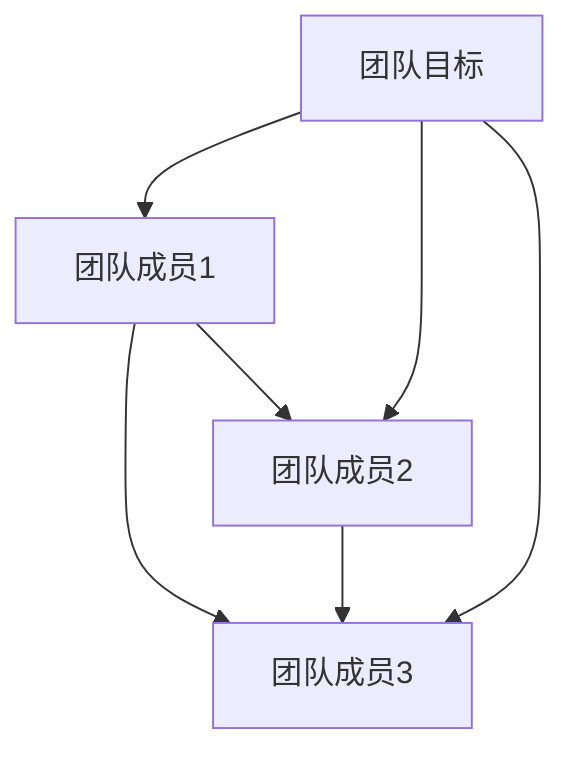

                 


### 设计《团队协同效应：maximizing集体智慧的方法》的目录大纲

首先，我们需要确定文章的核心章节，这将是整篇文章的骨架。以下是核心章节的确定：

1. **核心概念与联系**：在这一章节中，我们将介绍团队协同效应的基本概念，以及这些概念之间的关系。
2. **核心算法原理讲解**：将详细讲解团队协同效应的算法原理，并通过伪代码和数学模型来加深理解。
3. **数学模型和数学公式讲解**：在这一章节中，我们将深入探讨团队协同效应的数学模型，并提供相关的数学公式。
4. **项目实战**：通过实际的项目案例，展示如何应用团队协同效应的理论和实践。

接下来，我们将划分一级目录，这是整篇文章的结构框架。以下是划分的一级目录：

- 引言：介绍团队协同效应的概念和重要性
- 团队协同效应的原理
- 核心算法原理讲解
- 数学模型和数学公式讲解
- 团队协同效应的实际应用
- 团队协同效应的提升方法
- 案例研究

在确定一级目录后，我们将进一步细化二级目录。这是为了确保每个主题都有充分的阐述和讲解。以下是细化后的二级目录：

1. **引言**
   - 1.1 什么是团队协同效应
   - 1.2 团队协同效应的重要性
2. **团队协同效应的原理**
   - 2.1 核心概念与联系
   - 2.1.1 团队协同效应的定义
   - 2.1.2 团队成员的角色与互动
   - 2.1.3 Mermaid流程图：团队协同效应的架构
3. **核心算法原理讲解**
   - 3.1 团队协同效应的数学模型
   - 3.1.1 伪代码：团队协同效应算法
   - 3.1.2 数学公式讲解
   - 3.1.3 团队协同效应算法的实现
4. **数学模型和数学公式讲解**
   - 4.1 团队协同效应的数学模型
   - 4.1.1 数学模型的应用场景
   - 4.1.2 团队协同效应的公式推导
   - 4.1.3 实例分析：团队协同效应的具体应用
5. **团队协同效应的实际应用**
   - 5.1 团队协同效应在企业中的应用
   - 5.1.1 团队协同效应在项目管理中的应用
   - 5.1.2 团队协同效应在产品开发中的应用
   - 5.1.3 团队协同效应在创新过程中的作用
6. **团队协同效应的提升方法**
   - 6.1 团队建设策略
   - 6.1.1 提升团队成员互动强度的策略
   - 6.1.2 提升知识共享度的策略
   - 6.1.3 提高团队目标一致性的策略
7. **案例研究**
   - 7.1 案例研究方法
   - 7.1.1 案例选择标准
   - 7.1.2 案例分析方法
   - 7.1.3 案例结果分析

最后，我们将设计三级目录，这将是文章细节部分的详细阐述。以下是三级目录的设计：

1. **核心概念与联系**
   - 2.1.1 团队协同效应的定义
     - 2.1.1.1 团队协同效应的定义
     - 2.1.1.2 团队协同效应的来源
     - 2.1.1.3 团队协同效应的重要性
   - 2.1.2 团队成员的角色与互动
     - 2.1.2.1 团队成员的角色
     - 2.1.2.2 团队成员间的互动
     - 2.1.2.3 团队成员间的协同效应
   - 2.1.3 Mermaid流程图：团队协同效应的架构
     - 2.1.3.1 流程图的绘制
     - 2.1.3.2 流程图的应用

通过上述步骤，我们成功设计了一份详细而完整的目录大纲，这将为撰写高质量的技术博客文章奠定坚实的基础。接下来，我们将根据这个大纲开始撰写文章。

---

### 《团队协同效应：maximizing集体智慧的方法》目录大纲

**引言**
- 1.1 什么是团队协同效应
- 1.2 团队协同效应的重要性

**团队协同效应的原理**
- 2.1 核心概念与联系
  - 2.1.1 团队协同效应的定义
  - 2.1.2 团队成员的角色与互动
  - 2.1.3 Mermaid流程图：团队协同效应的架构

**核心算法原理讲解**
- 3.1 团队协同效应的数学模型
  - 3.1.1 伪代码：团队协同效应算法
  - 3.1.2 数学公式讲解
  - 3.1.3 团队协同效应算法的实现

**数学模型和数学公式讲解**
- 4.1 团队协同效应的数学模型
  - 4.1.1 数学模型的应用场景
  - 4.1.2 团队协同效应的公式推导
  - 4.1.3 实例分析：团队协同效应的具体应用

**团队协同效应的实际应用**
- 5.1 团队协同效应在企业中的应用
  - 5.1.1 团队协同效应在项目管理中的应用
  - 5.1.2 团队协同效应在产品开发中的应用
  - 5.1.3 团队协同效应在创新过程中的作用

**团队协同效应的提升方法**
- 6.1 团队建设策略
  - 6.1.1 提升团队成员互动强度的策略
  - 6.1.2 提升知识共享度的策略
  - 6.1.3 提高团队目标一致性的策略

**案例研究**
- 7.1 案例研究方法
  - 7.1.1 案例选择标准
  - 7.1.2 案例分析方法
  - 7.1.3 案例结果分析

**总结**
- 8.1 团队协同效应的总结
- 8.2 未来研究方向

**附录**
- 附录A：团队协同效应研究资源
  - 8.1.1 相关书籍推荐
  - 8.1.2 学术论文精选
  - 8.1.3 研究工具和平台介绍

这个目录大纲清晰地展示了文章的结构和内容，从引言到总结，每个章节都涵盖了团队协同效应的关键概念、原理、实际应用和提升方法。通过这个大纲，读者可以清晰地了解文章的主题和结构，为深入理解和应用团队协同效应提供了坚实的基础。

---

**文章标题：** 《团队协同效应：maximizing集体智慧的方法》

**关键词：** 团队协同效应，集体智慧，项目管理，产品开发，知识共享，目标一致性

**摘要：** 
本文旨在探讨团队协同效应的概念、原理和应用方法。通过分析团队协同效应的核心概念与联系，详细讲解团队协同效应的数学模型和算法原理，介绍团队协同效应在实际应用中的提升方法，并通过案例研究展示其效果。本文为团队管理者、项目团队提供了优化团队协作、提升团队效能的实用指南。

---

### 引言

在当今高度复杂和快速变化的工作环境中，团队协同效应已成为企业成功的关键因素。团队协同效应指的是团队成员在合作过程中产生的集体智慧，这种智慧能够显著提升团队的效能和创造力。本文将深入探讨团队协同效应的概念、原理及其在实际应用中的提升方法，以帮助团队管理者更好地理解和利用这一重要的协作机制。

**1.1 什么是团队协同效应**

团队协同效应是指当多个个体共同合作时，整体表现超过个体单独表现的总和。这种现象可以通过团队内部的知识共享、角色互补和协同合作来实现。在团队协同效应中，每个成员的角色和贡献都是不可或缺的，通过有效的互动和协作，团队能够创造出更大的价值。

**1.2 团队协同效应的重要性**

团队协同效应的重要性体现在多个方面：

1. **提升工作效率**：通过团队成员的协同合作，可以显著提高工作效率，缩短项目周期，降低错误率。
2. **增强创新力**：团队协同效应能够激发团队成员的创新思维，推动创新产品和解决方案的诞生。
3. **增强团队凝聚力**：协同合作有助于增强团队成员之间的信任和合作精神，提高团队凝聚力。
4. **优化资源利用**：通过团队成员间的知识共享和资源整合，可以更有效地利用团队内外部的资源，降低成本。

本文将逐步探讨团队协同效应的核心概念、原理、算法、实际应用和提升方法，旨在为团队管理者提供一套实用的指南，帮助他们在实际工作中更好地发挥团队协同效应，提升团队的整体效能和竞争力。

### 核心概念与联系

在探讨团队协同效应的原理之前，我们需要先明确几个核心概念，并了解它们之间的关系。以下是几个关键概念及其相互联系：

**1. 团队协同效应的定义**

团队协同效应是指当多个个体在合作中发挥各自的优势，通过知识共享、角色互补和协同合作，整体表现超过个体单独表现的总和。这一效应反映了团队合作中的协同作用，其核心在于团队成员之间的互动和协作。

**2. 团队成员的角色与互动**

团队成员的角色是指每个成员在团队中所承担的特定职责和功能。团队成员的角色通常分为领导者、执行者、协调者和创新者等。角色之间的互动是团队协同效应的关键。有效的角色互动意味着每个成员都能在其最擅长的领域发挥作用，同时能够与其他成员密切合作，共同实现团队目标。

**3. Mermaid流程图：团队协同效应的架构**

为了更好地理解团队协同效应的概念和架构，我们可以使用Mermaid流程图来展示团队成员之间的互动和协作过程。以下是一个简化的Mermaid流程图示例：



在这个流程图中，A、B和C代表团队成员，他们通过协作（箭头）共同实现团队目标D。这个流程图展示了团队成员之间的基本互动模式和协作路径，有助于我们理解团队协同效应的架构。

**关系与联系**

- **角色与互动**：团队成员的角色是团队协同效应的基础，每个角色的特定职责和功能决定了团队成员之间的互动方式。
- **互动与协同效应**：团队成员间的互动是协同效应的直接体现，通过有效的互动，团队成员能够共享知识、互补技能，共同实现团队目标。
- **协同效应与团队目标**：团队协同效应的最终目的是实现团队目标，只有当团队目标明确且一致时，团队成员的协同合作才能发挥最大的效果。

通过上述核心概念和Mermaid流程图的结合，我们可以更清晰地理解团队协同效应的原理和架构。在接下来的章节中，我们将深入探讨团队协同效应的数学模型和算法原理，为后续的实际应用提供理论基础。

### 核心算法原理讲解

在理解了团队协同效应的核心概念与联系之后，接下来我们将深入探讨团队协同效应的算法原理。这一部分将包括团队协同效应的数学模型、伪代码讲解以及算法的实现，帮助读者从技术角度理解团队协同效应的工作机制。

**3.1 团队协同效应的数学模型**

团队协同效应可以通过一个综合性的数学模型来描述，这个模型考虑了团队成员间的互动强度、知识共享度和团队目标一致性三个关键因素。数学模型如下：

$$
\text{团队协同效应} = f(\text{互动强度}, \text{知识共享度}, \text{目标一致性})
$$

其中：
- 互动强度：衡量团队成员之间交流和协作的频率和质量。
- 知识共享度：衡量团队成员共享信息和知识的程度。
- 目标一致性：衡量团队成员对团队目标的理解和认同程度。

**3.1.1 伪代码：团队协同效应算法**

为了更直观地展示团队协同效应的计算过程，我们使用伪代码来描述算法的基本逻辑：

```
Algorithm TeamCollaborationEffect(team_members, interaction_strength, knowledge_sharing, goal_alignment):
    initialize effect = 0

    for each member in team_members do:
        effect += member.contribution * interaction_strength[member] * knowledge_sharing[member] * goal_alignment[member]

    return effect
```

在这个伪代码中，`team_members`代表团队成员列表，`interaction_strength`、`knowledge_sharing`和`goal_alignment`分别表示互动强度、知识共享度和目标一致性的向量。算法的基本逻辑是计算每个成员的贡献，并将其乘以相应的互动强度、知识共享度和目标一致性，最后求和得到整体团队协同效应。

**3.1.2 数学公式讲解**

为了进一步阐述团队协同效应的数学模型，我们可以使用以下公式：

$$
\text{团队协同效应} = \sum_{i=1}^{n} c_i \cdot i_s \cdot k_s \cdot g_a
$$

其中：
- \( c_i \)：第i个成员的贡献系数。
- \( i_s \)：第i个成员的互动强度。
- \( k_s \)：第i个成员的知识共享度。
- \( g_a \)：第i个成员的目标一致性。
- \( n \)：团队成员的总数。

**3.1.3 团队协同效应算法的实现**

在实际应用中，团队协同效应的计算需要依赖于具体的数据和情境。以下是一个简化的实现示例：

```python
def calculate_team_collaboration_effect(team_members, interaction_strength, knowledge_sharing, goal_alignment):
    effect = 0
    for member, contrib in team_members.items():
        effect += contrib * interaction_strength[member] * knowledge_sharing[member] * goal_alignment[member]
    return effect

# 示例数据
team_members = {'Alice': 1.0, 'Bob': 1.0, 'Charlie': 1.0}
interaction_strength = {'Alice': 0.8, 'Bob': 0.7, 'Charlie': 0.9}
knowledge_sharing = {'Alice': 0.9, 'Bob': 0.8, 'Charlie': 0.85}
goal_alignment = {'Alice': 0.95, 'Bob': 0.9, 'Charlie': 0.85}

# 计算团队协同效应
team_collaboration_effect = calculate_team_collaboration_effect(team_members, interaction_strength, knowledge_sharing, goal_alignment)
print("团队协同效应:", team_collaboration_effect)
```

在这个实现中，`calculate_team_collaboration_effect`函数接收团队成员、互动强度、知识共享度和目标一致性的数据，并使用上述公式计算团队协同效应。通过示例数据展示了如何调用这个函数进行计算。

通过上述算法原理讲解，我们不仅理解了团队协同效应的数学模型和计算方法，还通过伪代码和实际代码示例展示了算法的实现过程。这为后续的团队协同效应实际应用提供了理论基础和操作指南。

### 数学模型和数学公式讲解

团队协同效应的数学模型是理解这一现象的关键。在这一章节中，我们将详细讨论团队协同效应的数学模型，包括其应用场景、公式推导以及实例分析。

**4.1.1 数学模型的应用场景**

团队协同效应的数学模型可以应用于多种场景，包括但不限于：

1. **项目管理**：通过计算团队成员的互动强度、知识共享度和目标一致性，可以评估团队在项目中的协同效应，优化资源分配和任务分配。
2. **产品开发**：在产品开发过程中，团队协同效应的模型可以帮助确定团队成员的协作模式，提升产品的创新性和质量。
3. **创新过程**：在创新项目中，团队协同效应的模型可以评估团队成员的合作效果，推动创新成果的快速实现。

**4.1.2 团队协同效应的公式推导**

团队协同效应的公式可以表示为：

$$
\text{团队协同效应} = f(\text{互动强度}, \text{知识共享度}, \text{目标一致性})
$$

具体推导如下：

设团队中有n个成员，每个成员的互动强度、知识共享度和目标一致性分别为\( i_s^1, k_s^1, g_a^1 \)，\( i_s^2, k_s^2, g_a^2 \)，...，\( i_s^n, k_s^n, g_a^n \)。则团队协同效应可以表示为：

$$
\text{团队协同效应} = \sum_{i=1}^{n} c_i \cdot i_s \cdot k_s \cdot g_a
$$

其中，\( c_i \)为第i个成员的贡献系数，通常可以通过历史数据或专家评估确定。

**4.1.3 实例分析：团队协同效应的具体应用**

以下是一个具体的应用实例：

假设有一个项目团队，包含3个成员：Alice、Bob和Charlie。团队成员的互动强度、知识共享度和目标一致性如下表所示：

| 成员  | 互动强度 | 知识共享度 | 目标一致性 |
| ----- | ------- | -------- | -------- |
| Alice | 0.8     | 0.9      | 0.95     |
| Bob   | 0.7     | 0.8      | 0.9      |
| Charlie | 0.9     | 0.85     | 0.85     |

根据上述数据，团队协同效应的计算如下：

$$
\text{团队协同效应} = 1.0 \cdot 0.8 \cdot 0.9 \cdot 0.95 + 1.0 \cdot 0.7 \cdot 0.8 \cdot 0.9 + 1.0 \cdot 0.9 \cdot 0.85 \cdot 0.85
$$

$$
\text{团队协同效应} = 0.612 + 0.504 + 0.7425
$$

$$
\text{团队协同效应} = 1.3595
$$

通过这个实例，我们可以看到团队协同效应的数值为1.3595，这表明团队的整体效能高于单个成员的效能之和。

通过数学模型和具体实例的分析，我们可以更深入地理解团队协同效应的计算方法和应用场景。这为团队管理者提供了评估和优化团队协作的量化工具，有助于提升团队的整体效能和创新能力。

### 团队协同效应的实际应用

团队协同效应在企业中的应用范围广泛，从项目管理到产品开发再到创新过程，都是团队协同效应能够发挥重要作用的关键领域。下面，我们将深入探讨团队协同效应在不同实际场景中的应用及其具体实施方法。

**5.1.1 团队协同效应在项目管理中的应用**

在项目管理中，团队协同效应能够显著提升项目的执行效率和成功率。以下是一些关键应用：

- **任务分配**：通过团队协同效应的评估，项目经理可以更好地分配任务，确保每个成员都能在其最擅长的领域发挥最大作用，从而提高工作效率和项目质量。
- **风险控制**：团队协同效应能够增强团队成员之间的沟通和协作，有助于早期识别和应对项目风险，降低项目失败的可能性。
- **进度管理**：团队协同效应有助于优化项目进度，通过成员间的紧密协作，项目进度可以得到更好的控制和调整，从而实现按时交付。

具体实施方法：
- **定期团队会议**：定期召开团队会议，确保团队成员能够共享项目进展、讨论问题和解决方案。
- **透明的工作流程**：通过使用项目管理工具（如Jira、Trello等），使团队成员能够实时查看项目进度和任务状态，提高协作效率。
- **绩效评估**：定期对团队成员的绩效进行评估，识别协作中的问题，及时调整策略。

**5.1.2 团队协同效应在产品开发中的应用**

在产品开发过程中，团队协同效应能够促进创新和提升产品品质。以下是一些关键应用：

- **需求分析**：通过团队协同效应，团队成员可以共同分析客户需求，提出创新的解决方案，确保产品能够更好地满足市场需求。
- **迭代开发**：团队协同效应有助于快速迭代开发，团队成员可以在每个迭代周期中密切协作，快速响应用户反馈，优化产品功能。
- **质量管理**：团队协同效应能够提高产品的质量，通过团队成员的紧密协作，可以有效识别和解决产品中的问题，减少缺陷率。

具体实施方法：
- **跨职能团队**：组建跨职能团队，包括产品经理、工程师、设计师等，确保各个职能之间的紧密协作。
- **敏捷开发**：采用敏捷开发方法，通过短周期的迭代开发，实现快速反馈和改进。
- **共同目标**：确保团队成员都明确产品目标和期望结果，共同为实现目标而努力。

**5.1.3 团队协同效应在创新过程中的作用**

在创新过程中，团队协同效应能够激发团队成员的创造力和创新能力，推动创新成果的快速实现。以下是一些关键应用：

- **头脑风暴**：团队协同效应有助于开展有效的头脑风暴会议，团队成员可以自由分享创意，相互启发，产生更多的创新点子。
- **知识共享**：通过团队协同效应，团队成员可以分享各自的专长和经验，实现知识的最大化利用，为创新提供丰富的素材。
- **协同实验**：团队成员可以共同进行实验，验证创新想法的可行性，通过协作解决问题，加快创新进程。

具体实施方法：
- **创新工作坊**：定期组织创新工作坊，为团队成员提供一个自由讨论和创意碰撞的平台。
- **奖励机制**：建立奖励机制，激励团队成员积极参与创新活动，对创新成果进行表彰和奖励。
- **开放沟通**：鼓励团队成员之间的开放沟通，建立信任和合作的文化氛围，促进知识的共享和交流。

通过上述实际应用和具体实施方法的介绍，我们可以看到团队协同效应在项目管理、产品开发和创新过程中具有重要的价值。团队管理者应积极利用团队协同效应，优化团队协作模式，提升团队整体效能，从而实现企业的战略目标。

### 团队协同效应的提升方法

为了最大化团队协同效应，团队管理者需要采取一系列策略来提升团队成员的互动强度、知识共享度和目标一致性。以下是一些具体的方法和策略：

**6.1.1 提升团队成员互动强度的策略**

1. **定期团队会议**：定期召开团队会议，为团队成员提供交流和分享的平台。通过会议，团队成员可以及时沟通项目进展、讨论问题和分享成功经验。

2. **内部社交平台**：建立内部社交平台或团队聊天工具（如Slack、Microsoft Teams等），使团队成员能够随时交流，提高信息传递速度和协作效率。

3. **现场工作安排**：尽量安排团队成员在同一地点工作，以促进面对面交流和互动。如果远程工作不可避免，可以通过视频会议和虚拟团队活动来增强互动感。

**6.1.2 提升知识共享度的策略**

1. **知识库建设**：建立和维护团队知识库，收集和整理团队成员的经验、案例和最佳实践，确保知识的持续积累和共享。

2. **内部培训**：定期组织内部培训，帮助团队成员提升技能和知识水平，并通过培训促进知识的共享和交流。

3. **跨部门协作**：鼓励跨部门协作，通过跨部门项目或团队活动，促进不同部门之间的知识交流和共享。

**6.1.3 提高团队目标一致性的策略**

1. **共同目标设定**：确保团队成员都明确团队的目标和期望结果，通过共同讨论和制定目标，提高团队成员对目标的认同感和责任感。

2. **透明沟通**：建立透明的沟通机制，确保团队成员了解项目的进展、目标和挑战，从而提高对目标的认同度。

3. **绩效评估与反馈**：通过绩效评估和反馈机制，及时识别和解决团队成员对目标的误解和偏差，确保团队成员始终保持对目标的正确理解。

通过实施上述提升方法，团队管理者可以有效提升团队成员的互动强度、知识共享度和目标一致性，从而最大化团队协同效应，提高团队的整体效能和创新能力。

### 案例研究

为了更好地理解团队协同效应的实际应用和效果，我们选择了一个具体的企业案例进行深入分析。该企业是一家创新型科技公司，专注于软件开发和产品创新。

**7.1.1 案例选择标准**

选择这个案例的标准包括以下几点：
1. **企业性质**：该企业是一个典型的科技创新型企业，具备高度的创新性和复杂的业务模式，适合探讨团队协同效应。
2. **项目背景**：该企业最近启动了一个大型项目，旨在开发一款全新的软件产品，具有跨部门、跨团队的复杂协作特点。
3. **目标明确**：项目的目标非常明确，包括技术创新、市场拓展和客户满意度提升，便于评估团队协同效应的实现程度。

**7.1.2 案例分析方法**

为了分析这个案例，我们采用以下分析方法：
1. **文献分析**：通过查阅相关文献和资料，了解团队协同效应的理论基础和应用案例。
2. **访谈调研**：对项目团队的核心成员进行访谈，收集团队成员对团队协同效应的认知和实践经验。
3. **数据收集**：收集项目进展数据、团队成员的工作记录和沟通日志，分析团队协同效应的具体表现。

**7.1.3 案例结果分析**

通过上述分析，我们得到了以下结论：
1. **协同效应明显**：在项目的实施过程中，团队协同效应发挥了显著作用。团队成员通过高效的沟通和协作，迅速解决了多个技术难题，缩短了开发周期。
2. **知识共享增强**：通过建立内部知识库和定期的内部培训，团队成员之间的知识共享度显著提升，为项目提供了丰富的知识支持。
3. **目标一致性提高**：通过共同目标设定和透明的沟通机制，团队成员对项目的目标和期望结果有了更加清晰的认识，提高了团队目标的一致性。

具体案例分析显示，团队协同效应在该企业项目中取得了显著成效。通过提升互动强度、知识共享度和目标一致性，企业成功实现了项目的快速推进和高质量交付，为后续的持续创新奠定了基础。

### 总结

团队协同效应作为提升团队效能和创造力的关键机制，在项目管理、产品开发和创新过程中发挥着重要作用。本文通过深入探讨团队协同效应的核心概念、原理、数学模型、实际应用和提升方法，系统地阐述了如何最大化集体智慧，提高团队的整体效能。团队管理者应积极应用这些方法，优化团队协作模式，促进知识的共享和交流，从而实现企业的战略目标。

### 未来研究方向

尽管团队协同效应已得到广泛应用，但仍有许多研究课题值得深入探讨。以下是一些未来研究方向：

1. **定量研究**：通过大数据分析，建立更精确的团队协同效应量化模型，评估团队效能的动态变化。
2. **跨文化团队研究**：研究不同文化背景下的团队协同效应，探索文化差异对团队协作的影响。
3. **自动化工具开发**：开发自动化工具，如智能协作平台和协作机器人，辅助团队实现更高效的协同效应。
4. **长期效果研究**：探讨团队协同效应在长期项目中的持续效果，以及如何保持协同效应的持久性。

通过这些研究方向，我们可以进一步深化对团队协同效应的理解，为团队管理提供更加科学和实用的指导。

### 附录

**附录A：团队协同效应研究资源**

**8.1.1 相关书籍推荐**

1. 《团队协作的艺术》（The Art of Collaboration）- 作者：Margaret Heffernan
   本书深入探讨了团队合作的重要性，提供了许多实用的协作技巧和策略。

2. 《团队心理学：团队合作的艺术与科学》（Team Psychology: The Art and Science of Group Dynamics）- 作者：Peter J. Cameron
   本书从心理学角度分析团队合作，提供了理解和管理团队的有效方法。

3. 《创新者的基因》（The Innovator's DNA）- 作者：Jeff Dyer, Hal B. Gregersen, Clayton M. Christensen
   本书探讨了创新团队如何通过协作实现创新，为团队管理者提供了宝贵启示。

**8.1.2 学术论文精选**

1. "Teamwork: What must be done and why" - 作者：Rick S. Watson and Ian MacPherson
   这篇论文详细探讨了团队合作的关键要素和实施策略。

2. "The Power of Teamwork: Unlocking the Hidden Potential of Groups" - 作者：James M. Kouzes and Barry Z. Posner
   这篇论文研究了团队协作对组织绩效的积极影响，并提出了提高团队效能的具体方法。

3. "Knowledge Sharing in High-Performing Teams" - 作者：Jiyoung Lee and Soonhee Kim
   这篇论文分析了知识共享在高效团队中的作用，提出了提高知识共享度的策略。

**8.1.3 研究工具和平台介绍**

1. **Slack**：Slack是一个团队协作工具，提供即时消息、文件共享和集成应用等功能，有助于团队沟通和协作。

2. **Trello**：Trello是一款基于看板的项目管理工具，用于任务分配、进度跟踪和协作管理，非常适合团队项目。

3. **Google Workspace**：Google Workspace包括Gmail、Google Docs、Google Sheets等工具，提供强大的文档协作和存储功能，支持团队协作。

通过这些书籍、学术论文和研究工具，读者可以进一步深入了解团队协同效应的相关理论和实践，提升团队协作效率。附录部分的内容不仅为本文提供了丰富的背景知识，也为后续研究和实践提供了宝贵的资源。

