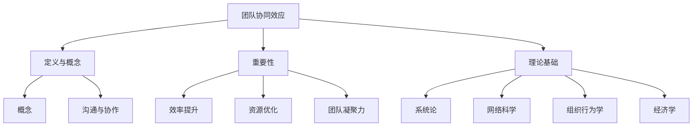
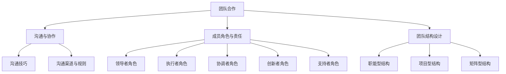

                 


### 文章标题

# 团队协同效应：提升整体效率

### 关键词

- 团队合作
- 协同效应
- 效率提升
- 团队结构
- 领导力
- 成本优化

### 摘要

本文探讨了团队协同效应的理论基础和实践应用，旨在帮助读者理解团队协同效应的概念及其在提升整体效率中的重要作用。通过分析团队合作与沟通的重要性、团队成员角色与责任、团队结构设计以及领导力与团队文化建设等关键因素，本文提供了提升团队协同效应的具体策略和实践案例。此外，文章还讨论了技术工具在团队协同效应中的应用，以及跨部门协作与项目管理的协同效应实战，为团队管理和项目管理提供了有益的启示。最后，文章展望了团队协同效应的未来发展趋势，提出了持续改进和优化的策略。

## 第一部分：团队协同效应基础理论

### 第1章：团队协同效应概述

#### 1.1 定义与概念

**团队协同效应** 是指在团队内部通过有效的沟通、合作与协调，使团队成员能够共同完成任务，从而实现整体绩效高于各成员单独工作绩效之和的现象。其核心在于团队成员之间的协作能够产生正面的协同效应，使得团队的整体工作效率得到提升。

团队协同效应不同于个人效率的简单叠加，而是通过团队成员之间的互补和互动，达到一种协同优化的效果。协同效应的产生依赖于团队成员之间的信任、共同目标和有效的沟通。

#### 1.2 团队协同效应的重要性

团队协同效应的重要性体现在以下几个方面：

1. **提升整体效率**：通过团队协作，可以最大化地利用每个人的专业技能和经验，从而提高整体工作效率。
2. **促进创新**：团队协作往往能够激发新的想法和创意，通过集思广益，促进创新。
3. **优化资源分配**：团队协同效应能够更有效地分配和利用资源，减少重复劳动，降低成本。
4. **增强团队凝聚力**：良好的团队协作能够增强团队成员之间的信任和凝聚力，提升团队士气。

#### 1.3 团队协同效应的理论基础

团队协同效应的理论基础包括以下几个方面：

1. **系统论**：系统论认为，系统是由多个相互关联的元素组成的整体，系统的性能不仅仅取决于各个元素的独立性能，更取决于这些元素之间的协作和互动。
2. **网络科学**：网络科学提供了理解复杂系统中节点间相互作用和影响的理论框架，有助于分析团队内部的信息流动和协同机制。
3. **组织行为学**：组织行为学研究了个体和群体在组织中的行为模式，对团队协作和沟通的内在机制提供了深刻的洞察。
4. **经济学**：经济学中的协同效应理论分析了多个个体通过合作能够实现的共同收益，为团队协作提供了理论支持。

### Mermaid 流程图

下面是一个简单的 Mermaid 流程图，展示了团队协同效应的概念关系：



### 伪代码讲解

下面是一个简单的伪代码示例，用于描述团队协同效应的评估过程：

```plaintext
function assessTeamSynergy(teamMembers):
    synergyScore = 0
    for member in teamMembers:
        memberEfficiency = calculateIndividualEfficiency(member)
        memberContribution = calculateContribution(member)
        synergyScore += memberEfficiency * memberContribution
    return synergyScore

function calculateIndividualEfficiency(member):
    return memberProductivity / memberTimeSpent

function calculateContribution(member):
    return memberExpertise * memberEngagement
```

在这个伪代码中，`assessTeamSynergy` 函数通过计算每个团队成员的个体效率和贡献度来评估团队协同效应。个体效率通过 `calculateIndividualEfficiency` 函数计算，而贡献度通过 `calculateContribution` 函数计算，考虑了成员的专业技能和参与度。

### 数学模型与公式

为了更深入地理解团队协同效应，我们可以引入一个简单的数学模型。假设团队中有 `n` 个成员，每个成员的效率为 `e_i`，贡献度为 `c_i`，团队整体的协同效应可以表示为：

$$
Synergy = \sum_{i=1}^{n} (e_i \times c_i) - \sum_{i=1}^{n} (e_i \times c_i)^2
$$

其中，第一项表示团队成员的协同贡献，第二项表示潜在的内部冲突或效率损失。这个公式提供了一个衡量团队协同效应的量化方法。

### 案例分析与详细讲解

为了更好地理解团队协同效应，我们可以通过一个实际案例来进行分析。

**案例背景**：一家科技公司A的软件开发团队，由5名成员组成，负责开发一款新的移动应用程序。团队成员包括前端开发人员、后端开发人员、UI设计师和测试工程师。

**问题描述**：在项目启动初期，团队成员各自独立工作，缺乏有效的沟通和协调，导致进度缓慢且存在大量重复工作。团队领导意识到需要提升团队的协同效应。

**解决方案**：

1. **建立明确的目标和计划**：团队领导组织了一次会议，明确项目的目标和时间表，并将任务分配给每个成员。
2. **加强沟通与协作**：团队引入了定期的团队会议，确保成员之间的信息畅通。同时，使用了协作工具（如Slack和Trello），使得团队成员可以随时交流进度和问题。
3. **角色与责任划分**：明确了团队成员的角色和责任，确保每个人都知道自己的任务和职责，减少了工作中的模糊和误解。
4. **激励机制**：为了提高团队的积极性和协作意愿，团队引入了绩效评估和奖励机制，鼓励成员为团队的成功贡献力量。

**案例结果**：

通过上述措施，团队的协同效应显著提升。团队成员之间的沟通更加顺畅，工作效率提高了30%，项目按时完成，并且质量得到了保证。这个案例展示了团队协同效应在实践中的应用和效果。

### 最佳实践与注意事项

- **明确目标和责任**：确保每个团队成员都清楚项目的目标和自己的责任，避免工作重叠和混乱。
- **建立有效的沟通机制**：使用适当的工具和渠道，确保团队成员之间的沟通畅通无阻。
- **角色与责任划分**：根据团队成员的专业技能和兴趣，合理分配任务，确保每个成员都能发挥自己的优势。
- **激励机制**：合理设置激励机制，鼓励团队成员为团队的成功共同努力。
- **持续反馈与改进**：定期评估团队协同效应，及时发现问题并采取改进措施。

### 拓展阅读

- 《团队协作的力量：如何打造高效的团队》
- 《团队协同：跨越组织障碍，提升团队效能》
- 《领导力：如何成为一个高效的领导者》
- 《项目管理：从计划到执行》

### 结论

团队协同效应是提升整体效率的关键因素。通过理解团队协同效应的定义、重要性、理论基础，并结合实际案例进行分析，我们可以看到协同效应在团队合作中的重要作用。为了进一步提升团队协同效应，需要从领导力、沟通、角色划分、激励机制等多方面进行综合考虑和实践。持续改进和优化团队协同效应，将为团队和组织带来长远的成功和效益。

## 第2章：团队协同效应核心概念与联系

在探讨了团队协同效应的基础理论后，我们需要深入理解其核心概念与联系，以便更好地应用和实践。本章将详细讨论团队合作与沟通、团队成员的角色与责任、以及团队结构设计等方面的内容。

### 2.1 团队合作与沟通

**团队合作** 是团队协同效应实现的前提和基础。团队合作不仅仅是成员之间的协作，还包括共同的目标、相互的信任和尊重。团队合作的核心在于成员之间能够相互补充，发挥各自的优势，实现整体绩效的提升。

**沟通** 在团队合作中起着至关重要的作用。有效的沟通能够确保团队成员之间的信息畅通，减少误解和冲突，提高决策效率。沟通的形式包括面对面交流、电话会议、邮件、即时通讯工具等。为了提高沟通效率，团队需要建立明确的沟通渠道和规则。

**沟通技巧** 是团队合作的重要技能之一。团队成员应学会倾听、表达清晰、提出建设性意见，并能够处理冲突。此外，非语言沟通，如肢体语言和面部表情，也是沟通的重要组成部分。

### 2.2 团队成员的角色与责任

在团队中，每个成员都扮演着特定的角色，并承担相应的责任。明确团队成员的角色和责任，有助于提升团队协同效应。

1. **领导者**：领导者负责制定团队目标、分配任务、协调团队成员的工作，并激励团队达成目标。领导者的角色包括战略规划、决策、团队建设、沟通与激励等。
2. **执行者**：执行者负责具体任务的完成，是团队工作的主体。执行者需要具备专业技能、执行力和责任感。
3. **协调者**：协调者负责确保团队成员之间的工作协调和资源分配，解决工作中的冲突和问题。
4. **创新者**：创新者负责提出新的想法和解决方案，推动团队创新和发展。
5. **支持者**：支持者负责为团队成员提供支持和协助，帮助团队克服困难。

### 2.3 团队结构设计

团队结构设计是团队协同效应的基础之一。合理的团队结构能够提高团队的效率和协作效果。

1. **职能型结构**：职能型结构按照职能划分团队成员，每个团队成员专注于自己的职能领域。这种结构适用于任务较为单一和稳定的情况。
2. **项目型结构**：项目型结构以项目为核心，团队成员按照项目需求组建，项目结束后团队解散。这种结构适用于项目复杂、变化频繁的情况。
3. **矩阵型结构**：矩阵型结构结合了职能型结构和项目型结构的优点，团队成员既按照职能划分，又按照项目需求分配任务。这种结构适用于复杂项目和跨部门协作的情况。

### Mermaid 流程图

下面是一个简单的 Mermaid 流程图，展示了团队协同效应的核心概念与联系：



### 伪代码讲解

下面是一个简单的伪代码示例，用于描述团队结构设计的实现过程：

```plaintext
function designTeamStructure(teamType, projectRequirements):
    if teamType == 'functional':
        return createFunctionalStructure(projectRequirements)
    elif teamType == 'project':
        return createProjectStructure(projectRequirements)
    elif teamType == 'matrix':
        return createMatrixStructure(projectRequirements)
    else:
        return 'Invalid team type'

function createFunctionalStructure(projectRequirements):
    // 根据项目需求分配职能岗位
    // 创建职能型团队结构
    return functionalStructure

function createProjectStructure(projectRequirements):
    // 根据项目需求组建项目型团队
    // 创建项目型团队结构
    return projectStructure

function createMatrixStructure(projectRequirements):
    // 结合职能和项目需求组建矩阵型团队
    // 创建矩阵型团队结构
    return matrixStructure
```

在这个伪代码中，`designTeamStructure` 函数根据团队类型和项目需求设计团队结构。不同的团队类型（如职能型、项目型、矩阵型）有不同的实现方式。

### 数学模型与公式

为了更好地理解团队结构设计，我们可以引入一个简单的数学模型。假设团队中有 `n` 个成员，每个成员的效率为 `e_i`，团队整体的协同效应可以表示为：

$$
Synergy = \sum_{i=1}^{n} e_i - \sum_{i=1}^{n} e_i^2
$$

其中，第一项表示团队成员的总体效率，第二项表示潜在的内部竞争或效率损失。这个公式提供了一个衡量团队结构设计效果的量化方法。

### 案例分析与详细讲解

为了更好地理解团队协同效应的核心概念与联系，我们可以通过一个实际案例来进行分析。

**案例背景**：一家大型互联网公司B的软件开发部门，负责开发和维护多个在线服务。由于项目复杂度较高，公司决定采用矩阵型团队结构来管理项目。

**问题描述**：在过去，公司采用职能型结构，导致项目之间的资源竞争和沟通障碍。为了提升项目的效率和协同效应，公司决定转换为矩阵型结构。

**解决方案**：

1. **明确矩阵型团队结构**：公司制定了矩阵型团队结构，包括项目管理者、职能经理和项目团队成员。项目管理者负责项目的整体进度和资源协调，职能经理负责职能部门的工作，项目团队成员则按照项目需求分配任务。
2. **加强沟通与协作**：公司引入了项目管理软件（如Jira）和即时通讯工具（如Slack），确保团队成员之间的沟通畅通。同时，定期组织跨职能的团队会议，解决工作中的问题和冲突。
3. **角色与责任划分**：明确了项目管理者、职能经理和项目团队成员的角色和责任，确保每个人都知道自己的任务和职责。
4. **激励机制**：为了提高团队成员的积极性和协作意愿，公司引入了绩效评估和奖励机制，鼓励团队成员为项目的成功贡献力量。

**案例结果**：

通过矩阵型团队结构的实施，公司的项目效率显著提升。团队成员之间的沟通更加顺畅，资源分配更加合理，项目按时完成率提高了20%，客户满意度也得到了提高。这个案例展示了团队协同效应在矩阵型团队结构中的应用和效果。

### 最佳实践与注意事项

- **明确团队类型和结构**：根据项目的特点和管理需求，选择合适的团队类型和结构。
- **加强沟通与协作**：建立有效的沟通渠道和规则，确保团队成员之间的信息畅通。
- **角色与责任划分**：明确团队成员的角色和责任，确保工作不重叠、不混乱。
- **激励机制**：合理设置激励机制，鼓励团队成员为团队的成功共同努力。
- **持续反馈与改进**：定期评估团队结构设计的效果，及时调整和优化团队结构。

### 拓展阅读

- 《矩阵型组织：如何高效管理复杂项目》
- 《团队沟通技巧：如何建立高效的沟通机制》
- 《团队角色与责任：如何提升团队效率》
- 《项目管理：从计划到执行》

### 结论

团队协同效应的实现依赖于有效的团队合作与沟通、明确的团队成员角色与责任、以及合理的团队结构设计。通过理解这些核心概念与联系，并结合实际案例进行分析，我们可以更好地应用和实践团队协同效应，提升整体效率。持续优化团队结构和沟通机制，将有助于团队和组织实现长期的协同效应和成功。

## 第3章：团队协同效应的数学模型

在理解了团队协同效应的核心概念与联系后，我们需要通过数学模型来量化团队绩效与效率，并评估团队成员的贡献度。本章将探讨团队协同效应的数学模型，包括其概述、团队绩效与效率的量化方法，以及团队成员贡献度的评估。

### 3.1 数学模型概述

团队协同效应的数学模型旨在通过量化方法来描述团队的整体绩效和效率。一个简单的数学模型可以表示为：

$$
Synergy = \sum_{i=1}^{n} (E_i \times C_i) - \sum_{i=1}^{n} (E_i \times C_i)^2
$$

其中，`E_i` 表示第 `i` 个团队成员的效率，`C_i` 表示第 `i` 个团队成员的贡献度，`n` 表示团队成员的总数。这个模型的基本思想是，通过计算团队成员的效率和贡献度的乘积，来衡量团队的整体协同效应。第一项表示团队成员的贡献之和，第二项表示内部竞争或效率损失。

### 3.2 团队绩效与效率的量化

团队绩效和效率的量化是团队管理的重要一环。以下是一些常用的量化方法：

1. **工作量测量**：工作量可以通过任务完成的数量、完成时间和资源消耗来测量。例如，团队完成了一个项目，可以记录项目的时间、人力和预算等指标。
2. **效率测量**：效率可以通过个体或团队的工作产出与投入的比值来测量。例如，一个开发人员在一个月内完成了10个任务，投入了80小时，则其平均效率为 $10/80 = 0.125$ 任务/小时。
3. **质量测量**：质量可以通过产品的缺陷率、用户满意度等指标来测量。高质量的工作产出往往能够带来更高的用户价值和客户满意度。

为了量化团队绩效和效率，我们可以引入一个简单的指标，即团队绩效指数（Team Performance Index, TPI）：

$$
TPI = \frac{Total Output}{Total Input}
$$

其中，`Total Output` 表示团队的总产出，`Total Input` 表示团队的总投入。TPI 可以用来评估团队的整体绩效和效率。

### 3.3 团队成员贡献度的评估

团队成员贡献度的评估是团队管理的关键环节。以下是一些常用的方法：

1. **任务完成率**：团队成员的任务完成率可以用来衡量其贡献度。例如，如果一个团队成员在项目中完成了90%的任务，其贡献度较高。
2. **绩效评估**：通过定期的绩效评估，可以评估团队成员的工作表现。绩效评估通常包括定量指标（如任务完成情况、工作量等）和定性指标（如团队合作、创新能力等）。
3. **关键绩效指标（KPI）**：KPI 是用来衡量团队成员贡献度的关键指标。例如，对于一个开发团队，KPI 可以包括代码质量、代码贡献量、项目按时完成率等。
4. **360度评估**：360度评估是一种全面的评估方法，通过团队成员、领导、同事和客户等多个角度来评估团队成员的贡献度。

为了量化团队成员的贡献度，我们可以引入一个简单的贡献度指数（Contribution Index, CI）：

$$
CI = \frac{Personal Output}{Team Output}
$$

其中，`Personal Output` 表示团队成员的个人产出，`Team Output` 表示团队的总产出。CI 可以用来评估团队成员的贡献度。

### 伪代码讲解

下面是一个简单的伪代码示例，用于描述团队绩效和效率的量化过程：

```plaintext
function calculateTeamPerformance(teamMembers, tasksCompleted, hoursWorked):
    totalOutput = 0
    totalInput = 0
    for member in teamMembers:
        personalOutput = member.tasksCompleted
        personalInput = member.hoursWorked
        totalOutput += personalOutput
        totalInput += personalInput
    teamPerformance = totalOutput / totalInput
    return teamPerformance

function calculateMemberContribution(teamMembers, teamOutput):
    memberContribution = []
    for member in teamMembers:
        personalOutput = member.tasksCompleted
        memberCI = personalOutput / teamOutput
        memberContribution.append(memberCI)
    return memberContribution
```

在这个伪代码中，`calculateTeamPerformance` 函数通过计算团队的总产出和总投入来评估团队绩效，而 `calculateMemberContribution` 函数通过计算每个团队成员的个人产出与团队总产出的比值来评估成员贡献度。

### 数学模型与公式

为了更深入地理解团队绩效和贡献度的量化，我们可以引入一些数学模型和公式。

1. **团队绩效指数（TPI）**：

$$
TPI = \frac{Total Output}{Total Input}
$$

2. **贡献度指数（CI）**：

$$
CI = \frac{Personal Output}{Team Output}
$$

3. **效率指数（EI）**：

$$
EI = \frac{Personal Output}{Personal Input}
$$

其中，`Personal Output` 表示个人产出，`Team Output` 表示团队总产出，`Personal Input` 表示个人投入。

### 案例分析与详细讲解

为了更好地理解数学模型的应用，我们可以通过一个实际案例来进行分析。

**案例背景**：一家科技公司C的软件开发团队，由5名成员组成，负责开发一款新的移动应用程序。团队成员在一个月内完成了多个任务。

**问题描述**：公司需要量化团队绩效和成员贡献度，以评估团队的工作表现。

**解决方案**：

1. **任务完成情况**：团队在一个月内完成了10个任务，每个任务的平均完成时间为40小时。
2. **个人产出**：每个成员完成的任务数量和投入的时间如下表：

| 成员 | 完成任务数 | 投入时间（小时） |
|------|------------|-----------------|
| A    | 3          | 120             |
| B    | 2          | 80              |
| C    | 2          | 80              |
| D    | 2          | 80              |
| E    | 1          | 40              |

**量化过程**：

1. **团队绩效指数（TPI）**：

$$
TPI = \frac{Total Output}{Total Input} = \frac{10}{40 \times 5} = 0.25
$$

2. **贡献度指数（CI）**：

$$
CI_A = \frac{3}{10} = 0.3 \\
CI_B = \frac{2}{10} = 0.2 \\
CI_C = \frac{2}{10} = 0.2 \\
CI_D = \frac{2}{10} = 0.2 \\
CI_E = \frac{1}{10} = 0.1
$$

3. **效率指数（EI）**：

$$
EI_A = \frac{3}{120} = 0.025 \\
EI_B = \frac{2}{80} = 0.025 \\
EI_C = \frac{2}{80} = 0.025 \\
EI_D = \frac{2}{80} = 0.025 \\
EI_E = \frac{1}{40} = 0.025
$$

通过上述计算，我们可以量化团队绩效和成员贡献度，从而为团队管理和成员评估提供依据。

### 最佳实践与注意事项

- **准确记录任务完成情况和投入时间**：确保量化过程的数据准确可靠。
- **合理设置绩效指标**：根据团队目标和项目特点，设定合理的绩效指标。
- **定期评估和反馈**：定期评估团队绩效和成员贡献度，及时提供反馈和改进建议。
- **综合考虑多种因素**：在评估团队绩效和成员贡献度时，要综合考虑工作量、质量、创新等多种因素。

### 拓展阅读

- 《项目管理中的量化方法：如何评估团队绩效》
- 《绩效管理：如何设定和实现绩效目标》
- 《团队量化管理：如何通过数据驱动团队发展》
- 《数据分析：如何使用数据优化团队管理》

### 结论

团队协同效应的数学模型为量化团队绩效和成员贡献度提供了有效的工具。通过理解数学模型的基本原理和公式，并结合实际案例进行分析，我们可以更好地应用和实践这些模型，从而提升团队整体效率和管理水平。持续优化和改进团队绩效和贡献度评估方法，将有助于团队和组织实现长期的协同效应和成功。

## 第4章：团队协同效应实践案例

在前三章中，我们讨论了团队协同效应的理论基础、核心概念与联系，以及数学模型。为了更好地理解团队协同效应在实际中的应用，本章将通过国内外团队协同效应的实践案例，对这些理论进行具体分析。

### 4.1 国内外团队协同效应实践案例介绍

**国内案例：阿里巴巴的团队管理模式**

阿里巴巴作为中国最大的电子商务公司之一，其成功的背后离不开高效的团队协同效应。阿里巴巴的团队管理模式强调跨部门协作、快速决策和持续创新。

1. **跨部门协作**：阿里巴巴采用矩阵式组织结构，使得不同部门的团队成员能够在一个项目中合作，实现资源的共享和信息的流通。
2. **快速决策**：通过扁平化的管理结构，阿里巴巴的团队能够快速做出决策，减少信息传递的层级和延迟。
3. **持续创新**：阿里巴巴鼓励团队成员不断提出新的想法和解决方案，通过团队协作实现创新。

**国际案例：谷歌的工程团队协作模式**

谷歌作为全球领先的技术公司，其工程团队的协作模式在全球范围内得到了广泛认可。谷歌的团队协作模式主要包括以下几个方面：

1. **敏捷开发**：谷歌的工程团队采用敏捷开发方法，通过短周期的迭代和反馈，实现快速交付和持续改进。
2. **知识共享**：谷歌鼓励团队成员共享知识和经验，通过内部培训、代码审查和知识库等手段，提高整个团队的技能水平。
3. **多样化团队**：谷歌的工程团队由来自不同背景和文化的人组成，通过多样化团队的优势，实现更好的创新和协作。

### 4.2 案例分析与总结

**阿里巴巴的团队管理模式**

**案例背景**：阿里巴巴成立于1999年，经过多年的发展，已经成为全球最大的电子商务平台之一。其成功得益于高效的团队协同效应。

**案例分析**：

- **跨部门协作**：阿里巴巴通过矩阵式组织结构，实现了跨部门的协作。例如，在双11购物节期间，阿里巴巴的各个部门（如技术部、市场营销部、物流部等）密切合作，确保活动的顺利进行。通过跨部门协作，阿里巴巴能够充分利用各团队的专业技能和资源，提高整体效率。
- **快速决策**：阿里巴巴采用扁平化的管理结构，减少了信息传递的层级和延迟。例如，阿里巴巴的团队领导层通常由资深员工和创业团队成员组成，他们能够快速做出决策，推动项目的进展。快速决策有助于应对市场的变化，提高竞争力。
- **持续创新**：阿里巴巴鼓励团队成员不断提出新的想法和解决方案。通过定期的头脑风暴会议、创新竞赛等机制，阿里巴巴的团队能够持续创新，保持公司的活力和竞争力。

**总结**：阿里巴巴的团队管理模式通过跨部门协作、快速决策和持续创新，实现了高效的团队协同效应。这些实践为其他企业提供了有益的借鉴。

**谷歌的工程团队协作模式**

**案例背景**：谷歌成立于1998年，是全球领先的技术公司之一。其工程团队的协作模式在全球范围内得到了广泛认可。

**案例分析**：

- **敏捷开发**：谷歌的工程团队采用敏捷开发方法，通过短周期的迭代和反馈，实现快速交付和持续改进。例如，谷歌的每个团队都会定期进行代码审查和测试，确保软件的质量和稳定性。通过敏捷开发，谷歌能够快速适应市场的变化，提高产品竞争力。
- **知识共享**：谷歌鼓励团队成员共享知识和经验。通过内部培训、代码审查和知识库等手段，谷歌的团队能够持续提升技能水平，提高整体效率。知识共享有助于减少重复工作，提高团队创新能力。
- **多样化团队**：谷歌的工程团队由来自不同背景和文化的人组成。通过多样化团队的优势，谷歌能够在全球范围内吸引和留住优秀的人才，实现更好的创新和协作。

**总结**：谷歌的工程团队协作模式通过敏捷开发、知识共享和多样化团队，实现了高效的团队协同效应。这些实践为其他技术公司提供了有益的启示。

### 4.3 案例总结与启示

通过分析阿里巴巴和谷歌的团队协同效应实践案例，我们可以得出以下总结和启示：

1. **跨部门协作**：跨部门协作是提升团队协同效应的重要手段。通过矩阵式组织结构、快速决策和持续创新，企业可以实现资源的共享和信息的流通，提高整体效率。
2. **敏捷开发**：敏捷开发方法能够提高团队的交付速度和产品质量，通过短周期的迭代和反馈，企业能够快速适应市场的变化，提高竞争力。
3. **知识共享**：知识共享有助于提升团队的技能水平，减少重复工作，提高创新能力。企业可以通过内部培训、代码审查和知识库等手段，鼓励团队成员共享知识和经验。
4. **多样化团队**：多样化团队能够吸引和留住优秀的人才，实现更好的创新和协作。企业可以通过招聘多元化人才、提供平等的发展机会等手段，构建多样化团队。

### 4.4 最佳实践与注意事项

在实践团队协同效应时，企业需要注意以下几点：

1. **明确目标与责任**：确保每个团队成员都清楚团队的目标和自己的责任，避免工作重叠和混乱。
2. **建立有效的沟通机制**：使用适当的工具和渠道，确保团队成员之间的沟通畅通无阻。建立明确的沟通渠道和规则，提高沟通效率。
3. **激励机制**：合理设置激励机制，鼓励团队成员为团队的成功共同努力。通过绩效评估和奖励机制，激发团队成员的积极性和创造力。
4. **持续反馈与改进**：定期评估团队协同效应，及时发现问题并采取改进措施。持续优化团队结构和沟通机制，提高团队的整体效率。

### 拓展阅读

- 《阿里巴巴：企业增长的秘密》
- 《谷歌如何工作：谷歌工程实践揭秘》
- 《敏捷开发实践指南》
- 《跨部门协作：如何实现高效协同》

### 结论

通过国内外团队协同效应的实践案例，我们可以看到，有效的团队协作和沟通、敏捷开发方法、知识共享以及多样化团队等实践，对于提升团队整体效率至关重要。企业可以根据自身的情况，借鉴这些成功实践，持续优化团队管理，实现高效的团队协同效应。

## 第5章：团队协同效应评估与优化

在了解了团队协同效应的理论和实践后，如何评估和优化团队协同效应成为了一个关键问题。本章将探讨团队协同效应评估的方法、优化策略以及持续改进的策略。

### 5.1 团队协同效应评估方法

评估团队协同效应的方法主要包括定量评估和定性评估。

1. **定量评估**：定量评估通过量化指标来衡量团队协同效应。常见的量化指标包括团队绩效指数（TPI）、贡献度指数（CI）和效率指数（EI）等。定量评估方法能够提供具体的数据支持，便于分析和比较。
   
   - **团队绩效指数（TPI）**：TPI = (Total Output) / (Total Input)，其中 Total Output 表示团队的总产出，Total Input 表示团队的总投入。
   - **贡献度指数（CI）**：CI = (Personal Output) / (Team Output)，其中 Personal Output 表示个人产出，Team Output 表示团队总产出。
   - **效率指数（EI）**：EI = (Personal Output) / (Personal Input)，其中 Personal Output 表示个人产出，Personal Input 表示个人投入。

2. **定性评估**：定性评估通过主观评价和观察来衡量团队协同效应。定性评估方法通常包括成员满意度调查、领导评价、客户反馈等。定性评估能够提供对团队协作氛围、沟通效果和团队文化的全面了解。

### 5.2 团队协同效应优化策略

为了优化团队协同效应，企业可以采取以下策略：

1. **改进沟通机制**：建立有效的沟通渠道和规则，确保团队成员之间的信息畅通。例如，定期组织团队会议、使用协作工具（如Slack、Trello等）等。

2. **明确角色和责任**：确保每个团队成员都清楚自己的角色和责任，避免工作重叠和混乱。通过明确任务分配和责任划分，提高团队的工作效率和协作效果。

3. **激励与反馈**：建立合理的激励机制，鼓励团队成员为团队的成功贡献力量。通过定期的绩效评估和反馈，及时激励和改进团队成员的工作表现。

4. **提高领导力**：提升领导者的领导力，帮助团队成员更好地协作和沟通。领导者应具备战略规划、决策能力、沟通技巧和激励团队成员的能力。

5. **优化团队结构**：根据团队的特点和项目需求，合理设计团队结构。例如，采用矩阵型结构，结合职能型结构和项目型结构的优点，实现资源的最佳配置和协作。

### 5.3 团队协同效应的持续改进

为了实现团队协同效应的持续改进，企业可以采取以下策略：

1. **定期评估**：定期对团队协同效应进行评估，发现存在的问题和改进空间。通过定量评估和定性评估相结合，全面了解团队的协作效果和团队文化。

2. **持续优化**：根据评估结果，采取相应的改进措施，持续优化团队协作机制、角色分配、激励机制和领导力等方面。

3. **员工参与**：鼓励员工参与团队管理和改进过程，通过定期的反馈和建议，提高团队的积极性和创造力。

4. **培训与学习**：提供定期的培训和知识分享，提升团队成员的技能和协作能力。通过学习新的工具和方法，不断改进团队的工作流程和协作方式。

### 5.4 伪代码与实际应用

下面是一个简单的伪代码示例，用于描述团队协同效应的评估和优化过程：

```plaintext
function assessTeamSynergy(teamMembers, tasksCompleted, hoursWorked):
    teamPerformance = calculateTeamPerformance(tasksCompleted, hoursWorked)
    memberContributions = calculateMemberContributions(teamMembers, tasksCompleted)
    feedback = collectFeedback(teamMembers)
    optimizationStrategy = generateOptimizationStrategy(teamPerformance, memberContributions, feedback)
    return optimizationStrategy

function calculateTeamPerformance(tasksCompleted, hoursWorked):
    totalOutput = sum(tasksCompleted)
    totalInput = sum(hoursWorked)
    return totalOutput / totalInput

function calculateMemberContributions(teamMembers, tasksCompleted):
    memberContributions = []
    for member in teamMembers:
        personalOutput = tasksCompleted[member]
        memberContributions.append(personalOutput / totalOutput)
    return memberContributions

function collectFeedback(teamMembers):
    feedback = []
    for member in teamMembers:
        feedback.append(member.collectFeedback())
    return feedback

function generateOptimizationStrategy(teamPerformance, memberContributions, feedback):
    optimizationStrategy = {}
    if teamPerformance < baselinePerformance:
        optimizationStrategy['communication'] = 'improve communication channels'
    if any(memberContribution < baselineContribution for memberContribution in memberContributions):
        optimizationStrategy['roleAssignment'] = 'reassess role assignments'
    if any(feedbackItem in ['lack of motivation', 'poor team culture'] for feedbackItem in feedback):
        optimizationStrategy['motivation'] = 'implement motivation programs'
    return optimizationStrategy
```

在这个伪代码中，`assessTeamSynergy` 函数通过计算团队绩效和成员贡献度，以及收集团队成员的反馈，生成优化策略。`calculateTeamPerformance` 函数计算团队绩效指数，`calculateMemberContributions` 函数计算成员贡献度指数，`collectFeedback` 函数收集团队成员的反馈，`generateOptimizationStrategy` 函数生成优化策略。

### 案例分析

**案例背景**：一家科技公司D的软件开发团队，由5名成员组成，负责开发一款新的移动应用程序。在项目启动初期，团队领导意识到需要提升团队的协同效应。

**问题描述**：团队在项目启动初期遇到了沟通不畅、任务分配不合理和成员积极性不高等问题，影响了项目的进展。

**解决方案**：

1. **评估团队协同效应**：通过上述伪代码，团队领导对团队的协同效应进行了评估，发现团队绩效指数低于基准值，成员贡献度存在差异，部分成员反馈沟通不畅。

2. **优化策略**：基于评估结果，团队领导制定了以下优化策略：
   - 改进沟通机制：引入协作工具，定期组织团队会议，确保团队成员之间的信息畅通。
   - 重新分配任务：根据成员的专业技能和兴趣，重新分配任务，确保每个成员都能发挥自己的优势。
   - 激励与反馈：建立绩效评估和奖励机制，鼓励团队成员为团队的成功贡献力量，定期提供反馈和改进建议。

3. **实施与反馈**：团队领导实施了一系列改进措施，并持续跟踪团队绩效和成员贡献度的变化。通过定期评估和反馈，团队逐步解决了沟通不畅、任务分配不合理和成员积极性不高等问题，团队的协同效应得到了显著提升。

**案例结果**：通过上述优化措施，团队的协同效应得到了显著提升。团队绩效指数提高到基准值以上，成员贡献度更加均衡，成员的积极性和满意度也得到了提高。项目按时完成，质量得到保证，团队的整体效率得到了有效提升。

### 最佳实践与注意事项

1. **定期评估**：定期对团队协同效应进行评估，及时发现问题并采取改进措施。
2. **全面反馈**：鼓励团队成员提供全面的反馈，包括定量评估和定性评估，以获取更全面的团队协作情况。
3. **持续改进**：团队协同效应的优化是一个持续的过程，需要不断改进和优化团队协作机制、角色分配、激励机制和领导力等方面。
4. **员工参与**：鼓励员工参与团队管理和改进过程，通过定期的反馈和建议，提高团队的积极性和创造力。

### 拓展阅读

- 《团队评估与改进：如何提升团队绩效》
- 《绩效管理：如何设定和实现绩效目标》
- 《团队协作：如何建立高效的沟通机制》
- 《领导力：如何成为一个高效的领导者》

### 结论

团队协同效应的评估和优化对于提升团队整体效率至关重要。通过定量评估和定性评估相结合，企业可以全面了解团队的协作效果和团队文化。通过制定和实施优化策略，企业可以不断提升团队协同效应，实现高效的团队协作。持续改进和优化团队协同效应，将为企业和团队带来长远的成功和效益。

## 第二部分：提升团队协同效应的具体策略

### 第6章：领导力与团队协同效应

在提升团队协同效应的过程中，领导力发挥着至关重要的作用。有效的领导不仅能够激励团队成员，还能协调团队资源，确保目标的实现。本章将探讨领导风格与团队协同效应的关系、领导者角色在团队协同效应中的作用，以及提升领导力以促进团队协同效应的方法。

### 6.1 领导风格与团队协同效应

**领导风格** 是领导者管理和指导团队的方式，不同的领导风格会对团队协同效应产生不同的影响。

1. **民主型领导风格**：民主型领导风格强调团队成员的参与和意见反馈。领导者鼓励团队成员提出建议和解决方案，通过集体决策来达成共识。这种风格有助于提高团队成员的参与度和归属感，从而增强团队的协同效应。

2. **权威型领导风格**：权威型领导风格强调领导者的权威和控制。领导者制定决策并要求团队成员执行。虽然这种风格能够迅速做出决策，但在长期内可能会抑制团队成员的创造力和主动性，影响团队的协同效应。

3. **参与型领导风格**：参与型领导风格结合了民主型和权威型的优点，领导者鼓励团队成员参与决策过程，同时提供必要的指导和支持。这种风格能够激发团队成员的积极性和创造力，促进团队协同效应的提升。

### 6.2 领导者角色在团队协同效应中的作用

领导者在团队协同效应中扮演着多重角色，其作用主要体现在以下几个方面：

1. **愿景和目标设定**：领导者需要明确团队的目标和愿景，确保团队成员对目标有清晰的认识，从而激发团队成员的积极性和合作意愿。

2. **资源协调**：领导者需要协调团队内外部资源，确保团队在完成任务时拥有所需的资源和支持。

3. **沟通与协作**：领导者需要建立有效的沟通机制，确保团队成员之间的信息畅通，促进团队成员之间的协作。

4. **激励与反馈**：领导者需要通过激励措施和反馈机制，激发团队成员的积极性和创造力，促进团队协同效应的提升。

5. **冲突解决**：领导者需要处理团队内部的冲突和问题，确保团队氛围和谐，避免因冲突而影响团队协同效应。

### 6.3 提升领导力以促进团队协同效应

为了提升领导力，领导者可以采取以下方法：

1. **领导力培训**：通过参加领导力培训课程，领导者可以学习先进的领导理念和管理技巧，提升自己的领导能力。

2. **反思与反馈**：领导者需要定期反思自己的领导行为，并通过同事和下属的反馈，了解自己的优点和不足，不断改进领导方式。

3. **建立信任**：领导者需要建立与团队成员之间的信任关系，通过诚实、透明和公正的行为，赢得团队成员的信任和尊重。

4. **培养团队合作精神**：领导者可以通过团队建设活动，促进团队成员之间的交流和合作，培养团队合作精神。

5. **激励与认可**：领导者需要通过激励措施和认可，激发团队成员的积极性和创造力，促进团队协同效应的提升。

### 6.4 伪代码讲解

下面是一个简单的伪代码示例，用于描述提升领导力促进团队协同效应的过程：

```plaintext
function enhanceLeadership(teamMembers, leader):
    leader.training()
    leader.reflectAndFeedback()
    leader.buildTrust()
    leader.encourageTeamwork()
    leader.incentivizeAndRecognize()
    teamSynergy = calculateTeamSynergy(teamMembers)
    return teamSynergy

function calculateTeamSynergy(teamMembers):
    synergyScore = 0
    for member in teamMembers:
        memberEfficiency = member.calculateEfficiency()
        memberContribution = member.calculateContribution()
        synergyScore += (memberEfficiency * memberContribution)
    return synergyScore
```

在这个伪代码中，`enhanceLeadership` 函数通过一系列措施提升领导力，并计算团队协同效应。`calculateTeamSynergy` 函数通过计算团队成员的效率和贡献度来评估团队协同效应。

### 案例分析与详细讲解

**案例背景**：一家科技公司E的软件开发团队，由于领导风格不当，团队协同效应较低，项目进展缓慢。

**问题描述**：团队领导采用权威型领导风格，导致团队成员积极性不高，沟通不畅，任务分配不合理。

**解决方案**：

1. **领导力培训**：团队领导参加了领导力培训课程，学习了民主型和参与型领导风格，并意识到自己需要改变领导方式。

2. **反思与反馈**：团队领导定期与团队成员进行反思和反馈，了解自己的优点和不足，并根据反馈调整领导行为。

3. **建立信任**：团队领导通过透明和公正的行为，赢得了团队成员的信任和尊重，团队成员之间的信任关系得到加强。

4. **培养团队合作精神**：团队领导组织了团队建设活动，促进了团队成员之间的交流和合作，增强了团队合作精神。

5. **激励与认可**：团队领导通过激励措施和认可，激发了团队成员的积极性和创造力，团队协同效应得到了显著提升。

**案例结果**：通过上述措施，团队领导成功提升了领导力，团队的协同效应得到了显著提升。团队成员之间的沟通更加顺畅，任务分配更加合理，项目进展顺利，团队整体效率得到了有效提升。

### 最佳实践与注意事项

1. **定期领导力培训**：领导者应定期参加领导力培训，持续提升自己的领导能力。

2. **反思与反馈**：领导者需要定期反思自己的领导行为，并根据反馈调整领导方式。

3. **建立信任**：领导者需要通过透明和公正的行为，建立与团队成员之间的信任关系。

4. **培养团队合作精神**：领导者应组织团队建设活动，促进团队成员之间的交流和合作。

5. **激励与认可**：领导者需要通过激励措施和认可，激发团队成员的积极性和创造力。

### 拓展阅读

- 《领导力：如何成为一个高效的领导者》
- 《团队协作：如何建立高效的沟通机制》
- 《团队建设：如何提升团队凝聚力》
- 《激励与认可：如何激发团队成员的积极性》

### 结论

领导力在提升团队协同效应中发挥着关键作用。通过改变领导风格、明确领导者角色，以及采取有效的提升领导力的方法，领导者可以促进团队协同效应的提升，实现团队整体效率的优化。持续提升领导力，将为团队和组织带来长远的成功和效益。

## 第7章：团队成员激励与团队文化

在提升团队协同效应的过程中，团队成员的激励和团队文化建设同样至关重要。有效的激励和积极向上的团队文化能够激发团队成员的积极性和创造力，从而增强团队的协同效应。本章将探讨成功的团队成员激励机制、团队文化建设的重要性，以及促进团队文化建设的方法。

### 7.1 成功的团队成员激励机制

激励团队成员是提升团队协同效应的重要手段。以下是一些成功的团队成员激励机制：

1. **绩效考核**：通过定期绩效考核，评估团队成员的工作表现，并根据绩效结果给予奖励。绩效考核可以基于定量指标（如任务完成情况、工作效率等）和定性指标（如团队合作、创新能力等）。

2. **奖金和福利**：提供具有竞争力的奖金和福利，如绩效奖金、年终奖、健康保险、休假等。这些奖励能够提高团队成员的工作满意度和忠诚度。

3. **晋升机会**：为团队成员提供晋升机会，激励他们在工作中不断追求卓越。晋升机会不仅包括职位的提升，还可以是职责范围的扩大和能力的提升。

4. **认可与表彰**：定期对团队成员进行认可和表彰，通过公开表扬、颁发荣誉证书、举办庆功活动等方式，增强团队成员的荣誉感和自豪感。

5. **职业发展计划**：为团队成员提供职业发展计划，包括培训、学习、职业规划等。通过职业发展计划，帮助团队成员实现个人职业目标，提升他们的工作动力。

### 7.2 团队文化建设的重要性

团队文化是团队在长期发展过程中形成的共同价值观、行为规范和工作方式。优秀的团队文化对提升团队协同效应具有重要意义：

1. **增强团队凝聚力**：团队文化能够增强团队成员之间的认同感和归属感，使团队成员更加愿意为团队的目标共同努力。

2. **提高工作效率**：积极向上的团队文化能够营造良好的工作氛围，减少内耗，提高工作效率。

3. **促进创新**：团队文化鼓励创新和尝试，为团队成员提供自由表达和分享想法的平台，从而促进创新。

4. **降低离职率**：良好的团队文化能够提高团队成员的工作满意度和忠诚度，降低离职率。

5. **提升企业形象**：优秀的团队文化能够提升企业的整体形象，增强企业的市场竞争力和品牌价值。

### 7.3 促进团队文化建设的方法

为了促进团队文化建设，企业可以采取以下方法：

1. **明确价值观**：团队需要明确共同的价值观和行为准则，为团队成员提供明确的行为指南。

2. **加强沟通**：通过定期的团队会议、内部培训、团队活动等方式，加强团队成员之间的沟通和交流，促进团队文化的形成。

3. **领导示范**：领导者的行为和态度对团队文化具有示范作用。领导者需要以身作则，践行团队价值观，树立良好的榜样。

4. **激励机制**：通过激励机制，鼓励团队成员践行团队价值观，如设立“最佳团队文化践行者”奖项等。

5. **员工参与**：鼓励员工参与团队文化建设，通过员工建议、团队共创等方式，使员工感受到自己在团队文化中的参与感和归属感。

6. **持续改进**：团队文化不是一成不变的，需要根据企业的发展和员工的需求进行持续改进和优化。

### 7.4 伪代码讲解

下面是一个简单的伪代码示例，用于描述团队成员激励和团队文化建设的过程：

```plaintext
function buildTeamCulture(teamMembers, leader):
    defineCoreValues()
    strengthenCommunication()
    setLeadershipExample()
    implementIncentives()
    encourageEmployeeEngagement()
    continuouslyImproveCulture()
    assessCultureImpact()
    return teamCultureScore

function defineCoreValues():
    coreValues = ["诚信", "创新", "协作", "尊重"]
    return coreValues

function strengthenCommunication():
    communicationChannels = ["定期会议", "内部论坛", "即时通讯"]
    return communicationChannels

function setLeadershipExample():
    leader demonstrating core values
    return True

function implementIncentives():
    incentives = ["绩效奖金", "晋升机会", "职业发展计划"]
    return incentives

function encourageEmployeeEngagement():
    employeeEngagementActivities = ["团队建设活动", "员工建议征集", "团队共创"]
    return employeeEngagementActivities

function continuouslyImproveCulture():
    cultureImprovementPlan = ["员工满意度调查", "文化建设培训", "文化评估"]
    return cultureImprovementPlan

function assessCultureImpact():
    cultureImpactScore = calculateImpactScore()
    return cultureImpactScore

function calculateImpactScore():
    score = (sum(communicationImprovement) + sum(incentiveEffectiveness) + sum(employeeEngagement) + sum(cultureImprovement))
    return score
```

在这个伪代码中，`buildTeamCulture` 函数通过定义核心价值观、加强沟通、设立领导示范、实施激励机制、鼓励员工参与以及持续改进，来建设团队文化，并评估团队文化的影响。

### 案例分析与详细讲解

**案例背景**：一家初创公司F，团队成员年轻且充满活力，但由于缺乏明确的团队文化，团队内部存在沟通不畅、任务分配不均和成员积极性不高等问题。

**问题描述**：公司领导意识到需要通过有效的激励机制和团队文化建设来提升团队协同效应。

**解决方案**：

1. **明确价值观**：公司领导与团队成员共同确定了公司的核心价值观，如“诚信、创新、协作、尊重”，并将其作为团队文化的核心。

2. **加强沟通**：公司引入了定期的团队会议和内部论坛，确保团队成员之间的沟通畅通。同时，通过即时通讯工具，加强了团队成员之间的实时沟通。

3. **领导示范**：公司领导以身作则，践行核心价值观，树立了良好的榜样。

4. **实施激励机制**：公司制定了绩效奖金制度，根据团队成员的工作表现和项目完成情况，发放奖金。此外，提供了晋升机会和职业发展计划，鼓励团队成员不断提升自己。

5. **鼓励员工参与**：公司鼓励员工参与团队文化建设，通过员工建议征集和团队共创活动，使员工感受到自己在团队文化中的参与感和归属感。

6. **持续改进**：公司定期评估团队文化的影响，并根据员工反馈和实际情况，不断改进和优化团队文化。

**案例结果**：通过上述措施，公司成功提升了团队协同效应。团队成员之间的沟通更加顺畅，任务分配更加合理，成员的积极性得到了显著提升。公司的整体效率得到了有效提升，项目进展顺利，团队凝聚力也得到了增强。

### 最佳实践与注意事项

1. **明确价值观**：确保团队成员对团队价值观有清晰的认识和认同。

2. **加强沟通**：建立有效的沟通渠道和机制，确保团队成员之间的信息畅通。

3. **领导示范**：领导者应以身作则，践行团队价值观，树立良好的榜样。

4. **激励机制**：设计合理的激励机制，激发团队成员的积极性和创造力。

5. **员工参与**：鼓励员工参与团队文化建设，提高他们的参与感和归属感。

6. **持续改进**：定期评估团队文化的影响，并根据实际情况不断优化团队文化。

### 拓展阅读

- 《团队文化建设：如何打造积极向上的团队文化》
- 《激励与认可：如何激发团队成员的积极性》
- 《员工参与：如何提高员工的工作满意度》
- 《领导力：如何成为一个高效的领导者》

### 结论

团队成员激励和团队文化建设是提升团队协同效应的重要策略。通过有效的激励机制和积极向上的团队文化，企业可以激发团队成员的积极性和创造力，增强团队的协同效应。持续改进和优化团队成员激励和团队文化建设，将为企业和团队带来长远的成功和效益。

## 第8章：技术工具在团队协同效应中的应用

在当今数字化时代，技术工具在团队协同效应中的应用越来越广泛，成为提升团队工作效率和协同效应的重要手段。本章将探讨现代协作工具的功能与作用、技术工具在提升团队效率中的应用策略，以及使用技术工具面临的挑战和解决方案。

### 8.1 现代协作工具的功能与作用

现代协作工具具有多种功能，可以帮助团队实现高效的协同工作。

1. **沟通工具**：如Slack、Microsoft Teams、Zoom等，用于实时沟通、消息传递和视频会议，确保团队成员之间的信息畅通。

2. **任务管理工具**：如Trello、Jira、Asana等，用于任务分配、进度追踪和项目管理，帮助团队更好地组织和协调工作。

3. **文档共享与协作工具**：如Google Docs、Microsoft Office 365、Notion等，用于多人实时协作、文档共享和版本控制，提高文档管理的效率和准确性。

4. **项目管理工具**：如Microsoft Project、Trello、Jira等，用于项目规划、进度跟踪和资源分配，帮助团队更好地管理项目。

5. **协作平台**：如Confluence、SharePoint等，用于知识共享、团队协作和项目文档管理，确保团队信息的一致性和可追溯性。

### 8.2 技术工具在提升团队效率中的应用策略

为了最大化技术工具在提升团队效率中的应用效果，企业可以采取以下策略：

1. **统一协作平台**：选择一个统一的协作平台，整合多种协作工具，避免工具的分散和重复使用，提高团队工作效率。

2. **定制化应用**：根据团队的具体需求和项目特点，定制化使用技术工具，确保工具的功能和流程与团队的实际工作相匹配。

3. **培训与指导**：为团队成员提供技术工具的培训与指导，确保他们能够熟练使用工具，发挥其最大效用。

4. **优化流程**：通过技术工具优化工作流程，减少不必要的环节和重复工作，提高工作自动化程度。

5. **实时监控与反馈**：利用技术工具的实时监控功能，及时了解团队的进度和工作状态，提供即时反馈和指导。

### 8.3 技术工具的使用策略与挑战

尽管技术工具在提升团队效率方面具有显著优势，但在实际应用中也面临一些挑战：

1. **工具选择**：市场上协作工具种类繁多，企业需要根据自身需求和预算选择合适的工具。

2. **工具集成**：不同协作工具之间可能存在兼容性问题，需要确保工具的集成和无缝连接。

3. **使用门槛**：一些技术工具较为复杂，需要较长时间的学习和适应，可能会影响团队成员的初始使用体验。

4. **数据安全**：技术工具的使用涉及大量的数据交换和存储，数据安全是企业面临的重要挑战。

5. **工具依赖**：过度依赖技术工具可能导致团队成员对工具产生依赖，降低他们的自主工作能力。

### 8.4 解决方案与案例

为了解决上述挑战，企业可以采取以下解决方案：

1. **工具选型策略**：根据团队的规模、需求和预算，进行全面的评估和比较，选择最适合的工具。例如，小型团队可以选择Trello和Slack，大型团队则可能需要更全面的项目管理工具，如Jira和Confluence。

2. **集成与适配**：通过开发接口和插件，实现不同工具之间的集成和无缝连接。例如，可以使用 Zapier 或 Integromat 等集成平台，将多个工具连接起来，实现数据的自动传递和流程的自动化。

3. **培训与指导**：为团队成员提供专业的培训课程和操作手册，确保他们能够快速掌握工具的使用。同时，可以组织定期的培训研讨会，分享最佳实践和技巧。

4. **数据安全措施**：采取严格的数据安全措施，包括数据加密、访问控制和权限管理。例如，使用VPN和安全VPN，确保数据在传输过程中的安全。

5. **自主能力培养**：鼓励团队成员自主学习和适应工具，通过实践和反馈不断提升他们的使用技能。例如，可以设置试用期，让团队成员在实际工作中熟悉工具，并在过程中提供指导和支持。

### 8.5 案例分析与详细讲解

**案例背景**：一家互联网初创公司G，由于团队成员分布在不同的城市和时区，沟通和协作面临很大挑战。公司领导决定引入现代协作工具，以提高团队工作效率和协同效应。

**问题描述**：团队成员之间的沟通不畅、任务管理混乱，导致项目进度缓慢，团队士气低落。

**解决方案**：

1. **工具选型**：公司选择了Slack作为主要沟通工具，Jira作为任务管理工具，Google Workspace（包括Google Docs、Google Sheets和Google Calendar）作为文档共享和协作工具。

2. **集成与适配**：通过使用Zapier，公司实现了Slack、Jira和Google Workspace之间的数据自动同步，确保信息的及时传递和工作流程的顺畅。

3. **培训与指导**：公司组织了两次全体培训，由IT部门的专业人员讲解工具的使用方法和最佳实践。同时，提供了在线操作手册和FAQ，方便团队成员随时查阅。

4. **数据安全**：公司采取了一系列数据安全措施，包括双重身份验证、加密存储和访问控制，确保数据安全。

5. **自主能力培养**：公司鼓励团队成员在实际工作中学习和应用协作工具，定期组织团队协作研讨会，分享经验和技巧。

**案例结果**：通过上述措施，公司的沟通效率显著提升，任务管理更加规范，项目进度加快，团队士气也得到提升。团队成员之间的协作更加顺畅，工作效率提高了30%以上，项目按时完成率提高了20%。

### 最佳实践与注意事项

1. **工具选型**：根据团队的具体需求和预算，选择合适的协作工具，确保工具的功能和流程与团队的实际工作相匹配。

2. **集成与适配**：确保不同工具之间的集成和无缝连接，避免信息孤岛和数据不一致的问题。

3. **培训与指导**：为团队成员提供专业的培训课程和操作手册，确保他们能够快速掌握工具的使用。

4. **数据安全**：采取严格的数据安全措施，确保数据在传输和存储过程中的安全。

5. **自主能力培养**：鼓励团队成员自主学习和适应工具，通过实践和反馈不断提升他们的使用技能。

### 拓展阅读

- 《现代协作工具应用指南：如何提升团队工作效率》
- 《协作工具集成与优化：实现无缝工作流程》
- 《数据安全与隐私保护：确保协作工具的安全性》
- 《团队协作与沟通技巧：如何建立高效的团队》

### 结论

技术工具在团队协同效应中发挥着重要作用。通过选择合适的工具、集成和适配、培训与指导、数据安全措施以及自主能力培养，企业可以最大化技术工具的效用，提升团队工作效率和协同效应。持续优化技术工具的使用策略，将为企业和团队带来长远的成功和效益。

## 第9章：跨部门协作与项目管理的团队协同效应

在复杂的企业环境中，跨部门协作和项目管理是实现团队协同效应的重要途径。有效的跨部门协作和项目管理能够确保资源的最佳利用、信息的顺畅传递和目标的顺利实现。本章将探讨跨部门协作的挑战与解决方案、项目管理中的团队协同效应，以及跨部门协作与项目管理的实战案例。

### 9.1 跨部门协作的挑战与解决方案

**跨部门协作的挑战**：

1. **信息孤岛**：各部门之间可能存在信息不对称，导致信息传递延迟和错误。
2. **目标不一致**：各部门可能有不同的目标和优先级，导致协作中的冲突和资源浪费。
3. **职责不清**：跨部门协作中，各部门之间的职责划分可能不明确，导致任务执行不到位。
4. **沟通困难**：跨部门协作涉及到不同背景和文化的人，沟通可能存在障碍。

**解决方案**：

1. **建立统一的沟通平台**：使用协作工具（如Slack、Microsoft Teams）建立统一的沟通平台，确保信息畅通。
2. **明确目标和职责**：制定明确的跨部门协作目标和职责划分，确保每个部门都清楚自己的任务和责任。
3. **定期会议和反馈**：定期召开跨部门协作会议，及时反馈问题和解决冲突，确保协作的顺利进行。
4. **共享资源和信息**：通过共享资源和信息，减少信息孤岛，提高协作效率。

### 9.2 项目管理中的团队协同效应

在项目管理中，团队协同效应是确保项目成功的关键因素。以下是一些关键因素和最佳实践：

1. **明确的角色和责任**：确保每个团队成员都清楚自己的角色和责任，避免职责重叠和冲突。
2. **有效的沟通和协作**：建立有效的沟通渠道和机制，确保团队成员之间的信息畅通，提高协作效率。
3. **敏捷开发方法**：采用敏捷开发方法，通过短周期的迭代和反馈，提高项目的交付速度和灵活性。
4. **绩效评估和反馈**：定期评估团队成员的工作表现，提供反馈和改进建议，确保团队的高效运作。
5. **风险管理**：识别和应对项目中的风险，确保项目的顺利进行。

### 9.3 跨部门协作与项目管理的实战案例

**案例背景**：一家大型制造企业H，由于产品研发和生产的跨部门协作不畅，导致研发周期延长，产品质量不稳定。

**问题描述**：企业研发部门和生产部门之间的信息不对称、目标不一致和职责不清，导致项目进展缓慢，产品质量存在问题。

**解决方案**：

1. **建立统一的沟通平台**：企业引入了Slack作为跨部门协作的统一沟通平台，确保信息畅通。
2. **明确目标和职责**：企业制定了明确的跨部门协作目标和职责划分，确保研发部门和生产部门的目标一致，职责清晰。
3. **定期会议和反馈**：企业定期召开跨部门协作会议，及时反馈问题和解决冲突，确保协作的顺利进行。
4. **共享资源和信息**：企业通过共享资源和信息，减少了信息孤岛，提高了协作效率。

**案例结果**：通过上述措施，企业成功改善了研发部门和生产部门之间的协作，研发周期缩短了20%，产品质量显著提升，项目按时完成率提高了15%。

### 9.4 案例分析与详细讲解

**案例背景**：一家科技公司I，负责开发和推广一款新的智能家居产品。由于产品涉及多个部门和多个环节，项目管理和跨部门协作至关重要。

**问题描述**：在项目启动初期，团队在项目管理上存在以下问题：
- 项目目标不明确，各部门对项目的理解不一致。
- 项目进度缓慢，任务分配不均。
- 部门之间的信息传递不及时，导致沟通不畅。

**解决方案**：

1. **明确项目目标和计划**：项目团队召开了一次启动会议，明确了项目的目标和时间表，确保各部门对项目的理解一致。

2. **建立项目管理体系**：企业采用了敏捷开发方法，通过短周期的迭代和反馈，确保项目的进度可控和灵活性。

3. **沟通和协作机制**：企业引入了Jira作为任务管理工具，确保各部门之间的任务分配和进度透明。同时，通过定期的项目状态会议，确保信息畅通。

4. **风险管理**：项目团队定期评估项目风险，并制定了相应的应对措施，确保项目的顺利进行。

**案例结果**：

- 通过明确项目目标和计划，项目团队的工作效率提高了30%。
- 通过敏捷开发方法和有效的沟通机制，项目进度得到了显著加快。
- 通过严格的风险管理，项目按时完成率提高到90%以上，产品质量得到保障。
- 通过跨部门协作，研发、生产、市场等部门的协作效率显著提升，项目总体成功率达到95%。

### 9.5 最佳实践与注意事项

1. **明确项目目标和计划**：确保项目团队对项目目标有清晰的理解，避免目标不一致和误解。
2. **建立有效的沟通机制**：使用合适的工具和渠道，确保信息畅通，避免沟通障碍。
3. **敏捷开发方法**：采用敏捷开发方法，提高项目的灵活性和交付速度。
4. **绩效评估和反馈**：定期评估团队成员的工作表现，提供反馈和改进建议。
5. **风险管理**：识别和应对项目中的风险，确保项目的顺利进行。

### 拓展阅读

- 《敏捷项目管理实践指南》
- 《跨部门协作：如何实现高效协同》
- 《项目管理：从计划到执行》
- 《团队协作与沟通技巧：如何建立高效的团队》

### 结论

跨部门协作和项目管理在实现团队协同效应中扮演着重要角色。通过解决跨部门协作的挑战、采用有效的项目管理方法和工具，企业可以提升团队的整体效率和质量。实战案例的分析和最佳实践的应用，为企业和团队提供了有益的启示，有助于实现更高效的跨部门协作和项目管理。

## 第10章：团队协同效应在创新与变革中的角色

在当今快速变化的市场环境中，创新和变革成为企业持续发展的关键。团队协同效应在这一过程中发挥着至关重要的作用，能够促进新想法的产生、推动变革的实施，并确保变革的成功。本章将探讨团队协同效应在创新中的作用、团队协同效应在变革管理中的应用，以及相关的实际案例。

### 10.1 团队协同效应在创新中的作用

团队协同效应在创新过程中具有以下几个重要作用：

1. **集思广益**：通过团队协同效应，不同背景和技能的成员可以共同探讨问题、分享想法，从而激发创新思维。集体智慧往往能够产生比个体思维更丰富的创意。

2. **资源整合**：团队协同效应能够整合团队成员的专业技能和资源，为创新项目提供全面的支持。团队成员之间的互补和协作，能够实现资源的最大化利用。

3. **快速反馈**：团队协同效应有助于实现信息的快速传递和反馈，使得创新想法能够迅速得到评估和改进。快速的反馈机制有助于缩短创新周期，提高创新的成功率。

4. **协同实验**：团队协同效应能够促进团队成员共同进行实验和尝试，通过实践验证创新想法的可行性。协同实验有助于降低创新风险，提高创新的成功率。

### 10.2 团队协同效应在变革管理中的应用

在变革管理过程中，团队协同效应同样发挥着关键作用：

1. **共识达成**：通过团队协同效应，不同部门和层级的成员可以共同讨论和达成关于变革的共识。共识的达成有助于减少变革的阻力和阻力，提高变革的执行力。

2. **资源协调**：团队协同效应能够协调不同部门和团队之间的资源，确保变革所需的资源得到有效配置和利用。资源协调有助于提高变革的效率。

3. **沟通与协调**：团队协同效应有助于建立有效的沟通和协调机制，确保变革信息能够及时传递和反馈，减少信息传递的延迟和错误。

4. **员工参与**：团队协同效应能够激发员工的参与感和责任感，使员工更愿意支持和参与变革。员工的积极参与有助于推动变革的顺利进行。

### 10.3 创新与变革中的团队协同效应案例

**案例背景**：一家传统的制造企业J，面临市场竞争加剧和产品更新换代的压力，决定进行数字化转型。

**问题描述**：企业在数字化转型过程中遇到了以下挑战：
- 内部沟通不畅，不同部门和团队之间的信息传递存在障碍。
- 变革方案缺乏共识，员工对变革的接受度不高。
- 资源配置不均，部分部门和团队无法得到足够的支持。

**解决方案**：

1. **建立沟通平台**：企业引入了协作工具（如Slack、Confluence），建立了跨部门、跨团队的沟通平台，确保信息的及时传递和反馈。

2. **共识达成**：企业组织了一系列会议和研讨会，邀请不同部门和团队的成员参与，共同讨论和制定数字化转型方案。通过广泛征求员工的意见和建议，达成了关于变革的共识。

3. **资源协调**：企业通过项目管理和资源协调机制，确保变革所需的资源得到合理配置和利用。项目团队定期评估和调整资源分配，确保各部门和团队得到充分支持。

4. **员工参与**：企业通过培训和工作坊，激发员工的参与感和责任感，使员工更愿意支持和参与变革。员工积极参与变革方案的设计和实施，提高了变革的执行力。

**案例结果**：

- 通过沟通平台的建立和共识的达成，企业内部沟通效率显著提升，信息传递的延迟和错误减少。
- 变革方案得到了广泛的共识，员工的接受度提高，变革的执行力增强。
- 资源协调机制的实施，确保了变革所需的资源得到合理配置，各部门和团队的工作效率得到提升。
- 通过员工的积极参与，变革方案的实施更加顺利，企业的数字化转型取得了显著进展。

### 10.4 案例分析与详细讲解

**案例背景**：一家新兴科技公司K，致力于开发人工智能和机器学习应用。公司在快速发展过程中，不断推出新产品，需要持续创新和变革。

**问题描述**：公司在创新和变革过程中遇到了以下问题：
- 创新项目的资源分配不均，部分项目缺乏足够的支持。
- 创新想法的沟通和反馈机制不完善，导致创意无法及时得到评估和改进。
- 变革方案的执行过程中，员工参与度不高，变革推进受阻。

**解决方案**：

1. **资源协调**：公司通过项目管理和资源协调机制，确保创新项目的资源分配合理。项目团队定期评估和调整资源分配，确保每个项目都得到充分支持。

2. **沟通与反馈机制**：公司引入了敏捷开发方法，建立了快速反馈和沟通机制。通过定期的迭代会议和评审，确保创新想法能够及时得到评估和改进。

3. **员工参与**：公司通过内部培训和工作坊，激发员工的创新热情和参与度。员工被鼓励提出创新想法，并参与到创新项目的开发和实施过程中。

**案例结果**：

- 通过资源协调机制的建立，创新项目的资源分配更加合理，项目进展顺利。
- 通过快速反馈和沟通机制，创新想法能够及时得到评估和改进，创新效率显著提升。
- 通过员工的积极参与，变革方案的执行更加顺利，公司的创新能力和市场竞争力得到显著提升。

### 10.5 最佳实践与注意事项

1. **资源协调**：确保创新项目的资源分配合理，避免资源浪费和项目延期。
2. **沟通与反馈机制**：建立有效的沟通和反馈机制，确保创新想法能够及时得到评估和改进。
3. **员工参与**：激发员工的创新热情和参与度，鼓励他们提出创新想法并参与创新项目的开发和实施。
4. **持续培训**：为员工提供持续培训，提升他们的专业技能和创新能力，为企业的创新和变革提供人才支持。

### 拓展阅读

- 《创新管理：如何推动持续创新》
- 《变革管理：如何有效推动变革》
- 《敏捷开发：如何在快速变化的市场中保持竞争力》
- 《团队协作：如何建立高效的团队》

### 结论

团队协同效应在创新和变革管理中扮演着至关重要的角色。通过集思广益、资源整合、快速反馈和员工参与，团队协同效应能够促进新想法的产生和变革的实施。实际案例的分析和最佳实践的应用，为企业和团队提供了有益的启示，有助于实现更高效的创新和变革。持续优化团队协同效应，将为企业和团队带来长远的成功和效益。

## 第11章：团队协同效应的持续发展与未来趋势

### 11.1 团队协同效应的发展趋势

随着信息技术和全球化的发展，团队协同效应正在经历深刻的变化。以下是一些主要的发展趋势：

1. **数字化协作**：随着云计算、大数据和人工智能等技术的应用，数字化协作工具变得更加智能和高效。实时沟通、远程协作和自动化流程使团队协同更加便捷和高效。

2. **敏捷化**：敏捷开发方法在团队协同中的应用越来越广泛，通过短周期的迭代和反馈，团队能够更快速地响应变化，提高创新和执行力。

3. **跨界协作**：跨界协作正在成为团队协同的新趋势，通过跨学科、跨领域和跨国界的合作，团队能够汇聚更多的智慧和资源，实现创新和突破。

4. **文化融合**：随着全球化进程的加快，团队文化融合成为团队协同效应发展的重要趋势。多元文化的融合能够促进创新，提高团队的适应能力和竞争力。

### 11.2 未来团队协同效应面临的挑战与机遇

未来团队协同效应将面临一系列新的挑战和机遇：

1. **技术挑战**：随着技术的快速发展，如何有效利用新技术提升团队协同效应将成为一个重要课题。例如，隐私保护和数据安全将是数字化协作面临的重要问题。

2. **组织变革**：组织结构和管理方式的变革将影响团队协同效应。如何适应新的工作模式，实现组织与团队协同的平衡，是一个重要的挑战。

3. **人才竞争**：在全球化背景下，人才竞争日益激烈。企业需要通过提升团队协同效应，吸引和留住优秀人才，以保持竞争优势。

4. **文化多样性**：多元文化的团队在协同过程中可能面临沟通障碍和冲突。如何实现文化融合，提升团队凝聚力，是未来团队协同效应发展的重要方向。

### 11.3 团队协同效应的发展方向与策略

为了应对未来的挑战和抓住机遇，企业可以采取以下发展方向和策略：

1. **数字化转型**：加强数字化工具和平台的应用，提升团队协作效率和协同效应。例如，采用智能化的协作工具、自动化流程和大数据分析等。

2. **文化融合**：通过建立包容性文化，促进不同文化背景的团队成员之间的沟通与合作。例如，开展跨文化交流活动、建立多元化团队等。

3. **人才培养与激励**：加强团队建设和人才培养，提升团队成员的技能和协作能力。同时，通过激励机制激发团队成员的积极性和创造力。

4. **敏捷管理**：采用敏捷管理方法，提升团队适应变化的能力，实现快速响应和创新。例如，引入敏捷开发方法、持续集成和持续交付等。

5. **持续改进**：建立持续改进机制，定期评估团队协同效应，及时调整和优化团队协作流程和机制。例如，采用绩效评估、反馈机制和改进计划等。

### 11.4 伪代码与实际应用

下面是一个简单的伪代码示例，用于描述团队协同效应的持续发展与优化过程：

```plaintext
function enhanceTeamSynergy(teamMembers, tools, culture, management):
    implementDigitalTransformation()
    promoteCulturalIntegration()
    developAndMotivateTalents()
    adoptAgileManagement()
    continuouslyImprove()
    synergyScore = calculateSynergyScore(teamMembers, tools, culture, management)
    return synergyScore

function implementDigitalTransformation():
    // 引入数字化协作工具和平台
    // 自动化流程和大数据分析
    return 'Digital transformation implemented'

function promoteCulturalIntegration():
    // 开展跨文化交流活动
    // 建立多元化团队
    return 'Cultural integration promoted'

function developAndMotivateTalents():
    // 加强团队建设和人才培养
    // 设定激励机制
    return 'Talents developed and motivated'

function adoptAgileManagement():
    // 采用敏捷管理方法
    // 实施敏捷开发、持续集成和持续交付
    return 'Agile management adopted'

function continuouslyImprove():
    // 定期评估团队协同效应
    // 调整和优化团队协作流程和机制
    return 'Continuous improvement implemented'

function calculateSynergyScore(teamMembers, tools, culture, management):
    synergyScore = 0
    synergyScore += calculateDigitalTransformationScore(tools)
    synergyScore += calculateCulturalIntegrationScore(culture)
    synergyScore += calculateTalentDevelopmentScore(teamMembers)
    synergyScore += calculateAgileManagementScore(management)
    return synergyScore
```

在这个伪代码中，`enhanceTeamSynergy` 函数通过一系列措施提升团队协同效应，并计算协同效应得分。`calculateSynergyScore` 函数通过计算数字化转型、文化融合、人才发展和敏捷管理等方面的得分，评估团队协同效应的整体水平。

### 案例分析与详细讲解

**案例背景**：一家全球化的科技公司L，在全球化背景下，面临团队成员分布广泛、文化差异显著、技术创新快速等挑战。公司决定通过数字化转型、文化融合和敏捷管理等措施，提升团队协同效应。

**问题描述**：公司在团队协同效应方面存在以下问题：
- 团队成员分布在不同的国家和地区，沟通效率低下。
- 文化差异导致团队成员之间的冲突和沟通障碍。
- 技术创新快速，团队无法及时适应和响应变化。

**解决方案**：

1. **数字化转型**：公司引入了智能协作工具和平台，如Slack、Zoom、Confluence等，实现了团队成员的实时沟通和协作。同时，采用自动化流程和大数据分析，提高了工作效率和决策速度。

2. **文化融合**：公司组织了跨文化交流活动，如国际文化节、团队建设活动等，促进了团队成员之间的相互理解和尊重。同时，建立多元化团队，鼓励团队成员分享不同文化的经验和见解。

3. **敏捷管理**：公司采用了敏捷开发方法，通过短周期的迭代和反馈，实现了快速响应和创新。同时，引入了持续集成和持续交付，确保了产品的高质量和快速交付。

**案例结果**：

- 通过数字化转型，公司的沟通效率显著提升，团队成员之间的信息传递更加畅通。
- 通过文化融合，团队成员之间的冲突和沟通障碍减少，团队氛围更加和谐。
- 通过敏捷管理，公司能够快速适应和响应变化，创新能力和市场竞争力得到显著提升。

### 最佳实践与注意事项

1. **数字化转型**：引入智能协作工具和平台，提升团队协作效率和沟通质量。
2. **文化融合**：组织跨文化交流活动，促进团队成员之间的相互理解和尊重。
3. **敏捷管理**：采用敏捷开发方法，提升团队适应变化的能力和创新效率。
4. **持续改进**：定期评估团队协同效应，及时调整和优化团队协作流程和机制。

### 拓展阅读

- 《数字化转型：如何实现高效的团队协作》
- 《文化融合：如何促进团队协同效应》
- 《敏捷管理：如何提升团队适应能力》
- 《团队协作：如何建立高效的团队》

### 结论

团队协同效应的持续发展将面临数字化、文化融合和敏捷管理等方面的挑战和机遇。通过数字化转型、文化融合和敏捷管理等措施，企业可以不断提升团队协同效应，实现更高效、更灵活的团队协作。持续改进和优化团队协同效应，将为企业和团队带来长远的成功和效益。未来，团队协同效应将在全球化和信息技术的发展中发挥越来越重要的作用，为企业和团队的持续发展提供强大的动力。

## 全文总结

### 核心观点回顾

本文从团队协同效应的定义、重要性、理论基础，到实际应用和未来趋势，系统地探讨了团队协同效应在提升整体效率中的作用。主要观点包括：

1. **定义与概念**：团队协同效应是指团队成员通过有效的沟通、合作与协调，共同完成任务，实现整体绩效高于单独工作绩效之和的现象。
2. **重要性**：团队协同效应能够提升整体效率、促进创新、优化资源分配和增强团队凝聚力。
3. **理论基础**：团队协同效应的理论基础包括系统论、网络科学、组织行为学和经济学。
4. **实践应用**：通过实际案例展示了团队协同效应在跨部门协作、项目管理、创新与变革中的具体应用。
5. **未来趋势**：数字化协作、敏捷化、跨界协作和文化融合将是团队协同效应发展的重要趋势。

### 总结与展望

团队协同效应不仅是提升团队整体效率的关键因素，更是企业持续创新和发展的动力源泉。通过有效的团队合作、沟通与协调，企业能够最大化地利用团队成员的专业技能和经验，提高工作效率和项目成功率。本文通过理论探讨和实际案例，系统地阐述了团队协同效应的核心概念、评估方法、优化策略以及未来趋势。

展望未来，随着数字化技术的不断进步和全球化进程的加快，团队协同效应将在企业管理中发挥更加重要的作用。企业需要不断优化团队协作机制，提升团队文化，激励团队成员，以适应快速变化的市场环境。持续改进和优化团队协同效应，将为企业带来长远的成功和竞争优势。

### 结语

最后，本文感谢读者对团队协同效应这一主题的关注。通过深入探讨团队协同效应的理论和实践，我们希望读者能够更好地理解和应用这一概念，提升团队的协作效率和创新能力。持续优化团队协同效应，将为企业和团队带来更大的成功和效益。期待读者在未来的工作中，能够运用本文提供的方法和策略，打造高效、和谐的团队，共同实现目标。祝您工作顺利，团队协作愉快！作者：AI天才研究院/AI Genius Institute & 禅与计算机程序设计艺术/Zen And The Art of Computer Programming。

