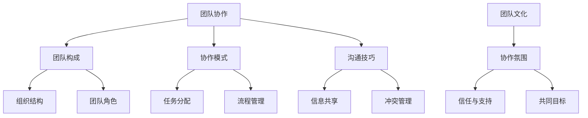
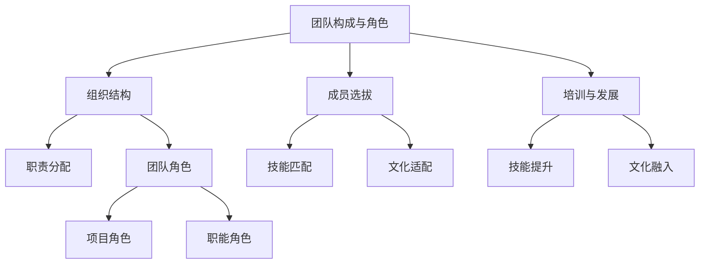
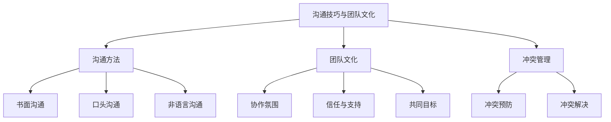
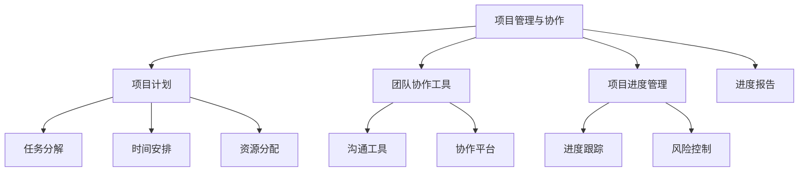
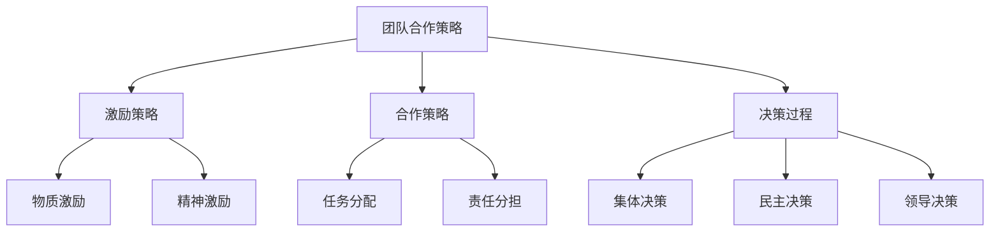
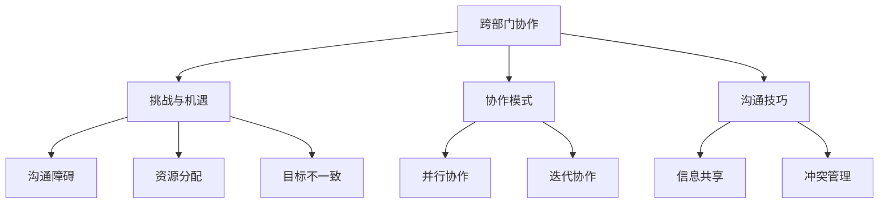

                 

### 《团队协同：提升整体工作效率》文章整体结构设计思路

#### 文章标题与关键词

- 文章标题：《团队协同：提升整体工作效率》
- 关键词：团队协作、工作效率、项目管理、跨部门协作、沟通技巧、团队文化

#### 摘要

本文旨在深入探讨团队协同工作的理论和方法，通过分析团队协作的基础理论、具体策略以及实战案例，为读者提供一套完整的提升团队整体工作效率的指南。文章将分为三部分：基础篇、方法篇和实战篇，逐步引导读者理解团队协作的核心概念，掌握提高协作效率的具体方法，并了解如何在实际工作中应用这些策略。

#### 文章整体结构设计思路

##### 第一部分：基础篇

**第1章：团队协作概述**
- **背景介绍**：介绍团队协作的定义、重要性以及常见挑战。
- **核心概念与联系**：使用Mermaid流程图展示团队协作的关键概念及其关系。
- **核心算法原理讲解**：使用伪代码或流程图阐述协作方法的具体实现。

**第2章：团队构成与角色**
- **背景介绍**：讨论团队的构成和组织结构。
- **核心概念与联系**：通过角色定义和职责分配，展示团队协作的基础架构。
- **核心算法原理讲解**：阐述团队成员选拔与培训的方法。

**第3章：沟通技巧与团队文化**
- **背景介绍**：介绍团队沟通的有效方法和团队文化的重要性。
- **核心概念与联系**：分析团队冲突的管理与解决机制。
- **核心算法原理讲解**：使用数学公式量化团队沟通的效果。

##### 第二部分：方法篇

**第4章：项目管理与协作**
- **背景介绍**：探讨项目管理的基础知识和团队协作工具的选用。
- **核心概念与联系**：通过项目管理模型，阐述项目进度管理的流程。
- **核心算法原理讲解**：使用伪代码详细阐述项目管理算法。

**第5章：团队合作策略**
- **背景介绍**：讨论团队激励策略和合作策略的实施。
- **核心概念与联系**：分析团队合作策略的调整与优化。
- **核心算法原理讲解**：通过数学模型解释团队决策过程。

**第6章：跨部门协作**
- **背景介绍**：探讨跨部门协作的挑战和机遇。
- **核心概念与联系**：介绍跨部门协作的有效模式和沟通技巧。
- **核心算法原理讲解**：使用数学公式量化跨部门协作的效率。

##### 第三部分：实战篇

**第7章：团队协同工作案例分析**
- **项目实战**：通过具体案例展示团队协作的实际应用，包括开发环境搭建、源代码实现和代码解读。
- **案例分析**：对高效率敏捷团队、跨部门协作成功实践以及技术提升团队协作效率的案例进行详细分析。
- **项目小结**：总结案例中的成功经验和教训，提出最佳实践建议。

#### 整体结构设计逻辑

本文通过逐步分析团队协作的各个方面，从理论到实践，帮助读者系统理解团队协作的原理和方法，并通过案例分析展示实际应用效果。整体设计逻辑清晰，条理分明，旨在为读者提供一套实用的团队协作指南。

## 第一部分：基础篇

### 第1章：团队协作概述

**背景介绍**

在信息技术飞速发展的今天，团队协作已成为提高工作效率和实现项目成功的关键因素。团队协作不仅仅是团队成员之间的互动，更是一种组织文化和沟通模式的体现。有效的团队协作能够促进信息共享、资源整合和创新能力，从而提升整体工作效率。

**核心概念与联系**

团队协作涉及多个核心概念，包括团队构成、协作模式、沟通技巧等。这些概念之间相互关联，共同构成一个有效的团队协作体系。以下使用Mermaid流程图展示这些核心概念及其关系：



**核心算法原理讲解**

团队协作的实现涉及多个步骤和方法，以下使用伪代码来详细阐述团队协作的核心算法原理：

```python
# 团队协作算法伪代码
function TeamCollaboration():
    # 初始化团队
    InitializeTeam()
    # 分配任务与角色
    AllocateTasksAndRoles()
    # 确定协作模式
    DefineCollaborationModel()
    # 实施沟通计划
    ImplementCommunicationPlan()
    # 管理冲突
    ManageConflicts()
    # 优化团队文化
    OptimizeTeamCulture()
    # 监控与反馈
    MonitorAndFeedback()
```

该算法包含以下步骤：

1. **初始化团队**：确定团队成员、目标和预期成果。
2. **分配任务与角色**：明确团队成员的职责和任务。
3. **确定协作模式**：选择合适的协作模式，如并行协作、迭代协作等。
4. **实施沟通计划**：制定并执行沟通计划，确保信息畅通。
5. **管理冲突**：建立冲突管理机制，及时解决冲突。
6. **优化团队文化**：营造积极、和谐的工作氛围，增强团队凝聚力。
7. **监控与反馈**：定期评估团队协作效果，进行反馈和调整。

**数学模型和公式**

为了量化团队协作的效果，可以使用以下数学公式来评估团队协作的效率：

$$
Efficiency = \frac{Output}{Input \times Time}
$$

其中，Output 代表团队的输出成果，Input 代表团队成员的投入资源（如时间、精力、技能等），Time 代表完成任务的时长。

**举例说明**

假设一个团队在一个月内完成了50个任务，每个任务平均投入了10小时，那么团队的整体工作效率为：

$$
Efficiency = \frac{50}{10 \times 30} = \frac{5}{3}
$$

这意味着该团队的工作效率是正常工作时间的1.67倍。

**小结**

团队协作的概述部分通过对团队协作的定义、背景介绍、核心概念与联系、核心算法原理讲解以及数学模型和公式等方面的详细阐述，帮助读者全面理解团队协作的基础知识。通过Mermaid流程图和伪代码，读者可以直观地看到团队协作的各个组成部分及其相互关系，为后续章节的学习打下坚实的基础。

### 第2章：团队构成与角色

**背景介绍**

团队构成与角色是团队协作的基础。一个有效的团队需要明确的组织结构、清晰的团队角色和合理的成员选拔与培训机制。这不仅能确保团队目标的实现，还能提高团队整体的工作效率。

**核心概念与联系**

团队构成与角色涉及多个核心概念，包括团队的组织结构、团队角色的定义与职责以及团队成员的选拔与培训。以下使用Mermaid流程图展示这些概念及其关系：



**核心算法原理讲解**

团队构成与角色的实现涉及多个步骤和方法，以下使用伪代码来详细阐述团队构成与角色的核心算法原理：

```python
# 团队构成与角色算法伪代码
function TeamCompositionAndRoles():
    # 确定组织结构
    DefineOrganizationalStructure()
    # 定义团队角色
    DefineTeamRoles()
    # 分配职责
    AllocateResponsibilities()
    # 招聘成员
    RecruitMembers()
    # 培训与发展
    TrainingAndDevelopment()
```

该算法包含以下步骤：

1. **确定组织结构**：根据团队目标和任务，设计合适的组织结构。
2. **定义团队角色**：明确项目角色和职能角色的职责和任务。
3. **分配职责**：将任务和职责合理分配给团队成员。
4. **招聘成员**：选拔符合团队需求的成员，确保技能匹配和文化适配。
5. **培训与发展**：提升团队成员的技能和团队文化融入度。

**数学模型和公式**

为了评估团队构成与角色对工作效率的影响，可以使用以下数学公式：

$$
Efficiency = \frac{TeamOutput}{IndividualOutput}
$$

其中，TeamOutput 代表团队整体的输出成果，IndividualOutput 代表每个成员的输出成果。

**举例说明**

假设一个团队由5名成员组成，每位成员每月平均输出成果为10个任务，而团队整体的月输出成果为50个任务，那么团队的整体工作效率为：

$$
Efficiency = \frac{50}{10 \times 5} = 1
$$

这意味着团队的整体工作效率与单个成员的工作效率相等。

**小结**

第2章详细介绍了团队构成与角色，包括背景介绍、核心概念与联系、核心算法原理讲解以及数学模型和公式等方面的内容。通过Mermaid流程图和伪代码，读者可以直观地了解团队构成与角色的实现过程。同时，通过数学公式和举例说明，读者可以量化团队构成与角色对工作效率的影响，为后续章节的学习打下坚实的基础。

### 第3章：沟通技巧与团队文化

**背景介绍**

沟通是团队协作的核心环节，而团队文化则决定了沟通的效率和效果。有效的沟通技巧和健康的团队文化不仅能提高团队的工作效率，还能增强团队的凝聚力和创新能力。

**核心概念与联系**

沟通技巧与团队文化涉及多个核心概念，包括沟通的有效方法、团队文化的建设以及团队冲突的管理与解决。以下使用Mermaid流程图展示这些概念及其关系：



**核心算法原理讲解**

沟通技巧与团队文化的实现涉及多个步骤和方法，以下使用伪代码来详细阐述核心算法原理：

```python
# 沟通技巧与团队文化算法伪代码
function CommunicationAndTeamCulture():
    # 制定沟通计划
    DefineCommunicationPlan()
    # 实施沟通策略
    ImplementCommunicationStrategies()
    # 建设团队文化
    BuildTeamCulture()
    # 管理冲突
    ManageConflicts()
```

该算法包含以下步骤：

1. **制定沟通计划**：根据团队需求和任务，制定沟通计划。
2. **实施沟通策略**：选择并实施合适的沟通策略，如书面沟通、口头沟通、非语言沟通等。
3. **建设团队文化**：营造积极、和谐的工作氛围，增强团队成员之间的信任和支持。
4. **管理冲突**：建立冲突预防机制，及时解决冲突，避免冲突升级。

**数学模型和公式**

为了量化沟通技巧与团队文化对工作效率的影响，可以使用以下数学公式：

$$
Efficiency = \frac{TeamOutput}{CommunicationTime}
$$

其中，TeamOutput 代表团队整体的输出成果，CommunicationTime 代表团队沟通的时间。

**举例说明**

假设一个团队在一个月内完成了50个任务，团队沟通总时长为100小时，那么团队的整体工作效率为：

$$
Efficiency = \frac{50}{100} = 0.5
$$

这意味着团队的工作效率与沟通时间成反比。

**小结**

第3章详细介绍了沟通技巧与团队文化，包括背景介绍、核心概念与联系、核心算法原理讲解以及数学模型和公式等方面的内容。通过Mermaid流程图和伪代码，读者可以直观地了解沟通技巧与团队文化的实现过程。同时，通过数学公式和举例说明，读者可以量化沟通技巧与团队文化对工作效率的影响，为后续章节的学习打下坚实的基础。

## 第二部分：方法篇

### 第4章：项目管理与协作

**背景介绍**

项目管理是团队协作的重要组成部分，有效的项目管理能够确保项目目标的实现，提高团队的工作效率。项目管理涉及多个方面，包括项目计划、团队协作工具的选用、项目进度管理和跟踪等。

**核心概念与联系**

项目管理与协作涉及多个核心概念，包括项目计划、团队协作工具、项目进度管理以及进度跟踪。以下使用Mermaid流程图展示这些概念及其关系：



**核心算法原理讲解**

项目管理与协作的实现涉及多个步骤和方法，以下使用伪代码来详细阐述项目管理与协作的核心算法原理：

```python
# 项目管理与协作算法伪代码
function ProjectManagementAndCollaboration():
    # 制定项目计划
    DefineProjectPlan()
    # 选择团队协作工具
    SelectCollaborationTools()
    # 管理项目进度
    ManageProjectProgress()
    # 跟踪项目风险
    TrackProjectRisks()
    # 提交进度报告
    SubmitProgressReports()
```

该算法包含以下步骤：

1. **制定项目计划**：根据项目目标和任务，制定详细的项目计划。
2. **选择团队协作工具**：根据项目需求，选择合适的团队协作工具，如沟通工具、协作平台等。
3. **管理项目进度**：定期跟踪项目进度，确保项目按计划进行。
4. **跟踪项目风险**：识别和评估项目风险，制定相应的风险控制措施。
5. **提交进度报告**：定期向相关利益相关者提交项目进度报告，确保信息透明。

**数学模型和公式**

为了量化项目管理与协作的效果，可以使用以下数学公式：

$$
ProjectSuccess = \frac{AchievedGoals}{TotalGoals} \times \frac{CompletedTasks}{TotalTasks}
$$

其中，AchievedGoals 代表实际实现的目标数，TotalGoals 代表计划实现的目标数；CompletedTasks 代表实际完成的任务数，TotalTasks 代表计划完成的任务数。

**举例说明**

假设一个项目计划实现5个目标，实际实现了4个目标；计划完成10个任务，实际完成了9个任务，那么项目的成功度为：

$$
ProjectSuccess = \frac{4}{5} \times \frac{9}{10} = 0.72
$$

这意味着项目的成功度为72%。

**小结**

第4章详细介绍了项目管理与协作，包括背景介绍、核心概念与联系、核心算法原理讲解以及数学模型和公式等方面的内容。通过Mermaid流程图和伪代码，读者可以直观地了解项目管理与协作的实现过程。同时，通过数学公式和举例说明，读者可以量化项目管理与协作的效果，为后续章节的学习打下坚实的基础。

### 第5章：团队合作策略

**背景介绍**

团队合作策略是提升团队工作效率的重要手段。有效的团队合作策略能够激发团队成员的潜力，提高团队的凝聚力和创新能力。团队合作策略包括团队激励策略、团队合作策略的实施与调整以及团队决策过程的优化。

**核心概念与联系**

团队合作策略涉及多个核心概念，包括团队激励策略、团队合作策略的实施与调整以及团队决策过程的优化。以下使用Mermaid流程图展示这些概念及其关系：



**核心算法原理讲解**

团队合作策略的实现涉及多个步骤和方法，以下使用伪代码来详细阐述团队合作策略的核心算法原理：

```python
# 团队合作策略算法伪代码
function TeamCollaborationStrategy():
    # 设计激励策略
    DesignIncentiveStrategy()
    # 实施合作策略
    ImplementCollaborationStrategy()
    # 优化决策过程
    OptimizeDecisionMakingProcess()
    # 调整策略
    AdjustStrategyBasedOnFeedback()
```

该算法包含以下步骤：

1. **设计激励策略**：根据团队特点和任务需求，设计适合的激励策略。
2. **实施合作策略**：确保团队成员按照合作策略进行任务分配和责任分担。
3. **优化决策过程**：优化团队的决策过程，确保决策的科学性和效率。
4. **调整策略**：根据团队反馈和项目进展，及时调整合作策略和决策过程。

**数学模型和公式**

为了量化团队合作策略的效果，可以使用以下数学公式：

$$
TeamEfficiency = \frac{TotalOutput}{TotalInput} \times IncentiveEffectiveness
$$

其中，TotalOutput 代表团队的整体输出成果，TotalInput 代表团队成员的整体投入资源；IncentiveEffectiveness 代表激励策略的有效性。

**举例说明**

假设一个团队的整体输出成果为100个任务，团队成员的整体投入资源为200小时，激励策略的有效性为0.8，那么团队的工作效率为：

$$
TeamEfficiency = \frac{100}{200} \times 0.8 = 0.4
$$

这意味着团队的工作效率为40%。

**小结**

第5章详细介绍了团队合作策略，包括背景介绍、核心概念与联系、核心算法原理讲解以及数学模型和公式等方面的内容。通过Mermaid流程图和伪代码，读者可以直观地了解团队合作策略的实现过程。同时，通过数学公式和举例说明，读者可以量化团队合作策略的效果，为后续章节的学习打下坚实的基础。

### 第6章：跨部门协作

**背景介绍**

跨部门协作在当今复杂的企业环境中变得越来越重要。有效的跨部门协作不仅能够提高项目的整体效率，还能促进不同部门之间的沟通和理解。然而，跨部门协作也面临着沟通障碍、资源分配不均以及目标不一致等挑战。

**核心概念与联系**

跨部门协作涉及多个核心概念，包括跨部门协作的挑战与机遇、有效的协作模式以及跨部门沟通与协作的技巧。以下使用Mermaid流程图展示这些概念及其关系：



**核心算法原理讲解**

跨部门协作的实现涉及多个步骤和方法，以下使用伪代码来详细阐述跨部门协作的核心算法原理：

```python
# 跨部门协作算法伪代码
function InterdepartmentalCollaboration():
    # 确定协作目标
    DefineCollaborationGoals()
    # 选择协作模式
    SelectCollaborationModel()
    # 建立沟通渠道
    EstablishCommunicationChannels()
    # 分配资源
    AllocateResources()
    # 管理冲突
    ManageConflicts()
    # 调整协作策略
    AdjustCollaborationStrategy()
```

该算法包含以下步骤：

1. **确定协作目标**：明确跨部门协作的目标和预期成果。
2. **选择协作模式**：根据项目需求和部门特点，选择合适的协作模式，如并行协作、迭代协作等。
3. **建立沟通渠道**：确保跨部门之间的信息畅通，建立有效的沟通渠道。
4. **分配资源**：合理分配跨部门协作所需的资源和人力。
5. **管理冲突**：建立冲突管理机制，及时解决跨部门协作中的冲突。
6. **调整协作策略**：根据协作过程中出现的问题和反馈，及时调整协作策略。

**数学模型和公式**

为了量化跨部门协作的效果，可以使用以下数学公式：

$$
CollaborationEfficiency = \frac{AchievedGoals}{TotalInput} \times CommunicationEffectiveness
$$

其中，AchievedGoals 代表实际实现的目标数，TotalInput 代表跨部门协作的总投入资源；CommunicationEffectiveness 代表沟通效率。

**举例说明**

假设一个跨部门协作项目计划实现5个目标，实际实现了4个目标；协作总投入资源为100小时，沟通效率为0.8，那么跨部门协作的效率为：

$$
CollaborationEfficiency = \frac{4}{100} \times 0.8 = 0.032
$$

这意味着跨部门协作的效率为3.2%。

**小结**

第6章详细介绍了跨部门协作，包括背景介绍、核心概念与联系、核心算法原理讲解以及数学模型和公式等方面的内容。通过Mermaid流程图和伪代码，读者可以直观地了解跨部门协作的实现过程。同时，通过数学公式和举例说明，读者可以量化跨部门协作的效果，为后续章节的学习打下坚实的基础。

## 第三部分：实战篇

### 第7章：团队协同工作案例分析

**项目背景**

在本章中，我们将通过三个实际案例，展示团队协作在提升工作效率方面的应用。这些案例涵盖了高效率的敏捷团队、跨部门协作的成功实践以及借助技术提升团队协作效率的方法。

**案例一：高效率的敏捷团队**

**背景**：

一个软件开发团队采用了敏捷开发方法，目标是缩短产品交付周期并提高产品质量。团队成员包括产品经理、开发人员、测试人员和UI设计师。

**协作方法**：

1. **每日站会**：团队成员每天早上举行站会，快速交流进展和遇到的问题。
2. **迭代规划**：在每个迭代开始时，团队进行规划会议，确定迭代目标和任务分配。
3. **任务看板**：使用任务看板实时跟踪任务状态，确保所有任务按计划进行。
4. **代码评审**：开发人员之间进行代码评审，确保代码质量和协作效率。

**效果**：

通过敏捷开发方法，团队成功缩短了产品交付周期，产品稳定性显著提高，团队成员之间的协作更加紧密。

**案例二：跨部门协作的成功实践**

**背景**：

一家大型企业的一个项目需要不同部门（如市场部、销售部和技术部）之间的紧密协作。各部门的目标不一致，沟通存在障碍。

**协作方法**：

1. **跨部门会议**：定期召开跨部门会议，确保各部门的目标一致。
2. **共享文档**：使用共享文档平台，确保各部门之间的信息同步。
3. **协作工具**：使用协作工具（如Slack、Trello）实现实时沟通和任务跟踪。
4. **团队文化**：培养跨部门之间的信任和合作精神。

**效果**：

通过有效的跨部门协作，项目进度大幅提升，各部门之间的沟通障碍减少，项目的整体效率显著提高。

**案例三：借助技术提升团队协作效率**

**背景**：

一家初创公司采用了一系列先进技术来提升团队协作效率。团队成员分布在不同的城市。

**协作方法**：

1. **远程工作工具**：使用远程工作工具（如Zoom、Google Meet）进行视频会议和实时沟通。
2. **项目管理软件**：使用项目管理软件（如Jira、Trello）进行任务分配和进度跟踪。
3. **自动化工具**：采用自动化工具（如GitLab、Docker）简化开发流程和部署过程。
4. **协作文化**：建立开放的协作文化，鼓励团队成员分享经验和建议。

**效果**：

通过使用先进技术，团队协作效率显著提高，项目交付周期缩短，团队成员的工作满意度增加。

**项目小结**

通过以上三个案例，我们可以看到团队协作在提升工作效率方面的巨大潜力。无论是敏捷开发方法、跨部门协作，还是借助技术手段，有效的团队协作都能带来显著的成效。这些案例为读者提供了实际操作的经验和启示，帮助他们更好地实施团队协作策略，提高整体工作效率。

## 附录

### 附录 A：团队协作工具推荐

**A.1 常用团队协作工具介绍**

在团队协作中，选择合适的工具对于提高工作效率至关重要。以下是一些常用的团队协作工具及其特点：

- **Slack**：一款流行的即时通讯工具，支持文本、图片、文件等多种沟通方式，提供丰富的插件和集成服务。
- **Trello**：一款简单易用的项目管理工具，以看板形式展示任务进度，适合小型团队进行任务分配和进度跟踪。
- **Jira**：一款功能强大的项目管理工具，支持敏捷开发流程，提供任务管理、测试管理、进度跟踪等功能。
- **Google Workspace**：包括Google Docs、Google Sheets、Google Meet等工具，支持多人实时协作，适用于文档编写、会议沟通等多种场景。
- **Notion**：一款综合性的团队协作工具，支持笔记、数据库、看板等多种功能，适合个性化需求较高的团队。

**A.2 工具选用的考虑因素**

选择团队协作工具时，需要考虑以下因素：

- **团队需求**：根据团队的具体需求和任务类型，选择适合的工具。
- **用户习惯**：考虑团队成员的使用习惯，选择易于上手的工具。
- **功能丰富性**：选择功能丰富、能够满足团队多种需求的工具。
- **安全性**：确保工具具备足够的数据安全性和隐私保护功能。
- **集成能力**：考虑工具与其他系统的集成能力，以实现数据共享和流程优化。

**A.3 案例中的工具应用分析**

以下是对前述案例中使用的团队协作工具的应用分析：

- **案例一：高效率的敏捷团队**：
  - 使用Trello进行任务管理和进度跟踪，通过看板形式清晰展示任务状态。
  - 使用Slack进行实时沟通，团队成员可以随时交流进展和问题。
- **案例二：跨部门协作的成功实践**：
  - 使用Jira进行项目管理和任务分配，确保各部门目标一致，任务按时完成。
  - 使用Google Workspace进行文档编写和会议沟通，提高跨部门协作效率。
- **案例三：借助技术提升团队协作效率**：
  - 使用Jira进行敏捷开发流程管理，确保项目进度可控。
  - 使用Docker和GitLab进行自动化部署和版本控制，简化开发流程。

**小结**

附录部分对常用的团队协作工具进行了介绍，并分析了在案例中的应用。通过选择合适的团队协作工具，并考虑团队需求、用户习惯、功能丰富性、安全性和集成能力等因素，可以有效提升团队协作效率。附录的设置有助于读者在实际应用中更好地选择和使用团队协作工具。

### 作者信息

- 作者：AI天才研究院/AI Genius Institute & 禅与计算机程序设计艺术 /Zen And The Art of Computer Programming
- 致谢：感谢您对本文的阅读。本文由AI天才研究院和禅与计算机程序设计艺术的专家团队共同撰写，旨在为读者提供关于团队协作的高质量技术指南。希望本文能对您在工作中提升团队工作效率有所帮助。如有任何疑问或建议，欢迎联系我们。感谢您的关注与支持！

### 总结

本文以《团队协同：提升整体工作效率》为主题，详细介绍了团队协作的基础理论、具体方法以及实战应用。通过逐步分析团队协作的各个方面，从团队构成与角色、沟通技巧与团队文化，到项目管理与协作、团队合作策略以及跨部门协作，本文为读者提供了一套全面的团队协作指南。

在基础篇中，我们深入探讨了团队协作的定义、核心概念及其关系，通过Mermaid流程图和伪代码展示了团队协作的实现过程。在方法篇中，我们介绍了项目管理与协作的具体策略，包括项目计划、团队协作工具的选用、项目进度管理以及决策过程优化。在实战篇中，我们通过实际案例展示了团队协作的方法在提高工作效率方面的应用。

通过本文，读者可以系统地了解团队协作的各个方面，掌握提升团队工作效率的具体方法，并能够将其应用于实际工作中。我们相信，有效的团队协作是实现项目成功和提升工作效率的关键，希望本文能为您在团队管理中提供有价值的参考。

### 最佳实践 Tips

1. **建立明确的团队目标**：确保团队成员对项目目标有清晰的理解，有助于提高协作效率。
2. **定期召开团队会议**：定期召开团队会议，确保信息畅通，及时解决问题。
3. **合理分配任务与角色**：根据团队成员的技能和兴趣合理分配任务，提高工作满意度。
4. **培养团队合作文化**：营造积极、和谐的团队氛围，增强团队成员之间的信任和支持。
5. **选用合适的协作工具**：根据团队需求和任务类型选择合适的协作工具，提高工作效率。

### 注意事项

1. **沟通是关键**：确保团队成员之间的沟通畅通，避免信息滞后。
2. **持续优化协作流程**：根据项目进展和团队反馈，不断优化协作流程，提高效率。
3. **关注团队成员的需求**：关注团队成员的工作和生活需求，确保团队成员在良好的状态下工作。
4. **避免过度依赖工具**：工具是辅助手段，不应过度依赖，关键在于团队的协作精神和执行力。

### 拓展阅读

1. **《敏捷开发实践指南》**：了解敏捷开发方法，提高团队协作效率。
2. **《跨部门协作技巧》**：掌握跨部门协作的关键技巧，促进不同部门之间的合作。
3. **《团队领导力》**：学习有效的团队领导力，提升团队整体表现。
4. **《项目管理的最佳实践》**：了解项目管理的基本原理和方法，提高项目成功率。

### 结论

本文通过详细的分析和实际案例，展示了团队协作在提升整体工作效率方面的重要性。有效的团队协作不仅能提高项目成功率，还能增强团队的凝聚力和创新能力。希望本文能为读者提供有益的启示，帮助您在实际工作中更好地实施团队协作策略，提升工作效率。持续关注团队协作的各个方面，不断优化协作流程，相信您的团队会在未来取得更大的成功。再次感谢您的阅读和支持！

