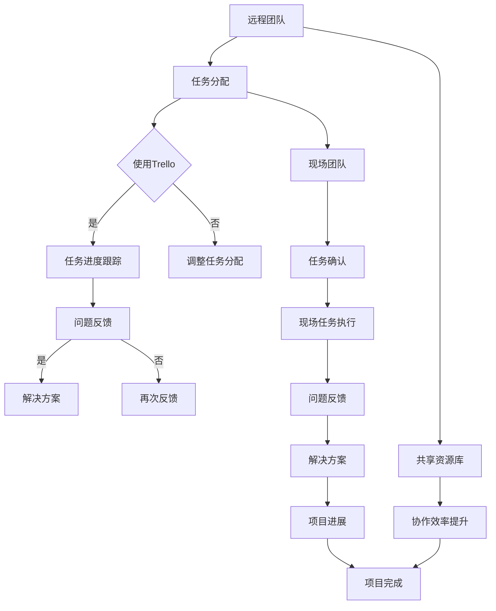
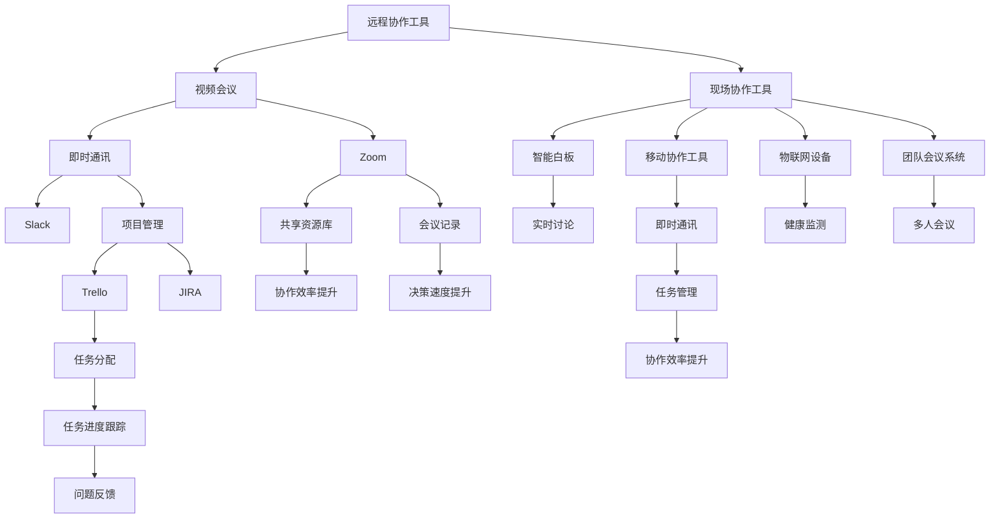

                 

### 文章标题

# 团队协同：远程与现场团队的无缝衔接

> 关键词：团队协同、远程团队、现场团队、无缝衔接、协作工具、协同机制、项目实战

> 摘要：本文将深入探讨如何实现远程团队和现场团队之间的无缝协作，介绍关键概念、实用工具和实际案例，提供解决地理和沟通障碍的策略，帮助团队高效完成项目。

### 引言

在当今全球化的工作环境中，远程工作和现场工作已成为企业运营的常态。远程团队通过互联网协作，拥有灵活性、多样性和效率优势，而现场团队则在面对面的交流中更易于形成紧密的合作关系。然而，地理距离和沟通方式的差异使得远程团队和现场团队在协同工作中面临诸多挑战，如时间差、沟通障碍、协作效率低下等。如何实现这两类团队的无缝衔接，成为现代企业亟待解决的问题。

本文将从以下几个方面进行探讨：

1. 远程团队和现场团队的工作模式及其优缺点。
2. 协同机制和工具的选择与应用。
3. 实际案例展示协同工作的实施过程与效果。
4. 面临的挑战及解决方案。
5. 未来协同工作的发展趋势。

通过本文的阅读，读者将能够了解到如何克服远程团队和现场团队之间的协作难题，实现高效的无缝衔接。

### 第一部分：远程团队和现场团队的工作模式

#### 远程团队的工作模式

远程团队指的是利用互联网技术，通过远程工具进行协作的团队。团队成员通常分布在不同的地理位置，通过视频会议、即时通讯、项目管理软件等方式进行沟通和合作。远程团队的工作模式具有以下几个特点：

1. **灵活性**：团队成员可以根据个人需求安排工作时间和地点，提高工作效率和生活质量。
2. **多样性**：可以吸引来自全球各地的优秀人才，丰富团队的文化和视角。
3. **协作效率**：利用各种在线协作工具，如Google Docs、Trello等，实现实时协同和任务管理。

然而，远程团队也面临一些挑战，如：

1. **沟通障碍**：由于地理位置的分散，团队成员之间的沟通可能存在延迟和信息不完整的问题。
2. **信任问题**：团队成员之间可能由于缺乏面对面的交流而存在信任问题，影响团队协作效果。
3. **工作质量**：部分团队成员可能因为远程工作而感到疏离，影响工作质量。

#### 现场团队的工作模式

现场团队指的是在同一地理位置进行协作的团队。团队成员通过面对面的交流和协作，能够快速沟通和解决问题。现场团队的工作模式具有以下几个特点：

1. **高效沟通**：面对面的交流能够迅速解决问题，提高决策速度。
2. **团队合作**：团队成员可以更容易地建立合作关系，形成紧密的团队氛围。
3. **任务执行**：现场团队在执行任务时，可以更迅速地协调资源，确保任务顺利进行。

然而，现场团队也面临一些挑战，如：

1. **地理限制**：团队成员的地理位置可能受限，无法吸引全球的优秀人才。
2. **资源分配**：资源分配可能不均，导致部分团队成员工作量过大或过小。
3. **时间同步**：现场团队的工作时间可能与其他时区存在差异，影响全球协作。

#### 远程团队和现场团队的协同机制

为了实现远程团队和现场团队的无缝衔接，需要建立有效的协同机制，确保两个团队能够在共同目标下高效协作。以下是一些关键协同机制：

1. **统一沟通平台**：选择一个适合远程和现场团队沟通的工具，如Slack、Microsoft Teams等，确保信息传递的及时性和准确性。
2. **任务管理工具**：使用Trello、JIRA等项目管理工具，明确任务分配、进度跟踪和反馈机制。
3. **资源共享**：建立共享文档和资源库，确保团队成员可以随时获取所需的信息和资料。
4. **定期会议**：通过视频会议等方式，定期召开团队会议，讨论项目进展和解决问题。

#### Mermaid 流程图

以下是一个简单的Mermaid流程图，展示远程团队和现场团队的协同机制：

通过这个流程图，我们可以看到远程团队和现场团队在任务分配、任务进度跟踪、资源共享和问题反馈等方面是如何相互协同的。

### 第二部分：协同工具

#### 远程协作工具

选择合适的远程协作工具是实现远程团队和现场团队无缝衔接的关键。以下是一些常用的远程协作工具：

1. **视频会议工具**：
   - **Zoom**：支持高清视频和音频通话，具备屏幕共享和会议录制功能。
   - **Microsoft Teams**：集成视频会议、即时通讯和文档共享功能，适合企业用户。
   - **Google Meet**：免费使用，支持高清视频和多方通话。

2. **即时通讯工具**：
   - **Slack**：提供即时通讯、文件共享和整合各种第三方应用的功能。
   - **Microsoft Teams**：提供即时通讯、视频会议和文档协作功能。
   - **WhatsApp**：适用于个人和团队沟通，支持文字、语音和视频通话。

3. **项目管理工具**：
   - **Trello**：简单直观的任务管理工具，支持卡片、列表和标签功能。
   - **JIRA**：功能强大的项目管理工具，支持任务跟踪、敏捷开发和管理。
   - **Asana**：提供任务、项目和时间跟踪功能，适用于各种规模的项目。

4. **文档协作工具**：
   - **Google Docs**：支持多人实时协作编辑文档，具有版本控制和评论功能。
   - **Microsoft Office 365**：提供Word、Excel、PowerPoint等办公软件的在线协作功能。
   - **Notion**：支持多种内容类型的创建和协作，适用于团队知识管理和项目管理。

#### 现场协作工具

现场协作工具旨在提高团队成员之间的沟通和协作效率。以下是一些常用的现场协作工具：

1. **智能白板**：如Miro和Mural，支持在线协作和实时讨论。
2. **移动协作工具**：如Slack和Microsoft Teams的移动应用，支持即时通讯和任务管理。
3. **物联网设备**：如智能手表、智能手环等，用于实时监测团队成员的健康和工作状态。
4. **团队会议系统**：如Zoom的会议室解决方案，提供高清视频和音频设备，支持多人会议。

#### 协同工具的选择标准

在选择协同工具时，应考虑以下标准：

1. **兼容性**：工具应兼容不同的操作系统和设备，确保团队成员可以方便地使用。
2. **安全性**：工具应具备数据加密和访问控制功能，确保信息的安全性和隐私。
3. **易用性**：工具应具有简洁的用户界面和易于操作的功能，减少团队成员的学习成本。
4. **扩展性**：工具应支持与其他系统和应用的集成，便于团队扩展使用范围。

#### Mermaid 流程图

以下是一个简单的Mermaid流程图，展示远程协作工具和现场协作工具的应用场景：

通过这个流程图，我们可以看到远程协作工具和现场协作工具在实际应用场景中的相互关系和作用。

### 第三部分：项目实战

#### 案例背景

某企业是一家全球性科技公司，其开发团队分为远程团队和现场团队。远程团队主要负责软件设计和开发，现场团队则负责项目实施和现场支持。由于团队成员分布在不同的国家和时区，如何实现高效协作成为该项目的关键挑战。

#### 远程团队的工作流程

1. **任务分配**：项目经理通过Trello创建任务卡片，将任务分配给远程团队成员，并设置任务截止日期和优先级。
2. **任务进度跟踪**：团队成员在Trello上更新任务进度，项目经理通过JIRA监控任务进度和反馈。
3. **问题反馈**：遇到问题时，团队成员通过Slack即时沟通，共同解决。
4. **资源共享**：使用Google Docs进行文档协作，确保团队成员可以实时查看和编辑文档。
5. **会议记录**：通过Zoom定期召开会议，讨论项目进展和解决问题。

#### 现场团队的工作流程

1. **任务确认**：现场团队负责人通过Trello接收任务，确认任务要求和交付标准。
2. **现场任务执行**：现场团队根据任务要求，进行现场实施和测试，并及时反馈问题。
3. **问题反馈**：遇到问题时，现场团队通过Slack与远程团队沟通，共同解决问题。
4. **项目进展**：现场团队定期更新项目进展，项目经理通过JIRA监控项目进度。
5. **会议记录**：通过Zoom召开现场团队会议，讨论项目进展和协调资源。

#### 协同工具的应用与效果

1. **Trello**：通过任务分配、进度跟踪和问题反馈功能，确保任务有序进行，提高项目效率。
2. **JIRA**：通过任务监控和问题跟踪功能，确保项目进度可控，及时发现问题并解决。
3. **Slack**：通过即时通讯功能，实现远程团队和现场团队的实时沟通，提高问题解决速度。
4. **Google Docs**：通过文档协作功能，确保团队成员可以实时查看和编辑文档，提高工作效率。
5. **Zoom**：通过视频会议功能，实现远程团队和现场团队的定期会议，确保信息传递的及时性和准确性。

#### 遇到的挑战与解决方案

1. **沟通延迟**：由于团队成员分布在不同的时区，沟通存在延迟。解决方案：通过Trello和Slack的提醒功能，确保团队成员在适当的时间接收和回复信息。
2. **工作流程冲突**：远程团队和现场团队的工作流程可能存在冲突。解决方案：通过JIRA的甘特图功能，明确任务进度和交付时间，避免工作冲突。
3. **文件同步与版本控制**：团队成员可能需要同时编辑同一文档，导致文件同步和版本控制问题。解决方案：使用Google Docs的实时协作功能，确保文档版本一致。

#### 项目小结

通过远程协作工具和现场协作工具的应用，远程团队和现场团队实现了高效的无缝衔接，成功完成了项目。远程团队通过Trello和JIRA进行任务管理和进度跟踪，确保任务有序进行；通过Slack进行即时沟通，提高问题解决速度；通过Google Docs进行文档协作，提高工作效率。现场团队通过Trello和JIRA监控项目进度，确保项目进展可控；通过Slack与远程团队沟通，确保信息传递的及时性和准确性；通过Zoom召开现场团队会议，协调资源，确保项目顺利进行。

### 第四部分：面临的挑战及解决方案

#### 沟通延迟

在远程团队和现场团队之间，沟通延迟是一个常见问题。由于时区差异，团队成员可能在工作时间无法及时响应信息，导致项目进度受阻。以下是一些解决方案：

1. **预先安排沟通时间**：制定固定的沟通时间表，确保团队成员在特定时间内集中精力处理重要事项。
2. **使用自动化工具**：利用Slack等即时通讯工具的提醒功能，在团队成员需要回复信息时自动发送提醒，提高响应速度。
3. **优化沟通方式**：在必要情况下，通过视频会议等方式进行实时沟通，确保信息传递的及时性和准确性。

#### 工作流程冲突

远程团队和现场团队的工作流程可能存在冲突，如任务优先级、交付时间等，导致项目进展受阻。以下是一些解决方案：

1. **明确任务优先级**：通过JIRA等项目管理工具，明确任务优先级，确保关键任务优先完成。
2. **协调资源分配**：通过Trello等任务管理工具，合理分配资源，确保团队成员工作量均衡。
3. **定期沟通与协调**：通过定期召开团队会议，讨论项目进展和问题，确保工作流程的顺畅。

#### 文件同步与版本控制

在远程团队和现场团队之间，文件同步和版本控制是一个重要问题。团队成员可能需要同时编辑同一文档，导致版本冲突和文件丢失。以下是一些解决方案：

1. **使用文档协作工具**：如Google Docs，支持多人实时协作编辑文档，确保文档版本一致。
2. **版本控制工具**：如Git，用于管理文件的版本和历史记录，确保文件的安全性和可追溯性。
3. **自动化同步**：使用自动化工具，如GitHub Actions，定期同步文件，减少手动操作带来的错误。

### 第五部分：未来展望

随着技术的不断发展，远程团队和现场团队的协同工作将变得更加高效和无缝。以下是一些未来展望：

1. **人工智能与机器学习**：利用人工智能和机器学习技术，实现自动化的任务分配、进度跟踪和问题预测，提高协同效率。
2. **虚拟现实与增强现实**：通过虚拟现实和增强现实技术，实现远程团队和现场团队之间的沉浸式沟通和协作，提高工作体验。
3. **区块链技术**：利用区块链技术，确保协同过程中的数据安全和透明性，提高信任度。
4. **智能协作工具**：开发更加智能化的协作工具，如基于自然语言处理的智能助手，帮助团队快速解决问题，提高工作效率。

### 总结

本文详细探讨了如何实现远程团队和现场团队的无缝衔接，介绍了关键概念、实用工具和实际案例，并分析了面临的挑战及解决方案。通过本文的阅读，读者将能够了解到如何克服远程团队和现场团队之间的协作难题，实现高效的无缝衔接。未来，随着技术的不断进步，远程团队和现场团队的协同工作将变得更加高效和无缝，为企业带来更多机遇和挑战。

### 附录

#### 附录 A：常用协同工具配置指南

1. **Zoom**：配置视频会议，设置会议密码，调整视频和音频设置。
2. **Slack**：创建工作空间，添加团队成员，设置关键词提醒，配置集成应用。
3. **Trello**：创建任务板，添加团队成员，设置卡片和列表，分配任务。
4. **JIRA**：创建项目，设置任务类型和优先级，监控项目进度，生成报告。
5. **Google Docs**：创建文档，邀请团队成员协作，设置编辑权限，管理版本历史。

#### 附录 B：远程团队管理最佳实践

1. **制定明确的任务和目标**：确保团队成员了解任务内容和预期成果。
2. **建立高效的沟通机制**：选择合适的沟通工具，确保信息传递的及时性和准确性。
3. **定期进行团队反馈**：通过定期的团队反馈会议，了解团队成员的工作情况和需求，及时解决问题。
4. **提供培训和支持**：为团队成员提供必要的培训和支持，提高工作效率。

#### 附录 C：现场团队协作技巧

1. **明确任务分工**：确保团队成员了解自己的职责和任务，避免工作重叠和冲突。
2. **定期召开团队会议**：通过定期召开团队会议，讨论项目进展和解决问题，确保工作流程的顺畅。
3. **建立资源共享机制**：确保团队成员可以方便地获取所需的信息和资源，提高工作效率。
4. **培养团队凝聚力**：通过团队活动，如团队建设训练和团队聚餐，增强团队成员之间的凝聚力。

### 作者信息

**作者：AI天才研究院/AI Genius Institute & 禅与计算机程序设计艺术 /Zen And The Art of Computer Programming**

