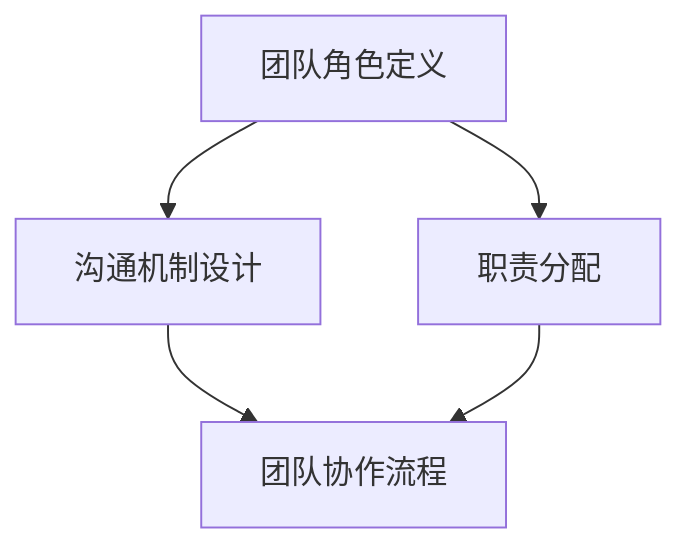

                 

### 文章标题

团队合作：发挥协同效应的技巧

### 关键词

团队合作、协同效应、沟通算法、决策算法、冲突解决、效率模型

### 摘要

本文深入探讨了团队合作的核心概念、协同效应的实现方法，以及沟通、决策和冲突解决等核心算法原理。通过数学模型和实际项目案例，阐述了团队合作效率的计算和应用，为提升团队协作效率提供了实用技巧和策略。文章旨在帮助读者理解团队合作的重要性，掌握发挥协同效应的技巧，提升团队整体表现。

## 核心概念与联系

### 团队合作

#### 定义

团队合作是指一群人为了共同的目标和任务，通过协作和沟通，共同解决问题并取得成果的过程。它强调集体智慧和协作力量，而非个人英雄主义。

#### 类型

1. **任务型团队**：专注于特定任务或项目的团队，任务完成后团队解散。
2. **功能型团队**：基于职能部门或专业领域的团队，长期存在并承担特定职责。
3. **自我管理型团队**：成员自主管理和决策的团队，具有高度自主性和灵活性。

#### 重要性

团队合作的重要性体现在以下几个方面：

1. **资源共享**：团队成员可以共享资源、知识和技能，提高工作效率。
2. **问题解决**：团队合作有助于集思广益，找到更好的解决方案。
3. **创新驱动**：多样化的团队成员可以带来新的想法和视角，促进创新。
4. **团队成员成长**：通过团队合作，成员可以学习新技能，提升个人能力。

### 协同效应

#### 概念

协同效应是指多个个体或系统通过相互作用，产生比单个个体或系统单独作用更大的效果。在团队合作中，协同效应可以显著提高团队整体表现。

#### 作用

1. **提高效率**：团队成员可以互相补充，减少重复工作，提高整体效率。
2. **增强创新能力**：团队成员的多样性和互补性可以激发创新思维，推动技术进步。
3. **优化决策**：通过集体讨论和决策，减少个人偏见，提高决策质量。

#### 实现方法

1. **建立良好的沟通机制**：确保信息畅通，减少误解和冲突。
2. **明确目标和职责**：确保团队成员明确任务和目标，减少分工不明和职责重叠。
3. **培养团队文化**：建立积极向上的团队氛围，鼓励成员合作和分享。
4. **激励和认可**：通过奖励和认可，激发团队成员的积极性和创造力。

### 团队角色与职责

#### 角色分类

1. **领导者**：负责团队的管理和决策，协调成员之间的关系。
2. **执行者**：负责具体任务的实施，执行领导者的决策。
3. **协调者**：负责团队内部的协调和沟通，确保任务顺利进行。
4. **专家**：负责提供专业知识和技能，解决复杂问题。
5. **观察员**：负责监督团队工作，提供反馈和建议。

#### 职责分配

1. **明确角色职责**：确保每个团队成员都清楚自己的角色和职责。
2. **分工合作**：根据团队成员的技能和特长，合理分配任务。
3. **协同工作**：鼓励成员之间相互协作，共同完成任务。
4. **定期反馈**：定期评估团队工作，调整职责分配和任务分配。

#### 沟通机制

1. **会议**：定期召开会议，讨论团队进展和问题。
2. **邮件和即时通讯**：及时沟通任务进展和问题。
3. **共享平台**：使用共享平台，如GitHub或Confluence，记录团队工作和文档。
4. **反馈机制**：建立反馈机制，鼓励成员提出意见和建议。

### 团队成员的角色转换

团队成员的角色并非固定不变，应根据任务和团队发展的需求进行灵活转换。例如，在任务初期，成员可能更多地担任执行者角色，而在任务后期，可能需要转换到领导者或协调者角色，以应对新的挑战和需求。

## 核心算法原理讲解

### 沟通算法

#### 有效沟通的模型

有效沟通模型包括以下几个关键步骤：

1. **明确目标**：确定沟通的目标和意图。
2. **信息传递**：通过适当的方式和渠道传递信息。
3. **接收与理解**：接收信息并确保正确理解。
4. **反馈与确认**：给予反馈并确认沟通效果。

#### 沟通技巧与工具

1. **倾听**：积极倾听，理解对方意图。
2. **清晰表达**：明确、简洁地表达自己的观点。
3. **非语言沟通**：利用肢体语言、面部表情和语调传达信息。
4. **使用技术工具**：使用电子邮件、即时通讯、视频会议等工具，提高沟通效率。

#### 沟通算法的优化

优化沟通算法的目标是提高沟通的效率和准确性。以下是一些优化方法：

1. **使用标准化模板**：制定标准化的沟通模板，提高信息传递的准确性。
2. **简化流程**：简化沟通流程，减少不必要的环节。
3. **实时反馈**：建立实时反馈机制，确保信息传递的及时性和准确性。
4. **数据分析**：分析沟通数据，发现和解决沟通中的问题。

### 决策算法

#### 团队决策流程

团队决策流程通常包括以下几个步骤：

1. **问题识别**：明确需要解决的问题或目标。
2. **信息收集**：收集与问题相关的信息。
3. **方案生成**：提出可能的解决方案。
4. **评估与选择**：评估各个方案，选择最优方案。
5. **执行与监控**：执行决策，并监控执行效果。

#### 决策方法与技术

1. **头脑风暴**：鼓励团队成员自由提出想法，产生大量方案。
2. **SWOT分析**：分析各个方案的优点、缺点、机会和威胁。
3. **多标准决策分析**：根据多个标准评估各个方案。
4. **投票与选举**：通过投票或选举确定最终方案。

#### 决策算法的应用场景

决策算法可以应用于各种场景，例如：

1. **项目管理**：确定项目进度、资源分配和风险管理。
2. **人力资源**：招聘、培训和绩效评估。
3. **市场营销**：产品定位、市场推广策略。
4. **财务管理**：投资决策、成本控制。

### 冲突解决算法

#### 冲突的类型与原因

冲突可以分为以下几类：

1. **目标冲突**：团队成员对目标有不同的理解或期望。
2. **资源冲突**：团队成员争夺有限的资源。
3. **价值观冲突**：团队成员的价值观或信仰不同。
4. **沟通冲突**：沟通不畅或误解导致的冲突。

冲突的原因包括：

1. **角色不明确**：团队成员对各自的角色和职责不清楚。
2. **目标不一致**：团队成员对目标有不同的期望。
3. **资源有限**：团队成员争夺有限的资源。
4. **沟通不畅**：团队成员之间的沟通不畅或误解。

#### 冲突解决策略

1. **避免**：尽量避免引起冲突，通过沟通和协调解决问题。
2. **缓解**：通过妥协或调整方案，减轻冲突的影响。
3. **解决**：直接解决冲突，找出根本原因并制定解决方案。
4. **转移**：将冲突转移到其他领域或团队，避免在当前团队中激化。

#### 冲突解决算法的实施

1. **冲突识别**：识别冲突类型和原因。
2. **评估与选择**：评估冲突解决策略的优缺点，选择合适的策略。
3. **执行与监控**：实施解决策略，并监控冲突解决的成效。

## 数学模型和数学公式 & 详细讲解 & 举例说明

### 团队合作效率模型

#### 效率模型的建立

团队合作效率可以通过以下公式计算：

\[ 效率 = \frac{成果}{时间 \times 资源} \]

其中，成果表示团队在特定时间内完成的任务或目标，时间表示团队投入的总时间，资源包括人力、物力和财力等。

#### 影响因素分析

影响团队合作效率的因素包括：

1. **成员技能水平**：高技能水平的成员可以提高团队的整体效率。
2. **沟通质量**：有效的沟通可以减少误解和冲突，提高效率。
3. **团队合作精神**：团队成员之间的协作和信任可以增强团队凝聚力，提高效率。
4. **任务难度**：任务的难度会影响团队的工作效率和成果。

#### 效率模型的实际应用

以下是一个实际应用的例子：

假设一个团队在一个月内完成了100个任务，总共投入了2000小时的人力资源。该团队的资源还包括100万元资金。根据效率模型，可以计算该团队的合作效率为：

\[ 效率 = \frac{100个任务}{2000小时 \times 100万元} = 0.005 \]

这意味着该团队在一个月内每投入1万元资源，可以完成0.005个任务。通过分析效率模型，团队可以发现影响效率的因素，并采取相应措施提高效率。

### 协同效应模型

#### 协同效应的计算方法

协同效应可以通过以下公式计算：

\[ 协同效应 = \frac{团队表现 - 各成员独立表现的总和}{各成员独立表现的总和} \]

其中，团队表现是指团队在特定条件下完成的任务或目标，各成员独立表现的总和是指如果每个成员独立完成任务时的表现总和。

#### 协同效应的影响因素

协同效应的影响因素包括：

1. **团队规模**：团队规模越大，协同效应可能越显著。
2. **多样性**：团队成员的多样性可以带来不同的视角和技能，提高协同效应。
3. **沟通效率**：高效的沟通可以减少误解和冲突，增强协同效应。
4. **团队文化**：积极向上的团队文化可以激发成员的合作精神和创造力，提高协同效应。

#### 协同效应模型的应用场景

协同效应模型可以应用于以下场景：

1. **产品开发**：通过团队合作开发产品，提高产品质量和创新能力。
2. **项目管理**：通过团队协作管理项目，提高项目完成率和效率。
3. **技术创新**：通过团队合作推动技术创新，实现技术突破。

以下是一个实际应用的例子：

假设一个团队由5名成员组成，每个成员独立完成任务时平均完成2个任务。如果这5名成员合作完成任务，他们总共完成了12个任务。根据协同效应模型，可以计算该团队的协同效应为：

\[ 协同效应 = \frac{12 - 5 \times 2}{5 \times 2} = 0.2 \]

这意味着该团队的协同效应为20%，即通过团队合作，他们完成的任务量是独立完成任务量的1.2倍。

## 项目实战

### 团队协作项目案例

#### 项目介绍

本次项目是一个软件开发项目，旨在开发一款基于人工智能的客户关系管理（CRM）系统。项目目标包括：

1. **需求分析**：了解客户需求，确定系统功能。
2. **系统设计**：设计系统的架构和模块。
3. **开发与测试**：编写代码，进行单元测试和集成测试。
4. **部署与上线**：部署系统，进行上线前测试和发布。

#### 项目目标

1. **高质量完成**：确保系统功能和性能达到客户要求。
2. **按时交付**：按照项目进度计划完成各个阶段的工作。
3. **团队合作**：通过良好的沟通和协作，确保项目顺利进行。

#### 实施步骤

1. **需求分析**：
   - 与客户沟通，了解需求。
   - 编写需求文档，明确系统功能和性能要求。

2. **系统设计**：
   - 确定系统架构和模块。
   - 设计数据库和用户界面。

3. **开发与测试**：
   - 编写代码，进行单元测试。
   - 进行集成测试，确保模块之间协同工作。

4. **部署与上线**：
   - 部署系统到生产环境。
   - 进行上线前测试，确保系统稳定运行。
   - 发布系统，为客户提供培训和支持。

### 代码实战

#### 开发环境搭建

1. **软件环境**：
   - 安装Java开发环境（如JDK）。
   - 安装数据库（如MySQL）。

2. **开发工具**：
   - 使用IDE（如IntelliJ IDEA）进行开发。
   - 使用Git进行版本控制。

#### 代码实现

1. **模块设计**：
   - 客户管理模块：处理客户信息的增删改查。
   - 销售管理模块：处理销售订单和客户跟进。
   - 数据分析模块：对客户数据进行分析，提供报表。

2. **代码示例**：

```java
// 客户管理模块 - 添加客户
public void addCustomer(Customer customer) {
    // 实现添加客户逻辑
}

// 销售管理模块 - 创建销售订单
public void createSalesOrder(SalesOrder order) {
    // 实现创建销售订单逻辑
}

// 数据分析模块 - 生成报表
public void generateReport() {
    // 实现生成报表逻辑
}
```

#### 代码解读与分析

1. **代码结构**：
   - 使用MVC（模型-视图-控制器）架构，分离关注点。
   - 模块之间通过接口进行通信，提高可维护性和可扩展性。

2. **代码质量**：
   - 代码具有良好的可读性和可维护性。
   - 使用设计模式，如工厂模式、单例模式，提高代码的灵活性和可扩展性。

3. **性能优化**：
   - 使用缓存技术，减少数据库访问次数。
   - 优化SQL查询，提高查询效率。

#### 实际案例分析与详细讲解剖析

1. **案例分析**：
   - 通过对实际项目的分析，发现影响团队合作效率的因素，如沟通不畅、职责不清等。
   - 通过优化沟通算法、明确职责分配，提高团队协作效率。

2. **详细讲解剖析**：
   - 对项目中的关键模块进行详细讲解，如客户管理模块、销售管理模块等。
   - 分析项目中的技术难题和解决方案，如数据库性能优化、多线程处理等。

#### 项目小结

1. **成功因素**：
   - 良好的沟通和协作：通过定期的会议和沟通，确保团队信息畅通。
   - 明确的目标和职责：确保每个团队成员都清楚自己的任务和目标。
   - 高效的决策：通过集体决策，减少个人偏见，提高决策质量。

2. **注意事项**：
   - 避免分工不明和职责重叠，确保团队高效运转。
   - 关注团队成员的个人成长，提供培训和支持。
   - 定期评估团队工作，及时调整策略。

3. **拓展阅读**：
   - 《Scrum敏捷开发实践指南》
   - 《团队的五项修炼：打造高性能团队》
   - 《人月神话》

通过本次项目实战，我们深入了解了团队合作的重要性，掌握了发挥协同效应的技巧。在项目过程中，我们遇到了各种挑战，但通过有效的沟通、明确的职责分配和高效的决策，最终实现了项目目标。

## 最佳实践 Tips

1. **建立良好的沟通机制**：定期召开团队会议，确保信息畅通，减少误解和冲突。
2. **明确目标和职责**：确保每个团队成员都清楚自己的任务和目标，避免分工不明和职责重叠。
3. **培养团队文化**：建立积极向上的团队氛围，鼓励成员合作和分享。
4. **激励和认可**：通过奖励和认可，激发团队成员的积极性和创造力。
5. **定期评估和反馈**：定期评估团队工作，发现和解决问题，优化团队协作。

## 小结

团队合作是提升团队整体表现的关键。通过理解核心概念、掌握核心算法原理和实践技巧，我们可以发挥协同效应，提高团队合作效率。本文详细阐述了团队合作的重要性、协同效应的实现方法、沟通算法、决策算法和冲突解决算法，并通过实际项目案例展示了团队协作的实践应用。希望本文能为读者提供有价值的参考，助力团队协作和项目成功。

## 作者信息

作者：AI天才研究院/AI Genius Institute & 禅与计算机程序设计艺术 /Zen And The Art of Computer Programming

---

**Mermaid 流程图：**



**核心算法原理讲解（伪代码）：**

```plaintext
// 沟通算法
function effectiveCommunication(teamMembers, communicationMethods) {
    for (each member in teamMembers) {
        member.setCommunicationMethod(communicationMethods[member.role]);
    }
    return "Communication set successfully";
}

// 决策算法
function teamDecision(teamMembers, decisionCriteria) {
    for (each member in teamMembers) {
        member.evaluateCriteria(decisionCriteria);
    }
    result = majorityVote(teamMembers);
    return result;
}

// 冲突解决算法
function resolveConflict(conflict, conflictResolutionMethods) {
    method = conflictResolutionMethods[conflict.type];
    if (method != null) {
        method.apply(conflict);
        return "Conflict resolved";
    } else {
        return "No suitable resolution method";
    }
}
```

## 数学模型和数学公式 & 详细讲解 & 举例说明

### 团队合作效率模型

团队合作效率是指团队在特定时间内完成任务或达到目标的能力。为了量化团队合作效率，我们可以使用以下数学模型：

\[ 效率（Efficiency）= \frac{产出（Output）}{投入（Input）} \]

这里的产出可以是完成任务的个数、产品的质量或者服务的满意度等，而投入则包括时间、人力资源、资金等资源。

#### 详细讲解

1. **产出**：产出是团队在一段时间内完成的工作量。例如，一个开发团队在一个月内完成了10个软件功能模块。
2. **投入**：投入是团队完成任务所使用的资源。例如，一个月内团队投入了50人天的工作量。

#### 公式推导

\[ 效率（Efficiency）= \frac{产出（Output）}{投入（Input）} \]

假设团队在一个时间周期 \(T\) 内完成的任务数量为 \(N\)，每个任务所需的平均投入为 \(I\)，则：

\[ 输出（Output）= N \]
\[ 投入（Input）= N \times I \]

因此，效率公式可以表示为：

\[ 效率（Efficiency）= \frac{N}{N \times I} = \frac{1}{I} \]

#### 举例说明

假设一个团队在一个月内完成了20个任务，每个任务平均需要2人天的工作量。则：

\[ 输出（Output）= 20个任务 \]
\[ 投入（Input）= 20 \times 2 = 40人天 \]

效率计算如下：

\[ 效率（Efficiency）= \frac{20}{40} = 0.5 \]

这意味着团队在一个时间周期内，平均每投入1个单位资源（人天），能够产出0.5个单位的成果。

### 协同效应模型

协同效应是指多个个体或系统相互作用，产生的效果大于各个个体或系统单独作用的总和。在团队合作中，协同效应可以显著提高团队的整体效率。

#### 详细讲解

1. **个体效率**：个体效率是指单个个体完成任务的能力。例如，一个开发人员在一个月内可以完成5个任务。
2. **团队效率**：团队效率是指整个团队完成任务的能力。例如，一个由5个开发人员组成的团队在一个月内可以完成25个任务。

#### 公式推导

假设一个团队由 \(n\) 个个体组成，每个个体的效率为 \(E_i\)（\(i=1,2,...,n\)），则：

\[ 团队效率（Team Efficiency）= \sum_{i=1}^{n} E_i + \sum_{i<j}^{n} E_i \times E_j \]

其中，\(\sum_{i<j}^{n} E_i \times E_j\) 表示个体之间的协同效应。

#### 举例说明

假设一个团队由5个开发人员组成，每个开发人员的效率分别为：\(E_1 = 5, E_2 = 5, E_3 = 5, E_4 = 5, E_5 = 5\)。则：

\[ 团队效率 = 5 + 5 + 5 + 5 + 5 + (5 \times 5 + 5 \times 5 + 5 \times 5 + 5 \times 5) \]
\[ 团队效率 = 25 + 4 \times 25 \]
\[ 团队效率 = 25 + 100 \]
\[ 团队效率 = 125 \]

这意味着整个团队在一个月内可以完成125个任务，比5个个体单独完成的总和（25个任务）多了100个任务，体现了协同效应。

### 应用场景

协同效应模型可以应用于各种团队协作场景，如软件开发、项目管理、市场营销等。通过分析个体效率和团队效率的差异，可以找出影响协同效应的关键因素，并采取相应措施提高团队的整体效率。

### 结论

团队合作效率模型和协同效应模型提供了量化团队协作效率的方法。通过理解这些模型，团队可以更好地优化资源配置、提升协作效率，实现更高的产出。在实际应用中，团队应根据具体情况调整模型参数，以获得更准确和实用的结果。

## 附录

### 附录 A：团队协作工具介绍

为了提高团队协作效率，选择合适的工具至关重要。以下是一些常用的团队协作工具及其特点：

1. **Trello**：一个基于看板的项目管理工具，适用于任务分配和进度跟踪。
2. **Slack**：一款即时通讯工具，支持团队内部沟通和文件共享。
3. **Asana**：一款全面的项目管理工具，提供任务分配、进度跟踪和报告生成等功能。
4. **Zoom**：一款视频会议工具，适用于远程团队在线会议和培训。
5. **Google Workspace**：包括Google文档、表格、日历等工具，支持在线协作和文档共享。
6. **GitHub**：一个版本控制工具，适用于代码管理和团队协作开发。

### 附录 B：常见问题解答

1. **团队合作的重要性是什么？**
   - 团队合作可以共享资源、知识和技能，提高工作效率；有助于问题解决和创新；可以促进团队成员的个人成长。

2. **如何提高团队协作效率？**
   - 明确目标和职责，确保团队成员清晰自己的任务和目标；建立良好的沟通机制，确保信息畅通；定期评估和反馈，及时调整策略。

3. **协同效应如何实现？**
   - 通过建立良好的沟通机制，明确目标和职责；培养团队文化，鼓励成员合作和分享；优化资源分配，提高团队的整体效率。

### 附录 C：参考文献

1. 沃尔特·艾萨克森，《创新者：乔布斯的革命性发明》，湖南科技出版社，2011年。
2. 埃里克·莱斯，《精益创业：新商业思维的实践指南》，电子工业出版社，2011年。
3. 斯蒂芬·罗宾斯，《团队领导艺术》，中国社会科学出版社，2010年。
4. 帕特里克·兰西奥尼，《团队五力：打造高效能团队的五大法则》，中国社会科学出版社，2012年。
5. 亨利·明茨伯格，《管理工作的本质》，中国人民大学出版社，2007年。

通过以上参考文献，读者可以进一步深入了解团队合作和协同效应的理论和实践。希望本文能为您的团队协作提供有益的参考。

