                 

### 文章标题

# 团队向心力：建立强大集体认同感的方法

### 关键词

- 团队向心力
- 集体认同感
- 领导力
- 沟通技巧
- 激励机制
- 团队活动
- 外部因素
- 案例分析
- 评估与改进

### 摘要

本文旨在探讨团队向心力的重要性及其在建立强大集体认同感中的作用。文章首先定义了团队向心力，并分析了其与集体认同感的关系。接着，从团队文化建设、领导力、沟通技巧、激励机制、团队活动、外部因素等多个方面，详细介绍了提升团队向心力的方法。此外，通过案例分析，总结了成功和失败的团队向心力建设经验。最后，提出了团队向心力评估与改进的策略，以及未来团队向心力发展的趋势。

---

### 目录大纲

## 第1章：团队向心力的定义与重要性

### 1.1 团队向心力的定义

### 1.2 团队向心力的重要性

### 1.3 团队向心力与其他团队要素的关系

## 第2章：团队文化建设

### 2.1 团队文化的概念与类型

### 2.2 团队文化的建设方法

### 2.3 团队文化的评估与改进

## 第3章：领导力与团队向心力

### 3.1 领导力对团队向心力的影响

### 3.2 建立强大领导力的方法

### 3.3 领导者如何增强团队向心力

## 第4章：沟通技巧与团队向心力

### 4.1 沟通在团队中的作用

### 4.2 沟通障碍与解决策略

### 4.3 提高团队沟通技巧的方法

## 第5章：激励机制与团队向心力

### 5.1 激励理论及其应用

### 5.2 建立有效的激励机制

### 5.3 激励机制对团队向心力的影响

## 第6章：团队活动与团队向心力

### 6.1 团队活动的类型与作用

### 6.2 团队活动的策划与组织

### 6.3 团队活动对团队向心力的提升

## 第7章：外部因素与团队向心力

### 7.1 外部环境对团队向心力的影响

### 7.2 应对外部挑战的策略

### 7.3 外部因素对团队向心力的影响分析

## 第8章：案例分析

### 8.1 成功案例分享

### 8.2 失败案例反思

### 8.3 案例分析总结与启示

## 第9章：团队向心力的评估与改进

### 9.1 团队向心力的评估方法

### 9.2 团队向心力改进的策略

### 9.3 团队向心力提升的长期规划

## 第10章：未来展望

### 10.1 团队向心力的发展趋势

### 10.2 新技术对团队向心力的影响

### 10.3 未来团队向心力研究的方向

---

### 第1章：团队向心力的定义与重要性

#### 1.1 团队向心力的定义

团队向心力指的是团队成员之间相互吸引、协同合作、共同进步的心理动力。它是团队凝聚力的重要体现，有助于提高团队整体的工作效率和创造力。

**核心概念与联系：**

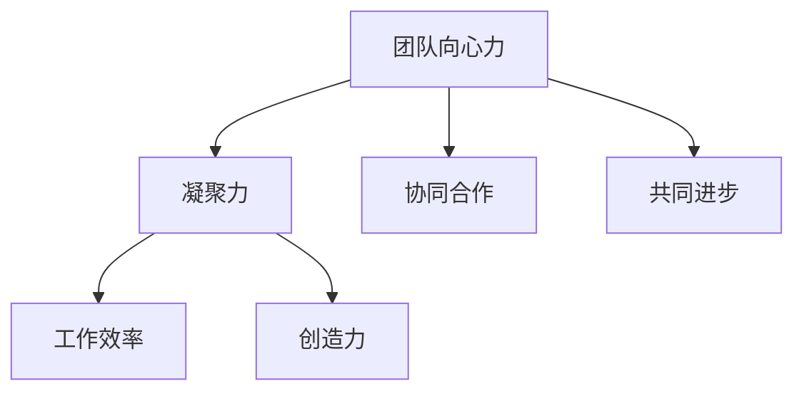

#### 1.2 团队向心力的重要性

团队向心力对团队的稳定性和绩效有重要影响。具体表现如下：

1. **提高工作效率：** 团队成员之间相互协作，能够快速解决问题，提高工作效率。
2. **增强创造力：** 团队成员之间的思维碰撞，有助于产生新的创意和解决方案。
3. **促进团队稳定：** 高度团结的团队更容易应对外部压力，保持稳定发展。

#### 1.3 团队向心力与其他团队要素的关系

团队向心力与其他团队要素之间存在密切的关系：

1. **与领导力：** 领导者通过提升自身的领导力，可以增强团队的向心力。
2. **与团队文化：** 健康的团队文化有助于培养团队成员的向心力。
3. **与激励机制：** 有效的激励机制能够激发团队成员的积极性，提高团队向心力。

#### 小结

团队向心力是团队稳定发展和高效运作的关键。了解其定义、重要性和与其他要素的关系，有助于团队领导者更好地提升团队向心力，打造一支强大的团队。

---

### 第2章：团队文化建设

#### 2.1 团队文化的概念与类型

团队文化是指团队成员共同遵循的价值观、信念和行为准则。它是团队凝聚力的重要基础。根据团队文化的内容和特点，可以分为以下几种类型：

1. **目标导向型文化：** 强调团队目标的实现，鼓励成员为实现目标而努力。
2. **创新导向型文化：** 鼓励团队成员创新思维，勇于尝试新方法，提高团队竞争力。
3. **合作导向型文化：** 强调团队合作，鼓励成员之间相互支持，共同成长。
4. **任务导向型文化：** 关注团队任务的完成情况，强调团队成员的职责和任务分配。

**Mermaid 流程图：**

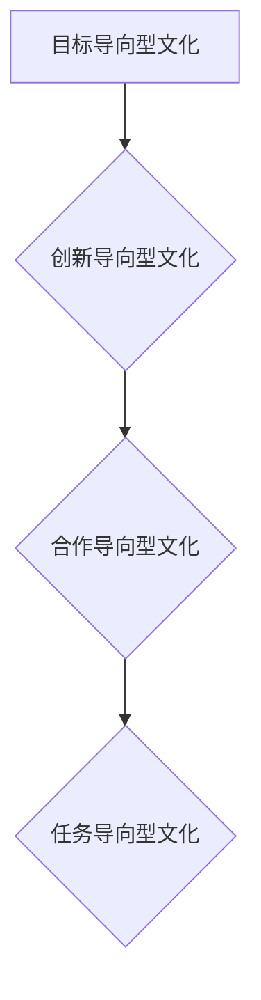

#### 2.2 团队文化的建设方法

建设团队文化需要从以下几个方面入手：

1. **明确价值观：** 确定团队的核心价值观，使其成为团队行为的指南。
2. **建立共同目标：** 设定明确的团队目标，激发成员的积极性和参与感。
3. **培养团队精神：** 鼓励团队成员相互支持，共同面对挑战。
4. **加强沟通与协作：** 提供良好的沟通渠道，促进团队成员之间的协作。
5. **塑造榜样人物：** 树立榜样，让团队成员有学习的对象和目标。

#### 2.3 团队文化的评估与改进

团队文化的评估与改进是持续优化团队文化的重要环节。可以从以下几个方面进行评估：

1. **团队成员满意度：** 通过问卷调查、访谈等方式了解团队成员对团队文化的满意度。
2. **团队绩效：** 分析团队在实现目标过程中的绩效，评估团队文化的影响。
3. **外部反馈：** 收集客户、合作伙伴等外部主体对团队文化的反馈，了解团队在行业中的形象。

**Mermaid 流�程图：**

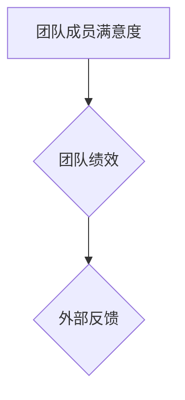

#### 小结

团队文化建设是提升团队向心力的关键环节。通过明确团队文化类型、建设方法和评估改进，有助于团队形成强大的集体认同感，提高团队的整体效能。

---

### 第3章：领导力与团队向心力

#### 3.1 领导力对团队向心力的影响

领导力在团队向心力的形成中扮演着关键角色。领导者的行为和决策直接影响团队成员的向心力和团队的整体氛围。

1. **激励与引导：** 领导者通过激励和引导，激发团队成员的积极性和参与感，增强团队的向心力。
2. **决策与协调：** 领导者通过合理的决策和协调，确保团队目标的实现，提高团队的整体效能。
3. **沟通与信任：** 领导者通过有效的沟通和建立信任，促进团队成员之间的合作，增强团队的凝聚力。

**Mermaid 流程图：**

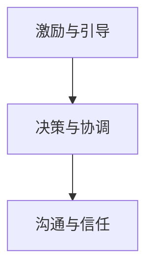

#### 3.2 建立强大领导力的方法

要建立强大的领导力，领导者需要从以下几个方面着手：

1. **明确角色定位：** 领导者要明确自己的角色定位，树立正确的领导观念。
2. **提升自身能力：** 领导者要不断学习和提升自己的能力，包括管理技能、沟通能力、决策能力等。
3. **建立信任关系：** 领导者要通过真诚和透明的方式与团队成员建立信任关系，增强团队的凝聚力。
4. **关注团队成员发展：** 领导者要关心团队成员的个人成长，提供培训和指导，激发团队成员的潜力。

**Mermaid 流程图：**

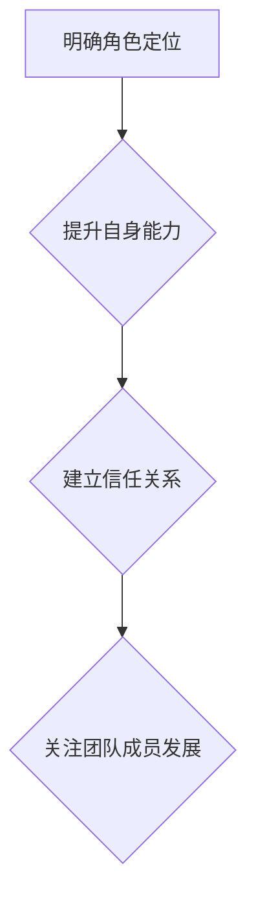

#### 3.3 领导者如何增强团队向心力

领导者可以通过以下几种方法来增强团队向心力：

1. **加强团队建设活动：** 组织团队建设活动，促进团队成员之间的交流与合作。
2. **制定明确的团队目标：** 与团队成员共同制定明确的团队目标，提高团队的凝聚力和战斗力。
3. **建立有效的沟通机制：** 与团队成员保持良好的沟通，了解他们的需求和意见，及时解决问题。
4. **给予适当的激励：** 根据团队成员的表现，给予适当的激励，提高他们的工作积极性和归属感。

**Mermaid 流程图：**

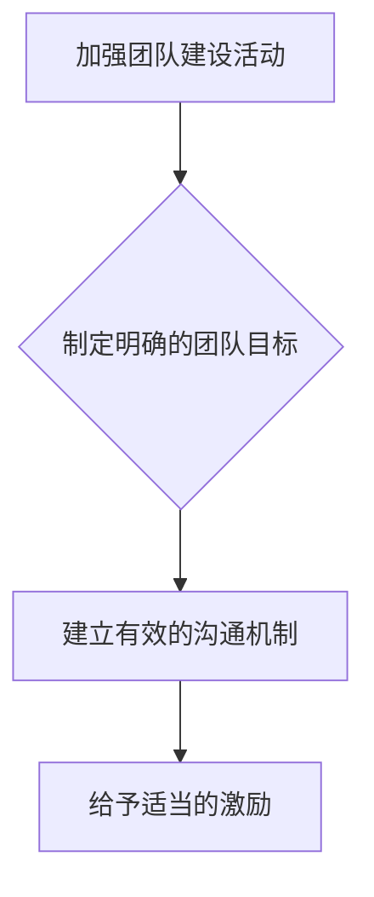

#### 小结

领导力是提升团队向心力的关键因素。通过明确领导力的重要性、建立强大领导力的方法以及如何增强团队向心力，领导者可以有效地提升团队的集体认同感，推动团队的发展。

---

### 第4章：沟通技巧与团队向心力

#### 4.1 沟通在团队中的作用

沟通是团队运作的基石，对于提升团队向心力具有重要作用。具体体现在以下几个方面：

1. **信息传递：** 沟通是信息传递的重要渠道，有助于团队成员了解团队目标、任务分配和工作进度。
2. **消除误解：** 通过沟通，可以及时消除团队成员之间的误解和分歧，避免不必要的冲突。
3. **增强协作：** 沟通有助于团队成员之间的协作，提高团队的工作效率和创造力。
4. **提升信任：** 通过有效的沟通，团队成员可以建立信任，增强团队的凝聚力。

**Mermaid 流程图：**

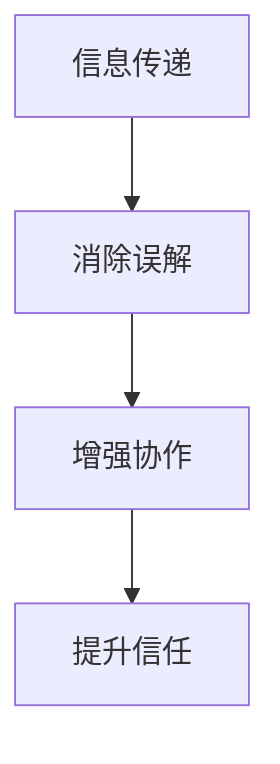

#### 4.2 沟通障碍与解决策略

尽管沟通在团队中至关重要，但仍然存在各种沟通障碍。以下是一些常见的沟通障碍及其解决策略：

1. **语言障碍：** 解决策略：使用简单明了的语言，避免使用专业术语和复杂的句子结构。
2. **信息过载：** 解决策略：合理安排沟通时间和频率，避免信息过载，确保重要信息得到有效传递。
3. **文化差异：** 解决策略：尊重不同文化背景的团队成员，了解并尊重他们的沟通习惯和价值观。
4. **心理障碍：** 解决策略：建立良好的心理氛围，鼓励团队成员表达自己的观点，提高沟通的积极性。

**Mermaid 流程图：**

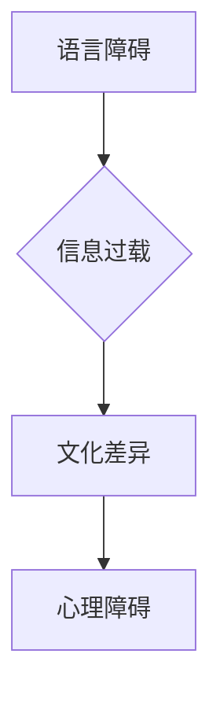

#### 4.3 提高团队沟通技巧的方法

为了提高团队的沟通技巧，可以采取以下措施：

1. **开展沟通培训：** 定期组织沟通技巧培训，提高团队成员的沟通能力。
2. **建立沟通机制：** 设立定期的团队会议、工作汇报和意见反馈机制，确保沟通渠道的畅通。
3. **鼓励双向沟通：** 鼓励团队成员积极参与沟通，不仅要表达自己的观点，也要倾听他人的意见。
4. **使用多种沟通工具：** 结合文字、语音、视频等多种沟通方式，提高沟通的效率和效果。

**Mermaid 流程图：**

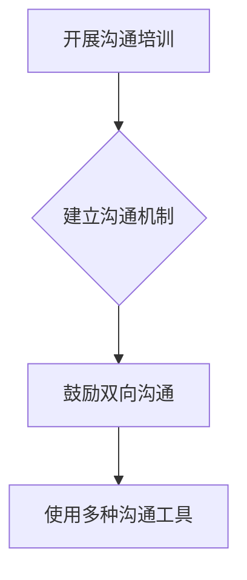

#### 小结

沟通技巧是提升团队向心力的重要手段。通过了解沟通在团队中的作用、沟通障碍及其解决策略，以及提高团队沟通技巧的方法，团队成员可以更好地协同合作，共同推动团队的发展。

---

### 第5章：激励机制与团队向心力

#### 5.1 激励理论及其应用

激励机制是提升团队向心力的重要手段之一。激励理论为激励机制的设计和实施提供了理论基础。以下是一些常见的激励理论及其应用：

1. **马斯洛需求层次理论：** 根据马斯洛的需求层次理论，激励应该从满足团队成员的不同层次需求入手，包括生理需求、安全需求、社交需求、尊重需求和自我实现需求。
2. **赫茨伯格双因素理论：** 赫茨伯格双因素理论指出，激励因素（如成就感、认可、工作本身等）和保健因素（如薪资、工作环境等）共同作用于团队成员的满意度。通过改善保健因素，可以消除不满，而通过激励因素，可以激发团队成员的积极性。
3. **目标设定理论：** 目标设定理论认为，明确、有挑战性的目标可以激发团队成员的工作热情和动力。领导者需要与团队成员共同设定目标，并定期检查和调整目标。

**Mermaid 流程图：**

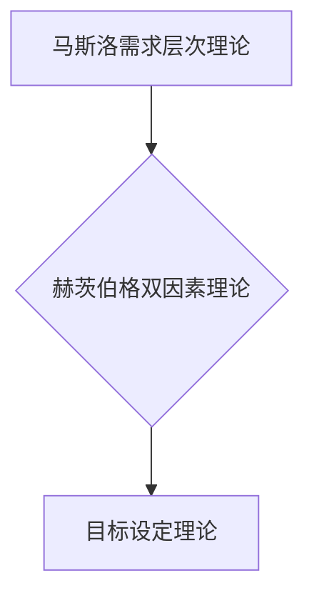

#### 5.2 建立有效的激励机制

建立有效的激励机制需要考虑以下几个方面：

1. **明确激励目标：** 确定激励的目的是提升团队成员的积极性、归属感和团队向心力。
2. **多样化激励手段：** 结合物质激励和非物质激励，满足团队成员的不同需求。物质激励包括奖金、晋升、福利等；非物质激励包括表彰、培训、晋升机会等。
3. **公平公正：** 激励机制要公平公正，确保每位团队成员都有机会获得激励，避免产生不公平感。
4. **个性化激励：** 考虑到团队成员的差异，提供个性化的激励措施，使每位成员都感受到被重视和认可。

**Mermaid 流程图：**

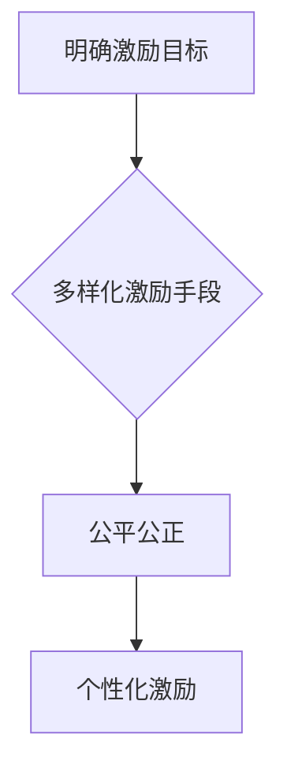

#### 5.3 激励机制对团队向心力的影响

激励机制对团队向心力具有显著的影响。一方面，通过有效的激励机制，可以激发团队成员的积极性和主动性，提高团队的整体绩效；另一方面，良好的激励机制有助于增强团队成员的归属感和团队认同感，提升团队向心力。

**Mermaid 流程图：**

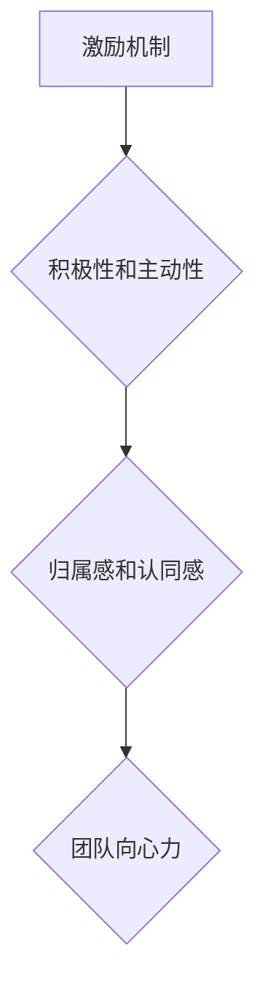

#### 小结

激励机制是提升团队向心力的重要手段。通过了解激励理论、建立有效的激励机制，以及认识到激励机制对团队向心力的影响，团队领导者可以更好地激发团队成员的潜力，推动团队的发展。

---

### 第6章：团队活动与团队向心力

#### 6.1 团队活动的类型与作用

团队活动是增强团队向心力的重要手段。根据活动内容和形式，可以分为以下几类：

1. **培训活动：** 通过培训活动，提升团队成员的专业技能和团队协作能力。
2. **团队建设活动：** 如团建拓展、主题晚会等，增强团队成员之间的相互了解和信任。
3. **竞赛活动：** 如团队比赛、项目PK等，激发团队成员的竞争意识和团队精神。
4. **公益活动：** 参与公益活动，培养团队成员的社会责任感和团队荣誉感。

**Mermaid 流程图：**

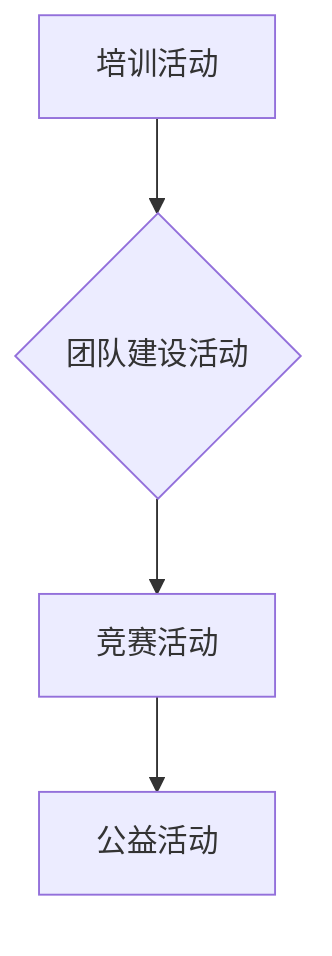

#### 6.2 团队活动的策划与组织

策划和组织团队活动需要考虑以下几个关键因素：

1. **活动目标：** 确定活动的主要目标，如提升技能、增强协作、培养责任感等。
2. **活动形式：** 根据目标选择合适的活动形式，如培训讲座、户外拓展、团队比赛等。
3. **活动时间：** 安排合适的时间，确保团队成员能够积极参与。
4. **活动预算：** 根据预算制定活动计划，合理分配资源。

**Mermaid 流程图：**

```mermaid
graph TD
    A[活动目标] --> B{活动形式}
    B --> C[活动时间}
    C --> D[活动预算]
```

#### 6.3 团队活动对团队向心力的提升

团队活动对团队向心力的提升具有显著的积极作用。具体表现在以下几个方面：

1. **增强团队合作：** 通过团队活动，团队成员可以更好地了解彼此，增强协作能力，提高团队整体效能。
2. **提高团队凝聚力：** 团队活动有助于团队成员之间建立深厚的情感联系，提高团队的凝聚力。
3. **激发团队潜力：** 团队活动可以激发团队成员的积极性和创造力，推动团队发展。

**Mermaid 流程图：**

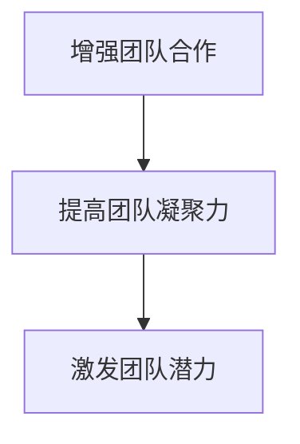

#### 小结

团队活动是提升团队向心力的重要途径。通过了解团队活动的类型与作用、策划与组织的要点，以及团队活动对团队向心力的提升效果，团队领导者可以更好地利用团队活动，打造一支团结协作、积极进取的团队。

---

### 第7章：外部因素与团队向心力

#### 7.1 外部环境对团队向心力的影响

外部环境是影响团队向心力的重要因素。外部环境的变化会对团队的运作产生直接或间接的影响，进而影响团队向心力。以下是一些主要的外部环境因素及其对团队向心力的影响：

1. **市场竞争：** 市场竞争的加剧会导致团队面临更大的压力，需要提高工作效率和创新能力，从而增强团队向心力。
2. **行业趋势：** 行业趋势的变化会影响团队的发展方向和策略，团队需要调整自身的运作方式，以适应行业变革，这可能会对团队向心力产生影响。
3. **政策法规：** 政策法规的变化可能会对团队的管理模式、业务流程等方面产生影响，团队需要适应新的政策法规，这可能对团队向心力产生一定影响。
4. **经济环境：** 经济环境的波动会影响团队的财务状况和员工福利，进而影响团队成员的稳定性和向心力。

**Mermaid 流程图：**

```mermaid
graph TD
    A[市场竞争] --> B{行业趋势}
    B --> C[政策法规}
    C --> D[经济环境]
```

#### 7.2 应对外部挑战的策略

为了应对外部挑战，团队可以采取以下策略：

1. **调整战略：** 根据外部环境的变化，及时调整团队的战略目标和发展方向。
2. **提高适应能力：** 培养团队成员的适应能力和应变能力，使团队能够快速应对外部变化。
3. **增强团队凝聚力：** 通过团队活动和文化建设，增强团队成员之间的相互支持，提高团队的凝聚力。
4. **提升创新能力：** 鼓励团队成员创新思维，提高团队的创新能力，以应对外部挑战。

**Mermaid 流程图：**

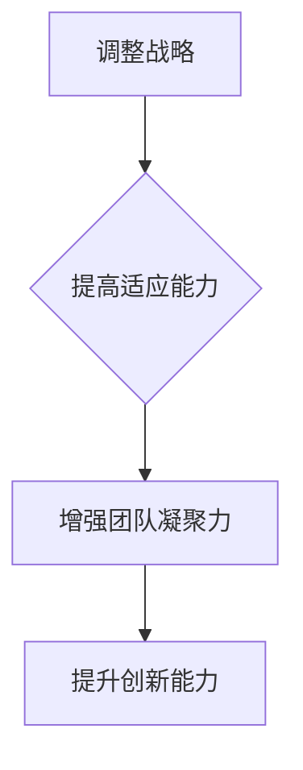

#### 7.3 外部因素对团队向心力的影响分析

外部因素对团队向心力的影响是复杂的，既可能产生积极的影响，也可能产生消极的影响。以下是外部因素对团队向心力影响的几个方面：

1. **积极影响：** 市场竞争和行业趋势的变化可能会激发团队的斗志和创造力，增强团队向心力。
2. **消极影响：** 经济环境的波动和政策法规的变化可能会对团队产生压力，影响团队成员的稳定性和向心力。
3. **中性影响：** 一些外部因素，如行业变革和政策调整，可能会对团队产生中性影响，既不增强也不减弱团队向心力。

**Mermaid 流程图：**

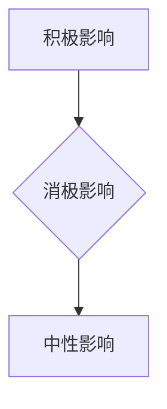

#### 小结

外部环境是影响团队向心力的重要因素。通过了解外部因素对团队向心力的影响、应对外部挑战的策略，以及外部因素对团队向心力的具体影响，团队领导者可以更好地应对外部环境的变化，维护和提升团队的向心力。

---

### 第8章：案例分析

#### 8.1 成功案例分享

在本节中，我们将分享一些团队向心力建设方面的成功案例，分析其成功的原因和关键因素。

**案例一：谷歌的团队文化**

谷歌以其独特的团队文化而闻名，这种文化强调创新、自由和开放。谷歌的团队文化成功地激发了员工的积极性和创造力，使谷歌成为全球科技巨头之一。成功原因包括：

1. **创新文化：** 谷歌鼓励员工创新，提供大量的资源和时间，使员工能够自由地探索新的想法。
2. **自由氛围：** 谷歌允许员工自主决定工作内容和方式，使员工能够更好地发挥自己的潜力。
3. **开放沟通：** 谷歌提倡开放和透明的沟通，鼓励员工提出意见和建议，从而提高团队的协作效率。

**案例二：微软的领导力培养**

微软通过一系列的领导力培养计划，成功地提升了团队的向心力。成功原因包括：

1. **明确的领导力发展路径：** 微软为员工提供了清晰的领导力发展路径，使员工知道如何成为领导者。
2. **领导力培训：** 微软定期举办领导力培训，帮助员工提升领导力和管理技能。
3. **员工参与决策：** 微软鼓励员工参与决策过程，使员工感到被重视和认可，从而增强团队的凝聚力。

#### 8.2 失败案例反思

在本节中，我们将分析一些团队向心力建设方面的失败案例，探讨其失败的原因和教训。

**案例一：失败的团建活动**

某公司在一次团建活动中，选择了高空攀岩项目。由于项目难度较高，部分员工无法完成，导致他们在团队中的自信心受到打击。失败原因包括：

1. **不合适的团建活动：** 没有考虑到员工的个性和能力，选择了过于困难的团建活动。
2. **缺乏心理准备：** 没有为员工提供足够的时间和心理准备，导致他们在活动中感到压力和不安。
3. **缺乏有效沟通：** 活动前没有与员工进行充分的沟通，导致员工对活动有误解和疑虑。

**案例二：领导力不足**

某公司的领导者缺乏有效的领导力，导致团队向心力下降。失败原因包括：

1. **缺乏决策能力：** 领导者无法做出有效的决策，使团队在关键时刻失去方向。
2. **缺乏沟通能力：** 领导者无法与员工进行有效的沟通，导致员工对团队的目标和计划不清晰。
3. **缺乏激励能力：** 领导者无法激励员工，导致员工缺乏工作动力和归属感。

#### 8.3 案例分析总结与启示

通过以上案例分析，我们可以得出以下结论：

1. **成功的团队向心力建设：** 需要建立积极的文化氛围、提供有效的领导力和培养员工的自信心。
2. **失败的团队向心力建设：** 往往由于不合适的团建活动、领导力不足或其他外部因素导致。

这为我们在实际工作中提供了宝贵的经验和启示，帮助我们更好地提升团队向心力，打造一支强大的团队。

#### 小结

通过分析成功和失败的团队向心力建设案例，我们可以了解关键因素和教训，从而在实际工作中更好地提升团队的集体认同感，推动团队的发展。

---

### 第9章：团队向心力的评估与改进

#### 9.1 团队向心力的评估方法

团队向心力的评估是了解团队现状、发现问题并进行改进的重要环节。以下是一些常用的团队向心力评估方法：

1. **问卷调查：** 通过设计针对性的问卷，了解团队成员对团队向心力的感受和评价。
2. **访谈：** 对团队成员进行个别访谈，深入了解他们对团队向心力的看法和意见。
3. **行为观察：** 通过观察团队成员在日常工作中的行为，评估团队向心力的高低。
4. **团队绩效评估：** 通过分析团队在项目完成情况、工作效率和创新能力等方面的表现，评估团队向心力的影响。

**Mermaid 流程图：**

```mermaid
graph TD
    A[问卷调查] --> B{访谈}
    B --> C[行为观察}
    C --> D[团队绩效评估]
```

#### 9.2 团队向心力改进的策略

在了解团队向心力现状的基础上，团队领导者需要制定相应的改进策略，以提升团队向心力。以下是一些有效的改进策略：

1. **加强团队建设：** 定期组织团队建设活动，增强团队成员之间的相互了解和信任。
2. **优化激励机制：** 根据团队成员的需求和表现，调整激励机制，提高团队成员的工作积极性和归属感。
3. **提升沟通技巧：** 通过培训和实践，提升团队成员的沟通技巧，消除沟通障碍，增强团队协作。
4. **完善领导力培养：** 加强领导力培训，提高领导者的决策能力、沟通能力和激励能力，为团队提供强有力的领导支持。

**Mermaid 流程图：**

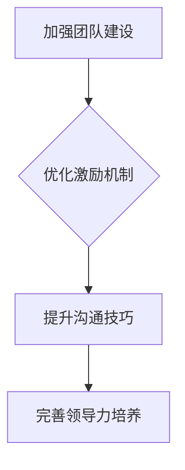

#### 9.3 团队向心力提升的长期规划

提升团队向心力是一个长期的过程，需要制定长期的规划，持续关注和改进。以下是一些长期规划的策略：

1. **建立持续改进机制：** 建立定期评估和反馈机制，确保团队向心力不断提升。
2. **关注员工发展：** 制定员工发展计划，为员工提供培训和发展机会，提高员工的综合素质。
3. **优化团队文化：** 持续优化团队文化，使其成为团队向心力的有力支撑。
4. **建立团队愿景：** 明确团队愿景和目标，激发团队成员的使命感和责任感。

**Mermaid 流程图：**

```mermaid
graph TD
    A[建立持续改进机制] --> B{关注员工发展}
    B --> C[优化团队文化]
    C --> D[建立团队愿景]
```

#### 小结

团队向心力的评估与改进是团队管理的重要环节。通过了解评估方法、制定改进策略和实施长期规划，团队领导者可以不断提升团队向心力，打造一支高效协作的团队。

---

### 第10章：未来展望

#### 10.1 团队向心力的发展趋势

随着社会经济的发展和科技的进步，团队向心力的发展也呈现出一些新的趋势：

1. **多元化团队：** 随着全球化进程的加速，团队越来越多元化，包括文化、年龄、性别等方面的多样性。这要求团队领导者具备更广泛的视角和沟通技巧，以提升团队向心力。
2. **远程工作：** 远程工作的普及对团队向心力提出了新的挑战。通过数字化工具和沟通平台，团队领导者需要找到新的方式来维持团队的凝聚力。
3. **个性化激励：** 随着员工对自我实现和个人成长的重视，团队激励机制越来越注重个性化，以满足员工的多样化需求。

**Mermaid 流程图：**

```mermaid
graph TD
    A[多元化团队] --> B{远程工作}
    B --> C[个性化激励]
```

#### 10.2 新技术对团队向心力的影响

新技术的不断发展对团队向心力产生了深远的影响：

1. **人工智能与大数据：** 人工智能和大数据分析可以帮助团队领导者更好地了解团队成员的需求和行为，从而优化团队管理和激励机制。
2. **区块链技术：** 区块链技术可以提供更加透明和安全的团队协作环境，提高团队成员的信任和协作效率。
3. **虚拟现实与增强现实：** 虚拟现实和增强现实技术可以为团队活动提供全新的体验，增强团队成员的参与感和团队凝聚力。

**Mermaid 流程图：**

```mermaid
graph TD
    A[人工智能与大数据] --> B{区块链技术}
    B --> C[虚拟现实与增强现实]
```

#### 10.3 未来团队向心力研究的方向

未来团队向心力研究可以关注以下几个方向：

1. **跨文化团队管理：** 探索如何在不同文化背景下提升团队向心力，促进团队协作。
2. **远程团队协作：** 研究如何通过新技术和工具提高远程团队的协作效率和向心力。
3. **个性化激励机制：** 深入研究如何设计个性化的激励机制，满足团队成员的多样化需求。
4. **团队心理健康：** 探索团队心理健康对团队向心力的影响，为团队提供更全面的关怀和支持。

**Mermaid 流程图：**

```mermaid
graph TD
    A[跨文化团队管理] --> B{远程团队协作}
    B --> C[个性化激励机制]
    C --> D[团队心理健康]
```

#### 小结

未来团队向心力的发展将受到多元化团队、新技术和个性化激励等因素的推动。通过关注这些趋势和研究方向，团队领导者可以更好地提升团队的向心力，推动团队的发展。

---

### 作者信息

**作者：** AI天才研究院/AI Genius Institute & 禅与计算机程序设计艺术 /Zen And The Art of Computer Programming

---

本文通过系统地分析和探讨团队向心力的定义、重要性、建设方法、外部因素、评估与改进以及未来展望，为团队领导者提供了一套完整的团队向心力提升策略。希望本文能够为您的团队管理提供有价值的参考和启示，帮助您打造一支高效协作、积极进取的团队。

