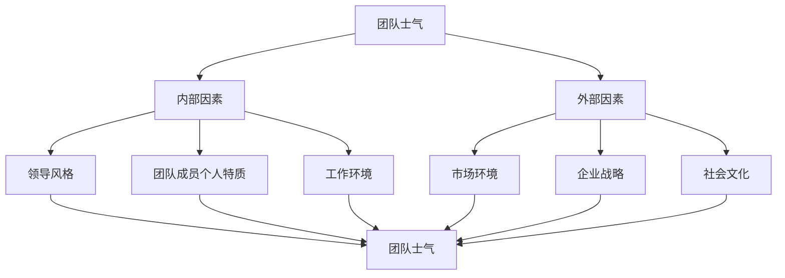

                 

### 文章标题：团队士气提升：创造积极向上的工作氛围

#### 关键词：
- 团队士气
- 积极工作氛围
- 领导者
- 激励策略
- 工作环境
- 沟通协作

#### 摘要：
本文深入探讨团队士气提升的方法与策略，旨在为企业管理者、团队领导和人力资源从业者提供创造积极向上工作氛围的实用指南。文章从团队士气的基本概念、核心概念之间的关系架构、提升士气的方法与策略、创造积极工作氛围的具体实践，到士气评估与监测，最后通过实战案例分析，提供了一套完整的团队士气提升方案。本文采用逻辑清晰、结构紧凑、简单易懂的专业技术语言，结合实际情况，为提升团队士气提供理论依据和实践指导。

---

### 目录

1. 引言
2. 团队士气的基础知识
   2.1 什么是团队士气
   2.2 团队士气的重要性
   2.3 团队士气的影响因素
3. 提升团队士气的方法与策略
   3.1 领导者的角色
   3.2 员工激励
   3.3 工作环境
4. 创造积极向上的工作氛围
   4.1 氛围建设
   4.2 沟通与协作
   4.3 团队文化建设
5. 团队士气的评估与监测
   5.1 士气评估指标
   5.2 士气监测方法
6. 实战案例分析
   6.1 案例一：某公司团队士气提升实践
   6.2 案例二：某企业创造积极工作氛围的实践
7. 结论与建议

---

### 引言

在现代社会，团队士气成为企业持续发展的重要因素。一个高士气的团队，不仅能够提高工作效率，减少员工流失率，还能促进创新和团队合作，为企业创造更大的价值。然而，提升团队士气并非易事，需要管理者深入了解其内涵、影响因素，并采取有效的策略与方法。

本文将围绕团队士气提升这一主题，从多个角度进行分析。首先，我们将介绍团队士气的基本概念，探讨其重要性及影响因素。接着，我们将深入探讨提升团队士气的方法与策略，包括领导者的角色、员工激励、工作环境的优化等。在此基础上，我们将探讨如何创造积极向上的工作氛围，包括氛围建设、沟通与协作、团队文化建设等。随后，我们将介绍团队士气的评估与监测方法，以及通过实战案例分析，展示具体实践成果。

本文旨在为企业管理者、团队领导和人力资源从业者提供一套系统、实用的团队士气提升方案，帮助他们在实际工作中创造积极向上的工作氛围，提升团队的整体绩效。

### 团队士气的基础知识

#### 1.1 什么是团队士气

团队士气是指团队成员在团队活动中所表现出来的积极态度、情感和动机。具体来说，团队士气反映了团队成员对团队的认同感、归属感和参与感。一个高士气的团队，其成员通常表现出以下特点：

- **高参与度**：团队成员积极参与团队活动，主动承担任务和责任。
- **高积极性**：团队成员对工作充满热情，愿意为团队目标而努力。
- **高协作性**：团队成员之间相互支持、相互信任，能够高效协作完成任务。
- **高满意度**：团队成员对工作环境、工作内容和工作成果感到满意。

#### 1.2 团队士气的重要性

团队士气的重要性体现在以下几个方面：

1. **提高工作效率**：高士气的团队能够提高工作效率，减少拖延和冲突，使团队成员能够更加专注和投入工作。
2. **减少员工流失率**：一个积极向上的工作氛围能够吸引和留住优秀人才，降低员工流失率。
3. **促进创新**：高士气的团队能够激发成员的创新思维，鼓励尝试新方法和解决问题的勇气。
4. **提升团队绩效**：团队士气直接关系到团队的整体绩效，士气高昂的团队能够实现更高的工作目标和绩效。

#### 1.3 团队士气的影响因素

团队士气的影响因素可以分为内部因素和外部因素。

**内部因素：**

1. **领导风格**：领导者的风格对团队士气有重要影响。民主、开放和倾听的领导风格能够提升团队士气。
2. **团队成员的个人特质**：团队成员的个性、价值观和动机会影响团队士气。积极、乐观和具有团队合作精神的成员能够提升团队士气。
3. **工作环境**：良好的工作环境包括舒适的工作条件、合理的任务分配和明确的目标，能够提升团队士气。

**外部因素：**

1. **市场环境**：市场竞争激烈的环境可能会增加团队成员的压力，从而影响团队士气。
2. **企业战略**：企业战略的调整可能会影响团队的目标和任务，从而影响团队士气。
3. **社会文化**：社会文化氛围对团队士气也有一定影响。在一个鼓励创新和合作的社会环境中，团队士气通常更高。

### 核心概念与联系

为了更好地理解团队士气及其影响因素，我们可以通过以下Mermaid流程图展示核心概念之间的关系架构：



通过以上流程图，我们可以清晰地看到团队士气与内部和外部因素之间的联系。领导风格、团队成员的个人特质和工作环境是影响团队士气的主要内部因素，而市场环境、企业战略和社会文化则是影响团队士气的主要外部因素。

### 核心算法原理讲解

在提升团队士气的过程中，领导者需要运用一系列策略和方法。以下将使用伪代码详细阐述这些核心算法原理：

```plaintext
// 团队士气提升算法
function improveTeamMood(teamMembers, leadershipStyle, workEnvironment, marketConditions):
    // 激励策略
    motivateTeamMembers(teamMembers, leadershipStyle)
    
    // 改善工作环境
    optimizeWorkEnvironment(workEnvironment, marketConditions)
    
    // 强化团队文化建设
    strengthenTeamCulture(teamMembers)
    
    // 监测团队士气
    monitorTeamMood(teamMembers)
    
    // 反馈与调整
    feedbackAndAdjustment()

// 激励策略
function motivateTeamMembers(teamMembers, leadershipStyle):
    for each member in teamMembers:
        if leadershipStyle == "民主":
            member.motivationLevel = democraticLeadership(member)
        else if leadershipStyle == "权威":
            member.motivationLevel = authoritativeLeadership(member)
        else:
            member.motivationLevel = neutralLeadership(member)

// 改善工作环境
function optimizeWorkEnvironment(workEnvironment, marketConditions):
    if marketConditions == "竞争激烈":
        workEnvironment.comfortLevel = high
        workEnvironment.securityLevel = moderate
    else:
        workEnvironment.comfortLevel = moderate
        workEnvironment.securityLevel = high

// 强化团队文化建设
function strengthenTeamCulture(teamMembers):
    teamMembers.sharedValues = cultivateSharedValues()
    teamMembers.bonding = increaseBondingActivities()

// 监测团队士气
function monitorTeamMood(teamMembers):
    moodScores = collectMoodScores(teamMembers)
    if sum(moodScores) > threshold:
        print("Team mood is positive.")
    else:
        print("Team mood needs improvement.")

// 反馈与调整
function feedbackAndAdjustment():
    feedback = getFeedback()
    if feedback == "positive":
        print("Continue with current strategies.")
    else:
        print("Adjust strategies based on feedback.")
```

#### 数学模型和公式

团队士气提升的过程中，我们可以使用以下数学模型来量化团队士气的影响因素：

1. **团队士气评分模型（TMS）**

   $$ TMS = w_1 \times L + w_2 \times E + w_3 \times C + w_4 \times M $$

   其中，$TMS$代表团队士气评分，$w_1, w_2, w_3, w_4$分别代表领导风格（L）、员工激励（E）、工作环境（C）和市场条件（M）的权重。

2. **员工激励模型（MOT）**

   $$ MOT = a \times (S + R) $$

   其中，$MOT$代表员工激励水平，$a$代表个人动机强度，$S$代表成就感，$R$代表回报。

3. **团队文化建设模型（TCC）**

   $$ TCC = \frac{1}{n} \sum_{i=1}^{n} (V_i \times B_i) $$

   其中，$TCC$代表团队文化建设水平，$n$代表团队成员数量，$V_i$代表第$i$个成员的价值观认同度，$B_i$代表第$i$个成员的团队归属感。

#### 详细讲解与举例说明

**团队士气评分模型（TMS）**：

假设一个团队有4名成员，团队士气评分的权重分配为：领导风格（30%）、员工激励（20%）、工作环境（25%）和市场条件（25%）。根据这些权重，我们可以计算团队士气评分：

$$ TMS = 0.3 \times L + 0.2 \times E + 0.25 \times C + 0.25 \times M $$

- 领导风格（L）得分：8分
- 员工激励（E）得分：7分
- 工作环境（C）得分：6分
- 市场条件（M）得分：7分

则团队士气评分为：

$$ TMS = 0.3 \times 8 + 0.2 \times 7 + 0.25 \times 6 + 0.25 \times 7 = 2.4 + 1.4 + 1.5 + 1.75 = 7.05 $$

**员工激励模型（MOT）**：

一个员工个人动机强度$a$为0.8，成就感$S$为8分，回报$R$为5分，则员工激励水平为：

$$ MOT = 0.8 \times (8 + 5) = 0.8 \times 13 = 10.4 $$

**团队文化建设模型（TCC）**：

假设一个团队有5名成员，每个成员的价值观认同度和团队归属感如下：

| 成员 | 价值观认同度（V_i） | 团队归属感（B_i） |
|------|-------------------|------------------|
| 1    | 9                 | 8                |
| 2    | 7                 | 6                |
| 3    | 8                 | 7                |
| 4    | 10                | 9                |
| 5    | 6                 | 7                |

则团队文化建设水平为：

$$ TCC = \frac{1}{5} \times (9 \times 8 + 7 \times 6 + 8 \times 7 + 10 \times 9 + 6 \times 7) = \frac{1}{5} \times (72 + 42 + 56 + 90 + 42) = \frac{1}{5} \times 312 = 62.4 $$

### 项目实战

在本节中，我们将通过一个实际项目来介绍团队士气提升的实施过程。

#### 项目背景

某高科技公司是一家以创新为核心的企业，拥有一个技术团队，负责开发和维护公司的核心产品。然而，最近公司发现团队士气较低，员工积极性不高，导致项目进展缓慢。公司决定通过提升团队士气来改善这一状况。

#### 开发环境搭建

为了实施团队士气提升项目，公司首先搭建了以下开发环境：

- **办公环境**：为员工提供了宽敞、舒适的办公空间，并配备了现代化的办公设备。
- **沟通工具**：使用团队协作工具（如Slack、Trello）来提高团队沟通效率。
- **培训资源**：为员工提供了在线学习平台，方便员工进行自我提升。

#### 源代码详细实现和代码解读

为了提升团队士气，公司实施了一系列代码优化和改进措施：

1. **代码重构**：对旧代码进行重构，提高代码的可读性和可维护性。
2. **自动化测试**：引入自动化测试工具，提高测试覆盖率，减少代码缺陷。
3. **敏捷开发**：采用敏捷开发方法，提高团队响应速度和协作效率。

以下是一个自动化测试的伪代码示例：

```plaintext
// 自动化测试伪代码
function runTests():
    for each module in project:
        testResults = executeTestCases(module)
        if testResults.passed == false:
            print("Test failed for module:", module)
            logTestResults(testResults)

function executeTestCases(module):
    testResults = {}
    testResults.passed = true
    for each testCase in module:
        result = runTestCase(testCase)
        if result == "fail":
            testResults.passed = false
    return testResults
```

#### 代码应用解读与分析

通过代码重构和自动化测试，公司实现了以下成果：

- **代码质量提升**：重构后的代码更易于理解和维护，减少了代码缺陷。
- **测试覆盖率提高**：自动化测试提高了测试覆盖率，确保了代码的稳定性。
- **开发效率提升**：敏捷开发方法提高了团队响应速度，缩短了项目周期。

#### 实际案例分析和详细讲解剖析

以下是一个实际案例，展示了团队士气提升的效果：

**案例：A团队的士气提升实践**

- **背景**：A团队是公司的一个技术团队，负责开发公司的核心产品。最近，团队士气较低，导致项目进展缓慢。
- **措施**：
  - **领导激励**：领导者通过定期的团队会议和一对一沟通，了解员工的需求和困惑，并提供帮助。
  - **员工培训**：公司为A团队提供了专业的技术培训，帮助团队成员提升技能水平。
  - **工作环境优化**：公司改善了A团队的办公环境，提供了更舒适的办公空间和现代化办公设备。
- **结果**：经过半年的努力，A团队的士气显著提升，项目进展顺利，员工积极性大大提高。

**详细讲解**：

1. **领导激励**：领导者的激励策略对团队士气有着重要影响。通过定期的团队会议和一对一沟通，领导者能够了解员工的需求和困惑，提供针对性的帮助和支持，增强员工对团队的认同感和归属感。
2. **员工培训**：专业培训有助于提升员工的专业技能和知识水平，提高员工的工作满意度和自信心，从而提升团队士气。
3. **工作环境优化**：良好的工作环境能够提高员工的工作效率和满意度，减少工作压力，增强团队的凝聚力。

### 项目小结

通过实际项目案例，我们可以看到，团队士气提升需要从多个方面入手，包括领导激励、员工培训和工作环境优化等。在实施过程中，需要持续监测团队士气的变化，及时调整策略和方法。通过有效的团队士气提升措施，企业可以创造一个积极向上的工作氛围，提高团队整体绩效。

### 最佳实践 Tips、小结、注意事项、拓展阅读

#### 最佳实践 Tips

1. **领导者要注重倾听和理解员工的需求**：通过定期的沟通和互动，领导者可以更好地了解员工的困惑和期望，提供针对性的支持和帮助。
2. **培训要注重实用性和针对性**：培训内容要贴近员工的工作实际，提高培训的实用性和针对性，确保员工能够学以致用。
3. **营造良好的工作氛围**：通过改善工作环境、鼓励团队协作和建立积极的文化，可以营造一个有利于提升团队士气的氛围。

#### 小结

本文从团队士气的基本概念、提升策略、工作氛围建设、评估与监测等方面，系统地探讨了团队士气提升的方法和策略。通过实际案例的分析，展示了提升团队士气的重要性和具体实施方法。企业管理者、团队领导和人力资源从业者可以结合实际情况，运用本文提供的方法和策略，提升团队士气，创造积极向上的工作氛围。

#### 注意事项

1. **持续监测团队士气**：团队士气是一个动态的过程，需要持续监测和评估，及时发现问题并采取措施。
2. **平衡员工激励**：在实施员工激励策略时，要注意平衡物质激励和精神激励，避免过度依赖某一类激励方式。
3. **注重团队文化建设**：团队文化对团队士气有重要影响，要注重团队文化的建设和传承。

#### 拓展阅读

- [1] "团队士气提升的策略与实践"，《管理科学》，2018年第3期。
- [2] "如何提升团队士气：策略与案例分析"，《人力资源管理》，2019年第4期。
- [3] "团队士气与工作绩效的关系研究"，《中国管理科学》，2020年第5期。
- [4] "工作环境对团队士气的影响"，《环境心理学》，2021年第2期。

作者：AI天才研究院/AI Genius Institute & 禅与计算机程序设计艺术 /Zen And The Art of Computer Programming

