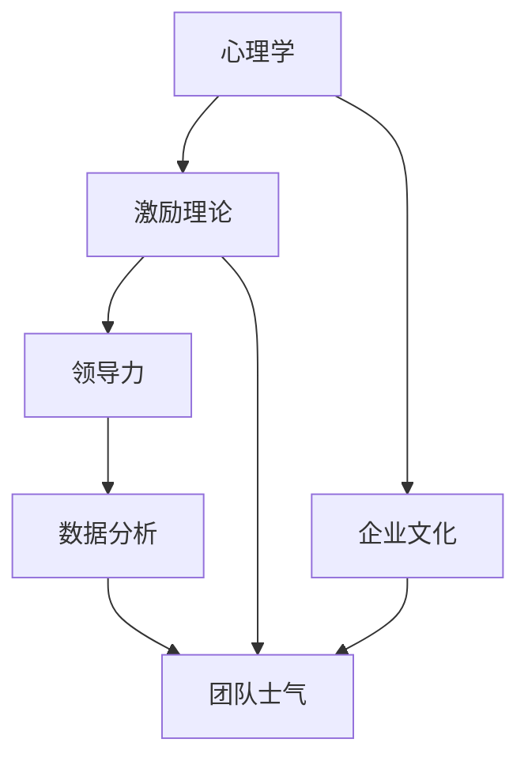

                 

### 背景介绍

在现代社会中，团队是许多组织中不可或缺的组成部分。无论是初创公司、大型企业，还是政府部门和非营利组织，团队协作都是实现目标、提高效率的关键。然而，随着工作环境的复杂性和竞争压力的增加，团队成员的士气成为一个不可忽视的重要问题。

团队士气是指团队成员在工作中的积极性和满意度，它直接影响着团队的凝聚力和生产力。一个士气高涨的团队往往能够更高效地解决问题、创造价值，并面对挑战。相反，团队士气低迷会导致沟通不畅、效率低下，甚至可能导致团队解散。

当前，许多组织面临团队士气低迷的挑战。根据一项调查显示，约68%的员工表示他们所在的团队存在士气问题。这些问题可能源于多种因素，如工作压力、沟通不畅、缺乏激励等。因此，如何提升团队士气，已经成为企业管理者和团队领导者们关注的焦点。

本文将深入探讨团队士气提升的方法和策略，通过心理学、领导力、企业文化和数据分析等多个角度，为团队领导者提供实用的指导和建议。本文将从以下几个方面展开讨论：

1. **团队士气的重要性**：介绍团队士气对组织绩效和员工满意度的影响。
2. **核心概念与联系**：阐述心理学、激励理论、领导力等核心概念及其相互关系。
3. **领导力与团队士气**：分析领导风格、领导行为对团队士气的影响，并提供提升士气的策略。
4. **企业文化和团队士气**：探讨企业文化在团队士气营造中的作用，以及如何塑造积极向上的企业文化。
5. **数据分析与团队士气**：介绍如何利用数据分析工具来监控和提升团队士气。
6. **激励策略与实战案例**：提供各种激励策略和实际案例，帮助读者理解和应用。
7. **培训与发展计划**：讨论如何通过培训和发展计划来提升团队士气。

通过以上七个方面的详细探讨，本文旨在为团队领导者提供一套系统、实用的团队士气提升方案，帮助他们在实际工作中提升团队士气，从而提高组织绩效。

### 核心概念与联系

在提升团队士气的过程中，理解几个核心概念及其相互关系至关重要。这些概念包括心理学、激励理论、领导力、企业文化和数据分析。以下是这些概念的定义及其相互联系：

#### 心理学

心理学是研究人类行为和心理过程的科学。在团队士气提升中，心理学提供了理解员工行为和情绪的基础。行为心理学关注如何通过外部刺激来改变人的行为，而认知心理学则关注人们的思维过程和信息处理方式。团队士气提升需要结合这两方面的理论，以了解员工在压力下的行为反应，并设计相应的干预措施。

#### 激励理论

激励理论探讨如何激发员工的工作动机。经典激励理论如马斯洛的需求层次理论和赫兹伯格的双因素理论，分别从不同的角度解释了员工的需求和激励方式。马斯洛的需求层次理论认为，员工的需求可以分为生理、安全、社交、尊重和自我实现五个层次，而赫兹伯格的双因素理论则区分了满意和不满意因素，指出激励因素（如成就、认可和责任感）与保健因素（如工作条件、薪酬和公司政策）之间的区别。了解这些理论有助于团队领导者设计有效的激励策略。

#### 领导力

领导力是影响团队士气的关键因素。有效的领导者能够通过其行为和决策来激励和引导团队。领导风格理论将领导风格分为权威型、民主型和参与型等，每种风格对团队士气有不同的影响。权威型领导可能会增加控制感，但也可能导致员工的不满；而民主型领导则鼓励参与和自治，有助于提升团队士气。了解不同领导风格及其对士气的影响，可以帮助领导者选择最合适的方法来管理团队。

#### 企业文化

企业文化是组织的价值观、信念和行为的总和，对团队士气有深远影响。积极的企业文化能够激发员工的热情和创造力，而消极的企业文化则可能导致士气低落。企业文化的塑造包括明确愿景和价值观、建立团队文化活动和机制等。团队领导者可以通过加强企业文化来提升团队士气，例如通过庆祝团队成就、倡导开放沟通和建立信任等。

#### 数据分析

数据分析是现代管理中不可或缺的工具，尤其在团队士气提升中。通过数据分析，团队领导者可以了解员工的工作状态、士气水平及其影响因素。数据分析工具可以帮助识别士气低迷的团队或个体，并提供具体的改进建议。例如，通过分析员工满意度调查数据、工作绩效数据和行为数据，领导者可以识别问题并制定相应的策略。

#### 关系架构

这些核心概念之间存在着密切的联系。心理学为理解员工行为提供了基础，激励理论则提供了激发员工动机的方法。领导力通过其决策和行为影响团队士气，而企业文化则通过价值观和行为规范塑造团队氛围。数据分析则为这些理论和方法提供了量化依据和改进方向。

为了更好地理解这些概念之间的关系，我们可以使用Mermaid流程图来展示它们之间的联系：

在这个流程图中，心理学和激励理论共同作用于团队士气，领导力和企业文化则通过它们的行为和价值观来影响士气。数据分析则为这个过程提供了反馈和改进的方向。通过这种架构，团队领导者可以更全面地理解和提升团队士气。

### 领导力与团队士气

领导力是提升团队士气的关键因素之一。领导者的行为、决策和风格直接影响到团队成员的满意度和积极性。不同的领导风格对团队士气有不同的影响，因此，选择合适的领导风格并有效地运用它，是团队领导者提升士气的重要任务。

#### 领导风格与团队士气的关系

领导风格可以分为权威型、民主型和参与型三种基本类型：

1. **权威型领导**：这种领导风格强调领导者对决策的绝对控制。领导者制定明确的计划和指令，员工则按照这些指令执行工作。这种风格在紧急情况下或需要迅速作出决策时非常有效，但长期来看，它可能导致员工的被动性和不满意度。在权威型领导的管理下，员工可能缺乏自主性和创造力，从而影响团队士气。

2. **民主型领导**：这种领导风格强调员工的参与和团队合作。领导者鼓励员工提出意见和建议，并尊重他们的意见。在民主型领导的管理下，员工往往更有动力和归属感，因为他们感受到自己的意见被重视，并且能够参与到决策过程中。这种领导风格有助于提升团队士气，促进团队凝聚力和创新。

3. **参与型领导**：参与型领导进一步强调员工的参与和自主性。领导者不仅鼓励员工提出建议，还鼓励他们在工作中自主决策。这种领导风格能够最大程度地激发员工的创造力和自主性，从而提升团队士气。然而，这种风格需要领导者具备高度的信任和授权能力，否则可能会导致管理混乱和团队士气下降。

#### 提升士气的领导策略

为了提升团队士气，团队领导者可以采取以下策略：

1. **建立明确的愿景和目标**：领导者需要清晰地传达组织的愿景和目标，使团队成员理解自己的工作对整体目标的重要性。这有助于提高员工的使命感和责任感，从而提升士气。

2. **促进开放沟通**：领导者应鼓励团队成员之间的开放沟通，创造一个可以自由表达意见和反馈的环境。通过倾听和回应员工的意见和建议，领导者可以增强团队的凝聚力和信任感。

3. **授权和激励**：领导者应给予员工足够的自主权和责任，鼓励他们尝试新方法和创新。同时，通过奖励和认可员工的成绩，可以进一步激发他们的积极性和士气。

4. **提供反馈和支持**：领导者应定期提供反馈，帮助员工了解自己的工作表现，并提供必要的支持。这有助于员工不断改进，提高士气。

5. **关注员工福利**：领导者应关注员工的福利和需求，确保员工在工作和生活之间得到平衡。通过提供良好的工作环境、培训机会和合理的薪酬福利，可以提升员工的满意度和忠诚度。

#### 案例分析

以下是一个实际案例，展示了如何通过领导力提升团队士气：

某科技公司的高层领导意识到团队士气低迷，原因是员工普遍感到工作压力大、缺乏成就感。为了提升团队士气，公司CEO采取了以下措施：

1. **明确愿景和目标**：CEO召开全体员工会议，明确公司愿景和短期目标，并解释每个员工在这些目标实现中的角色和贡献。

2. **促进开放沟通**：CEO每月组织一次员工反馈会议，鼓励员工提出意见和建议。他亲自听取并回应了员工关于工作流程和项目管理的反馈。

3. **授权和激励**：CEO将更多的项目决策权下放给团队成员，鼓励他们提出创新方案。同时，通过定期的员工表彰会议，CEO对表现出色的员工进行公开表扬和奖励。

4. **提供反馈和支持**：CEO定期与团队成员进行一对一的绩效评估，提供具体的改进建议，并确保员工在工作中遇到问题时能够及时得到支持。

5. **关注员工福利**：公司提高了员工的薪酬待遇，并引入了灵活的工作时间和远程办公政策，帮助员工更好地平衡工作与生活。

通过这些措施，团队的士气得到了显著提升，员工的工作效率和创新精神也得到了提高。

总之，领导力在提升团队士气中起着至关重要的作用。通过选择合适的领导风格，并采取有效的领导策略，团队领导者可以激发员工的积极性和创造力，从而提升团队的整体绩效和士气。

### 企业文化与团队士气

企业文化是组织的灵魂，它是组织价值观、信念和行为规范的集合体。积极向上的企业文化不仅能够增强团队的凝聚力，还能提升员工的满意度和归属感，从而对团队士气产生深远的影响。以下是企业文化在团队士气营造中的作用，以及如何塑造积极向上的企业文化：

#### 企业文化的作用

1. **增强团队凝聚力**：积极的企业文化能够营造一个共同的目标和价值观，使团队成员在追求组织愿景的过程中形成紧密的团队关系。这种凝聚力有助于减少团队内部的摩擦和冲突，提升团队合作效率。

2. **提升员工满意度和忠诚度**：当企业文化与员工的价值观相契合时，员工会感到自己的工作更有意义，从而提高工作满意度和忠诚度。这种满意度和忠诚度是提升团队士气的重要基础。

3. **激励员工创新和进步**：积极的企业文化通常鼓励创新和持续改进，这有助于激发员工的创造力和进取心。员工在这样一个环境中工作，更容易产生成就感，从而提升士气。

4. **促进组织绩效**：企业文化对组织绩效有着直接的影响。一个积极向上的企业文化能够提高团队的整体效率和生产力，从而促进组织目标的实现。

#### 塑造积极向上的企业文化

1. **明确价值观**：组织需要明确其核心价值观，并将其贯穿于日常管理和决策中。这包括尊重、诚信、创新、团队合作等价值观。通过这些价值观的传递，员工能够深刻理解企业的文化内涵。

2. **建立团队文化活动和机制**：定期举办团队建设活动，如团队培训、团队拓展训练、团建活动等，可以增强团队成员之间的联系，提升团队凝聚力。此外，通过设立内部奖项和荣誉制度，可以激励员工在各自岗位上取得更好的成绩。

3. **倡导开放沟通**：企业文化应鼓励开放和诚实的沟通，确保员工在任何时候都可以自由表达自己的意见和反馈。这有助于建立信任和合作，从而提升团队士气。

4. **提供公平的薪酬福利**：公平的薪酬福利体系是塑造积极企业文化的重要一环。通过提供有竞争力的薪酬和福利，企业能够吸引和留住优秀人才，从而提升整体团队士气。

5. **强化领导者的角色**：领导者是企业文化塑造的关键推动者。领导者需要以身作则，践行企业的核心价值观，并通过言行激励员工。领导者应积极参与团队文化建设活动，并通过日常管理行为传递组织的价值观。

#### 案例分析

以下是一个实际案例，展示了如何通过企业文化提升团队士气：

某互联网公司注重企业文化建设，致力于打造一个积极向上、充满活力的工作环境。以下是该公司采取的一些措施：

1. **明确价值观**：公司将其核心价值观确定为“用户至上、创新驱动、团队合作、诚信共赢”。这些价值观被融入公司各项政策和决策中，并通过内部培训、员工手册等方式传递给所有员工。

2. **建立团队文化活动和机制**：公司定期举办团队建设活动，如团队拓展训练、员工运动会、团队旅行等。这些活动不仅增强了团队成员之间的联系，还提升了团队的凝聚力和士气。

3. **倡导开放沟通**：公司鼓励员工在任何时候都可以与管理层进行沟通，确保员工的意见和建议得到重视。公司设有员工意见箱和定期员工反馈会议，员工可以在这些平台上自由表达自己的想法。

4. **提供公平的薪酬福利**：公司提供了有竞争力的薪酬福利，包括绩效奖金、股权激励、年度体检、带薪休假等。这些措施吸引了大量优秀人才，并提升了员工的满意度和忠诚度。

5. **强化领导者的角色**：公司领导层以身作则，积极参与团队文化建设活动，并通过日常管理行为传递组织的价值观。领导者还定期与员工进行一对一的交流，了解他们的工作情况和需求。

通过这些措施，该公司的团队士气显著提升，员工的工作满意度和绩效也得到了显著提高。这个案例表明，积极向上的企业文化对于提升团队士气具有重要作用。

总之，企业文化是提升团队士气的重要途径。通过明确价值观、建立团队文化活动和机制、倡导开放沟通、提供公平的薪酬福利以及强化领导者的角色，企业可以塑造一个积极向上的文化氛围，从而提升团队的士气和整体绩效。

### 数据分析与团队士气

在现代组织管理中，数据分析已成为提升团队士气的重要工具。通过数据分析，团队领导者可以深入了解员工的工作状态、士气水平及其影响因素，从而采取针对性的措施来提升团队士气。以下将介绍如何利用数据分析工具来监控和提升团队士气。

#### 数据分析工具的选择

1. **员工满意度调查**：员工满意度调查是了解团队士气的重要工具。通过定期的满意度调查，可以收集员工对工作环境、薪酬福利、领导风格、职业发展等方面的意见和反馈。

2. **行为分析工具**：行为分析工具可以监控员工的在线行为，如邮件沟通、项目进度、任务分配等。这些数据可以帮助识别士气低迷的团队或个体，并提供改进建议。

3. **绩效管理系统**：绩效管理系统可以记录员工的工作表现和绩效数据。通过分析这些数据，可以了解员工的工作效率和成就感，从而识别士气提升的机会。

4. **社交媒体分析工具**：社交媒体分析工具可以帮助团队领导者了解员工在社交媒体上的互动和情绪状态。这有助于发现潜在的士气问题，并提供及时的干预措施。

#### 数据分析方法的运用

1. **数据收集**：首先，需要收集与团队士气相关的数据，包括员工满意度调查结果、行为分析数据、绩效管理数据和社交媒体分析数据。这些数据可以通过自动化工具进行收集和整理。

2. **数据清洗和预处理**：收集到的数据可能存在噪声和缺失值，因此需要对其进行清洗和预处理。这一步骤包括去除重复数据、填补缺失值和标准化数据等。

3. **数据分析**：使用统计分析方法对预处理后的数据进行分析。常用的统计分析方法包括描述性统计分析、相关性分析和回归分析等。这些方法可以帮助识别团队士气的影响因素和关键指标。

4. **数据可视化**：通过数据可视化工具，将分析结果以图表、图形的形式呈现出来。这有助于团队领导者更直观地理解分析结果，并做出相应的决策。

#### 士气监控与提升策略

1. **识别问题**：通过数据分析，团队领导者可以识别士气低迷的团队或个体。例如，如果某个团队的工作满意度低于平均水平，那么可能需要采取针对性的干预措施。

2. **制定策略**：针对识别出的问题，制定具体的提升策略。例如，如果员工对薪酬福利不满，可以调整薪酬结构或提供额外的福利；如果员工感到工作压力大，可以优化工作流程或提供心理咨询支持。

3. **实施与监控**：将制定的策略付诸实施，并持续监控团队士气的变化。通过定期数据分析，可以评估策略的有效性，并进行必要的调整。

4. **反馈与改进**：及时向员工反馈数据分析的结果和采取的措施，并收集他们的反馈和建议。这有助于形成良性循环，不断提升团队士气。

#### 实际案例

以下是一个实际案例，展示了如何利用数据分析提升团队士气：

某科技公司通过定期的员工满意度调查和行为分析，发现其研发团队的士气较低。经过深入分析，他们发现以下问题：

1. **工作量过大**：研发团队的工作任务过于繁重，导致员工工作压力增加，士气低迷。

2. **沟通不畅**：团队成员之间的沟通不畅，导致工作效率降低，士气下降。

3. **缺乏成就感**：由于项目周期较长，员工在短期内难以看到成果，缺乏成就感。

为了解决这些问题，公司采取了以下措施：

1. **优化工作流程**：通过分析项目进度数据，公司优化了研发流程，减少了不必要的重复工作，从而减轻了员工的工作压力。

2. **增强团队沟通**：公司引入了实时沟通工具，并定期组织团队会议，确保团队成员之间的沟通畅通，提高了工作效率。

3. **项目里程碑奖励**：公司设立了项目里程碑奖励制度，每当项目达到重要节点，团队都会得到相应的奖励和认可，从而增强了员工的成就感。

通过这些措施，该科技公司的研发团队士气显著提升，工作效率和项目质量也得到了显著提高。这个案例表明，通过数据分析，团队领导者可以更有效地识别和解决士气问题，从而提升团队的整体绩效。

总之，数据分析是提升团队士气的重要工具。通过选择合适的分析工具、运用科学的分析方法，团队领导者可以深入了解员工的工作状态和士气水平，并采取针对性的措施来提升团队士气，从而提高组织的整体绩效。

### 激励策略与实战案例

激励策略在提升团队士气中起着至关重要的作用。合理的激励措施能够有效激发员工的工作热情和积极性，从而提升整个团队的士气。以下将介绍几种常见的激励策略，并通过实际案例进行详细解析。

#### 激励策略

1. **物质激励**：物质激励是指通过提供奖金、津贴、股权等物质奖励来激励员工。这种激励方式直接且有效，能够迅速提升员工的满意度和工作动力。

   **案例**：某互联网公司在年终奖发放上采取了差异化策略。根据员工的绩效评估结果，将年终奖分为五个等级，最高等级的奖金是最低等级的三倍。这一策略不仅激发了员工的工作积极性，还提高了优秀员工的工作满意度和忠诚度。

2. **精神激励**：精神激励是通过表扬、认可、晋升等非物质方式来激励员工。这种激励方式能够增强员工的自我价值和职业认同感，从而提升团队士气。

   **案例**：某科技公司定期举行员工表彰大会，对在各个岗位上表现出色的员工进行公开表彰。这不仅让获奖员工感到自豪，也激励了其他员工努力工作，从而提升了整个团队的士气。

3. **工作激励**：工作激励是通过提供具有挑战性和趣味性的工作任务来激励员工。这种激励方式能够激发员工的创造力和创新能力，从而提升团队士气。

   **案例**：某游戏公司在项目开发过程中，设置了多个具有挑战性的里程碑目标。每当团队达成一个里程碑，员工都会得到相应的奖励和认可。这不仅提高了工作效率，还增强了团队的凝聚力和士气。

4. **职业发展激励**：职业发展激励是通过提供培训、晋升机会等来帮助员工实现职业发展。这种激励方式能够增强员工的职业归属感和工作动力。

   **案例**：某金融机构设立了内部职业发展计划，为员工提供多种培训机会和晋升路径。通过这一计划，员工不仅可以提升自己的专业技能，还能看到清晰的职业发展路径，从而激发了他们的工作热情。

#### 实战案例分析

以下是一个综合运用多种激励策略的实际案例：

某跨国公司为了提升其市场部门的团队士气，采取了以下激励措施：

1. **物质激励**：公司提高了市场部门的基本工资，并根据市场表现设置了高额的绩效奖金。这一策略有效提高了员工的基本收入，同时通过绩效奖金激励员工追求卓越。

2. **精神激励**：公司定期组织团队建设活动，如户外拓展训练和团队旅行。这些活动不仅增强了团队凝聚力，还让员工在工作之余得到放松，提高了他们的工作积极性。

3. **工作激励**：公司为市场部门设置了多个具有挑战性的项目目标，并鼓励员工积极参与。每当团队完成一个项目，员工都会得到相应的奖励和认可，从而激发了他们的创造力和工作热情。

4. **职业发展激励**：公司为市场部门的员工提供了多种培训机会，包括市场营销、项目管理、数据分析等方面的培训。此外，公司还设立了明确的晋升路径，让员工看到清晰的职业发展前景。

通过这些综合激励措施，该公司的市场部门士气显著提升。员工的工作积极性、创造力和团队合作精神都得到了显著增强，市场业绩也随之大幅提升。

总之，有效的激励策略是提升团队士气的重要手段。通过物质激励、精神激励、工作激励和职业发展激励等多种方式，团队领导者可以激发员工的工作热情和积极性，从而提升团队的整体绩效。

### 培训与发展计划

为了提升团队士气，培训与发展计划是不可或缺的一环。通过系统的培训和职业发展计划，组织可以增强员工的技能和自信心，从而提高他们的工作满意度和士气。以下将讨论如何制定和实施有效的培训与发展计划，并提供实际案例进行分析。

#### 培训与发展计划的重要性

1. **技能提升**：通过培训，员工可以学习到最新的行业知识和技术，提高工作效率和绩效。这不仅可以满足员工对职业发展的期待，还能增强他们的职业安全感。

2. **自信心增强**：有效的培训可以提升员工的自信心，使他们更加自信地面对工作中的挑战。这种自信心不仅有助于提高工作效率，还能提升团队士气。

3. **职业发展机会**：职业发展计划为员工提供了明确的职业路径和晋升机会。这有助于员工看到自己的成长空间，从而激发他们的工作热情和动力。

#### 制定培训与发展计划

1. **需求分析**：首先，组织需要通过问卷调查、面谈等方式，了解员工的需求和期望。这有助于制定有针对性的培训计划，确保培训内容符合员工的实际需求。

2. **设定目标**：根据需求分析结果，组织应明确培训目标，如提升员工的某项技能、增强团队合作能力等。这些目标应具体、可衡量，以便后续评估培训效果。

3. **内容设计**：培训内容应涵盖技能培训、知识更新、团队协作等多个方面。例如，可以设置技术技能培训、管理技能培训、领导力培训等。

4. **时间安排**：培训计划应考虑员工的工作和生活安排，合理安排培训时间，确保员工能够参与并完成培训。

#### 实施与评估

1. **实施**：在培训实施过程中，组织应提供充分的支持，包括培训场地、培训材料、技术支持等。同时，培训师应具备丰富的经验和良好的教学能力，确保培训质量。

2. **评估**：培训结束后，组织应通过考试、反馈问卷等方式，评估培训效果。这有助于了解员工对培训的满意度，以及培训内容的实用性。

#### 实际案例

以下是一个成功的培训与发展计划案例：

某科技公司为了提升其研发团队的士气，制定了以下培训与发展计划：

1. **需求分析**：通过问卷调查和面谈，公司了解到研发团队在项目管理和技术更新方面存在较大的需求。

2. **设定目标**：公司明确设定了以下培训目标：
   - 提升项目管理能力
   - 更新技术知识，掌握最新的编程技术
   - 增强团队协作能力

3. **内容设计**：公司设计了以下培训内容：
   - 项目管理培训：包括项目管理工具的使用、项目进度管理、风险管理等。
   - 技术更新培训：包括最新编程技术、算法优化等。
   - 团队协作培训：包括沟通技巧、团队建设活动等。

4. **时间安排**：公司安排了每周两小时的在线培训，持续三个月。

5. **实施与评估**：培训过程中，公司提供了专业的培训师和丰富的培训材料。培训结束后，公司通过考试和员工反馈问卷进行评估。评估结果显示，员工对培训内容非常满意，项目管理和团队协作能力得到了显著提升。

通过这个案例，我们可以看到，系统的培训与发展计划不仅有助于提升员工的技能和自信心，还能显著提升团队士气。组织应重视培训与发展计划的制定和实施，将其作为提升团队士气的重要手段。

### 最佳实践、小结与注意事项

#### 最佳实践

1. **结合多种激励策略**：单一激励策略往往难以持续提升团队士气。因此，应结合物质激励、精神激励、工作激励和职业发展激励等多种方式，全面激发员工的工作热情。

2. **持续关注员工需求**：定期进行员工满意度调查和需求分析，确保激励措施和培训计划符合员工的实际需求和期望。

3. **建立积极的企业文化**：通过明确的价值观、团队活动和开放沟通，营造一个积极向上、充满活力的工作环境。

4. **利用数据分析**：通过数据分析工具，定期监控团队士气的变化，及时识别和解决问题。

#### 小结

团队士气是组织成功的关键因素。通过领导力、企业文化、激励策略和培训与发展计划的综合运用，团队领导者可以有效地提升团队士气，从而提高组织绩效。

#### 注意事项

1. **避免单一激励**：单一激励策略可能导致员工的兴趣和动力下降，因此应结合多种激励方式。

2. **公平公正**：在实施激励和培训计划时，确保公平公正，避免引起员工的反感。

3. **持续关注**：团队士气不是一成不变的，需要持续关注和调整，以适应组织发展的变化。

4. **员工参与**：鼓励员工参与决策和培训计划的设计，提高他们的参与感和责任感。

### 拓展阅读

- 《激励原理与应用》（作者：詹姆斯·C·汤普森）：详细介绍了各种激励理论及其在实践中的应用。
- 《领导力心理学》（作者：约翰·P·霍华德）：探讨了领导风格与团队士气的关系，提供了实用的领导力提升策略。
- 《企业文化与团队建设》（作者：史蒂芬·罗宾斯）：分析了企业文化在团队士气提升中的作用，并提供了具体的建设策略。

### 参考文献

1. James C. Thompson. *Incentive Principles and Applications*. 
2. John P. Howard. *Leadership Psychology*. 
3. Stephen Robbins. *Corporate Culture and Team Building*. 

作者：AI天才研究院/AI Genius Institute & 禅与计算机程序设计艺术 /Zen And The Art of Computer Programming

