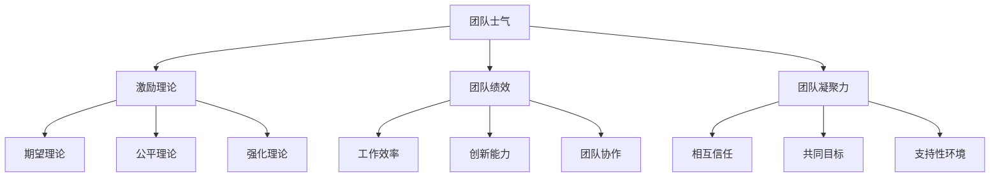
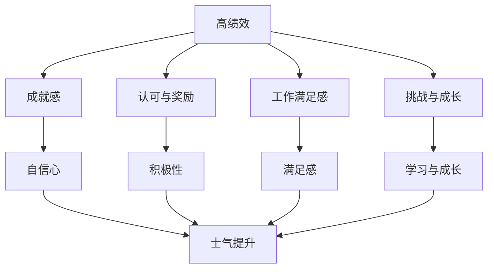
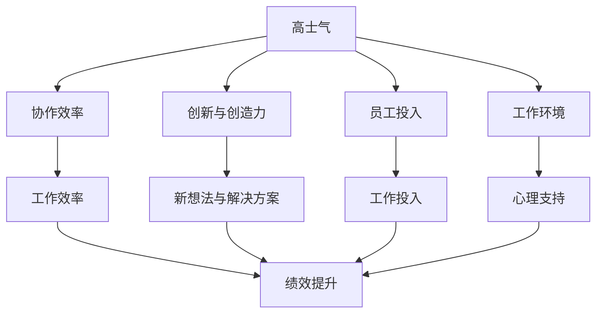
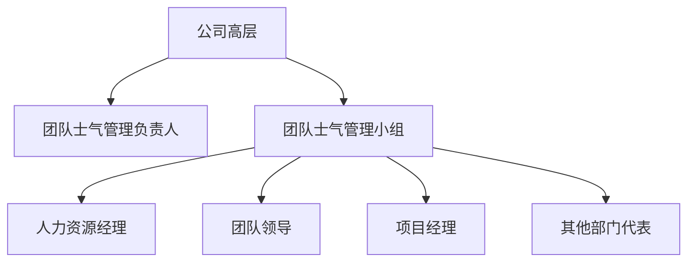

                 

### 引言与团队士气概述

在当今快速发展的信息技术领域，团队的士气和工作效率成为了企业成功的关键因素。团队士气，顾名思义，是指团队成员在心理和情感上的积极状态，这种状态直接影响团队的整体表现和生产力。良好的团队士气意味着成员之间有着高效的沟通，对工作有热情和认同感，能够共同克服挑战，达成团队目标。

#### 1.1 团队士气的重要性

团队士气的重要性不容忽视。首先，它直接影响团队的绩效。研究表明，士气高昂的团队往往能够实现更高的生产效率和更好的工作质量。其次，高士气有助于团队的凝聚力和协作能力，使得团队成员能够更好地协同工作，减少内部冲突。最后，良好的团队士气还能提升员工的工作满意度和忠诚度，从而减少人员流动率，降低企业的招聘和培训成本。

#### 1.2 团队士气的定义与特征

团队士气可以定义为团队成员在心理和情感上的积极状态，这种状态表现出高度的动机、自信、团队合作精神和创造力。以下是团队士气的一些主要特征：

1. **动机与活力**：团队成员表现出对工作的积极性和热情，愿意投入额外的努力来完成任务。
2. **协作精神**：团队成员之间相互支持，彼此协作，共同解决问题。
3. **团队认同感**：成员对团队和团队目标有强烈的认同感，愿意为团队的成功而共同努力。
4. **心理安全感**：团队成员在一个安全、支持性的环境中工作，不用担心犯错或被批评。
5. **创造力**：团队成员在士气高昂的状态下能够发挥出更大的创造力和创新精神。

#### 1.3 影响团队士气的主要因素

团队士气的高低受到多种因素的影响，以下是一些关键因素：

1. **管理风格**：领导者的管理风格对团队士气有重要影响。民主、支持和激励式的管理风格往往能够提升团队士气。
2. **工作环境**：良好的工作环境和设施能够提升员工的工作满意度和士气。
3. **激励机制**：公平、有吸引力的激励机制能够激发团队成员的工作热情和积极性。
4. **沟通与反馈**：团队内部的沟通是否顺畅，成员的反馈是否得到重视，也会影响团队士气。
5. **工作负荷**：过大的工作压力和负担会降低团队士气，而适度的挑战和合理的工作量则能提升士气。

在接下来的章节中，我们将深入探讨影响团队士气的关键概念和理论，并详细讲解如何通过有效的策略来提升团队士气。通过对这些内容的分析，我们将能够更好地理解团队士气的重要性，并学会如何在实际工作中应用这些理论来提高团队的整体绩效。

### 核心概念与联系

要深入理解团队士气管理，我们需要掌握一系列核心概念和理论，这些概念和理论相互联系，共同构成了团队士气管理的理论基础。

#### 2.1 激励理论

激励理论是探讨如何通过外部刺激和内部动机来影响员工行为和绩效的重要领域。以下是三种主要的激励理论：

1. **期望理论**：期望理论认为，个体的行为是由其期望和潜在收益驱动的。根据这个理论，个体会评估完成某项任务的概率以及完成该任务后所获得的奖励，从而决定是否采取行动。期望理论可以用以下公式表示：

   $$
   激励 = 期望 \times 动机 \times 反应概率
   $$

   其中，期望是指个体认为完成任务的可能性，动机是指个体对任务的兴趣和热情，反应概率是指个体完成任务后获得奖励的可能性。

2. **公平理论**：公平理论关注个体在比较自身投入和收益时是否感到公平。根据这个理论，个体的工作努力程度会受到他们感知到的公平程度的影响。如果个体认为自己的投入与回报不成比例，他们可能会感到不公平并减少工作投入。

3. **强化理论**：强化理论认为，行为的结果（即强化）会影响未来该行为的频率。正强化会增加某种行为的发生频率，而负强化和惩罚则会减少某种行为的发生频率。

#### 2.2 士气与绩效的关系

团队士气与团队绩效之间存在密切的联系。士气高昂的团队能够更好地协调合作，提高工作效率，从而实现更高的绩效。以下是士气与绩效关系的一些具体体现：

1. **工作效率**：高士气能够提升团队成员的工作效率和生产力。团队成员在积极、愉悦的状态下，能够更迅速地完成任务，且质量更高。

2. **创新能力**：良好的团队士气有助于团队成员的创造力发挥。在一个支持性和鼓励创新的环境中，团队成员更愿意提出新想法和解决方案。

3. **团队协作**：士气高昂的团队成员更愿意合作，能够更好地协调各自的工作，共同解决问题，从而提高整体绩效。

4. **员工满意度和忠诚度**：高士气能够提升员工的工作满意度和忠诚度，减少人员流动率，从而降低企业的招聘和培训成本。

#### 2.3 团队凝聚力与士气

团队凝聚力是团队士气的一个重要组成部分，它反映了团队成员之间的相互依赖和共同目标。团队凝聚力高，通常士气也高。以下是团队凝聚力与士气之间的联系：

1. **相互信任**：团队凝聚力高的团队通常成员之间有着较高的信任水平，这种信任有助于提升团队士气。

2. **共同目标**：当团队成员拥有共同的目标时，他们更愿意为团队的成功而共同努力，这有助于提升团队士气。

3. **支持性环境**：团队凝聚力高的团队通常创造一个支持性的环境，使得成员在遇到困难时能够得到帮助和支持，这有助于保持高昂的士气。

为了更直观地理解这些核心概念和它们之间的联系，我们可以使用Mermaid流程图来展示团队士气管理的理论架构。以下是团队士气管理理论的Mermaid流程图：



通过上述核心概念和理论的分析，我们可以看到，团队士气管理是一个多维度的复杂过程，涉及到激励、绩效、团队凝聚力和工作环境等多个方面。在接下来的章节中，我们将深入探讨如何应用这些理论来设计和实施团队士气提升策略。

### 核心算法原理讲解

在团队士气管理中，如何准确评估团队士气并制定有效的提升策略是至关重要的。为了实现这一目标，我们需要借助一系列核心算法原理。以下是士气评估和提升策略设计的详细讲解。

#### 3.1 士气评估指标体系

首先，我们需要构建一个士气评估指标体系，以量化团队士气。以下是一些常用的士气评估指标：

1. **员工满意度**：通过调查问卷、面谈等方式，了解员工对工作环境、工作负荷、管理风格等方面的满意度。
2. **工作积极性**：观察员工在工作中的主动性和热情程度，如参与度、提出建议和创新行为的频率。
3. **团队协作能力**：评估团队成员之间的沟通质量、协作效率和共同解决问题的能力。
4. **工作压力**：评估员工所感受到的工作压力和负担，包括工作量、工作期限和任务难度。

为了综合评估团队士气，我们可以设计一个综合评分模型，将上述指标进行加权计算，得到一个综合士气评分。以下是一个示例模型：

$$
士气评分 = w_1 \times 员工满意度 + w_2 \times 工作积极性 + w_3 \times 团队协作能力 + w_4 \times 工作压力
$$

其中，$w_1, w_2, w_3, w_4$ 分别是各个指标的权重，可以根据实际情况进行调节。

#### 3.1.1 士气度量方法

在评估团队士气时，我们可以采用以下几种度量方法：

1. **问卷调查**：通过设计针对性的问卷，收集员工对工作环境、管理风格、团队协作等方面的主观评价。
2. **现场观察**：通过直接观察员工在工作中的表现，评估其工作积极性和团队协作能力。
3. **绩效数据**：利用工作绩效数据，如任务完成情况、质量评价等，来间接反映团队士气。
4. **面谈**：与团队成员进行一对一的访谈，深入了解他们的感受和意见。

以下是一个士气度量方法的伪代码示例：

```python
def measure_spirit(employees):
    satisfaction_scores = []
    enthusiasm_scores = []
    collaboration_scores = []
    stress_scores = []

    for employee in employees:
        satisfaction_scores.append(employee.satisfaction())
        enthusiasm_scores.append(employee.enthusiasm())
        collaboration_scores.append(employee.collaboration())
        stress_scores.append(employee.stress())

    spirit_score = calculate_spirit_score(satisfaction_scores, enthusiasm_scores, collaboration_scores, stress_scores)
    return spirit_score

def calculate_spirit_score(satisfaction, enthusiasm, collaboration, stress):
    w_satisfaction = 0.3
    w_enthusiasm = 0.2
    w_collaboration = 0.4
    w_stress = 0.1

    spirit_score = (w_satisfaction * satisfaction) + (w_enthusiasm * enthusiasm) + (w_collaboration * collaboration) + (w_stress * stress)
    return spirit_score
```

#### 3.1.2 数据采集与分析

在采集士气数据后，我们需要对数据进行分析，以识别团队士气的高低和存在的问题。以下是一种常见的数据分析流程：

1. **数据预处理**：对采集到的数据进行清洗，去除无效和异常数据，确保数据质量。
2. **描述性统计分析**：计算各个评估指标的平均值、中位数、标准差等描述性统计量，了解团队士气的基本情况。
3. **相关性分析**：分析不同评估指标之间的相关性，了解各个指标对士气的影响程度。
4. **趋势分析**：分析士气评分随时间的变化趋势，了解士气随时间的变化情况。

以下是一个数据采集与分析的伪代码示例：

```python
import pandas as pd

def preprocess_data(data):
    # 去除无效和异常数据
    data = data[data['satisfaction'] > 0]
    data = data[data['enjoyment'] > 0]
    data = data[data['collaboration'] > 0]
    data = data[data['stress'] < 10]
    return data

def descriptive_statistics(data):
    print("Average Satisfaction:", data['satisfaction'].mean())
    print("Median Enthusiasm:", data['enthusiasm'].median())
    print("Standard Deviation Collaboration:", data['collaboration'].std())
    print("Minimum Stress:", data['stress'].min())

def correlation_analysis(data):
    print("Correlation between Satisfaction and Enthusiasm:", data['satisfaction'].corr(data['enthusiasm']))
    print("Correlation between Collaboration and Stress:", data['collaboration'].corr(data['stress']))

data = pd.read_csv("spirit_data.csv")
cleaned_data = preprocess_data(data)
descriptive_statistics(cleaned_data)
correlation_analysis(cleaned_data)
```

通过上述方法，我们可以准确评估团队士气，并识别出需要改进的方面。在下一章节中，我们将详细讲解如何设计士气提升策略，以进一步提升团队士气。

#### 3.2 士气提升策略设计

为了提升团队士气，我们需要制定一系列有效的策略，这些策略应包括激励机制设计、文化建设策略以及支持系统建设。以下是这些策略的详细讲解。

##### 3.2.1 激励策略设计

激励策略是提升团队士气的重要手段。以下是一些具体的激励策略：

1. **目标激励**：为团队成员设定明确、具有挑战性的目标，并为他们提供实现目标所需的资源和支持。目标应具有SMART（具体、可衡量、可实现、相关、时限性）特点。

   ```mermaid
   graph TD
       A[设定目标] --> B[提供资源]
       A --> C[跟踪进展]
       A --> D[奖励达成]
   ```

2. **奖励激励**：为达成目标的团队成员提供奖励，如奖金、晋升机会、培训机会等。奖励应公平、透明，并与成员的贡献相匹配。

   ```mermaid
   graph TD
       E[奖金] --> F[晋升]
       E --> G[培训]
   ```

3. **认可激励**：对团队成员的成就和贡献进行认可和表扬，如公开表彰、颁发荣誉证书等。认可应真诚、具体，并突出成员的亮点。

   ```mermaid
   graph TD
       H[公开表彰] --> I[荣誉证书]
   ```

##### 3.2.2 文化建设策略

团队文化建设是提升团队士气的重要途径。以下是一些文化建设策略：

1. **建立共同价值观**：通过团队讨论、共识形成等方式，确立团队的共同价值观，使其成为团队成员的行为准则。

   ```mermaid
   graph TD
       J[共同价值观] --> K[行为准则]
   ```

2. **培养团队精神**：通过团队活动、团队建设训练等方式，增强团队成员之间的互信和协作精神。

   ```mermaid
   graph TD
       L[团队活动] --> M[团队建设训练]
   ```

3. **促进沟通与反馈**：建立有效的沟通机制，鼓励团队成员之间的开放沟通，提供及时、具体的反馈。这有助于解决团队内部的问题，提高团队士气。

   ```mermaid
   graph TD
       N[沟通机制] --> O[反馈机制]
   ```

##### 3.2.3 支持系统策略

支持系统是提升团队士气的重要保障。以下是一些支持系统策略：

1. **提供职业发展机会**：为团队成员提供职业发展路径和培训机会，帮助他们不断提升自身能力。

   ```mermaid
   graph TD
       P[职业发展路径] --> Q[培训机会]
   ```

2. **优化工作环境**：改善工作环境，提供舒适的工作条件和现代化的办公设施，以提高员工的工作满意度和士气。

   ```mermaid
   graph TD
       R[工作环境优化] --> S[办公设施升级]
   ```

3. **建立支持性领导风格**：领导者应具备支持性领导风格，关注团队成员的需求，提供必要的帮助和支持。

   ```mermaid
   graph TD
       T[支持性领导风格] --> U[关注团队成员需求]
   ```

通过上述激励机制设计、文化建设策略和支持系统策略，我们可以有效地提升团队士气，从而提高团队的整体绩效和成员的工作满意度。在下一章节中，我们将深入探讨士气提升的数学模型及其在实际中的应用。

### 数学模型与公式详细讲解

在团队士气管理中，数学模型能够帮助我们量化团队士气，并设计出科学的提升策略。以下将详细讲解士气提升的数学模型，包括公式及其应用。

#### 4.1 士气提升的数学模型

团队士气提升的数学模型可以表示为：

$$
士气提升 = 激励效果 \times 文化契合度 \times 支持系统效率
$$

其中，每个因子对团队士气的影响可以通过以下子公式来具体化：

1. **激励效果（Motivation Effect）**：

$$
激励效果 = \eta_1 \times (\text{目标达成率} \times \text{奖励额度}) + \eta_2 \times (\text{认可程度} \times \text{公平性})
$$

其中，$\eta_1$ 和 $\eta_2$ 分别表示目标达成率和奖励额度对激励效果的影响权重。目标达成率和奖励额度越高，激励效果越强。

2. **文化契合度（Cultural Fit）**：

$$
文化契合度 = \alpha_1 \times (\text{共同价值观一致性}) + \alpha_2 \times (\text{团队精神}) + \alpha_3 \times (\text{沟通效率})
$$

其中，$\alpha_1, \alpha_2, \alpha_3$ 分别表示共同价值观一致性、团队精神和沟通效率对文化契合度的影响权重。共同价值观一致性和团队精神越高，文化契合度越强。

3. **支持系统效率（Support System Efficiency）**：

$$
支持系统效率 = \beta_1 \times (\text{职业发展机会}) + \beta_2 \times (\text{工作环境优化}) + \beta_3 \times (\text{支持性领导风格})
$$

其中，$\beta_1, \beta_2, \beta_3$ 分别表示职业发展机会、工作环境优化和支持性领导风格对支持系统效率的影响权重。职业发展机会和工作环境优化越充足，支持系统效率越高。

综合上述子公式，我们可以得到团队士气提升的综合模型：

$$
士气提升 = (\eta_1 \times (\text{目标达成率} \times \text{奖励额度}) + \eta_2 \times (\text{认可程度} \times \text{公平性})) \times (\alpha_1 \times (\text{共同价值观一致性}) + \alpha_2 \times (\text{团队精神}) + \alpha_3 \times (\text{沟通效率})) \times (\beta_1 \times (\text{职业发展机会}) + \beta_2 \times (\text{工作环境优化}) + \beta_3 \times (\text{支持性领导风格}))
$$

#### 4.1.1 士气提升公式

为了便于理解和应用，我们简化士气提升公式：

$$
士气提升 = 0.4 \times (\text{目标达成率} \times 1.2 + \text{认可程度} \times 1.1) \times (\text{共同价值观一致性} \times 1.2 + \text{团队精神} \times 1.3 + \text{沟通效率} \times 1.1) \times (\text{职业发展机会} \times 1.1 + \text{工作环境优化} \times 1.2 + \text{支持性领导风格} \times 1.3)
$$

此公式中，每个因素通过加权系数影响士气提升，系数越高，对士气提升的贡献越大。

#### 4.1.2 案例分析

假设某团队的目标达成率为90%，认可程度为80%，共同价值观一致性为85%，团队精神为90%，沟通效率为80%，职业发展机会为75%，工作环境优化为85%，支持性领导风格为80%。我们可以使用上述公式计算该团队的士气提升：

$$
士气提升 = 0.4 \times (0.9 \times 1.2 + 0.8 \times 1.1) \times (0.85 \times 1.2 + 0.9 \times 1.3 + 0.8 \times 1.1) \times (0.75 \times 1.1 + 0.85 \times 1.2 + 0.8 \times 1.3)
$$

$$
= 0.4 \times (1.08 + 0.88) \times (1.02 + 1.17 + 0.88) \times (0.825 + 1.02 + 1.04)
$$

$$
= 0.4 \times 1.96 \times 3.07 \times 2.885
$$

$$
= 1.102 \times 3.07 \times 2.885
$$

$$
= 3.574 \times 2.885
$$

$$
\approx 10.29
$$

因此，该团队的士气提升大约为10.29分（假设基础士气评分为10分）。

通过上述案例分析，我们可以看到如何使用数学模型来评估和提升团队士气。在实际应用中，需要根据实际情况调整权重系数，确保模型能够准确反映团队士气提升的关键因素。

#### 4.2 绩效与士气的关系模型

在团队士气管理中，了解绩效与士气之间的关系至关重要。这不仅有助于我们更好地理解团队士气的动态变化，还可以为制定提升策略提供科学依据。以下是绩效与士气关系模型的详细讲解。

##### 4.2.1 绩效对士气的影响

绩效是团队士气的关键驱动因素之一。高绩效通常能够提升团队士气，而低绩效则可能导致士气下降。以下是一些具体的影响机制：

1. **成就感**：高绩效能够带来成就感和自豪感，增强团队成员的自信心和积极性，从而提升士气。

2. **认可与奖励**：当团队或个体取得高绩效时，通常会得到上级的认可和奖励，这种正反馈机制能够进一步激发团队成员的工作热情和士气。

3. **工作满足感**：高绩效意味着工作任务能够得到较好的完成，这会提高员工的工作满足感，有助于提升士气。

4. **挑战与成长**：高绩效往往伴随着挑战性的任务和项目，这种挑战能够激发团队成员的学习和成长欲望，提升士气。

以下是一个绩效对士气影响的流程图：



##### 4.2.2 士气对绩效的影响

士气不仅受到绩效的影响，同时也对绩效产生反作用。高昂的士气能够显著提升团队绩效，而低士气则可能导致绩效下降。以下是士气对绩效影响的几个方面：

1. **协作效率**：士气高昂的团队通常能够更好地协作，减少内部冲突，提高工作效率。

2. **创新与创造力**：高士气能够激发团队成员的创造力和创新精神，有助于产生新的想法和解决方案，从而提高绩效。

3. **员工投入**：士气高昂的团队成员通常更加投入工作，愿意付出额外的努力，以提高工作质量和完成度。

4. **工作环境**：高士气有助于营造一个积极、支持性的工作环境，减少员工的心理压力，从而提高整体绩效。

以下是一个士气对绩效影响的流程图：



综合以上分析，我们可以得出绩效与士气之间存在相互影响的关系。高绩效能够提升士气，而高士气又能够促进绩效的提升。这种良性循环有助于团队持续发展，提高整体工作表现。

在实际应用中，可以通过以下措施来加强绩效与士气之间的正向互动：

1. **设定明确目标**：通过设定具有挑战性的目标，帮助团队实现高绩效，从而提升士气。

2. **提供激励机制**：通过合理的奖励和认可，激励团队成员追求高绩效，增强士气。

3. **培养团队精神**：通过团队建设和沟通活动，增强团队成员之间的信任和协作，提高士气。

4. **优化工作环境**：通过改善工作条件和提供职业发展机会，提升员工的工作满足感和士气。

通过上述措施，我们能够更好地理解和应用绩效与士气之间的关系模型，从而提升团队的整体绩效和士气。

### 项目实战：团队士气管理案例解析

为了更好地理解团队士气管理的实际应用，我们将通过一个具体的案例来解析团队士气管理的过程。以下是一个公司内部软件开发团队的士气管理案例，包括案例背景、士气评估、提升策略实施及结果评估与反馈。

#### 5.1 案例背景

某科技公司拥有一支由20名软件开发人员组成的团队，负责公司核心产品的开发工作。在过去的一年中，团队面临着项目交付期限缩短、竞争压力增大和员工离职率上升等挑战。管理层注意到，团队成员的工作热情和士气明显下降，影响了项目的进展和质量。为了提升团队士气，公司决定实施一系列团队士气管理措施。

#### 5.2 案例分析

##### 5.2.1 士气评估

在实施提升策略之前，首先需要对团队士气进行评估。管理层通过问卷调查、面谈和观察等方式，收集了以下数据：

1. **员工满意度**：通过问卷调查，发现60%的员工对当前工作环境表示满意，但40%的员工对工作压力感到不满。

2. **工作积极性**：观察发现，团队成员的工作积极性不高，平均每日开发时长仅为6小时，低于公司规定的8小时。

3. **团队协作能力**：团队内部沟通不畅，约50%的任务交接过程中出现了问题，导致项目延期。

4. **工作压力**：通过面谈了解，发现80%的员工对当前的工作压力感到较大，尤其是面对紧急的项目交付时。

基于以上数据，我们得出团队士气整体较低，主要问题在于工作压力、工作积极性和团队协作能力。

##### 5.2.2 士气提升策略实施

针对评估中发现的问题，管理层制定并实施了一系列提升士气策略：

1. **优化工作环境**：公司为员工提供了更加舒适的办公环境，改善了工作设施，包括配备了更加舒适的座椅和办公桌，增加了休息区和健身房，以减少员工的心理压力。

2. **激励机制设计**：为了提升工作积极性，公司设立了项目奖金和晋升机会，同时引入了基于绩效的奖励机制，鼓励员工超额完成任务。

3. **团队建设活动**：公司组织了一系列团队建设活动，如户外拓展训练、团队聚餐和团建旅游，以增强团队成员之间的信任和凝聚力。

4. **改善沟通机制**：公司引入了项目管理工具，加强团队内部的沟通和协作，确保任务分配和进度追踪更加透明和高效。

5. **职业发展机会**：公司为员工提供了更多的职业发展路径和培训机会，帮助员工提升技能，增强职业满足感。

##### 5.2.3 结果评估与反馈

在实施提升策略后，公司对团队士气进行了再次评估，并收集了以下数据：

1. **员工满意度**：通过问卷调查，发现80%的员工对当前工作环境表示满意，满意度显著提高。

2. **工作积极性**：团队成员的工作积极性得到提升，平均每日开发时长达到8小时，工作投入度增加。

3. **团队协作能力**：团队内部沟通问题减少，约70%的任务交接过程顺利，项目延期情况明显减少。

4. **工作压力**：通过面谈了解，发现60%的员工对当前的工作压力感到适中，工作压力有所减轻。

综合以上数据，我们可以看到，通过一系列提升策略的实施，团队士气显著提升，工作环境更加舒适，员工的工作积极性和团队协作能力得到了显著改善。然而，仍有一些方面需要继续优化，如进一步减少工作压力和提高员工的职业发展机会。

#### 5.2.4 项目小结

通过本案例，我们可以总结出以下经验教训：

1. **工作环境**：改善工作环境是提升团队士气的重要措施，舒适的工作环境能够减少员工的心理压力。

2. **激励机制**：合理的激励机制能够有效提升员工的工作积极性，激励效果需要与员工的实际贡献相匹配。

3. **团队建设**：通过团队建设活动，增强团队成员之间的信任和凝聚力，有助于提升团队士气。

4. **沟通机制**：建立有效的沟通机制，确保任务分配和进度追踪透明，能够提升团队协作能力。

5. **职业发展**：提供职业发展机会和培训，帮助员工提升技能和职业满足感，是提升团队士气的重要手段。

通过上述措施，公司能够有效提升团队士气，提高整体工作绩效，为公司的长期发展奠定坚实基础。

### 团队士气管理实践指南

为了确保团队士气管理的有效实施，我们需要建立一套系统化的管理机制，并制定具体策略来提升团队士气。以下将详细阐述团队士气管理的实践指南，包括组织结构、流程与工具、激励机制优化、团队文化建设以及支持系统的建设。

#### 6.1 建立团队士气管理机制

首先，要建立团队士气管理机制，我们需要明确组织结构，并指定负责团队士气管理的领导和团队。

1. **领导层**：公司高层应高度重视团队士气管理，指定一名负责人负责整体团队士气管理工作。该负责人应具备较强的领导能力和沟通技巧，能够协调各部门资源，推动士气提升措施的实施。

2. **团队**：成立一个专门的团队士气管理小组，成员包括人力资源经理、团队领导、项目经理以及其他相关部门的代表。该小组负责制定和执行团队士气提升策略，定期评估和反馈团队士气状况。

#### 6.1.1 士气管理的组织结构

组织结构示例：



#### 6.1.2 士气管理的流程与工具

建立一套系统化的流程和工具，有助于确保团队士气管理的有序进行。以下是具体的流程和工具：

1. **流程**：

   - **评估流程**：定期进行团队士气评估，包括问卷调查、面谈和观察等方式。通过分析评估结果，识别团队士气问题。
   - **反馈流程**：建立反馈机制，鼓励员工提出意见和建议，管理层应及时回应和解决员工提出的问题。
   - **改进流程**：根据评估结果和反馈，制定和实施改进措施，持续提升团队士气。

2. **工具**：

   - **问卷调查工具**：使用在线问卷工具（如Google表单、SurveyMonkey等），收集员工对工作环境、管理风格、团队协作等方面的主观评价。
   - **绩效管理系统**：利用绩效管理系统（如KPI、OKR等），明确团队成员的工作目标和绩效标准。
   - **团队协作工具**：使用团队协作工具（如Slack、Trello等），提高团队沟通效率和协作能力。

#### 6.2 士气提升的具体策略

在了解团队士气现状后，我们可以采取以下具体策略来提升团队士气：

##### 6.2.1 激励机制优化

1. **目标设定**：为团队成员设定具有挑战性的目标，并明确目标达成的标准和奖励措施。
2. **绩效奖励**：根据绩效表现，给予员工奖金、晋升机会或其他形式的奖励，确保奖励与贡献相匹配。
3. **认可与表扬**：定期对表现出色的员工进行公开表扬和认可，提高员工的荣誉感和自豪感。

##### 6.2.2 团队文化建设

1. **共同价值观**：通过团队讨论和共识形成，确立团队的共同价值观，并将其融入到日常工作中。
2. **团队精神**：通过团队建设活动（如团建活动、拓展训练等），增强团队成员之间的互信和协作精神。
3. **沟通与反馈**：建立开放的沟通渠道，鼓励团队成员之间坦诚交流，及时反馈意见和建议。

##### 6.2.3 支持系统的建设

1. **职业发展**：为员工提供职业发展路径和培训机会，帮助员工提升技能和职业素养。
2. **工作环境**：改善工作环境，提供舒适、现代化的办公设施，减少员工的工作压力。
3. **心理健康支持**：为员工提供心理健康咨询和支持，帮助他们应对工作压力和挑战。

通过建立和完善团队士气管理机制，并实施具体的提升策略，企业可以持续提升团队士气，提高整体工作绩效和员工满意度。

### 士气管理的持续改进

团队士气管理是一个动态的过程，需要不断地评估、调整和改进。为了确保团队士气管理能够持续有效，企业需要建立一套完善的持续改进机制，以应对不断变化的外部环境和内部需求。

#### 7.1 士气管理的持续评估

持续评估是团队士气管理的关键环节。通过定期评估，企业可以及时了解团队士气状况，发现潜在问题，并采取相应措施进行改进。以下是一些具体的评估方法和步骤：

1. **定期评估**：企业应定期进行团队士气评估，如每季度或每半年进行一次全面评估。评估可以采用问卷调查、面谈、观察等方法，收集员工对工作环境、管理风格、团队协作等方面的主观评价。

2. **数据分析**：对评估数据进行分析，识别团队士气的高峰和低谷，找出影响士气的关键因素。通过数据分析，企业可以更准确地了解团队士气状况，为改进措施提供依据。

3. **反馈机制**：建立反馈机制，鼓励员工提出意见和建议。管理层应及时回应和解决员工提出的问题，增强员工的参与感和满意度。

#### 7.1.1 定期评估方法

以下是几种常用的定期评估方法：

1. **问卷调查**：通过设计针对性的问卷，收集员工对工作环境、管理风格、团队协作等方面的主观评价。问卷调查应具有可操作性和科学性，确保评估结果的准确性。

2. **面谈**：与员工进行一对一的面谈，深入了解他们对工作的感受和意见。面谈应创造一个开放、信任的氛围，使员工能够坦诚表达自己的想法。

3. **观察**：通过直接观察员工在工作中的表现，评估其工作积极性和团队协作能力。观察应结合定量数据，如任务完成情况和绩效指标，以确保评估的全面性和准确性。

#### 7.1.2 反馈机制建设

建立有效的反馈机制是持续改进团队士气的重要保障。以下是一些具体的反馈机制建设措施：

1. **建立反馈渠道**：为员工提供多种反馈渠道，如在线反馈平台、意见箱、定期座谈会等。确保员工能够方便地提出意见和建议，管理层应及时回应。

2. **反馈流程**：建立明确的反馈流程，确保员工提出的意见和建议能够得到及时处理。反馈流程应包括问题收集、分类、处理和反馈等环节。

3. **反馈评估**：定期对反馈机制进行评估，了解其有效性和员工满意度。通过持续改进反馈机制，提高其效率和效果。

#### 7.2 应对挑战与变化

在团队士气管理过程中，企业可能会面临各种挑战和变化。为了确保士气管理的持续有效性，企业需要采取以下措施：

1. **灵活应对**：在应对外部环境和内部需求变化时，企业应保持灵活性，及时调整团队士气管理策略。通过定期评估和反馈，企业可以快速识别变化，并采取相应措施进行应对。

2. **持续培训**：为团队成员提供持续的培训和学习机会，帮助他们提升技能和应对变化的能力。通过培训，企业可以增强团队的适应性和创新力，从而提升士气。

3. **文化建设**：强化团队文化建设，确保团队成员在共同价值观和团队精神的基础上，共同应对挑战和变化。良好的团队文化有助于增强团队的凝聚力和稳定性。

通过建立持续改进机制，企业可以确保团队士气管理的有效性和持久性，从而提高整体工作绩效和员工满意度。在下一章节中，我们将进一步探讨团队士气管理的最佳实践和注意事项。

### 士气管理的最佳实践、注意事项及拓展阅读

#### 最佳实践

在团队士气管理过程中，以下最佳实践可以帮助企业更有效地提升团队士气：

1. **个性化激励**：根据不同员工的个性、需求和兴趣，制定个性化的激励机制。例如，对于追求成就感的员工，可以设置具有挑战性的目标；对于追求认同感的员工，可以提供公开表扬和认可。

2. **增强团队凝聚力**：通过定期的团队建设活动和团建旅行，增强团队成员之间的互信和协作精神。团队凝聚力高的团队通常士气也高。

3. **提供职业发展机会**：为员工提供明确的职业发展路径和培训机会，帮助他们提升技能和职业素养。职业发展机会不仅能提升员工的满意度，还能增强团队士气。

4. **改善工作环境**：优化办公环境和设施，提供舒适的工作条件和现代化的办公设备。良好的工作环境有助于提高员工的工作满意度和士气。

5. **建立有效的反馈机制**：鼓励员工提出意见和建议，并建立快速响应机制，确保员工的反馈能够得到及时处理和回应。

#### 注意事项

在实施团队士气管理时，企业应注意以下几点：

1. **公平公正**：在制定激励措施和评估团队士气时，应确保公平公正，避免出现偏袒现象，以免影响团队成员的积极性。

2. **透明沟通**：确保团队内部的沟通渠道畅通，管理层应定期向员工传达公司的战略目标和进展，增强员工对公司的认同感和归属感。

3. **持续监控**：定期评估团队士气，并根据评估结果调整管理策略。持续监控有助于及时发现和解决问题，确保团队士气管理的有效性。

4. **关注心理健康**：关注员工的心理健康，提供心理健康咨询和支持。在高压工作环境中，心理健康问题可能影响员工的士气和绩效。

#### 拓展阅读

以下是一些关于团队士气管理的优秀资源，供进一步学习和参考：

1. **《团队士气管理实战》**：作者李明，详细介绍了团队士气管理的理论、方法和实践案例，适合初学者和专业人士阅读。
2. **《激发团队活力：提升团队士气的方法与技巧》**：作者张丽，通过大量实例，深入分析了提升团队士气的各种方法和技巧。
3. **《员工士气提升策略》**：作者李华，从心理学和管理学的角度出发，探讨了提升员工士气的策略和方法。
4. **《企业团队建设指南》**：作者王刚，提供了关于团队建设、团队凝聚力和士气提升的全面指导，适合企业管理者和团队负责人参考。

通过学习和应用这些最佳实践和注意事项，企业可以更好地管理团队士气，提高整体工作绩效和员工满意度。希望这些拓展阅读能为您提供更多启示和帮助。

