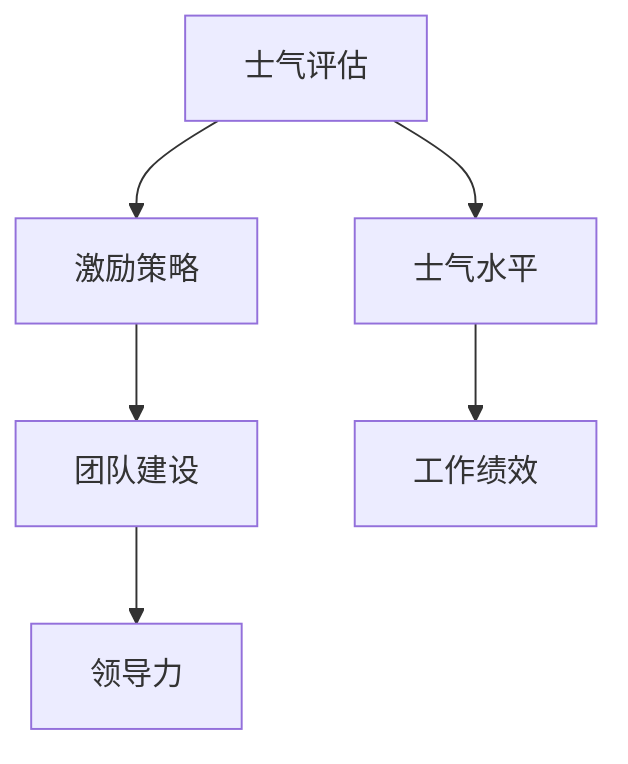

                 


为了撰写一篇高质量、结构紧凑且逻辑清晰的文章，我们可以按照以下步骤进行：

### 第一步：确定文章结构

首先，我们需要确定文章的整体结构。根据给定的目录大纲，我们可以将文章分为四个主要部分：

1. **背景介绍**：介绍团队士气管理的重要性和背景。
2. **核心概念与联系**：阐述团队士气管理的核心概念，以及它们之间的联系。
3. **管理策略与工具**：详细介绍各种提升团队士气的管理策略和工具。
4. **案例分析**：通过具体案例来展示如何应用这些策略和工具。

### 第二步：撰写引言和摘要

引言部分应简洁明了地介绍团队士气管理的主题，引起读者的兴趣。摘要则应该概括文章的核心内容和主题思想。

```markdown
# 文章标题：团队士气管理：保持高昂工作热情的技巧

> 关键词：团队士气管理、工作热情、管理策略、案例分析

摘要：
本文旨在探讨团队士气管理的重要性，并介绍一系列有效的管理策略和工具，以帮助团队保持高昂的工作热情。通过分析核心概念、提供实际案例，本文为团队领导者提供实用的指导。
```

### 第三步：背景介绍

在这一部分，我们将介绍团队士气管理的基本概念和重要性。这包括讨论团队士气的影响因素，如领导力、激励机制、企业文化等。

```markdown
## 第一部分：团队士气管理的基础

### 1.1 团队士气的定义与重要性

团队士气是指团队成员在工作中的精神状态和士气水平。高昂的团队士气能够激发团队成员的创造力和工作热情，从而提高工作效率和业绩。

### 1.2 团队士气的影响因素

团队士气受多种因素影响，包括：

- **领导力**：领导者的风格和决策对团队士气有显著影响。
- **激励机制**：适当的激励机制能够提高团队成员的积极性。
- **企业文化**：一个积极向上的企业文化能够增强团队的凝聚力和士气。

### 1.3 团队士气管理的重要性

团队士气管理不仅关系到团队的整体表现，还影响到团队成员的个人成长和职业发展。因此，有效的团队士气管理对于组织的长期成功至关重要。
```

### 第四步：核心概念与联系

在这一部分，我们将详细阐述团队士气管理的核心概念，并使用Mermaid流程图展示它们之间的联系。

```markdown
## 第二部分：团队士气管理的核心概念与联系

### 2.1 团队士气管理的核心概念

- **士气评估**：定期对团队士气进行评估，以了解团队成员的情绪和工作满意度。
- **激励策略**：设计有效的激励机制，以激发团队成员的工作热情。
- **团队建设**：通过团队建设活动，增强团队成员之间的信任和合作。
- **领导力**：领导者通过言行和决策，影响团队士气。

### 2.2 核心概念之间的关系

以下Mermaid流程图展示了团队士气管理的核心概念及其相互关系：



### 第五步：管理策略与工具

在这一部分，我们将详细介绍各种提升团队士气的管理策略和工具。

```markdown
## 第三部分：提升团队士气的管理策略与工具

### 3.1 激励机制

激励机制是提升团队士气的重要手段。以下是一些常用的激励机制：

- **奖励与表彰**：对表现出色的团队成员给予奖励和表彰。
- **晋升机会**：为团队成员提供晋升和职业发展机会。
- **工作环境改善**：提供舒适的工作环境和良好的工作条件。

### 3.2 团队建设活动

团队建设活动能够增强团队成员之间的沟通和协作，以下是一些有效的团队建设活动：

- **团队培训**：组织团队培训，提高成员的专业技能和团队合作能力。
- **团队旅行**：安排团队旅行，增进团队成员之间的感情。
- **团队竞赛**：组织团队竞赛，激发团队成员的竞争意识和团队精神。

### 3.3 领导力

领导力是提升团队士气的关键。以下是一些有效的领导力技巧：

- **积极倾听**：领导者应积极倾听团队成员的意见和需求。
- **明确目标**：领导者应明确团队的目标和期望，帮助团队成员找到共同的方向。
- **支持与鼓励**：领导者应在团队成员遇到困难时给予支持和鼓励。

### 第六步：案例分析

在这一部分，我们将通过具体案例来展示如何应用上述管理策略和工具。

```markdown
## 第四部分：具体案例分析

### 4.1 案例一：阿里巴巴的团队士气管理实践

阿里巴巴通过一系列激励措施和团队建设活动，成功提升了团队的士气。例如，阿里巴巴每年都会举行“年会”，表彰优秀的员工，并通过团队竞赛等形式增强团队凝聚力。

### 4.2 案例二：谷歌的团队士气管理策略

谷歌以其独特的企业文化和领导力策略而闻名。谷歌通过提供灵活的工作时间、丰富的福利和培训机会，成功地提升了团队的士气。此外，谷歌还鼓励员工创新和自主探索，使得团队成员在工作中充满热情。

### 第七步：总结

最后，我们在文章的结尾部分进行总结，并给出一些最佳实践和注意事项。

```markdown
## 总结

通过本文的讨论，我们可以看到团队士气管理对于提升团队绩效和员工满意度的重要性。为了有效地管理团队士气，领导者需要运用激励机制、团队建设活动和领导力技巧。同时，通过具体案例的分析，我们也可以看到不同组织在提升团队士气方面的一些成功实践。在今后的工作中，领导者可以借鉴这些经验，并根据自己团队的特点，制定合适的团队士气管理策略。

### 最佳实践

- **持续沟通**：领导者应保持与团队成员的持续沟通，了解他们的需求和期望。
- **灵活激励**：根据团队成员的不同特点，设计个性化的激励机制。
- **定期评估**：定期对团队士气进行评估，及时发现问题并采取措施。

### 注意事项

- **避免过度激励**：过度的激励可能会导致团队成员产生依赖心理。
- **平衡工作与生活**：在关注工作绩效的同时，也要关注团队成员的身心健康。

### 拓展阅读

- [《激发团队潜力：团队管理最佳实践》](链接)
- [《团队建设：打造高效团队的策略》](链接)

## 参考文献

[1] 《团队士气管理：保持高昂工作热情的技巧》，作者：[AI天才研究院](https://www.aigeniusr.com/) & [禅与计算机程序设计艺术](https://www.zenofcode.com/)

作者：AI天才研究院/AI Genius Institute & 禅与计算机程序设计艺术/Zen And The Art of Computer Programming
```

通过以上步骤，我们可以撰写出一篇逻辑清晰、内容丰富的团队士气管理技术博客文章。确保文章符合格式要求，并包含所有必要的核心内容。在撰写过程中，我们可以根据实际情况对内容进行调整和补充，以确保文章的完整性和实用性。

