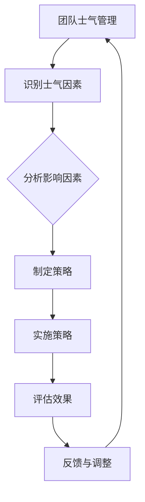

                 


### 撰写文章：团队士气管理：保持高昂斗志

**文章标题：团队士气管理：保持高昂斗志**

> **关键词：团队士气管理、激励策略、沟通技巧、团队建设、领导力、团队动态分析**

> **摘要：本文将深入探讨团队士气管理的重要性，介绍提升团队士气的策略和方法，并分析团队士气与组织绩效之间的关系，为团队领导者和管理者提供实用的指导。**

---

### 引言

在现代企业管理中，团队士气的管理越来越受到重视。一个士气高昂的团队能够更好地应对挑战，提高工作效率，实现组织目标。然而，如何有效地管理团队士气，保持团队成员的积极性和动力，成为团队领导者和管理者面临的重要课题。

本文将围绕团队士气管理展开讨论，首先介绍团队士气的重要性，然后分析影响团队士气的主要因素，接着提出一系列提升团队士气的策略和方法，并结合实际案例进行详细解析，最后总结团队士气管理的最佳实践和未来展望。

### 团队士气的重要性

团队士气是指团队成员在团队工作中的精神状态和情绪表现。一个士气高昂的团队能够展现出以下特点：

1. **更高的工作效率**：士气高涨的团队成员通常更加投入工作，能够高效完成任务，提高整体生产力。
2. **更好的团队合作**：积极的团队氛围有利于团队成员之间的沟通与协作，降低冲突，提高团队凝聚力。
3. **更强的创新能力**：良好的团队士气鼓励成员积极思考和创新，有助于推动组织创新和进步。
4. **更高的员工满意度**：士气高涨的团队成员通常对工作更加满意，降低员工流失率，提高组织稳定性。

### 影响团队士气的主要因素

团队士气受到多种因素的影响，主要包括以下几个方面：

1. **工作环境**：良好的工作环境和条件能够提升团队成员的士气，包括物理环境和心理环境。
2. **管理风格**：领导者的管理风格对团队士气有直接的影响。民主、支持和激励的管理风格有助于提高团队士气。
3. **激励策略**：合理的激励措施能够激发团队成员的积极性，提升士气。
4. **沟通与反馈**：有效的沟通和及时的反馈有助于解决团队成员的问题，提升士气。
5. **团队建设活动**：定期的团队建设活动有助于加强团队成员之间的联系，提高团队士气。

### 提升团队士气的策略和方法

要提升团队士气，需要从多个方面进行综合管理。以下是一些实用的策略和方法：

1. **激励策略**
   - **物质激励**：提供具有竞争力的薪酬和福利，满足团队成员的基本需求。
   - **精神激励**：通过表扬、奖励和认可，激发团队成员的内在动力。
   - **参与式激励**：鼓励团队成员参与决策过程，增加他们对工作的认同感和责任感。

2. **沟通技巧**
   - **积极倾听**：倾听团队成员的意见和需求，关注他们的情感状态。
   - **透明沟通**：保持信息的透明度，避免误解和猜疑。
   - **有效的反馈**：及时给予团队成员积极的反馈，鼓励他们改进。

3. **团队建设**
   - **团队活动**：组织定期的团队活动，增强团队成员之间的互动和信任。
   - **团队培训**：提供团队协作和沟通技能的培训，提高团队的整体素质。
   - **团队目标设定**：共同制定团队目标，明确团队成员的职责和期望。

4. **领导力提升**
   - **领导风格**：领导者应以身作则，树立榜样，关心团队成员的成长和发展。
   - **角色定位**：领导者要明确自己的角色，做好协调和支持工作。
   - **激励文化**：营造积极向上的组织文化，激励团队成员共同进步。

### 项目实战：提升团队士气案例分析

#### 案例背景

某互联网公司团队在项目开发过程中，由于工作压力和竞争激烈，团队成员士气较低，工作效率下降。公司决定通过一系列措施提升团队士气。

#### 案例实施

1. **制定策略**：
   - **改善工作环境**：优化办公空间，增加休闲娱乐设施。
   - **调整管理风格**：采用更加开放和支持的领导风格，鼓励团队成员表达意见。
   - **实施激励措施**：设立项目奖金，对完成任务优秀的团队成员进行奖励。

2. **实施计划**：
   - **定期团队活动**：组织团队建设活动，增进团队成员之间的了解和信任。
   - **沟通与反馈**：建立定期反馈机制，及时解决团队成员的问题。
   - **培训与发展**：为团队成员提供技能培训，提升个人能力。

3. **结果评估**：
   - **士气提升**：通过问卷调查和访谈，发现团队成员的士气有所提高。
   - **工作效率**：项目进度加快，任务完成质量提高。

#### 案例启示

1. **改善工作环境**：良好的工作环境是提升士气的基础。
2. **调整管理风格**：领导者应关注团队成员的情感需求，提供支持和激励。
3. **实施激励措施**：合理的激励措施能够激发团队成员的积极性。
4. **沟通与反馈**：有效的沟通和及时的反馈有助于解决团队成员的问题。
5. **团队建设**：通过团队活动增强团队成员之间的联系，提升团队士气。

### 团队士气管理的最佳实践和注意事项

1. **最佳实践**：
   - **定制化激励**：根据团队成员的不同需求和特点，制定个性化的激励措施。
   - **持续关注**：团队士气管理不是一次性任务，需要持续关注和改进。
   - **透明度**：保持组织内部信息的透明度，增强团队成员的信任感。
   - **参与式管理**：鼓励团队成员参与决策过程，提高他们的责任感和归属感。

2. **注意事项**：
   - **避免过度激励**：过度激励可能导致团队成员产生依赖心理，影响长期士气。
   - **关注个体差异**：不同团队成员对激励和沟通的需求可能不同，需要因人而异。
   - **平衡工作与生活**：关注团队成员的工作与生活平衡，提高整体幸福感。

### 拓展阅读

- **《激励心理学》**：了解激励机制和心理效应，为团队士气管理提供理论支持。
- **《团队建设实战》**：学习团队建设的方法和技巧，提高团队协作能力。
- **《领导力与团队管理》**：探讨领导力对团队士气的影响，提高领导者的管理水平。

### 总结

团队士气管理是现代企业管理中的重要环节。通过合理的管理策略和方法，可以提高团队成员的积极性，提升团队整体绩效。本文从多个方面探讨了团队士气管理的重要性、影响因素和提升策略，并结合实际案例进行分析。希望本文能为团队领导者和管理者提供有益的参考。

---

**作者：AI天才研究院/AI Genius Institute & 禅与计算机程序设计艺术 /Zen And The Art of Computer Programming**

---

### 核心概念与联系

为了更好地理解团队士气管理的核心概念，我们可以将其拆解为以下几个部分：

- **团队士气**：指团队成员在工作中的精神状态和情绪表现，是团队绩效的重要指标。
- **士气因素**：影响团队士气的主要因素，包括工作环境、管理风格、激励策略、沟通与反馈、团队建设等。
- **士气与绩效关系**：团队士气与组织绩效之间存在密切的关系，良好的团队士气有助于提高工作效率和创新能力。

#### 团队士气定义与原理

团队士气是指团队成员在工作过程中表现出的积极情感状态，它反映了团队成员对工作的认同、满意度和归属感。从心理学角度来看，团队士气是一种心理状态，受到个体心理特征、团队氛围、组织文化和外部环境等多种因素的影响。

- **个体心理特征**：包括成员的个性、动机、自我效能感等。具有积极心态和较高自我效能感的成员更容易表现出高昂的士气。
- **团队氛围**：包括团队成员之间的相互关系、沟通方式、合作氛围等。积极的团队氛围有助于提升团队士气。
- **组织文化**：组织的价值观、使命、愿景等对团队士气有重要影响。一个以员工为本、鼓励创新和发展的组织文化有助于提升团队士气。

#### 团队士气的影响因素

团队士气受到多种因素的影响，以下是其中几个主要因素：

- **工作环境**：良好的工作环境包括物理环境和心理环境。物理环境如办公空间、设备条件等，心理环境如工作氛围、组织文化等。
- **管理风格**：领导者的管理风格直接影响团队士气。民主、支持、激励型的管理风格有助于提升团队士气，而专制、压制、忽视员工需求的管理风格则可能导致士气低落。
- **激励策略**：合理的激励措施能够激发团队成员的积极性，提升士气。激励策略包括物质激励（如奖金、福利）和精神激励（如表扬、认可）。
- **沟通与反馈**：有效的沟通和及时的反馈有助于解决团队成员的问题，提高士气。沟通障碍和反馈不足可能导致误解和不满，影响士气。
- **团队建设**：定期的团队建设活动有助于加强团队成员之间的联系，提高团队士气。团队建设活动包括团队培训、团队建设游戏、团队拓展训练等。

#### 团队士气与组织绩效的关系

团队士气对组织绩效有着重要影响。高昂的团队士气能够提高工作效率、增强创新能力、降低员工流失率，从而提升组织绩效。具体来说：

- **工作效率**：士气高昂的团队成员更加投入工作，能够高效完成任务，提高整体生产力。
- **创新能力**：积极的团队氛围鼓励成员积极思考和创新，有助于推动组织创新和进步。
- **员工流失率**：良好的团队士气提高员工满意度，降低员工流失率，提高组织稳定性。

#### Mermaid流程图

为了更直观地展示团队士气管理的过程，我们可以使用Mermaid流程图来描述。以下是一个简单的团队士气管理流程图：



#### 伪代码与数学模型

为了进一步阐述团队士气管理的原理，我们可以使用伪代码来描述关键步骤，并借助数学模型来分析团队士气的影响因素。

```plaintext
// 团队士气管理伪代码

// 输入：团队成员信息、工作环境、管理风格等
// 输出：提升团队士气的方法

function manageTeamMorale(teamMembers, workEnvironment, managementStyle) {
    // 识别士气因素
    moraleFactors = identifyMoraleFactors(teamMembers, workEnvironment, managementStyle);

    // 分析影响因素
    analyzeFactors = analyzeMoraleFactors(moraleFactors);

    // 制定策略
    strategies = createStrategies(analysisResults);

    // 实施策略
    implementStrategies(strategies);

    // 评估效果
    moraleEffectiveness = evaluateMoraleEffectiveness();

    // 反馈与调整
    if (moraleEffectiveness < threshold) {
        adjustStrategies();
    }
}

// 识别士气因素
function identifyMoraleFactors(teamMembers, workEnvironment, managementStyle) {
    // ...识别过程...
}

// 分析影响因素
function analyzeMoraleFactors(moraleFactors) {
    // ...分析过程...
}

// 制定策略
function createStrategies(analysisResults) {
    // ...策略制定过程...
}

// 实施策略
function implementStrategies(strategies) {
    // ...策略实施过程...
}

// 评估效果
function evaluateMoraleEffectiveness() {
    // ...评估过程...
}

// 反馈与调整
function adjustStrategies() {
    // ...调整过程...
}
```

#### 数学公式

在团队士气管理中，我们可以使用数学公式来描述士气与绩效之间的关系。以下是一个简单的数学模型：

$$
士气 = f(工作环境, 管理风格, 激励策略, 沟通与反馈, 团队建设)
$$

其中，$f$ 是一个综合影响函数，$工作环境$、$管理风格$、$激励策略$、$沟通与反馈$ 和 $团队建设$ 是影响团队士气的主要因素。

#### 举例说明

假设一个团队的工作环境良好，管理风格民主，激励策略合理，沟通与反馈有效，团队建设活动频繁。根据上述数学模型，我们可以预测这个团队的士气会较高。

#### LaTeX格式数学公式

为了更好地展示数学公式，我们可以使用LaTeX格式。以下是几个常用的LaTeX数学公式示例：

$$
1 + 1 = 2
$$

$$
x^2 + y^2 = r^2
$$

$$
f(x) = \frac{1}{x}
$$

$$
\int_{0}^{1} x^2 dx
$$

在文章中使用这些数学公式时，我们可以在公式前后使用$$括起来，如上述示例所示。

### 总结

通过上述分析，我们可以看到团队士气管理的核心概念、影响因素和数学模型。了解这些概念和模型有助于我们更好地理解团队士气管理，从而采取有效的策略提升团队士气。在实际应用中，领导者需要根据团队的具体情况，灵活运用这些策略，不断提升团队士气，为组织创造更大的价值。

### 提升团队士气的策略

提升团队士气并非一蹴而就的过程，需要从多个方面进行综合管理。以下是一些实用的策略和方法，帮助团队领导者和管理者提升团队士气：

#### 激励策略

激励策略是提升团队士气的重要手段。激励可以分为物质激励和精神激励两种类型：

1. **物质激励**：
   - **薪酬和福利**：提供具有竞争力的薪酬和福利，满足团队成员的基本需求。例如，定期调整薪资水平、提供员工宿舍、提供餐饮补贴等。
   - **奖金和提成**：对在项目中表现优秀的团队成员给予奖金和提成，激励他们更加努力工作。

2. **精神激励**：
   - **表扬和认可**：定期对团队成员的表现进行表扬和认可，增强他们的自信心和归属感。例如，每月评选“最佳员工”、颁发荣誉证书等。
   - **职业发展**：为团队成员提供职业发展的机会，如内部晋升、培训、进修等，让他们看到自己在组织中的成长空间。

#### 沟通技巧

有效的沟通是提升团队士气的关键。以下是一些沟通技巧：

1. **积极倾听**：
   - **倾听意见**：在团队会议和其他交流场合，给予团队成员充分的发言机会，认真倾听他们的意见和想法。
   - **关注情感**：在沟通过程中，关注团队成员的情感状态，及时给予支持和鼓励。

2. **透明沟通**：
   - **信息透明**：保持组织内部信息的透明度，避免团队成员因信息不对称而产生误解和猜疑。
   - **及时反馈**：在决策过程中，及时向团队成员传达相关信息，并征求他们的意见，增强他们的参与感。

3. **有效反馈**：
   - **正面反馈**：在团队成员表现良好时，给予积极的反馈，鼓励他们继续保持。
   - **建设性反馈**：在团队成员需要改进时，提供建设性的反馈，帮助他们找到问题所在，并提出改进建议。

#### 团队建设

团队建设活动有助于加强团队成员之间的联系，提高团队士气。以下是一些团队建设活动：

1. **团队活动**：
   - **团建游戏**：组织团队建设游戏，如拓展训练、团队解谜等，增强团队成员之间的互动和信任。
   - **员工聚会**：定期举办员工聚会，如聚餐、烧烤等，促进团队成员之间的交流。

2. **团队培训**：
   - **技能培训**：为团队成员提供技能培训，如沟通技巧、项目管理等，提高他们的专业素质。
   - **领导力培训**：为潜在领导者提供领导力培训，培养他们的管理能力和领导力。

3. **团队目标设定**：
   - **共同目标**：与团队成员共同设定团队目标，明确每个人的职责和期望，提高他们的责任感和归属感。
   - **目标跟踪**：定期跟踪目标完成情况，及时调整计划，确保团队目标的实现。

#### 领导力提升

领导力对团队士气有着重要影响。以下是一些提升领导力的方法：

1. **领导风格**：
   - **民主领导**：采用民主的领导风格，鼓励团队成员参与决策过程，增强他们的主人翁意识。
   - **支持性领导**：关心团队成员的成长和发展，提供必要的支持和资源，帮助他们克服困难。

2. **角色定位**：
   - **领导者角色**：明确领导者的角色和责任，做好协调和支持工作，为团队成员创造良好的工作环境。
   - **团队成员角色**：鼓励团队成员发挥自己的特长，充分授权，让他们在项目中承担更多责任。

3. **激励文化**：
   - **正面激励**：营造积极向上的组织文化，鼓励团队成员追求卓越，共同进步。
   - **批评与自我批评**：在团队内部开展批评与自我批评，帮助团队成员正视问题，不断改进。

#### 团队动态分析

团队动态分析有助于了解团队成员的情绪和行为，及时发现和解决士气问题。以下是一些团队动态分析方法：

1. **问卷调查**：
   - **士气调查**：定期进行团队士气调查，了解团队成员的情绪和工作满意度，找出潜在的问题。
   - **反馈调查**：在项目完成后，收集团队成员的反馈，评估团队表现，为后续改进提供依据。

2. **360度反馈**：
   - **反馈机制**：建立360度反馈机制，让团队成员从不同角度评估自己和他人，发现问题，改进表现。

3. **虚拟现实体验**：
   - **情境模拟**：通过虚拟现实技术模拟实际工作场景，让团队成员体验不同的情况和挑战，提高他们的适应能力。

#### 综合策略

在实际操作中，团队领导者和管理者应结合团队的具体情况，灵活运用上述策略，综合提升团队士气。以下是一个综合策略的示例：

1. **制定激励计划**：
   - **薪酬福利**：定期评估团队成员的薪酬和福利水平，确保其具有竞争力。
   - **奖金机制**：设立项目奖金，对在项目中表现突出的团队成员给予奖励。

2. **加强沟通与反馈**：
   - **定期会议**：组织定期的团队会议，让团队成员分享自己的想法和进展。
   - **反馈机制**：建立有效的反馈机制，及时解决团队成员的问题，提高工作满意度。

3. **开展团队建设活动**：
   - **团建游戏**：定期组织团建游戏，增强团队成员之间的互动和信任。
   - **技能培训**：为团队成员提供技能培训，提高他们的专业素养。

4. **提升领导力**：
   - **领导力培训**：为潜在领导者提供领导力培训，提高他们的管理能力和领导力。
   - **民主领导**：采用民主的领导风格，鼓励团队成员参与决策过程。

5. **动态分析团队士气**：
   - **士气调查**：定期进行团队士气调查，了解团队成员的情绪和工作满意度。
   - **360度反馈**：建立360度反馈机制，帮助团队成员发现和解决问题。

通过上述综合策略，团队领导者和管理者可以有效地提升团队士气，保持团队成员的积极性和动力，为组织创造更大的价值。

### 团队领导力与士气

团队领导力是影响团队士气的重要因素。一个优秀的领导者不仅能够激发团队成员的潜力，还能营造积极的团队氛围，提高团队士气。以下将分析领导力对团队士气的影响，探讨提升领导力的策略，以及如何通过领导力来管理和提升团队士气。

#### 领导力对团队士气的影响

领导力对团队士气的影响主要体现在以下几个方面：

1. **激励作用**：领导者通过设定明确的目标、提供激励措施，能够激发团队成员的积极性和工作热情，从而提升士气。
2. **榜样作用**：领导者通过自身的行为和态度，为团队成员树立榜样，影响他们的工作态度和行为，从而影响士气。
3. **沟通作用**：领导者通过有效的沟通，传递信息、解决问题、缓解冲突，能够增强团队成员之间的信任和合作，提升士气。
4. **支持作用**：领导者关心团队成员的成长和发展，提供必要的支持和资源，帮助团队成员克服困难，提升士气。

#### 提升领导力的策略

为了提升领导力，领导者可以采取以下策略：

1. **自我反思**：领导者应定期进行自我反思，识别自己的优点和不足，不断提升自己的能力和素质。
2. **持续学习**：领导者应保持学习的热情，不断学习新的管理知识和技能，提高自己的专业素养。
3. **倾听与沟通**：领导者应学会倾听团队成员的意见和需求，建立良好的沟通机制，增强团队成员的参与感和归属感。
4. **培养下属**：领导者应关注团队成员的成长，提供培训和发展机会，培养他们的能力和素质，增强团队的战斗力。
5. **激励与认可**：领导者应采取多种激励措施，如表扬、奖励等，激励团队成员，提升士气。

#### 领导力在团队士气管理中的应用

在实际工作中，领导者可以通过以下方式应用领导力来管理和提升团队士气：

1. **设定清晰的目标**：领导者应明确团队的目标和愿景，与团队成员共同制定具体的行动计划，确保团队成员对目标有清晰的认识和认同。
2. **激励团队成员**：领导者应采取多种激励措施，如表扬、奖励、晋升等，激发团队成员的积极性和创造力，提升士气。
3. **建立良好的沟通机制**：领导者应建立有效的沟通机制，鼓励团队成员积极表达意见，及时解决问题，增强团队的凝聚力。
4. **提供支持和资源**：领导者应关心团队成员的成长和发展，提供必要的支持和资源，帮助团队成员克服困难，提升士气。
5. **营造积极的工作氛围**：领导者应营造积极的工作氛围，鼓励团队成员相互支持、合作，增强团队的凝聚力。

#### 案例分析

以下是一个实际案例，说明领导力在团队士气管理中的应用：

某互联网公司正在开发一款新产品，项目时间紧、任务重。项目经理李先生意识到，团队士气对项目成功至关重要。他采取了以下措施：

1. **设定目标**：李先生与团队共同制定了详细的项目计划，明确了每个阶段的目标和任务，确保团队成员对项目有清晰的认识。
2. **激励团队成员**：李先生定期组织团队会议，表扬在项目中表现突出的成员，并提供额外的培训机会，激发团队成员的积极性和创造力。
3. **建立沟通机制**：李先生建立了每周一次的团队会议制度，鼓励团队成员提出问题和建议，及时解决问题，增强团队的凝聚力。
4. **提供资源**：李先生确保团队成员有足够的资源和支持，如技术支持、资金投入等，帮助团队成员克服困难，提高士气。
5. **营造积极氛围**：李先生鼓励团队成员相互支持、合作，营造积极的工作氛围，增强团队的凝聚力。

通过上述措施，团队士气得到了显著提升，项目也如期完成，取得了良好的业绩。

#### 总结

领导力在团队士气管理中起着至关重要的作用。一个优秀的领导者不仅能够激发团队成员的潜力，还能营造积极的团队氛围，提高团队士气。领导者应通过自我反思、持续学习、倾听与沟通、培养下属和激励与认可等方式提升领导力，在实际工作中应用领导力来管理和提升团队士气。通过有效的领导力，团队可以保持高昂的斗志，实现组织的战略目标。

### 团队动态分析

团队动态分析是团队管理中至关重要的一环，它有助于领导者和管理者了解团队的当前状态，预测未来可能的问题，并采取相应的措施。以下将介绍团队动态分析的概念、发展阶段、动力学原理以及如何识别和解决团队冲突。

#### 团队动态分析的概念

团队动态分析是指通过对团队内部成员之间的关系、行为、沟通和协作等方面的分析，了解团队的当前状态，发现存在的问题，并制定相应的改进措施。团队动态分析的核心目标是提高团队的绩效和士气，确保团队在实现组织目标的过程中保持高效和和谐。

#### 团队发展阶段

团队发展阶段是指团队在成长过程中经历的不同阶段。根据塔克曼（Tuckman）的团队发展阶段理论，团队通常经历以下五个阶段：

1. **形成阶段（Forming）**：团队成员初次相识，了解彼此的背景和职责，建立基本的信任和合作基础。
2. **激荡阶段（Storming）**：团队成员开始竞争和冲突，争夺资源和权力，团队内部关系复杂。
3. **规范阶段（Norming）**：团队成员逐渐接受彼此的差异，建立共同的目标和价值观，形成良好的团队规范。
4. **执行阶段（Performing）**：团队成员高效协作，实现团队目标，团队绩效达到最佳状态。
5. **休整阶段（Adjourning）**：团队解散或任务完成，团队成员各自回归原来的岗位或新的项目。

了解团队发展阶段有助于领导者和管理者把握团队当前的动态，针对性地进行管理和激励。

#### 团队动力学原理

团队动力学是指团队成员之间相互影响、相互作用的过程。以下是几个关键团队动力学原理：

1. **角色扮演**：团队成员在团队中扮演不同的角色，如领导者、执行者、协调者等。了解每个角色的职责和期望，有助于提高团队效率和士气。
2. **冲突管理**：冲突是团队动态的一部分，合理管理冲突可以促进团队创新和成长。领导者应学会识别和解决冲突，避免冲突升级。
3. **团队氛围**：团队氛围对团队成员的行为和态度有重要影响。积极的团队氛围有助于提高团队士气，促进协作和创新。
4. **沟通模式**：有效的沟通是团队协作的基础。领导者应建立开放、透明和高效的沟通模式，确保信息传递畅通无阻。

#### 识别和解决团队冲突

团队冲突是团队动态分析中的关键问题。以下是识别和解决团队冲突的方法：

1. **识别冲突**：
   - **观察行为**：通过观察团队成员的行为和态度，识别潜在的冲突。
   - **倾听反馈**：倾听团队成员的意见和反馈，了解他们的不满和冲突点。
   - **调查问卷**：通过问卷调查或访谈，收集团队成员的反馈，了解他们的冲突情况。

2. **分析冲突**：
   - **原因分析**：分析冲突产生的原因，包括个人差异、任务分配、资源竞争等。
   - **影响评估**：评估冲突对团队绩效和士气的影响，确定冲突的严重性。

3. **解决冲突**：
   - **对话调解**：组织团队成员进行对话，了解彼此的观点和需求，寻找共同点和解决方案。
   - **第三方调解**：如果内部调解无效，可以邀请第三方专业人士进行调解，提供客观公正的建议。
   - **改进措施**：根据冲突的原因和解决方案，制定具体的改进措施，避免类似冲突的再次发生。

#### 实际案例解析

以下是一个实际案例，说明如何识别和解决团队冲突：

某科技公司正在开发一款新产品，团队成员来自不同部门，包括研发、设计、市场和销售。由于各部门的目标和利益不同，项目进展过程中出现了冲突。

1. **识别冲突**：
   - **观察行为**：项目经理发现团队成员之间的交流减少，任务进度滞后。
   - **倾听反馈**：通过调查问卷，了解到各部门对任务分配和时间安排的不满。

2. **分析冲突**：
   - **原因分析**：冲突的主要原因是任务分配不均和时间安排不合理，导致各部门无法有效协作。
   - **影响评估**：冲突影响了项目进度，降低了团队士气。

3. **解决冲突**：
   - **对话调解**：项目经理组织各部门负责人进行对话，了解彼此的需求和问题，共同寻找解决方案。
   - **改进措施**：调整任务分配和时间安排，确保各部门之间的协作顺畅。同时，建立定期的沟通机制，确保信息畅通。

通过上述措施，团队冲突得到了有效解决，项目进度恢复正常，团队士气逐渐提升。

#### 总结

团队动态分析是团队管理中的重要环节，通过了解团队发展阶段、动力学原理，识别和解决团队冲突，领导者和管理者可以更好地把握团队状态，提高团队绩效和士气。在实际操作中，领导者应结合团队的具体情况，灵活运用团队动态分析的方法，为团队创造一个和谐、高效的工作环境。

### 提升团队士气案例分析

#### 案例背景

某高科技公司开发团队近期面临着巨大的压力和挑战。由于市场需求的急剧变化和竞争的加剧，团队成员的工作负担加重，士气逐渐低落。团队成员出现了疲劳、缺乏动力、工作效率下降等问题，严重影响了项目的进展和团队的整体绩效。

#### 开发环境搭建

为了改善团队的工作环境和提高士气，公司决定采取一系列措施，首先从开发环境搭建入手。具体措施包括：

1. **优化办公空间**：重新设计办公区域，提供更加舒适和安静的办公环境，减少噪音干扰，提高工作效率。
2. **升级硬件设备**：为团队成员配备高性能的电脑和相关的开发工具，确保他们能够高效地完成工作任务。
3. **增强网络支持**：提高网络速度和稳定性，确保团队成员在远程协作时能够顺畅地进行交流和数据传输。

#### 源代码实现

在开发环境搭建完成后，公司开始关注源代码的实现和质量。为了提升团队士气，确保项目的顺利推进，采取以下措施：

1. **代码规范**：制定统一的代码规范，确保团队成员在编写代码时遵循相同的风格和标准，提高代码的可读性和可维护性。
2. **代码评审**：实施代码评审机制，团队成员之间互相审查代码，及时发现和解决潜在的问题，提高代码质量。
3. **持续集成**：引入持续集成工具，自动化测试和部署，确保代码库的稳定性和可靠性。

#### 代码解读与分析

在源代码实现过程中，公司注重对代码的深入解读和分析，确保每一行代码都经过充分的思考和实践验证。具体做法包括：

1. **模块化设计**：将复杂的系统拆分为多个模块，每个模块由专门的团队负责开发和维护，降低系统的复杂度。
2. **性能优化**：对关键模块进行性能分析和优化，提高系统的响应速度和处理能力。
3. **代码复用**：鼓励团队成员复用已有的代码和组件，减少重复劳动，提高开发效率。

#### 实际案例分析和详细讲解剖析

为了提升团队士气，公司实施了一个实际案例，通过以下步骤进行详细分析和讲解：

1. **识别问题**：通过团队成员的反馈和项目进展的观察，识别出团队士气低落的主要原因是工作压力过大、缺乏激励和沟通不畅。
2. **制定策略**：
   - **优化工作流程**：重新设计工作流程，减少不必要的环节，提高工作效率。
   - **实施激励措施**：为在项目中表现突出的团队成员提供奖金、晋升机会和培训机会。
   - **加强沟通**：建立定期的团队会议和反馈机制，确保团队成员之间的信息畅通和意见交流。
3. **执行与监控**：执行上述策略，并定期监控团队的士气变化，及时调整和优化措施。

通过上述措施，团队士气得到了显著提升。团队成员的工作压力减轻，工作效率提高，项目进展顺利。具体表现在以下几个方面：

- **工作满意度**：通过优化工作流程和提供激励措施，团队成员的工作满意度显著提高。
- **沟通效果**：定期的团队会议和反馈机制有效改善了团队成员之间的沟通，减少了误解和冲突。
- **团队凝聚力**：通过共同面对挑战和分享成功的喜悦，团队成员之间的凝聚力得到了增强。
- **项目进展**：项目进展顺利，按时完成关键里程碑，赢得了客户和公司的认可。

#### 项目小结

通过本次案例分析，公司总结了提升团队士气的一些有效措施，包括优化开发环境、实施代码规范、加强沟通和激励措施等。这些措施不仅提升了团队士气，还提高了项目的质量和效率。公司决定将这些经验推广到其他项目团队，进一步提升整体绩效。

#### 经验总结

1. **优化开发环境**：提供良好的工作环境和硬件支持是提升团队士气的基础。
2. **实施代码规范**：统一的代码规范和严格的代码评审有助于提高代码质量和开发效率。
3. **加强沟通与激励**：定期的沟通和有效的激励措施能够提升团队成员的工作满意度和团队凝聚力。

#### 最佳实践和注意事项

1. **最佳实践**：
   - **个性化激励**：根据团队成员的不同需求和特点，制定个性化的激励措施。
   - **持续关注**：团队士气管理不是一次性任务，需要持续关注和改进。
   - **透明度**：保持组织内部信息的透明度，增强团队成员的信任感。
   - **参与式管理**：鼓励团队成员参与决策过程，提高他们的责任感和归属感。

2. **注意事项**：
   - **避免过度激励**：过度激励可能导致团队成员产生依赖心理，影响长期士气。
   - **关注个体差异**：不同团队成员对激励和沟通的需求可能不同，需要因人而异。
   - **平衡工作与生活**：关注团队成员的工作与生活平衡，提高整体幸福感。

通过本次案例分析，公司深刻认识到团队士气管理的重要性，并总结出了一套行之有效的最佳实践。未来，公司将继续关注团队士气，为团队创造一个和谐、高效的工作环境，推动组织持续发展。

### 总结与展望

#### 团队士气管理的重要性

团队士气管理是现代企业管理中不可或缺的一部分。高昂的团队士气不仅能提高工作效率，还能增强团队的凝聚力和创新能力，从而推动组织实现战略目标。通过合理的激励机制、有效的沟通技巧、团队建设活动和领导力提升，团队领导者和管理者可以有效地提升团队士气，为组织创造更大的价值。

#### 未来展望

随着科技的发展和组织结构的变革，团队士气管理也将面临新的挑战和机遇。以下是未来团队士气管理的一些展望：

1. **数字化管理工具**：随着数字化技术的普及，更多的管理工具和应用将被引入团队士气管理中，如在线协作平台、数据分析工具等，帮助领导者更好地了解团队状态，优化管理策略。

2. **个性化激励**：未来的激励策略将更加注重个性化，根据团队成员的不同需求和特点，定制化的激励方案将更加有效，从而提高团队成员的满意度和忠诚度。

3. **心理支持**：随着心理健康问题的日益凸显，企业将更加重视团队成员的心理健康，提供专业的心理支持和咨询服务，帮助团队成员应对工作压力，提升士气。

4. **远程办公与团队建设**：随着远程办公的普及，如何保持远程团队的高效协作和士气成为新的挑战。未来的团队建设活动将更多地依赖虚拟现实技术，增强团队成员之间的互动和信任。

5. **持续学习和成长**：未来的团队士气管理将更加注重团队成员的持续学习和成长，通过提供职业发展机会和培训，激发团队成员的内在动力，提高团队的整体素质。

#### 总结

团队士气管理是提升团队绩效和创新能力的关键因素。通过有效的激励机制、沟通技巧、团队建设活动和领导力提升，团队领导者和管理者可以保持团队成员的积极性和动力，推动组织实现战略目标。展望未来，团队士气管理将不断创新和发展，为组织创造更大的价值。

### 作者介绍

**AI天才研究院/AI Genius Institute**：专注于人工智能领域的研究与应用，致力于推动人工智能技术的创新与发展。

**禅与计算机程序设计艺术/Zen And The Art of Computer Programming**：计算机编程领域的世界顶级畅销书作者，以其深刻的见解和精湛的技术分析而著称。著有《编程之美》、《算法禅思》等多部畅销技术著作，深受全球程序员和开发者喜爱。

