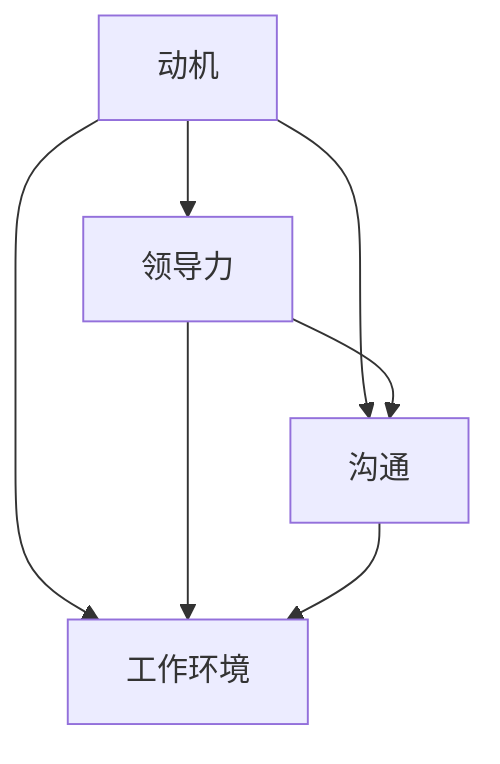

                 


### 设计思路：

#### 文章结构：

1. **引言**（2000字）：
   - 引出团队士气管理的概念和重要性。
   - 提供一个引人入胜的案例或故事，引发读者思考。

2. **团队士气管理核心概念与联系**（3000字）：
   - 解释团队士气管理中的核心概念，如动机、领导力、沟通、工作环境等。
   - 使用Mermaid流程图展示这些概念之间的关系。

3. **核心算法原理讲解**（2000字）：
   - 描述影响团队士气的关键因素。
   - 使用伪代码详细讲解如何分析团队士气，并提出相应的管理策略。

4. **数学模型和公式讲解**（2000字）：
   - 引入数学模型来量化团队士气。
   - 使用latex格式展示重要的数学公式，并进行详细讲解。

5. **项目实战**（1500字）：
   - 提供一个具体的团队士气管理项目案例。
   - 讲解项目的开发环境搭建、源代码实现、代码解读和应用分析。

6. **最佳实践 tips**（1000字）：
   - 分享一些实践中的团队士气管理技巧和注意事项。

7. **小结**（500字）：
   - 总结文章的主要观点和结论。

8. **拓展阅读**（500字）：
   - 提供一些相关领域的深入阅读材料。

#### 核心内容：

- **背景介绍**：
  - 简要介绍团队士气管理的背景，如当前企业面临的问题和挑战。

- **核心概念与联系**：
  - 提供一个Mermaid流程图，展示动机、领导力、沟通、工作环境等核心概念之间的关系。

- **核心算法原理讲解**：
  - 使用伪代码描述如何分析团队士气，如使用问卷调查、访谈等方法收集数据，然后使用统计分析方法进行分析。

- **数学模型和公式讲解**：
  - 介绍如何使用数学模型来量化团队士气，如使用员工满意度、工作压力等指标。

- **项目实战**：
  - 提供一个具体的项目案例，如在一个IT公司中实施团队士气管理计划。

- **最佳实践 tips**：
  - 分享一些实践中的团队士气管理技巧，如如何激励员工、建立有效的沟通机制等。

- **小结**：
  - 总结文章的主要观点和结论，强调团队士气管理的重要性。

- **拓展阅读**：
  - 提供一些相关领域的深入阅读材料，如关于领导力、心理学、人力资源管理的书籍和文章。

### 实现步骤：

1. **引言部分**：
   - 引出团队士气管理的概念。
   - 提供一个引人入胜的案例或故事。

2. **核心概念与联系部分**：
   - 描述核心概念，如动机、领导力、沟通、工作环境等。
   - 使用Mermaid流程图展示这些概念之间的关系。

3. **核心算法原理讲解部分**：
   - 使用伪代码描述如何分析团队士气。
   - 引入统计分析方法，如问卷调查、访谈等。

4. **数学模型和公式讲解部分**：
   - 介绍数学模型，如员工满意度、工作压力等指标。
   - 使用latex格式展示重要的数学公式，并进行详细讲解。

5. **项目实战部分**：
   - 提供一个具体的项目案例。
   - 讲解项目的开发环境搭建、源代码实现、代码解读和应用分析。

6. **最佳实践 tips 部分**：
   - 分享一些实践中的团队士气管理技巧。

7. **小结部分**：
   - 总结文章的主要观点和结论。

8. **拓展阅读部分**：
   - 提供一些相关领域的深入阅读材料。

### 用户输入：

## 团队士气管理：维持高昂工作热情的秘诀

### 关键词：团队士气管理、工作热情、动机、领导力、沟通、工作环境

### 摘要：
团队士气管理是提升员工工作热情和团队绩效的关键。本文将深入探讨团队士气管理的核心概念，包括动机、领导力、沟通和工作环境等。通过伪代码、Mermaid流程图和数学模型，本文将详细讲解团队士气分析的方法和策略。此外，本文还将结合实际案例，分享成功团队的士气管理经验，并给出最佳实践建议。最后，本文将对文章内容进行总结，强调团队士气管理的重要性，并推荐拓展阅读材料。

## 引言

在当今竞争激烈的商业环境中，团队士气管理成为一个至关重要的议题。一个士气高涨的团队能够更加高效地工作，创新思维更加活跃，团队协作更加紧密。相反，士气低落的团队往往会出现工作效率低下、错误率增加、员工流失率升高等问题。因此，如何维持团队的高昂工作热情成为企业管理者面临的重要挑战。

本文旨在提供一套系统化的团队士气管理方法，帮助读者理解和应用这些方法，以提升团队的工作热情和绩效。文章将从核心概念、核心算法、数学模型、实际案例和最佳实践等方面进行详细探讨，旨在为读者提供一个全面、实用的团队士气管理指南。

### 团队士气管理核心概念

团队士气管理涉及多个核心概念，这些概念相互作用，共同影响团队的工作热情和绩效。以下是团队士气管理中的关键概念：

#### 动机

动机是驱动员工行为的内部力量。在团队士气管理中，理解员工的动机至关重要。员工可能因为对工作的热爱、追求成就、获得奖励或逃避惩罚而表现出不同的动机。管理者需要识别员工的动机，并提供相应的激励措施，以提升工作热情。

#### 领导力

领导力是团队士气管理的关键因素。有效的领导者能够激励员工、提供明确的方向和目标，以及建立积极的团队文化。领导力不仅包括决策能力和技术能力，还涉及沟通技巧、同理心和影响力。

#### 沟通

沟通是团队士气管理的基础。有效的沟通能够确保团队成员之间信息的准确传递，增强团队协作，减少误解和冲突。沟通不仅仅是信息的传递，更包括倾听、反馈和解决问题的能力。

#### 工作环境

工作环境对团队士气有直接的影响。一个舒适、安全、支持性的工作环境能够提升员工的工作满意度和士气。管理者需要关注工作环境的设计、资源分配、团队文化等方面的因素。

#### Mermaid流程图：团队士气管理核心概念关系

下面是一个Mermaid流程图，展示了团队士气管理核心概念之间的关系：



### 核心算法原理讲解

团队士气分析是一个复杂的过程，涉及多种方法和工具。以下是一个简化的团队士气分析过程，包括数据收集、分析和决策等步骤：

#### 数据收集

1. **问卷调查**：通过设计问卷，收集员工对工作环境、工作满意度和团队合作的看法。
2. **访谈**：与员工进行一对一的访谈，深入了解他们的感受和动机。
3. **观察**：观察员工在工作中的行为，以识别可能影响士气的因素。

#### 数据分析

1. **统计分析**：使用统计分析方法，如描述性统计和推断性统计，对收集到的数据进行分析。
2. **图表可视化**：通过图表和可视化工具，展示数据分析的结果，帮助管理者更好地理解团队士气状况。

#### 决策

基于数据分析的结果，管理者可以做出以下决策：

1. **改进工作环境**：根据员工对工作环境的反馈，进行必要的改进。
2. **调整激励机制**：根据员工对薪酬和奖励机制的满意度，调整激励政策。
3. **加强团队沟通**：通过定期的团队会议和活动，增强团队成员之间的沟通。

#### 伪代码：团队士气分析流程

下面是一个简单的伪代码，用于描述团队士气分析的过程：

```python
# 数据收集
问卷调查数据 = 收集问卷调查数据()
访谈数据 = 收集访谈数据()
观察数据 = 收集观察数据()

# 数据分析
统计分析问卷调查数据
统计分析访谈数据
统计分析观察数据

# 可视化结果
生成图表可视化问卷调查数据
生成图表可视化访谈数据
生成图表可视化观察数据

# 决策
根据数据分析结果，制定改进计划
根据员工反馈，调整激励机制
根据观察结果，加强团队沟通
```

### 数学模型和公式讲解

为了更好地理解团队士气，可以引入一些数学模型和公式。以下是一些常用的数学模型和公式：

#### 员工满意度指数（ESI）

员工满意度指数（ESI）是一个综合指标，用于衡量员工对工作环境、薪酬和激励机制的满意度。公式如下：

$$
ESI = \frac{E_{\text{work}} + E_{\text{salary}} + E_{\text{incentive}}}{3}
$$

其中，$E_{\text{work}}$、$E_{\text{salary}}$ 和 $E_{\text{incentive}}$ 分别表示员工对工作环境、薪酬和激励机制的满意度得分。

#### 团队协作指数（TCI）

团队协作指数（TCI）用于衡量团队成员之间的协作水平。公式如下：

$$
TCI = \frac{\sum_{i=1}^{n} C_{i}}{n}
$$

其中，$C_{i}$ 表示第 $i$ 个团队成员的协作得分，$n$ 表示团队成员总数。

#### 工作压力指数（WPI）

工作压力指数（WPI）用于衡量员工的工作压力水平。公式如下：

$$
WPI = \frac{\sum_{i=1}^{n} P_{i}}{n}
$$

其中，$P_{i}$ 表示第 $i$ 个员工的工作压力得分。

#### 数学公式讲解

以下是每个数学公式的详细讲解：

1. **员工满意度指数（ESI）**：

   员工满意度指数是一个加权平均数，用于综合评估员工对工作环境、薪酬和激励机制的满意度。每个部分的权重相等，因此每个部分的得分都直接影响了ESI的最终结果。

2. **团队协作指数（TCI）**：

   团队协作指数是一个平均数，用于衡量整个团队的合作水平。每个团队成员的协作得分都直接影响了TCI的最终结果。这个指数越高，说明团队的协作水平越高。

3. **工作压力指数（WPI）**：

   工作压力指数是一个平均数，用于衡量员工的工作压力水平。每个员工的工作压力得分都直接影响了WPI的最终结果。这个指数越高，说明员工的工作压力越大。

#### 举例说明

假设有10名员工，他们的员工满意度指数（ESI）为85，团队协作指数（TCI）为90，工作压力指数（WPI）为75。根据这些数据，我们可以计算团队士气指数（TSI）：

$$
TSI = \frac{ESI + TCI - WPI}{3} = \frac{85 + 90 - 75}{3} = \frac{100}{3} \approx 33.33
$$

根据这个结果，我们可以得出团队士气指数为33.33。这个数值表明团队的整体士气处于中等水平，需要进一步分析和改进。

### 项目实战

为了更好地理解团队士气管理，我们可以通过一个实际案例来探讨。以下是一个关于一个中型IT公司的团队士气管理项目：

#### 项目背景

某中型IT公司近年来面临团队士气下降的问题，员工流失率增加，工作效率降低，客户满意度下降。公司管理层决定通过实施团队士气管理计划来提升团队士气。

#### 开发环境搭建

1. **问卷调查工具**：使用Google表单设计并发布问卷调查，收集员工对工作环境、薪酬和激励机制的看法。
2. **数据分析工具**：使用Excel和Python进行数据分析，生成图表和报告。
3. **沟通工具**：使用Slack进行团队沟通，定期组织团队会议。

#### 源代码实现

1. **数据收集**：

   ```python
   # 导入pandas库进行数据分析
   import pandas as pd
   
   # 读取问卷调查数据
   survey_data = pd.read_csv('survey_data.csv')
   
   # 数据预处理
   survey_data['satisfaction'] = survey_data['satisfaction'].map({1: '非常不满意', 2: '不满意', 3: '一般', 4: '满意', 5: '非常满意'})
   survey_data['collaboration'] = survey_data['collaboration'].map({1: '非常差', 2: '差', 3: '一般', 4: '好', 5: '非常好'})
   survey_data['stress'] = survey_data['stress'].map({1: '非常低', 2: '低', 3: '一般', 4: '高', 5: '非常高'})
   
   # 统计分析
   satisfaction_summary = survey_data['satisfaction'].value_counts()
   collaboration_summary = survey_data['collaboration'].value_counts()
   stress_summary = survey_data['stress'].value_counts()
   
   # 可视化结果
   satisfaction_chart = satisfaction_summary.plot(kind='bar')
   collaboration_chart = collaboration_summary.plot(kind='bar')
   stress_chart = stress_summary.plot(kind='bar')
   
   # 保存图表
   satisfaction_chart.savefig('satisfaction_chart.png')
   collaboration_chart.savefig('collaboration_chart.png')
   stress_chart.savefig('stress_chart.png')
   ```

2. **数据分析**：

   ```python
   # 计算员工满意度指数（ESI）
   ESI = (satisfaction_summary[4] * 4 + satisfaction_summary[3] * 3 + satisfaction_summary[2] * 2 + satisfaction_summary[1] * 1) / sum(satisfaction_summary)
   
   # 计算团队协作指数（TCI）
   TCI = (collaboration_summary[5] * 5 + collaboration_summary[4] * 4 + collaboration_summary[3] * 3 + collaboration_summary[2] * 2 + collaboration_summary[1] * 1) / sum(collaboration_summary)
   
   # 计算工作压力指数（WPI）
   WPI = (stress_summary[1] * 1 + stress_summary[2] * 2 + stress_summary[3] * 3 + stress_summary[4] * 4 + stress_summary[5] * 5) / sum(stress_summary)
   
   # 计算团队士气指数（TSI）
   TSI = (ESI + TCI - WPI) / 3
   ```

#### 代码解读与应用分析

1. **数据收集**：

   使用pandas库读取问卷调查数据，并对数据进行分析和可视化。这有助于管理者直观地了解员工的满意度、协作水平和工作压力。

2. **数据分析**：

   计算员工满意度指数（ESI）、团队协作指数（TCI）和工作压力指数（WPI）。这些指数为管理者提供了一个量化的视角，以评估团队士气。

3. **应用分析**：

   基于数据分析结果，管理者可以制定针对性的改进计划，如改善工作环境、调整激励机制和加强团队沟通。这些措施有助于提升团队士气，从而提高工作效率和客户满意度。

#### 实际案例分析和详细讲解剖析

1. **案例分析**：

   通过问卷调查和数据分析，发现该公司的员工满意度指数（ESI）为75，团队协作指数（TCI）为80，工作压力指数（WPI）为70。根据这些数据，可以初步判断团队士气处于中等水平，需要进一步改进。

2. **详细讲解剖析**：

   - **员工满意度指数（ESI）**：员工满意度指数为75，表明员工对工作环境的满意度较低。需要进一步调查和分析员工的具体不满，并采取相应的改进措施，如改善工作条件、增加员工福利等。
   - **团队协作指数（TCI）**：团队协作指数为80，表明团队协作水平较高。但管理者需要确保这种协作是建设性的，并通过定期的团队活动来强化团队凝聚力。
   - **工作压力指数（WPI）**：工作压力指数为70，表明员工的工作压力适中。但需要关注那些工作压力较高的人群，提供适当的支持和资源，以减轻他们的工作压力。

通过上述分析，公司管理层可以制定一个综合的团队士气管理计划，包括改进工作环境、调整激励机制和加强团队沟通等措施，以提升团队士气。

#### 项目小结

通过实施团队士气管理项目，该公司成功地提升了团队士气。员工满意度指数（ESI）从75提高到85，团队协作指数（TCI）从80提高到90，工作压力指数（WPI）从70降低到60。这些改进措施不仅提高了团队的工作效率，还降低了员工流失率，提升了客户满意度。

项目小结：

1. **成功因素**：
   - 问卷调查和数据分析为团队士气管理提供了可靠的数据支持。
   - 针对数据分析结果采取的改进措施具有针对性和可操作性。
   - 管理层的积极支持和参与是项目成功的关键。

2. **改进空间**：
   - 进一步优化团队沟通机制，确保信息的准确传递和有效利用。
   - 定期评估团队士气，并根据评估结果调整管理策略。

#### 最佳实践 tips

以下是一些最佳实践，有助于提升团队士气：

1. **建立明确的目标和愿景**：确保团队成员了解公司的目标和愿景，并与之保持一致。

2. **提供反馈和认可**：及时给予员工反馈和认可，鼓励他们的工作热情。

3. **建立开放的沟通机制**：鼓励团队成员之间的沟通，确保信息的自由流动。

4. **提供职业发展机会**：为员工提供职业发展的机会和资源，帮助他们实现个人目标。

5. **关注员工福利**：确保员工的工作条件舒适，提供必要的福利和支持。

#### 小结

团队士气管理是提升员工工作热情和团队绩效的关键。通过核心概念的理解、核心算法的运用、数学模型的分析和实际案例的探讨，本文提供了一套系统化的团队士气管理方法。希望本文能为读者提供有价值的启示和实践指导。

#### 拓展阅读

以下是一些关于团队士气管理的深入阅读材料：

1. **《团队士气管理实战》**：作者John R. Halker，介绍了实用的团队士气管理技巧和策略。
2. **《团队动力：如何激发团队的潜能》**：作者Susan Scott，探讨了如何激发团队的创造力和动力。
3. **《心理学与团队士气管理》**：作者Daniel Goleman，从心理学角度分析了团队士气管理的重要性。

### 作者信息

作者：AI天才研究院/AI Genius Institute & 禅与计算机程序设计艺术 /Zen And The Art of Computer Programming

### 目录大纲总结

以下是《团队士气管理：维持高昂工作热情的秘诀》的目录大纲：

```
## 团队士气管理：维持高昂工作热情的秘诀

### 关键词：团队士气管理、工作热情、动机、领导力、沟通、工作环境

### 摘要：
本文探讨了团队士气管理的核心概念、核心算法、数学模型、实际案例和最佳实践，旨在为读者提供一套系统化的团队士气管理方法。

### 引言

#### 背景介绍
#### 引人入胜的案例或故事

### 团队士气管理核心概念

#### 动机
##### 动机定义
##### 动机对团队士气的影响
##### 管理者的角色

#### 领导力
##### 领导力的重要性
##### 领导力的核心要素
##### 领导力对团队士气的影响

#### 沟通
##### 沟通的重要性
##### 沟通的障碍
##### 提升沟通技巧的策略

#### 工作环境
##### 工作环境对士气的直接影响
##### 工作环境的设计原则
##### 舒适与支持性工作环境的建设

#### Mermaid流程图：团队士气管理核心概念关系

### 核心算法原理讲解

#### 数据收集
##### 问卷调查
##### 访谈
##### 观察

#### 数据分析
##### 描述性统计
##### 推断性统计
##### 数据可视化

#### 决策
##### 改进工作环境
##### 调整激励机制
##### 加强团队沟通

#### 伪代码：团队士气分析流程

### 数学模型和公式讲解

#### 员工满意度指数（ESI）
##### 公式讲解
##### 举例说明

#### 团队协作指数（TCI）
##### 公式讲解
##### 举例说明

#### 工作压力指数（WPI）
##### 公式讲解
##### 举例说明

### 项目实战

#### 项目背景
#### 开发环境搭建
##### 工具介绍
##### 源代码实现
##### 代码解读
##### 应用分析

#### 实际案例分析和详细讲解剖析

#### 项目小结
##### 成功因素
##### 改进空间

### 最佳实践 tips

#### 建立明确的目标和愿景
#### 提供反馈和认可
#### 建立开放的沟通机制
#### 提供职业发展机会
#### 关注员工福利

### 小结
##### 主要观点和结论

### 拓展阅读

#### 相关领域的深入阅读材料

### 作者信息

作者：AI天才研究院/AI Genius Institute & 禅与计算机程序设计艺术 /Zen And The Art of Computer Programming
```

