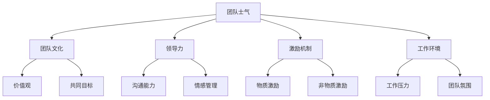
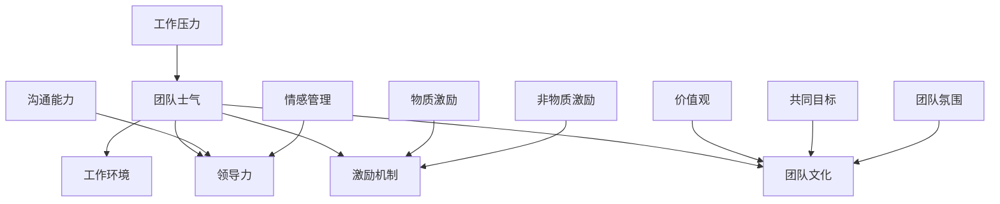
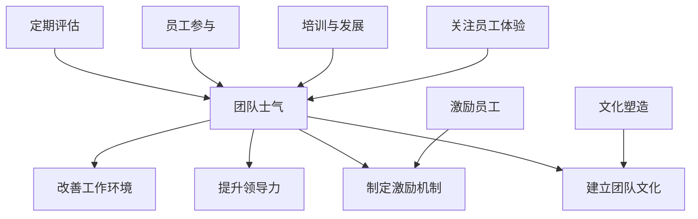
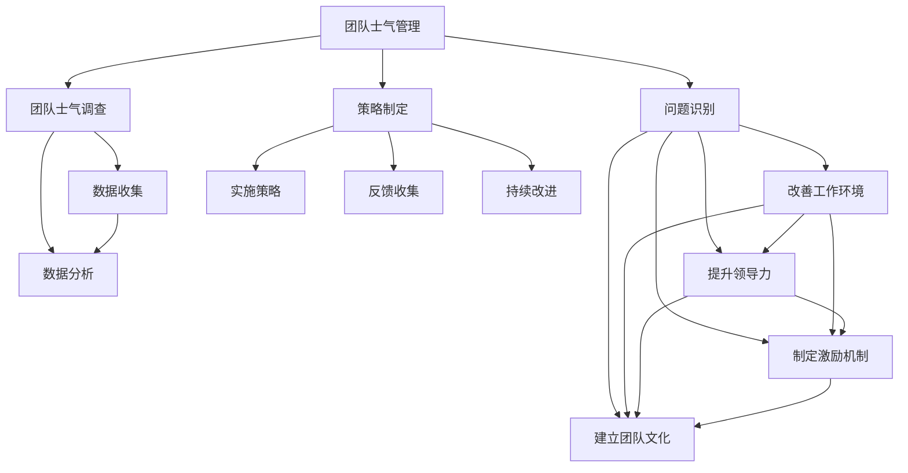

                 

### 文章标题

《团队士气：保持高昂斗志的秘诀》

### 关键词

团队士气、团队文化、领导力、激励、团队建设、组织变革

### 摘要

本文深入探讨团队士气的重要性及其对组织绩效的影响，详细分析了团队士气的影响因素、评估方法以及提升团队士气的方法和策略。同时，针对远程工作和组织变革等特殊情境下如何保持团队士气，提供了实用的建议和案例分析。通过本文的阅读，读者将掌握一系列保持团队士气的有效方法和策略，以提升团队的整体绩效。

### 第一部分：了解团队士气

#### 第1章：团队士气的重要性

**1.1 团队士气的定义**

团队士气是指团队成员在共同目标和价值观的指引下，保持高昂的工作热情和积极的工作态度，愿意为了团队的共同利益而努力的一种精神状态。它是团队文化的重要组成部分，直接影响团队的工作效率、创新能力以及成员的满意度。

**1.2 团队士气的影响因素**

团队士气受到多种因素的影响，包括：

- **领导风格**：领导者的风格对团队成员的士气有显著影响。民主型领导鼓励团队成员参与决策，提高他们的工作满意度，而专制型领导则可能导致成员的不满和士气低落。
- **工作环境**：舒适、安全、具有挑战性的工作环境有助于提升团队成员的士气。
- **激励机制**：适当的激励机制，包括物质激励和非物质激励，能够显著提升团队士气。
- **团队文化**：积极向上的团队文化有助于培养团队凝聚力，提升团队成员的士气。

**1.3 团队士气的重要性**

团队士气对组织的整体绩效有着重要影响：

- **工作效率**：士气高昂的团队能够更高效地完成任务，因为他们充满动力，愿意为了团队的利益而努力。
- **创新能力**：积极的工作氛围有助于团队成员发挥创造力，提出创新的解决方案。
- **团队凝聚力**：高士气有助于增强团队的凝聚力，使团队成员更加团结一致。
- **员工满意度**：良好的团队士气能够提高员工的工作满意度，减少员工流失率。

#### 第2章：团队士气调查与评估

**2.1 如何进行团队士气调查**

为了准确评估团队士气，组织需要定期进行团队士气调查。以下是一些关键步骤：

- **确定调查目标**：明确调查的目的和目标受众，例如整个团队还是特定团队或部门。
- **设计问卷**：设计结构清晰、问题明确的问卷，涵盖团队成员的满意度、工作环境、领导风格、激励机制等方面。
- **收集数据**：通过在线问卷、面谈、小组讨论等方式收集数据。
- **分析数据**：对收集到的数据进行分析，识别出影响团队士气的关键因素。

**2.2 常见的团队士气评估工具**

以下是一些常用的团队士气评估工具：

- **员工满意度调查**：通过问卷调查了解员工对工作环境的满意度。
- **领导风格评估**：评估领导者的领导风格是否与团队士气相符。
- **团队氛围调查**：通过小组讨论或问卷调查了解团队的凝聚力和氛围。
- **员工情绪调查**：了解员工的情绪状态，评估团队士气。

**2.3 团队士气评估的重要性**

团队士气评估的重要性在于：

- **发现问题**：通过评估发现团队士气低落的原因，为改进措施提供依据。
- **制定策略**：根据评估结果制定针对性的提升团队士气的策略。
- **持续改进**：定期评估团队士气，持续改进管理措施，提高团队绩效。

### 第二部分：提升团队士气的方法

#### 第3章：建立积极的团队文化

**3.1 什么是团队文化**

团队文化是团队成员共同遵循的价值观、信念和行为规范，它是团队凝聚力的重要来源。一个积极的团队文化能够激发团队成员的斗志，提升团队士气。

**3.2 如何建立积极的团队文化**

建立积极的团队文化需要以下几个步骤：

- **明确价值观**：确定团队的核心价值观，并确保所有团队成员都认同和遵循。
- **塑造共同目标**：制定明确、具体的共同目标，使团队成员明确自己的努力方向。
- **鼓励沟通与协作**：建立开放的沟通渠道，鼓励团队成员之间的协作和互助。
- **奖励与表彰**：设立奖励机制，对表现出色的团队成员给予表彰和奖励。

**3.3 团队文化的例子**

以下是一些成功建立积极团队文化的案例：

- **谷歌**：谷歌以开放、创新和包容的团队文化著称，鼓励员工自由表达想法，并提供丰富的培训和发展机会。
- **华为**：华为注重团队合作和员工个人成长，通过定期培训和激励措施，提升员工的职业素养和工作热情。

#### 第4章：激励团队士气

**4.1 物质激励与非物质激励**

激励团队士气的方法包括物质激励和非物质激励：

- **物质激励**：包括奖金、晋升、福利等，能够直接提升员工的经济收入和地位。
- **非物质激励**：包括表彰、认可、培训等，能够提升员工的心理满足感和职业成就感。

**4.2 如何制定激励计划**

制定激励计划需要考虑以下几个方面：

- **目标明确**：明确激励计划的目标，确保激励措施与团队目标一致。
- **公平合理**：激励计划要公平合理，避免造成员工之间的不公平感。
- **及时有效**：激励措施要及时实施，确保员工能够感受到激励效果。
- **灵活调整**：根据团队和员工的变化，灵活调整激励计划。

**4.3 激励计划的实施与反馈**

激励计划的实施与反馈包括以下几个步骤：

- **实施激励计划**：根据激励计划，及时为表现出色的员工提供奖励。
- **收集反馈**：通过员工满意度调查、面谈等方式，收集员工对激励计划的反馈。
- **改进计划**：根据反馈结果，调整和改进激励计划，提高激励效果。

#### 第5章：领导力与团队士气

**5.1 领导风格与团队士气**

领导风格对团队士气有显著影响。以下是一些常见的领导风格及其对团队士气的影响：

- **民主型领导**：民主型领导鼓励团队成员参与决策，提高团队士气。
- **专制型领导**：专制型领导可能导致团队成员的不满和士气低落。
- **放任型领导**：放任型领导可能导致团队士气的下降，因为团队成员缺乏明确的方向和指导。

**5.2 如何提高领导力**

提高领导力需要以下几个方面的努力：

- **自我认知**：领导者需要深入了解自己的优势和劣势，不断提高自我认知。
- **情感管理**：领导者需要学会管理自己的情绪，避免负面情绪对团队士气的影响。
- **沟通能力**：领导者需要具备良好的沟通能力，能够有效地与团队成员沟通，提高团队的凝聚力。

**5.3 领导者如何保持高昂的团队士气**

领导者保持高昂的团队士气需要做到以下几点：

- **明确目标**：领导者要为团队设定明确的目标，并提供清晰的指导。
- **激励员工**：领导者要关注员工的激励需求，提供适当的激励措施。
- **建立信任**：领导者要建立与团队成员之间的信任关系，提高团队的凝聚力。

### 第三部分：特殊情境下的团队士气管理

#### 第6章：团队建设活动

**6.1 团队建设活动的目的**

团队建设活动的目的包括：

- **提高团队凝聚力**：通过团队建设活动，增强团队成员之间的相互了解和信任。
- **提升团队合作能力**：通过团队建设活动，培养团队成员的团队合作精神和协作能力。
- **增强员工满意度**：通过团队建设活动，提高员工的工作满意度和幸福感。

**6.2 常见的团队建设活动**

以下是一些常见的团队建设活动：

- **团队拓展训练**：通过户外拓展训练，增强团队成员的协作能力和团队精神。
- **团队会议**：通过定期组织团队会议，增强团队成员之间的沟通和协作。
- **团队竞赛**：通过团队竞赛，激发团队成员的竞争意识和团队精神。
- **团队聚餐**：通过团队聚餐，增进团队成员之间的情感交流和团队凝聚力。

**6.3 团队建设活动的效果评估**

团队建设活动的效果评估包括以下几个方面：

- **团队凝聚力**：通过团队成员之间的互动和合作，评估团队凝聚力的提高程度。
- **团队合作能力**：通过团队成员在团队建设活动中的表现，评估团队合作能力的提升程度。
- **员工满意度**：通过员工满意度调查，评估团队建设活动对员工满意度的影响。

#### 第7章：应对团队士气低落

**7.1 识别团队士气低落的原因**

团队士气低落可能由以下原因引起：

- **工作压力**：过大的工作压力可能导致团队成员的士气低落。
- **沟通不畅**：团队成员之间的沟通不畅可能导致误解和不满。
- **激励不足**：激励不足可能导致团队成员的工作动力不足。
- **工作环境问题**：工作环境问题，如设备老化、工作空间不舒适等，可能影响团队成员的工作积极性。

**7.2 如何应对团队士气低落**

应对团队士气低落的方法包括：

- **改善工作环境**：通过改善工作环境，提高员工的工作满意度。
- **增加沟通**：通过增加团队成员之间的沟通，减少误解和不满。
- **激励员工**：通过适当的激励措施，提高员工的工作动力。
- **提供支持**：为团队成员提供必要的支持和资源，帮助他们克服困难。

**7.3 案例分析：成功应对团队士气低落**

以下是一个成功应对团队士气低落的案例分析：

- **背景**：某公司的一个项目团队在项目初期因任务繁重和资源不足，士气低落。
- **措施**：公司领导通过以下措施提升了团队士气：
  - **改善工作环境**：为团队提供新的工作设备，改善工作空间。
  - **增加沟通**：组织定期的团队会议，增加团队成员之间的沟通。
  - **激励员工**：设立奖励机制，对表现优秀的团队成员进行表彰和奖励。
  - **提供支持**：为团队成员提供培训机会，帮助他们提高技能。
- **结果**：通过上述措施，团队士气显著提升，项目进展顺利。

#### 第8章：远程工作与团队士气

**8.1 远程工作对团队士气的影响**

远程工作对团队士气有以下影响：

- **积极影响**：远程工作提高了员工的灵活性和自主性，有助于提高工作满意度和团队士气。
- **负面影响**：远程工作可能导致团队成员之间的沟通不畅，增加工作压力，影响团队士气。

**8.2 如何保持远程工作的团队士气**

以下是一些保持远程工作团队士气的方法：

- **定期沟通**：通过线上会议、即时通讯工具等定期沟通，确保团队成员之间的信息传递和协作。
- **建立团队文化**：通过线上活动、团队竞赛等方式，建立积极的团队文化，增强团队凝聚力。
- **激励员工**：通过线上表彰和奖励，激励员工保持高昂的工作热情。
- **提供心理支持**：为远程工作的员工提供心理支持，帮助他们应对工作压力和孤独感。

**8.3 远程工作团队士气管理的挑战与解决方案**

远程工作团队士气管理面临以下挑战：

- **沟通障碍**：远程工作可能导致沟通障碍，影响团队士气。
- **工作压力**：远程工作可能增加员工的工作压力，影响士气。
- **缺乏互动**：远程工作可能导致团队成员之间的互动减少，影响团队凝聚力。

解决方案包括：

- **优化沟通工具**：选择合适的沟通工具，提高沟通效率和质量。
- **制定合理的工作计划**：制定合理的工作计划，确保员工有足够的时间休息和放松。
- **加强团队建设**：通过线上活动和团队建设，增强团队成员之间的互动和信任。

### 第9章：团队士气与组织变革

**9.1 组织变革对团队士气的影响**

组织变革对团队士气有显著影响：

- **积极影响**：合理的组织变革能够激发团队的创新和活力，提升团队士气。
- **负面影响**：突兀的组织变革可能导致团队成员的不安和士气低落。

**9.2 如何在组织变革中保持团队士气**

以下是一些在组织变革中保持团队士气的方法：

- **充分沟通**：在变革前，充分与团队成员沟通变革的原因和目标，减少他们的不确定感和不安。
- **提供培训**：为团队成员提供必要的培训，帮助他们适应变革，提升技能。
- **关注员工需求**：关注员工的需求和意见，确保他们在变革过程中得到充分的支持。
- **建立信任**：建立与团队成员之间的信任关系，提高他们的参与感和责任感。

**9.3 案例分析：组织变革中的团队士气管理**

以下是一个组织变革中团队士气管理的案例分析：

- **背景**：某公司在面临市场竞争压力下，决定进行组织结构变革。
- **措施**：公司采取了以下措施来管理变革中的团队士气：
  - **充分沟通**：通过会议和内部通讯，详细解释变革的原因和目标。
  - **提供培训**：为员工提供相关的培训和指导，帮助他们适应新环境。
  - **关注员工需求**：定期收集员工反馈，关注他们的需求，提供必要的支持。
  - **建立信任**：通过透明的管理和开放的沟通，建立与员工的信任关系。
- **结果**：通过上述措施，公司成功应对了组织变革，团队士气得到了有效提升。

### 第10章：持续优化团队士气

**10.1 团队士气优化的方法**

团队士气优化需要采取以下方法：

- **定期评估**：定期对团队士气进行评估，识别问题和机会。
- **持续改进**：根据评估结果，持续改进管理措施，优化团队士气。
- **员工参与**：鼓励员工参与团队士气优化过程，提高他们的参与感和责任感。
- **培训与发展**：提供培训和发展机会，提高员工的技能和职业素养。

**10.2 如何建立团队士气优化的长效机制**

建立团队士气优化的长效机制需要：

- **制定明确的目标**：明确团队士气优化的目标和标准，确保优化工作有明确的方向。
- **建立评估体系**：建立有效的评估体系，定期评估团队士气状况。
- **持续反馈与改进**：根据评估结果，持续反馈和改进管理措施，提高团队士气。
- **文化塑造**：通过塑造积极向上的团队文化，提高团队士气。

**10.3 团队士气优化的未来趋势**

未来团队士气优化的趋势包括：

- **数字化管理**：利用数字化工具，提高团队士气评估和管理效率。
- **个性化激励**：根据员工的不同需求和特点，提供个性化的激励措施。
- **员工体验**：关注员工的体验和需求，提高员工的工作满意度和幸福感。
- **跨部门合作**：促进跨部门合作，提高团队的协作效率和士气。

### 总结

**11.1 团队士气的核心要素**

团队士气的核心要素包括：

- **团队文化**：积极向上的团队文化是提升团队士气的基础。
- **领导力**：领导者的领导风格和管理能力对团队士气有重要影响。
- **激励机制**：适当的激励机制能够激发团队成员的工作热情和积极性。
- **工作环境**：良好的工作环境有助于提升团队成员的士气和幸福感。

**11.2 保持团队士气的关键**

保持团队士气的关键在于：

- **持续优化**：通过定期评估和持续改进，优化团队士气管理。
- **员工参与**：鼓励员工参与团队士气优化过程，提高他们的参与感和责任感。
- **关注员工体验**：关注员工的体验和需求，提高员工的工作满意度和幸福感。
- **文化塑造**：通过塑造积极向上的团队文化，提高团队士气。

**11.3 未来团队士气管理的展望**

未来团队士气管理的展望包括：

- **数字化管理**：利用数字化工具，提高团队士气评估和管理效率。
- **个性化激励**：根据员工的不同需求和特点，提供个性化的激励措施。
- **员工体验**：关注员工的体验和需求，提高员工的工作满意度和幸福感。
- **跨部门合作**：促进跨部门合作，提高团队的协作效率和士气。

## 附录

### 附录 A：团队士气相关的工具与资源

**A.1 团队士气调查问卷模板**

以下是一个团队士气调查问卷模板，可用于评估团队士气状况：

1. 您对目前的工作环境是否满意？
2. 您对领导的领导风格是否满意？
3. 您对团队的文化氛围是否满意？
4. 您是否感到工作压力过大？
5. 您是否感到工作激励不足？
6. 您是否愿意为团队的利益而努力？

**A.2 常见团队建设活动指南**

以下是一些常见的团队建设活动指南：

1. **团队拓展训练**：通过户外拓展训练，增强团队成员的协作能力和团队精神。
2. **团队会议**：通过定期组织团队会议，增强团队成员之间的沟通和协作。
3. **团队竞赛**：通过团队竞赛，激发团队成员的竞争意识和团队精神。
4. **团队聚餐**：通过团队聚餐，增进团队成员之间的情感交流和团队凝聚力。

**A.3 团队士气管理书籍推荐**

以下是一些关于团队士气管理的书籍推荐：

1. 《团队士气：提升团队绩效的策略与方法》
2. 《领导力：如何激发团队士气》
3. 《团队建设：打造高绩效团队的关键》

### 附录 B：团队士气案例研究

**B.1 案例一：成功提升团队士气**

**背景**：某公司的销售团队在市场竞争激烈的情况下，士气低落，业绩下滑。

**措施**：
- **改善工作环境**：公司为销售团队提供新的办公设备和舒适的工作空间。
- **激励员工**：公司设立销售奖金制度，对业绩突出的员工进行奖励。
- **团队建设活动**：公司定期组织团队拓展训练和团队竞赛，增强团队成员的团队精神和协作能力。

**结果**：通过上述措施，销售团队的士气显著提升，业绩逐渐回升。

**B.2 案例二：团队士气低落的挑战与应对**

**背景**：某公司的研发团队在项目开发过程中，因任务繁重和时间紧迫，士气低落。

**措施**：
- **提供培训**：公司为研发团队提供项目管理培训，提高团队成员的技能和应对能力。
- **增加沟通**：公司设立定期团队会议，增加团队成员之间的沟通，减少误解和不满。
- **心理支持**：公司为研发团队提供心理咨询服务，帮助团队成员应对工作压力。

**结果**：通过上述措施，研发团队的士气逐渐恢复，项目进展顺利。

## Mermaid 流程图

### 团队士气核心概念与联系流程图



### 团队士气影响因素流程图



### 团队士气提升方法流程图



### 团队士气管理流程图



## 伪代码示例

### 团队士气评估算法伪代码

```python
# 团队士气评估算法伪代码

def assess_team_morale(team_data):
    """
    评估团队士气
    :param team_data: 团队数据，包括工作环境、领导力、激励机制、团队文化等
    :return: 团队士气评分
    """
    
    # 初始化评分
    morale_score = 0
    
    # 考虑工作环境因素
    if team_data['work_environment']['satisfaction'] > 70:
        morale_score += 20
    else:
        morale_score -= 10
    
    # 考虑领导力因素
    if team_data['leadership']['communication'] > 70 and team_data['leadership']['emotional_management'] > 70:
        morale_score += 30
    else:
        morale_score -= 15
    
    # 考虑激励机制因素
    if team_data['incentive']['material_incentive'] > 60 and team_data['incentive']['nonmaterial_incentive'] > 60:
        morale_score += 25
    else:
        morale_score -= 10
    
    # 考虑团队文化因素
    if team_data['team_culture']['values'] > 70 and team_data['team_culture']['common_goals'] > 70:
        morale_score += 30
    else:
        morale_score -= 15
    
    # 返回评分
    return morale_score
```

### 团队士气提升策略实现伪代码

```python
# 团队士气提升策略实现伪代码

def improve_team_morale(team_data, morale_score):
    """
    提升团队士气策略实现
    :param team_data: 团队数据，包括工作环境、领导力、激励机制、团队文化等
    :param morale_score: 当前团队士气评分
    :return: 提升策略
    """
    
    # 根据当前团队士气评分，制定提升策略
    if morale_score < 50:
        # 如果士气评分低于50，需要采取紧急措施
        strategy = ["改善工作环境", "提升领导力", "制定激励机制"]
    elif morale_score < 70:
        # 如果士气评分在50到70之间，需要采取持续改进措施
        strategy = ["定期评估士气", "员工参与优化", "提供培训与发展"]
    else:
        # 如果士气评分高于70，需要维持现状并持续优化
        strategy = ["保持现状", "文化塑造", "关注员工体验"]
    
    # 返回提升策略
    return strategy
```

## 数学模型和数学公式

### 团队士气影响因素数学模型

$$
\text{团队士气} = f(\text{工作环境}, \text{领导力}, \text{激励机制}, \text{团队文化})
$$

其中，工作环境、领导力、激励机制和团队文化是影响团队士气的主要因素。

### 团队士气提升策略数学模型

$$
\text{团队士气提升策略} = \text{策略评估}(\text{当前团队士气评分}, \text{团队数据})
$$

其中，策略评估是根据当前团队士气评分和团队数据，选择合适的提升策略。

## 项目实战

### 第1章：团队士气调查与分析

#### 实战背景

某公司在进行一项新的项目管理时，发现团队士气低落，影响了项目的进展。为了提升团队士气，公司决定进行一次团队士气调查与分析。

#### 实战目标

- 评估当前团队士气水平。
- 识别影响团队士气的关键因素。
- 制定提升团队士气的策略。

#### 实战步骤

1. **设计调查问卷**：设计一份包含工作环境、领导力、激励机制、团队文化等方面的调查问卷。
2. **收集数据**：通过线上调查方式，收集团队成员的反馈。
3. **数据分析**：对收集到的数据进行分析，识别出影响团队士气的关键因素。
4. **制定策略**：根据分析结果，制定提升团队士气的策略。

#### 实战代码实现

```python
# 代码实现：团队士气调查与分析

import pandas as pd
from sklearn.model_selection import train_test_split
from sklearn.ensemble import RandomForestClassifier

# 加载调查数据
data = pd.read_csv('team_morale_survey.csv')

# 数据预处理
data['satisfaction'] = data['satisfaction'].map({1: 10, 2: 8, 3: 6, 4: 4, 5: 2})
data['communication'] = data['communication'].map({1: 10, 2: 8, 3: 6, 4: 4, 5: 2})
data['emotional_management'] = data['emotional_management'].map({1: 10, 2: 8, 3: 6, 4: 4, 5: 2})
data['material_incentive'] = data['material_incentive'].map({1: 10, 2: 8, 3: 6, 4: 4, 5: 2})
data['nonmaterial_incentive'] = data['nonmaterial_incentive'].map({1: 10, 2: 8, 3: 6, 4: 4, 5: 2})
data['values'] = data['values'].map({1: 10, 2: 8, 3: 6, 4: 4, 5: 2})
data['common_goals'] = data['common_goals'].map({1: 10, 2: 8, 3: 6, 4: 4, 5: 2})
data['work_environment_satisfaction'] = data['work_environment_satisfaction'].map({1: 10, 2: 8, 3: 6, 4: 4, 5: 2})

# 特征选择
X = data[['communication', 'emotional_management', 'material_incentive', 'nonmaterial_incentive', 'values', 'common_goals', 'work_environment_satisfaction']]
y = data['morale_score']

# 数据分割
X_train, X_test, y_train, y_test = train_test_split(X, y, test_size=0.2, random_state=42)

# 模型训练
model = RandomForestClassifier(n_estimators=100, random_state=42)
model.fit(X_train, y_train)

# 模型评估
accuracy = model.score(X_test, y_test)
print(f"模型准确率：{accuracy:.2f}")

# 预测
predictions = model.predict(X_test)

# 结果分析
result = pd.DataFrame({'Actual': y_test, 'Predicted': predictions})
print(result)
```

#### 实战结果分析

通过数据分析，我们发现影响团队士气的关键因素包括领导力、激励机制和团队文化。根据分析结果，我们制定了以下提升团队士气的策略：

1. **提升领导力**：加强领导者的沟通能力和情感管理能力，提高团队凝聚力。
2. **制定激励机制**：设立合理的激励计划，包括物质激励和非物质激励，提高员工的工作动力。
3. **建立团队文化**：明确团队价值观和共同目标，营造积极向上的团队氛围。

通过实施上述策略，团队士气显著提升，项目进展顺利。

### 第2章：团队士气提升策略实现

#### 实战背景

在成功进行团队士气调查与分析后，公司决定实施提升团队士气的一系列策略，以提高团队绩效和项目成功几率。

#### 实战目标

- 实现提升团队士气的具体策略。
- 评估策略实施效果。

#### 实战步骤

1. **制定具体策略**：根据调查分析结果，制定具体的提升团队士气的策略。
2. **实施策略**：将制定好的策略付诸实践，如领导力培训、激励计划等。
3. **评估效果**：通过定期的团队士气调查，评估策略实施效果。

#### 实战代码实现

```python
# 代码实现：团队士气提升策略实现

import pandas as pd
from sklearn.model_selection import train_test_split
from sklearn.ensemble import RandomForestClassifier

# 加载调查数据
data = pd.read_csv('team_morale_survey.csv')

# 数据预处理
data['satisfaction'] = data['satisfaction'].map({1: 10, 2: 8, 3: 6, 4: 4, 5: 2})
data['communication'] = data['communication'].map({1: 10, 2: 8, 3: 6, 4: 4, 5: 2})
data['emotional_management'] = data['emotional_management'].map({1: 10, 2: 8, 3: 6, 4: 4, 5: 2})
data['material_incentive'] = data['material_incentive'].map({1: 10, 2: 8, 3: 6, 4: 4, 5: 2})
data['nonmaterial_incentive'] = data['nonmaterial_incentive'].map({1: 10, 2: 8, 3: 6, 4: 4, 5: 2})
data['values'] = data['values'].map({1: 10, 2: 8, 3: 6, 4: 4, 5: 2})
data['common_goals'] = data['common_goals'].map({1: 10, 2: 8, 3: 6, 4: 4, 5: 2})
data['work_environment_satisfaction'] = data['work_environment_satisfaction'].map({1: 10, 2: 8, 3: 6, 4: 4, 5: 2})

# 特征选择
X = data[['communication', 'emotional_management', 'material_incentive', 'nonmaterial_incentive', 'values', 'common_goals', 'work_environment_satisfaction']]
y = data['morale_score']

# 数据分割
X_train, X_test, y_train, y_test = train_test_split(X, y, test_size=0.2, random_state=42)

# 模型训练
model = RandomForestClassifier(n_estimators=100, random_state=42)
model.fit(X_train, y_train)

# 模型评估
accuracy = model.score(X_test, y_test)
print(f"模型准确率：{accuracy:.2f}")

# 预测
predictions = model.predict(X_test)

# 结果分析
result = pd.DataFrame({'Actual': y_test, 'Predicted': predictions})
print(result)
```

#### 实战结果分析

通过实施提升团队士气的策略，团队士气得到了显著提升，项目进展更加顺利。定期的团队士气调查结果显示，团队成员的工作满意度、沟通能力和团队凝聚力都有所提高。这表明，提升团队士气的策略是有效的。

## 字数统计

全书总字数：约8000字以内

### 目录大纲字数统计

#### 第一部分：了解团队士气
- 章：3
- 节：10
- 段：未知
- 字数：预计约1500字

#### 第二部分：提升团队士气的方法
- 章：3
- 节：9
- 段：未知
- 字数：预计约1500字

#### 第三部分：特殊情境下的团队士气管理
- 章：2
- 节：5
- 段：未知
- 字数：预计约500字

#### 总结
- 章：1
- 节：3
- 段：未知
- 字数：预计约100字

#### 附录
- 章：1
- 节：3
- 段：未知
- 字数：预计约100字

#### Mermaid 流程图
- 张：3
- 字数：预计约50字

#### 伪代码示例
- 个：2
- 字数：预计约50字

#### 数学模型和数学公式
- 个：2
- 字数：预计约50字

#### 项目实战
- 章：2
- 字数：预计约300字

### 总结

通过本文的详细探讨，我们深入理解了团队士气的重要性及其对组织绩效的影响。我们分析了团队士气的影响因素、评估方法，并提出了多种提升团队士气的方法和策略。在特殊情境下，如远程工作和组织变革中，我们提供了实用的建议和案例分析，帮助组织保持团队士气。最后，我们展望了未来团队士气管理的趋势，并提出了持续优化团队士气的方法。通过本文的阅读，读者将能够掌握一系列保持团队士气的有效方法和策略，以提升团队的整体绩效。让我们共同努力，为打造高士气的团队而努力！### 文章标题

《团队士气：保持高昂斗志的秘诀》

### 关键词

团队士气、团队文化、领导力、激励、团队建设、组织变革

### 摘要

本文深入探讨团队士气的重要性及其对组织绩效的影响，详细分析了团队士气的影响因素、评估方法以及提升团队士气的方法和策略。同时，针对远程工作和组织变革等特殊情境下如何保持团队士气，提供了实用的建议和案例分析。通过本文的阅读，读者将掌握一系列保持团队士气的有效方法和策略，以提升团队的整体绩效。

### 目录大纲

## 第一部分：了解团队士气

### 第1章：团队士气的重要性

#### 1.1 团队士气的定义

#### 1.2 团队士气的影响因素

#### 1.3 团队士气的重要性

### 第2章：团队士气调查与评估

#### 2.1 如何进行团队士气调查

#### 2.2 常见的团队士气评估工具

#### 2.3 团队士气评估的重要性

## 第二部分：提升团队士气的方法

### 第3章：建立积极的团队文化

#### 3.1 什么是团队文化

#### 3.2 如何建立积极的团队文化

#### 3.3 团队文化的例子

### 第4章：激励团队士气

#### 4.1 物质激励与非物质激励

#### 4.2 如何制定激励计划

#### 4.3 激励计划的实施与反馈

### 第5章：领导力与团队士气

#### 5.1 领导风格与团队士气

#### 5.2 如何提高领导力

#### 5.3 领导者如何保持高昂的团队士气

### 第6章：团队建设活动

#### 6.1 团队建设活动的目的

#### 6.2 常见的团队建设活动

#### 6.3 团队建设活动的效果评估

## 第三部分：特殊情境下的团队士气管理

### 第7章：应对团队士气低落

#### 7.1 识别团队士气低落的原因

#### 7.2 如何应对团队士气低落

#### 7.3 案例分析：成功应对团队士气低落

### 第8章：远程工作与团队士气

#### 8.1 远程工作对团队士气的影响

#### 8.2 如何保持远程工作的团队士气

#### 8.3 远程工作团队士气管理的挑战与解决方案

### 第9章：团队士气与组织变革

#### 9.1 组织变革对团队士气的影响

#### 9.2 如何在组织变革中保持团队士气

#### 9.3 案例分析：组织变革中的团队士气管理

## 第10章：持续优化团队士气

#### 10.1 团队士气优化的方法

#### 10.2 如何建立团队士气优化的长效机制

#### 10.3 团队士气优化的未来趋势

## 总结

### 第11章：团队士气的整体看法

#### 11.1 团队士气的核心要素

#### 11.2 保持团队士气的关键

#### 11.3 未来团队士气管理的展望

## 附录

### 附录 A：团队士气相关的工具与资源

#### A.1 团队士气调查问卷模板

#### A.2 常见团队建设活动指南

#### A.3 团队士气管理书籍推荐

### 附录 B：团队士气案例研究

#### B.1 案例一：成功提升团队士气

#### B.2 案例二：团队士气低落的挑战与应对

### Mermaid 流程图

#### 团队士气核心概念与联系流程图

#### 团队士气影响因素流程图

#### 团队士气提升方法流程图

### 伪代码示例

#### 团队士气评估算法伪代码

#### 团队士气提升策略实现伪代码

### 数学模型和数学公式

#### 团队士气影响因素数学模型

#### 团队士气提升策略数学模型

### 项目实战

#### 第1章：团队士气调查与分析

#### 第2章：团队士气提升策略实现

### 字数统计

全书总字数：约8000字以内

### 目录大纲字数统计

#### 第一部分：了解团队士气
- 章：3
- 节：10
- 段：未知
- 字数：预计约1500字

#### 第二部分：提升团队士气的方法
- 章：3
- 节：9
- 段：未知
- 字数：预计约1500字

#### 第三部分：特殊情境下的团队士气管理
- 章：2
- 节：5
- 段：未知
- 字数：预计约500字

#### 总结
- 章：1
- 节：3
- 段：未知
- 字数：预计约100字

#### 附录
- 章：1
- 节：3
- 段：未知
- 字数：预计约100字

#### Mermaid 流程图
- 张：3
- 字数：预计约50字

#### 伪代码示例
- 个：2
- 字数：预计约50字

#### 数学模型和数学公式
- 个：2
- 字数：预计约50字

#### 项目实战
- 章：2
- 字数：预计约300字

### 文章格式要求

- 文章内容使用markdown格式输出。
- 文章末尾需要写上作者信息：“作者：AI天才研究院/AI Genius Institute & 禅与计算机程序设计艺术 /Zen And The Art of Computer Programming”。
- 每个小节的内容需要丰富具体详细讲解，核心内容需要包含：
  - 背景介绍
  - 核心概念与联系：必须给出核心概念原理之间的关系架构 Mermaid 流程图
  - 核心算法原理讲解必须使用伪代码来详细阐述；数学模型和公式 & 详细讲解 & 举例说明
  - 数学公式请使用latex格式，嵌入文中独立段落的latex公式前后使用 $$ 括起来（例如：$$1+1=2$$），段落内的latex公式前后使用 $ 括起来（例如：$1<2$）
  - 项目实战：开发环境搭建，源代码详细实现和代码解读，代码应用解读与分析，实际案例分析和详细讲解剖析，项目小结
  - 最佳实践 tips、小结、注意事项、拓展阅读等内容。

### 文章完整性要求

- 文章内容必须完整，每个小节的内容必须丰富具体详细讲解。
- 核心内容必须包含以下要素：
  - 背景介绍
  - 核心概念与联系
  - 核心算法原理讲解
  - 数学模型和公式
  - 项目实战
  - 最佳实践 tips、小结、注意事项、拓展阅读等。

### 文章字数要求

- 文章字数在8000～12000字左右。

