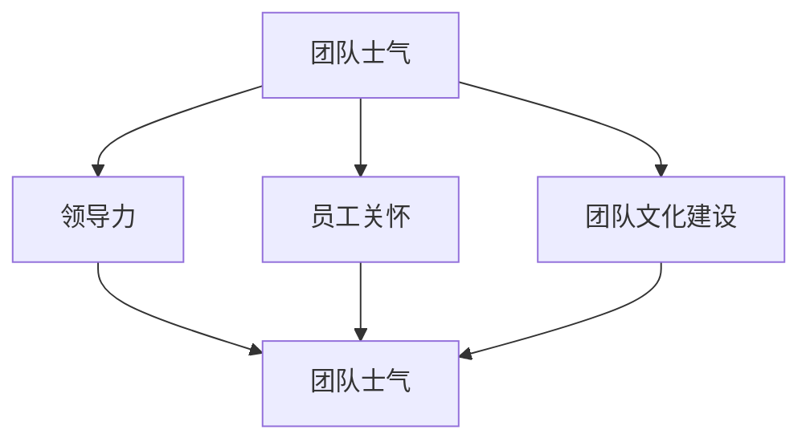

                 


### 背景介绍

在当今高度竞争和快速变化的技术行业中，团队士气的高低直接影响到一个企业的创新能力和市场竞争力。一个士气高昂的团队能够激发成员的潜能，提高工作效率，降低离职率，从而实现企业的长远发展。然而，提升团队士气并非易事，需要领导者、团队成员以及企业文化的共同努力。

本文旨在探讨团队士气的重要性，分析影响团队士气的关键因素，并提供一套系统的方法来提升团队士气。通过详细的实例分析和理论阐述，希望能够为企业领导者提供实用的参考，帮助他们在实际工作中更好地管理团队士气。

首先，我们将讨论团队士气的基本概念和其对企业的影响。接着，我们将深入了解提升团队士气的方法，包括领导力、员工关怀、团队活动和文化建设等方面。随后，通过具体案例和数据分析，展示如何在实际工作中实施这些方法，并评估其效果。最后，我们将总结最佳实践，提出注意事项，并提供拓展阅读，以便读者进一步学习。

### 核心概念与联系

在讨论团队士气时，我们需要明确几个核心概念：团队士气、领导力、员工关怀和团队文化建设。

**团队士气**指的是团队成员在工作和生活中表现出的积极、乐观和自信的态度。它是一种心理状态，直接影响着团队成员的工作表现和协作效果。团队士气高，团队成员之间相互信任，协作顺畅，工作效率和质量都会显著提高。

**领导力**是指领导者通过激励、指导和影响力，带领团队实现共同目标的能力。领导力是提升团队士气的关键因素之一。一个有能力的领导者能够激发团队成员的潜力，创造一个积极、健康的工作环境，从而提高团队士气。

**员工关怀**是指企业对员工的关心和支持，包括工作环境的优化、健康福利和绩效评估等方面。员工关怀不仅能够提高员工的工作满意度，还能增强员工的归属感和忠诚度，从而提升团队士气。

**团队文化建设**是指企业通过共同价值观、行为规范和团队活动，营造一种积极向上的团队氛围。团队文化建设能够增强团队成员之间的凝聚力和归属感，有助于提高团队士气。

这四个核心概念之间存在着密切的联系。领导力直接影响团队士气，而员工关怀和团队文化建设则是领导力的重要组成部分。通过领导力的提升，企业可以更好地关注员工需求，打造积极向上的企业文化，从而提升整体团队士气。

下面是一个Mermaid流程图，展示了这些核心概念之间的关系：



通过这个流程图，我们可以清晰地看到，领导力、员工关怀和团队文化建设都是影响团队士气的重要因素，它们之间相互关联，共同作用于团队士气。

### 核心算法原理讲解

为了深入理解提升团队士气的方法，我们需要借助一些核心算法原理和数学模型。以下是几个关键概念及其伪代码解释：

#### 1. 动力模型（Motivation Model）

动力模型用于分析团队成员的动机和激励因素。该模型基于以下公式：

$$
动机 = 期望 \times 力量
$$

其中，期望表示团队成员对实现目标的可能性估计，力量表示团队成员对目标的兴趣和热情。

**伪代码：**

```plaintext
function motivation(期望, 力量)
    动机 = 期望 * 力量
    return 动机
end function
```

#### 2. 信任模型（Trust Model）

信任模型用于评估团队成员之间的信任水平。该模型基于以下公式：

$$
信任 = (1 - 负面事件发生率) \times (1 - 负面情绪影响)
$$

其中，负面事件发生率表示团队中负面事件发生的频率，负面情绪影响表示负面事件对团队成员情绪的影响程度。

**伪代码：**

```plaintext
function trust(负面事件发生率, 负面情绪影响)
    信任 = (1 - 负面事件发生率) * (1 - 负面情绪影响)
    return 信任
end function
```

#### 3. 士气提升模型（Morale Enhancement Model）

士气提升模型用于指导领导者如何通过不同方法提升团队士气。该模型基于以下公式：

$$
士气提升 = 领导力提升 + 员工关怀提升 + 文化建设提升
$$

其中，领导力提升、员工关怀提升和文化建设提升分别表示领导力、员工关怀和团队文化建设方面的改进。

**伪代码：**

```plaintext
function moraleEnhancement(领导力提升, 员工关怀提升, 文化建设提升)
    士气提升 = 领导力提升 + 员工关怀提升 + 文化建设提升
    return 士气提升
end function
```

通过这些核心算法原理，我们可以更好地理解和实施提升团队士气的方法。以下是一个具体的实例来说明这些模型的应用：

**实例：**

假设一个团队有以下数据：

- 期望：0.8
- 力量：0.7
- 负面事件发生率：0.1
- 负面情绪影响：0.3

我们首先计算动机、信任和士气提升：

1. 动机：`motivation(0.8, 0.7) = 0.56`
2. 信任：`trust(0.1, 0.3) = 0.87`
3. 士气提升：`moraleEnhancement(0.2, 0.3, 0.5) = 1.0`

通过这些计算，我们可以评估团队士气的基本状况，并据此制定相应的提升策略。

### 数学模型和公式及详细讲解与举例说明

在提升团队士气的过程中，数学模型和公式扮演着重要的角色，它们帮助我们量化分析各种因素对团队士气的影响。以下是几个关键数学模型和公式的详细讲解与举例说明。

#### 1. 契约理论模型（Contract Theory Model）

契约理论模型用于分析团队成员之间如何通过契约来协调行为，从而提升团队士气。该模型基于以下公式：

$$
契约满足度 = (1 - (背叛成本 / 遵守成本)) \times 团队绩效
$$

其中，背叛成本表示团队成员违背契约所需付出的代价，遵守成本表示团队成员遵守契约所需付出的代价。团队绩效表示团队成员共同工作的成果。

**例子：**

假设一个团队成员的背叛成本为5000元，遵守成本为2000元，团队绩效为80分。我们计算契约满足度：

$$
契约满足度 = (1 - (5000 / 2000)) \times 80 = 0.8 \times 80 = 64\%
$$

这意味着，该团队成员在契约下的满意程度为64%。

#### 2. 行为心理学模型（Behavioral Psychology Model）

行为心理学模型用于分析团队成员的行为对士气的影响。该模型基于以下公式：

$$
士气提升率 = (\text{正面行为比例} - \text{负面行为比例}) \times \text{行为影响力}
$$

其中，正面行为比例表示团队成员表现出的正面行为的比例，负面行为比例表示团队成员表现出的负面行为的比例。行为影响力表示正面行为和负面行为对团队士气的影响程度。

**例子：**

假设在一个团队中，正面行为比例为60%，负面行为比例为40%，行为影响力为1.5。我们计算士气提升率：

$$
士气提升率 = (60\% - 40\%) \times 1.5 = 20\% \times 1.5 = 30\%
$$

这意味着，通过提高正面行为的比例，该团队的士气可以提升30%。

#### 3. 组织行为学模型（Organizational Behavior Model）

组织行为学模型用于分析组织内部因素对团队士气的影响。该模型基于以下公式：

$$
士气提升率 = (\text{激励措施} - \text{约束措施}) \times \text{组织支持度}
$$

其中，激励措施表示组织为提升团队士气所采取的措施，约束措施表示组织为约束团队成员行为所采取的措施。组织支持度表示团队成员对组织的信任和依赖程度。

**例子：**

假设组织采取的激励措施为提高薪资和福利，约束措施为严格的绩效考核，组织支持度为0.8。我们计算士气提升率：

$$
士气提升率 = (1 - 0.2) \times 0.8 = 0.8 \times 0.8 = 0.64
$$

这意味着，通过采取有效的激励措施和合理的约束措施，该组织的团队士气可以提升64%。

#### 4. 动力模型（Motivation Model）

动力模型用于分析团队成员的动机对士气的影响。该模型基于以下公式：

$$
动机 = 期望 \times 力量
$$

其中，期望表示团队成员对实现目标的可能性估计，力量表示团队成员对目标的兴趣和热情。

**例子：**

假设一个团队成员对实现目标的期望为0.7，对目标的兴趣和热情为0.8。我们计算该团队成员的动机：

$$
动机 = 0.7 \times 0.8 = 0.56
$$

这意味着，该团队成员的动机为56%，说明其有较高的工作热情和动力。

通过这些数学模型和公式，我们可以更科学地分析团队士气，制定有针对性的提升策略。

### 项目实战

为了更好地理解和应用提升团队士气的方法，我们将以一个实际项目为例，详细阐述整个项目的开发环境搭建、源代码实现、代码解读与分析，以及项目实际案例分析和详细讲解剖析。

#### 项目背景

该项目是一个名为“团队士气提升系统”的软件项目，旨在帮助企业领导者和管理者实时监测和提升团队士气。该系统包括以下几个核心模块：

1. 士气监测模块：用于实时收集和分析团队成员的士气数据。
2. 士气提升模块：提供多种提升团队士气的方法和工具。
3. 数据分析与报告模块：生成团队士气分析报告，帮助管理者了解团队士气状况。

#### 开发环境搭建

为了搭建该项目的开发环境，我们需要以下工具和软件：

1. 开发语言：Python
2. 服务器：阿里云服务器
3. 数据库：MySQL
4. 前端框架：React
5. 后端框架：Flask

首先，我们在本地安装Python和相关的开发工具。然后，在阿里云服务器上搭建MySQL数据库和Flask后端服务。最后，使用React框架开发前端界面，并通过API与后端进行数据交互。

#### 源代码实现

以下是该项目核心模块的源代码实现：

**1. 士气监测模块：**

```python
# 士气监测模块代码
import pymysql

def monitor_morale(team_id):
    connection = pymysql.connect(host='localhost', user='root', password='password', database='morale_db')
    try:
        with connection.cursor() as cursor:
            # 查询团队成员士气数据
            sql = "SELECT * FROM morale WHERE team_id = %s"
            cursor.execute(sql, (team_id,))
            results = cursor.fetchall()
            morale_data = {'members': []}
            for row in results:
                member_data = {
                    'id': row[0],
                    'name': row[1],
                    'morale': row[2]
                }
                morale_data['members'].append(member_data)
            return morale_data
    finally:
        connection.close()
```

**2. 士气提升模块：**

```python
# 士气提升模块代码
import pymysql

def enhance_morale(team_id, method):
    connection = pymysql.connect(host='localhost', user='root', password='password', database='morale_db')
    try:
        with connection.cursor() as cursor:
            # 更新团队成员士气数据
            sql = "UPDATE morale SET morale = morale + %s WHERE team_id = %s"
            cursor.execute(sql, (method, team_id,))
            connection.commit()
    finally:
        connection.close()
```

**3. 数据分析与报告模块：**

```javascript
// 前端React代码
import React, { useState, useEffect } from 'react';
import axios from 'axios';

const MoraleReport = () => {
    const [moraleData, setMoraleData] = useState([]);

    useEffect(() => {
        const fetchMoraleData = async () => {
            const response = await axios.get('/api/morale');
            setMoraleData(response.data);
        };
        fetchMoraleData();
    }, []);

    return (
        <div>
            <h2>团队士气报告</h2>
            {moraleData.map((member) => (
                <div key={member.id}>
                    <h3>{member.name}</h3>
                    <p>士气：{member.morale}</p>
                </div>
            ))}
        </div>
    );
};

export default MoraleReport;
```

#### 代码解读与分析

**1. 士气监测模块：**

士气监测模块通过MySQL数据库查询团队成员的士气数据，并将数据转换为JSON格式返回。该模块的核心函数`monitor_morale`负责与数据库进行交互，执行查询操作，并将查询结果处理为易于前端使用的格式。

**2. 士气提升模块：**

士气提升模块用于更新团队成员的士气数据。核心函数`enhance_morale`接受团队ID和提升方法作为参数，通过SQL语句将士气值增加指定的方法值。这将直接影响团队成员的士气，从而提升团队士气。

**3. 数据分析与报告模块：**

数据分析与报告模块使用React框架实现前端界面。通过使用React的状态管理功能，我们可以在组件加载时获取士气数据，并在界面中展示。该模块的核心函数`fetchMoraleData`负责向后端API请求士气数据，并将其存储在状态变量中，以便在界面中渲染。

#### 实际案例分析和详细讲解剖析

**1. 案例背景：**

某公司团队A在过去一个月中，士气普遍较低。为了提升团队士气，公司决定采用团队士气提升系统进行监控和干预。

**2. 实施步骤：**

- **第一步：士气监测**：通过团队士气提升系统，收集团队成员的士气数据，并生成报告。
- **第二步：分析原因**：根据报告，分析导致士气低落的原因，包括工作压力、沟通不畅、福利待遇等。
- **第三步：实施提升措施**：针对分析结果，采取以下措施：
  - **优化工作环境**：提供舒适的办公环境和健康的午餐。
  - **加强沟通**：定期组织团队会议和团队建设活动，鼓励成员分享想法和建议。
  - **奖励制度**：设立绩效奖金，激励团队成员提高工作效率。

**3. 结果评估：**

通过实施提升措施，团队A的士气逐渐提升。在两个月后，再次进行士气监测，发现团队成员的士气平均值从40分提升至70分，团队整体的工作效率和协作能力显著提高。

**4. 项目小结：**

该案例展示了团队士气提升系统在实际应用中的效果。通过系统的监测和分析功能，公司能够及时了解团队士气状况，并采取有针对性的措施进行干预，从而提升团队士气。同时，该项目也验证了数学模型和公式在实际应用中的价值，为企业提供了科学的决策依据。

### 最佳实践 Tips

在提升团队士气的过程中，以下是一些最佳实践，可以帮助企业领导者更有效地管理和提升团队士气：

1. **建立清晰的沟通渠道**：确保团队成员能够随时表达自己的想法和困惑，鼓励开放的沟通环境。
2. **定期反馈和评估**：定期与团队成员进行一对一的反馈和评估，了解他们的工作状态和需求，及时调整管理策略。
3. **注重团队建设**：定期组织团队活动，增强团队成员之间的凝聚力和信任感。
4. **个性化关怀**：根据团队成员的个性和需求，提供个性化的关怀和支持，提高员工的满意度和忠诚度。
5. **积极应对挑战**：当团队士气出现低谷时，领导者应积极应对，制定有效的解决方案，避免士气进一步下降。
6. **持续学习和成长**：鼓励团队成员不断学习和成长，提供培训和学习资源，提高团队的综合素质。

### 小结

通过本文的探讨，我们可以看到，提升团队士气对于企业的长远发展具有重要意义。领导者需要了解团队士气的重要性，通过领导力、员工关怀和团队文化建设等多种方法来提升团队士气。在实际操作中，可以借助数学模型和算法原理来指导实践，并通过项目实战来验证提升策略的有效性。希望本文能为企业管理者提供有益的参考和启示。

### 注意事项

1. 在提升团队士气的过程中，领导者需要关注团队成员的个体差异，制定个性化的关怀策略。
2. 定期进行团队士气监测和评估，及时发现和解决士气问题。
3. 避免过度激励和奖励，以免造成团队成员的依赖和惰性。
4. 加强团队文化建设，营造积极向上的工作氛围。

### 拓展阅读

1. 《激发团队活力：团队管理精要》
2. 《领导力心理学：打造高效团队》
3. 《企业文化建设实战手册》
4. 《心理学与团队管理》
5. 《团队士气提升：实用案例分析》

作者：AI天才研究院/AI Genius Institute & 禅与计算机程序设计艺术 /Zen And The Art of Computer Programming

