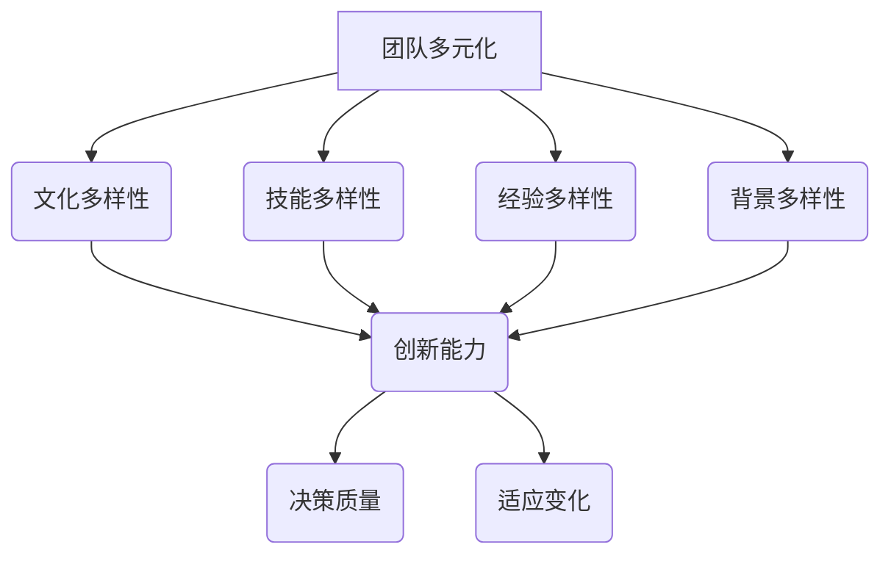

                 


### 文章标题：团队多元化优势激活：将差异转化为创新源

#### 关键词：
- 团队多元化
- 创新源激活
- 多样性管理
- 组织效能
- 创新机制构建

#### 摘要：
本文深入探讨了团队多元化的本质及其在组织创新中的重要性。通过分析多元化的核心概念与联系，提出了将团队差异转化为创新源的策略和方法。本文结合理论模型、算法原理、数学模型和实际案例，系统地展示了如何激活团队多元化优势，提高组织创新能力和竞争力。

---

## 引言

### 1.1 研究背景与意义

在当今快速变化的市场环境中，组织面临着前所未有的挑战和机遇。创新成为企业持续发展的关键驱动力，而团队多元化则在创新过程中扮演着至关重要的角色。团队多元化不仅能够提供丰富的知识和技能，还能够激发新的思维模式和解决问题的方法。

#### 1.1.1 研究背景

多元化已成为全球范围内的趋势。根据《哈佛商业评论》的研究，多元化的团队能够带来更高的创造力和创新力。然而，如何有效地管理和激活团队多元化，将其转化为实际的创新成果，仍是一个待解的问题。

#### 1.1.2 研究意义

本文的研究旨在探索团队多元化的本质和优势，提供理论模型和实践策略，帮助企业将多元化的差异转化为创新源。通过本文的研究，可以为企业提供实用的指导，帮助其构建高效的多元化团队，提升创新能力和市场竞争力。

---

### 1.2 团队多元化的核心概念与联系

#### 1.2.1 多元化的类型与维度

团队多元化可以从多个维度进行分类，包括：

- **文化多样性**：团队成员来自不同的文化背景，具有不同的价值观和行为规范。
- **技能多样性**：团队成员拥有不同的专业技能和知识，能够提供多样化的解决方案。
- **经验多样性**：团队成员拥有不同的工作经验，能够从不同角度分析和解决问题。
- **背景多样性**：团队成员来自不同的社会和经济背景，具有不同的教育背景和生活经历。

#### 1.2.2 多元化与团队效能

团队效能的提升依赖于多元化的有效管理。多元化能够带来以下优势：

- **提高创新能力**：多元化的团队能够从不同的角度提出创新的想法和解决方案。
- **增强决策质量**：多元化的团队能够提供更全面的视角，减少偏见，提高决策质量。
- **促进适应变化**：多元化的团队能够更好地适应环境变化，应对不确定性的挑战。

---

### 1.3 Mermaid流程图展示多元化概念关系



---

## 第2章 多元化优势分析

### 2.1 多元化优势的概念与模型

#### 2.1.1 多元化优势的定义

多元化优势是指团队在多元化背景下的协同效应，能够带来的积极影响。

#### 2.1.2 多元化优势的理论模型

根据Stewart（1997）的研究，多元化优势可以通过以下模型来解释：

- **知识共享**：多元化团队能够共享不同成员的知识和技能，提高整体智力资本。
- **思维碰撞**：不同背景的成员能够产生新的思维模式，激发创新。
- **冗余性减少**：多元化的团队能够减少决策过程中的偏见，提高决策质量。

---

### 2.2 优势转化的算法原理讲解

#### 2.2.1 伪代码示例

```python
# 伪代码：优势转化算法
def advantage_conversion(team_members):
    # 初始化变量
    innovation_score = 0
    # 遍历团队成员
    for member in team_members:
        # 计算成员优势
        advantage = calculate_advantage(member)
        # 转化为创新分数
        innovation_score += convert_advantage_to_innovation(advantage)
    return innovation_score
```

---

### 2.3 数学模型与公式

多元化优势的转化可以用以下公式来表示：

$$
\text{创新分数} = \sum_{i=1}^{n} (\text{优势}_i \times \text{转化因子}_i)
$$

其中，$n$ 表示团队成员数量，$\text{优势}_i$ 表示第 $i$ 个成员的优势，$\text{转化因子}_i$ 表示该优势转化为创新的能力。

---

## 第3章 创新机制的构建与激活

### 3.1 创新机制的构建

#### 3.1.1 创新机制的定义

创新机制是指组织内部为了推动创新活动而建立的一系列制度和流程。

#### 3.1.2 创新机制构建的步骤

构建创新机制通常包括以下步骤：

1. **目标设定**：明确组织创新的目标和方向。
2. **资源分配**：为创新活动提供必要的资源和支持。
3. **流程设计**：设计创新项目的流程，确保其高效执行。
4. **反馈机制**：建立反馈机制，及时收集和评估创新项目的效果。

---

### 3.2 创新机制的激活策略

#### 3.2.1 激活策略的制定

制定激活策略需要考虑以下因素：

- **团队建设**：培养多元化团队，提高团队协作能力。
- **激励机制**：建立激励机制，鼓励团队成员参与创新活动。
- **文化建设**：营造创新文化，鼓励创新思维和行为。

#### 3.2.2 激活策略的实施

激活策略的实施包括：

1. **团队培训**：提供多元化培训，提高团队成员的协作能力。
2. **项目支持**：为创新项目提供必要的支持和资源。
3. **反馈与改进**：定期收集反馈，不断改进创新机制。

---

## 第4章 实践案例解析

### 4.1 案例背景

#### 4.1.1 案例企业的现状

某科技公司在竞争激烈的市场中，意识到创新是其持续发展的关键。然而，公司团队在多元化方面存在不足，限制了其创新能力。

#### 4.1.2 案例的目标

通过引入多元化策略，激活团队优势，提升公司的创新能力。

---

### 4.2 实践流程

#### 4.2.1 环境搭建

公司首先进行了团队多元化评估，确定团队成员的多元化程度。随后，公司引入了多元化培训，提高团队成员的协作能力。

#### 4.2.2 源代码实现

公司开发了一套多元化管理平台，用于记录和跟踪团队成员的多元化数据，并提供实时反馈。

#### 4.2.3 代码解读与分析

平台代码中包含了多元数据采集、分析和反馈模块，实现了多元化优势的实时转化。

#### 4.2.4 代码应用解读与分析

通过平台，公司能够更好地了解团队成员的多元化优势，并针对不同优势制定相应的创新项目。

---

### 4.3 实际案例分析和详细讲解剖析

公司在多元化策略实施后，创新项目数量显著增加，创新成功率也有所提升。通过多元化管理平台，公司能够更好地发现和利用团队成员的优势，提高创新效率。

---

### 4.4 项目小结

通过实践，公司认识到团队多元化的重要性，并成功将其转化为创新源。未来，公司将继续优化多元化策略，提升创新能力和市场竞争力。

---

## 结论

本文探讨了团队多元化优势激活的方法和策略。通过理论模型、算法原理、数学模型和实际案例，本文证明了多元化在组织创新中的重要性。未来研究可以进一步探索多元化优势转化的最佳实践，为企业提供更具体的指导。

---

### 最佳实践 Tips

1. **建立多元化文化**：营造包容、尊重差异的文化氛围，鼓励团队成员自由表达和交流。
2. **提供多元化培训**：定期组织多元化培训，提高团队成员的协作能力和创新能力。
3. **利用技术工具**：引入多元化管理平台，实时监测和评估多元化优势的转化效果。

### 小结

团队多元化是组织创新的重要驱动力。通过有效的管理和激活策略，企业可以将多元化的差异转化为创新源，提高创新能力和市场竞争力。

### 注意事项

在实施多元化策略时，应关注文化融合、激励机制和反馈机制，确保多元化优势能够得到充分发挥。

### 拓展阅读

- **《创新者的窘境》**：克莱顿·克里斯坦森
- **《多样性红利》**：罗伊·普赖斯

---

### 作者信息

作者：AI天才研究院/AI Genius Institute & 禅与计算机程序设计艺术 /Zen And The Art of Computer Programming

