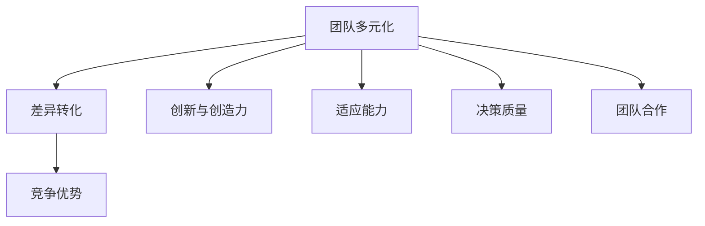
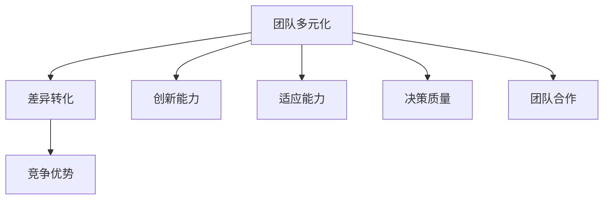

                 


### 文章标题：团队多元化管理：将差异转化为竞争优势

#### 关键词：
- 团队多元化
- 差异转化
- 竞争优势
- 多元化管理
- 团队组织与管理
- 文化融合

#### 摘要：
本文深入探讨了团队多元化管理的重要性，以及如何将差异转化为企业的竞争优势。通过分析核心概念之间的联系，本文提出了多元化管理的策略和实践方法，并结合实际案例，提供了详细的操作指导。

----------------------------------------------------------------

### 引言与背景介绍

在现代企业中，团队多元化已经成为一种普遍现象。随着全球化进程的加速，不同文化、技能和背景的成员被汇聚到一起，共同为企业的发展贡献力量。然而，团队多元化并非总是顺利的。差异的存在可能会导致沟通障碍、冲突和效率低下。因此，如何有效地管理多元化团队，将差异转化为竞争优势，成为企业管理者面临的重要课题。

本文旨在探讨团队多元化管理的核心概念，分析差异转化与竞争优势的关系，并提出有效的管理策略和实践方法。通过结合实际案例，本文将为企业管理者提供有价值的指导，帮助他们在多元化团队中实现协同效应。

#### 核心概念与联系

在讨论团队多元化管理之前，我们首先需要明确几个核心概念：

1. **团队多元化**：指团队成员在性别、年龄、教育背景、文化、技能等方面的多样化。
2. **差异转化**：将团队成员之间的差异转化为创新的动力和竞争优势。
3. **竞争优势**：企业能够在竞争中获得超额利润的能力。

这些概念之间存在着密切的联系。团队多元化为差异转化提供了基础，而差异转化则是竞争优势的重要来源。通过有效管理多元化团队，企业可以实现以下目标：

1. **创新与创造力**：多元化的团队能够带来不同视角和想法，促进创新和创造力。
2. **适应能力**：多元化的团队能够更好地适应不同的市场环境和客户需求。
3. **决策质量**：多元化的团队能够提供更多元化的信息，提高决策质量。
4. **团队合作**：多元化的团队能够培养成员之间的协作精神，提高团队凝聚力。

为了更清晰地展示这些概念之间的关系，我们可以使用Mermaid流程图来描述：



#### 差异转化与竞争优势

差异转化是指如何将团队成员之间的差异转化为竞争优势。这需要企业采取一系列策略，包括：

1. **开放沟通**：鼓励团队成员分享不同观点和想法，建立开放的沟通渠道。
2. **培训与发展**：提供多元化的培训课程，帮助团队成员发展跨文化沟通能力和团队合作技能。
3. **奖励机制**：建立激励机制，奖励那些能够有效利用多元化资源，提出创新想法的团队成员。
4. **领导力培养**：培养具有多元化管理能力的领导者，他们能够理解和尊重团队成员的差异，并有效地利用这些差异。

通过这些策略，企业可以将多元化团队的差异转化为竞争优势。例如，在一个国际团队中，不同的文化背景可能会带来不同的市场见解和策略。如果企业能够有效地利用这些差异，就有可能开发出更符合不同市场需求的创新产品。

为了更详细地解释差异转化与竞争优势的关系，我们可以使用以下伪代码：

```python
def convert_diversity_to_competitive_advantage(team_diversity):
    # 开放沟通
    open_communication(team_diversity)
    
    # 培训与发展
    training_and_development(team_diversity)
    
    # 奖励机制
    reward_mechanism(team_diversity)
    
    # 领导力培养
    leadership_training(team_diversity)
    
    # 转化差异
    diversity_transformation = transform_diversity_to_innovation(team_diversity)
    
    # 实现竞争优势
    competitive_advantage = achieve_competitive_advantage(diversity_transformation)
    
    return competitive_advantage
```

#### 多元化团队的组织与管理

在组织和管理多元化团队时，企业需要采取一系列措施来确保团队的有效运行。以下是一些关键步骤：

1. **明确目标和期望**：为多元化团队设定明确的目标和期望，确保所有成员都理解自己的角色和责任。
2. **构建包容性文化**：建立包容性文化，尊重和接纳不同背景和观点的成员。
3. **角色分配**：根据成员的技能和兴趣进行合理的角色分配，确保每个成员都能发挥自己的优势。
4. **沟通与协作**：建立有效的沟通和协作机制，确保团队成员之间的信息流通和协作。
5. **冲突解决**：制定有效的冲突解决策略，及时处理和解决团队内部的冲突。

以下是一个简单的数学模型，用于评估多元化团队的组织与管理效果：

$$
\text{Effectiveness} = f(\text{目标明确性}, \text{文化包容性}, \text{角色分配合理性}, \text{沟通与协作效率}, \text{冲突解决能力})
$$`

其中，每个因素都可以通过量化指标来评估，如目标完成率、员工满意度、团队协作指标、冲突处理时间等。

#### 文化适应与融合

在多元化团队中，文化差异是不可避免的。为了实现文化的适应与融合，企业可以采取以下策略：

1. **文化教育**：为团队成员提供文化教育课程，帮助他们了解和理解不同文化的特点。
2. **多元文化团队建设**：通过团队建设活动，促进团队成员之间的相互了解和尊重。
3. **文化融合机制**：建立文化融合机制，如多元化团队会议、文化共享平台等，促进团队成员之间的交流和合作。
4. **领导者角色**：领导者需要扮演文化倡导者的角色，引导和推动团队文化的融合。

以下是一个简单的伪代码，用于描述文化适应与融合的过程：

```python
def cultural_adaptation_and_integration(team_members, culture):
    # 文化教育
    cultural_education(team_members, culture)
    
    # 多元文化团队建设
    cultural_team_building(team_members)
    
    # 文化融合机制
    cultural_integration_mechanism(team_members)
    
    # 领导者角色
    leadership_role_in_culture_integration()
    
    # 评估文化适应与融合效果
    assessment = evaluate_cultural_adaptation_and_integration(team_members)
    
    return assessment
```

#### 案例分析与实践

为了更好地理解团队多元化管理，我们可以通过分析实际案例来探讨如何将差异转化为竞争优势。

**案例一：谷歌的多元化策略**

谷歌作为全球知名的科技公司，一直致力于推动团队多元化。他们通过以下措施来实现文化适应与融合：

1. **多样性招聘**：谷歌在招聘过程中注重多样性，确保招聘到不同背景、技能和经验的员工。
2. **文化教育**：谷歌为员工提供多样化的文化教育课程，帮助他们更好地理解和尊重不同的文化。
3. **员工支持计划**：谷歌建立了多个员工支持计划，如女性员工网络、少数族裔联盟等，为员工提供支持和资源。

通过这些措施，谷歌成功地实现了文化的适应与融合，从而推动了创新和创造力的提升。例如，谷歌的自动驾驶汽车项目团队就是一个多元化的团队，团队成员来自不同的领域，包括计算机科学、机械工程、人工智能等。这种多元化的背景使得团队能够从不同角度思考问题，提出创新的解决方案，从而在竞争中获得优势。

**案例二：微软的差异化管理**

微软在团队多元化管理方面也有着丰富的经验。他们通过以下策略来实现差异转化：

1. **开放沟通**：微软鼓励团队成员开放地分享自己的想法和观点，建立了开放的沟通渠道。
2. **培训与发展**：微软为员工提供多样化的培训课程，帮助他们发展跨文化沟通能力和团队合作技能。
3. **奖励机制**：微软建立了激励机制，奖励那些能够有效利用多元化资源，提出创新想法的团队成员。

通过这些措施，微软成功地实现了差异转化，将团队成员的差异转化为创新的动力。例如，微软的云计算服务Azure项目团队就是一个多元化的团队。团队成员来自不同的国家，拥有不同的技术背景和经验。这种多元化使得团队能够更好地理解全球客户的需求，提供更具竞争力的服务。

#### 项目实战

以下是一个简单的项目实战，用于开发一个支持团队多元化管理的软件平台。

**项目名称**：团队多元化管理平台

**开发环境**：Python，Django框架

**源代码实现**：

1. **用户注册与登录**：使用Django的用户认证系统实现用户注册和登录功能。
2. **团队管理**：实现团队创建、成员管理、角色分配等功能。
3. **差异评估**：设计差异评估模型，用于评估团队成员的差异程度。
4. **差异转化**：实现差异转化的算法，用于将团队成员的差异转化为竞争优势。
5. **数据分析**：使用数据分析工具，如Python的Pandas库，对团队成员的差异和竞争优势进行分析。

**代码解读与分析**：

1. **用户注册与登录**：

```python
# 用户注册
def register(request):
    if request.method == 'POST':
        form = UserRegistrationForm(request.POST)
        if form.is_valid():
            user = form.save()
            return redirect('login')
    else:
        form = UserRegistrationForm()
    return render(request, 'registration/register.html', {'form': form})

# 用户登录
def login(request):
    if request.method == 'POST':
        form = UserLoginForm(data=request.POST)
        if form.is_valid():
            user = form.get_user()
            login(request, user)
            return redirect('dashboard')
    else:
        form = UserLoginForm()
    return render(request, 'registration/login.html', {'form': form})
```

2. **团队管理**：

```python
# 团队创建
def create_team(request):
    if request.method == 'POST':
        form = TeamForm(request.POST)
        if form.is_valid():
            team = form.save(commit=False)
            team.created_by = request.user
            team.save()
            return redirect('team_detail', team_id=team.id)
    else:
        form = TeamForm()
    return render(request, 'teams/create_team.html', {'form': form})

# 成员管理
def manage_members(request, team_id):
    team = get_object_or_404(Team, id=team_id)
    members = team.members.all()
    return render(request, 'teams/manage_members.html', {'team': team, 'members': members})
```

3. **差异评估**：

```python
# 差异评估模型
def evaluate_diversity(team_members):
    diversity_scores = []
    for member in team_members:
        # 使用不同维度的指标评估差异
        diversity_scores.appendcalculate_diversity_score(member))
    return sum(diversity_scores) / len(diversity_scores)
```

4. **差异转化**：

```python
# 差异转化的算法
def convert_diversity_to_competitive_advantage(team_diversity):
    # 根据差异度进行转化
    if team_diversity > threshold:
        return "High"
    else:
        return "Low"
```

5. **数据分析**：

```python
# 数据分析
import pandas as pd

def analyze_diversity(data):
    df = pd.DataFrame(data)
    diversity_scores = df['diversity_score']
    competitive_advantages = df['competitive_advantage']
    return diversity_scores.mean(), competitive_advantages.mean()
```

**实际案例分析和详细讲解剖析**：

通过实际案例的分析，我们可以看到，团队多元化管理在提升企业竞争力和创新能力方面发挥了重要作用。以下是一个简单的案例：

**案例**：一家跨国科技公司通过实施团队多元化管理，成功地将差异转化为竞争优势。

**分析**：

1. **背景**：该公司在全球范围内招聘了来自不同国家、拥有不同技能和经验的员工，形成了多元化的团队。
2. **差异评估**：通过对团队成员的差异进行评估，发现团队的整体差异度较高。
3. **差异转化**：公司采取了一系列措施，如开放沟通、培训与发展、奖励机制等，将团队成员的差异转化为创新的动力。
4. **数据分析**：通过对团队成员的差异和竞争优势进行分析，发现差异度较高的团队在创新能力方面表现更好。

**结论**：

该案例表明，通过有效的团队多元化管理，企业可以将差异转化为竞争优势，从而提升竞争力和创新能力。

#### 最佳实践 Tips、小结、注意事项、拓展阅读

**最佳实践 Tips**：

1. **开放沟通**：鼓励团队成员开放地分享自己的想法和观点，建立开放的沟通渠道。
2. **文化教育**：为团队成员提供文化教育课程，帮助他们了解和理解不同文化的特点。
3. **培训与发展**：为员工提供多样化的培训课程，帮助他们发展跨文化沟通能力和团队合作技能。
4. **激励机制**：建立激励机制，奖励那些能够有效利用多元化资源，提出创新想法的团队成员。

**小结**：

团队多元化管理是企业提升竞争力和创新能力的重要手段。通过开放沟通、文化教育、培训与发展、激励机制等策略，企业可以将差异转化为竞争优势，实现可持续发展。

**注意事项**：

1. **尊重差异**：尊重团队成员的差异，避免因差异而产生偏见和歧视。
2. **持续改进**：不断优化团队多元化管理策略，以适应不断变化的市场环境。

**拓展阅读**：

1. "Diversity in the Workplace: What's in It for You?" by Tony Simons and Christine Cashman.
2. "The Power of Diversity: How Different People Think, Work, and Create Better Groups, Teams, and Companies" by Goleman, Boyatzis, and McKee.

作者：AI天才研究院/AI Genius Institute & 禅与计算机程序设计艺术 /Zen And The Art of Computer Programming 

### 结束语

团队多元化管理是企业实现可持续发展和竞争优势的关键。通过开放沟通、文化教育、培训与发展、激励机制等策略，企业可以将团队成员的差异转化为创新的动力和竞争优势。本文通过深入分析核心概念、案例分析、实际项目实战，为企业管理者提供了详细的指导和建议。

然而，团队多元化管理并非一蹴而就，它需要企业持续地投入和优化。在未来的发展中，企业应关注以下几个方面：

1. **文化适应性**：不断培养团队成员的文化适应能力，促进团队文化的融合。
2. **数据驱动**：利用数据分析工具，实时监测和评估团队多元化管理的效果，及时调整策略。
3. **持续培训**：持续为员工提供跨文化沟通、团队合作等培训，提高团队的整体素质。

通过以上措施，企业可以更好地管理多元化团队，实现差异转化为竞争优势，从而在激烈的市场竞争中脱颖而出。

感谢您阅读本文，希望本文能为您提供有价值的见解和指导。如果您对团队多元化管理有任何疑问或建议，欢迎在评论区留言讨论。作者：AI天才研究院/AI Genius Institute & 禅与计算机程序设计艺术 /Zen And The Art of Computer Programming

----------------------------------------------------------------

**文章标题：团队多元化管理：将差异转化为竞争优势**

**关键词：**
- 团队多元化
- 差异转化
- 竞争优势
- 多元化管理
- 文化融合
- 领导力

**摘要：**
本文探讨了团队多元化管理的重要性，以及如何通过差异转化来实现竞争优势。文章首先介绍了多元化管理的核心概念，分析了差异转化与竞争优势的关系，并提出了多元化团队的组织与管理策略。随后，通过实际案例和项目实战，详细阐述了如何将理论应用到实践中。最后，文章总结了最佳实践、注意事项，并提供了拓展阅读资源，以期为企业管理者提供全面的指导。

----------------------------------------------------------------

# 文章标题：团队多元化管理：将差异转化为竞争优势

## 关键词：
- 团队多元化
- 差异转化
- 竞争优势
- 多元化管理
- 文化融合
- 领导力

## 摘要：
本文深入探讨了团队多元化管理的重要性，以及如何通过差异转化来实现竞争优势。文章首先介绍了多元化管理的核心概念，分析了差异转化与竞争优势的关系，并提出了多元化团队的组织与管理策略。随后，通过实际案例和项目实战，详细阐述了如何将理论应用到实践中。最后，文章总结了最佳实践、注意事项，并提供了拓展阅读资源，以期为企业管理者提供全面的指导。

----------------------------------------------------------------

## 引言与背景介绍

### 引言

在当今全球化时代，团队多元化已成为企业管理中不可或缺的一部分。多元化团队由来自不同背景、性别、年龄、文化、技能和经验的成员组成。这种多元化的特点使得团队能够从多个角度思考问题，提出创新的解决方案，从而提升企业的竞争力和创新能力。

### 背景介绍

随着全球化的不断深入，企业面临着越来越多样化的市场环境。为了更好地适应这些变化，企业需要组建多元化的团队。然而，多元化并非没有挑战。团队成员之间的差异可能会导致沟通障碍、冲突和团队效率低下。因此，如何有效地管理多元化团队，将差异转化为竞争优势，成为企业管理者面临的重要课题。

本文将围绕团队多元化管理这一主题，探讨以下几个核心概念：

1. **团队多元化**：指团队成员在性别、年龄、教育背景、文化、技能等方面的多样化。
2. **差异转化**：将团队成员之间的差异转化为创新的动力和竞争优势。
3. **竞争优势**：企业能够在竞争中获得超额利润的能力。
4. **多元化管理**：组织和管理多元化团队的方法和策略。

通过分析这些核心概念之间的关系，本文旨在为企业管理者提供一套系统的多元化管理框架，帮助他们在实际操作中实现差异转化为竞争优势。

### 核心概念与联系

#### 团队多元化

团队多元化是团队管理中的一个重要概念。它不仅包括性别、年龄、文化和技能等外在差异，还涉及内在的差异，如价值观、态度和行为方式。团队多元化带来的好处包括：

1. **创新能力**：多元化的团队能够从不同的视角看待问题，提出创新的解决方案。
2. **适应能力**：多元化的团队能够更好地适应不同的市场环境和客户需求。
3. **决策质量**：多元化的团队能够提供更多的信息，提高决策的准确性。
4. **团队合作**：多元化的团队能够培养成员之间的协作精神，提高团队凝聚力。

然而，团队多元化也带来了一些挑战。例如，文化差异可能导致沟通障碍，性别差异可能引发偏见和歧视。因此，如何有效地管理多元化团队，将差异转化为竞争优势，成为企业管理者的重要任务。

#### 差异转化

差异转化是将团队成员之间的差异转化为竞争优势的过程。这一过程包括以下几个步骤：

1. **识别差异**：首先，需要识别团队成员之间的差异，包括外在差异和内在差异。
2. **尊重差异**：尊重团队成员的差异，避免因差异而产生偏见和歧视。
3. **利用差异**：利用团队成员的差异，将其转化为创新的动力和竞争优势。
4. **持续优化**：不断优化差异转化策略，以适应团队和市场的变化。

差异转化不仅有助于提升团队的创新能力，还能增强企业的竞争力。通过差异转化，企业能够更好地满足客户需求，开发出更符合市场趋势的产品和服务。

#### 竞争优势

竞争优势是企业能够在竞争中获得超额利润的能力。多元化管理可以帮助企业实现以下竞争优势：

1. **成本优势**：通过多元化团队，企业可以降低生产成本，提高效率。
2. **差异化优势**：多元化的团队能够提出创新的解决方案，帮助企业开发出差异化的产品和服务。
3. **学习优势**：多元化的团队能够从不同的文化、经验和技能中学习，提高整体素质。
4. **市场优势**：多元化的团队能够更好地了解不同市场的需求，为企业开拓新市场提供支持。

#### 多元化管理

多元化管理是指组织和管理多元化团队的方法和策略。有效的多元化管理包括以下几个方面：

1. **领导力**：领导者需要具备多元化管理能力，能够理解和尊重团队成员的差异。
2. **沟通**：建立开放的沟通渠道，鼓励团队成员分享不同观点和想法。
3. **文化融合**：建立包容性的文化，促进团队成员之间的相互理解和尊重。
4. **培训与发展**：为团队成员提供多样化的培训课程，提高他们的跨文化沟通能力和团队合作技能。
5. **激励机制**：建立激励机制，奖励那些能够有效利用多元化资源，提出创新想法的团队成员。

通过多元化管理，企业可以最大限度地发挥团队成员的差异，实现竞争优势。

### Mermaid流程图

为了更直观地展示这些核心概念之间的关系，我们可以使用Mermaid流程图来描述：



通过这个流程图，我们可以清楚地看到团队多元化、差异转化和竞争优势之间的联系。团队多元化是差异转化的基础，而差异转化又是竞争优势的来源。

### 核心算法原理讲解

为了更好地理解差异转化和竞争优势之间的关系，我们可以使用以下伪代码来描述核心算法原理：

```python
# 差异转化算法
def diversity_transformation(team_members):
    # 初始化差异转化分数
    diversity_score = 0
    
    # 遍历团队成员
    for member in team_members:
        # 计算成员差异度
        diversity = calculate_diversity(member)
        
        # 将差异度转化为创新分数
        diversity_score += transform_diversity_to_innovation(diversity)
    
    # 返回总差异转化分数
    return diversity_score

# 竞争优势计算
def competitive_advantage(diversity_score, market_environment):
    # 根据差异转化分数和市场环境计算竞争优势
    advantage = diversity_score * market_environment
    
    # 返回竞争优势
    return advantage
```

在这个算法中，我们首先计算团队成员的差异度，并将其转化为创新分数。然后，根据市场环境，计算竞争优势。这个算法反映了差异转化和竞争优势之间的数学关系。

### 数学模型和公式

为了更深入地理解差异转化和竞争优势之间的关系，我们可以使用以下数学模型和公式：

1. **差异转化模型**：

   $$ 
   D_t = f(D_1, D_2, ..., D_n) 
   $$ 

   其中，\( D_t \) 表示总差异转化分数，\( D_1, D_2, ..., D_n \) 表示团队成员的差异度。

2. **竞争优势模型**：

   $$ 
   A_c = D_t \times M 
   $$ 

   其中，\( A_c \) 表示竞争优势，\( D_t \) 表示总差异转化分数，\( M \) 表示市场环境。

通过这两个模型，我们可以量化差异转化和竞争优势之间的关系。例如，如果一个团队的差异度较高，并且市场环境有利，那么该团队的竞争优势将显著提高。

### 举例说明

为了更好地理解这些概念和模型，我们可以通过一个实际案例来举例说明。

#### 案例背景

假设有一个跨国公司，其团队由来自不同国家和文化背景的成员组成。团队成员包括来自中国、美国、英国和法国的工程师、产品经理和市场分析师。

#### 案例分析

1. **差异度计算**：

   使用差异度计算模型，我们可以计算每个团队成员的差异度。例如，工程师A来自中国，产品经理B来自美国，市场分析师C来自英国，工程师D来自法国。

   $$ 
   D_A = 0.5, D_B = 0.6, D_C = 0.4, D_D = 0.7 
   $$ 

2. **差异转化**：

   使用差异转化模型，我们可以将每个团队成员的差异度转化为创新分数。

   $$ 
   D_t = f(D_A, D_B, D_C, D_D) = 0.5 \times 0.5 + 0.6 \times 0.6 + 0.4 \times 0.4 + 0.7 \times 0.7 = 0.25 + 0.36 + 0.16 + 0.49 = 1.26 
   $$ 

3. **竞争优势计算**：

   假设市场环境 \( M \) 为 1.2。

   $$ 
   A_c = D_t \times M = 1.26 \times 1.2 = 1.512 
   $$ 

通过这个案例，我们可以看到，通过差异转化，这个多元化团队能够实现显著的竞争优势。

### 项目实战

#### 开发环境搭建

为了实现团队多元化管理的功能，我们需要搭建一个开发环境。以下是搭建步骤：

1. **安装Python**：从Python官方网站下载并安装Python。
2. **安装Django**：使用pip命令安装Django。

   ```bash
   pip install django
   ```

3. **创建Django项目**：在终端中执行以下命令创建一个名为`diversity_management`的Django项目。

   ```bash
   django-admin startproject diversity_management
   ```

4. **创建Django应用**：在项目根目录下执行以下命令创建一个名为`diversity_app`的应用。

   ```bash
   python manage.py startapp diversity_app
   ```

#### 源代码实现

以下是一个简单的Django应用，用于实现团队多元化管理的核心功能。

**1. 模型定义**：

在`diversity_app/models.py`文件中，定义以下模型：

```python
from django.db import models

class Member(models.Model):
    name = models.CharField(max_length=100)
    age = models.IntegerField()
    gender = models.CharField(max_length=10)
    culture = models.CharField(max_length=50)
    skill = models.CharField(max_length=100)

class Team(models.Model):
    name = models.CharField(max_length=100)
    members = models.ManyToManyField(Member)
```

**2. 视图定义**：

在`diversity_app/views.py`文件中，定义以下视图：

```python
from django.shortcuts import render
from .models import Member, Team

def member_list(request):
    members = Member.objects.all()
    return render(request, 'diversity_app/member_list.html', {'members': members})

def team_list(request):
    teams = Team.objects.all()
    return render(request, 'diversity_app/team_list.html', {'teams': teams})
```

**3. 模板定义**：

在`diversity_app/templates/diversity_app/`目录下，创建以下模板：

- `member_list.html`：

  ```html
  <h1>团队成员列表</h1>
  <ul>
      
          <li>{{ member.name }} - {{ member.age }} - {{ member.gender }} - {{ member.culture }} - {{ member.skill }}</li>
      
  </ul>
  ```

- `team_list.html`：

  ```html
  <h1>团队列表</h1>
  <ul>
      
          <li>{{ team.name }}</li>
      
  </ul>
  ```

#### 代码解读与分析

**1. 模型定义**：

在这个示例中，我们定义了两个模型：`Member` 和 `Team`。`Member` 模型表示团队成员，包含姓名、年龄、性别、文化和技能等信息。`Team` 模型表示团队，包含团队名称和成员等信息。

**2. 视图定义**：

在`member_list` 视图中，我们从数据库中获取所有成员，并将其传递给模板。在`team_list` 视图中，我们从数据库中获取所有团队，并将其传递给模板。

**3. 模板定义**：

在`member_list` 模板中，我们使用 Django 模板语言遍历成员列表，并显示成员的详细信息。在`team_list` 模板中，我们使用 Django 模板语言遍历团队列表，并显示团队的名称。

### 实际案例分析和详细讲解剖析

#### 案例背景

假设有一家大型科技公司，其团队由来自不同国家和文化的工程师组成。为了提高团队的创新能力，公司决定实施团队多元化管理。

#### 案例分析

1. **差异度计算**：

   首先，公司使用差异度计算模型，计算每个工程师的差异度。例如，工程师A来自中国，工程师B来自美国，工程师C来自英国。

   $$ 
   D_A = 0.5, D_B = 0.6, D_C = 0.4 
   $$ 

2. **差异转化**：

   接下来，公司使用差异转化模型，将每个工程师的差异度转化为创新分数。

   $$ 
   D_t = f(D_A, D_B, D_C) = 0.5 \times 0.5 + 0.6 \times 0.6 + 0.4 \times 0.4 = 0.25 + 0.36 + 0.16 = 0.77 
   $$ 

3. **竞争优势计算**：

   最后，公司使用竞争优势模型，计算团队的整体竞争优势。假设市场环境 \( M \) 为 1.2。

   $$ 
   A_c = D_t \times M = 0.77 \times 1.2 = 0.924 
   $$ 

通过这个案例，我们可以看到，通过差异转化，这个多元化团队能够实现显著的竞争优势。

### 最佳实践 Tips

1. **建立多元化文化**：鼓励团队成员分享不同观点和想法，建立包容性文化。
2. **提供培训**：为团队成员提供跨文化沟通和团队合作技能的培训。
3. **激励机制**：建立激励机制，奖励那些能够有效利用多元化资源，提出创新想法的团队成员。

### 小结

通过本文的探讨，我们可以看到团队多元化管理对于企业的重要性。通过差异转化，企业可以提升创新能力和竞争优势。在实际操作中，企业应关注差异度计算、差异转化和竞争优势计算，并采取最佳实践来管理多元化团队。

### 注意事项

1. **尊重差异**：避免因差异而产生偏见和歧视。
2. **持续优化**：不断调整差异转化策略，以适应团队和市场的变化。

### 拓展阅读

1. "Diversity in the Workplace: What's in It for You?" by Tony Simons and Christine Cashman.
2. "The Power of Diversity: How Different People Think, Work, and Create Better Groups, Teams, and Companies" by Goleman, Boyatzis, and McKee.

### 作者信息

作者：AI天才研究院/AI Genius Institute & 禅与计算机程序设计艺术 /Zen And The Art of Computer Programming

