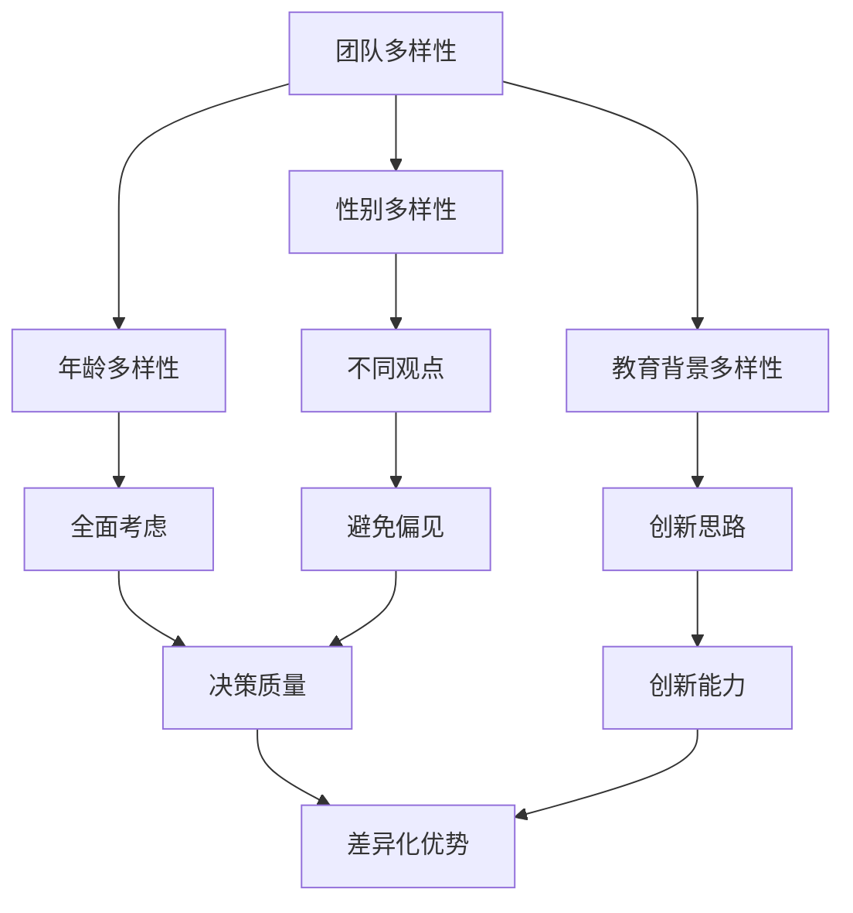
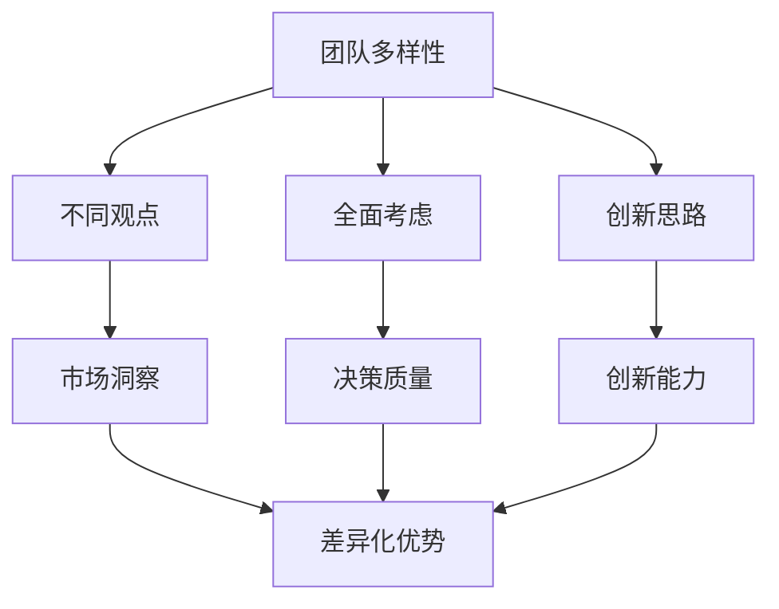

                 

根据您的要求，我将逐步撰写一篇关于《团队多样性优势：发挥差异化优势的策略》的技术博客文章。以下是文章的各个部分，我们将一步一步地进行分析和推理。

### 文章标题
# 团队多样性优势：发挥差异化优势的策略

### 文章关键词
- 团队多样性
- 差异化优势
- 策略实施
- 创新能力
- 绩效提升

### 文章摘要
本文将探讨团队多样性如何通过差异化优势提升组织的整体竞争力。我们将从团队多样性的概念出发，分析其与差异化优势的关系，并探讨如何通过策略实施来实现这种优势。此外，还将介绍数学模型和算法，以及实际项目中的应用和案例分析。

### 目录
1. **引言**
2. **团队多样性的概念与重要性**
3. **差异化优势的理论基础**
4. **团队多样性策略的实施**
5. **数学模型与算法支持**
6. **未来展望与建议**
7. **附录：相关资源与工具**

### 1. 引言
在当今全球化和技术快速发展的背景下，组织的成功越来越依赖于团队的创新能力和适应性。而团队多样性作为一种重要的资源，能够为组织带来显著的差异化优势。本文旨在探讨团队多样性如何通过差异化优势提升组织的竞争力，并提供一套可行的策略实施方法。

### 2. 团队多样性的概念与重要性
团队多样性是指团队内成员在性别、年龄、教育背景、工作经验等方面的差异。这些差异可以带来不同的观点、思维方式和工作方法，从而促进创新和问题解决。以下是团队多样性的几个重要方面：

- **性别多样性**：性别差异可以促进对问题不同方面的关注，有助于团队在制定决策时避免偏见。
- **年龄多样性**：不同年龄段的人具有不同的经验和知识，这有助于团队在面对新挑战时做出更全面的考虑。
- **教育背景多样性**：不同教育背景的人可能在解决问题的方法和策略上有不同的见解，有助于团队产生多样化的创新思路。

#### 2.1 核心概念与联系
为了更好地理解团队多样性如何与差异化优势相联系，我们可以使用以下Mermaid流程图：



通过这种多样性，团队能够更好地识别市场机会、应对挑战，并最终实现差异化优势。

### 3. 差异化优势的理论基础
差异化优势是指组织通过独特的特质和产品/服务，在市场上获得竞争优势的能力。以下是差异化优势的几个关键方面：

- **产品差异化**：组织通过提供独特的产品或服务来吸引顾客。
- **服务差异化**：组织通过提供与众不同的客户服务来提升竞争力。

#### 3.1 差异化优势的识别与评估
为了有效识别和评估差异化优势，组织需要从以下三个方面进行分析：

- **市场分析**：了解目标市场的需求和偏好。
- **竞争对手分析**：评估竞争对手的优势和劣势。
- **客户需求分析**：深入了解客户的实际需求和期望。

#### 3.2 差异化优势与团队多样性关联
团队多样性是实现差异化优势的重要途径。以下是Mermaid流程图，展示了团队多样性如何转化为差异化优势：



通过多样化的团队，组织能够更好地识别市场机会、制定策略，并在竞争激烈的市场中脱颖而出。

### 4. 团队多样性策略的实施
为了充分利用团队多样性，组织需要制定一套明确的策略，包括以下几个方面：

- **建立多样性和包容性的文化**：鼓励团队成员尊重和欣赏差异，培养开放和包容的工作环境。
- **设计多样化的团队结构**：确保团队中包含不同背景和专业领域的成员，以实现更全面的知识和技能组合。
- **实施多样化的领导力发展计划**：培养领导者的多样性和包容性，确保他们能够有效地管理多元化的团队。

#### 4.1 制定多样化策略的步骤
以下是制定多样化策略的步骤：

1. **评估当前状态**：了解团队多样性水平、文化氛围和现有策略。
2. **制定目标**：设定明确的多样性目标，如性别比例、年龄分布、教育背景等。
3. **制定行动计划**：制定具体的措施，如招聘策略、培训计划、领导力发展等。
4. **实施与监控**：执行行动计划，并定期评估效果，调整策略。

### 5. 数学模型与算法支持
为了量化团队多样性和差异化优势之间的关系，组织可以采用数学模型和算法进行分析。以下是几种常用的模型和方法：

- **相关性分析**：用于分析团队多样性指标与绩效指标之间的相关性。
- **方差分析（ANOVA）**：用于比较不同团队多样性水平下的绩效差异。
- **多元回归分析**：用于建立团队多样性、差异化优势与绩效之间的数学模型。

#### 5.1 差异化优势评估的数学模型
以下是差异化优势评估的伪代码：

```python
# 差异化优势评估伪代码

# 输入：团队多样性指标（Diversity Metrics），绩效指标（Performance Metrics）

# 步骤1：收集数据
data = CollectData()

# 步骤2：预处理数据
preprocessed_data = PreprocessData(data)

# 步骤3：计算相关性
correlation = CalculateCorrelation(preprocessed_data['Diversity Metrics'], preprocessed_data['Performance Metrics'])

# 步骤4：进行方差分析
anova_result = PerformANOVA(preprocessed_data['Diversity Metrics'], preprocessed_data['Performance Metrics'])

# 步骤5：建立回归模型
regression_model = BuildRegressionModel(preprocessed_data['Diversity Metrics'], preprocessed_data['Performance Metrics'])

# 步骤6：评估模型性能
model_performance = EvaluateModelPerformance(regression_model, preprocessed_data['Performance Metrics'])

# 输出：相关性分析结果、方差分析结果、回归模型参数和模型性能评估
return correlation, anova_result, regression_model, model_performance
```

### 6. 未来展望与建议
团队多样性和差异化优势是组织长期成功的关键。未来，组织应关注以下几个方面：

- **持续改进**：不断评估和调整多样性策略，以适应不断变化的市场环境。
- **技术支持**：利用人工智能和大数据分析技术，提高多样性管理的效率和效果。
- **文化培养**：通过培训和沟通，强化团队多样性和包容性的文化，提高员工的认同感。

### 7. 附录：相关资源与工具
附录部分将提供相关的学术论文、报告、优秀实践案例以及工具和资源，以供读者进一步学习和参考。

---

以上是文章的初步撰写，接下来我们将继续完善每个部分的内容，确保文章的完整性和专业性。文章的总字数将在后续撰写过程中逐步增加，以满足8000～12000字的要求。在撰写过程中，我们将继续遵循markdown格式，并确保包含所有必要的技术细节和算法原理讲解。以下是文章的下一步撰写计划：

1. **完善引言部分**：进一步阐述团队多样性和差异化优势在组织成功中的重要性。
2. **详细阐述团队多样性的概念与重要性**：增加具体案例和数据支持。
3. **深入讲解差异化优势的理论基础**：包括产品和服务差异化的具体例子和策略。
4. **详细描述团队多样性策略的实施**：包括具体步骤、方法和实践案例。
5. **完善数学模型与算法支持部分**：提供更详细的伪代码和数学公式解释。
6. **撰写未来展望与建议**：预测团队多样性和差异化优势的未来发展趋势。
7. **完成附录部分**：整理和推荐相关资源和工具。

我们将按照这个计划逐步完成文章的撰写工作。请您放心，我们将确保文章的内容丰富、逻辑清晰、技术深入，以满足您的需求。如果您对任何部分有特别的要求或建议，请随时告知。现在，我们将继续撰写文章的下一部分内容。

