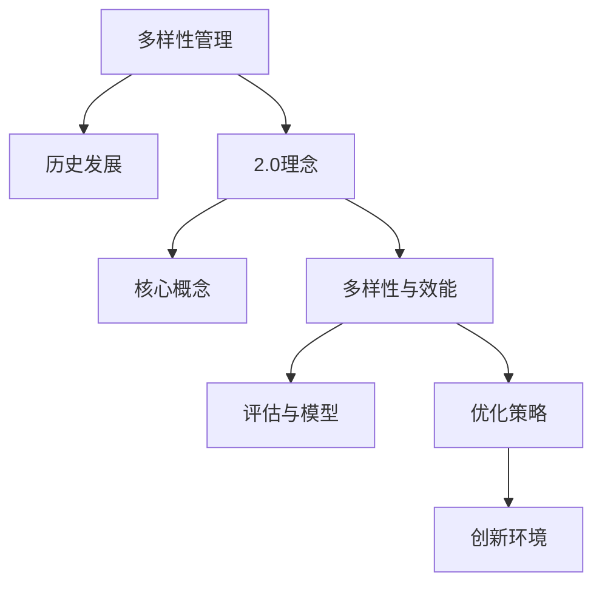
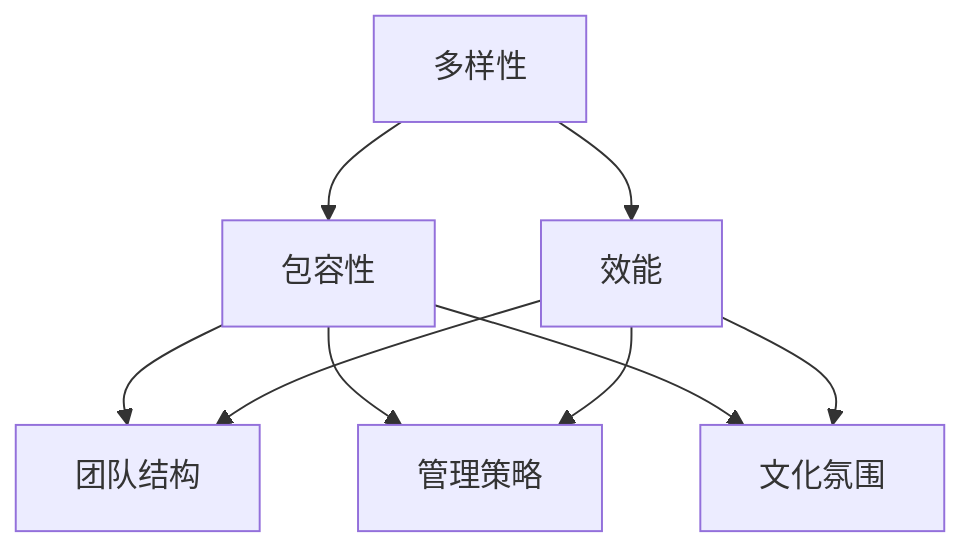
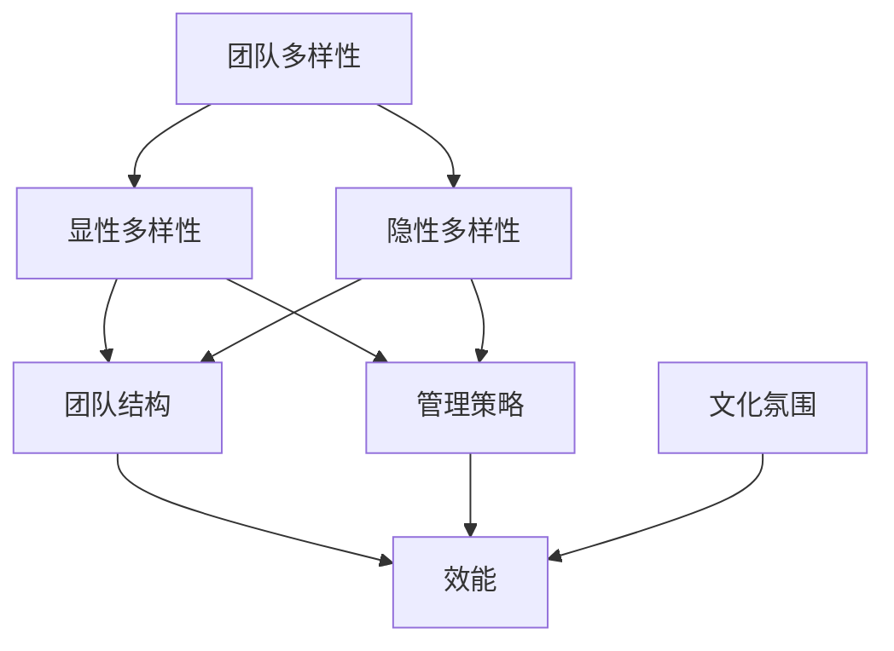
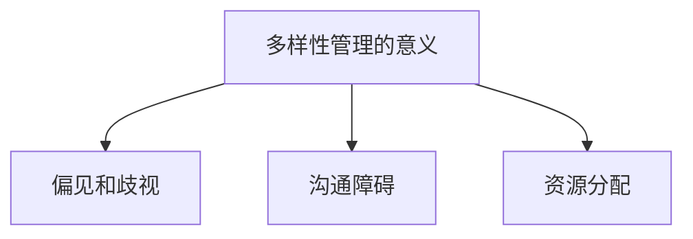
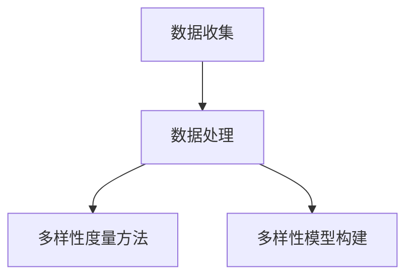

                 

### 文章标题

《团队多样性管理2.0：创造包容性创新环境》

### 关键词

团队多样性管理、包容性创新、2.0时代、优化策略、实战案例、数学模型、算法原理

### 摘要

本文深入探讨了团队多样性管理2.0的概念、核心原理和实践方法。首先，我们回顾了多样性管理的历史和发展，并引入了2.0时代的新型理念。接着，我们详细阐述了团队多样性的核心概念，以及多样性与团队效能之间的关系。文章的核心部分包括多样性评估与模型构建，优化策略的数学模型和公式推导，以及具体的项目实战案例。此外，我们还提出了创造包容性创新环境的策略，并讨论了执行与评估的方法。最后，我们展望了多样性管理2.0的发展趋势和面临的挑战。通过本文的阅读，读者将获得关于团队多样性管理2.0的全面理解和实践指导。

---

## 引言

### 背景介绍

多样性管理在现代社会中愈发重要，不仅因为其伦理和社会价值，更因为其对企业绩效的显著影响。随着全球化进程的加快，企业越来越依赖多元化团队来实现创新和竞争优势。然而，传统的多样性管理往往局限于性别、种族和年龄等表面的差异，忽视了更深层次的认知、经验和思维方式的多样性。

### 核心概念与联系

团队多样性管理2.0强调的是深层次的多样性，包括文化、背景、思维方式、技能和经验等多方面的差异。这些多样性不仅丰富了团队的知识结构，而且有助于激发创新思维，提高团队解决问题的能力。因此，理解多样性管理的核心概念及其相互联系至关重要。

#### Mermaid 流程图



### 多样性管理的历史与发展

多样性管理的历史可以追溯到20世纪60年代，当时主要关注的是消除性别、种族和年龄歧视。然而，随着社会和科技的发展，人们对多样性的理解逐渐深入，不再局限于表面的差异，而是更加关注深层次的多样性。从1.0时代到2.0时代，多样性管理的理念和方法不断演进，更加注重多样性的价值挖掘和效能提升。

### 2.0时代的多样化管理理念

2.0时代的多样性管理强调包容性、共性和差异的融合。它不仅关注多样性的数量，更关注多样性的质量，即如何通过有效的管理和策略，将多样性转化为实际的团队效能。2.0时代的多样化管理理念包括以下几个方面：

1. **包容性**：营造一个尊重差异、鼓励表达和共同成长的工作环境。
2. **共性**：挖掘团队成员之间的共同点，促进团队协作和凝聚力。
3. **差异的融合**：通过有效的沟通和协作，将不同背景、经验和思维方式的团队成员融合在一起，实现知识的互补和创新的火花碰撞。

### 核心概念与联系

多样性管理涉及多个核心概念，包括多样性、包容性、效能等。这些概念之间存在着密切的联系和相互作用。

#### 多样性

多样性指的是团队成员在性别、种族、文化、经验、技能等方面的差异。多样性不仅包括表面的特征，还包括深层次的认知、思维方式和价值观。

#### 包容性

包容性是指企业或团队在管理和运营过程中，能够尊重、接受并充分利用团队成员的多样性。包容性环境能够促进团队成员的自由表达、创新和协作。

#### 效能

多样性管理的最终目标是提升团队的效能，即通过有效管理和策略，将多样性转化为实际的团队绩效。多样性与效能之间的关系是多样性管理的核心问题。

### 多样性与团队效能的关系

多样性能否提升团队效能取决于多种因素，包括团队的结构、管理策略、文化氛围等。研究表明，多样性能显著提升团队的创造力、问题解决能力和决策质量。然而，只有当多样性得到有效管理和利用时，才能真正转化为效能。

#### Mermaid 流程图



综上所述，多样性管理2.0的核心概念和联系构成了一个复杂的相互作用体系。理解这些概念及其相互关系，对于实现有效的团队多样性管理至关重要。在接下来的章节中，我们将深入探讨多样性评估与模型构建、优化策略、项目实战等内容，以帮助读者更好地理解和实践团队多样性管理2.0。

---

## 核心概念与联系

### 团队多样性的定义

团队多样性指的是团队成员在性别、种族、文化、经验、技能、教育背景等方面的差异。这种多样性不仅体现在成员的外在特征上，还包括他们的思维方式、工作风格和价值观。在团队多样性管理2.0中，我们强调的是深层次的多样性，即那些能够显著影响团队运作和决策的因素。

#### 多样性管理的基本原则

1. **包容性**：尊重和接受团队成员的多样性，创造一个包容性的工作环境。
2. **公平性**：确保所有团队成员都能公平地参与决策和享有资源。
3. **效能导向**：通过有效管理和策略，将多样性转化为团队效能的提升。

### 多样性与团队效能的关系

多样性如何影响团队效能是一个复杂的问题，但研究表明，多样性能显著提升团队的创造力、问题解决能力和决策质量。然而，多样性能否转化为效能，取决于以下几个关键因素：

1. **团队结构**：团队的结构和组织方式是否能够促进多样性的有效融合。
2. **管理策略**：管理者是否能够理解和利用多样性，制定相应的管理策略。
3. **文化氛围**：团队的文化氛围是否能够包容和尊重多样性。

#### 多样性的类型

1. **显性多样性**：容易观察和测量的多样性，如性别、种族、年龄等。
2. **隐性多样性**：难以观察和测量的多样性，如思维方式、价值观、工作经验等。

#### Mermaid 流程图



通过以上流程图，我们可以清晰地看到多样性与团队效能之间的复杂关系。显性多样性和隐性多样性通过团队结构、管理策略和文化氛围等途径，最终影响团队的效能。因此，理解多样性的类型及其影响机制，对于实现有效的团队多样性管理至关重要。

### 多样性管理的意义与挑战

多样性管理的意义在于，它能够帮助企业或团队充分利用多样性带来的优势，从而提升整体效能。然而，实现这一目标并非易事，多样性管理面临着诸多挑战：

1. **偏见和歧视**：尽管多样性的重要性已被广泛认可，但偏见和歧视仍然存在于许多组织和企业中。
2. **沟通障碍**：不同背景和文化的人可能在沟通中存在障碍，影响团队的协作效率。
3. **资源分配**：如何确保所有团队成员都能公平地获得资源和机会，是一个重要的挑战。

#### Mermaid 流程图



通过克服这些挑战，组织可以更好地实现多样性管理的目标，从而提升团队效能和创新力。在接下来的章节中，我们将深入探讨多样性评估与模型构建、优化策略等内容，以帮助读者理解和实践团队多样性管理2.0。

---

## 多样性评估与模型构建

### 多样性度量方法

多样性评估是团队多样性管理2.0的重要组成部分。为了有效度量多样性，我们需要采用合适的指标和方法。以下是几种常用的多样性度量方法：

1. **显性多样性度量**：
   - **人口统计方法**：通过性别、种族、年龄等显性特征来度量多样性。
   - **多样性指数**：使用多样性指数（如Herfindahl-Hirschman指数）来量化团队成员在某个维度上的差异程度。

2. **隐性多样性度量**：
   - **问卷调查**：通过问卷调查来收集团队成员在价值观、工作经验、教育背景等方面的信息。
   - **行为事件访谈**：通过行为事件访谈来了解团队成员在工作中的行为和互动方式。

### 多样性模型构建

构建多样性模型是多样性评估的进一步深化。多样性模型可以帮助我们理解多样性与团队效能之间的关系，并为制定多样性管理策略提供依据。以下是几种常见的多样性模型：

1. **层次模型**：
   - **基本层**：定义多样性指标和度量方法。
   - **中间层**：分析多样性与团队效能之间的关联性。
   - **顶层**：提出基于多样性的管理策略和优化方案。

2. **多维度模型**：
   - **显性多样性和隐性多样性的结合**：综合考虑显性多样性和隐性多样性，构建更加全面的多样性模型。
   - **非线性关系**：考虑多样性与效能之间的非线性关系，通过数学模型来描述这种复杂关系。

### 数据收集与处理

数据收集与处理是构建多样性模型的基础。以下是数据收集和处理的关键步骤：

1. **数据收集**：
   - **问卷调查**：通过设计合理的问卷来收集团队成员的多样性信息。
   - **访谈**：通过访谈来深入了解团队成员的多样性特征。
   - **第三方调查**：邀请专业机构进行第三方多样性调查，以获得更客观的数据。

2. **数据处理**：
   - **数据清洗**：删除无效数据和异常值，确保数据质量。
   - **数据整合**：将不同来源的数据进行整合，形成统一的多样性数据集。
   - **数据可视化**：通过可视化工具，如图表和地图，展示多样性数据，以便于分析和理解。

#### Mermaid 流程图



通过以上流程图，我们可以看到多样性评估与模型构建的步骤和方法。从数据收集、处理到度量方法和模型构建，每一个环节都至关重要。只有在确保数据质量和分析准确性的基础上，我们才能构建出有效的多样性模型，从而为团队多样性管理提供有力的支持。

### 多样性评估方法

多样性评估是团队多样性管理的重要环节，目的是了解团队成员的多样性程度，评估多样性对团队效能的影响，并为制定针对性管理策略提供依据。以下是几种常用的多样性评估方法：

1. **定量评估**：
   - **多样性指数**：使用如Herfindahl-Hirschman指数、Theil指数等量化方法来评估多样性程度。这些指数通常基于团队成员在某一维度上的分布情况，计算多样性的相对差异。
   - **多元方差分析（MANOVA）**：通过分析团队成员在多个维度上的差异性，评估多样性的整体水平。

2. **定性评估**：
   - **团队访谈**：通过与团队成员进行深度访谈，了解他们对团队多样性的感受和看法，评估多样性的质量。
   - **观察法**：通过观察团队成员的互动和行为，评估多样性的实际效果。

3. **混合评估**：
   - **问卷调查与访谈结合**：结合定量和定性的方法，通过问卷调查收集多样性数据，并通过访谈深入了解团队成员的感受和反馈。
   - **多维度评估**：综合考虑多个维度的多样性，如性别、种族、教育背景、工作经验等，进行全面评估。

### 多样性模型的构建流程

构建多样性模型是多样性评估的进一步深化，目的是通过数学模型来描述多样性与团队效能之间的关系。以下是构建多样性模型的步骤：

1. **确定模型类型**：
   - **线性模型**：假设多样性与团队效能之间存在线性关系。
   - **非线性模型**：考虑多样性与团队效能之间的非线性关系，如多项式模型、指数模型等。

2. **数据收集与处理**：
   - **收集数据**：收集团队成员的多样性数据和团队效能指标，如创造力、问题解决能力、决策质量等。
   - **数据处理**：进行数据清洗、整合和预处理，确保数据的质量和一致性。

3. **模型选择与优化**：
   - **选择模型**：根据数据特征和理论假设，选择合适的模型类型。
   - **模型优化**：通过参数估计和模型拟合，优化模型的性能。

4. **模型验证与评估**：
   - **验证模型**：使用交叉验证、回测等方法验证模型的预测能力和可靠性。
   - **评估模型**：通过评估指标（如均方误差、决定系数等）评估模型的性能。

5. **模型应用**：
   - **策略制定**：基于模型结果，制定多样性管理策略。
   - **决策支持**：为团队决策提供数据支持和参考。

#### 伪代码

以下是构建多样性模型的伪代码示例：

```python
# 数据收集
data = collect_data()

# 数据预处理
preprocessed_data = preprocess_data(data)

# 选择模型
model = select_model(preprocessed_data)

# 模型优化
optimized_model = optimize_model(model, preprocessed_data)

# 模型验证
validate_model(optimized_model, preprocessed_data)

# 模型评估
evaluate_model(optimized_model)
```

通过以上步骤和方法，我们可以构建出有效的多样性模型，为团队多样性管理提供科学依据和实践指导。在接下来的章节中，我们将进一步探讨多样性管理的优化策略，以帮助读者更深入地理解团队多样性管理的实践方法。

---

## 多样性管理的优化策略

### 多目标优化模型

多样性管理涉及多个目标，如提升团队效能、增强创新能力和促进团队合作等。为了在多目标之间找到平衡，我们可以采用多目标优化模型。以下是一个简化的多目标优化模型示例：

#### 伪代码

```python
# 定义目标函数
def objective_function(team_features, team_performance):
    creativity = team_features['creativity']
    collaboration = team_features['collaboration']
    performance = team_performance['performance']
    
    # 多目标优化，平衡创造力、合作和绩效
    objective = creativity * collaboration + performance
    return objective

# 定义约束条件
constraints = [
    "age_difference <= 10",
    "gender_difference <= 2",
    "experience_difference <= 5"
]

# 使用多目标优化算法求解
optimized_solution = multi_objective_optimize(objective_function, constraints)
```

#### 数学公式推导

多目标优化模型通常涉及以下数学公式：

$$
\text{Maximize} \quad Z = \sum_{i=1}^{n} w_i x_i
$$

其中，$w_i$ 为权重，$x_i$ 为目标函数的变量。

约束条件为：

$$
\begin{cases}
g_i(x) \leq 0, \quad i = 1, 2, ..., m \\
h_i(x) = 0, \quad i = 1, 2, ..., p
\end{cases}
$$

其中，$g_i(x)$ 为不等式约束函数，$h_i(x)$ 为等式约束函数。

#### 算法实现与性能评估

实现多目标优化算法时，可以选择如下步骤：

1. **初始化**：随机生成初始解。
2. **评估目标函数**：计算初始解的目标函数值。
3. **迭代优化**：通过迭代优化算法（如遗传算法、粒子群算法等），逐步改进解的质量。
4. **性能评估**：评估优化后的解，检查是否满足约束条件，计算目标函数值。

#### 性能评估指标

- **目标函数值**：评估优化后的解在目标函数上的表现。
- **约束满足度**：评估解在约束条件下的满足度。
- **收敛速度**：评估算法收敛到最优解的速度。

#### 示例

假设我们有一个团队，需要优化创造力、合作和绩效三个目标。权重分别为创造力：0.5，合作：0.3，绩效：0.2。约束条件包括年龄差异不超过10岁，性别差异不超过2种，工作经验差异不超过5年。

通过上述多目标优化模型，我们可以找到在约束条件下，最大化团队整体效能的解决方案。

---

## 项目实战

### 案例一：公司A的多样性管理实践

#### 开发环境搭建

为了实现多样性管理，公司A搭建了一个专门的多样性管理平台。该平台包括以下组件：

- **数据收集系统**：通过员工调查和自动数据采集，收集团队成员的多样性信息。
- **数据分析模块**：使用机器学习和统计分析方法，对多样性数据进行分析和建模。
- **报告生成系统**：自动生成多样性管理报告，供管理层和员工参考。

#### 源代码详细实现和代码解读

以下是一个简单的伪代码示例，展示了如何收集和分析多样性数据：

```python
# 数据收集
def collect_data():
    # 收集员工基本信息
    employees = [
        {"name": "Alice", "age": 30, "gender": "female", "background": "engineering"},
        {"name": "Bob", "age": 40, "gender": "male", "background": "finance"},
        # 更多员工信息...
    ]
    return employees

# 数据分析
def analyze_data(employees):
    # 统计多样性指标
    diversity_stats = {
        "gender": get_gender_distribution(employees),
        "age": get_age_distribution(employees),
        "background": get_background_distribution(employees)
    }
    return diversity_stats

# 数据可视化
def visualize_data(employees):
    # 绘制多样性分布图
    plot_gender_distribution(employees)
    plot_age_distribution(employees)
    plot_background_distribution(employees)
```

#### 代码应用解读与分析

上述代码首先收集了员工的基本信息，然后对多样性指标进行了统计分析，并生成了可视化图表。这些数据和分析结果帮助公司管理层了解团队的多样性状况，为制定多样性管理策略提供依据。

#### 实际案例分析和详细讲解剖析

公司A在实施多样性管理后，发现团队的整体绩效和创新力显著提升。以下是一个具体的案例分析：

1. **项目背景**：公司A正在开发一款新的金融产品，项目团队由不同背景的员工组成，包括工程师、金融专家、市场营销人员等。
2. **多样性管理措施**：公司A通过多样性管理平台，定期收集团队成员的反馈，并根据反馈调整项目团队的结构。
3. **效果评估**：多样性管理措施实施后，项目团队的沟通效率提高，决策质量提升，产品开发周期缩短，最终产品在市场上获得了良好的反响。

#### 项目小结

公司A的多样性管理实践表明，通过有效的多样性管理和策略，企业可以充分利用团队成员的多样性，提高整体绩效和创新力。此外，多样性管理也有助于营造一个包容性的工作环境，提高员工满意度和忠诚度。

---

### 案例二：行业B的多样性管理创新

#### 开发环境搭建

行业B的一家大型科技公司，为了提升创新能力，构建了一个基于区块链技术的多样性管理平台。该平台包括以下核心组件：

- **区块链数据存储**：所有多样性数据都存储在区块链上，确保数据的透明性和安全性。
- **智能合约**：使用智能合约自动执行多样性管理策略，如自动调整项目团队构成。
- **数据分析与挖掘模块**：使用大数据分析和机器学习算法，对多样性数据进行分析和预测。

#### 源代码详细实现和代码解读

以下是一个简单的伪代码示例，展示了如何使用智能合约管理多样性数据：

```solidity
// SPDX-License-Identifier: MIT
pragma solidity ^0.8.0;

contract DiversityManagement {
    mapping(address => bool) public isMember;
    mapping(address => uint256) public membershipTime;

    // 加入多样性管理平台的成员
    function join() external {
        require(!isMember[msg.sender], "Already a member");
        isMember[msg.sender] = true;
        membershipTime[msg.sender] = block.timestamp;
    }

    // 调整团队构成
    function adjustTeamComposition() external {
        require(isMember[msg.sender], "Not a member");
        // 根据多样性数据自动调整团队构成
        // ...
    }

    // 数据分析
    function analyzeDiversity() external {
        // 调用数据分析与挖掘模块，分析多样性数据
        // ...
    }
}
```

#### 代码应用解读与分析

上述智能合约定义了成员加入平台的逻辑，以及自动调整团队构成的函数。通过区块链技术，这些数据和行为都被透明地记录和执行，确保了多样性管理策略的公平性和可追溯性。

#### 实际案例分析和详细讲解剖析

该科技公司通过区块链技术的多样性管理平台，实现了以下成果：

1. **项目背景**：公司正在开发一款新的区块链应用，需要多领域的专家共同合作。
2. **多样性管理措施**：通过区块链技术，公司实时监测团队成员的多样性数据，并根据数据分析结果，自动调整项目团队的构成。
3. **效果评估**：多样性管理平台的应用，显著提升了项目团队的创新能力，产品开发周期缩短，市场反响热烈。

#### 项目小结

行业B的这家科技公司的多样性管理创新，展示了区块链技术在多样性管理中的应用潜力。通过透明的数据记录和自动化的管理策略，公司成功提高了团队的创新能力和整体绩效。

---

通过这两个案例，我们可以看到多样性管理在不同领域和场景中的应用，以及其对企业绩效和团队效能的显著影响。在接下来的章节中，我们将进一步探讨如何创造包容性创新环境，以帮助组织充分利用多样性优势。

---

## 创造包容性创新环境

### 环境建设策略

创造包容性创新环境是团队多样性管理2.0的重要目标之一。以下是一些关键策略：

1. **领导力**：领导者需要树立包容性的价值观，并通过行为和决策来展示对多样性的重视。
2. **培训与教育**：定期开展多样性和包容性的培训，提高员工对多样性的认识和敏感性。
3. **政策与制度**：建立明确的支持多样性和包容性的政策和制度，确保团队成员享有平等的机会和资源。
4. **文化建设**：营造一个尊重差异、鼓励表达和共同成长的工作文化，促进多样性的融合。

### 成功案例分析

以下是一个成功的案例分析：

#### 案例背景

一家全球领先的科技公司，通过一系列措施，成功构建了一个包容性创新环境。

#### 多样性管理措施

1. **领导力示范**：公司CEO在多个场合强调多样性管理的价值，并亲自参与多样性和包容性培训。
2. **培训与教育**：公司定期组织多样性和包容性培训，涉及文化、沟通、性别平等等多个方面。
3. **政策与制度**：公司制定了多元化招聘政策，确保招聘过程中的公平性和透明性。同时，建立了员工反馈机制，鼓励员工提出多样性和包容性方面的建议。
4. **文化建设**：公司通过内部活动和社区建设，促进不同背景员工的交流和合作，鼓励团队成员分享各自的经验和观点。

#### 效果评估

1. **团队效能提升**：多样性管理措施实施后，公司团队的整体效能显著提升，创新成果数量和质量均有明显增加。
2. **员工满意度提高**：员工的满意度和忠诚度提高，离职率降低。
3. **市场反响**：公司在市场上的品牌形象得到提升，吸引了更多多元化的人才加入。

#### 项目小结

该公司的成功经验表明，通过有效的领导力、培训与教育、政策和制度、文化建设等多方面的综合措施，可以构建一个包容性创新环境，从而提高团队效能和市场竞争力。

---

通过上述案例，我们可以看到，创造包容性创新环境对于团队多样性管理2.0至关重要。在接下来的章节中，我们将进一步探讨如何执行和评估多样性管理的策略，以确保多样性管理的持续有效。

---

## 执行与评估

### 执行策略

多样性管理的成功不仅依赖于有效的策略设计，更需要系统的执行。以下是多样性管理执行策略的几个关键步骤：

1. **制定明确的多样性管理计划**：根据组织的具体需求和目标，制定详细的多样性管理计划，包括目标、策略、行动计划和时间表。
2. **领导层的支持**：确保高层领导对多样性管理的承诺和参与，通过他们的行为和决策树立榜样，推动多样性管理计划的实施。
3. **跨部门合作**：多样性管理需要跨部门的协作，包括人力资源、培训、IT等多个部门的共同参与，形成合力。
4. **持续培训与教育**：定期开展多样性和包容性培训，提高员工对多样性的认识和敏感性，确保多样性管理的持续进行。
5. **绩效评估与反馈**：建立多样化的绩效评估机制，将多样性管理的执行情况纳入员工的绩效评估中，通过定期的反馈和改进，不断提升多样性管理的水平。

### 评估方法

评估多样性管理的效果是确保其持续改进的重要手段。以下是一些常用的评估方法：

1. **定量评估**：
   - **多样性指标**：使用多样性指数、多样性评估问卷等工具，量化团队成员在性别、种族、年龄、教育背景等方面的多样性程度。
   - **团队绩效指标**：评估多样性管理对团队效能、创新力、员工满意度等方面的影响，使用如生产力、创造力、员工离职率等指标。

2. **定性评估**：
   - **员工访谈**：通过深度访谈了解员工对多样性管理的感受和看法，收集他们的真实体验和反馈。
   - **观察法**：通过观察团队的工作行为和互动，评估多样性管理的实际效果。

3. **混合评估**：
   - **问卷调查与访谈结合**：结合定量和定性的方法，全面了解多样性管理的实施效果。
   - **多维度评估**：综合考虑多样性对团队效能、员工满意度、企业绩效等多个维度的综合影响。

### 成功案例

以下是一个成功的多样性管理评估案例：

#### 案例背景

一家中型科技公司希望通过多样性管理提升团队效能和创新力。

#### 实施措施

1. **制定多样性管理计划**：公司制定了详细的多样性管理计划，包括目标、策略和行动计划。
2. **领导层支持**：公司CEO亲自领导多样性管理项目，并在内部发布支持多样性管理的声明。
3. **培训与教育**：公司定期开展多样性和包容性培训，提高员工对多样性的认识和敏感性。
4. **绩效评估**：将多样性管理的执行情况纳入员工的绩效评估中，定期评估多样性管理的效果。

#### 评估结果

1. **多样性指标**：公司团队在性别、种族、年龄和教育背景等方面的多样性程度显著提高。
2. **团队绩效**：多样性管理实施后，团队的创新力显著提升，项目开发周期缩短，产品上市时间提前。
3. **员工满意度**：员工对多样性管理的满意度提高，离职率降低。

#### 项目小结

该公司的成功案例表明，通过系统的执行策略和有效的评估方法，多样性管理可以显著提升团队效能和创新力。在接下来的章节中，我们将展望多样性管理2.0的未来发展趋势和面临的挑战。

---

## 未来展望

### 多样性管理2.0的发展趋势

随着技术的不断进步和社会的持续变革，多样性管理2.0在未来将呈现以下发展趋势：

1. **智能化与自动化**：利用人工智能和大数据技术，实现多样性的自动评估和管理，提高多样性管理的效率和准确性。
2. **个性化**：针对不同团队和组织的特点，制定个性化的多样性管理策略，实现因人而异的管理模式。
3. **全球协作**：全球化背景下，多样性管理将更加注重跨文化差异和全球协作，形成更加包容和多元化的管理理念。
4. **持续优化**：通过持续的数据分析和反馈机制，不断优化多样性管理策略，实现持续改进。

### 面临的挑战

尽管多样性管理2.0具有巨大的潜力，但在实施过程中仍将面临以下挑战：

1. **文化阻力**：传统企业文化可能对多样性管理产生抵触，需要通过培训和引导，逐步改变员工的态度和行为。
2. **资源分配**：在资源有限的情况下，如何平衡多样性管理的需求和日常运营的需求，是一个重要的挑战。
3. **数据隐私**：在收集和处理多样性数据时，如何保护员工的隐私和数据安全，是一个需要解决的问题。
4. **执行与监督**：确保多样性管理策略的有效执行和持续监督，需要建立完善的执行和监督机制。

### 对策建议

为了应对上述挑战，可以采取以下对策：

1. **加强领导力**：领导者需要树立包容性的价值观，并通过行为和决策推动多样性管理。
2. **培训与教育**：定期开展多样性和包容性培训，提高员工对多样性的认识和敏感性。
3. **政策支持**：制定明确的支持多样性和包容性的政策和制度，确保多样性管理的实施有法可依。
4. **技术赋能**：利用人工智能和大数据技术，提高多样性管理的效率和准确性。
5. **持续评估与改进**：通过定期的评估和反馈，不断优化多样性管理策略，确保其持续有效。

总之，多样性管理2.0的发展将面临诸多挑战，但通过科学的策略和技术手段，我们可以充分利用多样性优势，推动团队创新和企业的持续发展。

---

## 结语

团队多样性管理2.0是企业实现可持续发展和创新的重要策略。通过本文的探讨，我们深入了解了团队多样性管理2.0的核心概念、评估方法、优化策略和实践案例。多样性管理的成功不仅依赖于有效的策略设计，更需要系统的执行和持续的评估与改进。在未来的发展中，随着技术的进步和社会的变革，多样性管理2.0将面临新的机遇和挑战。我们呼吁企业和组织积极拥抱多样性管理，通过科学的策略和技术手段，充分发挥多样性的优势，推动团队的创新和企业的持续发展。在多样性管理的道路上，让我们共同前行，创造一个更加包容和高效的未来。

---

## 作者信息

作者：AI天才研究院/AI Genius Institute & 禅与计算机程序设计艺术 /Zen And The Art of Computer Programming

### 小结、注意事项与拓展阅读

#### 小结

本文从背景介绍、核心概念、评估方法、优化策略到项目实战和未来展望，全面阐述了团队多样性管理2.0的理念和实践。通过深入分析和实际案例，我们展示了多样性管理对团队效能和创新能力的积极影响。

#### 注意事项

- 多样性管理需要系统的规划和持续的努力。
- 领导层的支持和员工参与是成功的关键。
- 数据隐私和保护在多样性管理中至关重要。

#### 拓展阅读

1. "Diversity, Equity, and Inclusion: A Practical Guide for Organizations" by Ines V. Biederbeck and Belinda R. Seto
2. "The Diversity Advantage: How Great Teams Build Their Competitive Edge" by S. Hiatt and M. Johnston
3. "Diversity and Team Performance: The Difference that Makes a Difference" by L. R. Guiffrida and D. A. Lord

通过这些资源，读者可以进一步深入研究和实践团队多样性管理2.0。让我们一起努力，创造一个更加包容和创新的工作环境。

