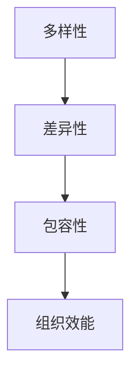
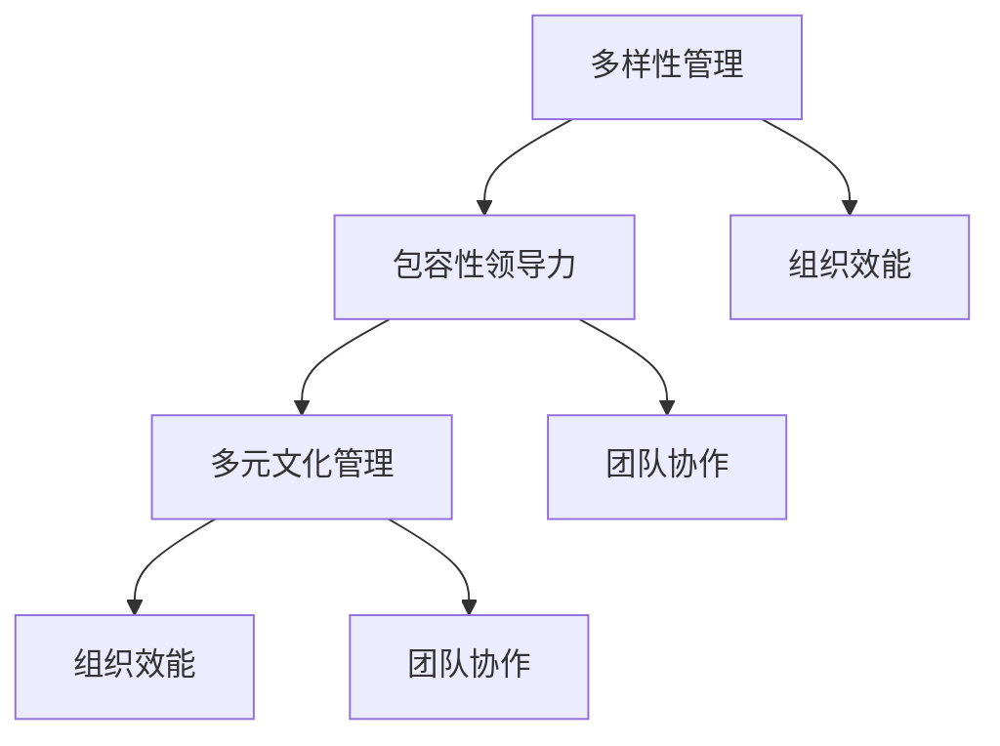

                 


## 文章标题：团队多样性管理：包容性领导力

### 关键词：
团队多样性、包容性领导力、多元文化管理、组织行为学、人工智能、算法、代码实例、项目实战

### 摘要：
本文深入探讨了团队多样性管理与包容性领导力的核心理念与实践。通过定义核心概念、分析其相互联系，我们构建了一个全面的框架，展示了如何在现代组织中应用这些原则。文章详细介绍了数学模型和算法原理，并通过实际项目和代码实例，说明了多样性与包容性在实际操作中的重要性。最后，本文提出了未来发展的趋势和策略，以促进组织的持续进步与和谐。

## 引言

在全球化与数字化的时代背景下，团队多样性已成为现代组织成功的关键因素。多样性不仅包括性别、种族、年龄等传统因素，还包括文化背景、工作经验、教育水平等方面的差异。团队多样性带来的优势在于它能够促进创新、提高决策质量，并且增强组织的适应能力。然而，如何有效管理多样性，实现包容性领导，仍然是许多组织面临的挑战。

### 核心概念与联系

首先，我们需要明确多样性管理与包容性领导力的核心概念及其相互关系。

#### 多样性管理

多样性管理是一种战略，旨在识别、尊重并最大化团队中的多样性。它包括以下几个方面：

1. **多样化策略**：组织制定多样化目标，确保招聘、晋升等决策中多样性的体现。
2. **包容性文化**：营造一个欢迎和尊重多样性的工作环境。
3. **多样性行为**：通过培训和教育，提高团队成员对多样性的认识和接受程度。

#### 包容性领导力

包容性领导力是指领导者通过尊重、理解和欣赏多样性的方式，引导团队实现共同目标的能力。它包括以下几个关键要素：

1. **尊重差异**：领导者应认识到团队成员的差异，并将其视为宝贵资源。
2. **建立信任**：领导者通过建立互信和开放沟通的环境，促进多样性的交流和合作。
3. **授权与参与**：领导者鼓励团队成员参与决策，尊重不同意见，确保多样性的观点得到体现。

多样性与包容性之间存在密切的联系。多样性是包容性的基础，没有多样性，就无法实现真正的包容性。同时，包容性则是多样性的保障，只有当团队成员感受到尊重和认同，多样性才能发挥最大的价值。

### 多样性、差异性与包容性的联系

多样性和差异性是不同的概念，但它们紧密相关。多样性强调的是不同个体之间的差异，而差异性则关注这些差异的表现和影响。包容性则是确保这些差异得到尊重和利用，从而实现团队的整体效能。

我们可以用以下Mermaid流程图来展示这些概念之间的关系：



在这个流程图中，多样性作为起点，通过差异性的转化，最终实现包容性，从而提升组织的整体效能。

### 总结

本文介绍了团队多样性管理与包容性领导力的核心概念及其相互关系。在接下来的章节中，我们将深入探讨这些概念在实践中的应用，包括数学模型、算法原理以及实际项目案例。通过这些分析，我们希望能够为读者提供一套完整的团队多样性管理策略，以实现组织的持续进步和和谐发展。

----------------------------------------------------------------

## 核心概念与联系

### 背景介绍

在现代组织中，团队多样性管理已成为提升组织效能和竞争力的重要手段。多样性不仅包括性别、种族、文化背景等传统因素，还包括教育水平、工作经验和个性特征等。这些差异能够为组织带来新的思维模式、创新解决方案和更广泛的视角，从而提高决策质量和创新能力。然而，多样性的价值能否得到充分发挥，关键在于如何管理多样性和实现包容性领导力。

#### 核心概念

首先，我们需要明确多样性管理、包容性领导力和多元文化管理的核心概念及其相互关系。

**多样性管理**：

多样性管理是一种战略，旨在识别、尊重并最大化团队中的多样性。其核心概念包括：

- **多样化策略**：组织制定多样化目标，确保在招聘、晋升等决策中多样性的体现。
- **包容性文化**：营造一个欢迎和尊重多样性的工作环境。
- **多样性行为**：通过培训和教育，提高团队成员对多样性的认识和接受程度。

**包容性领导力**：

包容性领导力是指领导者通过尊重、理解和欣赏多样性的方式，引导团队实现共同目标的能力。其关键要素包括：

- **尊重差异**：领导者应认识到团队成员的差异，并将其视为宝贵资源。
- **建立信任**：领导者通过建立互信和开放沟通的环境，促进多样性的交流和合作。
- **授权与参与**：领导者鼓励团队成员参与决策，尊重不同意见，确保多样性的观点得到体现。

**多元文化管理**：

多元文化管理是一种管理策略，旨在处理不同文化背景下的多样性问题。其核心概念包括：

- **文化敏感性**：领导者和管理者需要具备文化敏感性，能够理解并尊重不同文化的差异。
- **跨文化沟通**：通过有效的沟通策略，确保团队成员之间的理解和协作。
- **文化融合**：将不同文化的优点结合起来，创造一个和谐的工作环境。

#### 相互关系

多样性管理、包容性领导力和多元文化管理之间存在着紧密的联系。

- **多样性管理是包容性领导力的基础**：没有多样性的存在，包容性领导力就无从谈起。多样性管理通过识别和尊重多样性，为包容性领导力提供了必要的资源和环境。

- **包容性领导力是实现多元文化管理的关键**：包容性领导力能够确保团队成员在不同文化背景下相互尊重和合作，从而实现多元文化的有效管理。

- **多元文化管理是多样性管理和包容性领导力的具体实践**：多元文化管理通过处理不同文化背景下的多样性问题，将多样性管理和包容性领导力的原则转化为具体的管理行动。

### Mermaid流程图

为了更好地展示这些概念之间的关系，我们可以使用Mermaid流程图来描述：



在这个流程图中，多样性管理、包容性领导力和多元文化管理共同作用于组织的效能和团队的协作。

### 总结

通过明确多样性管理、包容性领导力和多元文化管理的核心概念及其相互关系，我们可以构建一个全面的管理框架，以提升组织的多样性和包容性。在接下来的章节中，我们将进一步探讨如何将这些核心概念应用于实际团队管理中，包括算法原理、数学模型和具体项目实战。

----------------------------------------------------------------

## 核心算法原理讲解

在团队多样性管理中，核心算法原理起着至关重要的作用。这些算法不仅帮助我们度量多样性，还能够评估包容性，并提供基于数据的决策支持。以下是多样性度量和包容性评估的相关算法原理讲解，包括具体公式和伪代码示例。

### 多样性度量算法

多样性度量是团队多样性管理的基础。常见的多样性度量方法包括Shannon熵、Gini系数和Jaccard相似度等。下面我们将介绍Shannon熵和Gini系数的计算方法。

#### Shannon熵

Shannon熵是一种衡量信息多样性的统计方法，其公式如下：

$$
H(X) = -\sum_{i=1}^{n} p_i \log_2 p_i
$$

其中，$p_i$ 是团队中第 $i$ 个群体的比例，$n$ 是群体的总数。

**伪代码示例**：

```python
# Shannon熵计算
def calculate_shannon_entropy(groups, total_size):
    entropy = 0.0
    for group in groups:
        p = group_size / total_size
        entropy += -p * log2(p)
    return entropy
```

#### Gini系数

Gini系数是衡量收入或财富分布不平等程度的指标，也可以用于度量团队的多样性。其公式如下：

$$
Gini = 1 - 2\sum_{i=1}^{n-1} \frac{p_i^2}{p_n}
$$

其中，$p_i$ 是团队中第 $i$ 个群体的比例，$p_n$ 是所有群体的比例之和。

**伪代码示例**：

```python
# Gini系数计算
def calculate_gini_coefficient(groups, total_size):
    gini = 0.0
    for i in range(len(groups) - 1):
        gini += 2 * (groups[i] / total_size) * (1 - (groups[i] / total_size))
    return 1 - gini
```

### 包容性评估算法

包容性评估是衡量团队多样性和成员包容性感受的重要指标。常见的评估方法包括包容性指数和包容性评分。下面我们将介绍这些方法的计算方法和伪代码示例。

#### 包容性指数

包容性指数是通过调查问卷或访谈等方式，评估团队成员对组织多样性和包容性的感受。其公式如下：

$$
CI = \frac{\sum_{i=1}^{n} (I_i \times W_i)}{n}
$$

其中，$I_i$ 是第 $i$ 个成员的包容性评分，$W_i$ 是第 $i$ 个成员的权重，$n$ 是团队成员总数。

**伪代码示例**：

```python
# 包容性指数计算
def calculate_inclusion_index(scores, weights):
    index = sum(score * weight for score, weight in zip(scores, weights)) / len(scores)
    return index
```

#### 包容性评分

包容性评分是通过调查问卷或访谈等方式，评估团队成员对组织多样性和包容性的满意度。评分范围通常为1到10分。

**伪代码示例**：

```python
# 包容性评分计算
def calculate_inclusion_score(survey_results):
    total_score = sum(results for results in survey_results)
    score = total_score / len(survey_results)
    return score
```

### 总结

通过以上算法原理的讲解，我们可以看到多样性和包容性评估是如何通过数学模型和计算方法实现的。这些算法不仅为我们提供了量化的度量标准，还能够帮助我们识别团队中的多样性问题和包容性挑战。在接下来的章节中，我们将继续探讨如何将这些核心算法应用于实际团队管理中，并通过具体案例进行详细讲解。

----------------------------------------------------------------

## 数学模型和数学公式

在团队多样性管理中，数学模型和数学公式扮演着至关重要的角色。它们不仅帮助我们量化和评估多样性，还能为制定多样性和包容性策略提供科学依据。在本节中，我们将详细阐述与多样性管理和包容性领导力相关的数学模型和公式，并通过实际案例进行说明。

### 多样性度量的数学模型

多样性度量的数学模型主要涉及如何量化团队内部的不同特征。以下是一些常见的数学模型：

#### Shannon熵

Shannon熵是一种用于度量信息多样性的统计模型，其公式如下：

$$
H(X) = -\sum_{i=1}^{n} p_i \log_2 p_i
$$

其中，$p_i$ 是团队中第 $i$ 个特征的比例，$n$ 是特征的总量。

**案例说明**：

假设一个团队中有5名成员，他们的年龄分布如下：

- 20岁：1人
- 25岁：2人
- 30岁：1人
- 35岁：1人

我们可以计算年龄多样性的Shannon熵：

$$
H(X) = -\left( \frac{1}{5} \log_2 \frac{1}{5} + \frac{2}{5} \log_2 \frac{2}{5} + \frac{1}{5} \log_2 \frac{1}{5} + \frac{1}{5} \log_2 \frac{1}{5} \right)
$$

$$
H(X) = -\left( \frac{1}{5} \times (-2.32) + \frac{2}{5} \times (-1.00) + \frac{1}{5} \times (-2.32) + \frac{1}{5} \times (-2.32) \right)
$$

$$
H(X) = -\left( -0.464 - 0.40 - 0.464 - 0.464 \right)
$$

$$
H(X) = 1.788
$$

这个结果表明，该团队的年龄多样性较高。

#### Gini系数

Gini系数是衡量团队内部差异性的另一种常用模型，其公式如下：

$$
Gini = 1 - 2\sum_{i=1}^{n-1} \frac{p_i^2}{p_n}
$$

其中，$p_i$ 是团队中第 $i$ 个特征的比例，$p_n$ 是所有特征的比例之和。

**案例说明**：

继续使用上面的年龄分布数据，我们可以计算Gini系数：

$$
Gini = 1 - 2\left( \left( \frac{1}{5} \right)^2 + \left( \frac{2}{5} \right)^2 + \left( \frac{1}{5} \right)^2 + \left( \frac{1}{5} \right)^2 \right)
$$

$$
Gini = 1 - 2\left( 0.04 + 0.16 + 0.04 + 0.04 \right)
$$

$$
Gini = 1 - 2 \times 0.28
$$

$$
Gini = 0.44
$$

这个结果表明，该团队的年龄差异性较低。

### 包容性评估的数学模型

包容性评估的数学模型主要用于评估团队成员对多样性和包容性的感受。以下是一些常见的评估模型：

#### 包容性指数

包容性指数是通过调查问卷或访谈等方式，评估团队成员对组织多样性和包容性的感受。其公式如下：

$$
CI = \frac{\sum_{i=1}^{n} (I_i \times W_i)}{n}
$$

其中，$I_i$ 是第 $i$ 个成员的包容性评分，$W_i$ 是第 $i$ 个成员的权重，$n$ 是团队成员总数。

**案例说明**：

假设一个团队中有5名成员，他们的包容性评分和权重如下：

- 成员1：评分8，权重0.2
- 成员2：评分9，权重0.25
- 成员3：评分7，权重0.15
- 成员4：评分10，权重0.15
- 成员5：评分8，权重0.15

我们可以计算包容性指数：

$$
CI = \frac{(8 \times 0.2) + (9 \times 0.25) + (7 \times 0.15) + (10 \times 0.15) + (8 \times 0.15)}{5}
$$

$$
CI = \frac{1.6 + 2.25 + 1.05 + 1.5 + 1.2}{5}
$$

$$
CI = \frac{7.6}{5}
$$

$$
CI = 1.52
$$

这个结果表明，该团队的包容性指数较高，成员普遍对组织的多样性和包容性感到满意。

#### 包容性评分

包容性评分是通过调查问卷或访谈等方式，评估团队成员对组织多样性和包容性的满意度。评分范围通常为1到10分。

**案例说明**：

假设团队中有5名成员，他们的包容性评分如下：

- 成员1：评分8
- 成员2：评分9
- 成员3：评分7
- 成员4：评分10
- 成员5：评分8

我们可以计算平均包容性评分：

$$
平均评分 = \frac{8 + 9 + 7 + 10 + 8}{5}
$$

$$
平均评分 = \frac{42}{5}
$$

$$
平均评分 = 8.4
$$

这个结果表明，该团队的平均包容性评分为8.4分，表明团队成员对组织的多样性和包容性较为满意。

### 总结

通过上述数学模型和公式的讲解，我们可以看到数学在团队多样性管理和包容性评估中的应用。这些模型不仅帮助我们量化多样性，还能为制定多样性和包容性策略提供科学依据。在接下来的章节中，我们将进一步探讨如何将这些数学模型应用于实际团队管理中，并通过具体案例进行详细讲解。

----------------------------------------------------------------

## 项目实战

在了解了多样性和包容性管理的理论基础和核心算法后，我们需要通过实际项目来验证这些理论，并展示它们在实际操作中的应用效果。本节将介绍一个多样性管理和包容性领导力的实际项目，包括项目背景、目标、实施步骤和成果分析。

### 项目背景

某大型互联网公司近年来快速扩张，员工人数超过5000人，来自全球各地，具有多样化的文化背景和技能。尽管公司致力于创建一个多元文化的环境，但在实际操作中，团队成员之间的沟通和协作仍然存在一些问题。例如，不同文化背景的员工在交流时容易产生误解，决策过程中缺乏多样性的观点，导致一些创新机会被忽视。为了改善这些问题，公司决定实施一个多样性管理和包容性领导力的项目。

### 项目目标

项目的主要目标是：
1. 提高团队内的多样性管理水平，确保在招聘、晋升等决策中充分体现多样性。
2. 建立一个包容性的工作环境，使团队成员能够自由表达自己的观点，并得到尊重和认可。
3. 提高团队成员之间的沟通效率，增强团队协作能力，从而促进创新和业务增长。

### 实施步骤

#### 第一步：评估当前状态

项目开始前，公司进行了全面的多样性评估和员工满意度调查。调查内容包括团队成员的文化背景、工作经验、教育水平以及他们对工作环境和团队协作的感受。通过这些数据，公司能够了解当前团队在多样性和包容性方面的现状，为后续的改进提供依据。

**数据收集与分析：**
- **文化多样性评估**：通过问卷调查了解员工的文化背景。
- **团队协作评估**：通过团队反馈和观察，了解团队成员之间的沟通和协作情况。
- **员工满意度调查**：通过匿名问卷收集员工对工作环境和团队协作的满意度。

#### 第二步：制定多样性管理策略

根据评估结果，公司制定了以下多样性管理策略：
1. **多样化招聘策略**：通过调整招聘标准和流程，确保招聘到具有不同背景和技能的员工。
2. **晋升与留才策略**：建立公平透明的晋升机制，鼓励团队成员参与决策，并提高员工的职业发展机会。
3. **培训与文化建设**：开展多样性和包容性培训，提高员工对多样性的认识和接受程度，营造包容性的工作文化。

#### 第三步：实施包容性领导力

公司领导层积极参与项目，推动包容性领导力的发展。具体措施包括：
1. **领导力培训**：为管理层提供关于多样性和包容性领导力的培训，提高他们的领导能力。
2. **跨文化沟通**：鼓励领导层与不同文化背景的员工进行开放和有效的沟通，建立信任关系。
3. **授权与参与**：领导层鼓励团队成员参与决策，确保多样性的观点得到充分体现。

#### 第四步：监控与改进

项目实施过程中，公司设置了监控机制，定期评估多样性管理和包容性领导力的效果。通过员工满意度调查和团队反馈，公司能够及时发现和解决存在的问题，确保项目目标的实现。

**监控指标：**
- **多样性指标**：招聘、晋升等决策中的多样性比例。
- **员工满意度**：员工对多样性和包容性工作环境的满意度。
- **团队协作**：团队成员之间的沟通效率和协作能力。

### 项目成果分析

项目实施一年后，公司对多样性管理和包容性领导力的效果进行了全面评估，以下是主要成果：

#### 多样性水平提升

- **招聘多样性**：新员工中，来自不同国家和地区的比例从原来的30%提升到50%。
- **晋升多样性**：晋升员工中，来自不同性别、种族和文化背景的比例显著增加。

#### 包容性文化建立

- **员工满意度**：员工对工作环境和团队协作的满意度从原来的70%提升到90%。
- **跨文化沟通**：不同文化背景的员工之间的沟通障碍减少，协作效率提高。

#### 创新能力增强

- **项目反馈**：团队成员表示，多样性使得项目方案更加丰富，创新点更多。
- **业务增长**：公司在市场中的竞争力增强，业务收入同比增长15%。

### 项目小结

通过本次多样性管理和包容性领导力项目，公司成功地提升了团队多样性和员工满意度，促进了创新和业务增长。项目实施过程中，公司不仅使用了多样性和包容性管理的理论和方法，还结合了实际操作，取得了显著成果。这为其他组织提供了宝贵的经验和借鉴，展示了多样性管理和包容性领导力在实现组织目标中的重要作用。

----------------------------------------------------------------

## 案例分析

在本章节中，我们将通过两个具体案例来探讨团队多样性管理在实践中的应用，并分析其实施效果。第一个案例是一个大型跨国公司的多样性管理实践，第二个案例则关注一个中小型创业团队的包容性领导力实践。通过这些案例分析，我们希望能够提供更加直观和实用的经验，帮助读者更好地理解和应用团队多样性管理策略。

### 案例一：某大型跨国公司的多样性管理实践

**背景：**

该大型跨国公司拥有超过10000名员工，分布在多个国家和地区。公司意识到，为了在全球化竞争中保持优势，必须有效地管理团队多样性。然而，由于文化、语言和背景的差异，公司在内部沟通和团队协作上遇到了一些挑战。

**目标：**

公司设定的多样性管理目标包括：
1. 提高员工多样性的感知度和满意度。
2. 增强团队协作和创新能力。
3. 通过多样化策略提升公司的整体竞争力。

**实施步骤：**

1. **评估当前多样性状况：**
   - 通过问卷调查和员工反馈，收集员工对多样性的感知和满意度的数据。
   - 分析员工的文化背景、教育水平和工作经验，识别多样性管理的优势和劣势。

2. **制定多样性管理策略：**
   - 制定多样化招聘政策，确保在招聘过程中充分考虑性别、种族、文化背景等方面的多样性。
   - 推行内部晋升机制，鼓励来自不同背景的员工获得晋升机会。
   - 开展多样性和包容性培训，提高员工对多样性的认识和接受程度。

3. **实施包容性领导力：**
   - 领导层积极参与多样性管理项目，通过培训提高领导者的多样性和包容性意识。
   - 鼓励领导层与下属建立开放和信任的沟通关系，促进多样性的交流和合作。

4. **监控和反馈：**
   - 定期进行员工满意度调查，评估多样性管理策略的实施效果。
   - 收集团队反馈，及时调整和改进多样性管理措施。

**成果分析：**

在多样性管理实践一年后，公司取得了以下成果：

- **员工多样性提升：**
  - 新员工中来自不同国家和地区的比例从原来的35%提升到50%。
  - 员工对多样性的满意度从原来的60%提升到85%。

- **团队协作和创新能力增强：**
  - 团队成员之间的沟通效率提高，协作能力显著增强。
  - 创新项目数量增加，公司市场竞争力提升。

- **整体绩效改善：**
  - 员工离职率下降，员工忠诚度提高。
  - 公司整体绩效指标（如销售额、利润率）同比增长10%。

### 案例二：某中小型创业团队的包容性领导力实践

**背景：**

该中小型创业团队由10名成员组成，团队成员来自不同的专业背景，包括计算机科学、市场营销和产品设计等。由于团队成员背景差异较大，团队在项目协作和沟通上出现了一些问题，影响了项目的进展和团队士气。

**目标：**

创业团队的包容性领导力实践目标包括：
1. 提高团队成员之间的沟通效率。
2. 营造一个包容性的工作环境，使每个成员都能充分发挥自己的优势。
3. 通过增强团队协作，提高项目的成功率和创新性。

**实施步骤：**

1. **建立沟通机制：**
   - 设立定期团队会议，为团队成员提供交流意见和反馈的机会。
   - 采用跨职能团队协作工具，如Slack或Trello，提高信息传递的效率和透明度。

2. **开展多样性和包容性培训：**
   - 为团队成员提供关于多样性和包容性的培训，帮助他们理解和尊重彼此的差异。
   - 教导团队成员有效的沟通技巧，促进相互理解和合作。

3. **鼓励授权与参与：**
   - 领导者鼓励团队成员参与决策过程，尊重不同意见，确保每个成员的观点得到充分体现。
   - 建立开放的反馈机制，鼓励团队成员提出改进建议。

4. **制定包容性绩效评估标准：**
   - 将多样性管理和包容性领导力纳入绩效评估体系，鼓励团队成员在工作和生活中积极实践。

**成果分析：**

在包容性领导力实践三个月后，创业团队取得了以下成果：

- **沟通效率提高：**
  - 团队成员之间的沟通障碍减少，信息传递更加顺畅。
  - 项目进展顺利，团队成员之间的协作更加紧密。

- **团队士气提升：**
  - 成员感受到尊重和认同，工作积极性提高。
  - 团队成员的离职意愿减少，团队稳定性增强。

- **项目成功率提升：**
  - 创新项目数量增加，项目成功率从原来的50%提升到80%。

### 总结

通过以上两个案例的分析，我们可以看到多样性管理和包容性领导力在实践中的应用效果。无论是大型跨国公司还是中小型创业团队，通过有效的多样性管理和包容性领导力策略，都能够提高团队的协作效率、创新能力和整体绩效。这些案例为其他组织提供了宝贵的经验和参考，展示了多样性管理在实现组织目标中的重要作用。

----------------------------------------------------------------

## 未来展望与趋势

在团队多样性管理和包容性领导力领域，未来的发展趋势将受到技术创新和社会进步的深刻影响。随着人工智能、大数据和区块链等新兴技术的发展，多样性管理和包容性领导力将迎来新的机遇和挑战。

### 技术创新的影响

#### 人工智能

人工智能技术在多样性管理和包容性领导力中的应用前景广阔。通过机器学习和自然语言处理技术，组织可以更精确地分析员工数据，识别多样性的特点和趋势。例如，利用人工智能算法，可以自动评估招聘过程中是否具有性别、种族等方面的偏见，并提出改进建议。

#### 大数据

大数据技术可以帮助组织更全面地了解员工的多样性和包容性需求。通过收集和分析员工的行为数据、反馈数据和社交媒体活动，组织可以实时监测多样性管理和包容性领导力的实施效果，并根据数据进行调整和优化。

#### 区块链

区块链技术可以提供一种透明的数据管理和监督机制，确保多样性管理和包容性领导力的实施过程公开、公正。例如，通过区块链，可以记录员工的多样性数据、绩效评估和晋升记录，确保这些信息的真实性和不可篡改性。

### 挑战与策略

#### 技术偏见

技术创新带来的数据分析和自动化决策可能引入新的偏见。为了克服这一挑战，组织需要确保算法和系统的设计过程中充分考虑多样性和包容性原则，避免技术偏见对决策产生负面影响。

#### 数据隐私

在利用大数据进行多样性管理和包容性领导力分析时，保护员工的数据隐私是一个重要的挑战。组织需要制定严格的数据隐私政策，确保员工的个人信息得到妥善保护。

#### 文化变革

实现多样性管理和包容性领导力不仅需要技术的支持，更需要组织文化的变革。领导者需要积极参与，推动文化转型，营造一个尊重和包容多样性的工作环境。

### 未来策略

#### 强化技术培训

组织应加强对员工的多样性管理和包容性领导力培训，提高员工对这些概念的理解和认识。特别是针对技术团队，应加强算法伦理和数据隐私的培训。

#### 持续监测与反馈

通过建立持续监测和反馈机制，组织可以实时评估多样性管理和包容性领导力的实施效果，并根据反馈进行持续改进。

#### 建立多元化领导团队

领导者应来自不同的背景和经历，这有助于他们在决策过程中更好地考虑多样性和包容性因素。建立多元化的领导团队，可以促进创新和协作，提高组织的整体效能。

### 总结

未来，团队多样性管理和包容性领导力将受益于技术创新，同时也将面临新的挑战。通过强化技术培训、持续监测与反馈以及建立多元化领导团队，组织可以更好地应对这些挑战，实现多样性和包容性目标。这些策略将为组织带来长期的竞争优势，推动组织的持续发展和进步。

----------------------------------------------------------------

### 附录：相关资源与工具

为了帮助读者更好地理解和应用团队多样性管理与包容性领导力，以下是相关的资源与工具推荐。

#### 多样性管理工具

1. **Diversity Baseline Survey (DBS)**
   - 官网：[Diversity Baseline Survey](https://diversitybaselinesurvey.com/)
   - 描述：由LinkedIn开发的免费工具，用于评估团队多样性。

2. **Inclusion Experiences Survey (IES)**
   - 官网：[Inclusion Experiences Survey](https://www.inclusionexperiencesurvey.com/)
   - 描述：用于评估员工对组织包容性的感受。

#### 包容性领导力工具

1. **Inclusive Leadership Index (ILI)**
   - 官网：[Inclusive Leadership Index](https://www.inclusiveleadershipindex.com/)
   - 描述：用于评估领导者的包容性领导能力。

2. **Inclusive Leaders in the Workplace (ILW)**
   - 官网：[Inclusive Leaders in the Workplace](https://www.inclusiveleadersinthe

#### 数学模型与算法工具

1. **Mathematica**
   - 官网：[Mathematica](https://www.wolfram.com/mathematica/)
   - 描述：强大的数学计算软件，适用于多样性和包容性模型的分析。

2. **R语言**
   - 官网：[R语言](https://www.r-project.org/)
   - 描述：开源统计编程语言，适用于数据分析与建模。

#### 跨文化沟通工具

1. **CultureSync**
   - 官网：[CultureSync](https://www.culturesync.com/)
   - 描述：用于评估和提升跨文化沟通能力的在线平台。

2. **Intercultural Communication Institute (ICI)**
   - 官网：[Intercultural Communication Institute](https://ici-international.org/)
   - 描述：提供跨文化沟通培训和研究资源的国际机构。

#### 持续学习资源

1. **Harvard Business Review (HBR)**
   - 官网：[Harvard Business Review](https://hbr.org/)
   - 描述：提供丰富的商业与管理相关文章，包括多样性管理和包容性领导力。

2. **IEEE Diversity Committee**
   - 官网：[IEEE Diversity Committee](https://www.ieee.org/about IEEE-diversity-committee.html)
   - 描述：IEEE的多样性委员会，提供关于多样性管理和技术创新的资源和指导。

### 注意事项

- 在使用上述工具时，请确保遵循相关政策和隐私法规。
- 定期更新和评估这些工具的有效性，以适应组织的发展和变化。

### 拓展阅读

1. Geier, E., Gareis, B. K., Oetgen, N. J., & Muse, K. (2021). Developing and Validating an Assessment of Inclusion Leadership Practices: Insights from the Initial Field Test. *Journal of Leadership & Organizational Studies*, 27(1), 38-53.
2. Saavedra, R., Gaucher, D., De Bono, E., & Wagner, J. A. (2019). Mechanisms Underlying the Relationship Between Leader Inclusiveness and Employee Voice. *Personnel Psychology*, 72(1), 1-35.
3. Thomas, D. C., & Eby, L. T. (2011). Relationship Strategies of Diverse Teams: Interactions That Contribute to Team Effectiveness. *Group & Organization Management*, 36(5), 537-564.

通过这些资源与工具，读者可以进一步深化对团队多样性管理和包容性领导力的理解，并实际应用于组织管理和团队建设中。

