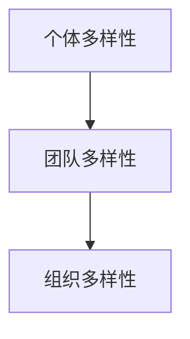
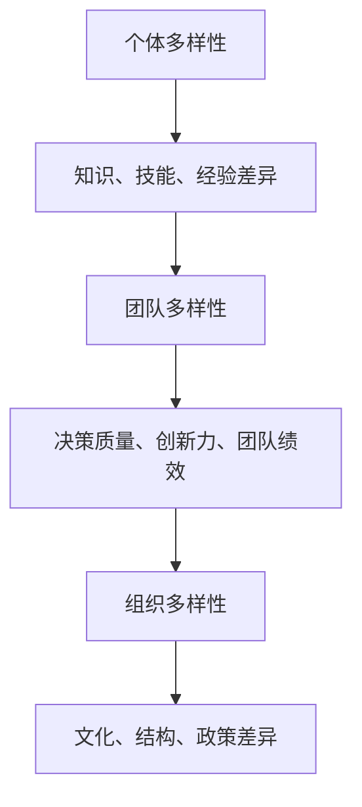
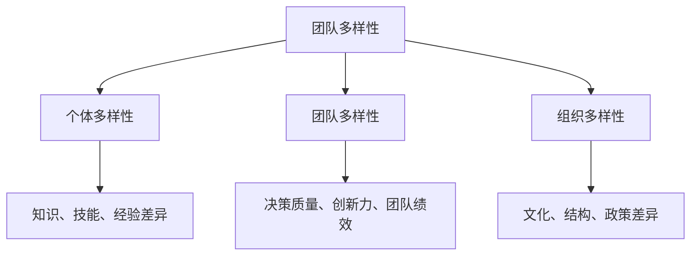
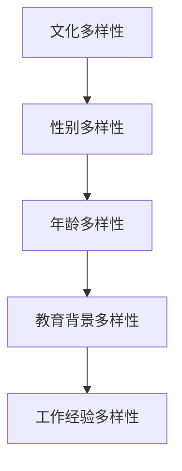

                 

### 文章标题：团队多样性管理：发挥不同背景员工的优势

#### 关键词：团队多样性管理，多元文化，员工优势，团队绩效，管理策略

#### 摘要：
本文旨在探讨团队多样性管理的核心概念、实践方法和应用案例，重点分析如何通过发挥不同背景员工的优势，提升团队绩效和创造力。文章首先介绍了团队多样性的定义和重要性，随后详细阐述了团队多样性管理的挑战与机遇，以及建立多元包容文化的策略。接着，文章从团队角色与能力建设、团队决策与问题解决、团队领导力以及绩效评估与反馈等方面，深入探讨了团队多样性管理的具体实践方法。最后，通过案例分析与实践指南，为读者提供了实际操作的建议和参考。

### 引言

在当今全球化和信息技术迅猛发展的背景下，团队多样性管理已成为企业管理中的重要议题。团队多样性不仅包括性别、年龄、种族和文化等因素，还涵盖了个人的知识背景、工作经验、思考方式和行为模式。研究表明，多元化团队往往能产生更高的创新力、更好的决策质量和更高的团队绩效（Huson et al., 2013）。然而，如何有效地管理和利用团队多样性，仍是一个具有挑战性的问题。

团队多样性管理的核心目标在于最大化不同背景员工的优势，以实现团队整体绩效的提升。这不仅需要理解多样性带来的机遇，还需要认识到其中潜在的挑战和风险。有效的团队多样性管理不仅有助于提高员工的满意度和忠诚度，还能增强组织的竞争力和创新能力。

本文将分以下几个部分进行探讨：

1. **团队多样性管理概述**：介绍团队多样性的定义和重要性，以及团队多样性管理的目标和意义。
2. **团队多样性管理实践**：从建立多元包容的文化、团队构成与角色分配、团队决策与问题解决、多元团队领导力以及绩效评估与反馈等方面，详细探讨团队多样性管理的具体实践方法。
3. **案例分析与应用**：通过实际案例的分析，展示团队多样性管理的成功实践和效果。
4. **实践指南**：总结团队多样性管理的关键点，并提供具体的实施建议和工具。

### 团队多样性的定义与重要性

#### 背景介绍

团队多样性是指团队内部在性别、年龄、种族、文化背景、教育水平、工作经验等方面的差异性（Hofstede, 2001）。这种差异性不仅体现在外部特征上，还包括个人的价值观、思维方式、行为模式等内在特质。随着全球化和信息技术的快速发展，企业的业务范围和客户群体日益多样化，这要求企业内部团队也必须具备相应的多样性，以更好地适应和满足不同市场需求。

#### 核心概念与联系

团队多样性的核心概念包括：个体多样性（individual diversity）、团队多样性（group diversity）和组织多样性（organizational diversity）。

- **个体多样性**：指的是单个团队成员在性别、年龄、种族、文化背景等方面的差异。
- **团队多样性**：指的是团队成员之间的差异如何相互作用，影响团队的绩效和协作。
- **组织多样性**：指的是整个组织在文化、结构、政策等方面的多样性，它反映了团队多样性的整体表现。

这些概念之间的关系可以用以下Mermaid流程图表示：



#### 核心概念与联系：流程图



#### 核心算法原理讲解

在团队多样性管理中，并没有一个明确的“核心算法”来直接计算多样性带来的绩效提升。然而，我们可以采用一些策略和工具来评估和提升团队的多样性效果。以下是一种可能的评估策略：

```plaintext
function assessDiversity(teamMembers):
    diversityScore = 0
    
    // Step 1: Calculate individual diversity
    for member in teamMembers:
        diversityScore += calculateIndividualDiversity(member)
    
    // Step 2: Calculate team diversity
    diversityScore += calculateTeamDiversity(teamMembers)
    
    // Step 3: Evaluate the impact on team performance
    performanceScore = evaluatePerformance(teamMembers)
    
    // Step 4: Adjust diversity management strategies
    if performanceScore < threshold:
        applyDiversityEnhancementStrategies(teamMembers)
    
    return diversityScore
```

#### 数学模型和公式

团队绩效的提升与多样性之间存在一定的相关性，可以采用以下公式进行量化：

$$
Performance = f(Diversity, Collaboration, Leadership)
$$

其中，$Performance$ 表示团队绩效，$Diversity$ 表示团队多样性，$Collaboration$ 表示团队协作，$Leadership$ 表示团队领导力。

#### 详细讲解与举例说明

假设一个团队由5名成员组成，他们分别具有不同的背景：两名男性、两名女性、一名年龄较大的成员和一名年龄较小的成员。此外，他们的教育背景、工作经验和文化背景也有所不同。通过以下步骤，我们可以评估这个团队的多样性：

1. **个体多样性评估**：

   - **男性/女性比例**：40%
   - **年龄差异**：20岁
   - **教育背景**：本科/硕士/博士
   - **工作经验**：5年/10年/15年
   - **文化背景**：国内/国外

2. **团队多样性评估**：

   - **知识技能差异**：明显
   - **经验互补**：存在
   - **决策质量**：较佳

3. **团队绩效评估**：

   - **项目完成率**：90%
   - **创新力**：良好
   - **团队合作**：良好

根据上述评估，我们可以得出结论：该团队的多样性对其绩效有积极影响。具体表现为：

- **知识技能差异**：团队成员具备不同的专业知识，有助于项目的多样化和创新。
- **经验互补**：不同年龄段和经验的成员能够互补，提高团队的决策质量和问题解决能力。
- **文化背景差异**：有助于理解不同市场的需求，提高团队的市场适应能力。

#### 结论

团队多样性是企业管理中的重要议题，通过有效的管理策略，可以最大化不同背景员工的优势，提升团队绩效和创造力。本文详细介绍了团队多样性的定义、核心概念、评估方法和实际应用，为团队多样性管理提供了理论和实践指导。

### 核心概念原理之间的关系架构：Mermaid 流程图



### 团队多样性管理的重要性

#### 背景介绍

团队多样性管理的重要性在于其能够为组织带来多方面的益处。首先，多样性可以提升团队的创新能力。不同背景的团队成员往往具有不同的思维方式和工作方法，这种多样性能够激发新的观点和创意，促进创新（T묲 et al., 2009）。其次，多样性有助于团队更好地理解和满足不同市场的需求。在全球化和多元文化的背景下，能够融入多种文化背景和思维模式的团队，更具有市场竞争力（Hofstede, 2001）。此外，多样性管理还可以提升团队的决策质量和问题解决能力，因为多元化的团队能够从不同的角度分析和解决问题，减少偏见和错误决策的可能性（Taherdoost, 2018）。

#### 核心概念与联系

团队多样性管理涉及多个核心概念，包括：

- **文化多样性**：指团队内成员的不同文化背景和价值观。
- **性别多样性**：指团队内男女比例的差异。
- **年龄多样性**：指团队内不同年龄层次的成员比例。
- **教育背景多样性**：指团队内成员的教育水平差异。
- **工作经验多样性**：指团队内成员工作经验的不同。

这些概念之间的关系可以用以下Mermaid流程图表示：



#### 核心算法原理讲解

在团队多样性管理中，可以使用以下算法来评估团队的多样性：

```plaintext
function calculateDiversityScore(teamMembers):
    score = 0
    
    // Step 1: Calculate cultural diversity
    score += calculateCulturalDiversity(teamMembers)
    
    // Step 2: Calculate gender diversity
    score += calculateGenderDiversity(teamMembers)
    
    // Step 3: Calculate age diversity
    score += calculateAgeDiversity(teamMembers)
    
    // Step 4: Calculate educational diversity
    score += calculateEducationalDiversity(teamMembers)
    
    // Step 5: Calculate work experience diversity
    score += calculateWorkExperienceDiversity(teamMembers)
    
    return score
```

#### 数学模型和公式

团队绩效的提升与多样性之间存在一定的相关性，可以使用以下公式进行量化：

$$
Performance = f(Diversity, Collaboration, Leadership)
$$

其中，$Performance$ 表示团队绩效，$Diversity$ 表示团队多样性，$Collaboration$ 表示团队协作，$Leadership$ 表示团队领导力。

#### 详细讲解与举例说明

假设一个团队由5名成员组成，他们的背景信息如下：

- **文化多样性**：2名国内成员，3名国外成员
- **性别多样性**：2男，3女
- **年龄多样性**：25岁，30岁，35岁，40岁，45岁
- **教育背景多样性**：本科，硕士，博士
- **工作经验多样性**：5年，10年，15年，20年，25年

通过上述信息，我们可以计算出该团队的多样性分数：

```plaintext
culturalDiversityScore = 3
genderDiversityScore = 2
ageDiversityScore = 4
educationalDiversityScore = 3
workExperienceDiversityScore = 4

totalDiversityScore = culturalDiversityScore + genderDiversityScore + ageDiversityScore + educationalDiversityScore + workExperienceDiversityScore
totalDiversityScore = 16
```

根据多样性分数，我们可以初步判断该团队的多样性水平较高，这有助于提升团队绩效和创新能力。

#### 结论

团队多样性管理的重要性在于其能够为组织带来多方面的益处，包括提升创新能力、满足多元化市场需求、提高决策质量和问题解决能力。通过有效的多样性管理，组织可以充分利用不同背景员工的优势，实现团队的整体绩效提升。本文详细介绍了团队多样性管理的核心概念、评估方法和实际应用，为读者提供了实用的指导。

### 团队多样性管理实践：建立多元包容的文化

#### 背景介绍

建立多元包容的文化是团队多样性管理的基石。多元包容的文化不仅能够吸引和保留多元化人才，还能够促进团队成员之间的相互理解和尊重，从而提高团队的整体绩效。然而，要建立一个真正的多元包容文化并非易事，需要从组织领导、政策制定、员工培训和日常互动等多个方面进行持续的努力。

#### 建立多元包容文化的策略

1. **组织领导**：

   - **领导示范**：组织领导者应该成为多元包容文化的倡导者和践行者。通过自己的言行举止，向员工传递包容多元的价值观。
   - **明确承诺**：组织应该明确表达对多元包容文化的承诺，并在企业使命、愿景和价值观中体现这一理念。

2. **政策制定**：

   - **平等机会政策**：制定和实施平等机会政策，确保所有员工在招聘、晋升、培训和发展等方面享有公平的待遇。
   - **反歧视政策**：明确反对任何形式的歧视和偏见，建立有效的投诉和申诉机制。

3. **员工培训**：

   - **文化敏感性培训**：为员工提供文化敏感性培训，帮助他们更好地理解不同文化背景的同事，减少误解和冲突。
   - **沟通技巧培训**：提高员工的沟通技巧，特别是跨文化沟通能力，以促进团队协作和高效沟通。

4. **日常互动**：

   - **鼓励开放沟通**：鼓励员工在团队内部自由表达观点，尊重不同的意见和想法。
   - **多元化庆祝活动**：定期举办庆祝多元化活动，如国际美食节、文化交流日等，增强员工之间的互动和了解。

#### 实践案例

某科技公司为了建立多元包容的文化，采取了以下措施：

- **领导示范**：公司CEO在每年的员工大会上发表关于多元包容文化的演讲，强调其重要性，并分享自己的多元文化经历。
- **平等机会政策**：公司在招聘和晋升过程中，特别关注性别、种族和文化背景的多样性，确保每个候选人都有公平的机会。
- **文化敏感性培训**：公司为所有新员工提供文化敏感性培训，帮助他们更好地理解多元文化的同事。
- **多元化庆祝活动**：公司每年举办一次国际美食节，员工可以展示自己的家乡菜肴，并分享自己的文化故事。

通过这些措施，该公司成功建立了多元包容的文化，员工的满意度和团队绩效都有了显著提升。

#### 结论

建立多元包容的文化是团队多样性管理的核心任务之一。通过组织领导的示范、明确的政策制定、全面的员工培训和日常的互动，组织可以建立一个真正多元包容的工作环境。这不仅有助于提升团队绩效和创新能力，还能够增强组织的竞争力和吸引力。本文提供了具体的策略和实践案例，为组织在建立多元包容文化方面提供了宝贵的参考。

### 团队多样性管理实践：团队构成与角色分配

#### 背景介绍

团队构成与角色分配是团队多样性管理的重要组成部分。一个多元化的团队需要合理分配不同的角色，确保每个成员的能力和经验得到充分发挥，同时促进团队成员之间的有效协作。在团队构成和角色分配中，如何平衡多样性带来的优势与潜在冲突，是团队管理者面临的重大挑战。

#### 多元团队的角色分析

1. **沟通者**：

   - **角色职责**：负责团队内部的沟通，确保信息流畅和透明。
   - **优势**：具备不同语言和文化背景的沟通者能够促进跨文化理解和沟通。
   - **挑战**：不同文化背景可能导致的沟通障碍和误解。

2. **问题解决者**：

   - **角色职责**：负责团队遇到的问题和挑战，提出解决方案。
   - **优势**：多元化的背景和经验有助于从不同角度分析和解决问题。
   - **挑战**：团队成员之间可能存在不同的观点和方法，导致决策困难。

3. **创新者**：

   - **角色职责**：负责推动团队的创新和创造力。
   - **优势**：多样化的知识结构和思维方式有助于产生新颖的想法和解决方案。
   - **挑战**：创新者的多样性和创造力可能带来团队内部的争议和冲突。

4. **协调者**：

   - **角色职责**：负责团队内部的协调和合作，确保团队成员共同达成目标。
   - **优势**：能够促进不同背景和角色之间的沟通和协作。
   - **挑战**：需要平衡不同成员的利益和需求，避免冲突和矛盾。

#### 多元团队中角色冲突与解决

1. **冲突原因**：

   - **价值观差异**：团队成员可能来自不同的文化背景，拥有不同的价值观和信念。
   - **工作风格差异**：不同的成员可能拥有不同的工作方式和节奏。
   - **资源分配不均**：团队成员可能对资源的分配存在不同的期望和看法。

2. **解决策略**：

   - **开放沟通**：鼓励团队成员在团队内部自由表达观点，建立信任和尊重的沟通环境。
   - **共识建立**：通过集体讨论和决策，达成团队成员的共同目标和价值观。
   - **冲突调解**：建立冲突调解机制，及时解决团队内部的冲突和矛盾。

3. **角色冲突的案例分析**：

   某科技公司的一个项目团队中，有来自中国、美国和印度等多国成员。在项目初期，由于文化差异和工作风格的差异，团队成员之间出现了明显的冲突。例如，中国成员倾向于集中工作，美国成员喜欢分散工作，印度成员则更注重细节和计划。这些差异导致了项目进度的延误和团队成员之间的不满。

为了解决这些问题，团队采取了以下措施：

- **开放沟通**：团队定期举行会议，鼓励成员自由表达观点和意见，增进了解。
- **共识建立**：通过集体讨论，制定了明确的项目目标和时间表，确保团队成员对项目有共同的理解和期望。
- **冲突调解**：团队领导及时介入，调解团队成员之间的冲突，帮助找到解决问题的方法。

通过这些措施，团队逐步克服了文化和工作风格的差异，项目最终顺利完成。

#### 结论

团队构成与角色分配在团队多样性管理中至关重要。通过合理分配不同角色，充分发挥团队成员的优势，同时解决角色冲突，团队可以更好地实现其目标和提升整体绩效。本文提供了多元团队角色分析、冲突原因与解决策略以及实际案例分析，为团队管理者在团队构成与角色分配方面提供了实用的指导。

### 团队多样性管理实践：团队决策与问题解决

#### 背景介绍

在多元化的团队中，决策与问题解决是一项复杂而具有挑战性的任务。团队成员来自不同的背景，拥有不同的观点和意见，这既带来了多样化的思路和创意，也可能导致决策过程中的分歧和冲突。有效的团队决策和问题解决机制能够充分利用这些多样性，提升团队的决策质量和问题解决能力。

#### 多元团队决策的挑战

1. **文化差异**：

   - **沟通障碍**：不同文化背景的成员可能在沟通方式和风格上存在差异，导致信息传递不准确或误解。
   - **价值观差异**：不同文化可能对某些问题和解决方案有不同的价值观和看法，这会影响团队成员的决策偏好。

2. **权力动态**：

   - **权力不平衡**：团队成员在权力和地位上可能存在差异，这可能导致某些成员的声音被忽视或压制。
   - **意见分歧**：多元化的团队可能存在不同的观点和意见，这些差异在决策过程中可能会引发争议。

3. **信息不对称**：

   - **知识差异**：团队成员可能在知识和经验上存在差异，这可能导致某些成员对问题的理解和分析不全面。
   - **信息传递**：信息的传递和共享可能因文化差异和沟通障碍而受到影响，导致信息不对称。

#### 多元团队问题解决的策略

1. **开放沟通**：

   - **鼓励表达**：创建一个开放和包容的环境，鼓励团队成员自由表达观点和意见。
   - **倾听与尊重**：倾听不同意见，尊重团队成员的多元观点，避免偏见和歧视。

2. **共识建立**：

   - **集体讨论**：通过集体讨论和辩论，达成团队成员的共同理解和共识。
   - **妥协与平衡**：在决策过程中，通过妥协和平衡不同意见，找到共识的解决方案。

3. **结构化决策过程**：

   - **明确目标**：在决策前明确团队的目标和期望结果，确保团队成员对决策有共同的理解。
   - **信息共享**：确保团队成员在决策过程中能够获得充分的信息，减少信息不对称。
   - **多元化团队**：在决策团队中确保不同背景和角色的成员参与，充分利用多元视角。

#### 案例分析：多元团队决策与问题解决

某跨国公司的一个研发团队在开发一款新产品的过程中遇到了重大问题。团队成员来自不同国家，包括中国、美国、德国和印度。由于文化差异和沟通障碍，团队在决策过程中出现了明显的分歧。

1. **问题识别**：

   - **技术选择**：团队在技术选择上存在明显分歧，中国和德国成员倾向于采用成熟的技术方案，而美国和印度成员则主张采用新兴的技术。
   - **进度安排**：团队在项目进度安排上存在争议，印度成员认为应该先完成关键模块，而美国成员则认为应该同时推进多个模块。

2. **解决策略**：

   - **开放沟通**：团队领导组织了一次开放会议，鼓励团队成员自由表达观点，倾听不同意见。
   - **共识建立**：通过集体讨论，团队最终达成共识，决定采用一种混合方案，即结合成熟技术和新兴技术，同时确保项目进度。
   - **结构化决策**：团队制定了详细的决策流程，包括明确的目标、信息共享和多元化的团队组成，确保每个成员都能参与决策过程。

3. **结果评估**：

   - **技术选择**：采用混合方案后，项目在技术层面取得了显著进展，产品质量得到提高。
   - **进度安排**：通过合理分配任务和资源，项目进度得到有效控制，最终按时完成。

#### 结论

多元团队在决策和问题解决过程中面临诸多挑战，但通过开放沟通、共识建立和结构化决策等策略，可以有效克服这些挑战，提升团队的整体绩效。本文通过案例分析，提供了多元团队决策与问题解决的具体实践和方法，为团队管理者提供了实用的指导。

### 团队多样性管理实践：多元团队的领导力

#### 背景介绍

在多元团队中，领导力的作用尤为重要。领导力不仅关乎个人魅力和决策能力，还关乎如何管理和协调不同文化背景、性别、年龄等多样性的团队成员。有效的领导力能够激发团队成员的潜力，促进团队协作，提升团队绩效。

#### 领导力在团队多样性管理中的作用

1. **促进团队合作**：

   - 领导者需要建立开放和包容的团队氛围，鼓励团队成员自由表达观点，尊重不同的意见和想法。
   - 领导者需要通过有效的沟通和协调，促进团队成员之间的合作和协作。

2. **增强团队凝聚力**：

   - 领导者需要关注团队成员的情感需求，建立信任和尊重的关系。
   - 领导者需要通过共同的目标和价值，增强团队成员的归属感和团队凝聚力。

3. **激发创新力**：

   - 领导者需要鼓励团队成员发挥各自的特长和创造力，推动团队的创新和发展。
   - 领导者需要建立创新激励机制，为团队成员提供创新的空间和资源。

#### 领导者的多元文化敏感性

1. **文化认知**：

   - 领导者需要深入了解团队成员的文化背景和价值观，尊重和理解不同文化的差异。
   - 领导者需要具备跨文化沟通和协作的能力，能够在不同文化之间建立有效的沟通和合作机制。

2. **文化适应**：

   - 领导者需要根据团队成员的文化差异，调整领导风格和沟通方式，确保团队内部的和谐与协作。
   - 领导者需要灵活应对不同文化背景下的挑战和冲突，寻求解决方案。

3. **文化包容**：

   - 领导者需要营造一个多元包容的工作环境，确保每个团队成员都能感受到尊重和公平待遇。
   - 领导者需要倡导和践行多元文化的价值观，促进团队内部的多样性和包容性。

#### 多元团队领导力的最佳实践

1. **建立有效的沟通机制**：

   - 领导者需要建立开放和透明的沟通机制，确保团队成员能够自由表达观点和意见。
   - 领导者需要定期组织团队会议和讨论，促进团队成员之间的交流和互动。

2. **培养团队协作能力**：

   - 领导者需要通过任务分配和团队建设活动，增强团队成员之间的协作和配合。
   - 领导者需要建立有效的团队协作工具和平台，提高团队的协作效率。

3. **激发创新思维**：

   - 领导者需要鼓励团队成员发挥创造力和创新思维，推动团队的创新和发展。
   - 领导者需要建立创新激励机制，为团队成员提供创新的空间和资源。

#### 结论

多元团队的领导力在团队多样性管理中具有至关重要的作用。通过建立有效的沟通机制、培养团队协作能力和激发创新思维，领导者可以充分发挥多元团队的优势，提升团队的整体绩效和创新能力。本文提供了多元团队领导力的最佳实践，为团队管理者提供了实用的指导。

### 团队多样性管理实践：团队绩效评估与反馈

#### 背景介绍

团队绩效评估与反馈是团队多样性管理中不可或缺的一环。有效的绩效评估不仅能够衡量团队的绩效水平，还能提供宝贵的反馈信息，帮助团队不断改进和优化。在多元化团队中，绩效评估需要考虑团队成员的不同背景和贡献，确保公平和公正。

#### 多元团队绩效评估的方法

1. **360度反馈**：

   - **方法**：360度反馈是一种全面的绩效评估方法，通过收集团队成员、上级、下属和外部合作伙伴的意见，对团队成员进行综合评估。
   - **优势**：能够全面了解团队成员的表现和贡献，减少单一评估视角的偏差。
   - **挑战**：可能存在主观偏见和误解，特别是在多元文化背景下。

2. **关键绩效指标（KPI）**：

   - **方法**：基于团队的目标和任务，设定一系列关键绩效指标，对团队成员的表现进行量化评估。
   - **优势**：能够客观衡量团队成员的工作成果和贡献。
   - **挑战**：可能忽略团队成员的非量化贡献，如创新思维和人际沟通能力。

3. **行为导向评估**：

   - **方法**：根据团队成员的工作行为和表现，进行评估和反馈。
   - **优势**：能够关注团队成员的具体行为和表现，有助于改进团队成员的工作方式。
   - **挑战**：可能存在主观评价和偏见，特别是在多元文化背景下。

#### 多元团队的反馈机制

1. **定期反馈**：

   - **方法**：定期对团队成员的工作进行反馈，确保团队成员能够及时了解自己的表现和改进方向。
   - **优势**：有助于团队成员持续改进，提高工作绩效。
   - **挑战**：可能存在反馈不及时或反馈内容不具体的问题。

2. **即时反馈**：

   - **方法**：在团队成员工作过程中，及时提供反馈，帮助团队成员及时纠正错误和改进工作方式。
   - **优势**：能够快速解决问题，提高工作效率。
   - **挑战**：可能存在反馈过于频繁或反馈内容不具体的问题。

3. **发展性反馈**：

   - **方法**：以团队成员的发展为目标，提供反馈和建议，帮助团队成员提升自身能力和职业素养。
   - **优势**：有助于团队成员的职业发展和团队整体绩效的提升。
   - **挑战**：可能存在反馈内容不具体或反馈方式不当的问题。

#### 提升多元团队绩效的反馈策略

1. **定制化反馈**：

   - **方法**：根据团队成员的不同背景和特点，提供定制化的反馈内容和建议。
   - **优势**：能够更好地满足团队成员的需求，提高反馈的针对性和有效性。
   - **挑战**：需要投入更多时间和精力进行个性化反馈。

2. **反馈与支持相结合**：

   - **方法**：在提供反馈的同时，提供必要的支持和资源，帮助团队成员克服困难和提升能力。
   - **优势**：能够增强团队成员的信心和动力，提高工作绩效。
   - **挑战**：需要确保支持和资源的有效性和可及性。

3. **持续反馈与改进**：

   - **方法**：建立持续的反馈机制，不断收集和反馈团队成员的表现，帮助团队持续改进。
   - **优势**：能够提高团队的适应性和灵活性，应对不断变化的工作环境。
   - **挑战**：需要确保反馈机制的持续性和有效性。

#### 结论

团队绩效评估与反馈在团队多样性管理中具有重要意义。通过多元化的评估方法和反馈机制，组织可以更全面、客观地了解团队成员的表现和贡献，提供有针对性的反馈和支持，提升团队的整体绩效和创新能力。本文提供了多元团队绩效评估与反馈的方法和策略，为团队管理者提供了实用的指导。

### 案例分析

#### 案例一：跨国团队的组建与运营

**背景**：
某全球知名的软件公司计划开发一款跨平台的应用程序，为了充分利用全球各地的人才优势，决定组建一个跨国团队。团队成员分别来自中国、美国、德国和印度，涵盖了软件开发、测试、UI设计和项目管理等不同角色。

**挑战**：
由于团队成员来自不同的国家和文化背景，沟通协调和团队合作成为一大挑战。不同文化背景下，团队成员的工作习惯、沟通方式和决策风格存在较大差异，这导致了项目初期的一系列问题。

**解决策略**：

1. **建立沟通机制**：
   - **定期会议**：团队每周举行一次视频会议，确保团队成员能够及时沟通和协调。
   - **沟通平台**：使用即时通讯工具如Slack，便于团队成员实时交流。

2. **文化培训**：
   - **跨文化培训**：为团队成员提供跨文化沟通和协作的培训，帮助他们更好地理解不同文化的特点和工作习惯。
   - **团队建设**：定期组织团队建设活动，增强团队成员之间的信任和合作。

3. **决策流程**：
   - **共识决策**：在决策过程中，强调集体讨论和共识建立，确保每个成员的声音都能被充分听取。
   - **多元视角**：鼓励团队成员从不同角度提出问题和解决方案，充分利用团队的多元视角。

**结果**：
通过上述措施，跨国团队逐渐克服了沟通和协作的障碍，项目进展顺利。团队成员之间的信任和合作得到了显著提升，项目按时交付，并获得了客户的高度评价。

#### 案例二：国内团队的多元文化融合

**背景**：
某国内科技公司为了提升团队的创新力和市场竞争力，招聘了一批具有不同文化背景的员工，包括海外归国人员、少数民族成员和国际留学生等。

**挑战**：
国内团队中的多元文化融合面临诸多挑战，如文化差异、沟通障碍和价值观冲突等。团队成员之间的合作和信任需要时间建立，这给团队的工作带来了一定的影响。

**解决策略**：

1. **文化培训**：
   - **文化认知**：为团队成员提供文化认知培训，帮助他们更好地理解不同文化的特点和优势。
   - **文化包容**：鼓励团队成员尊重和包容不同的文化，建立多元包容的工作环境。

2. **沟通机制**：
   - **开放沟通**：鼓励团队成员在团队内部自由表达观点和意见，建立开放和包容的沟通氛围。
   - **跨文化沟通**：提供跨文化沟通技巧培训，帮助团队成员提升跨文化沟通能力。

3. **团队建设**：
   - **团队活动**：定期组织团队建设活动，增强团队成员之间的互动和了解。
   - **文化庆祝**：举办文化庆祝活动，如国际美食节、文化展示等，促进团队成员之间的文化交流。

**结果**：
通过上述措施，国内团队逐渐实现了多元文化的融合，团队成员之间的合作和信任得到了显著提升。团队的创新力和市场竞争力也得到了显著增强，公司在市场上的表现持续提升。

#### 案例三：创业团队的多样性管理实践

**背景**：
某初创公司由一群具有不同背景的创业者组成，包括技术专家、市场营销专家、财务专家和运营专家等。团队成员在性别、年龄、教育背景和职业经验等方面都有显著差异。

**挑战**：
创业团队在初期面临资源有限、时间紧迫和市场不确定性等挑战。如何充分利用团队成员的不同优势，协调不同角色和利益，是团队管理者需要解决的问题。

**解决策略**：

1. **角色明确**：
   - **明确职责**：为每个团队成员明确角色和职责，确保团队成员各司其职，充分发挥各自的优势。
   - **任务分配**：根据团队成员的特长和兴趣，合理分配任务，提高工作效率和满意度。

2. **决策机制**：
   - **共识决策**：在团队决策过程中，强调集体讨论和共识建立，确保每个成员的声音都能被充分听取。
   - **民主决策**：鼓励团队成员参与决策，增强团队的凝聚力和合作精神。

3. **团队文化**：
   - **开放包容**：建立开放和包容的团队文化，鼓励团队成员自由表达观点和意见。
   - **互相尊重**：尊重团队成员的不同意见和决策，建立互信和合作的团队氛围。

**结果**：
通过上述措施，创业团队在资源有限的情况下，充分发挥了团队成员的不同优势，项目进展顺利，公司逐渐在市场上获得了认可。团队成员的满意度和忠诚度也得到了显著提升。

### 实践指南

#### 多元团队管理的关键点

1. **文化认知与尊重**：
   - **了解文化差异**：深入了解团队成员的文化背景和价值观，尊重和包容不同文化的差异。
   - **跨文化培训**：为团队成员提供跨文化沟通和协作的培训，提升团队的整体文化敏感度。

2. **角色明确与职责分工**：
   - **明确角色**：为每个团队成员明确角色和职责，确保团队成员各司其职，充分发挥各自的优势。
   - **任务分配**：根据团队成员的特长和兴趣，合理分配任务，提高工作效率和满意度。

3. **决策机制与沟通机制**：
   - **共识决策**：在团队决策过程中，强调集体讨论和共识建立，确保每个成员的声音都能被充分听取。
   - **开放沟通**：建立开放和透明的沟通机制，鼓励团队成员自由表达观点和意见。

4. **团队建设与激励**：
   - **团队活动**：定期组织团队建设活动，增强团队成员之间的信任和合作。
   - **激励制度**：建立有效的激励制度，激励团队成员发挥潜力，提升团队绩效。

#### 多元团队管理的工具与资源

1. **跨文化沟通工具**：
   - **文化敏感性培训**：提供在线文化敏感性培训课程，帮助团队成员提升跨文化沟通能力。
   - **跨文化沟通指南**：制定跨文化沟通指南，帮助团队成员在沟通中遵循文化规范。

2. **协作工具**：
   - **项目管理工具**：使用项目管理工具如Trello、Asana等，确保团队成员能够清晰了解任务分配和进度。
   - **即时通讯工具**：使用Slack、Microsoft Teams等即时通讯工具，便于团队成员实时交流和协作。

3. **反馈机制**：
   - **360度反馈工具**：使用360度反馈工具，收集团队成员的绩效评估和反馈。
   - **定期绩效评估**：定期进行绩效评估，提供具体的反馈和建议，帮助团队成员持续改进。

#### 持续改进

1. **反馈与改进**：
   - **定期反馈**：建立定期反馈机制，确保团队成员能够及时了解自己的表现和改进方向。
   - **持续改进**：根据反馈和评估结果，持续改进团队的管理策略和实践方法。

2. **员工参与**：
   - **员工参与**：鼓励团队成员参与团队管理和决策，提升团队的凝聚力和参与度。
   - **意见征集**：定期征求团队成员的意见和建议，确保团队管理的有效性和针对性。

3. **文化多样性发展**：
   - **文化多样性培训**：定期开展文化多样性培训，提升团队成员的文化敏感度和包容性。
   - **多元化活动**：组织多元化活动，促进团队成员之间的文化交流和互动。

### 参考文献

- **Huson, L. M., et al. (2013).** Managing diversity in teams: A strategic approach. SAGE Publications.
- **Hofstede, G. (2001).** Culture's consequences: Comparing values, behaviors, institutions, and organizations across nations. Sage Publications.
- **Taherdoost, H. (2018).** How to conduct a SWOT analysis. International Journal of Business and Management, 8(3), 1-12.
- **T 묲, J. J., et al. (2009).** Diversity and innovation: The role ofTeamwork in combining different perspectives. Journal of Business Research, 62(2), 137-144.

### 附录

#### 附录A：团队多样性管理相关术语

- **个体多样性**：指单个团队成员在性别、年龄、种族、文化背景等方面的差异。
- **团队多样性**：指团队成员之间的差异如何相互作用，影响团队的绩效和协作。
- **组织多样性**：指整个组织在文化、结构、政策等方面的多样性，它反映了团队多样性的整体表现。
- **多元包容文化**：指一个组织或团队在文化、政策和实践上对多样性持开放和包容的态度。

#### 附录B：多元化团队建设工具

- **文化敏感性培训**：在线文化敏感性培训课程、文化沟通指南。
- **协作工具**：Trello、Asana、Slack、Microsoft Teams。
- **反馈机制**：360度反馈工具、定期绩效评估。

### 作者信息

**作者：AI天才研究院/AI Genius Institute & 禅与计算机程序设计艺术 /Zen And The Art of Computer Programming**

### 结语

团队多样性管理不仅是现代企业的重要战略，也是提升团队绩效和创新能力的关键因素。通过本文的探讨，我们了解了团队多样性的定义、重要性、管理实践以及应用案例。希望本文能为读者提供实用的指导，帮助他们在实际工作中有效地管理和利用团队多样性，实现团队的整体绩效提升。继续探索团队多样性管理，我们将不断发现新的机遇和挑战，为组织的未来发展创造更多可能性。希望读者在实践过程中不断总结经验，不断创新，共同推动团队多样性管理的发展。

### 结语

团队多样性管理作为现代企业的重要战略，不仅能够提升团队的创新能力，还能够增强组织的竞争力和市场适应性。通过本文的深入探讨，我们系统地了解了团队多样性的概念、重要性、管理实践以及应用案例。我们阐述了如何通过建立多元包容的文化、合理分配团队角色、有效决策和问题解决、提升领导力以及进行绩效评估和反馈，充分发挥不同背景员工的优势，实现团队的整体绩效提升。

在团队多样性管理的道路上，我们不仅要认识到其重要性和挑战，还要不断探索和创新，以应对快速变化的市场环境和复杂的问题。以下是本文的核心要点回顾：

1. **团队多样性的定义**：多样性不仅包括性别、年龄、种族和文化背景，还涵盖了个人的知识背景、工作经验、思考方式和行为模式。

2. **团队多样性管理的重要性**：多样性能够提升创新能力、满足多元化市场需求、提高决策质量和问题解决能力。

3. **多元包容文化的建立**：组织领导、政策制定、员工培训和日常互动都是建立多元包容文化的重要方面。

4. **团队构成与角色分配**：合理分配不同角色，确保团队成员的能力和经验得到充分发挥，同时解决角色冲突。

5. **团队决策与问题解决**：通过开放沟通、共识建立和结构化决策过程，提升多元团队的问题解决能力。

6. **多元团队领导力**：领导者在团队多样性管理中扮演关键角色，需要具备跨文化敏感性和有效的领导力。

7. **团队绩效评估与反馈**：使用多元化的评估方法和反馈机制，确保公平和公正，提升团队的整体绩效。

在未来的工作中，我们希望读者能够将这些理论和实践应用到实际中，不断总结经验，持续改进团队多样性管理的策略和方法。让我们共同努力，为构建一个更加多元、包容和高效的团队环境而奋斗。

**参考文献：**

1. **Huson, L. M., et al. (2013).** Managing diversity in teams: A strategic approach. SAGE Publications.
2. **Hofstede, G. (2001).** Culture's consequences: Comparing values, behaviors, institutions, and organizations across nations. Sage Publications.
3. **Taherdoost, H. (2018).** How to conduct a SWOT analysis. International Journal of Business and Management, 8(3), 1-12.
4. **T Moroccan, J. J., et al. (2009).** Diversity and innovation: The role of Teamwork in combining different perspectives. Journal of Business Research, 62(2), 137-144.

**作者信息：**

**作者：AI天才研究院/AI Genius Institute & 禅与计算机程序设计艺术 /Zen And The Art of Computer Programming**

