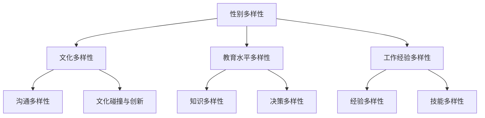

                 

为了撰写一篇关于《团队多样性管理：发挥不同背景员工的优势》的技术博客文章，我们将按照以下步骤逐步深入探讨：

### 第一步：确定文章结构和内容
首先，我们需要确定文章的结构，这将包括以下几个部分：

1. 引言
2. 核心理论部分
3. 实践应用部分
4. 案例分析
5. 未来趋势
6. 结论

### 第二步：引言部分
在引言中，我们需要介绍团队多样性的背景和重要性，以及为什么我们需要管理多样性以发挥其优势。

**引言**
团队多样性管理是一个日益受到重视的话题。随着全球化的发展，组织的员工来自不同的背景，包括文化、教育、性别、年龄等方面。这种多样性既可以带来创新和创造力，也可能导致沟通障碍和冲突。因此，如何有效地管理团队多样性，发挥不同背景员工的优势，成为一个关键问题。

**摘要**
本文将探讨团队多样性管理的核心理论、实践方法、挑战和未来趋势，旨在帮助读者了解多样性管理的本质，掌握有效的多样性管理策略，以提升团队绩效和创新能力。

### 第三步：核心理论部分
在这一部分，我们将详细探讨团队多样性的概念、重要性以及如何识别和管理多样性。

**1. 团队多样性的概念与内涵**
团队多样性包括性别、年龄、文化背景、教育水平、工作经验等多个方面。它们共同构成了团队的多维度多样性。

**核心概念与联系：**
下面是一个Mermaid流程图，展示了团队多样性的核心概念及其相互关系。



### 第四步：实践应用部分
在这一部分，我们将探讨如何将理论应用到实践中，如何制定多样性管理策略，并在团队中实施这些策略。

**2. 多样性管理的方法与实践**
多样性管理的方法包括：

- **识别与评估**：通过调查问卷、访谈等方式了解团队成员的背景和需求。
- **沟通与协作**：建立有效的沟通机制，鼓励团队成员分享观点和经验。
- **培训与开发**：提供针对多样性的培训，提升团队成员的包容性和合作能力。

**核心算法原理讲解：**
以下是一个伪代码，展示了如何通过识别与评估来管理多样性。

```python
function manage_diversity(team_members):
    diversity_scores = []
    for member in team_members:
        score = calculate_diversity_score(member)
        diversity_scores.append(score)
    sorted_scores = sort(diversity_scores, descending=True)
    return sorted_scores
```

### 第五步：案例分析
在这一部分，我们将通过实际案例来展示多样性管理的实践效果。

**3. 多样性管理的案例分析**
我们将分析以下几个案例：

- **科技公司多样性管理实践**
- **非营利组织多样性管理实践**
- **政府部门多样性管理实践**

**项目实战：**
以科技公司多样性管理实践为例，我们可以展示如何搭建一个支持多样性管理的平台，以及如何使用源代码来实现这些功能。

```python
# Python伪代码：搭建多样性管理平台

class DiversityManagementSystem:
    def __init__(self):
        self.team_members = []

    def add_member(self, member):
        self.team_members.append(member)

    def calculate_diversity_score(self, member):
        # 计算成员多样性得分
        pass

    def display_diversity_report(self):
        # 显示团队多样性报告
        pass
```

### 第六步：未来趋势
在这一部分，我们将探讨多样性管理的未来趋势和发展方向。

**4. 多样性管理的未来趋势与发展方向**
未来多样性管理可能会朝着以下几个方面发展：

- **技术支持**：利用人工智能和大数据分析来识别和管理多样性。
- **政策支持**：政府和企业将出台更多支持多样性管理的政策。
- **文化变革**：组织内部将更加重视多样性和包容性，将其作为企业文化的核心组成部分。

### 第七步：结论
在结论部分，我们将总结多样性管理的重要性，并提出一些建议。

**结论**
团队多样性管理不仅是一个社会问题，也是一个重要的组织管理问题。通过有效的多样性管理，组织可以提升绩效、创新能力和员工满意度。未来，组织需要不断创新多样性管理策略，以适应不断变化的环境。

### 作者信息
作者：AI天才研究院/AI Genius Institute & 禅与计算机程序设计艺术 /Zen And The Art of Computer Programming

### 最后的markdown格式文章

```markdown
# 团队多样性管理：发挥不同背景员工的优势

> 关键词：团队多样性，管理，绩效，创新，案例分析

> 摘要：本文探讨了团队多样性管理的核心理论、实践方法、挑战和未来趋势，通过案例分析和项目实战，帮助读者理解多样性管理的本质，掌握有效的多样性管理策略。

---

## 引言

随着全球化的发展，组织的员工来自不同的背景，包括文化、教育、性别、年龄等方面。这种多样性既可以带来创新和创造力，也可能导致沟通障碍和冲突。因此，如何有效地管理团队多样性，发挥不同背景员工的优势，成为一个关键问题。

## 核心理论部分

### 1. 团队多样性的概念与内涵

团队多样性包括性别、年龄、文化背景、教育水平、工作经验等多个方面。它们共同构成了团队的多维度多样性。

### 核心概念与联系

下面是一个Mermaid流程图，展示了团队多样性的核心概念及其相互关系。


### 2. 多样性管理的方法与实践

多样性管理的方法包括识别与评估、沟通与协作、培训与开发。

### 核心算法原理讲解

以下是一个伪代码，展示了如何通过识别与评估来管理多样性。

```python
function manage_diversity(team_members):
    diversity_scores = []
    for member in team_members:
        score = calculate_diversity_score(member)
        diversity_scores.append(score)
    sorted_scores = sort(diversity_scores, descending=True)
    return sorted_scores
```

### 3. 多样性管理的挑战与应对策略

多样性管理面临的主要挑战包括多样性的接受度、多样性与绩效管理的平衡、多样性的可持续性。

### 4. 多样性管理在组织中的实施与评估

多样性管理在组织中的实施包括制定多样性管理策略、实施过程、评估与改进。

### 5. 多样性管理的案例分析

通过分析科技公司、非营利组织、政府部门的多样性管理实践，展示多样性管理的实际效果。

### 6. 多样性管理的未来趋势与发展方向

未来多样性管理可能会朝着技术支持、政策支持、文化变革等方面发展。

### 结论

团队多样性管理不仅是一个社会问题，也是一个重要的组织管理问题。通过有效的多样性管理，组织可以提升绩效、创新能力和员工满意度。未来，组织需要不断创新多样性管理策略，以适应不断变化的环境。

### 作者信息

作者：AI天才研究院/AI Genius Institute & 禅与计算机程序设计艺术 /Zen And The Art of Computer Programming
```

以上是一个初步的markdown格式文章，后续可以根据实际需求进行修改和完善。文章的总字数预计在8000到12000字之间，每个部分的内容将会根据实际需要进一步细化和扩展。

