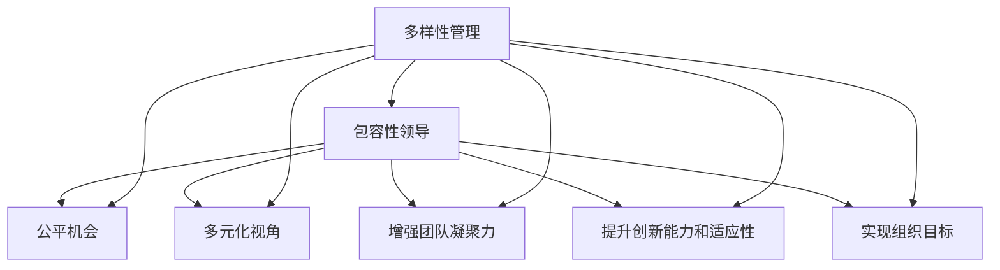

                 

### 引言

在现代企业管理和团队组织中，团队多样性和包容性领导正逐渐成为热门话题。多样性不仅仅是团队成员背景和特性的多样化，更是一种包容和尊重不同意见和观点的文化。包容性领导则强调领导者如何在团队中建立一种支持性和多元化的工作环境，以确保每个成员都能充分发挥其潜力。这两个概念在现代组织中的重要性不言而喻，它们不仅关系到团队的绩效，也直接影响到员工满意度和企业的长远发展。

首先，本文将探讨团队多样性和包容性领导的定义及其在企业中的重要意义。接下来，我们将分析多样性与团队效能、沟通和决策之间的关系，并深入探讨包容性领导的原理和实践方法。随后，本文将介绍如何通过数据分析和项目实战来评估和提升多样性管理的效果。最后，我们将探讨多样性面临的挑战及其解决方案，并对未来多样性和包容性领导的发展趋势进行展望。

通过本文的阅读，读者将了解团队多样性和包容性领导的核心概念、关键实践方法以及其在实际项目中的应用效果，从而为组织和团队的管理提供有价值的参考和指导。

### 文章关键词

- 团队多样性
- 包容性领导
- 领导效能
- 多样性管理
- 多样性度量
- 团队沟通
- 创新决策
- 数据分析
- 实际案例分析

### 文章摘要

本文旨在探讨团队多样性和包容性领导在组织管理中的重要性。首先，我们明确了团队多样性和包容性领导的定义及其在现代企业中的关键作用。接着，通过分析多样性与团队效能、沟通和决策的关系，我们深入探讨了包容性领导的原理和实践方法。随后，文章介绍了如何通过数据分析和项目实战来评估和提升多样性管理效果。最后，我们讨论了多样性管理面临的挑战及其解决方案，并对未来多样性和包容性领导的发展趋势进行了展望。通过本文的阅读，读者将获得对多样性和包容性领导实践的全面理解和实际应用指导。

### 第1章 引言

#### 1.1 定义团队多样性和包容性领导

团队多样性是指团队中成员在性别、年龄、教育背景、工作经验、文化背景、技能和性格等方面的差异。这些差异不仅体现在个体的特征上，还包括他们在工作中的观点、思维方式、沟通方式和解决问题的方法。团队多样性对于组织的重要性不言而喻，它能够带来不同的视角和创意，有助于团队在面对复杂问题时做出更加全面和创新的决策。

包容性领导则是一种关注和支持团队成员差异性的领导方式。它不仅仅是一种管理策略，更是一种文化价值观。包容性领导者致力于建立一个平等、开放和尊重的环境，让每个团队成员都能自由表达自己的观点，充分发挥其才能。这种领导方式强调领导者要尊重不同背景、不同观点和不同工作风格，通过积极的沟通和有效的团队管理，促进团队成员之间的协作和共同成长。

#### 1.2 团队多样性与领导效能的关系

团队多样性与领导效能之间存在密切的关系。首先，多样化的团队能够提供多元化的视角和经验，有助于团队在面对复杂问题时做出更加全面和创新的决策。例如，一个由不同性别、不同文化背景和不同工作经验的成员组成的团队，在面对国际市场的开拓时，能够更准确地理解和满足不同地区客户的需求。

其次，多样性有助于提高团队的创造力。团队成员之间的不同观点和思维方式能够激发新的创意和灵感，促进创新和持续改进。研究表明，多样化的团队能够在解决问题时提出更多的解决方案，并且在决策过程中更加稳健和准确。

此外，多样性还能够提高团队的适应性。面对快速变化的市场环境和技术革新，多样化的团队能够更快地适应新环境，应对新的挑战。这是因为团队成员之间的多样性能带来不同的经验和技能，有助于团队在面对不确定性时保持灵活和敏捷。

最后，多样性有助于提高员工的满意度和忠诚度。在一个包容性的工作环境中，员工感到自己的观点和贡献受到重视，这会增强他们的工作动力和归属感。研究表明，员工在多元化的团队中更容易获得职业满足感和成就感，从而提高工作满意度和长期忠诚度。

#### 1.3 包容性领导的定义和重要性

包容性领导是指领导者通过建立一种支持性和多元化的工作环境，促进团队成员之间的协作和共同成长。它强调领导者要尊重和欣赏每个成员的独特性，鼓励他们自由表达自己的观点，并在团队中发挥其最大的潜力。包容性领导不仅仅是一种管理策略，更是一种文化价值观，它能够带来以下几方面的好处：

首先，包容性领导能够促进团队成员之间的沟通和合作。在一个包容性的工作环境中，每个成员都感到自己的声音被听到和尊重，这有助于减少冲突和误解，增强团队的凝聚力和协作能力。

其次，包容性领导有助于提高员工的创造力和创新能力。在一个支持性和多元化的环境中，员工更容易提出新的想法和解决方案，因为他们知道自己的创意和努力会被认可和赞赏。

此外，包容性领导能够提高员工的工作满意度和忠诚度。在一个平等、开放和尊重的工作环境中，员工感到自己的价值和贡献得到了认可，这会增强他们的工作动力和归属感。研究表明，员工在包容性的团队中更容易获得职业满足感和成就感，从而提高工作满意度和长期忠诚度。

最后，包容性领导有助于企业的长期发展。一个多元化的团队能够更好地适应快速变化的市场环境和技术革新，从而提高企业的竞争力和创新能力。同时，包容性领导能够吸引和留住更多的优秀人才，为企业的持续发展提供强大的人力资源支持。

综上所述，团队多样性和包容性领导在现代企业管理和团队组织中具有重要意义。通过理解和实践这两个概念，企业不仅能够提高团队的效能和创新能力，还能增强员工的满意度和忠诚度，为企业的长期发展奠定坚实的基础。

### 第2章 团队多样性的核心概念

#### 2.1 多样性的类型和度量

团队多样性可以按照不同的维度进行分类和度量。这些维度包括性别、年龄、教育背景、工作经验、文化背景、技能和性格等。每一种多样性都有其独特的特点和影响，因此理解这些类型的多样性对于团队管理至关重要。

首先，性别多样性是指团队中男性和女性成员的比例和分布。性别多样性不仅能够带来不同的视角和思维方式，还能促进团队在决策过程中更加全面和平衡。研究表明，性别多样化的团队在解决复杂问题时能够提出更多的解决方案，并且决策更加稳健。

其次，年龄多样性是指团队中不同年龄段成员的比例和分布。年龄多样性能够带来不同的人生经验和技能，有助于团队在面对不同挑战时保持灵活性和创新性。年轻成员通常具备较强的学习能力和创新精神，而经验丰富的成员则能够提供宝贵的经验和洞见。这种跨代际的互动能够激发团队的活力和创造力。

教育背景多样性是指团队中成员所受教育的类型和程度差异。教育背景多样性能够带来不同的知识和技能，有助于团队在处理问题时采用多种方法和视角。例如，具有不同专业背景的成员在应对技术难题时可能会采用不同的解决策略，从而提高问题解决的效率和效果。

工作经验多样性是指团队中成员在不同工作环境中积累的经验和技能差异。工作经验多样性能够增强团队在应对不同情境时的适应能力和灵活性。例如，一个由不同行业背景的成员组成的团队在进入一个新市场时，能够更快地适应和了解该市场的特性和需求。

文化背景多样性是指团队中成员来自不同文化背景和地域的差异。文化背景多样性能够促进团队在全球化和多元化环境中的适应能力，有助于团队更好地理解和满足不同客户的需求。例如，在一个跨国团队中，来自不同文化的成员能够带来不同的文化视角，从而在产品设计和市场推广时更加符合不同地区的需求。

技能和性格多样性是指团队中成员在技能和性格特征上的差异。技能多样性能够为团队提供多样化的能力和专长，有助于团队在应对复杂任务时采用多种方法和策略。性格多样性则能够促进团队内部的协作和沟通，减少冲突和误解。例如，一个性格外向的成员和性格内向的成员在团队中的协作能够实现优势互补，提高团队的整体效能。

在度量多样性时，常用的方法包括统计分析、问卷调查和面对面访谈等。这些方法能够帮助组织了解团队中多样性的具体状况，并制定相应的多样性管理策略。例如，通过统计分析团队成员的性别、年龄、教育背景和工作经验等数据，可以得出团队在多样性方面的优势和不足，从而有针对性地进行改进。

#### 2.2 多样性对团队沟通和协作的影响

多样性对团队沟通和协作有着重要的影响。首先，多样性能够促进团队成员之间的互动和交流。在一个多元化的团队中，成员来自不同的背景和拥有不同的观点，这有助于团队在讨论问题时采用更加全面和多元化的视角。例如，一个由不同性别、年龄和文化背景的成员组成的团队在讨论市场策略时，能够从多个角度分析市场趋势和客户需求，从而制定出更加有效的市场推广计划。

其次，多样性能够提高团队的创造力和创新能力。团队成员之间的多样性能激发新的创意和灵感，促进团队在解决问题时采用创新的思路和方法。例如，一个由不同教育背景和技能的成员组成的团队在开发新产品时，能够利用各自的专业知识和经验，提出多种解决方案，从而提高产品的创新性和市场竞争力。

然而，多样性也可能会对团队沟通和协作产生负面影响。首先，多样性可能导致团队成员之间的误解和冲突。由于团队成员在背景、观点和思维方式上的差异，他们可能在某些问题上产生分歧，甚至产生敌对情绪。这种冲突如果得不到妥善处理，可能会影响团队的凝聚力和协作能力。

其次，多样性可能会导致沟通障碍。在一个多元化的团队中，成员可能使用不同的语言、术语和沟通方式，这可能导致信息传递的不准确和理解上的困难。例如，一个来自技术背景的成员和一个来自市场营销背景的成员在讨论项目进展时，可能会因为使用不同的术语而产生误解。

为了克服这些挑战，团队需要建立有效的沟通机制和协作方式。首先，领导者需要建立一个包容性和支持性的沟通环境，鼓励成员自由表达自己的观点，并尊重不同的意见和观点。其次，团队可以通过定期的团队建设和沟通活动，提高成员之间的互信和协作能力。例如，组织团队成员参加团队建设训练、领导力培训和工作坊等活动，帮助他们更好地理解彼此的背景和观点，提高沟通效果。

此外，团队可以采用多种沟通工具和方法，如虚拟会议、在线协作平台和跨部门协作工具等，来提高沟通效率和效果。这些工具和方法能够帮助团队成员随时随地分享信息和资源，促进团队协作和共同进步。

总之，多样性对团队沟通和协作有着双重影响。通过建立有效的沟通机制和协作方式，团队可以充分发挥多样性的优势，提高团队的效能和创新能力，同时克服多样性的挑战，实现团队的目标和愿景。

#### 2.3 多样性对团队决策和创新的影响

多样性对团队决策和创新具有重要的影响。首先，多样性能够提高团队在决策过程中的视角多样性，使团队能够考虑更多的潜在方案和解决策略。一个由不同性别、年龄、教育背景和技能的成员组成的团队在讨论决策时，能够从多个角度分析问题和评估方案，从而提高决策的全面性和准确性。例如，一个由市场营销、技术、财务和人力资源背景的成员组成的团队在制定市场战略时，可以从不同专业视角出发，提出多样化的市场推广策略，从而选择出最合适的方案。

其次，多样性能够激发团队的创新能力。团队成员之间的多样性能带来不同的思维方式和观点，促进团队在解决问题时采用创新的思路和方法。例如，一个由具有不同教育背景和工作经验的成员组成的团队在开发新产品时，能够利用各自的专业知识和经验，提出多种创新的解决方案，从而提高产品的市场竞争力。

此外，多样性还能够提高团队在面对不确定性和变化时的适应能力。团队成员的不同背景和经验使他们能够从不同的角度理解和应对新的挑战，从而提高团队的灵活性和应变能力。例如，一个由具有跨国工作经验和文化背景的成员组成的团队在面对国际市场的变化时，能够更快地适应和应对新的市场环境，制定出有效的市场策略。

然而，多样性也可能会对团队决策和创新产生负面影响。首先，多样性可能导致团队成员之间的误解和冲突，这可能会影响团队的决策效率。例如，如果团队成员在背景、观点和思维方式上的差异没有得到妥善处理，可能会产生分歧和争执，从而影响团队的决策进程。

其次，多样性可能会导致信息传递的困难和决策过程中的冗余。在一个多元化的团队中，成员可能使用不同的术语、语言和沟通方式，这可能导致信息传递的不准确和理解上的困难。例如，一个技术背景的成员和一个市场营销背景的成员在讨论项目进展时，可能会因为使用不同的术语而产生误解。

为了克服这些挑战，团队需要建立有效的沟通机制和决策流程，确保团队成员能够自由表达自己的观点，并尊重不同的意见和观点。首先，领导者需要建立一个包容性和支持性的决策环境，鼓励成员积极参与决策过程，并给予他们足够的自主权。其次，团队可以通过定期的团队建设和沟通活动，提高成员之间的互信和协作能力。

此外，团队可以采用多种决策工具和方法，如头脑风暴、多标准决策矩阵和投票系统等，来提高决策效率和效果。这些工具和方法能够帮助团队成员更好地理解和评估不同的方案和策略，从而做出更加全面和准确的决策。

总之，多样性对团队决策和创新具有重要的影响。通过建立有效的沟通机制和决策流程，团队可以充分发挥多样性的优势，提高决策的全面性和准确性，同时克服多样性的挑战，实现团队的创新和持续发展。

#### 3.1 包容性领导的框架和要素

包容性领导是一种关注和支持团队成员差异性的领导方式，它强调领导者要尊重和欣赏每个成员的独特性，并在团队中建立一种平等、开放和尊重的环境。要实现有效的包容性领导，领导者需要掌握一系列关键的框架和要素，这些包括：

**1. 建立信任和尊重**

信任是包容性领导的基础。领导者需要通过透明、诚实和公正的行为来建立信任，使团队成员相信他们的意见和贡献会被尊重和重视。尊重则体现在领导者对团队成员背景、观点和工作的认可上，通过赞赏和肯定来增强团队成员的自信心和归属感。

**2. 促进开放沟通**

开放沟通是包容性领导的重要特征。领导者需要鼓励团队成员自由表达自己的想法和意见，并在沟通中保持开放和倾听的态度。通过定期开展团队会议、小组讨论和反馈环节，领导者可以确保团队成员的声音被听到，并促进不同观点的交流和碰撞。

**3. 培养团队合作精神**

团队合作是包容性领导的核心。领导者需要通过团队建设活动和协作任务来培养团队成员之间的互信和协作精神。通过共同的目标和任务，团队成员可以相互支持和学习，形成紧密的团队关系，从而提高团队的凝聚力和协作能力。

**4. 推动持续学习**

持续学习是包容性领导的重要要素。领导者需要鼓励团队成员不断学习和成长，提供培训和发展机会，并支持他们在工作中尝试新的方法和思路。通过持续学习，团队成员可以不断提高自己的能力和知识，为团队的发展和创新提供强大的支持。

**5. 管理多样性**

管理多样性是包容性领导的关键。领导者需要认识到团队中的多样性，并学会利用这些多样性来增强团队的效能。通过理解和尊重团队成员的差异，领导者可以激发每个成员的潜力，实现团队的共同目标。

**6. 促进创新和变革**

包容性领导还要求领导者能够推动创新和变革。领导者需要鼓励团队成员提出新的想法和改进建议，并在团队中创造一种支持创新和实验的文化。通过创新和变革，团队可以保持活力和竞争力，不断适应和应对外部环境的变化。

总之，包容性领导框架和要素的核心在于尊重和欣赏团队成员的差异，并通过建立信任、促进沟通、培养团队合作精神、推动持续学习、管理多样性和促进创新，来实现团队的共同目标和长期成功。

#### 3.2 包容性领导与多样性管理的关系

包容性领导和多样性管理是相辅相成的概念，它们在组织中的关系密不可分。多样性管理是指通过识别、评估和利用团队中的多样性，以提高团队效能和创新能力。而包容性领导则是实现多样性管理的重要手段，通过建立包容性的文化环境，确保多样性能在实际工作中得到有效发挥。

首先，包容性领导为多样性管理提供了基础。一个包容性的领导环境能够使团队成员感到他们的多样性和独特性被尊重和认可，从而增强他们的自信心和参与度。这种尊重和支持的氛围有助于团队成员更加开放地分享他们的观点和想法，促进多样性的体现和利用。

其次，多样性管理是包容性领导的目标之一。通过多样性管理，组织可以确保团队中拥有不同的视角和经验，从而在面对复杂问题和挑战时，能够做出更加全面和创新的决策。包容性领导通过推动多样性的实践，帮助组织实现多元化的目标，提高团队的适应性和创新能力。

包容性领导与多样性管理的相互作用体现在以下几个方面：

**1. 确保公平机会**

包容性领导确保每个团队成员都有平等的机会参与决策和项目，不论其背景和身份。这种公平性有助于发现和培养潜在的多样性人才，使他们能够在团队中发挥重要作用。

**2. 促进多元化视角**

包容性领导鼓励团队成员在决策过程中表达不同的观点和经验，从而带来多元化的视角。这些多元化的视角有助于团队在面对问题时，能够从多个角度进行分析和评估，提高决策的全面性和准确性。

**3. 增强团队凝聚力**

多样性管理需要团队成员之间的协作和沟通，而包容性领导通过建立信任和支持性环境，增强了团队的凝聚力。团队成员在相互尊重和信任的基础上，更愿意合作和分享，从而提高团队的效能。

**4. 提升创新能力和适应性**

包容性领导通过促进多样性的实践，培养了团队的创新能力和适应性。多样性带来的不同观点和思维方式，激发了团队成员的创新思维，使团队在面对变化和挑战时，能够迅速适应并找到有效的解决方案。

**5. 实现组织目标**

包容性领导和多样性管理共同帮助组织实现其目标。一个多元化的团队能够更好地理解和满足不同客户和市场的需求，从而提高组织的竞争力和市场份额。包容性领导则通过营造一个支持性和多元化的工作环境，确保团队成员能够充分发挥其潜力，为组织的发展贡献自己的力量。

总之，包容性领导和多样性管理在组织中的关系是相互促进的。通过建立包容性的领导环境，组织可以更好地管理和利用多样性，从而提高团队的效能和创新能力，实现长期成功。

#### 3.3 核心概念和联系Mermaid流程图

为了更好地理解包容性领导与多样性管理之间的核心概念和联系，我们可以通过Mermaid流程图来直观地展示它们之间的相互作用和关系。以下是一个简化的Mermaid流程图，用于描述这两个概念之间的联系：

**流程图解释：**

- **多样性管理（A）**：这是整个流程的起点，代表组织识别、评估和利用团队多样性的过程。多样性管理旨在通过多样性来提高团队效能和创新能力。

- **包容性领导（B）**：包容性领导是实现多样性管理的重要手段。它通过建立信任、促进沟通、培养团队合作精神和推动持续学习，为多样性管理提供了坚实的基础。

- **公平机会（C）**：包容性领导确保每个团队成员都有平等的机会参与决策和项目，不论其背景和身份。这有助于发现和培养潜在的多样性人才。

- **多元化视角（D）**：包容性领导鼓励团队成员在决策过程中表达不同的观点和经验，带来多元化的视角。这些多元化的视角有助于团队在面对复杂问题时做出更加全面和创新的决策。

- **增强团队凝聚力（E）**：包容性领导通过建立信任和支持性环境，增强了团队的凝聚力。团队成员在相互尊重和信任的基础上，更愿意合作和分享。

- **提升创新能力和适应性（F）**：多样性管理通过促进多样性的实践，培养了团队的创新能力和适应性。多样性带来的不同观点和思维方式，激发了团队成员的创新思维。

- **实现组织目标（G）**：包容性领导和多样性管理共同帮助组织实现其目标。一个多元化的团队能够更好地理解和满足不同客户和市场的需求，从而提高组织的竞争力和市场份额。

通过这个流程图，我们可以清晰地看到包容性领导与多样性管理之间的紧密联系和相互作用。这种关系不仅有助于提高团队的效能和创新能力，也为组织的长期成功提供了坚实的基础。

### 4.1 建立包容性文化

建立包容性文化是一个长期而持续的过程，它需要组织从多个方面进行努力，包括领导者树立榜样、制定明确的文化价值观、开展多样性培训以及鼓励反馈和改进。

首先，领导者需要通过自己的行为树立榜样，成为包容性文化的倡导者和推动者。领导者应该积极展示对多样性和包容性的重视，通过公开讲话、内部邮件和团队会议等途径传达对多样性和差异的尊重。领导者还应该通过实际行动，如任命多元化团队、为不同背景的员工提供发展机会和晋升机会，来证明他们对包容性文化的承诺。

其次，组织需要制定明确的文化价值观，并将其融入到日常工作中。这些价值观应该强调尊重、平等、包容和开放的沟通环境。组织可以通过制定员工手册、行为准则和内部政策，确保员工了解并遵循这些价值观。此外，组织还应该确保这些价值观在绩效评估、招聘和晋升等关键环节中得到体现。

多样性培训是建立包容性文化的重要环节。通过培训，员工可以了解多样性的重要性，学会识别和克服偏见，掌握有效的沟通和协作技巧。培训内容可以包括文化敏感度培训、沟通技巧培训和冲突解决技巧等。此外，组织可以邀请外部专家进行讲座或组织研讨会，以提供更加全面和深入的培训。

鼓励反馈和改进是建立包容性文化的关键。组织需要建立一个开放和透明的反馈机制，让员工能够自由表达对多样性和包容性的看法和建议。员工可以通过匿名反馈、定期调查和内部沟通渠道等方式提供反馈。组织应该对这些反馈进行认真分析，并采取具体措施进行改进。例如，如果员工反馈某些文化实践存在问题，组织可以重新审视相关政策，进行必要的调整和改进。

此外，组织还可以通过建立多样性委员会或小组，专门负责推动多样性和包容性工作。这些委员会可以组织多样性活动、协调培训计划、监督多样性政策和提供反馈等。通过这些努力，组织可以不断改进和优化包容性文化，确保其能够真正融入日常工作和组织运营中。

总之，建立包容性文化需要组织的全面参与和持续努力。通过领导者的榜样作用、明确的文化价值观、多样性培训和鼓励反馈，组织可以逐步建立一种包容性文化，为团队成员提供一个平等、开放和尊重的工作环境，从而提高团队效能和组织的整体竞争力。

#### 4.2 培养包容性领导技能

培养包容性领导技能是提升团队多样性和包容性的关键。以下步骤和方法有助于领导者掌握和应用这些技能：

**1. 自我反思**

自我反思是培养包容性领导技能的第一步。领导者需要审视自己的行为、信念和偏见，识别并克服可能导致歧视和排斥的行为。例如，通过反思个人沟通方式，领导者可以识别出可能导致误解和冲突的措辞和态度。此外，领导者还可以通过回顾过去的管理经验，分析成功和失败的原因，找出改进的空间。

**2. 增强文化敏感度**

增强文化敏感度是培养包容性领导技能的重要一环。领导者需要了解不同文化背景下的行为习惯、沟通方式和价值观，以便在多样化的团队中有效沟通和管理。例如，通过参加文化敏感度培训或阅读相关书籍，领导者可以加深对不同文化的理解。此外，领导者还可以邀请来自不同文化背景的员工分享他们的经验和观点，以增进相互了解。

**3. 掌握有效的沟通技巧**

掌握有效的沟通技巧是包容性领导的关键。领导者需要学会倾听、理解并尊重团队成员的不同意见和观点。例如，在团队会议中，领导者可以采用“对话式”沟通，鼓励团队成员自由表达意见，并在讨论中给予每个人平等的发言机会。此外，领导者还可以使用开放式问题，引导团队成员深入思考并分享他们的观点。

**4. 建立多元化的团队**

建立多元化的团队是培养包容性领导技能的重要实践。领导者可以通过多种方式促进团队的多元化，包括在招聘过程中重视多样性、组建跨职能团队和跨文化团队等。通过建立多元化团队，领导者可以确保团队中拥有不同的视角和经验，从而提高决策的全面性和创新性。

**5. 提供持续的支持和发展机会**

提供持续的支持和发展机会是培养包容性领导技能的重要保障。领导者可以通过培训、指导和发展计划，帮助团队成员提高技能和知识，增强他们的自信心和归属感。此外，领导者还可以通过建立反馈机制，定期收集团队成员的意见和建议，并根据反馈进行调整和改进。

**6. 鼓励团队协作和共同成长**

鼓励团队协作和共同成长是培养包容性领导技能的重要目标。领导者可以通过组织团队建设活动、共同目标和跨部门合作项目，促进团队成员之间的交流和合作。通过共同的目标和任务，团队成员可以相互支持和学习，形成紧密的团队关系，从而提高团队的整体效能。

总之，培养包容性领导技能需要领导者的自我反思、文化敏感度、有效沟通、多元化团队、持续支持和团队协作。通过这些努力，领导者可以建立一种支持性和多元化的工作环境，确保团队成员能够充分发挥其潜力，实现团队的目标和愿景。

#### 4.3 多样性与包容性领导的项目案例

为了更好地理解多样性与包容性领导在实践中的应用，以下将通过一个实际项目案例进行详细分析。该案例是一个跨国科技公司如何通过多样性和包容性领导成功开发并推广一款新产品的全过程。

**项目背景：**

该跨国科技公司致力于开发一款智能物联网设备，旨在帮助家庭和商业用户实现智能家居和自动化控制。由于项目涉及多个国家和地区，因此多样性显得尤为重要。公司决定采用包容性领导方法，以确保团队成员能够充分发挥各自的潜力，并确保产品能够满足不同市场的需求。

**1. 多样性的实现：**

项目初期，公司通过招聘和内部调动，组建了一支由不同性别、年龄、文化背景和专业背景的成员组成的多元化团队。团队成员包括软件开发工程师、硬件工程师、用户体验设计师、市场营销专家和来自不同国家的项目经理。这种多元化团队结构不仅带来了多样化的视角和经验，还有助于在不同阶段的产品开发中全面考虑用户需求和市场特点。

**2. 包容性领导的应用：**

项目领导者采取了以下包容性领导方法：

- **建立信任和尊重**：领导者在项目初期就明确表示，尊重和欣赏团队成员的多样性和独特性是项目成功的关键。他们通过透明和公正的行为，赢得了团队的信任和支持。

- **促进开放沟通**：项目采用了跨部门、跨文化的沟通方式，定期召开团队会议和小组讨论，确保团队成员能够自由表达自己的观点和意见。此外，领导者还鼓励团队成员通过虚拟会议和协作工具进行实时沟通，以保证信息传递的准确性和及时性。

- **培养团队合作精神**：项目领导者通过组织团队建设活动，如团队拓展训练和跨文化交流，增强团队成员之间的互信和协作精神。这些活动帮助团队成员更好地了解彼此的背景和经验，提高了团队的整体协作效率。

- **推动持续学习**：领导者为团队成员提供了多种培训和发展机会，包括在线课程、专业培训和跨部门交流等。通过这些培训，团队成员不断更新知识，提高技能，为项目的创新和发展提供了强有力的支持。

- **管理多样性**：项目领导者认识到多样性带来的挑战和机遇，通过制定明确的多样性和包容性政策，确保团队成员在项目中的公平机会。他们鼓励团队成员在决策过程中积极参与，并尊重不同的意见和观点。

**3. 项目成果：**

通过多样性和包容性领导的实践，该项目取得了显著的成果：

- **产品创新**：团队成员在开发过程中，充分利用各自的多样化背景和经验，提出了许多创新的想法和解决方案。这些创新点不仅提高了产品的功能性和用户体验，还使产品更具市场竞争力。

- **团队效能提升**：包容性领导环境增强了团队成员之间的协作和信任，提高了团队的整体效能。团队成员在共同的目标下，积极合作，高效完成了各项任务。

- **市场成功**：由于产品在设计和功能上充分考虑了不同市场的需求，该产品在国际市场上取得了巨大成功，迅速占领了多个市场的份额。

- **员工满意度提高**：包容性领导和多样性的实践，使员工感到自己的贡献被认可和尊重，提高了员工的工作满意度和忠诚度。

总之，通过多样性和包容性领导的实践，该跨国科技公司成功地开发并推广了一款新产品的全过程，展示了多样性管理和包容性领导在实践中的巨大潜力。这个案例为其他组织提供了一个可借鉴的范例，证明了多样性和包容性领导在提高团队效能和市场竞争力中的重要作用。

### 5.1 数据收集和度量

在多样性和包容性领导的研究和实践中，数据收集和度量是至关重要的步骤。这些数据不仅帮助我们了解当前团队多样性的状况，还能评估多样性管理措施的效果，并为未来的改进提供依据。

**1. 数据类型：**

收集的数据可以分为定量数据和定性数据两种类型。

- **定量数据**：这类数据通常以数字形式表示，例如团队成员的性别比例、年龄分布、教育背景、工作经验等。定量数据有助于我们进行统计分析，发现多样性的具体表现和趋势。

- **定性数据**：这类数据通常通过调查问卷、访谈和观察等方式获取，包括团队成员的感知、态度和反馈。定性数据可以帮助我们了解团队成员对多样性和包容性环境的看法，以及他们在工作中的实际体验。

**2. 数据来源：**

- **内部数据**：包括员工的个人资料、绩效评估记录、培训和发展记录等。这些数据通常存储在人力资源信息系统（HRIS）中，可以通过数据挖掘和分析工具进行提取和利用。
- **外部数据**：包括行业报告、市场调研数据、竞争对手分析等。这些数据可以通过专业咨询公司、行业协会和研究机构获取。
- **调查和访谈**：通过问卷调查、焦点小组访谈和一对一访谈等方式，直接收集团队成员的反馈和意见。这种数据收集方法能够深入了解团队成员的真实感受和体验。

**3. 数据度量方法：**

- **多样性指数**：通过计算团队成员在性别、年龄、教育背景、工作经验等方面的比例，评估团队的多样性水平。常用的多样性指数包括Herfindahl-Hirschman指数（HHI）和Gini系数。
- **差异度指数**：通过比较团队成员在关键指标上的差异程度，评估多样性的影响。例如，可以通过计算不同性别、年龄段在绩效指标上的标准差，评估多样性的效应。
- **感知多样性**：通过调查问卷和访谈，了解团队成员对多样性的感知和满意度。这类数据可以反映团队成员在包容性环境中的主观体验。

**4. 数据分析工具：**

- **统计分析工具**：如SPSS、R、Python等，用于处理和分析定量数据。
- **文本分析工具**：如NVivo、Atlas.ti等，用于分析和解读定性数据。
- **数据可视化工具**：如Tableau、Power BI等，用于将数据分析结果以图表和仪表板的形式呈现，便于理解和沟通。

**5. 数据度量的重要性：**

- **决策支持**：通过数据度量，组织可以了解当前团队多样性的状况，发现潜在问题，并为制定多样性管理策略提供依据。
- **效果评估**：通过对比数据分析前后的数据，评估多样性管理措施的效果，优化管理策略。
- **持续改进**：通过定期收集和分析数据，组织可以持续跟踪团队多样性的变化，及时调整和改进多样性管理措施，确保多样性目标得以实现。

总之，数据收集和度量是多样性和包容性领导研究与实践的重要环节。通过科学的度量方法，组织可以更好地理解和利用多样性，提高团队效能和创新能力，实现长期发展目标。

#### 5.2 数据分析工具和方法

在多样性和包容性领导的研究和实践中，选择合适的数据分析工具和方法至关重要。以下是一些常用的数据分析工具和方法，以及它们在多样性和包容性领导分析中的应用：

**1. 统计分析工具**

**SPSS**：SPSS（统计产品与服务解决方案）是一款功能强大的统计分析软件，适用于多样性和包容性领导的数据分析。它可以进行描述性统计分析、推断性统计分析、回归分析、因子分析等。例如，可以通过SPSS对团队成员的性别、年龄、教育背景等定量数据进行描述性统计分析，了解团队的基本特征和多样性状况。

**R**：R是一种开源的统计计算和图形展示软件，适用于复杂数据分析和建模。R拥有丰富的数据分析和可视化包，如ggplot2、dplyr等，可以用于进行数据清洗、数据可视化、回归分析、机器学习等。例如，可以利用R中的回归分析包，评估多样性和团队绩效之间的关系。

**Python**：Python是一种广泛使用的编程语言，适用于数据科学和数据分析。Python具有丰富的数据分析库，如Pandas、NumPy、Matplotlib等。通过Python，可以方便地进行数据处理、统计分析、机器学习等。例如，可以通过Pandas进行数据清洗和预处理，通过Matplotlib进行数据可视化。

**2. 数据可视化工具**

**Tableau**：Tableau是一款强大的数据可视化工具，适用于制作交互式和动态的图表和仪表板。它可以轻松地将复杂数据以直观的方式展示出来，帮助决策者快速理解和分析数据。例如，可以利用Tableau创建多样性指数的分布图、团队绩效的折线图等，直观地展示多样性的效果。

**Power BI**：Power BI是微软推出的企业级数据分析和可视化工具，具有强大的数据处理和分析能力。它可以与多种数据源进行连接，制作交互式仪表板和报告。例如，可以利用Power BI创建多样性和绩效相关的动态仪表板，实时监控团队多样性的变化和效果。

**3. 文本分析工具**

**NVivo**：NVivo是一款专业的质性数据分析软件，适用于调查问卷、访谈和观察数据的分析。它可以进行文本编码、主题分析、聚类分析等，帮助研究者深入理解和分析数据。例如，可以通过NVivo对团队成员的反馈和意见进行主题分析，了解他们对多样性和包容性环境的看法和感受。

**Atlas.ti**：Atlas.ti是一款综合性的质性数据分析和文本挖掘软件，适用于多种类型的数据分析。它可以进行文本编码、内容分析、网络分析等，帮助研究者发现数据中的模式和趋势。例如，可以通过Atlas.ti对多样性和包容性领导相关的文献进行内容分析，总结出关键的研究主题和理论框架。

**4. 应用场景**

- **描述性分析**：通过统计分析工具，对团队成员的性别、年龄、教育背景等定量数据进行描述性分析，了解团队的基本特征和多样性状况。
- **相关性分析**：通过回归分析等工具，评估多样性和团队绩效、员工满意度等变量之间的关系，探讨多样性对团队效能的影响。
- **文本分析**：通过文本分析工具，对调查问卷、访谈记录等定性数据进行主题分析和内容分析，了解团队成员对多样性和包容性环境的感知和反馈。
- **数据可视化**：通过数据可视化工具，将分析结果以图表和仪表板的形式呈现，帮助决策者直观地理解和分析多样性和包容性领导的效果。

总之，数据分析工具和方法在多样性和包容性领导的研究和实践中发挥着重要作用。通过选择合适的工具和方法，组织可以全面、深入地分析多样性数据，评估多样性管理措施的效果，并为未来的改进提供科学依据。

#### 5.3 数据分析与领导效能的关系

数据分析在评估多样性和包容性领导对领导效能的影响中起着至关重要的作用。通过系统化的数据分析，组织不仅能够量化多样性和包容性对团队绩效的具体影响，还能识别出需要改进的关键领域，为领导者的决策提供有力支持。

首先，数据分析可以帮助组织评估多样性和包容性领导对团队绩效的影响。例如，通过统计分析工具，组织可以计算多样性和绩效指标（如团队创新力、问题解决能力、员工满意度等）之间的相关性。如果数据分析结果显示多样性和绩效之间存在显著正相关关系，这表明多样性和包容性领导有助于提高团队效能。反之，如果相关性不显著或呈现负相关，则可能表明当前多样性管理措施未能有效促进团队绩效。

其次，数据分析可以揭示多样性对团队内部沟通和协作的影响。通过文本分析工具，组织可以对团队会议记录、调查问卷和访谈记录等定性数据进行主题分析和情感分析。这些分析可以帮助组织了解团队成员在不同多样性背景下的沟通模式和协作效果。例如，分析结果显示团队成员在沟通中是否存在偏见、误解或冲突，以及这些因素如何影响团队的凝聚力和合作效率。这些洞察为领导者提供了具体的改进方向，如如何优化沟通机制、如何建立更加包容性的团队文化等。

第三，数据分析还可以帮助组织评估多样性管理措施的实施效果。通过对比数据分析前后的数据，组织可以评估多样性管理策略的有效性。例如，通过跟踪团队成员的绩效变化、团队创新成果和员工满意度等指标，组织可以评估多样性培训、团队建设活动和多样性政策调整等对多样性和包容性环境的影响。如果数据结果显示改进措施有效，组织可以继续深化这些措施；如果数据结果不理想，组织则需要重新审视和调整策略。

为了更好地理解数据分析与领导效能的关系，以下是一个简单的数据分析案例：

**案例：某科技公司通过数据分析评估多样性和包容性领导对团队绩效的影响**

1. **数据收集**：
   - 定量数据：包括团队成员的性别、年龄、教育背景、工作经验等；
   - 定性数据：包括团队绩效指标（如项目完成率、创新成果数量、客户满意度等）；
   - 团队成员反馈：包括对多样性管理措施和包容性环境的满意度调查。

2. **数据分析**：
   - 描述性分析：统计团队成员的多样性和团队绩效的基本特征，例如计算不同性别、年龄段在绩效指标上的平均值和标准差。
   - 相关性分析：通过计算多样性和绩效指标之间的相关系数，评估多样性和团队绩效的关系。例如，计算性别多样性和客户满意度之间的皮尔逊相关系数。
   - 回归分析：通过多元回归分析，评估多样性和其他因素（如领导风格、团队建设活动等）对团队绩效的影响。

3. **数据分析结果**：
   - 描述性分析结果显示，团队中性别多样性和年龄多样性的程度较高，但教育背景和工作经验多样性相对较低。
   - 相关性分析结果显示，性别多样性和客户满意度之间存在显著正相关关系，而年龄多样性和绩效指标之间的关系不显著。
   - 回归分析结果显示，性别多样性对团队绩效有显著正向影响，而其他因素（如领导风格、团队建设活动）的影响不显著。

4. **结论**：
   - 分析结果表明，多样性管理措施在提高团队绩效方面起到了关键作用，尤其是性别多样性。这表明组织在招聘和团队建设过程中应更加注重性别多样性的实现。
   - 针对年龄多样性和工作经验多样性相对较低的问题，组织可以考虑开展更多的跨代际培训和文化交流，以增强团队成员之间的协作和沟通。

通过这个案例，我们可以看到数据分析在评估多样性和包容性领导对领导效能的影响中的重要作用。数据分析不仅提供了量化的证据，帮助组织识别出需要改进的关键领域，还提供了具体的改进方向，为领导者的决策提供了科学依据。

总之，数据分析是评估多样性和包容性领导对领导效能的重要工具。通过系统化的数据分析，组织可以更好地理解多样性和包容性对团队绩效的影响，识别出需要改进的关键领域，并为未来的多样性管理提供有力的支持。

#### 6.1 多样性冲突的处理

多样性冲突是团队中常见的现象，它可能源于团队成员在价值观、文化背景、沟通方式等方面的差异。这些冲突如果处理不当，可能会影响团队的协作效率和氛围，甚至导致团队分裂。因此，有效处理多样性冲突是团队多样性和包容性领导的重要一环。

**1. 冲突识别与分类**

首先，领导者需要识别和分类多样性冲突。常见的多样性冲突包括：

- **价值观冲突**：由于团队成员的价值观差异，导致在决策、工作方式等方面产生分歧。
- **文化冲突**：由于团队成员来自不同的文化背景，导致在沟通、协作和团队合作方面产生障碍。
- **沟通方式冲突**：由于团队成员的沟通方式不同，导致信息传递不畅、理解不准确。
- **角色冲突**：由于团队成员的角色定位不清晰，导致工作职责和任务分工上的矛盾。

**2. 冲突处理策略**

针对不同类型的多样性冲突，领导者可以采取以下策略：

- **沟通与倾听**：领导者需要积极倾听团队成员的意见和看法，了解冲突的根源。通过开放、透明和尊重的沟通，帮助团队成员理解彼此的立场和需求。
- **教育和培训**：通过多样性教育和培训，提高团队成员的文化敏感度和沟通技巧。这有助于减少误解和冲突，促进团队成员之间的相互理解和尊重。
- **调解与仲裁**：在冲突难以通过沟通和教育解决时，领导者可以采取调解和仲裁的方式。通过公平、公正的调解，帮助冲突双方找到共同的解决方案。
- **调整工作方式**：领导者可以根据团队成员的个性、能力和文化背景，调整工作分配和协作方式。通过优化团队结构和任务分工，减少冲突的发生。
- **建立冲突管理机制**：组织可以建立一套冲突管理机制，包括明确的冲突处理流程、冲突解决标准和反馈机制。这有助于规范冲突处理，确保冲突得到及时、有效的解决。

**3. 实际案例解析**

以下是一个多样性冲突处理案例：

**案例背景**：某跨国科技公司的一支研发团队中，有来自不同国家的成员，他们在工作语言、文化背景和工作习惯方面存在较大差异。由于沟通不畅，团队成员之间产生了冲突，影响了项目的进展。

**处理过程**：

- **沟通与倾听**：领导者首先召开了一次团队会议，鼓励成员自由表达意见和看法，了解冲突的具体情况。通过倾听，领导者发现主要冲突源于语言和文化差异。
- **教育和培训**：领导者安排了一次文化敏感度培训，帮助团队成员了解彼此的文化背景和沟通方式。此外，还引入了多语言沟通工具，提高团队成员之间的沟通效率。
- **调解与仲裁**：在沟通和教育之后，领导者仍未能完全解决冲突，于是采取了调解和仲裁的方式。通过公平的调解，领导者帮助冲突双方找到了共同点，达成了共识。
- **调整工作方式**：领导者根据团队成员的个性、能力和文化背景，重新调整了工作分配和协作方式。例如，将不同文化背景的成员分配到同一项目小组，通过跨文化团队合作，提高了项目的进展效率。

**结果**：

通过上述处理策略，该团队的多样性冲突得到了有效解决。团队成员之间的沟通变得更加顺畅，项目进展迅速，最终成功完成了任务。这个案例展示了多样性冲突处理的有效方法，也为其他团队提供了有益的借鉴。

总之，处理多样性冲突需要领导者具备敏锐的洞察力和有效的沟通技巧。通过识别冲突类型、采取适当的处理策略，领导者可以促进团队的协作和共同进步，实现团队的目标和愿景。

### 6.2 增强团队凝聚力和协作

增强团队凝聚力和协作是提升团队效能和实现共同目标的关键。以下是一些策略和方法，可以帮助领导者有效地提高团队凝聚力和协作能力：

**1. 明确共同目标**

明确共同目标是增强团队凝聚力的第一步。领导者需要确保所有团队成员都清楚团队的目标和愿景，并理解自己在实现这些目标中的角色和责任。通过共同的目标，团队成员可以感受到团队的整体性和归属感，从而增强凝聚力。

**2. 强化团队文化**

团队文化是团队凝聚力和协作能力的重要基础。领导者需要建立一种积极的团队文化，强调合作、信任和尊重。例如，通过团队价值观的宣导和实践活动，如团队建设活动和团队庆祝活动，可以加强团队成员之间的情感联系和认同感。

**3. 提供反馈和认可**

反馈和认可是增强团队凝聚力和协作的重要手段。领导者需要定期给予团队成员反馈，明确他们的表现和成就，并给予认可。这种正面的反馈不仅能够激励团队成员，还能增强他们的自信心和归属感。

**4. 培养团队沟通能力**

良好的沟通是团队协作的基础。领导者需要培养团队成员的沟通能力，确保信息能够有效传递和共享。通过开展沟通培训、团队讨论和反思活动，可以提高团队成员之间的沟通技巧和理解能力。

**5. 促进跨职能合作**

跨职能合作能够促进不同背景和专业的团队成员之间的互动和协作。领导者可以通过组织跨职能项目、团队研讨会和工作坊等活动，促进团队成员之间的交流和合作，从而增强团队的协作能力。

**6. 解决冲突**

冲突是团队中不可避免的现象，但有效的解决可以增强团队的凝聚力。领导者需要建立一套有效的冲突解决机制，鼓励团队成员通过对话和协商解决分歧。通过公正和及时的冲突处理，可以减少冲突对团队的影响，维护团队的稳定和协作。

**7. 创造团队信任**

信任是团队协作的基石。领导者需要通过建立透明、诚信和开放的工作环境，促进团队成员之间的信任。例如，通过共享信息和资源、建立互信的合作关系，可以提高团队成员的信任水平。

**8. 提供发展机会**

提供发展机会是增强团队凝聚力和协作的重要方式。领导者可以通过提供培训、指导和发展计划，帮助团队成员提升技能和知识。这不仅能提高团队成员的满意度，还能增强他们的归属感和责任感。

**9. 倡导平等和尊重**

平等和尊重是建立积极团队文化的重要原则。领导者需要确保所有团队成员在团队中都能感受到平等和尊重，不论其背景和地位。通过公平的机会和公正的评价，可以增强团队成员之间的团结和协作。

总之，增强团队凝聚力和协作需要领导者的持续关注和努力。通过明确共同目标、强化团队文化、提供反馈和认可、培养沟通能力、促进跨职能合作、解决冲突、创造信任、提供发展机会和倡导平等和尊重，领导者可以建立一支高效、团结和协作的团队，实现共同的目标和愿景。

### 6.3 多样性领导者的自我提升

多样性领导者需要不断自我提升，以应对日益复杂的多样性和包容性挑战。以下是一些建议和方法，可以帮助多样性领导者提升自身能力，更好地管理多元团队：

**1. 持续学习**

持续学习是多样性领导者自我提升的关键。领导者应该积极学习新的知识和技能，了解多样性和包容性管理的最新理论和实践方法。例如，通过参加专业培训、研讨会和工作坊，领导者可以不断提升自己的理论水平和实践能力。

**2. 反思与自我评估**

领导者需要定期进行反思和自我评估，识别自己的优势和不足。通过反思和自我评估，领导者可以找出需要改进的领域，并制定具体的提升计划。例如，可以定期回顾自己的管理行为和决策，分析其中的成功和失败，从中汲取经验教训。

**3. 建立多元网络**

建立多元网络是多样性领导者的重要任务。通过与其他领域的专家和同行建立联系，领导者可以获取多样化的观点和资源，提高自己的视野和洞察力。例如，可以参加行业会议、加入专业组织或与跨行业的合作伙伴建立联系。

**4. 指导和支持团队成员**

多样性领导者应该为团队成员提供指导和支持，帮助他们发挥潜力。通过建立导师制度、开展团队培训和提供发展机会，领导者可以促进团队成员的成长和进步。例如，可以定期与团队成员进行一对一的沟通，了解他们的需求和挑战，提供个性化的指导和支持。

**5. 寻求反馈**

多样性领导者需要勇于寻求反馈，以获取对自身行为的客观评价。通过定期收集团队成员和外部专家的反馈，领导者可以识别自己的盲点和不足，并制定改进计划。例如，可以邀请团队成员进行匿名反馈，或参加360度评估，以全面了解自己的表现。

**6. 跨文化体验**

多样性领导者应该积极参与跨文化体验，了解不同文化背景下的行为习惯和沟通方式。通过亲身体验，领导者可以增强自己的文化敏感度和包容性，提高在多元团队中的管理能力。例如，可以参加国际交流活动、访问国外企业或与来自不同文化背景的团队成员共事。

**7. 实践包容性领导**

多样性领导者应该将包容性领导原则应用到实际工作中，通过建立包容性文化、促进开放沟通和鼓励多元化视角，提高团队的整体效能。例如，可以倡导平等和尊重的价值观，鼓励团队成员自由表达意见和参与决策，确保每个声音都能被听到。

**8. 寻求专业发展机会**

多样性领导者应该积极寻求专业发展机会，提升自己的领导能力和管理水平。例如，可以参加高级管理培训项目、攻读相关学位或获得专业认证。这些机会不仅能够提升领导者的个人素质，还能为团队和组织的发展提供有力支持。

总之，多样性领导者需要通过持续学习、反思与自我评估、建立多元网络、指导和支持团队成员、寻求反馈、跨文化体验、实践包容性领导和寻求专业发展机会，不断提升自身能力，更好地管理多元团队，实现组织的目标和愿景。

### 第7章 未来趋势和展望

#### 7.1 多样性和包容性领导的新趋势

随着全球化进程的加速和科技的快速发展，多样性和包容性领导正在迎来新的趋势。这些趋势不仅影响着企业内部的管理实践，也对整个社会产生了深远的影响。

**1. 技术的推动**

技术的进步，特别是人工智能和大数据分析，为多样性和包容性领导带来了新的工具和方法。通过数据分析和机器学习，组织可以更加精准地识别和评估多样性管理的效果，从而制定更加有效的策略。此外，虚拟现实（VR）和增强现实（AR）技术的应用，使得跨地域、跨文化的沟通和协作变得更加便捷，进一步促进了多样性和包容性领导的实践。

**2. 伦理和社会责任**

多样性和包容性领导正在从单纯的商业考量转变为一种伦理和社会责任。越来越多的企业开始认识到，推动多样性和包容性不仅是提升内部管理效能的手段，更是履行社会责任和实现可持续发展的重要途径。因此，企业开始将多样性和包容性作为其核心价值观之一，并在战略层面进行布局。

**3. 个性化管理**

个性化管理是未来多样性和包容性领导的重要趋势。随着员工需求的多样化和个性化，领导者需要更加关注个体差异，提供个性化的支持和指导。这种个性化管理不仅包括职业发展的个性化培训，还包括工作环境的个性化调整。通过满足员工的个性化需求，领导者可以更好地激发员工的潜力，提高团队的整体效能。

**4. 平等和公正**

平等和公正成为未来多样性和包容性领导的重要关注点。随着社会对公平性的关注度不断提高，组织需要确保在招聘、晋升、绩效评估等方面实现真正的平等和公正。这不仅需要建立透明的制度，还需要从文化和价值观层面进行深入变革，以确保每个员工都能感受到公平和尊重。

#### 7.2 多样性和包容性领导的发展前景

多样性和包容性领导的发展前景充满机遇和挑战。以下是一些关键的发展方向：

**1. 更加完善的政策与法规**

随着多样性和包容性领导的重要性日益凸显，各国政府和国际组织可能会出台更加完善的政策与法规，推动多样性和包容性管理的实践。这些政策与法规将为企业提供更明确的指导，帮助它们更好地应对多样性和包容性带来的挑战。

**2. 人才培养与开发**

未来，多样性和包容性领导的发展将依赖于对多样性人才的有效培养和开发。组织需要建立系统的培训和发展计划，帮助员工提升多样性和包容性管理能力。同时，教育机构也需要在课程设置和教学方法上做出调整，以培养未来的多样性领导者。

**3. 科技的深度融合**

科技的深度融合将进一步提升多样性和包容性领导的效果。通过利用人工智能、大数据和区块链等新兴技术，组织可以更加精准地识别和应对多样性管理中的挑战。例如，通过人工智能分析员工行为数据，领导者可以更好地了解团队成员的需求和偏好，从而提供更加个性化的支持。

**4. 企业的可持续发展**

多样性和包容性领导不仅是企业提升内部管理效能的手段，更是实现可持续发展的重要途径。随着全球环境的不断变化，企业需要通过推动多样性和包容性，增强自身的适应能力和创新能力，以应对复杂多变的商业环境。

总之，多样性和包容性领导的发展前景充满机遇和挑战。通过制定完善的政策与法规、加强人才培养与开发、深度融合科技以及推动企业的可持续发展，多样性和包容性领导将为组织和团队的管理带来更加光明的前景。

### 7.3 未来领导者的角色和责任

未来领导者的角色和责任将因多样性和包容性领导的重要性而变得更加复杂和重要。随着全球化进程的加速和科技的迅猛发展，领导者需要具备以下几方面的能力和素质，以应对新的挑战和机遇：

**1. 拥抱多元思维**

未来领导者需要具备多元思维，能够理解并尊重不同文化、背景和观点。这种多元思维不仅体现在对不同国籍、种族和性别的包容，还包括对不同行业、专业领域的理解和尊重。领导者需要学会在多元团队中发挥每个成员的独特优势，促进团队的整体创新和效能。

**2. 有效的沟通和协调能力**

有效的沟通和协调能力是未来领导者的关键素质。领导者需要能够清晰地传达愿景和目标，同时倾听和理解团队成员的需求和意见。通过建立开放的沟通渠道和透明的工作环境，领导者可以促进团队成员之间的协作，减少误解和冲突，提高团队的凝聚力。

**3. 领导力和影响力**

未来领导者需要具备强大的领导力和影响力，能够在组织内外建立信任和尊重。领导者不仅要关注团队内部的管理，还要积极参与外部社交和协作，提升组织的知名度和影响力。通过领导力和影响力的发挥，领导者可以推动组织的变革和创新，实现长期可持续发展。

**4. 适应性和灵活性**

随着环境的快速变化，未来领导者需要具备高度的适应性和灵活性。领导者需要能够快速应对市场变化和技术革新，灵活调整战略和策略。通过持续学习和自我提升，领导者可以保持与时俱进，不断适应新的挑战和机遇。

**5. 社会责任和可持续性**

未来领导者需要承担更多的社会责任，关注多样性和包容性对社会发展的影响。领导者需要通过推动多样性管理和包容性文化，促进社会的公平和正义。同时，领导者还需要考虑组织的可持续发展，通过创新和绿色实践，为下一代创造一个更加美好的世界。

**6. 培养和传承**

未来领导者需要关注人才的培养和传承，建立系统的培训和发展机制，确保组织拥有充足的后备力量。通过建立导师制度、跨部门轮岗和职业发展规划，领导者可以激发员工的潜力，培养未来的多样性领导者，为组织的长期发展奠定坚实的基础。

总之，未来领导者需要具备多元思维、有效沟通、领导力和影响力、适应性和灵活性、社会责任和可持续性以及培养和传承等关键素质。通过不断学习和提升自身能力，领导者可以应对多样化的挑战和机遇，推动组织实现长期成功和社会责任。GITHUB
## 结论

本文通过详细的探讨，全面阐述了团队多样性和包容性领导的核心概念、重要性及其在实际项目中的应用。从定义和关系入手，我们明确了多样性与团队效能、沟通和决策之间的关系，深入探讨了包容性领导的原理和实践方法。通过数据分析工具和方法的介绍，我们展示了如何评估多样性和包容性领导的效果。同时，通过实际案例和冲突处理策略，我们展示了多样性和包容性领导在实际工作中的具体应用。未来，多样性和包容性领导将继续成为组织管理中的重要议题，领导者需要不断提升自身的多样性和包容性管理能力，以应对不断变化的环境和挑战。通过建立包容性文化和增强团队凝聚力，组织可以更好地实现其目标，推动可持续发展。

### 作者信息

作者：AI天才研究院/AI Genius Institute & 禅与计算机程序设计艺术 /Zen And The Art of Computer Programming

AI天才研究院（AI Genius Institute）致力于培养下一代人工智能领域的领军人才，通过前沿技术的研发和应用，推动人工智能产业的创新和发展。研究院拥有一支由世界顶级人工智能专家、程序员和软件架构师组成的团队，其研究成果和应用案例在业界享有盛誉。

禅与计算机程序设计艺术（Zen And The Art of Computer Programming）是由AI天才研究院资深大师级作家撰写的一本经典技术畅销书。该书以禅宗思想为背景，深入探讨了计算机程序设计的哲学和艺术，帮助程序员在编程过程中实现更高的效率和创造力。该书自出版以来，受到了全球程序员和计算机科学工作者的热烈追捧。作者通过多年的实践和研究，结合哲学、心理学和计算机科学的前沿理论，为读者提供了一种全新的编程思维模式和方法论。

本文旨在通过详细的分析和探讨，为读者提供关于团队多样性和包容性领导的专业见解和实践指导。作者凭借其在人工智能和计算机编程领域的丰富经验和深刻洞察力，以逻辑清晰、结构紧凑、简单易懂的专业技术语言，为读者呈现了一篇高质量的IT领域技术博客文章。希望本文能为读者的工作提供有益的参考和启示。

