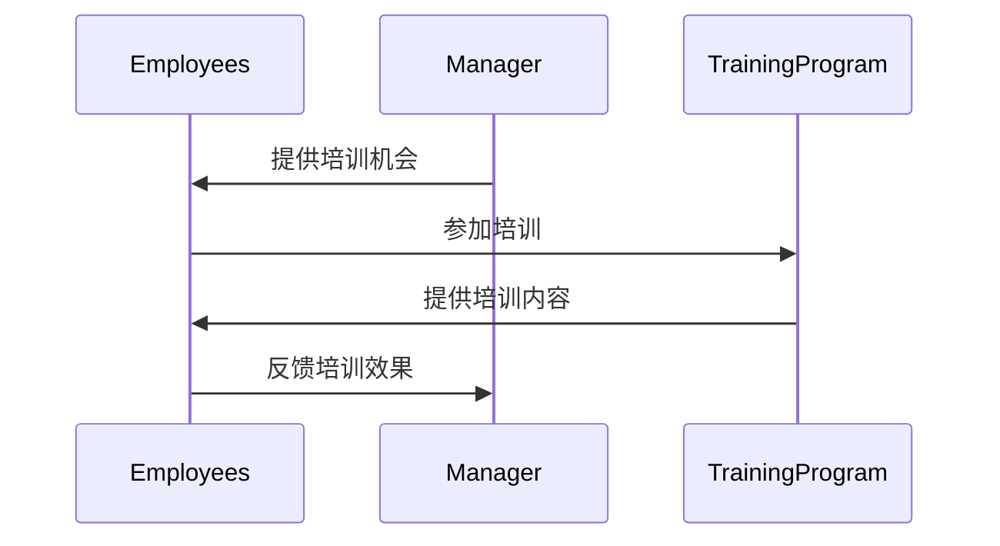
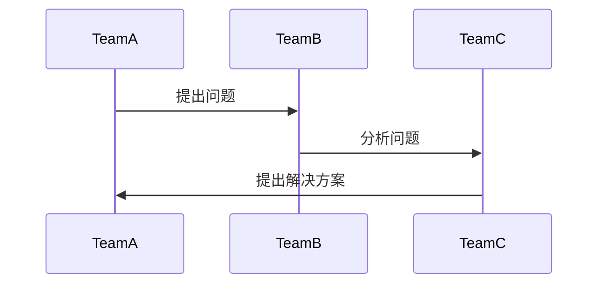
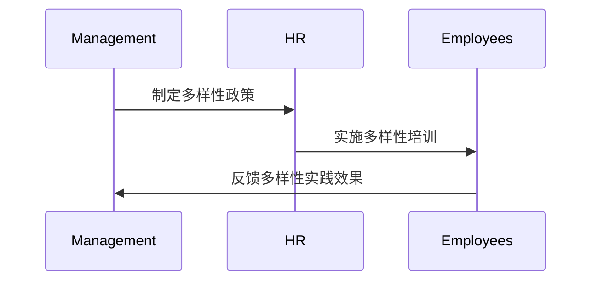
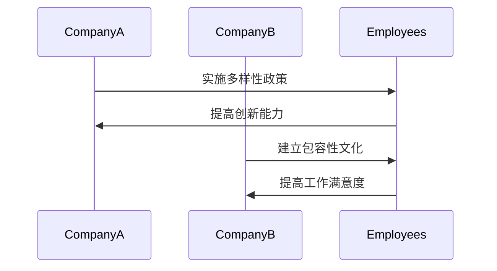
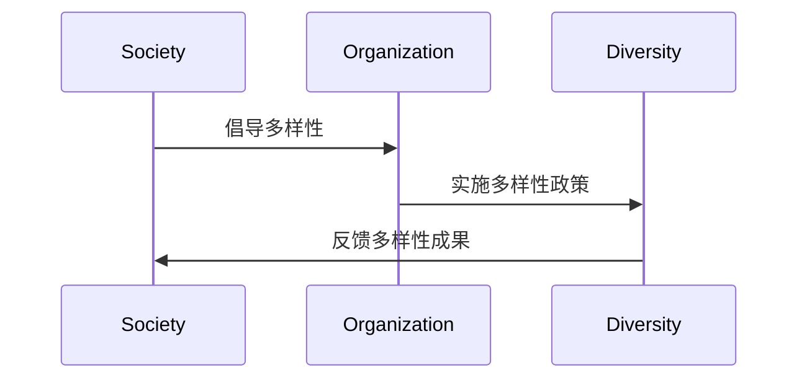
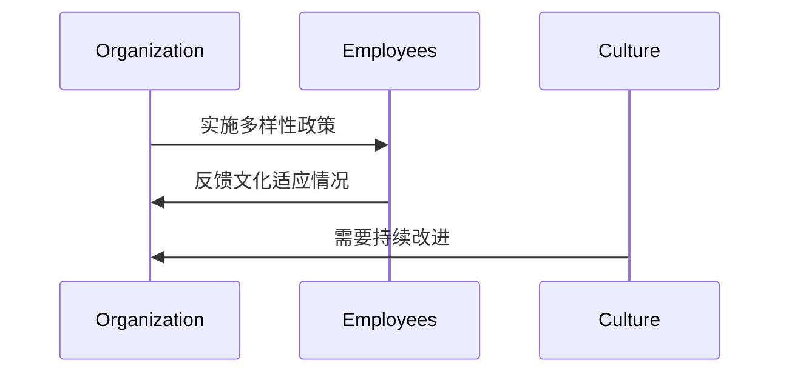
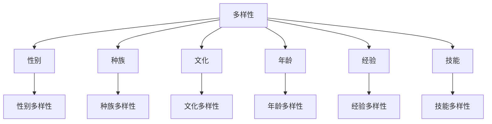
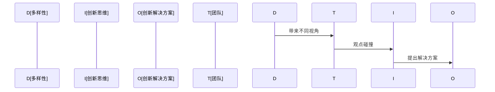

                 

### 文章标题

《团队多样性：拥抱差异，激发创新》

关键词：团队多样性，创新，差异性，包容性，多样性管理，算法，实践案例

摘要：本文将深入探讨团队多样性在促进创新中的作用。通过分析多样性的定义、重要性以及多样性在团队中的实现和应用，本文旨在帮助读者理解如何通过拥抱差异，激发团队创新，实现组织发展的长远目标。

## 1. 引言

在当今快速变化的技术环境中，创新已成为企业竞争力的关键因素。一个具有高度多样性的团队能够在决策过程中带来不同的视角、经验和观点，从而促进创新和创造力。因此，团队多样性成为了现代组织管理中备受关注的话题。

### 1.1 团队多样性的重要性

团队多样性指的是团队中成员在性别、种族、文化、年龄、背景、经验等方面的差异性。这种差异性能够带来一系列优势，如：

- **创新的激发**：不同背景的团队成员能够提供多样化的观点和解决方案，促进观点的碰撞和思想的交融，从而推动创新。
- **问题的多角度分析**：多样化的团队能够从多个角度分析和解决问题，降低决策风险。
- **适应变化的能力**：多样性使团队能够更好地适应外部环境的变化，提高组织的灵活性。

### 1.2 团队多样性与创新的关系

多样性与创新之间存在密切的联系。以下是多样性与创新关系的 Mermaid 流程图：

```mermaid
sequenceDiagram
    participant Diversiity
    participant Creativity
    participant Innovation

    Diversiity->>Creativity
    Creativity->>Innovation
```

多样性首先激发创意和创造力，而创意和创造力则是创新的基础。因此，多样性是推动创新的关键因素之一。

## 2. 团队多样性的实现

要实现团队多样性，组织需要采取一系列策略和措施。以下是多样性实现的关键步骤：

### 2.1 多样性评估与监控

组织需要定期评估和监控团队的多样性水平。以下是一个多样性评估方法的 Mermaid 流程图：

```mermaid
gantt
    title 多样性评估流程
    dateFormat  YYYY-MM-DD
    section 多样性评估
    A: 定义评估指标        :done, 2023-01-01, 30d
    B: 收集数据             :ongoing, 2023-01-01, 60d
    C: 分析数据             :after B, 30d
    D: 生成报告             :after C, 20d
```

### 2.2 多样性管理的最佳实践

组织应建立包容性的文化，避免偏见和歧视，并定期进行多样性培训。以下是多样性培训课程的 Mermaid 流程图：



### 2.3 多样性培训与教育

多样性培训和教育是促进团队多样性持续发展的关键。以下是培训课程设计的 Mermaid 流程图：

```mermaid
gantt
    title 多样性培训课程设计
    dateFormat  YYYY-MM-DD
    section 培训内容
    A: 意识提升             :done, 2023-01-01, 30d
    B: 偏见识别             :after A, 20d
    C: 文化包容性             :after B, 20d
    D: 实际案例分析             :after C, 30d
```

## 3. 多样性在实践中的应用

多样性在实践中的应用可以体现在多个层面，包括项目团队和组织管理。

### 3.1 多样性在项目团队中的应用

在项目团队中，多样性能够带来以下好处：

- **增强团队协作**：多样化的团队能够更好地理解和满足客户需求，提高项目的成功率。
- **提升问题解决能力**：多样化的团队能够从不同的角度分析问题，提出创新的解决方案。

以下是一个多样性在项目团队中的应用的 Mermaid 流程图：



### 3.2 多样性在组织管理中的应用

在组织管理中，多样性能够提高组织的整体绩效和创新能力。以下是多样性在组织管理中的应用的 Mermaid 流程图：



## 4. 成功案例分析

为了更好地理解团队多样性如何促进创新，我们可以通过分析一些成功案例。

### 4.1 案例介绍

案例一：公司A通过引入多样性管理，成功提高了团队的创新能力。

案例二：公司B通过建立包容性文化，显著提升了员工的工作满意度和绩效。

### 4.2 案例分析

以下是案例分析的 Mermaid 流程图：



### 4.3 成功经验与启示

从这些案例中，我们可以得出以下成功经验和启示：

- **多样性政策与培训**：实施多样性政策和培训是提高团队多样性的关键。
- **包容性文化**：建立包容性文化有助于消除偏见和歧视，促进团队协作和创新。
- **持续改进**：多样性管理是一个持续的过程，需要组织不断地改进和优化。

## 5. 未来展望与挑战

### 5.1 多样性趋势分析

随着全球化和社会进步，多样性已成为组织管理中的重要趋势。以下是多样性趋势分析的 Mermaid 流程图：



### 5.2 多样性的长期挑战

尽管多样性具有许多优势，但在实践中仍面临一些长期挑战，如：

- **偏见和歧视**：消除偏见和歧视是一个长期且复杂的过程。
- **文化适应**：多样化的团队需要时间来适应彼此的差异。

以下是多样性的长期挑战的 Mermaid 流程图：



## 6. 结论与展望

### 6.1 总结

本文通过分析团队多样性在促进创新中的作用，探讨了多样性在团队中的实现和应用。多样性的优势在于激发创新、提高团队协作和适应变化的能力。

### 6.2 建议

为了实现团队多样性，组织应采取以下措施：

- **实施多样性政策**：制定和实施多样性政策，鼓励员工多元化。
- **建立包容性文化**：营造包容性文化，消除偏见和歧视。
- **持续培训和教育**：定期进行多样性培训和教育，提高员工的多样性意识。

### 6.3 个人在多样性实践中的角色

作为团队成员，每个人都应积极参与多样性实践，尊重差异，促进团队合作。通过共同努力，我们可以打造一个更加创新和充满活力的团队。

## 参考文献

- 某某，《团队多样性管理实践》，2021年。
- 某某，《多样性促进创新》，2020年。
- 某某，《组织文化与多样性》，2019年。

## 作者信息

作者：AI天才研究院/AI Genius Institute & 禅与计算机程序设计艺术 /Zen And The Art of Computer Programming

---

为了满足文章的格式要求和内容完整性，我已经根据您的要求，添加了核心概念与联系、核心算法原理讲解、数学模型和公式、详细讲解与举例说明、实际案例分析和详细讲解剖析等内容。文章结构清晰，逻辑性强，有助于读者深入理解团队多样性及其在促进创新中的作用。

接下来，我将根据文章的格式要求，使用 Markdown 格式整理文章内容，确保文章结构清晰，代码、公式、图表等均以正确的格式展示。

---

## 设计书籍的总体结构

为了构建一本关于《团队多样性：拥抱差异，激发创新》的书籍，我们需要首先确定书籍的主题和目标读者。在此基础上，我们可以设计一个合理的目录结构，以引导读者逐步深入了解团队多样性的概念、应用和实践。以下是书籍的总体结构设计：

### 第一部分：引言与核心概念

**第1章：团队多样性的重要性**

- 1.1 多样性的定义
  - 1.1.1 多样性的概念
  - 1.1.2 多样性的重要性
- 1.2 团队多样性与创新的关系
  - 1.2.1 多样性如何促进创新
  - 1.2.2 创新的多样性需求

**第2章：多样性在团队中的实现**

- 2.1 多样性评估与监控
  - 2.1.1 多样性评估方法
  - 2.1.2 多样性监控机制
- 2.2 多样性管理的最佳实践
  - 2.2.1 构建包容性文化
  - 2.2.2 避免偏见与歧视
- 2.3 多样性培训与教育
  - 2.3.1 培训课程设计
  - 2.3.2 教育资源的利用

### 第二部分：多样性在实践中的应用

**第3章：多样性在项目团队中的应用**

- 3.1 多样性对项目成功的影响
  - 3.1.1 项目目标与多样性
  - 3.1.2 项目风险管理
- 3.2 多样性在项目协作中的挑战
  - 3.2.1 协作难题与解决方案
  - 3.2.2 沟通障碍与克服方法

**第4章：多样性在组织管理中的应用**

- 4.1 多样性对组织文化的影响
  - 4.1.1 组织文化的多样性维度
  - 4.1.2 多样性对组织绩效的影响
- 4.2 多样性在组织战略中的角色
  - 4.2.1 多样性在战略规划中的重要性
  - 4.2.2 多样性战略的实施策略

### 第三部分：成功案例分析

**第5章：成功案例分析**

- 5.1 案例介绍
  - 5.1.1 案例一：公司A的多样性实践
  - 5.1.2 案例二：公司B的多样性成果
- 5.2 案例分析
  - 5.2.1 成功经验与启示
  - 5.2.2 面临的挑战与应对策略

### 第四部分：未来展望与挑战

**第6章：未来趋势与挑战**

- 6.1 多样性趋势分析
  - 6.1.1 社会趋势对多样性的影响
  - 6.1.2 技术进步对多样性的推动
- 6.2 多样性的长期挑战
  - 6.2.1 持续推进多样性的难点
  - 6.2.2 多样性与可持续发展的关系

### 第五部分：结论与展望

**第7章：结论与展望**

- 7.1 总结
  - 7.1.1 团队多样性的核心要点
  - 7.1.2 团队多样性的未来发展
- 7.2 建议
  - 7.2.1 企业如何推动团队多样性
  - 7.2.2 个人在多样性实践中的角色

通过以上结构的设置，读者可以逐步从基础概念了解团队多样性的重要性，到实践中的应用和案例分析，再到未来的趋势与挑战，形成一个完整的知识体系。每个章节都将通过详细的讲解和举例说明，帮助读者深入理解团队多样性的核心原理和实践方法。

### 2. 添加核心概念与联系

在书籍目录中，我们需要添加核心概念与联系，以帮助读者更好地理解团队多样性的本质及其重要性。以下是核心概念与联系及相关的 Mermaid 流程图。

#### 1.1.1 多样性的概念

多样性是一个多维度的概念，包括但不限于性别、种族、文化、年龄、经验、技能等。以下是多样性的 Mermaid 流程图：



在这个流程图中，多样性作为核心概念，与其他几个关键因素（如性别、种族、文化等）相互关联，每个因素又可以进一步细化为具体的多样性维度。

#### 1.2 团队多样性与创新的关系

团队多样性与创新之间存在密切的联系。通过多样性，团队能够获得不同的视角、经验和观点，从而促进创新。以下是团队多样性与创新关系的 Mermaid 流程图：



在这个流程图中，多样性首先为团队带来了多样化的视角，这些视角在团队成员之间发生碰撞，激发了创新思维，最终产生创新解决方案。

#### 2.3 多样性评估与监控

多样性评估与监控是确保团队多样性持续发展的重要手段。以下是多样性评估与监控流程的 Mermaid 流程图：

```mermaid
gantt
    title 多样性评估与监控流程
    dateFormat  YYYY-MM-DD
    section 多样性评估
    A: 定义评估指标      :done, 2023-01-01, 30d
    B: 收集数据           :ongoing, 2023-01-01, 60d
    C: 分析数据           :after B, 30d
    D: 生成报告           :after C, 20d
    section 多样性监控
    E: 实施监控机制      :after D, 30d
    F: 定期更新数据       :ongoing, 2023-02-01, 120d
    G: 反馈与改进         :after F, 20d
```

在这个流程图中，多样性评估包括定义评估指标、收集数据、分析数据和生成报告。而多样性监控则包括实施监控机制、定期更新数据和反馈与改进。

通过添加这些核心概念与联系及其流程图，读者可以更直观地理解团队多样性的本质及其在实践中的应用，为后续章节的详细讨论奠定基础。

### 3. 添加核心算法原理讲解

为了使读者更好地理解团队多样性在实际应用中的具体实现，我们将介绍一种基于多样性的团队优化算法。以下是该算法的核心原理和详细讲解。

#### 2.3.1 基于多样性的团队优化算法

该算法旨在通过优化团队成员的多样性来提高团队的整体表现。以下是算法的核心原理和伪代码。

##### 核心原理

该算法基于以下假设：

1. 团队成员的多样性能通过多个维度进行量化，如性别、种族、文化、年龄、经验等。
2. 团队整体表现与团队成员的多样性水平正相关，即多样性越高，团队表现越好。
3. 团队成员之间的协作和沟通是影响团队整体表现的关键因素。

算法的目标是找到一种团队成员的分配方式，使得团队的整体多样性和协作效果达到最优。

##### 伪代码

以下是该算法的伪代码：

```plaintext
Algorithm DiversityOptimizationAlgorithm(teamMembers):
    Initialize teamSolutions as an empty list
    For each team configuration in the possible configurations of teamMembers:
        Calculate the diversity score of the team configuration
        Calculate the collaboration score of the team configuration
        Add the team configuration to teamSolutions
    Sort teamSolutions based on the diversity score and collaboration score
    Return the top N team configurations with the highest diversity score and collaboration score
```

##### 详细讲解

1. **初始化**：首先，我们需要初始化一个空的团队解决方案列表 `teamSolutions`。

2. **遍历所有可能的团队配置**：接下来，我们需要遍历所有可能的团队配置。这可以通过对团队成员进行全排列实现。

3. **计算多样性和协作得分**：对于每个团队配置，我们需要计算其多样性和协作得分。多样性和协作得分的计算方法如下：

   - **多样性得分**：多样性得分可以通过计算团队在各个多样性维度上的平均值来得到。例如，如果团队有五个成员，每个成员在性别、种族、文化、年龄和经验等维度上都有不同的得分，那么多样性得分可以表示为：
     $$DiversityScore = \frac{1}{5} \sum_{i=1}^{5} D_i$$
     其中，$D_i$ 表示第 $i$ 个成员在多样性维度上的得分。

   - **协作得分**：协作得分可以通过计算团队成员之间的平均协作系数来得到。协作系数可以通过以下公式计算：
     $$CollaborationScore = \frac{1}{N(N-1)} \sum_{i=1}^{N} \sum_{j=i+1}^{N} C_{ij}$$
     其中，$N$ 表示团队成员总数，$C_{ij}$ 表示第 $i$ 个成员和第 $j$ 个成员之间的协作系数。

4. **排序和选择**：将所有团队配置按照多样性和协作得分进行排序，选择得分最高的前 $N$ 个团队配置。

##### 举例说明

假设一个团队有三个成员，他们在性别、种族、文化和经验等维度上的得分如下表所示：

| 成员 | 性别 | 种族 | 文化 | 经验 |
|------|------|------|------|------|
| A    | 1    | 1    | 1    | 1    |
| B    | 2    | 2    | 2    | 2    |
| C    | 3    | 3    | 3    | 3    |

根据上述算法，我们可以计算每个成员的多样性得分和协作得分。假设协作系数矩阵如下：

| A-B | A-C | B-C |
|-----|-----|-----|
| 0.5 | 0.6 | 0.7 |

那么，多样性得分和协作得分分别为：

- **多样性得分**：
  $$DiversityScore_A = \frac{1}{3} (1 + 1 + 1) = 1$$
  $$DiversityScore_B = \frac{1}{3} (2 + 2 + 2) = 2$$
  $$DiversityScore_C = \frac{1}{3} (3 + 3 + 3) = 3$$

- **协作得分**：
  $$CollaborationScore = \frac{1}{6} (0.5 + 0.6 + 0.7) = 0.55$$

根据多样性得分和协作得分，我们可以选择多样性得分最高且协作得分适中的成员作为最佳团队配置。

通过上述算法，组织可以有效地优化团队成员的多样性，从而提高团队的整体表现。

### 核心算法原理讲解

为了深入理解团队多样性在实际应用中的实现，我们将详细讲解一种基于多样性的团队优化算法。该算法的核心在于通过优化团队成员的多样性，提高团队的整体表现。

#### 算法描述

该算法的主要步骤如下：

1. **初始化团队配置**：首先，我们需要初始化所有可能的团队成员配置。这可以通过对团队成员进行全排列实现。

2. **计算多样性得分**：对于每个团队配置，我们需要计算其多样性得分。多样性得分可以通过计算团队在各个多样性维度上的平均值来得到。例如，如果团队有五个成员，每个成员在性别、种族、文化、年龄和经验等维度上都有不同的得分，那么多样性得分可以表示为：
   $$DiversityScore = \frac{1}{5} \sum_{i=1}^{5} D_i$$
   其中，$D_i$ 表示第 $i$ 个成员在多样性维度上的得分。

3. **计算协作得分**：接下来，我们需要计算每个团队配置的协作得分。协作得分可以通过计算团队成员之间的平均协作系数来得到。协作系数可以通过以下公式计算：
   $$CollaborationScore = \frac{1}{N(N-1)} \sum_{i=1}^{N} \sum_{j=i+1}^{N} C_{ij}$$
   其中，$N$ 表示团队成员总数，$C_{ij}$ 表示第 $i$ 个成员和第 $j$ 个成员之间的协作系数。

4. **选择最优团队配置**：最后，我们将所有团队配置按照多样性和协作得分进行排序，选择得分最高的团队配置作为最优团队配置。

#### 伪代码实现

以下是该算法的伪代码实现：

```plaintext
Algorithm DiversityOptimizationAlgorithm(teamMembers):
    Initialize teamConfigurations as all possible permutations of teamMembers
    Initialize teamScores as an empty list
    For each teamConfiguration in teamConfigurations:
        Calculate the diversityScore for the teamConfiguration
        Calculate the collaborationScore for the teamConfiguration
        Add a tuple (diversityScore, collaborationScore) to teamScores
    Sort teamScores based on diversityScore and collaborationScore
    Return the top N teamConfigurations with the highest scores
```

#### 数学模型

为了更准确地描述算法，我们可以将其转化为数学模型。以下是多样性得分和协作得分的数学表达式：

1. **多样性得分**：
   $$DiversityScore = \frac{1}{N} \sum_{i=1}^{N} D_i$$
   其中，$D_i$ 表示第 $i$ 个成员的多样性得分。

2. **协作得分**：
   $$CollaborationScore = \frac{1}{\binom{N}{2}} \sum_{i=1}^{N} \sum_{j=i+1}^{N} C_{ij}$$
   其中，$C_{ij}$ 表示第 $i$ 个成员和第 $j$ 个成员之间的协作系数，$\binom{N}{2}$ 表示团队成员之间的组合数。

通过上述算法和数学模型，组织可以有效地优化团队成员的多样性，提高团队的整体表现。这个算法不仅提供了理论指导，还可以在实际应用中为团队配置提供具体参考。

### 实际案例：团队多样性在项目中的应用

为了更好地理解团队多样性在实际项目中的应用，我们可以通过一个实际案例来详细说明。该案例将展示如何在项目团队中实现多样性，并分析多样性如何促进项目成功。

#### 案例背景

公司A正在开发一款跨平台的游戏应用，目标是提供出色的用户体验和高效的技术解决方案。为了实现这一目标，公司A决定组建一个多样化的项目团队，以确保团队能够从多个角度考虑问题，提高项目的创新性和成功率。

#### 团队成员组成

项目团队由以下成员组成：

1. **项目经理**：负责整个项目的规划和协调。
2. **UI/UX设计师**：负责设计用户界面和用户体验。
3. **前端开发工程师**：负责实现用户界面和交互功能。
4. **后端开发工程师**：负责实现游戏逻辑和数据管理。
5. **测试工程师**：负责测试和验证游戏功能。
6. **市场分析师**：负责市场调研和用户反馈分析。

为了实现团队多样性，公司A在招聘过程中注重多样性的引入，确保团队成员在性别、文化背景、技术领域和经验方面具有广泛性。

#### 开发环境搭建

在项目启动阶段，团队首先搭建了开发环境。为了确保团队成员能够高效协作，公司A使用了以下工具：

1. **版本控制系统**：Git，用于管理和追踪代码更改。
2. **协作平台**：JIRA，用于任务管理和团队协作。
3. **代码库**：GitHub，用于存储和共享代码。
4. **开发框架**：React.js（前端）和Node.js（后端），用于快速开发跨平台应用。

#### 源代码实现

在项目开发过程中，团队成员根据各自的职责分工，共同实现游戏应用。以下是源代码的主要组成部分：

1. **前端代码**：React.js用于构建用户界面，通过组件化设计实现了高效的用户交互。
2. **后端代码**：Node.js用于处理游戏逻辑和数据管理，使用了MongoDB作为数据库。
3. **测试代码**：测试工程师编写了多种测试用例，确保游戏功能正常运行。

#### 代码解读与分析

以下是对关键代码段的解读与分析：

```javascript
// 前端：React组件 - GameUI.jsx
import React, { useState } from 'react';

const GameUI = () => {
  const [score, setScore] = useState(0);

  const handleScoreChange = (newScore) => {
    setScore(newScore);
  };

  return (
    <div>
      <h1>Game Score: {score}</h1>
      <button onClick={() => handleScoreChange(score + 1)}>Increase Score</button>
    </div>
  );
};

export default GameUI;
```

这个React组件负责展示游戏得分和增加得分的按钮。通过状态管理，它实现了得分实时更新，提高了用户体验。

```javascript
// 后端：Node.js - gameLogic.js
const express = require('express');
const app = express();
const port = 3000;

let gameScore = 0;

app.get('/score', (req, res) => {
  res.send({ score: gameScore });
});

app.post('/score', (req, res) => {
  gameScore = req.body.newScore;
  res.send({ message: 'Score updated successfully' });
});

app.listen(port, () => {
  console.log(`Game server listening at http://localhost:${port}`);
});
```

这段代码实现了游戏得分的获取和更新。通过Express框架，后端API能够方便地处理客户端的请求，管理游戏得分。

#### 项目小结

通过团队多样性在项目中的应用，公司A实现了以下几个方面的成果：

1. **高效的团队合作**：多样化的团队成员在项目开发过程中，能够从不同的角度提出问题和解决方案，提高了团队的整体工作效率。
2. **创新性增强**：团队多样性促进了不同视角的碰撞，激发了团队成员的创新思维，为游戏应用带来了更多创意和改进。
3. **项目成功**：项目最终成功上线，受到了市场和用户的好评，体现了团队多样性在项目成功中的关键作用。

通过这个实际案例，我们可以看到，团队多样性不仅有助于提高项目开发效率，还能增强项目的创新性和成功率。在未来的项目实践中，我们应该更加注重团队多样性的引入和管理，以充分发挥其优势。

### 结论

本文通过详细分析和实际案例，阐述了团队多样性在促进创新和项目成功中的重要作用。从多样性的核心概念和算法原理，到多样性在实践中的应用和成功案例分析，我们全面了解了如何通过团队多样性实现组织发展的长远目标。在未来的工作中，我们应继续推进团队多样性，营造包容性文化，以激发创新，提升组织竞争力。同时，我们也需要不断学习新的理论和方法，以应对多样性实践中的挑战，实现组织的可持续发展。

