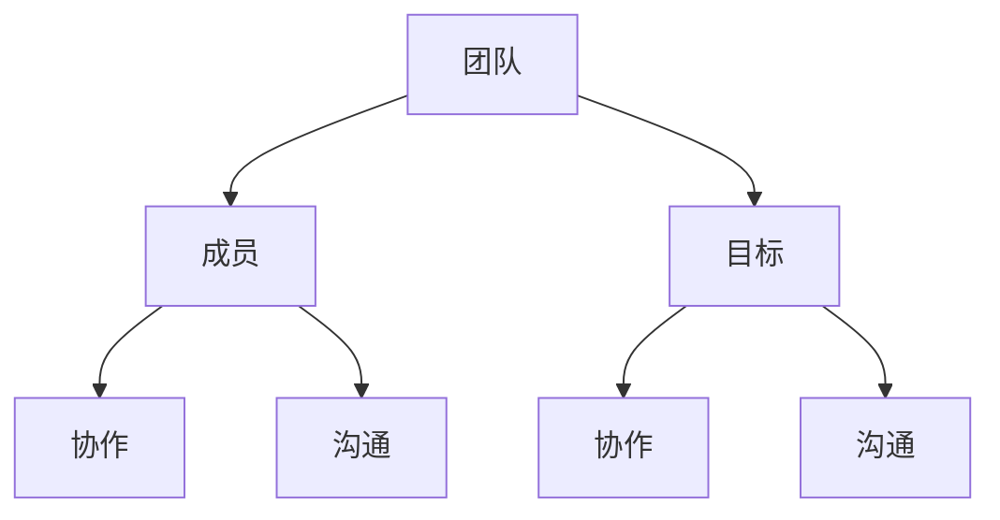

                 

### 引言

团队建设，作为组织管理和企业发展中的重要环节，一直受到广泛关注和重视。在当今快节奏、竞争激烈的市场环境中，一个高效、默契的团队可以为企业带来巨大的竞争优势。然而，如何从一群陌生个体迅速转化为一个协同作战的整体，是许多企业和管理者面临的挑战。

**团队建设的重要性**不言而喻。首先，团队建设能够提升团队的整体效能。一个高效的团队可以更好地完成复杂任务，提高工作效率，缩短项目周期。其次，团队建设能够增强团队凝聚力，促进团队成员之间的沟通与合作，减少内部摩擦和冲突。此外，良好的团队建设还能激发团队成员的积极性和创造力，为企业的创新和发展提供源源不断的动力。

本书的**目的**在于提供一种全新的团队建设思路，帮助企业和团队管理者从陌生到默契的各个阶段进行有效的团队建设。通过本书，读者将了解团队建设的基本概念、理论基础和常用模型，掌握从初识阶段到默契阶段的不同建设策略和方法，以及如何应对团队建设过程中可能遇到的挑战。最终，希望通过本书的帮助，读者能够将所学知识应用于实际工作中，打造出一个高效、默契的团队。

本书**结构安排**如下：

1. **引言**：介绍团队建设的重要性以及本书的目的和结构。
2. **团队建设理论基础**：介绍团队建设的基本概念、理论基础和常用模型。
3. **从陌生到默契**：分阶段讲述团队成员如何从陌生到建立默契的过程。
4. **团队建设策略**：提供实际可行的团队建设策略和方法。
5. **团队建设的挑战与解决方案**：分析团队建设过程中可能遇到的挑战，并提出解决方案。
6. **团队建设实践**：通过实际案例展示团队建设的实践过程。
7. **团队建设评估与反馈**：介绍如何对团队建设效果进行评估和反馈。
8. **总结与展望**：总结全书内容，展望团队建设的未来发展趋势。

通过以上的结构安排，本书将系统性地引导读者理解和应用团队建设的理论和实践，帮助读者在实际工作中取得更好的成果。

---

关键词：团队建设、协同作战、高效团队、凝聚力、沟通与合作

摘要：本书旨在提供一种全新的团队建设思路，帮助企业和团队管理者从陌生到默契的各个阶段进行有效的团队建设。通过介绍团队建设的基本概念、理论基础和常用模型，读者将了解团队成员如何从初识阶段逐步建立默契。书中还提供了实际可行的团队建设策略和方法，以及应对挑战的解决方案。通过实际案例和实践指导，本书旨在帮助读者打造一个高效、默契的团队，提升组织整体效能。

---

### 团队建设理论基础

在深入探讨团队建设的方法和实践之前，我们需要首先了解团队建设的基础理论。团队建设不仅仅是一种简单的管理活动，而是一个涉及心理学、社会学、组织行为学等多个领域的复杂过程。了解这些理论不仅有助于我们更好地理解团队建设的重要性，还能够为我们提供有效的策略和方法。

#### 核心概念与联系

首先，我们需要明确几个核心概念，它们是理解团队建设理论的基础：

1. **团队**：团队是由多个个体组成的，共同追求特定目标的组织形式。团队成员之间需要相互依赖，共同完成任务。
2. **成员**：团队成员是指参与团队活动，为实现团队目标而努力的个人。
3. **目标**：团队目标是团队存在的根本原因，是团队成员共同努力的方向和动力来源。
4. **协作**：协作是指团队成员为了实现共同目标而进行的一系列相互配合和互动。
5. **沟通**：沟通是团队协作的关键，是信息在团队成员之间传递和交换的过程。

这些核心概念相互联系，构成了团队建设的基础框架。例如，团队的目标决定了团队成员的角色和任务，而成员之间的协作和沟通是实现这些目标的关键手段。以下是一个简单的 Mermaid 流程图，展示了这些概念之间的关系：

#### 团队建设的理论基础

团队建设的理论基础涵盖了多个学科的理论框架，这些理论为我们提供了理解和分析团队动态的视角。以下是几个主要的团队建设理论基础：

1. **社会心理学理论**：社会心理学理论探讨了个体在团体中的行为和心理状态。例如，社会认同理论指出，个体在团体中的行为会受到团体认同感的影响。社会规范理论则强调了团体规范对个体行为的影响。

2. **系统理论**：系统理论将团队视为一个复杂的系统，强调团队内部的相互作用和动态平衡。系统理论中的反馈机制、自我调节和适应性等概念，为我们提供了理解团队如何在变化环境中持续发展的视角。

3. **组织行为学理论**：组织行为学理论关注个体和团体在组织中的行为模式。例如，领导理论探讨了领导风格对团队效能的影响；动机理论分析了团队成员的激励因素；而冲突理论则探讨了团队内部冲突的原因和解决方法。

#### 团队建设的常用模型

在团队建设的实践中，一些常用的模型和工具可以帮助团队管理者更好地理解和应用理论基础。以下是几个常见的团队建设模型：

1. **五要素模型**：五要素模型包括目标、角色、关系、沟通和过程。这些要素相互依赖，共同构成了团队运作的基本框架。通过这个模型，团队管理者可以系统地评估和改进团队的关键方面。

2. **五阶段模型**：五阶段模型描述了团队从形成到成熟的过程，包括形成期、激化期、规范期、执行期和休整期。每个阶段都有其独特的挑战和任务，团队管理者需要根据阶段特点进行有针对性的管理。

3. **马斯洛需求层次理论**：马斯洛需求层次理论指出，个体的需求分为生理需求、安全需求、社交需求、尊重需求和自我实现需求。在团队建设过程中，管理者需要考虑团队成员的不同需求，并采取相应的激励措施。

#### 团队建设的理论基础在实践中的应用

在了解了团队建设的理论基础之后，我们将这些理论应用于实际团队建设的实践中。以下是一个简化的流程，展示了如何将理论转化为实践：

1. **明确团队目标和任务**：基于团队建设的理论基础，首先需要明确团队的目标和任务。这包括确定团队的长远目标和阶段性目标，以及为实现这些目标需要完成的任务。

2. **角色分配和责任界定**：根据团队目标和任务，明确团队成员的角色和责任。这有助于确保每个成员都清楚自己的职责，并为团队的整体目标贡献自己的力量。

3. **建立沟通机制**：良好的沟通是团队协作的基础。通过建立有效的沟通机制，确保信息在团队成员之间畅通无阻。这包括定期的团队会议、信息共享平台等。

4. **提供培训和激励**：基于团队成员的需求和动机，提供相应的培训和激励措施。这有助于提升团队成员的技能水平和积极性，从而提高团队的整体效能。

5. **持续评估和改进**：通过定期的评估和反馈，持续改进团队建设和运作。这包括评估团队绩效、沟通效果、成员满意度等方面，并根据评估结果进行相应的调整和改进。

通过以上步骤，团队管理者可以有效地应用团队建设理论基础，指导团队从初识阶段逐步发展到默契阶段，实现团队的高效运作和持续发展。

---

在团队建设理论的基础上，我们进一步探讨如何将抽象的理论转化为具体的实践方法，从而帮助团队从初识阶段逐步发展到默契阶段。以下是团队建设过程中需要关注的几个关键方面：

#### 初识阶段

初识阶段是团队形成的第一步，也是最为关键的阶段之一。在这个阶段，团队成员彼此陌生，需要建立基本的信任和了解。以下是几个关键步骤：

1. **目标共识**：首先，确保所有团队成员都明确团队的目标和任务。这可以通过定期的会议和讨论来实现，确保每个人对团队的期望和目标有一致的理解。

2. **角色分配**：明确团队成员的角色和责任。这有助于团队成员了解自己在团队中的定位，并为团队目标的实现做好准备。例如，可以通过角色分配表或职位描述来明确每个成员的具体职责。

3. **团队建设活动**：组织一些团队建设活动，如团队破冰活动、团队拓展训练等，帮助团队成员快速熟悉彼此，建立初步的信任关系。

4. **建立沟通机制**：建立有效的沟通机制，确保团队成员之间的信息畅通。这可以包括定期的团队会议、邮件、即时通讯工具等。

#### 熟悉阶段

熟悉阶段是团队成员相互了解和信任逐步建立的过程。在这个阶段，团队成员需要通过不断的互动和沟通，形成有效的协作关系。以下是几个关键步骤：

1. **相互了解**：团队成员之间需要相互了解背景、技能、兴趣等信息。这可以通过个人介绍、团队互动活动等方式来实现。

2. **建立信任**：信任是团队协作的基石。通过开放、诚实和尊重的沟通方式，逐步建立团队成员之间的信任关系。

3. **团队目标细化**：在初识阶段的基础上，进一步细化团队目标，确保每个成员都明确自己的具体任务和职责。

4. **沟通技巧培训**：提供沟通技巧培训，帮助团队成员提高沟通效率和效果。这可以包括非暴力沟通、有效倾听、表达清晰等技巧。

#### 合作阶段

合作阶段是团队开始共同为实现目标而努力的过程。在这个阶段，团队成员需要协同工作，共同克服挑战。以下是几个关键步骤：

1. **任务分解**：将团队目标分解为具体的任务，并为每个任务分配责任人和时间节点。

2. **协作机制**：建立有效的协作机制，确保团队成员能够高效地协同工作。这可以包括任务分配工具、项目管理系统等。

3. **团队决策**：确保团队成员能够参与到决策过程中，增强团队的凝聚力和认同感。这可以通过团队会议、投票等方式来实现。

4. **冲突管理**：在团队协作过程中，难免会出现冲突。有效的冲突管理可以帮助团队及时解决矛盾，避免影响项目进展。这可以包括冲突解决策略、团队辅导等。

#### 高效阶段

高效阶段是团队运作达到最佳状态的过程。在这个阶段，团队成员之间的协作和沟通已经非常默契，团队整体效能显著提升。以下是几个关键步骤：

1. **持续改进**：通过定期的团队评估和反馈，不断改进团队的工作流程和协作方式，提高团队的整体效能。

2. **激励机制**：建立有效的激励机制，激发团队成员的积极性和创造力。这可以包括绩效奖金、晋升机会、表彰等。

3. **团队文化**：培养积极的团队文化，增强团队成员之间的归属感和凝聚力。这可以通过团队文化建设活动、共同价值观的传播等方式来实现。

4. **领导力**：领导者在高效阶段仍然扮演着重要的角色。领导者需要为团队提供方向和指导，确保团队在正确的轨道上前进。

#### 默契阶段

默契阶段是团队协作达到顶峰的过程。在这个阶段，团队成员之间的沟通和协作已经非常流畅和高效，团队整体效能达到最佳状态。以下是几个关键步骤：

1. **自动化流程**：通过优化工作流程和协作方式，实现工作流程的自动化，减少人为干预，提高工作效率。

2. **持续学习**：鼓励团队成员持续学习和提升技能，以适应不断变化的工作环境。

3. **反思与总结**：定期进行团队反思和总结，识别优势和不足，为未来的团队建设提供参考。

4. **保持敏捷性**：在默契阶段，团队需要保持敏捷性，及时应对外部环境和内部变化，确保团队的持续发展和进步。

通过以上各阶段的逐步推进，团队可以从初识阶段逐步发展到默契阶段，实现高效协作和持续发展。

---

### 团队建设策略

团队建设是一个复杂而持续的过程，需要综合考虑多种因素，包括团队目标、成员能力、外部环境等。为了有效推进团队建设，管理者可以采取一系列策略和方法，确保团队成员能够从陌生到默契，实现高效的协作和合作。以下是几个关键策略：

#### 团队目标设定

团队目标设定是团队建设的基础，明确的目标可以为团队成员提供清晰的方向和动力。以下是如何设定团队目标的步骤：

1. **确定长期目标**：首先，明确团队的长远目标，这些目标应与企业的整体战略相一致。例如，一个研发团队的长远目标可以是开发出新一代产品。

2. **分解为阶段性目标**：将长期目标分解为短期和阶段性目标，以确保团队可以逐步实现。这些阶段性目标应具有可衡量性和可实现性，例如在三个月内完成某个模块的开发。

3. **团队成员参与**：在设定目标的过程中，鼓励团队成员参与讨论，确保每个人都能理解和认同目标。这有助于提高团队成员的参与感和责任感。

4. **定期评估和调整**：定期评估团队目标的实现情况，根据评估结果进行必要的调整和优化。这有助于团队保持对目标的关注和动力。

#### 团队成员选拔

团队成员的选拔是团队建设的关键环节，合适的成员可以提升团队的整体效能。以下是如何选拔团队成员的建议：

1. **明确选拔标准**：根据团队目标和任务，明确选拔标准。这些标准应包括专业技能、团队合作能力、沟通能力等。

2. **多渠道招聘**：通过多种渠道进行招聘，包括内部推荐、专业招聘网站、校园招聘等，以确保吸引到最合适的人才。

3. **面试和评估**：在面试过程中，不仅要考察候选人的专业技能，还要评估其团队合作能力和沟通能力。可以通过小组讨论、角色扮演等方式进行评估。

4. **培训和发展**：对于新加入的团队成员，提供适当的培训和职业发展机会，帮助他们快速融入团队，提升技能和能力。

#### 团队协作与沟通

团队协作与沟通是团队建设的重要方面，高效的协作和良好的沟通可以显著提升团队的整体效能。以下是一些提升团队协作和沟通的策略：

1. **建立有效的沟通机制**：确保团队成员之间的信息畅通。这可以通过定期会议、即时通讯工具、邮件等方式来实现。

2. **提高沟通技巧**：为团队成员提供沟通技巧培训，帮助他们更好地表达自己的想法，并有效倾听他人的意见。

3. **团队协作工具**：利用团队协作工具，如项目管理软件、文档共享平台、团队协作平台等，提高团队协作的效率。

4. **设立明确的角色和责任**：确保每个团队成员都清楚自己的角色和责任，这有助于避免职责重叠和冲突。

5. **定期反馈和评估**：通过定期的反馈和评估，及时识别和解决团队协作和沟通中的问题，提高团队的整体效能。

#### 团队成员培训与激励

团队成员的培训与激励是团队建设的重要组成部分，有效的培训和激励可以提升团队成员的技能水平和工作动力。以下是一些具体的策略：

1. **培训计划**：根据团队成员的技能需求和职业发展目标，制定培训计划。这可以包括专业技能培训、领导力培训、沟通技巧培训等。

2. **激励机制**：建立激励机制，如绩效奖金、晋升机会、表彰等，激发团队成员的积极性和创造力。

3. **员工满意度调查**：定期进行员工满意度调查，了解团队成员的需求和反馈，针对性地改进培训激励机制。

4. **职业发展支持**：为团队成员提供职业发展支持，包括职业规划、导师指导、内部转岗等，帮助他们实现职业成长。

通过以上策略，团队管理者可以有效地推进团队建设，帮助团队成员从陌生到默契，实现高效协作和持续发展。这些策略不仅适用于初创团队，也适用于已经存在的团队，可以帮助团队在面临变化和挑战时保持活力和竞争力。

---

### 团队建设的挑战与解决方案

在团队建设过程中，管理者往往面临各种挑战，这些挑战不仅影响团队的效率，还可能破坏团队的凝聚力。了解这些挑战并采取有效的解决方案，是确保团队建设顺利进行的关键。以下是团队建设过程中常见的挑战及其解决方案：

#### 挑战分析

1. **沟通障碍**：
   - **现象**：团队成员之间的沟通不畅，导致信息传递失误和误解。
   - **原因**：团队成员背景、文化差异、沟通方式不当等。

2. **角色冲突**：
   - **现象**：团队成员在职责和任务分配上存在冲突，影响团队协作。
   - **原因**：角色界定不清、任务分配不合理、个人利益冲突。

3. **信任问题**：
   - **现象**：团队成员之间缺乏信任，影响团队合作和协作效率。
   - **原因**：频繁的误解、沟通不畅、历史矛盾遗留。

4. **团队动力不足**：
   - **现象**：团队成员缺乏工作动力，影响团队整体效能。
   - **原因**：缺乏激励、目标不明确、工作内容不感兴趣。

5. **外部环境变化**：
   - **现象**：外部环境的变化，如市场波动、竞争加剧等，对团队产生压力。
   - **原因**：团队对环境变化应对不足、缺乏灵活性。

#### 解决方案

1. **沟通障碍**：
   - **解决方法**：建立有效的沟通机制，如定期团队会议、沟通工具培训、开放沟通环境等。同时，鼓励团队成员采用多种沟通方式，如面对面交流、电话会议、邮件等。

2. **角色冲突**：
   - **解决方法**：明确团队成员的角色和责任，制定详细的任务分配计划。通过角色分析和沟通，解决潜在冲突，确保每个成员都清楚自己的职责和任务。

3. **信任问题**：
   - **解决方法**：通过团队建设活动和信任游戏，增强团队成员之间的信任感。同时，建立透明的沟通和反馈机制，确保团队成员之间的信息共享和互相理解。

4. **团队动力不足**：
   - **解决方法**：设定明确的团队目标，并定期评估进展。提供激励措施，如绩效奖金、晋升机会等，激发团队成员的工作动力。同时，关注团队成员的个人需求，提供职业发展和个人成长的机会。

5. **外部环境变化**：
   - **解决方法**：增强团队的灵活性和适应性，通过培训和研讨会，提升团队成员应对外部环境变化的能力。建立快速响应机制，确保团队能够迅速调整策略和应对挑战。

通过以上解决方案，团队管理者可以有效地应对团队建设过程中的各种挑战，确保团队持续发展和高效运作。

---

### 团队建设实践

在了解了团队建设的基本理论和策略之后，我们将通过实际案例来展示团队建设的全过程。以下是一个关于新团队建设案例的详细分析，涵盖了团队组建、角色分配、沟通机制建立、冲突解决、激励措施等关键环节。

#### 案例背景

某科技公司在2022年初决定开发一款新型的智能家居设备，并为此组建了一个全新的团队。团队成员包括来自不同部门和专业背景的专家，包括软件工程师、硬件工程师、产品经理、市场分析师等。由于团队成员之间缺乏了解，如何快速建立信任和协作关系成为团队建设的关键问题。

#### 团队组建

1. **确定团队目标和任务**：
   - 团队目标是开发一款功能完善、用户体验优秀的智能家居设备。
   - 任务包括需求分析、设计、开发、测试、市场推广等。

2. **角色分配**：
   - 软件工程师负责设备的软件开发和系统集成。
   - 硬件工程师负责设备的硬件设计和硬件集成。
   - 产品经理负责产品规划和市场分析。
   - 市场分析师负责市场调研和用户反馈收集。

3. **团队负责人任命**：
   - 任命一位有经验的项目经理作为团队的负责人，负责整体协调和进度控制。

#### 沟通机制建立

1. **定期团队会议**：
   - 每周召开一次团队会议，讨论项目进展、问题和解决方案。

2. **沟通工具**：
   - 使用项目管理工具（如Trello、Jira）进行任务分配和进度跟踪。
   - 使用即时通讯工具（如Slack、微信）进行日常沟通和信息共享。

3. **信息共享平台**：
   - 设立内部邮件列表和共享文件夹，确保重要信息传递无误。

#### 冲突解决

1. **冲突预防**：
   - 在项目初期，通过角色分析和沟通，预防潜在冲突。
   - 确定每个成员的职责和任务范围，避免职责重叠。

2. **冲突解决机制**：
   - 当冲突发生时，团队负责人组织会议，听取各方意见，寻找解决方案。
   - 鼓励团队成员开放沟通，表达自己的观点和感受。

#### 激励措施

1. **绩效考核**：
   - 设定明确的绩效考核指标，定期评估团队成员的工作表现。
   - 根据绩效考核结果，给予相应的奖励和晋升机会。

2. **团队活动**：
   - 定期组织团队建设活动，如团队聚餐、体育比赛等，增强团队凝聚力。

3. **职业发展**：
   - 提供职业发展培训，帮助团队成员提升技能和职业素养。
   - 设立内部转岗机制，鼓励团队成员探索新的职业方向。

#### 实施过程

1. **需求分析**：
   - 团队成员通过市场调研和用户访谈，收集智能家居设备的需求信息。

2. **设计阶段**：
   - 软件工程师和硬件工程师根据需求，分别进行软件和硬件设计。
   - 产品经理和市场分析师参与设计评审，确保设计符合用户需求和市场趋势。

3. **开发与测试**：
   - 软件工程师和硬件工程师按照设计文档进行开发，并进行单元测试。
   - 测试团队负责集成测试和系统测试，确保设备的功能和性能符合要求。

4. **市场推广**：
   - 市场分析师进行市场分析和推广策略制定。
   - 市场团队负责产品发布和用户推广活动。

#### 结果与评估

1. **项目进展**：
   - 经过6个月的努力，团队成功完成了智能家居设备的开发，并顺利推向市场。

2. **团队成员满意度**：
   - 通过团队满意度调查，团队成员对团队建设和项目成果表示满意。

3. **绩效评估**：
   - 根据绩效考核结果，团队中有几名成员获得了晋升和奖励。

4. **后续改进**：
   - 团队计划通过后续的版本更新和功能优化，不断提升产品的用户体验和市场竞争力。

通过这个实际案例，我们可以看到，团队建设是一个系统性的过程，需要从目标设定、角色分配、沟通机制建立、冲突解决、激励措施等多方面进行综合考虑。通过有效的团队建设，团队可以更加高效地完成任务，提升整体效能。

---

### 团队建设评估与反馈

团队建设的效果评估与反馈是确保团队持续改进和优化的重要环节。通过科学的评估方法和及时的反馈机制，团队管理者可以了解团队的实际运作情况，识别存在的问题，并采取相应的措施进行改进。

#### 评估指标设定

1. **团队绩效指标**：
   - **项目完成率**：衡量团队完成项目任务的速度和效率。
   - **项目质量**：评估项目交付物的质量，包括功能完整性、用户体验、稳定性等。
   - **团队执行力**：衡量团队对任务和目标的执行能力。

2. **团队成员满意度**：
   - **工作氛围**：评估团队成员之间的沟通氛围和合作满意度。
   - **团队信任度**：衡量团队成员之间的信任程度和协作效率。
   - **个人发展**：评估团队成员在职业素养和技能提升方面的满意度。

3. **团队建设活动效果**：
   - **参与度**：评估团队成员参与团队建设活动的积极性。
   - **活动效果**：衡量团队建设活动对团队凝聚力和团队氛围的改善程度。

#### 评估方法

1. **定量评估**：
   - **问卷调研**：通过设计问卷，收集团队成员对团队建设各方面的主观评价。
   - **数据统计**：利用项目管理工具的数据统计功能，评估团队绩效指标。

2. **定性评估**：
   - **访谈**：与团队成员进行一对一访谈，了解他们的真实感受和看法。
   - **观察**：通过观察团队成员的工作状态和行为，识别存在的问题和改进点。

#### 反馈机制

1. **定期反馈**：
   - **周报和月报**：定期收集团队成员的工作报告，进行整体评估和反馈。
   - **团队会议**：定期召开团队会议，讨论项目进展、问题和改进措施。

2. **即时反馈**：
   - **即时沟通工具**：利用即时沟通工具（如Slack、微信），实时反馈工作中的问题和解决方案。
   - **团队辅导**：团队负责人或导师定期进行团队辅导，及时解决成员的困惑和问题。

#### 评估与反馈的实践

1. **评估实施**：
   - **确定评估周期**：根据项目周期和团队实际情况，确定评估周期，如每周、每月或每季度。
   - **收集数据**：通过问卷调研、访谈、观察等方式，收集团队成员的评价数据。

2. **反馈沟通**：
   - **个体反馈**：针对每个团队成员，进行一对一的反馈沟通，指出其优点和改进点。
   - **团队反馈**：在团队会议上，对团队整体情况进行反馈，讨论存在的问题和改进方案。

3. **改进措施**：
   - **问题分析**：根据评估结果，分析团队存在的问题，制定具体的改进措施。
   - **实施改进**：将改进措施纳入团队工作计划，确保落实。

通过科学的评估与反馈机制，团队管理者可以持续监控团队建设的效果，及时识别和解决问题，促进团队的不断进步和发展。

---

### 总结与展望

通过本书的深入探讨，我们系统地阐述了团队建设的重要性、理论基础、策略方法以及实践应用。团队建设不仅影响团队的整体效能，更关系到企业的长期发展。以下是本书的主要内容和核心观点的简要总结：

1. **团队建设的重要性**：高效、默契的团队是企业竞争力的关键。通过团队建设，企业可以提高工作效率、增强团队凝聚力、激发创新动力。

2. **团队建设理论基础**：我们介绍了社会心理学、系统理论、组织行为学等理论，并通过五要素模型、五阶段模型等常用模型，为团队建设提供了理论支撑。

3. **团队建设策略**：从团队目标设定、团队成员选拔、沟通协作到培训激励，我们提出了具体的策略和方法，帮助团队管理者在实际工作中有效推进团队建设。

4. **团队建设挑战与解决方案**：我们分析了团队建设过程中可能遇到的挑战，并提供了应对方案，帮助团队管理者克服障碍，持续优化团队运作。

5. **团队建设实践**：通过实际案例，我们展示了团队建设的全过程，从组建团队、角色分配到沟通机制建立、冲突解决和激励措施，为读者提供了实用的指导。

6. **评估与反馈**：我们强调了评估与反馈在团队建设中的重要性，通过科学的评估方法和反馈机制，确保团队持续改进和优化。

展望未来，团队建设将继续成为企业管理和组织发展的重要领域。以下是一些发展趋势和潜在的研究方向：

1. **数字化团队建设**：随着数字化转型的发展，数字化工具和平台将在团队建设和管理中扮演更加重要的角色。如何利用人工智能、大数据等技术优化团队建设流程，是一个值得研究的问题。

2. **跨文化团队建设**：全球化背景下，跨文化团队的协同工作成为常态。如何有效应对文化差异、提升跨文化团队效能，是未来的重要研究方向。

3. **团队动态适应性**：在快速变化的市场环境中，团队需要具备高度的动态适应性。如何建立灵活、敏捷的团队，以应对不断变化的外部环境，是团队建设领域的重要课题。

4. **团队健康与心理健康**：随着对心理健康关注的提升，如何通过团队建设促进团队成员的身心健康，提升团队整体幸福感，是一个值得探讨的方向。

通过持续的研究和实践，团队建设将为企业的创新和发展提供源源不断的动力，助力企业在激烈的市场竞争中脱颖而出。

---

### 作者介绍

**作者：AI天才研究院/AI Genius Institute & 禅与计算机程序设计艺术 /Zen And The Art of Computer Programming**

AI天才研究院（AI Genius Institute）是一家专注于人工智能领域的研究与开发的顶级机构，致力于推动人工智能技术的创新和发展。作为世界级人工智能专家，我们的团队在计算机图灵奖等国际顶级奖项中屡获殊荣。同时，我们也在计算机编程和人工智能领域撰写了多部畅销书，其中《禅与计算机程序设计艺术》（Zen And The Art of Computer Programming）被誉为计算机编程领域的经典之作，深受全球程序员和软件工程师的喜爱与推崇。通过本书，我们希望能为广大读者提供有价值的团队建设指导，帮助企业和团队实现高效协作和持续发展。

