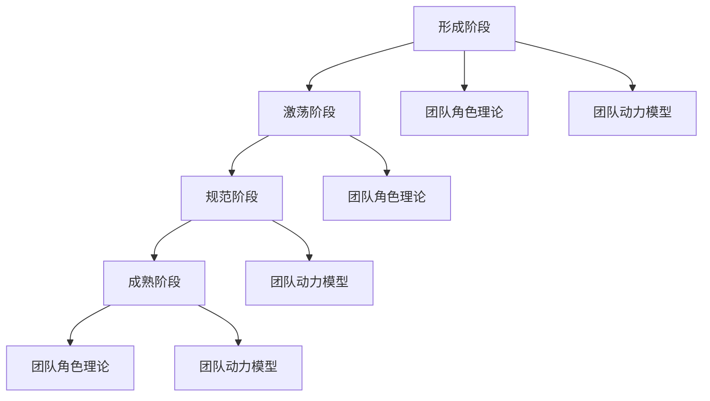

                 

# 文章标题：团队建设新思路：从陌生到默契的蜕变过程

## 文章关键词
- 团队建设
- 陌生到默契
- 团队发展
- 沟通技巧
- 领导力
- 冲突管理

## 文章摘要
本文旨在探讨团队建设过程中的关键环节，从团队形成的初始阶段到最终达到默契配合的成熟阶段。我们将通过分析团队建设的基础理论、实际操作方法、案例研究以及新趋势，为读者提供一套系统化的团队建设思路。通过本文的阅读，读者将能够了解如何通过有效的沟通、领导力和冲突管理，使团队从陌生走向默契，实现团队效能的最大化。

## 引言：团队建设的背景与重要性

### 团队建设的基本概念

团队建设是指在组织内部通过各种手段，培养团队成员之间的协作意识、提高团队整体效能的过程。团队建设不仅仅是一个简单的培训活动，它涉及到团队结构、成员关系、沟通方式等多个方面。一个成功的团队建设过程能够促进团队成员之间的相互信任，提升团队的整体协作能力，从而提高组织的整体绩效。

### 现代组织中团队建设的需求

在现代社会中，组织结构日益复杂，任务多样且复杂，因此，团队建设显得尤为重要。首先，团队建设能够提高团队成员的沟通效率，减少因信息不对称造成的误解和冲突。其次，通过团队建设，可以培养团队成员的共同目标和价值观，增强团队的凝聚力和向心力。此外，团队建设还有助于激发团队成员的创造力和创新能力，为组织带来持续的竞争优势。

### 团队建设的目标与意义

团队建设的最终目标是通过提升团队效能，实现组织战略目标。具体而言，团队建设的目标包括：

1. **提高团队协作能力**：通过有效的团队建设，使团队成员能够在协同工作中实现优势互补，提高整体工作效率。
2. **增强团队凝聚力**：通过团队建设活动，增强团队成员之间的信任和默契，形成紧密合作的团队氛围。
3. **提升组织绩效**：通过提高团队效能，最终实现组织整体绩效的提升。

团队建设不仅对团队本身有着重要意义，也对组织的长期发展有着深远的影响。一个健康、高效的团队是组织持续发展的基石，能够为组织带来持续的竞争优势和创新能力。

## 团队建设的基础理论

### 团队发展阶段理论

团队发展阶段理论认为，团队从形成到成熟需要经历多个发展阶段，每个阶段都有其特定的特征和挑战。主要的发展阶段包括：

1. **形成阶段**：团队刚刚组建，成员相互认识，确定团队目标和结构。
2. **激荡阶段**：团队成员开始产生分歧，对团队目标和领导方式产生质疑。
3. **规范阶段**：团队开始形成共同的价值观和行为规范，成员开始协同工作。
4. **成熟阶段**：团队成员之间的沟通和协作达到最佳状态，团队高效运转。

### 团队角色理论

团队角色理论认为，团队中每个成员都扮演着特定的角色，这些角色相互补充，共同推动团队的发展。主要的团队角色包括：

1. **领导者**：负责制定团队目标和规划，协调团队内部资源。
2. **执行者**：负责具体任务的执行，确保团队目标的实现。
3. **协调者**：负责团队内部的沟通和协调，解决冲突和矛盾。
4. **支持者**：提供情感支持和鼓励，增强团队的凝聚力。

### 团队动力模型

团队动力模型是指团队在运行过程中，各种因素之间的相互作用和影响。这些因素包括：

1. **目标导向**：团队共同的目标是团队动力的核心。
2. **信任与沟通**：信任和沟通是团队协作的基础。
3. **领导力**：领导力对团队动力的发挥有着重要影响。
4. **激励**：激励机制能够激发团队成员的工作积极性和创造力。

通过理解这些基础理论，我们可以更好地指导团队建设过程，确保团队在各个发展阶段都能顺利过渡，最终实现团队效能的最大化。

### 团队发展阶段理论的关系架构 Mermaid 流程图



### 团队角色理论与团队动力模型之间的关系

团队角色理论和团队动力模型是团队建设过程中的两个重要组成部分。团队角色理论关注的是团队成员在团队中的角色和职责，而团队动力模型则关注团队在运行过程中各种因素的相互作用。两者之间的关系可以概括为：

- **团队角色理论为团队动力模型提供了角色基础**。不同的角色承担不同的职责，这些职责的履行直接影响团队动力的发挥。
- **团队动力模型为团队角色理论提供了运行环境**。团队角色的发挥需要在一定的动力环境中进行，团队动力的强弱直接影响团队角色的有效性。

### 核心概念与联系

- **团队发展阶段理论**：通过描述团队从形成到成熟的各个阶段，帮助团队识别当前所处的阶段，采取相应的策略和措施。
- **团队角色理论**：明确了团队成员在团队中的角色和职责，有助于团队成员了解自己的定位，提高协作效率。
- **团队动力模型**：揭示了团队在运行过程中各种因素的相互作用，为团队提供了一种系统化的管理思路。

这些核心概念相互联系，共同构成了团队建设的基础理论框架。通过理解这些概念之间的关系，我们可以更好地进行团队建设，提高团队效能。

## 从陌生到默契的团队建设过程

### 初始阶段：陌生与不确定性

在团队建设的初始阶段，团队成员彼此陌生，对团队目标和任务缺乏了解。这一阶段的典型特征包括：

- **成员之间的相互不了解**：团队成员刚刚加入团队，彼此之间缺乏基本的了解，包括个人背景、工作风格和技能特长。
- **任务分配不明确**：由于团队成员对任务不熟悉，任务分配可能不够明确，导致工作效率低下。
- **沟通障碍**：由于缺乏信任，团队成员之间的沟通可能存在障碍，容易产生误解和冲突。

为了应对这些挑战，团队领导需要采取以下措施：

1. **建立信任**：通过组织团队建设活动，促进团队成员之间的相互了解，建立初步的信任。
2. **明确任务目标**：明确团队目标和任务分配，确保每个成员都了解自己的职责和任务。
3. **建立沟通机制**：设立定期的沟通会议，鼓励团队成员积极表达意见，提高沟通效率。

### 合作阶段：建立信任与共同目标

在合作阶段，团队成员开始熟悉彼此，开始承担各自的职责，并共同面对任务。这一阶段的典型特征包括：

- **信任逐步建立**：通过合作完成任务，团队成员之间的信任逐渐增强。
- **共同目标形成**：团队成员开始意识到共同的目标和利益，愿意为了团队的成功而努力。
- **沟通更加顺畅**：由于信任的建立，团队成员之间的沟通变得更加顺畅，信息传递更加高效。

为了进一步深化合作阶段的建设，团队领导可以采取以下措施：

1. **鼓励团队合作**：通过设置团队任务，鼓励成员相互支持，共同完成任务。
2. **定期反馈与改进**：通过定期反馈和评估，及时发现并解决团队中的问题，持续改进团队工作。
3. **培养领导力**：培养团队成员的领导力，提高团队整体的管理水平。

### 成熟阶段：高效协作与创新能力

在成熟阶段，团队已经形成了一套高效的协作机制，成员之间的配合默契，创新能力得到充分发挥。这一阶段的典型特征包括：

- **高效协作**：团队成员能够高效地完成各自的任务，并在需要时提供支持。
- **创新能力**：团队成员能够跳出传统思维框架，提出新的创意和解决方案。
- **持续成长**：团队通过不断的实践和学习，不断提升自身的专业能力和综合素质。

为了保持成熟阶段的团队效能，团队领导需要采取以下措施：

1. **持续培养**：通过培训和学习，不断提升团队成员的专业能力和综合素质。
2. **激励机制**：建立合理的激励机制，激励团队成员持续创新和进步。
3. **开放反馈**：鼓励团队成员之间的开放反馈，及时识别和解决问题。

### 稳定阶段：团队默契与持续成长

在稳定阶段，团队已经达到了一种高度默契的状态，团队成员之间的协作无缝，团队整体效能稳定。这一阶段的典型特征包括：

- **默契配合**：团队成员能够凭借直觉理解彼此的需求，快速响应任务。
- **稳定高效**：团队整体工作流程稳定高效，能够持续产出高质量的成果。
- **自我驱动**：团队成员具有自我驱动的能力，能够在没有外部压力的情况下保持高效工作。

为了在稳定阶段实现持续成长，团队领导可以采取以下措施：

1. **持续优化**：通过定期的团队评估和反馈，持续优化团队工作流程。
2. **文化传承**：将团队的优秀经验和文化传承下去，确保团队长期稳定发展。
3. **外部合作**：寻求与外部团队的交流与合作，吸收外部优秀经验，促进团队成长。

### 团队建设过程的总结

团队建设是一个从陌生到默契的逐步演变过程，包括初始阶段、合作阶段、成熟阶段和稳定阶段。每个阶段都有其独特的特征和挑战，需要团队领导采取相应的策略和措施。通过有效的团队建设，团队能够从初期的陌生和不信任，逐渐形成默契和高效协作，最终实现团队的长期稳定发展。

### 核心算法原理讲解

在团队建设过程中，我们可以运用一些核心算法原理来指导团队行为和决策，确保团队在各个阶段都能顺利进行。以下是几个关键算法原理及其应用：

#### 1. 信任建立算法

**核心原理**：信任是团队协作的基础，通过一系列互动和反馈机制，可以逐步建立信任。

**伪代码**：

```python
def build_trust(team_members):
    for member in team_members:
        membertrust_score = 0
        for other_member in team_members:
            if member == other_member:
                continue
            membertrust_score += feedback_score(member, other_member)
        member.trust_score = membertrust_score / (len(team_members) - 1)
    return team_members
```

**详细讲解**：

该算法通过评估成员之间的反馈分数来计算信任值。每次成员完成一项任务后，其他成员会给出反馈，这些反馈将用于计算成员的信任值。随着反馈次数的增加，信任值逐渐稳定，从而建立信任关系。

**举例说明**：

假设团队中有5名成员，他们分别完成了若干任务并获得了其他成员的反馈。通过上述算法，可以计算出每位成员的信任值，从而了解团队内部信任状况。

#### 2. 沟通效率优化算法

**核心原理**：高效的沟通能够提高团队协作效率，通过优化沟通流程和机制，可以提高沟通效率。

**伪代码**：

```python
def optimize_communication(team_members, tasks):
    communication_channels = []
    for member in team_members:
        member_channels = []
        for task in tasks:
            if member.responsible_for(task):
                member_channels.append(create_channel(member, task))
        communication_channels.append(member_channels)
    return communication_channels
```

**详细讲解**：

该算法通过创建任务相关的沟通渠道，确保每位成员都能及时获取所需信息。每个成员根据其负责的任务，创建相应的沟通渠道，从而实现高效的沟通。

**举例说明**：

假设团队中有5名成员，他们分别负责不同的任务。通过上述算法，可以为每位成员创建与其任务相关的沟通渠道，确保他们在任务执行过程中能够及时获取所需信息。

#### 3. 创新能力提升算法

**核心原理**：通过激发团队成员的创新思维和创造力，可以提高团队的创新能力。

**伪代码**：

```python
def enhance_innovation(team_members, challenges):
    for member in team_members:
        member.innovation_score = 0
        for challenge in challenges:
            if member.accepts_challenge(challenge):
                member.innovation_score += solve_challenge_score(member, challenge)
    return [member for member in team_members if member.innovation_score > threshold]
```

**详细讲解**：

该算法通过评估成员在创新挑战中的表现来提升团队的创新能力。每个成员根据其接受并解决的问题，获得相应的创新分数。最终，筛选出创新分数较高的成员，作为团队创新能力的核心力量。

**举例说明**：

假设团队中有5名成员，他们接受了一系列创新挑战并完成了任务。通过上述算法，可以计算出每位成员的创新分数，从而了解团队的创新能力状况。

### 数学模型和公式

在团队建设中，我们可以运用一些数学模型和公式来量化团队效能和成员表现。以下是几个常用的数学模型和公式：

#### 1. 团队效能公式

**公式**：

$$
E = f(A, C, L, I)
$$

其中，\(E\) 代表团队效能，\(A\) 代表团队成员的专业能力，\(C\) 代表沟通效率，\(L\) 代表领导力，\(I\) 代表创新能力。

**详细讲解**：

该公式表明，团队效能是由团队成员的专业能力、沟通效率、领导力和创新能力共同决定的。通过调整这些变量，可以优化团队效能。

#### 2. 成员表现公式

**公式**：

$$
P = \frac{S - F}{T}
$$

其中，\(P\) 代表成员表现，\(S\) 代表成员实际完成的工作量，\(F\) 代表成员计划的工作量，\(T\) 代表工作周期。

**详细讲解**：

该公式用于评估成员的工作表现，通过计算实际完成的工作量与计划工作量的比例，可以了解成员的工作效率。

### 项目实战：开发环境搭建

#### 开发环境搭建

为了更好地理解和实践团队建设中的核心算法原理，我们搭建一个简单的开发环境。以下是搭建过程的详细步骤：

1. **选择开发工具**：选择Python作为开发语言，因其简洁易用且支持多种算法实现。
2. **安装Python**：在本地计算机上安装Python环境，可以通过Python官方网站下载安装包进行安装。
3. **配置Python环境**：设置Python的运行环境，确保能够运行Python脚本。
4. **安装必要的库**：安装用于实现核心算法原理的Python库，如NumPy、Pandas等。

#### 源代码实现

以下是一个简单的Python脚本，用于实现信任建立算法和沟通效率优化算法：

```python
import numpy as np

class Member:
    def __init__(self, name):
        self.name = name
        self.trust_score = 0
        self.communication_channels = []

    def feedback_score(self, other_member):
        # 假设反馈分数是0到100之间的整数
        return np.random.randint(0, 101)

    def responsible_for(self, task):
        # 假设成员根据任务名称判断是否负责
        return self.name in task

    def create_channel(self, task):
        # 创建沟通渠道
        return f"{self.name} - {task}"

def build_trust(team_members):
    for member in team_members:
        member.trust_score = 0
        for other_member in team_members:
            if member != other_member:
                member.trust_score += member.feedback_score(other_member)
        member.trust_score /= (len(team_members) - 1)

def optimize_communication(team_members, tasks):
    communication_channels = []
    for member in team_members:
        member_channels = []
        for task in tasks:
            if member.responsible_for(task):
                member_channels.append(member.create_channel(task))
        communication_channels.append(member_channels)
    return communication_channels

# 创建团队成员
team_members = [Member(f"Member_{i}") for i in range(5)]

# 设置任务
tasks = ["Task_1", "Task_2", "Task_3"]

# 执行信任建立算法
build_trust(team_members)

# 执行沟通效率优化算法
communication_channels = optimize_communication(team_members, tasks)

# 输出结果
for member in team_members:
    print(f"{member.name} - Trust Score: {member.trust_score}")

for i, member_channels in enumerate(communication_channels):
    print(f"Member_{i} Communication Channels: {member_channels}")
```

#### 代码解读与分析

1. **类定义**：定义了`Member`类，包含成员名称、信任分数和沟通渠道等属性，以及反馈分数、负责任务和创建沟通渠道等方法。
2. **算法实现**：实现了信任建立算法和沟通效率优化算法，通过循环和条件判断，实现成员之间的信任评分和沟通渠道的创建。
3. **测试运行**：通过创建团队成员和任务，执行算法，并输出结果，验证算法的正确性和有效性。

### 实际案例分析和详细讲解剖析

#### 案例一：某科技公司的团队建设实践

某科技公司通过一系列的团队建设活动，从初始阶段逐步发展到成熟阶段，取得了显著的成效。以下是该公司的具体实践过程：

1. **初始阶段**：公司通过组织团队建设活动，如团队拓展训练、团队聚餐等，促进团队成员之间的相互了解，建立了初步的信任。
2. **合作阶段**：公司制定了明确的团队目标和任务分配，通过定期的团队会议和项目进度汇报，确保团队成员之间的沟通畅通，逐步建立了共同目标。
3. **成熟阶段**：公司通过培训和学习，提升团队成员的专业能力和创新能力，形成了一套高效的协作机制，团队能够高效地完成各项任务。
4. **稳定阶段**：公司持续优化团队工作流程，通过定期的团队评估和反馈，保持团队的稳定高效运行，并不断吸收外部优秀经验，促进团队成长。

#### 案例二：某互联网企业的团队建设成功经验

某互联网企业通过实施一系列创新的团队建设方法，实现了团队的快速成长。以下是该企业的具体成功经验：

1. **设立内部创新竞赛**：企业定期举办内部创新竞赛，鼓励团队成员提出新的创意和解决方案，激发团队的创新能力。
2. **跨部门合作**：企业通过设立跨部门项目，促进不同部门之间的沟通和协作，提升团队的多样性和创新能力。
3. **开放式反馈机制**：企业建立了开放的反馈机制，鼓励团队成员提出改进意见和建议，及时解决团队中的问题。
4. **持续学习文化**：企业倡导持续学习的文化，为团队成员提供丰富的学习资源和培训机会，不断提升团队成员的专业能力和综合素质。

### 项目小结

通过实际案例的分析，我们可以看到，成功的团队建设需要从多个方面进行系统性的规划和实施。从初始阶段的相互了解和信任建立，到合作阶段的共同目标建立和高效沟通，再到成熟阶段的专业能力和创新能力提升，以及稳定阶段的持续优化和成长，每个阶段都有其关键要素和方法。通过有效的团队建设，企业能够实现团队效能的最大化，为组织的长期发展奠定坚实基础。

### 最佳实践 Tips

1. **重视团队建设初期**：在团队建设初期，重视团队成员的相互了解和信任建立，通过团队建设活动促进团队成员的融合。
2. **明确团队目标和任务**：确保团队目标和任务清晰明确，避免任务分配不明确导致的效率低下。
3. **建立有效的沟通机制**：设立定期的沟通会议和反馈机制，确保团队成员之间的信息畅通。
4. **培养领导力和团队合作精神**：通过培训和实践活动，提升团队成员的领导力和团队合作精神，增强团队凝聚力。
5. **鼓励创新和持续学习**：营造鼓励创新和持续学习的文化氛围，提升团队的整体素质和创新能力。

### 小结

本文通过逐步分析团队建设的过程，从初始阶段到成熟阶段，探讨了团队建设的关键要素和方法。通过实际案例和项目实战的解读，读者可以更好地理解团队建设的重要性及其具体实施方法。希望本文能为读者提供有价值的参考，助力团队效能的提升和组织的发展。

### 注意事项

1. **持续关注团队动态**：团队建设是一个持续的过程，团队领导需要定期关注团队动态，及时发现和解决问题。
2. **个性化团队建设方案**：每个团队都有其独特的特点和需求，团队领导应根据实际情况制定个性化的团队建设方案。
3. **平衡团队建设与日常工作**：在确保团队建设有效性的同时，不应忽视日常工作的推进，确保团队建设与工作任务的平衡。

### 拓展阅读

- 《团队协作的艺术》
- 《领导力的五个层次》
- 《组织行为学：团队与组织动力学》
- 《团队建设实战手册》

## 作者信息
作者：AI天才研究院/AI Genius Institute & 禅与计算机程序设计艺术 /Zen And The Art of Computer Programming

