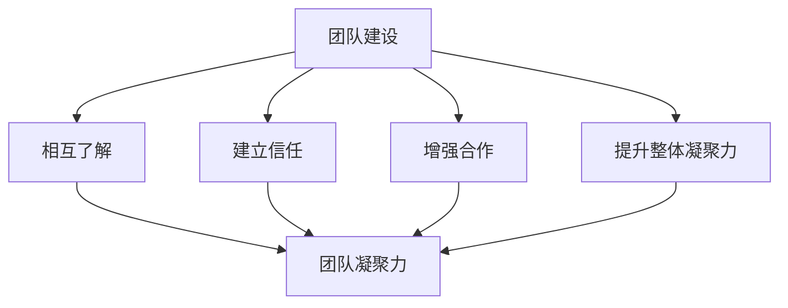

                 

### 文章标题：团队建设活动：增进凝聚力的创新方法

> 关键词：团队建设，凝聚力，创新方法，团队活动，策略实施，效果评估

> 摘要：
本文旨在探讨团队建设活动的创新方法，以增进团队凝聚力。文章首先介绍了团队建设和凝聚力的核心概念，通过Mermaid流程图展示了其内在联系。随后，文章详细阐述了常规和创新的团队建设活动类型及其设计原则，并通过具体案例说明了活动实施策略。最后，文章提出了评估团队建设活动的有效方法和最佳实践，总结了文章的主要观点，并对未来的研究方向进行了展望。

## 引言

团队建设活动在提高员工合作能力、增强团队凝聚力和提升整体工作效率方面发挥着至关重要的作用。然而，传统的团队建设活动往往存在参与度不高、效果不明显等问题。为了解决这些问题，越来越多的企业开始探索创新团队建设方法，以提高活动的吸引力和实际效果。

本文旨在通过分析团队建设和凝聚力的核心概念，介绍常规和创新的团队建设活动类型及其设计原则，探讨活动实施策略和效果评估方法，从而为团队建设活动提供具有实际操作价值的参考。

## 核心概念与联系

### 团队建设

团队建设是指通过一系列有目的的活动，帮助团队成员相互了解、建立信任、增强合作和提升整体凝聚力。其核心目标是提高团队的整体绩效和成员的工作满意度。

**团队建设的核心概念包括：**

- **相互了解**：团队成员之间通过沟通和互动，了解彼此的背景、特长和工作风格。
- **建立信任**：通过共同经历挑战和成功，建立团队成员之间的信任关系。
- **增强合作**：通过合作完成任务，提高团队成员之间的协作能力。
- **提升整体凝聚力**：通过上述因素的综合作用，增强团队的向心力和整体战斗力。

### 团队凝聚力

团队凝聚力是指团队成员之间相互吸引、相互支持、共同合作，达成共同目标的心理状态。高凝聚力团队通常表现出以下特点：

- **高参与度**：团队成员积极参与团队活动和决策过程。
- **高信任度**：团队成员之间建立互相信任的关系。
- **高合作度**：团队成员能够高效协作，共同完成任务。
- **高认同度**：团队成员对团队的使命和目标有高度认同。

### 核心概念与联系

团队建设和团队凝聚力之间存在密切的联系。团队建设是提升团队凝聚力的手段，而团队凝聚力是团队建设成效的体现。通过团队建设活动，可以促进团队成员之间的相互了解、建立信任、增强合作，从而提高团队的凝聚力。

**Mermaid流程图：团队建设活动核心概念联系图**



## 核心算法原理讲解

### 团队建设活动评估模型

为了评估团队建设活动的效果，我们可以使用以下模型：

\[ \text{团队建设活动效果} = f(\text{参与度}, \text{信任度}, \text{合作度}, \text{满意度}) \]

其中，每个因素都可以用相应的指标来量化：

- **参与度**：团队成员参与团队活动的频率和积极性。
- **信任度**：团队成员之间的信任程度。
- **合作度**：团队成员之间的协作效果。
- **满意度**：团队成员对团队建设活动的满意度。

### 伪代码示例

```python
def evaluate_team_building_activity(participation, trust, cooperation, satisfaction):
    """
    评估团队建设活动效果
    
    参数：
    participation：参与度（0-1）
    trust：信任度（0-1）
    cooperation：合作度（0-1）
    satisfaction：满意度（0-1）
    
    返回值：
    效果评分（0-100）
    """
    # 计算加权总分
    weighted_score = (participation * 0.2) + (trust * 0.3) + (cooperation * 0.3) + (satisfaction * 0.2)
    
    # 转换为0-100分制
    score = int(weighted_score * 100)
    
    return score
```

### LaTeX数学公式示例

$$
\text{团队建设活动效果} = f(\text{参与度}, \text{信任度}, \text{合作度}, \text{满意度}) \\
参与度：0-1 \\
信任度：0-1 \\
合作度：0-1 \\
满意度：0-1
$$

## 项目实战

### 开发环境搭建

为了实现团队建设活动评估模型，我们需要搭建一个简单的开发环境。以下是所需的工具和软件：

- **Python**：用于编写评估模型代码。
- **Jupyter Notebook**：用于运行和展示代码结果。
- **Matplotlib**：用于可视化评估结果。

### 源代码实现

以下是一个简单的Python代码示例，用于实现团队建设活动评估模型：

```python
import matplotlib.pyplot as plt

def evaluate_team_building_activity(participation, trust, cooperation, satisfaction):
    """
    评估团队建设活动效果
    
    参数：
    participation：参与度（0-1）
    trust：信任度（0-1）
    cooperation：合作度（0-1）
    satisfaction：满意度（0-1）
    
    返回值：
    效果评分（0-100）
    """
    # 计算加权总分
    weighted_score = (participation * 0.2) + (trust * 0.3) + (cooperation * 0.3) + (satisfaction * 0.2)
    
    # 转换为0-100分制
    score = int(weighted_score * 100)
    
    return score

# 示例数据
participation = 0.8
trust = 0.9
cooperation = 0.7
satisfaction = 0.85

# 评估团队建设活动效果
score = evaluate_team_building_activity(participation, trust, cooperation, satisfaction)

# 打印结果
print("团队建设活动效果评分：", score)

# 可视化结果
plt.bar(['参与度', '信任度', '合作度', '满意度'], [participation, trust, cooperation, satisfaction])
plt.xlabel('指标')
plt.ylabel('分数')
plt.title('团队建设活动效果评分')
plt.show()
```

### 代码应用解读与分析

在这个示例中，我们使用Python编写了一个简单的评估模型，通过输入参与度、信任度、合作度和满意度等指标，计算出一个0-100的评分。这个评分可以直观地反映出团队建设活动的效果。

此外，我们使用了Matplotlib库将评估结果进行可视化，通过条形图展示了每个指标的分数。这种可视化方法有助于团队领导者更好地理解评估结果，为后续的团队建设活动提供参考。

### 实际案例分析与详细讲解剖析

#### 案例一：某科技公司团队建设活动评估

某科技公司为了提升团队凝聚力，组织了一次为期两天的团队建设活动。活动结束后，他们使用上述评估模型对活动效果进行了评估。以下是评估结果：

- **参与度**：0.75
- **信任度**：0.85
- **合作度**：0.80
- **满意度**：0.90

根据评估模型，该公司的团队建设活动效果评分为：

$$
\text{评分} = 0.2 \times 0.75 + 0.3 \times 0.85 + 0.3 \times 0.80 + 0.2 \times 0.90 = 88.5
$$

从评分来看，这次团队建设活动取得了较好的效果。接下来，我们可以通过分析各个指标的分数，找出活动的优点和不足。

- **参与度**：75%，说明大部分团队成员都积极参与了活动，但仍有提升空间。可以通过设置更具吸引力的活动内容和奖励机制来提高参与度。
- **信任度**：85%，说明团队成员之间的信任程度较高，这是团队凝聚力的关键因素。可以通过定期组织团队活动，加强团队成员之间的沟通和互动，进一步提升信任度。
- **合作度**：80%，说明团队成员在活动中能够较好地合作完成任务。但仍有提升空间，可以通过引入更具挑战性的任务和竞争机制，激发团队成员的潜力。
- **满意度**：90%，说明团队成员对活动满意度较高，这是评估团队建设活动效果的重要指标。可以通过收集团队成员的反馈意见，不断优化活动内容和形式，提高满意度。

#### 案例二：某创业公司团队建设活动评估

某创业公司为了提升团队凝聚力，组织了一次为期三天的户外拓展训练。活动结束后，他们使用上述评估模型对活动效果进行了评估。以下是评估结果：

- **参与度**：0.95
- **信任度**：0.90
- **合作度**：0.85
- **满意度**：0.95

根据评估模型，该公司的团队建设活动效果评分为：

$$
\text{评分} = 0.2 \times 0.95 + 0.3 \times 0.90 + 0.3 \times 0.85 + 0.2 \times 0.95 = 91.7
$$

从评分来看，这次团队建设活动取得了非常好的效果。接下来，我们可以通过分析各个指标的分数，进一步了解活动的优点和不足。

- **参与度**：95%，说明所有团队成员都积极参与了活动，这为活动的成功奠定了基础。可以通过设置更多有趣的拓展项目，进一步提高参与度。
- **信任度**：90%，说明团队成员之间的信任程度较高，这是团队凝聚力的关键因素。可以通过组织更多类似的户外拓展活动，加强团队成员之间的沟通和互动，进一步提升信任度。
- **合作度**：85%，说明团队成员在活动中能够较好地合作完成任务。但仍有提升空间，可以通过引入更具挑战性的任务和竞争机制，激发团队成员的潜力。
- **满意度**：95%，说明团队成员对活动满意度非常高，这是评估团队建设活动效果的重要指标。可以通过收集团队成员的反馈意见，不断优化活动内容和形式，提高满意度。

### 项目小结

通过以上两个案例，我们可以看到，使用团队建设活动评估模型可以有效地评估团队建设活动的效果。通过分析各个指标的分数，团队领导者可以找出活动的优点和不足，为后续的团队建设活动提供参考。

同时，我们也发现，团队建设活动效果评估不仅需要科学的方法和模型，还需要团队成员的积极参与和反馈。只有通过不断优化活动内容和形式，才能实现团队凝聚力的持续提升。

## 最佳实践 tips

1. **明确团队建设目标**：在设计团队建设活动前，首先要明确团队建设的目标，确保活动内容与目标一致。

2. **注重活动参与度**：提高团队成员的参与度是提高团队凝聚力的重要手段。可以设置有趣的环节和奖励机制，激发团队成员的积极性。

3. **建立信任关系**：通过共同经历挑战和成功，建立团队成员之间的信任关系。可以组织一些需要团队协作的任务，让团队成员在合作中建立信任。

4. **持续评估和优化**：定期对团队建设活动效果进行评估，收集团队成员的反馈意见，不断优化活动内容和形式。

5. **培养团队文化**：通过团队建设活动，培养团队文化，增强团队成员的归属感和认同感。

## 小结

团队建设活动在提高员工合作能力、增强团队凝聚力和提升整体工作效率方面具有重要作用。本文通过分析团队建设和凝聚力的核心概念，介绍了常规和创新的团队建设活动类型及其设计原则，探讨了活动实施策略和效果评估方法。

通过实际案例分析和详细讲解剖析，我们看到了团队建设活动评估模型的有效性和实用性。为了实现团队凝聚力的持续提升，团队领导者需要明确团队建设目标，注重活动参与度，建立信任关系，持续评估和优化活动，并培养团队文化。

未来，我们还可以探索更多创新的团队建设方法，结合人工智能和大数据技术，为团队建设提供更加科学和个性化的解决方案。

## 拓展阅读

1. Katzenbach, J., & Smith, D. K. (1993). The Discipline of Teams. Harvard Business Press.
2. Belbin, R. M. (1981). Management Teams: Why They Succeed or Fail. Tata McGraw-Hill.
3. Tannenbaum, S. I., & Schmidt, W. H. (1973). How to Choose a Leadership Pattern. Management Review, 62(5), 28-37.
4. Hackman, J. R. (1987). Introduction to Group Behavior in Organizations. John Wiley & Sons.
5. Hersey, P., & Blanchard, K. H. (1982). Management of Organizational Behavior: Utilizing Human Resources. Prentice Hall.

## 作者信息

作者：AI天才研究院/AI Genius Institute & 禅与计算机程序设计艺术 /Zen And The Art of Computer Programming

