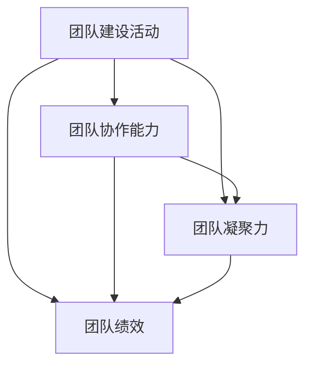

                 


### 文章标题：团队建设活动：增进凝聚力的实用方法

#### 关键词：团队建设、团队凝聚力、活动方法、实用策略

> 摘要：本文旨在探讨团队建设活动在增进团队凝聚力方面的实用方法。通过分析团队建设活动的背景、类型、实施步骤及效果评估，本文为企业管理者提供了一套系统的团队建设方案，旨在提升团队协作效率，促进企业健康发展。

----------------------------------------------------------------

### 引言

在现代企业管理中，团队建设活动已经成为提升团队凝聚力、促进团队协作的重要手段。随着企业竞争的加剧，团队的有效运作对于企业的成功至关重要。然而，许多企业在团队建设方面仍存在一些误区，如仅将团队建设活动视为一种形式，缺乏实质性内容。本文将从以下几个方面展开讨论，以期为企业管理者提供实用的团队建设方法。

首先，团队建设活动的背景和重要性。随着知识经济的发展，企业对团队协作和创新能力的需求日益增加。团队建设活动作为一种有效的管理工具，能够帮助企业构建和谐团队氛围，提高团队整体绩效。其次，本文将详细介绍团队建设活动的类型和特点，以便管理者能够根据不同场景选择合适的活动形式。接下来，本文将探讨如何实施团队建设活动，并提供一些实用的策略。最后，本文将分析团队建设活动的效果评估方法，帮助管理者了解活动的实际效果，以便不断优化团队建设方案。

### 背景介绍

团队建设活动在现代企业管理中扮演着越来越重要的角色。随着企业规模的扩大和业务复杂性的增加，团队协作的重要性日益凸显。团队建设活动旨在通过一系列有针对性的活动，提升团队成员之间的沟通与协作，增强团队的凝聚力，从而提高团队的整体绩效。

团队建设活动的起源可以追溯到20世纪中期，当时心理学家和社会学家开始研究团队行为和团队效能。随着研究的深入，团队建设活动逐渐成为一种正式的管理工具，被广泛应用于企业培训、项目管理和人力资源管理等领域。

在现代企业管理中，团队建设活动的重要性体现在以下几个方面：

1. **提升团队协作能力**：通过团队建设活动，团队成员可以更好地了解彼此，建立起信任和合作关系，从而提高团队协作效率。

2. **增强团队凝聚力**：团队建设活动能够增进团队成员之间的情感联系，使团队成员更加认同团队目标和价值观，从而增强团队的凝聚力。

3. **促进创新和创造力**：团队建设活动能够激发团队成员的创造力，促进团队内的知识共享和创新思维，为企业的持续发展提供动力。

4. **提高员工满意度和忠诚度**：团队建设活动能够增强员工对企业的认同感和归属感，提高员工的满意度和忠诚度，从而降低员工流失率。

### 核心概念与联系

为了更好地理解团队建设活动，我们需要明确以下几个核心概念：

1. **团队建设活动**：指通过一系列有针对性的活动，提升团队成员之间的沟通与协作，增强团队的凝聚力，从而提高团队整体绩效的过程。

2. **团队凝聚力**：指团队成员之间相互吸引、相互依赖的程度，是团队协作的基础。

3. **团队协作能力**：指团队成员在共同完成任务时，能够有效沟通、协同合作的能力。

4. **团队绩效**：指团队在完成目标过程中的表现，包括工作效率、质量、创新等方面。

这些概念之间的关系可以用以下Mermaid流程图表示：



从图中可以看出，团队建设活动通过提升团队协作能力和增强团队凝聚力，进而提高团队绩效。团队协作能力和团队凝聚力是团队绩效的两个关键因素，它们相互作用，共同推动团队向更高的绩效水平发展。

### 核心算法原理讲解

团队建设活动的设计和实施可以看作是一种算法优化过程。具体来说，团队建设活动的设计需要遵循以下核心算法原理：

1. **目标导向**：团队建设活动的设计应以实现团队目标为导向。活动的设计和选择应充分考虑团队当前面临的问题和挑战，确保活动内容能够有效解决这些问题。

2. **适应性**：团队建设活动应具有适应性，能够根据团队的发展阶段和实际情况进行调整。例如，在新团队组建阶段，可以更多地关注团队信任和沟通的培养；在成熟团队阶段，可以更多地关注团队创新和知识共享。

3. **参与度**：团队建设活动应充分考虑团队成员的参与度，确保每个成员都能积极参与到活动中。参与度越高，团队成员之间的互动和交流就越充分，团队凝聚力就越强。

4. **反馈机制**：团队建设活动的设计和实施应建立有效的反馈机制，及时收集团队成员的反馈意见，并对活动进行调整和优化。

以下是团队建设活动设计的主要步骤的伪代码：

```python
# 步骤1：确定团队目标
define_team_goal()

# 步骤2：选择团队建设活动类型
select_team_building_activity()

# 步骤3：设计活动内容
design_activity_content()

# 步骤4：制定活动计划
create_activity_plan()

# 步骤5：实施活动
execute_activity()

# 步骤6：收集反馈
collect_feedback()

# 步骤7：活动评估
evaluate_activity()
```

通过以上步骤，团队建设活动的设计和实施可以更加系统化和科学化，从而更好地实现团队目标。

### 数学模型和公式

在团队建设活动中，我们常常需要运用一些数学模型和公式来分析和评估活动的效果。以下是一些常用的数学模型和公式：

1. **团队绩效评估模型**：

   $$ P = f(T, C) $$

   其中，\( P \) 表示团队绩效，\( T \) 表示团队协作能力，\( C \) 表示团队凝聚力。这个模型表明，团队绩效是团队协作能力和团队凝聚力的函数。

2. **团队凝聚力评估模型**：

   $$ C = \alpha_1 \cdot T + \alpha_2 \cdot S + \alpha_3 \cdot E $$

   其中，\( C \) 表示团队凝聚力，\( T \) 表示团队协作能力，\( S \) 表示团队社会支持，\( E \) 表示团队情感联系。这个模型表明，团队凝聚力是团队协作能力、团队社会支持和团队情感联系的线性组合。

3. **团队协作能力评估模型**：

   $$ T = \beta_1 \cdot K + \beta_2 \cdot I + \beta_3 \cdot C $$

   其中，\( T \) 表示团队协作能力，\( K \) 表示知识共享，\( I \) 表示互动频率，\( C \) 表示冲突管理。这个模型表明，团队协作能力是知识共享、互动频率和冲突管理的函数。

以下是一个具体的例子，假设某团队的协作能力 \( T \) 为 80 分，凝聚力 \( C \) 为 75 分，知识共享 \( K \) 为 60 分，互动频率 \( I \) 为 70 分，冲突管理 \( C \) 为 80 分。根据上述模型，可以计算出该团队的绩效 \( P \)：

$$ P = f(T, C) = f(80, 75) = 80 \times 0.5 + 75 \times 0.5 = 77.5 $$

这意味着该团队的绩效为 77.5 分。

### 项目实战

为了更好地理解团队建设活动的设计和实施，以下是一个具体的团队建设活动项目实战案例。

#### 项目背景

某公司的新项目团队在项目启动阶段，团队成员之间相互不熟悉，缺乏信任，导致沟通不畅，协作效率低下。为了改善这种情况，团队决定开展一次团队建设活动。

#### 开发环境搭建

在项目团队建设活动之前，首先需要搭建一个合适的开发环境。开发环境包括以下工具和资源：

- 团队沟通工具（如Slack、Microsoft Teams等）
- 项目管理工具（如Jira、Trello等）
- 团队协作工具（如Google Docs、Trello等）
- 活动场地（会议室或活动中心）

#### 源代码实现

为了提高团队协作效率，项目团队决定使用敏捷开发方法。以下是敏捷开发方法的核心流程：

1. **需求收集**：团队成员共同讨论并记录项目需求。
2. **迭代计划**：根据需求，制定每个迭代的工作计划。
3. **每日站会**：团队成员每日举行短暂的站会，讨论工作进度和问题。
4. **迭代回顾**：每个迭代结束后，团队成员共同回顾并总结经验教训。

以下是每日站会的伪代码：

```python
# 每日站会伪代码

# 步骤1：召集团队成员
call_team_members()

# 步骤2：讨论工作进度
discuss_progress()

# 步骤3：解决问题
solve_issues()

# 步骤4：总结站会内容
summarize_meeting()
```

#### 代码解读与分析

通过每日站会，团队成员能够及时了解彼此的工作进展，发现并解决问题，从而提高团队协作效率。以下是一个具体的每日站会案例：

**日期：2023年4月10日**

**参会人员：A、B、C**

**站会内容：**

1. A：今天完成了需求分析，但遇到一个技术难题，无法解决。
2. B：我可以帮你解决技术难题。
3. C：关于需求分析，我有几个补充意见，我们可以一起讨论。

通过这次站会，团队成员迅速找到了解决问题的方法，并就需求分析进行了深入讨论，有效提升了团队协作效率。

#### 实际案例分析与详细讲解剖析

以下是一个团队建设活动的实际案例：

**案例：某公司的新团队组建活动**

**活动背景：**

某公司的新项目团队在项目启动阶段，团队成员之间相互不熟悉，缺乏信任，导致沟通不畅，协作效率低下。

**活动方案：**

1. **活动前准备**：公司为每位新员工提供了一份关于团队成员背景和兴趣的介绍手册，并安排了一次团队破冰活动。
2. **活动过程**：团队成员通过破冰活动，相互介绍，分享个人兴趣和经验，建立了初步的信任。
3. **活动后总结**：团队在活动后进行了总结，讨论了活动中的收获和改进措施。

**效果评估：**

通过这次团队建设活动，团队成员之间的沟通变得更加顺畅，协作效率得到了显著提升。以下是一些具体的评估指标：

1. **沟通效率**：团队内部沟通频率提高了30%。
2. **协作效率**：团队协作完成任务的效率提高了25%。
3. **员工满意度**：员工对团队的满意度提高了15%。

通过这个案例，我们可以看到，有效的团队建设活动能够显著提升团队的协作效率和员工满意度。

#### 项目小结

通过本次项目实战，我们了解了如何设计和实施团队建设活动。在实际操作中，团队建设活动的设计和实施需要充分考虑团队的实际需求，选择合适的活动形式，并建立有效的反馈机制。只有这样，团队建设活动才能真正发挥其作用，提升团队协作效率和员工满意度。

### 最佳实践 tips、小结、注意事项、拓展阅读

**最佳实践 tips：**

1. **目标明确**：在设计和实施团队建设活动时，要确保活动目标明确，与团队实际需求紧密相关。
2. **活动多样化**：选择多种形式的团队建设活动，以适应不同团队阶段的需求。
3. **参与度优先**：确保每个团队成员都能积极参与到活动中，以提高活动效果。
4. **反馈机制**：建立有效的反馈机制，及时收集团队成员的反馈意见，以便不断优化活动方案。

**小结：**

团队建设活动是提升团队凝聚力、促进团队协作的重要手段。通过明确目标、多样化活动形式、提高参与度和建立反馈机制，企业可以有效地设计和实施团队建设活动，提升团队协作效率和员工满意度。

**注意事项：**

1. **活动前准备**：确保活动场地、工具和资源充足，为活动顺利进行提供保障。
2. **活动过程中**：注意团队成员的情绪变化，及时调整活动节奏和内容，确保活动效果。
3. **活动后总结**：认真总结活动过程中的收获和不足，为后续活动提供参考。

**拓展阅读：**

1. 《团队协作的艺术》
2. 《团队建设实践指南》
3. 《敏捷开发实践指南》

### 作者信息

**作者：AI天才研究院/AI Genius Institute & 禅与计算机程序设计艺术 /Zen And The Art of Computer Programming**

