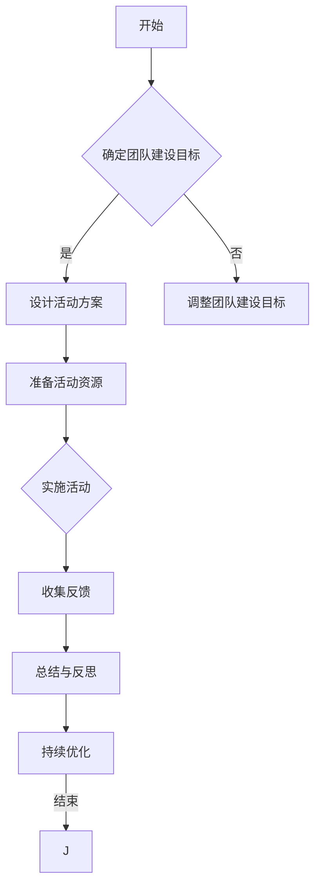

                 

## 《团队建设活动：增进团队凝聚力的创新方法》

### 关键词：
团队建设、凝聚力、创新方法、团队活动、互动协作

### 摘要：
本文将探讨团队建设活动在增进团队凝聚力方面的创新方法。通过对团队建设意义的深入分析，我们将介绍一系列创新的团队建设活动，并利用案例和实践指导，展示这些活动如何有效地提升团队凝聚力。文章将通过理论阐述、活动设计、案例分析、实践指导和附录等部分，为读者提供全面、实用的团队建设参考。

## 引言

### 1.1 团队建设的意义与挑战

在现代企业中，团队建设活动已成为提高组织绩效、促进员工满意度和实现战略目标的关键因素。一个高效的团队不仅能够提高工作效率，还能在面临挑战时保持良好的适应性和创新力。然而，团队建设并非易事，许多企业在实施团队建设活动时面临着诸多挑战，如团队成员之间的沟通障碍、信任缺失和目标不一致等。

团队建设的重要性主要体现在以下几个方面：

- **提高工作效率**：通过团队建设活动，团队成员能够更好地理解彼此的角色和职责，从而提高协作效率。
- **增强员工满意度**：良好的团队氛围能够提升员工的幸福感和归属感，降低离职率。
- **实现战略目标**：团队建设有助于确保团队成员对组织战略目标的理解和认同，从而实现共同的目标。

### 1.2 为什么需要创新团队建设活动

传统的团队建设活动虽然在一定程度上能够增进团队成员之间的了解和信任，但在面对现代企业复杂多变的环境时，其效果往往有限。因此，创新团队建设活动应运而生。这些活动旨在通过新颖的形式和内容，激发团队成员的参与热情，提高团队凝聚力。

创新团队建设活动的必要性体现在以下几个方面：

- **适应现代工作环境**：现代企业工作环境多变，需要团队成员具备快速适应和协同合作的能力。
- **提高参与度**：新颖的活动形式能够吸引团队成员的积极参与，提高活动的效果。
- **增强团队凝聚力**：创新活动能够帮助团队成员在共同的目标和挑战中建立深厚的信任和合作关系。

### 1.3 本书的结构安排与学习目标

本文将从团队建设的意义、理论基础、创新活动设计、案例分析、实践指导等方面展开，旨在为读者提供全面、实用的团队建设参考。具体结构安排如下：

- **第一部分：引言**：介绍团队建设的意义、挑战和本书的创新之处。
- **第二部分：团队建设理论基础**：阐述团队发展的阶段模型、团队凝聚力理论、团队互动行为理论和团队效能理论。
- **第三部分：创新团队建设活动设计**：介绍创新思维训练活动、团队协作游戏设计、领导力提升活动和跨部门沟通与协作活动。
- **第四部分：案例分析**：通过具体案例展示创新团队建设活动的实际效果。
- **第五部分：实践指导**：提供团队建设活动的实施流程、效果评估与反馈以及持续优化的方法。
- **第六部分：附录**：提供团队建设活动的资源推荐、工具介绍和进一步学习的参考资料。

通过阅读本书，读者将能够：

- **理解团队建设的核心概念**：掌握团队建设的理论基础，了解不同团队建设活动的作用和效果。
- **设计创新的团队建设活动**：学会设计适合自己团队的创新活动，提高团队凝聚力和协作效率。
- **实施有效的团队建设活动**：掌握团队建设活动的实施流程和效果评估方法，确保活动的有效性和持续性。

## 团队建设理论基础

### 2.1 团队发展的阶段模型

团队发展理论认为，团队并不是一开始就高效运作的，而是经历了一系列的发展阶段。Tuckman的经典模型将团队发展分为五个阶段：形成阶段、震荡阶段、规范化阶段、执行阶段和 adjourning 阶段。

- **形成阶段**：团队成员开始相互认识，了解团队的目标和期望。
- **震荡阶段**：团队成员开始展示个性和意见分歧，团队内部出现冲突。
- **规范化阶段**：团队成员开始接受彼此的不同，团队开始形成共同的价值观和行为规范。
- **执行阶段**：团队成员协同工作，高效地实现团队目标。
- **adjourning 阶段**：团队完成使命，成员开始解散。

团队建设活动的设计应该考虑团队所处的不同发展阶段，以满足团队在不同阶段的需求。

### 2.2 团队凝聚力理论

团队凝聚力是指团队成员之间的吸引力和相互依赖程度。高凝聚力的团队具有以下几个特点：

- **共同目标**：团队成员对团队目标有清晰的认识，并愿意为实现目标而努力。
- **信任**：团队成员相互信任，愿意分享信息和资源。
- **协作**：团队成员愿意协同工作，共同解决问题。
- **归属感**：团队成员对团队有强烈的归属感，愿意为团队的利益付出努力。

团队凝聚力对团队效能有显著影响。研究表明，高凝聚力的团队往往能够更高效地完成任务，并且在面对挑战时表现出更强的适应能力和创新力。

### 2.3 团队互动行为理论

团队互动行为理论关注团队成员之间的互动和沟通。有效的互动行为包括以下几个方面：

- **积极的沟通**：团队成员之间能够开放、真诚地交流想法和意见，避免误解和冲突。
- **建设性的反馈**：团队成员能够给予彼此建设性的反馈，帮助对方改进和成长。
- **协作分工**：团队成员能够明确各自的角色和职责，合理分工，共同完成任务。
- **冲突管理**：团队成员能够妥善处理冲突，避免冲突对团队造成的负面影响。

### 2.4 团队效能理论

团队效能是指团队在完成特定任务时的表现和成果。影响团队效能的因素包括：

- **团队目标**：明确、具体的团队目标有助于提高团队效能。
- **团队成员能力**：团队成员具备完成任务所需的技能和能力。
- **团队氛围**：积极、和谐的团队氛围有助于提高团队效能。
- **资源和支持**：团队拥有充足的资源和支持，能够提高团队效能。

通过理解团队发展的阶段模型、团队凝聚力理论、团队互动行为理论和团队效能理论，我们可以更好地设计团队建设活动，提升团队凝聚力，实现团队效能的最大化。

## 创新团队建设活动设计

### 3.1 活动类型与选择标准

在团队建设活动中，选择合适的活动类型是关键。以下是几种常见的团队建设活动类型及其选择标准：

#### 3.1.1 创新思维训练活动

**活动类型：** 团队创新思维训练

**选择标准：** 
- **目标明确**：活动应有助于团队成员的创造性思维，如设计思维训练、头脑风暴等。
- **参与度高**：活动应鼓励所有成员积极参与，分享自己的想法和观点。
- **互动性强**：活动应包含小组讨论、角色扮演等互动环节，以促进团队成员之间的沟通。

#### 3.1.2 团队协作游戏设计

**活动类型：** 团队协作游戏

**选择标准：**
- **游戏性强**：游戏应具有趣味性和挑战性，以吸引团队成员的参与兴趣。
- **协作需求高**：游戏应设计需要团队成员共同努力才能完成，以促进团队协作。
- **问题解决性强**：游戏应包含解决问题的环节，以锻炼团队成员的解决问题能力。

#### 3.1.3 领导力提升活动

**活动类型：** 团队领导力培训

**选择标准：**
- **针对性**：活动应针对团队成员的领导力水平进行设计，以提升他们的领导能力。
- **实用性**：活动应包含实际操作和案例分析，以使成员能够在工作中应用所学。
- **反馈机制**：活动应设置反馈环节，以便成员能够了解自己的领导力提升情况。

#### 3.1.4 跨部门沟通与协作活动

**活动类型：** 跨部门沟通工作坊

**选择标准：**
- **开放性**：活动应鼓励不同部门的成员进行交流和互动，以促进跨部门沟通。
- **平等性**：活动应确保所有成员都有平等的发言机会，以避免沟通中的偏见和误解。
- **目标明确**：活动应明确跨部门的共同目标，以提高团队成员的协同效率。

### 3.2 创新思维训练活动

**活动设计思路：** 创新思维训练活动旨在通过一系列有创意的练习和挑战，激发团队成员的创造力，提高解决问题的能力。

**步骤：**
1. **引入**：通过简短讲解和创新思维的基本概念，激发团队成员的兴趣。
2. **训练**：进行一系列创新思维训练，如设计思维训练、头脑风暴、思维导图等。
3. **实践**：将训练内容应用于实际问题，如团队面临的挑战或项目问题。
4. **讨论**：团队成员分享自己的创意和解决方案，进行集体讨论和评估。
5. **总结**：总结创新思维训练的收获，并为团队成员提供进一步的学习资源。

### 3.3 团队协作游戏设计

**活动设计思路：** 团队协作游戏设计旨在通过趣味性、竞争性和挑战性的游戏，增强团队成员之间的协作和沟通。

**步骤：**
1. **选择游戏**：根据团队特点和需求，选择合适的团队协作游戏。
2. **讲解规则**：详细讲解游戏规则和目标，确保所有团队成员都清楚游戏的玩法。
3. **准备道具**：准备游戏所需的道具和设备，确保游戏顺利进行。
4. **开始游戏**：团队成员分组进行游戏，通过协作完成游戏任务。
5. **反馈与讨论**：游戏结束后，组织团队成员进行反馈和讨论，总结游戏中的协作经验和教训。
6. **奖励与总结**：对表现优异的团队进行奖励，并总结游戏活动对团队建设的作用。

### 3.4 领导力提升活动

**活动设计思路：** 领导力提升活动旨在通过角色扮演、案例分析、情景模拟等手段，提升团队成员的领导能力和管理技能。

**步骤：**
1. **引入**：介绍领导力的基本概念和重要性，激发团队成员的学习兴趣。
2. **角色扮演**：设计模拟情景，让团队成员扮演不同角色，体验领导者的角色和责任。
3. **案例分析**：分享经典领导力案例，分析领导者在不同情境下的决策和行动。
4. **情景模拟**：通过情景模拟，让团队成员在模拟的环境中实践领导技能。
5. **反馈与讨论**：组织团队成员进行反馈和讨论，分享自己的领导经验和学习心得。
6. **总结**：总结领导力提升活动的收获，为团队成员提供进一步的学习资源。

### 3.5 跨部门沟通与协作活动

**活动设计思路：** 跨部门沟通与协作活动旨在通过开放性、平等性和目标明确的互动，促进不同部门之间的沟通和协作。

**步骤：**
1. **引入**：介绍跨部门沟通的重要性，说明活动目标和预期效果。
2. **团队介绍**：让每个部门的代表进行自我介绍，增进相互了解。
3. **问题征集**：收集各部门在跨部门协作中遇到的问题和挑战。
4. **小组讨论**：将团队成员分组，讨论解决跨部门协作问题的方法和策略。
5. **汇报与反馈**：每个小组汇报讨论成果，全体成员进行反馈和讨论。
6. **行动计划**：制定具体的行动计划，明确跨部门协作的目标和责任。
7. **总结与回顾**：总结跨部门沟通与协作活动的效果，为后续活动提供参考。

通过设计多样的创新团队建设活动，可以有效提升团队凝聚力，增强团队成员的协作能力和领导力，为企业的持续发展提供有力支持。

## 案例分析

### 4.1 案例一：某大型企业的团队建设活动实践

**背景**：
某大型企业因其快速发展，内部团队之间出现了沟通不畅和协作困难的问题，影响到了工作效率和企业发展。为了解决这些问题，企业决定开展一系列团队建设活动。

**活动设计**：
- **创新思维训练活动**：企业组织了一场创新思维培训，邀请专业培训师为团队成员讲解设计思维和头脑风暴方法。通过一系列练习和挑战，团队成员的创造力得到了显著提升。
- **团队协作游戏设计**：企业设计了一场以“团队竞赛”为主题的团队协作游戏。游戏要求团队成员分工合作，完成一系列任务，从而增强了团队的协作能力和沟通能力。
- **领导力提升活动**：企业邀请了外部讲师进行领导力培训，通过角色扮演和情景模拟，提升了团队成员的领导能力和管理技能。
- **跨部门沟通与协作活动**：企业组织了一次跨部门工作坊，各部门代表共同讨论并解决跨部门协作中的问题，制定了具体的行动计划。

**效果评估**：
- **沟通效率提高**：团队内部和跨部门的沟通更加顺畅，信息传递更加及时和准确。
- **协作能力增强**：团队成员在协作中能够更好地理解彼此的角色和职责，共同完成任务。
- **领导力提升**：团队成员的领导能力得到了显著提升，能够在面对挑战时做出有效的决策。
- **团队凝聚力增强**：团队成员之间的信任和归属感得到了增强，团队的凝聚力得到了显著提升。

### 4.2 案例二：创业团队的团队建设活动探索

**背景**：
某创业团队在快速发展的过程中，成员之间的工作压力逐渐增加，团队凝聚力下降，影响了团队的整体表现。为了提升团队凝聚力，创业团队决定探索一系列团队建设活动。

**活动设计**：
- **户外拓展活动**：团队组织了一次户外拓展活动，包括攀岩、徒步和团队合作游戏等。通过这些活动，团队成员在户外环境中建立了深厚的信任和合作关系。
- **团队讨论会**：团队定期组织讨论会，让成员分享自己的工作进展、挑战和想法。通过开放和真诚的讨论，团队成员之间的理解和支持得到了增强。
- **领导力培训**：团队邀请了专业培训师进行领导力培训，通过角色扮演和案例分析，提升了团队成员的领导能力和管理技能。
- **团队合作项目**：团队选择了一个共同的项目，通过团队合作完成项目任务。在项目过程中，团队成员共同面对挑战，解决问题，进一步增强了团队凝聚力。

**效果评估**：
- **团队凝聚力增强**：团队成员在户外拓展活动和团队合作项目中建立了深厚的信任和合作关系，团队的凝聚力得到了显著提升。
- **工作氛围改善**：团队成员之间的沟通更加开放和真诚，工作氛围变得更加和谐和积极。
- **工作效率提高**：团队成员在共同的项目中能够更好地协作，提高了工作效率和项目质量。
- **个人成长**：团队成员通过领导力培训和团队合作项目，获得了个人成长和职业发展的机会。

### 4.3 案例三：非营利组织的团队建设活动案例

**背景**：
某非营利组织在面临项目增多和资源有限的情况下，团队成员的工作压力增大，团队凝聚力下降。为了提升团队凝聚力，组织决定开展一系列团队建设活动。

**活动设计**：
- **团队建设工作坊**：组织了一场团队建设工作坊，邀请了外部专家进行引导，通过一系列互动活动和讨论，帮助团队成员了解彼此的优点和不足，建立了更好的团队合作关系。
- **公益活动参与**：组织了一次公益活动，让团队成员一起参与社区服务。通过共同参与公益活动，团队成员感受到了团队的力量和意义，增强了团队凝聚力。
- **领导力分享会**：组织了一次领导力分享会，邀请团队成员分享自己的领导经验和心得，促进了团队成员之间的交流和学习。
- **团队文化建设**：组织了一次团队文化建设活动，鼓励团队成员共同制定团队的价值观和行为准则，增强了团队的文化认同感。

**效果评估**：
- **团队凝聚力增强**：团队成员在团队建设工作坊和公益活动中建立了深厚的信任和合作关系，团队的凝聚力得到了显著提升。
- **工作氛围改善**：团队成员之间的沟通更加开放和真诚，工作氛围变得更加和谐和积极。
- **工作效率提高**：团队成员在共同的项目和文化建设活动中能够更好地协作，提高了工作效率和项目质量。
- **团队文化建设**：通过团队文化建设活动，团队成员对组织的认同感和归属感得到了增强，为组织的长期发展奠定了基础。

这些案例展示了创新团队建设活动在不同类型的组织中的应用效果，通过针对性的设计和实施，可以有效提升团队凝聚力，增强团队协作能力和工作效率。

## 实践指导

### 5.1 团队建设活动的实施流程

团队建设活动的实施流程包括以下几个关键步骤：

1. **需求分析**：首先，需要了解团队当前的状态和存在的问题，确定团队建设的目标和需求。可以通过调查问卷、访谈和小组讨论等方式收集信息。
   
2. **活动设计**：根据需求分析的结果，设计合适的团队建设活动。活动设计应考虑团队成员的特点、团队目标和活动类型。

3. **资源准备**：准备活动所需的场地、设备、材料和人员。确保活动资源充足，以支持活动的顺利进行。

4. **通知与动员**：提前通知团队成员活动的时间和地点，并动员他们积极参与。可以通过邮件、公告或内部通讯工具进行通知。

5. **活动实施**：按照设计好的方案进行活动的实施，确保每个环节都按照计划进行。活动实施过程中，应关注团队成员的反馈和互动情况。

6. **效果评估**：活动结束后，及时收集团队成员的反馈，评估活动效果。可以通过问卷调查、访谈或小组讨论等方式进行效果评估。

7. **反馈与总结**：根据效果评估结果，总结活动的经验和不足，为后续活动提供改进建议。

### 5.2 活动效果评估与反馈

活动效果评估与反馈是团队建设活动的重要组成部分，以下是一些关键点：

- **评估指标**：确定评估活动的关键指标，如团队凝聚力、协作效率、员工满意度等。可以通过定量和定性方法进行评估。
- **反馈渠道**：建立畅通的反馈渠道，鼓励团队成员分享活动体验和建议。可以通过面对面反馈、问卷调查或在线平台等方式收集反馈。
- **反馈分析**：对收集到的反馈进行系统分析，识别活动的优点和不足。根据分析结果，制定改进措施。

### 5.3 团队建设活动的持续优化

为了确保团队建设活动的持续有效，需要不断进行优化：

- **定期评估**：定期对团队建设活动进行评估，确保活动与团队需求保持一致。
- **持续改进**：根据评估结果和反馈，对活动进行改进和调整。可以引入新的活动形式或方法，以保持活动的吸引力。
- **培训与发展**：为团队成员提供持续的职业发展和领导力培训，以提升他们的能力和素质。
- **文化塑造**：通过持续的文化建设和价值观传播，强化团队凝聚力，打造积极的团队氛围。

通过实施有效的团队建设活动，不断优化和调整，企业可以建立起高效的团队，提升整体绩效和竞争力。

## 附录

### 6.1 团队建设活动资源推荐

- **书籍**：
  - 《团队协作的艺术》
  - 《团队管理：理论与实践》
  - 《创新者的思维》

- **在线课程**：
  - Coursera上的“团队领导力”课程
  - Udemy上的“有效沟通技巧”课程

- **工具**：
  - Miro（在线协作白板）
  - Slack（团队沟通工具）
  - Asana（项目管理系统）

### 6.2 常用团队建设活动工具介绍

- **Miro**：Miro是一个在线协作白板工具，适用于团队进行头脑风暴、任务规划和项目协作。它提供了丰富的模板和工具，方便团队成员实时协作。
- **Slack**：Slack是一款团队沟通工具，支持文字、语音和视频通讯。它能够整合多种第三方服务，提高团队沟通的效率和便利性。
- **Asana**：Asana是一个项目管理系统，可以帮助团队追踪项目进度、分配任务和协作。它提供了直观的用户界面和强大的数据分析功能。

### 6.3 进一步学习与参考资料

- **专业网站**：
  - Agile Alliance（敏捷联盟）
  - Project Management Institute（项目管理协会）

- **学术期刊**：
  - Journal of Management Studies
  - Group & Organization Management

- **博客和文章**：
  - TED Talks上的相关讲座
  - Harvard Business Review上的团队管理文章

通过这些资源，读者可以进一步了解团队建设活动的最新理论和实践，持续提升团队建设和管理的专业能力。

### 附录A：Mermaid流程图示例



### 附录B：伪代码示例

```python
function teamBuildingActivity(team, goals, resources):
    if goals == undefined:
        print("请先确定团队建设目标。")
        return

    activityPlan = designActivityPlan(goals, resources)
    resources = prepareResources(activityPlan)

    for activity in activityPlan:
        executeActivity(activity, team)

    feedback = collectFeedback(team)
    improvementPlan = analyzeFeedback(feedback)

    applyImprovement(improvementPlan)
    return "团队建设活动完成。"
```

### 附录C：数学模型与公式

$$
\text{团队凝聚力} = f(\text{共同目标}, \text{信任}, \text{沟通}, \text{合作})
$$

- **共同目标**：团队是否共同致力于实现特定的目标。
- **信任**：团队成员之间的信任程度。
- **沟通**：团队成员之间的沟通效率。
- **合作**：团队成员是否能够协同工作。

通过这些附录，读者可以更好地理解团队建设活动的流程、方法和工具，为实际操作提供参考。

