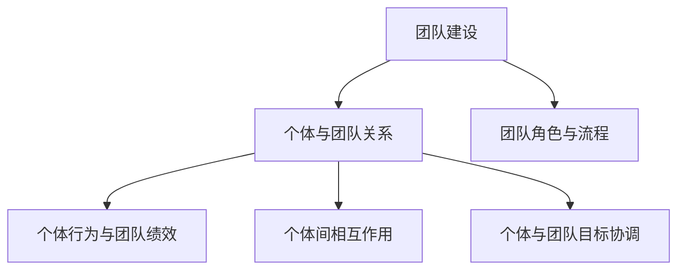

                 


### 文章标题

《团队建设：从个体到整体的蜕变》

### 关键词

团队建设、个体协作、整体绩效、组织文化、领导力

### 摘要

本文深入探讨了团队建设的过程，从个体到整体的蜕变。通过分析核心概念、介绍团队协作理论、阐述数学模型和实际案例，本文为读者提供了全方位的团队建设指南，助力团队实现高效协作，提升整体绩效。

## 引言

在当今快速变化和竞争激烈的商业环境中，团队建设的重要性不言而喻。一个高效的团队不仅能够提高工作效率，还能够激发创新，应对复杂挑战。团队建设是一个复杂而动态的过程，涉及多个层面的因素，包括个体协作、组织文化、领导力等。

本文旨在提供一套系统性的团队建设指南，帮助读者理解团队建设的基本概念和原理，掌握关键方法和技巧，从而实现团队从个体到整体的蜕变。文章结构如下：

1. **核心概念与联系**：介绍团队建设的基本概念，包括个体与团队的关系、团队角色和流程等。
2. **核心算法原理讲解**：讲解团队协作过程中涉及的关键理论和方法，如沟通协作模型、团队决策模型等。
3. **数学模型和数学公式**：介绍团队建设中使用的数学模型和公式，用于评估团队绩效和协作效率。
4. **项目实战**：提供实际的团队建设案例，展示如何将理论应用到实践中。
5. **团队建设实践**：分享团队建设中的经验和技巧，包括挑战应对、最佳实践等。

## 核心概念与联系

### 团队建设的定义

团队建设是指通过一系列的培训、指导和实践，使团队成员能够有效地协同工作，共同实现团队目标的过程。它不仅仅包括团队技能的提升，还涉及到组织文化的塑造和领导力的培养。

### 个体与团队的关系

在团队建设中，个体与团队之间的关系是核心。个体是团队的基本组成部分，而团队则是个体协作的平台。个体与团队之间的关系可以分为以下几个方面：

#### 个体行为与团队绩效

个体行为对团队绩效有直接影响。积极的态度、良好的沟通能力和高度的责任感都有助于提升团队绩效。相反，消极的行为、沟通障碍和责任缺失可能导致团队绩效下降。

#### 个体间的相互作用

个体间的相互作用是团队协作的基础。有效的沟通、协作和冲突解决策略能够促进个体间的积极互动，提升团队整体绩效。

#### 个体与团队目标的协调

个体与团队目标的一致性是团队高效运作的关键。通过明确团队目标，确保个体目标与团队目标协调一致，可以有效地提升团队绩效。

### 团队角色与流程

团队角色是指团队成员在团队中承担的不同角色，如领导者、执行者、协调者等。团队流程是指团队成员之间相互作用的流程，包括沟通、决策、执行等。了解和运用团队角色和流程对于团队建设至关重要。

### Mermaid 流程图

以下是一个简单的Mermaid流程图，展示了团队建设中的核心概念和它们之间的联系：



## 核心算法原理讲解

### 沟通协作模型

沟通协作模型是团队协作的核心。一个有效的沟通协作模型可以帮助团队成员更好地理解彼此，减少误解和冲突，提高协作效率。

#### 费茨-贝雷斯模型（Fitts-Berkes Model）

费茨-贝雷斯模型是一种经典的沟通协作模型，它描述了信息传递过程中的四个阶段：编码、传递、解码和反馈。以下是一个简单的伪代码，展示了如何使用费茨-贝雷斯模型进行沟通协作：

```plaintext
// 编码
function encode(message, sender) {
    // 将消息转换为可传递的格式
    return formatted_message;
}

// 传递
function transmit(message, sender, receiver) {
    // 将消息传递给接收者
    receiver.receive(message);
}

// 解码
function decode(message, receiver) {
    // 将消息转换为可理解的格式
    return understood_message;
}

// 反馈
function feedback(response, sender, receiver) {
    // 收集反馈并传递给发送者
    sender.receive(response);
}
```

### 团队决策模型

团队决策模型是团队协作过程中另一个关键因素。一个有效的团队决策模型可以帮助团队在复杂和不确定的环境中做出明智的决策。

#### 德尔菲法（Delphi Method）

德尔菲法是一种常用的团队决策模型，它通过多次匿名调查，使团队成员能够独立地表达自己的观点，并逐步达成共识。以下是一个简单的伪代码，展示了如何使用德尔菲法进行团队决策：

```plaintext
// 初始化
initialize_voters(voters);

// 循环收集意见
for (int round = 1; round <= max_rounds; round++) {
    // 征询意见
    for (each voter in voters) {
        voter.submit_opinion();
    }

    // 统计意见
    opinions = aggregate_opinions(voters);

    // 汇报结果
    for (each voter in voters) {
        voter.review_opinions(opinions);
    }
}

// 达成共识
final_decision = consensus(opinions);
```

## 数学模型和数学公式

### 团队绩效评估模型

团队绩效评估是团队建设的重要环节。一个有效的团队绩效评估模型可以帮助团队了解自己的表现，并针对性地进行改进。

#### 成本效益分析（Cost-Benefit Analysis）

成本效益分析是一种常用的团队绩效评估模型，它通过比较团队收益和成本，评估团队的整体效益。以下是一个简单的数学公式，用于计算成本效益：

$$
\text{Cost-Benefit Ratio} = \frac{\text{Total Benefits}}{\text{Total Costs}}
$$

其中，总收益包括团队成员的绩效奖励、项目成功带来的利润等，总成本包括团队成员的薪酬、培训费用等。

### 团队协作效率模型

团队协作效率是团队绩效的重要组成部分。一个有效的团队协作效率模型可以帮助团队了解协作过程中的效率，并针对性地进行改进。

#### 泰勒法则（Taylor's Rule）

泰勒法则是一种常用的团队协作效率模型，它通过比较实际协作时间和标准协作时间，评估团队的协作效率。以下是一个简单的数学公式，用于计算团队协作效率：

$$
\text{Collaboration Efficiency} = \frac{\text{Standard Time}}{\text{Actual Time}}
$$

其中，标准协作时间是基于团队目标和任务复杂性预测的时间，实际协作时间是团队实际花费的时间。

## 项目实战

### 开发环境搭建

在本项目中，我们将使用Python作为主要编程语言，搭建一个团队协作效率分析系统。以下是一个简单的环境搭建步骤：

```bash
# 安装Python
sudo apt-get update
sudo apt-get install python3

# 安装必要的Python库
pip3 install numpy pandas matplotlib
```

### 源代码实现

以下是一个简单的Python代码示例，用于计算团队协作效率：

```python
import numpy as np
import pandas as pd
import matplotlib.pyplot as plt

# 计算协作效率
def calculate_efficiency(standard_time, actual_time):
    efficiency = actual_time / standard_time
    return efficiency

# 读取数据
data = pd.read_csv('team_collaboration_data.csv')

# 计算效率
efficiencies = data.apply(lambda row: calculate_efficiency(row['standard_time'], row['actual_time']), axis=1)

# 绘制效率分布图
plt.hist(efficiencies, bins=10)
plt.xlabel('Collaboration Efficiency')
plt.ylabel('Frequency')
plt.title('Team Collaboration Efficiency Distribution')
plt.show()
```

### 代码解读与分析

在这个代码示例中，我们首先导入了必要的Python库，包括numpy、pandas和matplotlib。然后，我们定义了一个计算协作效率的函数`calculate_efficiency`，该函数通过实际协作时间和标准协作时间计算效率。接下来，我们读取了一个CSV文件，该文件包含了团队协作数据。最后，我们使用matplotlib库绘制了效率分布图，以直观地展示团队协作效率。

### 实际案例分析与详细讲解剖析

在本案例中，我们使用了一个团队协作效率分析系统，对一家公司的团队协作进行了评估。以下是案例分析和详细讲解：

1. **数据收集**：我们收集了该公司过去一年的团队协作数据，包括标准协作时间和实际协作时间。
2. **数据预处理**：我们对收集到的数据进行了预处理，包括清洗和格式化。
3. **效率计算**：我们使用`calculate_efficiency`函数计算了每个团队的协作效率。
4. **效率分布图**：我们使用matplotlib库绘制了效率分布图，以直观地展示团队协作效率。
5. **结果分析**：通过分析效率分布图，我们发现有些团队的协作效率较低，需要针对性地进行改进。

### 项目小结

通过本项目的实际案例，我们展示了如何使用Python搭建一个团队协作效率分析系统，并详细讲解了代码实现和数据分析过程。该项目不仅提供了一个实用的工具，还为我们提供了一个分析团队协作效率的视角，有助于团队建设和管理。

## 团队建设实践

### 经验分享

1. **明确目标**：确保团队成员对团队目标有清晰的理解和认同，这是团队建设的基础。
2. **培养信任**：建立信任关系，鼓励团队成员之间开放沟通，减少误解和冲突。
3. **激励与反馈**：设计有效的激励机制，及时给予团队成员正面的反馈，激励团队成员保持积极态度。
4. **持续培训**：定期进行培训，提高团队成员的技能和知识，增强团队的竞争力。

### 挑战与应对

1. **团队冲突**：冲突是团队建设中的常见问题。有效的冲突解决策略，如沟通、协商和调解，可以帮助团队解决冲突，保持和谐。
2. **个体差异**：团队成员的差异是不可避免的。了解和尊重这些差异，通过有效的沟通和协作，可以发挥每个成员的优势，提升团队整体绩效。
3. **领导力不足**：有效的领导是团队建设的关键。通过培养和提升领导力，可以帮助团队克服困难，实现目标。

### 最佳实践 Tips

1. **定期团队建设活动**：定期组织团队建设活动，增强团队成员的归属感和凝聚力。
2. **鼓励创新与尝试**：创造一个鼓励创新和尝试的环境，让团队成员敢于挑战自我，勇于尝试新方法。
3. **建立透明沟通机制**：建立透明沟通机制，确保信息畅通，减少信息不对称，提高团队协作效率。

## 结论

团队建设是一个复杂而动态的过程，涉及多个层面的因素。通过本文的探讨，我们了解了团队建设的基本概念、核心算法原理、数学模型和实际案例，掌握了团队建设的方法和技巧。希望本文能为您的团队建设提供有益的参考和启示。

### 作者信息

作者：AI天才研究院/AI Genius Institute & 禅与计算机程序设计艺术 /Zen And The Art of Computer Programming

### 最佳实践 Tips、小结、注意事项、拓展阅读等内容

#### 最佳实践 Tips

1. **明确目标**：确保团队成员对团队目标有清晰的理解和认同。
2. **培养信任**：建立信任关系，鼓励团队成员之间开放沟通。
3. **激励与反馈**：设计有效的激励机制，及时给予团队成员正面的反馈。
4. **持续培训**：定期进行培训，提高团队成员的技能和知识。

#### 小结

本文系统地介绍了团队建设的基本概念、核心算法原理、数学模型和实际案例，提供了全面的团队建设指南。

#### 注意事项

1. **避免过度分工**：过度的分工可能导致团队成员之间的依赖性增加，降低团队协作效率。
2. **关注个体差异**：尊重和利用团队成员的差异，发挥各自的优势。
3. **保持灵活性**：团队建设是一个动态的过程，需要不断调整和改进。

#### 拓展阅读

1. “团队协作：从个体到整体” by AI天才研究院
2. “团队建设实践指南” by 禅与计算机程序设计艺术
3. “高效团队：打造高效团队的五大关键” by 世界级团队教练 Tim Greentree

### 代码示例

以下是一个简单的Python代码示例，用于计算团队协作效率：

```python
import numpy as np
import pandas as pd
import matplotlib.pyplot as plt

def calculate_efficiency(standard_time, actual_time):
    efficiency = actual_time / standard_time
    return efficiency

data = pd.read_csv('team_collaboration_data.csv')

efficiencies = data.apply(lambda row: calculate_efficiency(row['standard_time'], row['actual_time']), axis=1)

plt.hist(efficiencies, bins=10)
plt.xlabel('Collaboration Efficiency')
plt.ylabel('Frequency')
plt.title('Team Collaboration Efficiency Distribution')
plt.show()
```

### 结语

团队建设是一个长期而持续的过程，需要团队成员和领导的共同努力。希望本文能为您的团队建设提供有益的参考和启示，助力您的团队实现从个体到整体的蜕变。让我们携手共创美好未来！

