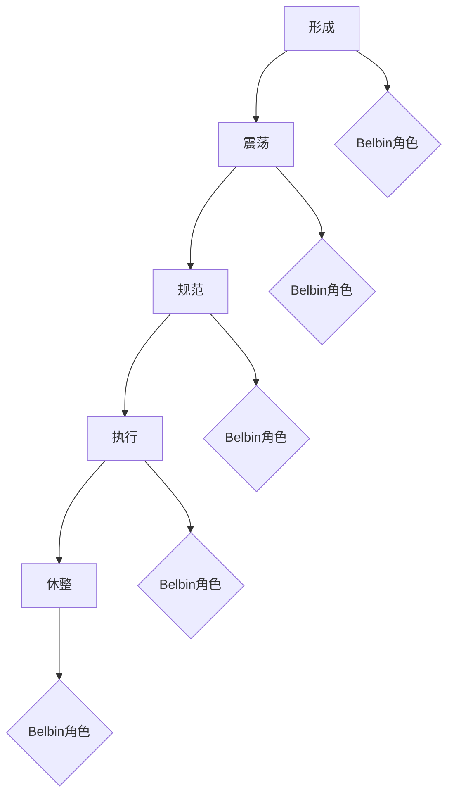

                 

### 1.1 团队建设的核心概念

团队建设是一个复杂而多维的过程，旨在将一群独立的个体整合成一个高度协作、高效运作的整体。首先，我们需要明确团队的定义和特征。

**团队的定义：** 团队是由一组相互依赖、共同追求共同目标的个体组成的集体。这些个体通过分工合作，发挥各自的优势，共同完成团队任务。

**团队的特征：** 
- **共同目标：** 团队成员共同认同并追求的目标，是团队存在的基础。
- **相互依赖：** 成员之间相互依赖，各自的角色和贡献对团队目标的实现至关重要。
- **分工合作：** 根据成员的特长和职责，合理分配任务，提高团队效率。
- **相互沟通：** 团队成员之间需要保持有效沟通，确保信息传递畅通无阻。
- **共同责任：** 团队成员共同承担团队任务的责任，共同面对挑战和困难。

团队建设的重要性在于，它不仅能够提高团队的效率，还能够提升团队成员的满意度和工作成就感。在一个建设良好的团队中，成员能够充分发挥自己的潜力，实现个人价值，同时团队的整体绩效也能够得到显著提升。

团队建设的目的与意义如下：

**目的：**
- **提高团队效率：** 通过合理分工和协作，提高团队完成任务的效率。
- **增强团队凝聚力：** 通过共同目标和相互依赖，增强团队成员之间的凝聚力。
- **提升个人满意度：** 通过实现个人价值和团队成就，提高团队成员的满意度。

**意义：**
- **组织发展：** 团队是组织的基本单元，良好的团队建设有助于组织的发展。
- **创新与进步：** 团队成员之间的合作能够促进创新和进步，提升组织竞争力。
- **员工发展：** 团队建设有助于员工成长和职业发展，提高员工忠诚度和留存率。

在接下来的小节中，我们将进一步探讨团队发展的模型、角色与职责、沟通与协作、领导力和团队文化建设等方面的内容，帮助读者全面了解团队建设的各个方面。

### 1.2 团队发展模型

团队发展是一个逐步演变的过程，不同的理论模型描述了团队从组建到成熟的不同阶段。其中，Tuckman模型和Belbin角色理论是两个被广泛接受和应用的团队发展模型。

**Tuckman模型：** 

Tuckman模型是由心理学家Bruce Tuckman于1965年提出的，描述了团队发展的五个阶段：形成（Forming）、震荡（Storming）、规范（Norming）、执行（Performing）和休整（Adjourning）。

1. **形成（Forming）**：在这个阶段，团队成员开始互相认识，了解团队的期望和目标。成员通常表现得礼貌和克制，团队领导需要明确目标和规则。

2. **震荡（Storming）**：随着团队任务的深入，成员之间的冲突开始显现。这个阶段可能会出现不和谐的情况，团队领导需要处理冲突，确保团队朝着共同目标前进。

3. **规范（Norming）**：在这个阶段，团队成员开始形成相互尊重和信任的关系，规范和团队规则逐渐建立。团队成员之间的沟通变得更加顺畅，合作更加紧密。

4. **执行（Performing）**：团队进入执行阶段，成员专注于完成团队目标，团队工作效率达到高峰。团队领导在这个阶段扮演监督和支持的角色。

5. **休整（Adjourning）**：当团队任务完成后，团队可能解散或进入新的任务。这个阶段通常涉及庆祝和反思，为团队成员的未来角色和责任做准备。

**Belbin角色理论：**

Belbin角色理论是由管理学家Michael Belbin提出的，描述了团队中的九种角色：协调者（Coordinator）、塑造者（Shaper）、完成者（Completer-Finisher）、执行者（Implementer）、资源发现者（Resource Investigator）、团队工作者（Teamworker）、监控评估者（Monitor-Evaluator）、植物（Plant）和观察者（Observer）。

1. **协调者（Coordinator）**：协调者是团队的领导者，擅长组织、规划和决策。

2. **塑造者（Shaper）**：塑造者推动团队前进，勇于挑战和冒险，有时可能会过于强硬。

3. **完成者（Completer-Finisher）**：完成者注重细节和精度，确保团队任务的完成。

4. **执行者（Implementer）**：执行者负责执行团队的决策，确保任务的顺利进行。

5. **资源发现者（Resource Investigator）**：资源发现者擅长发掘新的机会和资源，促进团队发展。

6. **团队工作者（Teamworker）**：团队工作者善于团队合作，营造积极的团队氛围。

7. **监控评估者（Monitor-Evaluator）**：监控评估者擅长分析和评估，提供客观的反馈和建议。

8. **植物（Plant）**：植物擅长创新和发明，具有创造性的思维。

9. **观察者（Observer）**：观察者善于观察和思考，但不一定积极参与团队活动。

**核心概念与联系：** 

Tuckman模型和Belbin角色理论共同描述了团队发展的重要方面。Tuckman模型关注团队发展的阶段性变化，而Belbin角色理论关注团队成员的角色和职责。

- **形成与震荡：** 在团队形成阶段，成员需要了解彼此的角色和职责（Belbin角色理论），以便在震荡阶段更好地协作和解决冲突。
- **规范与执行：** 在规范阶段，团队成员通过沟通和合作建立良好的团队关系，这有助于在执行阶段提高团队效率（Tuckman模型）。
- **休整与角色：** 在休整阶段，团队成员需要对各自的角色和贡献进行反思，为未来的团队工作做好准备（Belbin角色理论）。

**Mermaid流程图：**

通过Tuckman模型和Belbin角色理论的结合，团队领导者可以更好地理解和引导团队的发展，促进团队的协作和高效运作。

### 1.3 团队角色与职责

在团队建设中，明确每个成员的角色和职责是至关重要的。这不仅有助于提高团队效率，还能够确保每个成员都清楚自己的工作目标和贡献。以下是团队中常见的角色及其职责：

**1. 项目经理/协调者：**
- 负责整体项目的规划、执行和监控。
- 协调团队成员之间的工作，确保项目目标的实现。
- 风险管理和资源分配。

**2. 技术专家/开发人员：**
- 负责技术方案的设计和实现。
- 编写代码，解决技术难题。
- 协作完成项目需求。

**3. 产品经理/需求分析师：**
- 负责收集和分析用户需求。
- 制定产品功能规划和需求文档。
- 与团队成员沟通需求，确保需求得到满足。

**4. 测试工程师：**
- 负责编写测试计划，设计测试用例。
- 执行测试，发现和报告缺陷。
- 确保产品质量和用户满意度。

**5. 设计师：**
- 负责产品的界面设计、用户体验。
- 协调与前端开发人员的协作，实现设计效果。
- 提高产品的美观性和用户友好性。

**6. 市场营销专员：**
- 负责产品的市场推广和销售。
- 分析市场趋势，制定营销策略。
- 提高产品的市场占有率和品牌影响力。

**7. 支持人员/客服：**
- 负责客户咨询和问题解答。
- 提供技术支持和服务，解决客户问题。
- 提高客户满意度和忠诚度。

**8. 数据分析师：**
- 负责数据收集、分析和报告。
- 提供数据驱动的决策支持。
- 改进产品和服务。

**角色识别与定位：**
- **项目经理/协调者：** 根据项目规模和复杂度，确定项目经理的角色。项目经理应具备良好的沟通、协调和管理能力。
- **技术专家/开发人员：** 根据团队成员的技术背景和专长，分配合适的开发任务。开发人员应具备解决复杂技术问题的能力。
- **产品经理/需求分析师：** 根据产品需求和市场反馈，确定产品经理的职责。产品经理应具备市场洞察力和用户需求分析能力。
- **其他角色：** 根据团队的具体需求和项目特点，识别和分配其他角色。

**职责分配与协调：**
- **明确职责：** 在团队成立初期，明确每个成员的职责，确保每个人都清楚自己的工作任务。
- **职责协调：** 在项目执行过程中，项目经理需要协调不同角色之间的工作，确保任务顺利推进。
- **职责调整：** 随着项目的发展和变化，及时调整团队成员的职责，确保团队的高效运作。

通过明确团队角色和职责，团队领导者可以更好地管理团队资源，提高团队效率，实现项目目标。

### 1.4 团队沟通与协作

在团队建设中，沟通与协作是两个至关重要的方面。有效的沟通能够确保信息的准确传递，协作则能够实现团队成员之间的紧密合作。然而，在实际工作中，团队沟通和协作往往面临各种障碍。

**团队沟通的障碍：**

1. **信息不对称：** 由于团队成员对项目目标、需求和任务的理解不同，可能导致信息传递的误差和误解。
2. **沟通渠道不畅：** 团队成员之间的沟通渠道不畅通，信息传递速度缓慢，影响团队决策和行动的及时性。
3. **沟通方式单一：** 团队沟通往往依赖于口头或书面形式，缺乏多元化的沟通方式，影响沟通效果。
4. **语言和文化差异：** 在跨国团队中，语言和文化差异可能导致沟通障碍，影响团队合作。

**解决沟通障碍的方法：**

1. **明确沟通目标：** 在每次沟通前，明确沟通的目标和内容，确保团队成员了解沟通的重点。
2. **建立有效的沟通渠道：** 利用各种沟通工具和平台，如邮件、即时通讯、会议等，确保信息传递的及时性和准确性。
3. **促进多元化沟通：** 鼓励团队成员使用不同的沟通方式，如面对面会议、电话会议、视频会议等，提高沟通效果。
4. **加强跨文化沟通培训：** 对于跨国团队，加强团队成员的跨文化沟通培训，提高文化敏感度和沟通能力。

**团队协作的有效策略：**

1. **共同目标：** 确保团队成员共同认同并追求团队目标，明确每个成员在团队中的角色和职责。
2. **分工合作：** 根据团队成员的特长和技能，合理分配任务，提高团队协作的效率。
3. **定期会议：** 定期召开团队会议，讨论项目进展、问题和解决方案，确保团队成员之间的信息同步。
4. **透明沟通：** 保持项目信息的透明度，让团队成员了解项目的整体进展和关键决策。
5. **鼓励反馈：** 鼓励团队成员提出意见和建议，通过反馈机制改进团队协作和工作流程。

通过有效的沟通和协作策略，团队可以克服沟通障碍，实现高效运作，提高项目成功率。

### 1.5 团队领导力

在团队建设中，领导力扮演着至关重要的角色。一个优秀的领导者不仅能够明确团队目标和方向，还能够激励和引导团队成员，推动团队高效运作。

**领导力的定义与类型：**

领导力是指领导者通过影响和激励团队成员，实现团队目标的能力。根据领导者的行为和风格，领导力可以分为以下几种类型：

1. **权威型领导：** 权威型领导者通过发布命令和指示，确保团队遵循严格的规定和标准。这种领导风格适用于紧急情况或需要迅速决策的团队。
2. **民主型领导：** 民主型领导者鼓励团队成员参与决策过程，通过讨论和协商达成共识。这种领导风格有助于提高团队成员的参与感和责任感。
3. **支持型领导：** 支持型领导者关注团队成员的需求和情感，提供支持和鼓励，帮助他们克服困难。这种领导风格有助于建立积极的工作氛围和团队凝聚力。
4. **变革型领导：** 变革型领导者通过激励和启发团队成员，推动团队实现变革和创新。这种领导风格适用于需要重大变革或创新的团队。

**领导者在团队建设中的角色与责任：**

1. **明确目标与方向：** 领导者需要明确团队的目标和方向，确保团队成员了解团队的目标和期望。
2. **制定计划与策略：** 领导者需要制定详细的计划，确保团队目标的实现，并制定应对突发情况的策略。
3. **激励与引导：** 领导者需要激励和引导团队成员，激发他们的积极性和创造力，确保团队目标的实现。
4. **协调与沟通：** 领导者需要协调团队成员之间的关系，确保团队内部的沟通畅通无阻。
5. **监督与反馈：** 领导者需要监督团队的工作进度，提供及时反馈，确保团队目标的实现。

通过有效的领导力，领导者可以推动团队高效运作，实现团队目标，提升团队的整体绩效。

### 1.6 团队文化建设

团队文化是指团队在长期发展过程中形成的共同价值观、行为准则和工作习惯。一个良好的团队文化可以增强团队的凝聚力，提高团队的整体绩效。

**团队文化的概念与作用：**

团队文化是指团队在长期发展过程中形成的共同价值观、行为准则和工作习惯。它包括团队的目标、信念、愿景、使命等核心要素，对团队成员的行为和决策产生深远影响。

1. **凝聚团队：** 团队文化可以增强团队成员之间的凝聚力，形成共同的价值观和目标，促进团队成员的相互信任和合作。
2. **提升绩效：** 良好的团队文化可以提高团队成员的工作积极性，激发创新思维，提高团队的整体绩效。
3. **增强归属感：** 团队文化可以增强团队成员对团队的归属感，降低员工流失率，提高员工忠诚度。

**团队文化的建设与维护策略：**

1. **明确团队文化：** 团队领导需要明确团队的文化价值观和目标，确保团队成员共同认同和追求。
2. **培养团队氛围：** 通过团队活动、培训和奖励机制，营造积极向上的团队氛围，促进团队文化的形成和传播。
3. **强化行为准则：** 制定明确的团队行为准则，规范团队成员的行为，确保团队文化的落地和执行。
4. **鼓励创新与反馈：** 鼓励团队成员提出创新意见和建议，通过反馈机制改进团队文化，使其不断适应和优化。
5. **持续建设与维护：** 团队文化需要不断建设和维护，通过持续的努力，确保团队文化的持续发展和优化。

通过有效的团队文化建设，团队可以形成良好的工作氛围，提高团队的整体绩效，实现团队的长期发展。

### 2.1 团队协作工具与技术

在团队协作中，使用合适的工具和技术可以显著提高团队的工作效率。以下是几种常用的团队协作工具和技术。

**1. 团队协作软件：**

- **Trello：** Trello是一个基于看板（Kanban）方法的团队协作工具，可以用于任务管理、项目规划和进度跟踪。
- **Asana：** Asana是一款功能强大的项目管理工具，支持任务分配、进度跟踪和团队协作。
- **Slack：** Slack是一个即时通讯工具，可以用于团队内部的信息交流和文件共享。
- **Microsoft Teams：** Microsoft Teams是微软推出的团队协作平台，支持视频会议、文档协作和团队沟通。

**2. 团队协作技巧与最佳实践：**

- **明确任务和责任：** 在团队协作中，明确每个成员的任务和责任是非常重要的。项目经理或团队领导应确保每个任务都有明确的执行者，并制定清晰的截止日期和交付标准。
- **定期沟通和会议：** 定期召开团队会议，讨论项目进展、问题和解决方案，确保团队成员之间的信息同步。通过视频会议、电话会议或在线讨论，可以有效地沟通和协作。
- **文档共享和版本控制：** 使用文档共享工具（如Google文档、Microsoft Office 365）和版本控制系统（如Git），确保团队成员能够访问最新版本的文档和代码，避免因版本冲突导致的错误。
- **任务分配和进度跟踪：** 使用任务管理工具（如Trello、Asana），将项目分解为多个任务，并分配给合适的团队成员。通过跟踪任务的进度，可以及时发现和解决潜在的问题。
- **反馈与改进：** 鼓励团队成员提供反馈，并根据反馈进行改进。通过定期评估和改进团队协作流程，可以提高团队的整体效率。

通过使用合适的团队协作工具和技术，以及遵循最佳实践，团队可以更好地协调工作，提高工作效率，实现项目目标。

### 2.2 团队决策与问题解决

在团队协作中，决策和问题解决是两个关键的环节。有效的决策和问题解决能力能够确保团队在面临挑战和变化时能够迅速响应，确保项目目标的实现。

**团队决策模型：**

1. **头脑风暴：** 头脑风暴是一种集思广益的决策方法，团队成员在规定时间内提出各种想法和建议，不进行评价和筛选，以激发创新思维。
2. **SWOT分析：** SWOT分析是一种战略规划工具，通过分析团队的优势（Strengths）、劣势（Weaknesses）、机会（Opportunities）和威胁（Threats），帮助团队制定更全面的决策。
3. **多因素决策分析：** 多因素决策分析是一种综合考虑多个因素进行决策的方法，通过量化各因素的权重和影响，帮助团队做出更科学的决策。

**团队问题解决策略：**

1. **明确问题：** 在解决任何问题之前，首先要明确问题的性质和原因。通过分析问题的表现和背后的原因，可以更准确地定位问题的根源。
2. **信息收集：** 收集与问题相关的信息，包括数据、事实和团队成员的观点。通过全面的信息收集，可以帮助团队更好地理解问题，找到解决方案。
3. **分析原因：** 分析问题的原因，找出导致问题的根本原因。通过根本原因分析，可以帮助团队从根本上解决问题，避免类似问题再次发生。
4. **制定方案：** 根据问题原因，制定解决问题的方案。方案应包括具体的行动步骤、责任人和截止日期，以确保问题得到及时解决。
5. **实施与监控：** 实施解决方案，并监控实施过程中的进展和效果。通过监控，可以及时发现和解决实施过程中出现的新问题，确保问题得到有效解决。

通过有效的决策和问题解决策略，团队可以更好地应对挑战和变化，确保项目目标的实现。

### 2.3 团队冲突管理

在团队协作过程中，冲突是不可避免的。冲突的存在可能源于观点不同、资源竞争、任务分配不公等原因。有效的冲突管理是确保团队高效运作和团队稳定的关键。

**冲突的类型与原因：**

1. **观点冲突：** 由于团队成员对问题的看法、解决方案或工作方法存在差异，导致意见不一致。
2. **资源冲突：** 团队成员在争夺有限的资源（如时间、资金、人力等）时产生的冲突。
3. **任务分配冲突：** 由于任务分配不公或责任不明，导致团队成员之间的不满和冲突。
4. **价值观冲突：** 由于团队成员的价值观、文化背景或个人偏好不同，导致在团队决策和工作方式上的冲突。

**冲突管理的策略与方法：**

1. **预防冲突：**
   - **明确团队目标和责任：** 通过明确团队目标和成员职责，减少因任务分配不公引起的冲突。
   - **建立沟通机制：** 加强团队成员之间的沟通，确保信息透明，减少误解和冲突。
   - **培训与沟通技能：** 提升团队成员的沟通技能和冲突管理能力，有助于预防冲突的发生。

2. **冲突识别与评估：**
   - **定期团队评估：** 通过定期的团队评估，了解团队成员之间的工作关系和潜在冲突。
   - **建立反馈机制：** 鼓励团队成员提出意见和建议，及时发现和解决冲突。

3. **冲突解决：**
   - **对话与沟通：** 通过对话和沟通，让双方表达自己的观点和感受，理解对方的立场。
   - **寻求共识：** 在冲突解决过程中，寻求双方的共识，通过妥协和合作找到解决问题的方案。
   - **制定行动计划：** 根据冲突解决的结果，制定具体的行动计划，确保问题得到有效解决。

通过有效的冲突管理策略，团队可以降低冲突对工作效率和团队氛围的负面影响，保持团队的稳定和高效运作。

### 2.4 团队绩效评估

团队绩效评估是团队管理的重要组成部分，它有助于了解团队的整体表现，发现存在的问题，并为未来的工作提供改进的方向。有效的团队绩效评估不仅能够激励团队成员，提高工作积极性，还能够帮助团队领导制定更加科学的绩效改进策略。

**团队绩效指标与评估方法：**

1. **目标达成度：** 评估团队是否达到了既定的目标和任务。可以通过完成任务的百分比、项目的交付时间等指标进行衡量。

2. **工作效率：** 评估团队在完成任务过程中的效率，包括工作时长、资源利用率等。

3. **团队协作：** 评估团队成员之间的协作情况，包括沟通效率、任务分配和协作效果等。

4. **创新能力：** 评估团队在项目中的创新表现，包括新思路、新方法和新成果。

5. **工作满意度：** 评估团队成员的工作满意度和团队氛围，包括团队成员之间的信任感、团队凝聚力等。

**团队绩效改进措施：**

1. **明确绩效目标：** 团队领导需要明确团队的绩效目标，并与团队成员共同制定具体的行动计划，确保目标的可实现性和可衡量性。

2. **定期评估与反馈：** 团队领导应定期对团队成员的绩效进行评估，并提供及时的反馈。通过定期的评估，可以及时发现团队工作中的问题，并为改进提供依据。

3. **培训与技能提升：** 根据团队成员的绩效评估结果，制定针对性的培训计划，提高团队成员的专业技能和综合素质。

4. **优化工作流程：** 分析团队的工作流程，找出存在瓶颈和浪费资源的环节，通过流程优化提高团队的整体效率。

5. **激励与奖励：** 建立绩效激励机制，对表现优秀的团队成员进行奖励，激发团队整体的工作积极性。

通过有效的团队绩效评估和改进措施，团队可以持续提升整体绩效，实现长期发展目标。

### 2.5 团队创新与知识管理

在当今快速变化和竞争激烈的商业环境中，团队创新和知识管理成为团队成功的关键因素。团队创新能够推动团队持续进步和业务增长，而知识管理则有助于将团队的知识和经验转化为实际价值。

**团队创新的激励与机制：**

1. **奖励与创新：** 建立创新奖励机制，对提出创新想法或实现创新成果的团队成员给予奖励，激励更多成员参与创新活动。
2. **时间和资源：** 为团队成员提供时间和资源，让他们专注于创新项目，确保创新活动的顺利进行。
3. **团队支持：** 鼓励团队成员之间的协作和支持，通过团队的力量共同推动创新项目。
4. **开放沟通：** 建立开放的沟通环境，鼓励团队成员分享创新想法和经验，促进知识共享和团队协作。

**知识管理在团队协作中的作用：**

1. **知识共享：** 通过知识管理工具和平台，团队成员可以方便地共享和获取知识和经验，提高工作效率和团队协作。
2. **经验传承：** 通过知识管理，将团队成员的经验和知识记录下来，为新成员提供学习和借鉴的资料，帮助他们更快地融入团队。
3. **知识创新：** 知识管理有助于团队成员发现新的知识和解决方案，促进团队创新和业务发展。

**团队创新与知识管理的关系：**

团队创新和知识管理是相互促进的关系。创新活动需要基于现有知识和经验，而知识管理则有助于积累和传承团队的知识和经验，为创新提供坚实的基础。有效的知识管理可以确保团队的知识得到充分利用，促进团队创新和发展。

通过建立激励和创新机制，以及实施有效的知识管理，团队可以持续推动创新，提升团队的整体绩效，实现长期发展目标。

### 3.1 团队建设项目规划

团队建设项目规划是确保团队目标实现和项目成功的关键步骤。一个良好的项目规划可以帮助团队明确方向、分配资源，并有效应对项目风险。

**项目目标的制定与分解：**

项目目标应明确、具体、可实现、相关和时间限定。具体步骤如下：

1. **确定项目目标：** 根据团队的战略目标和业务需求，确定项目的具体目标。这些目标应具有挑战性，同时是可实现的。
2. **分解项目目标：** 将项目目标分解为更小的、具体的任务和里程碑，确保每个任务都明确、具体，并具备可衡量性。
3. **任务优先级：** 根据任务的重要性和紧迫性，为每个任务分配优先级，确保团队首先完成最关键的任务。

**项目计划的制定与执行：**

项目计划是项目执行的指导性文件，具体内容包括：

1. **任务分配：** 根据团队成员的技能和专长，合理分配任务，确保每个任务都有明确的责任人。
2. **时间安排：** 制定任务的时间安排，明确每个任务的开始和结束时间，确保项目按计划进行。
3. **资源需求：** 明确项目所需的资源，包括人力、资金、设备等，并确保资源的有效分配和使用。
4. **风险评估与应对策略：** 评估项目可能面临的风险，并制定相应的应对策略，以减少风险对项目的影响。

在项目执行过程中，团队需要遵循以下原则：

1. **定期检查：** 定期检查项目进展，确保项目按计划进行，并及时调整计划和资源分配。
2. **沟通与协作：** 保持团队成员之间的有效沟通和协作，确保项目信息的透明和畅通。
3. **及时反馈：** 对项目进展和问题进行及时反馈，确保问题得到及时解决，避免问题积累影响项目进度。
4. **持续改进：** 在项目执行过程中，不断总结经验，持续改进项目管理和执行流程，提高项目成功率。

通过科学的项目规划和管理，团队可以更好地实现项目目标，确保项目成功。

### 3.2 团队项目执行与监控

在项目执行阶段，团队的协调与合作至关重要。通过有效的进度和质量监控，团队可以确保项目按计划顺利进行，及时发现和解决问题，确保项目目标的实现。

**项目进度监控：**

1. **定期会议：** 定期召开项目进度会议，团队成员报告各自的任务进展，讨论遇到的困难和解决方案。
2. **进度报告：** 每个任务负责人定期提交进度报告，包括任务完成情况、工作量、时间消耗等，以便项目经理进行综合评估。
3. **关键里程碑：** 设定关键里程碑，对项目进展进行阶段性评估，确保项目按计划推进。
4. **预警机制：** 建立项目进度预警机制，对可能延误的任务提前预警，制定应对措施，确保项目按时完成。

**项目质量监控：**

1. **质量标准：** 制定明确的质量标准，确保项目交付物符合预期质量和客户需求。
2. **测试与审查：** 定期进行项目测试和审查，发现和修复质量问题，确保项目交付物的质量和可靠性。
3. **用户反馈：** 收集用户反馈，了解项目交付物的实际使用情况，根据用户反馈进行优化和改进。
4. **质量报告：** 定期提交质量报告，包括质量评估结果、发现的问题和改进措施，以便项目管理层做出决策。

**项目风险管理策略：**

1. **风险评估：** 在项目开始前，进行风险评估，识别可能影响项目成功的风险因素，包括技术风险、市场风险、人力资源风险等。
2. **风险应对策略：** 根据风险评估结果，制定相应的风险应对策略，包括风险规避、风险转移、风险接受等。
3. **风险监控：** 在项目执行过程中，持续监控风险的发展，及时调整应对策略，确保风险在可控范围内。
4. **应急计划：** 制定应急计划，应对可能出现的突发风险，确保项目能够快速恢复正常。

通过有效的项目进度、质量和风险管理，团队可以确保项目按计划、高质量地完成，实现项目目标。

### 3.3 团队项目总结与反思

项目总结与反思是团队项目周期中不可或缺的一环，它有助于团队从项目经验中学习，不断提高项目管理能力和团队协作水平。

**项目成果的评价与总结：**

项目成果的评价可以从以下几个方面进行：

1. **目标达成度：** 根据项目目标的设定，评估项目是否实现了预期目标，如项目交付物的质量、客户满意度等。
2. **进度与效率：** 分析项目进度是否按计划进行，评估团队的工作效率，包括任务完成的时间、资源利用率等。
3. **团队协作：** 评估团队成员之间的协作情况，包括沟通效率、任务分配的合理性、团队合作的效果等。
4. **创新与改进：** 评估项目过程中的创新点，如新技术的应用、工作流程的优化等，以及团队成员的改进措施。

项目总结报告应包括以下内容：

- **项目概述：** 简要介绍项目的背景、目标、范围和主要成果。
- **项目执行过程：** 详细描述项目从启动到完成的各个阶段，包括项目计划、任务分配、进度监控、问题解决等。
- **项目成果与评估：** 列出项目的主要成果，评估项目目标的实现情况，分析项目过程中遇到的问题和挑战，以及解决方案和改进措施。
- **团队协作与经验：** 总结团队成员在项目过程中的协作情况，分享成功的经验和教训，为未来项目提供参考。

**项目经验的积累与传承：**

项目经验的积累与传承是团队持续成长和改进的重要途径。以下是几个关键步骤：

1. **建立知识库：** 将项目的文档、代码、测试用例、会议记录等资料整理成知识库，供团队成员学习和参考。
2. **经验分享：** 定期组织经验分享会，团队成员分享项目中的成功经验和教训，促进知识传播和团队学习。
3. **培训与培养：** 根据项目经验，制定培训计划，提升团队成员的专业技能和项目管理能力。
4. **持续改进：** 分析项目中的不足和改进点，制定改进措施，并在后续项目中实施，不断提高项目管理水平。

通过项目总结与反思，团队可以不断提高自身的项目管理能力和协作水平，实现持续发展和改进。

### 附录 A：团队建设资源与工具

**团队建设相关的书籍与资料：**

1. **《团队管理实践》（The Practice of Management）** - by Peter F. Drucker
2. **《团队协作的艺术》（The Five Dysfunctions of a Team）** - by Patrick Lencioni
3. **《团队领导力》（Team Leadership：Creating a Winning Team Culture）** - by Jim Highsmith
4. **《团队协作技巧》（Team Collaboration: The Art of Working Together）** - by Richard Hackman

**团队协作软件与应用案例：**

1. **Trello：** 基于看板方法的团队协作工具，适用于任务管理和项目规划。
   - **案例：** 被许多初创公司和中小型企业用于项目管理，提高了任务分配和进度跟踪的效率。

2. **Asana：** 全面的项目管理工具，支持任务分配、进度跟踪和团队协作。
   - **案例：** 被许多跨国公司用于跨国团队协作，提高了项目的透明度和沟通效率。

3. **Slack：** 即时通讯工具，支持文件共享、聊天和视频会议。
   - **案例：** 被许多公司用于内部沟通，提高了信息传递的速度和团队协作的效率。

4. **Microsoft Teams：** 团队协作平台，支持视频会议、文档协作和团队沟通。
   - **案例：** 被许多企业用于远程办公和在线协作，确保了团队在远程环境下的高效沟通和协作。

通过这些书籍和工具的应用，团队可以更好地进行团队建设，提高协作效率，实现项目目标。

### 附录 B：团队建设案例研究

**成功团队建设案例分析：**

**案例 1：Google 的“20% 时间政策”**

Google 的“20% 时间政策”是一个著名的团队建设案例。该政策允许工程师将 20% 的工作时间用于自己感兴趣的项目。这一举措不仅激发了员工的创造力，还推动了诸如 AdSense 和 Gmail 等关键产品的诞生。

**成功因素：**
- **创新激励：** 员工有更多的自由去尝试新的想法，不受传统工作任务的限制。
- **跨部门协作：** 员工可以跨部门合作，促进知识和经验的交流。
- **领导支持：** 领导层对创新项目给予支持和资源，确保这些项目能够顺利推进。

**困难团队建设问题与解决方案：**

**案例 2：NASA 的“挑战者号”灾难**

1986 年，NASA 的“挑战者号”航天飞机发射失败，造成七名宇航员丧生。这次灾难揭示了团队协作和沟通的不足。

**问题：**
- **信息不对称：** 针对火箭发射前出现的隐患，团队成员之间的信息传递不畅。
- **决策延误：** 团队内部在做出决策时存在延迟，未能及时采取措施。

**解决方案：**
- **加强沟通：** 建立更高效的沟通机制，确保关键信息能够迅速传递。
- **明确责任：** 为每个团队成员明确职责，确保在紧急情况下能够快速响应。
- **改进决策流程：** 优化决策流程，确保在关键时刻能够迅速做出决策。

通过这些案例，我们可以看到成功团队建设的关键因素和解决困难问题的方法。有效的团队建设能够提高团队的协作效率和创新能力，确保项目的成功实施。

### 附录 C：团队建设参考书籍

**推荐阅读书目：**

1. **《团队协作的艺术》（The Five Dysfunctions of a Team）** - by Patrick Lencioni
2. **《团队管理实践》（The Practice of Management）** - by Peter F. Drucker
3. **《团队领导力》（Team Leadership：Creating a Winning Team Culture）** - by Jim Highsmith
4. **《团队协作技巧》（Team Collaboration: The Art of Working Together）** - by Richard Hackman

**网络资源链接：**

1. **Team Building Resources** - [https://www.mindtools.com/pages/main/newMN_TMC.htm](https://www.mindtools.com/pages/main/newMN_TMC.htm)
2. **Agile Team Building Resources** - [https://www.agilealliance.org/resources/teams/](https://www.agilealliance.org/resources/teams/)
3. **Team Building Games and Activities** - [https://www.teambuildinggamesplus.com/](https://www.teambuildinggamesplus.com/)

通过这些书籍和资源，读者可以深入了解团队建设的相关理论和实践，提高团队建设的能力。

### 总结

团队建设是组织发展和项目成功的关键因素。本文从团队建设的核心概念、发展模型、角色与职责、沟通与协作、领导力、文化建设、协作工具与技术、决策与问题解决、冲突管理、绩效评估、创新与知识管理、项目规划、执行与监控、项目总结与反思等方面进行了全面探讨。

**团队建设的重要性：** 团队建设能够提高团队效率、增强团队凝聚力、提升个人满意度，促进组织发展和创新。

**团队建设的核心要素与技巧：** 明确团队目标、合理分工、有效沟通、领导力培养、文化建设、冲突管理和绩效评估等是团队建设的核心要素和关键技巧。

**团队建设的未来趋势：** 随着远程工作和全球化的发展，团队协作工具的多样化、跨文化团队建设的需求增加，以及人工智能在团队管理中的应用将成为团队建设的未来趋势。

通过本文的讨论，希望读者能够对团队建设有更深刻的理解和实践，为团队的成功运作和持续发展提供有益的指导。

### 作者信息

**作者：** AI天才研究院/AI Genius Institute & 禅与计算机程序设计艺术 /Zen And The Art of Computer Programming

感谢您阅读本文，希望本文对您的团队建设实践有所帮助。如果您有任何问题或建议，欢迎在评论区留言，期待与您交流。

