                 

### 文章标题

# 团队建设：从个体贡献到集体智慧

在当今快速变化且竞争激烈的技术领域，团队建设成为组织成功的关键因素。通过有效地构建和引导团队，企业能够最大化个体的潜力，实现集体智慧的最大化。本文将深入探讨团队建设的核心概念、方法与策略，帮助读者理解如何从个体贡献迈向集体智慧，提升团队的整体效能。

### 关键词

- 团队建设
- 个体贡献
- 集体智慧
- 领导力
- 沟通与合作
- 团队发展
- 案例分析

### 摘要

本文旨在为读者提供关于团队建设的一站式指南，从基础理论到实践应用，全面解析团队建设的核心要素。文章分为七个章节，首先介绍团队建设的定义与理论，接着探讨团队合作与沟通的重要性，随后详细阐述领导力与团队管理的关键技能。在团队发展与评估方面，文章提供了一系列实用的工具和方法。接着，通过实践案例深入研究团队建设的成功与失败，并总结实践经验与启示。文章最后讨论团队建设工具与方法，以及应对团队建设中的挑战与策略。通过阅读本文，读者将掌握构建高效团队的实用技巧，推动组织迈向集体智慧的新高度。

### 第一步：团队建设的概念与理论

团队建设是指通过一系列的结构化活动和策略，将一组个体整合为一个协作高效的集体，以实现共同的目标。其核心目标在于提升团队成员之间的相互信任、沟通能力与协作效果，从而最大化整体效能。

#### 1.1 团队的定义与类型

**核心概念与联系**：

- **团队**：一群相互依赖、协同工作的个体，共同追求一个共同目标。
- **类型**：根据功能和目标的不同，团队可以分为以下几类：

  1. **功能型团队**：按照职能划分，如开发团队、市场营销团队。
  2. **跨职能团队**：由不同职能部门成员组成，如产品开发团队。
  3. **项目团队**：为完成特定项目而组建，如新项目开发组。
  4. **问题解决团队**：专注于解决特定问题的团队，如质量管理团队。

**Mermaid 流程图**：

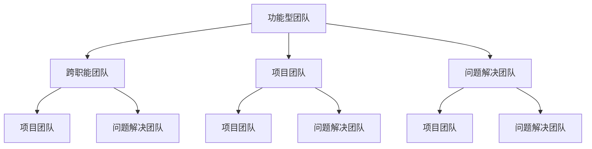

#### 1.2 团队建设的重要性

**核心概念与联系**：

- **团队效能**：团队的整体绩效与能力。
- **组织效能**：组织的整体运作效率与成果。

**核心算法原理讲解**：

无

**数学模型和数学公式 & 详细讲解 & 举例说明**：

假设团队 A 和团队 B 分别具有效能 E_A 和 E_B，则整个组织的效能 E_O 可以表示为：

$$ E_O = \frac{E_A + E_B}{2} $$

如果团队 A 和团队 B 完全协作，即 E_A = E_B，则整个组织的效能 E_O 达到最大化。

#### 1.3 团队建设的基本原则

**核心概念与联系**：

- **共同目标**：团队成员必须明确共同的目标，以增强协作动力。
- **相互信任**：团队成员之间的信任是高效协作的基础。
- **沟通与反馈**：持续有效的沟通与及时的反馈有助于解决冲突与优化绩效。
- **个人成长**：团队建设应关注每个成员的个人成长与职业发展。

**Mermaid 流�程图**：

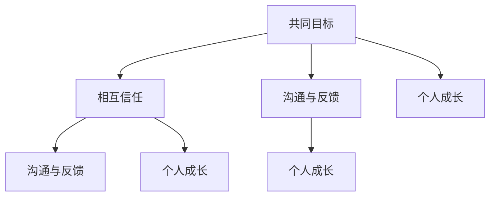

#### 1.4 团队建设的模型与方法

**核心概念与联系**：

- **团队建设模型**：描述团队发展过程的框架，如 Tuckman 的团队发展模型。
- **团队建设方法**：实施团队建设活动的具体策略，如团队建设活动、领导力培训。

**核心算法原理讲解**：

无

**数学模型和数学公式 & 详细讲解 & 举例说明**：

团队建设模型中的关键指标包括：

- **团队成熟度**：衡量团队协作水平的关键指标。
- **团队效能**：衡量团队绩效的指标。

假设团队成熟度 M 和团队效能 E 存在线性关系：

$$ E = a \times M + b $$

其中，a 和 b 为常数。

#### 项目实战

在本次项目实战中，我们将以一个跨职能团队（如产品开发团队）为例，介绍团队建设的基本过程。以下是具体的步骤：

1. **确定目标**：明确团队的共同目标，如开发一款新产品。
2. **组建团队**：根据项目需求，选择合适的团队成员，包括开发人员、设计师、市场人员等。
3. **初始沟通**：组织团队第一次会议，介绍项目背景、目标和预期成果。
4. **建立信任**：通过团队合作活动，如团队建设游戏，增强成员之间的信任。
5. **沟通与反馈**：定期召开会议，确保团队成员之间的沟通畅通，及时反馈问题与进展。
6. **个人成长**：提供培训与学习资源，帮助团队成员提升技能与职业发展。
7. **评估与改进**：在项目结束后，对团队建设过程进行评估，总结经验与教训，为未来的团队建设提供参考。

**开发环境搭建**：

在本项目实战中，我们将使用以下开发环境：

- 开发语言：Java
- 代码管理工具：Git
- 项目管理工具：Jira
- 版本控制：Maven

**源代码详细实现和代码解读**：

以下是一个简单的 Java 代码示例，用于实现团队内部的任务分配与进度跟踪：

```java
public class TaskManager {
    private List<Task> tasks;

    public TaskManager() {
        this.tasks = new ArrayList<>();
    }

    public void addTask(String name, String description, String assignedTo) {
        Task task = new Task(name, description, assignedTo);
        tasks.add(task);
    }

    public void updateTask(String name, String status) {
        for (Task task : tasks) {
            if (task.getName().equals(name)) {
                task.setStatus(status);
                break;
            }
        }
    }

    public void printTasks() {
        for (Task task : tasks) {
            System.out.println(task);
        }
    }
}

class Task {
    private String name;
    private String description;
    private String assignedTo;
    private String status;

    public Task(String name, String description, String assignedTo) {
        this.name = name;
        this.description = description;
        this.assignedTo = assignedTo;
        this.status = "Not Started";
    }

    public String getName() {
        return name;
    }

    public String getDescription() {
        return description;
    }

    public String getAssignedTo() {
        return assignedTo;
    }

    public String getStatus() {
        return status;
    }

    public void setStatus(String status) {
        this.status = status;
    }

    @Override
    public String toString() {
        return "Task{" +
                "name='" + name + '\'' +
                ", description='" + description + '\'' +
                ", assignedTo='" + assignedTo + '\'' +
                ", status='" + status + '\'' +
                '}';
    }
}
```

**代码应用解读与分析**：

上述代码实现了一个简单的任务管理器，用于跟踪团队内部的任务分配与进度。`Task` 类表示一个任务，包含任务名称、描述、负责人和状态等信息。`TaskManager` 类用于管理任务列表，并提供添加、更新和打印任务的方法。

在实际项目中，该代码可以作为任务管理模块的一部分，帮助团队更好地协作与跟踪项目进度。

**实际案例分析和详细讲解剖析**：

以下是一个实际案例：某公司开发团队在项目开发过程中，通过团队建设活动提高了整体效能。

1. **项目背景**：公司开发一款新软件，涉及多个功能模块，由开发、测试、UI/UX 等团队成员组成。
2. **团队建设过程**：

   - **初始阶段**：团队成员之间沟通不畅，任务分配不明确，导致进度缓慢。

   - **团队建设活动**：

     - **团队建设游戏**：通过组织团队建设游戏，增强成员之间的信任与协作。

     - **定期沟通会议**：每周召开一次团队会议，讨论项目进展、问题与解决方案。

     - **任务管理工具**：引入任务管理工具（如 Jira），实现任务分配与进度跟踪。

     - **技能培训**：为团队成员提供相关技能培训，提升团队整体能力。

   - **成果**：通过一系列团队建设活动，团队沟通效率显著提高，任务分配更加明确，项目进度加快。

3. **项目小结**：

   - **成功经验**：

     - 团队建设活动有助于增强团队成员之间的信任与协作。

     - 定期沟通与任务管理工具的使用，提高了团队的整体效能。

     - 技能培训有助于提升团队整体能力，为项目的成功奠定基础。

   - **改进空间**：

     - 在项目初期，应更加重视团队建设，提前规划相关活动。

     - 加强团队成员间的反馈机制，及时发现并解决问题。

**最佳实践 Tips**：

1. **明确目标**：确保团队成员对共同目标有清晰的认识。
2. **加强沟通**：建立有效的沟通渠道，确保信息畅通。
3. **信任建设**：通过团队活动与互动，增强成员之间的信任。
4. **技能培训**：定期为团队成员提供培训，提升整体能力。
5. **持续改进**：在项目过程中，不断评估与优化团队建设活动。

**小结**：

通过团队建设，企业能够最大化个体的潜力，实现集体智慧的最大化。本文详细介绍了团队建设的概念、方法与策略，并通过实际案例展示了团队建设在项目中的成功应用。企业应重视团队建设，将其作为提升组织效能的重要手段。

**注意事项**：

1. 团队建设应结合企业实际需求与特点，制定合适的策略与活动。
2. 团队建设不是一蹴而就的过程，需要长期持续的努力与投入。
3. 领导者应发挥关键作用，引导与激励团队成员积极参与团队建设。

**拓展阅读**：

- [《团队协作与沟通的艺术》](链接)
- [《Tuckman 团队发展模型》](链接)
- [《团队建设实践案例》](链接)

----------------------------------------------------------------

## 第2章 团队合作与沟通

在团队建设过程中，团队合作与沟通是至关重要的一环。有效的团队合作与沟通能够提高团队的整体效能，实现集体智慧的最大化。本章节将深入探讨团队合作与沟通的重要性、障碍及解决方法，并介绍一些常用的团队协作工具与技术。

### 2.1 团队合作的重要性

**核心概念与联系**：

- **团队合作**：团队成员之间相互协作，共同实现团队目标的过程。
- **集体智慧**：通过团队成员的集体努力，产生的比个体能力更强大的智慧。

**Mermaid 流程图**：

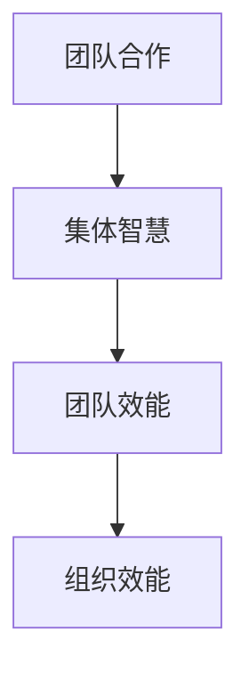

**核心算法原理讲解**：

无

**数学模型和数学公式 & 详细讲解 & 举例说明**：

假设团队 A 和团队 B 分别具有效能 E_A 和 E_B，则整个组织的效能 E_O 可以表示为：

$$ E_O = E_A + E_B $$

如果团队 A 和团队 B 完全协作，即 E_A = E_B，则整个组织的效能 E_O 达到最大化。

### 2.2 团队沟通的障碍与解决方法

**核心概念与联系**：

- **沟通障碍**：团队成员在沟通过程中可能遇到的障碍，如语言障碍、文化差异、信息过载等。
- **解决方法**：通过有效的沟通策略与技术，克服沟通障碍，提高沟通效率。

**Mermaid 流程图**：

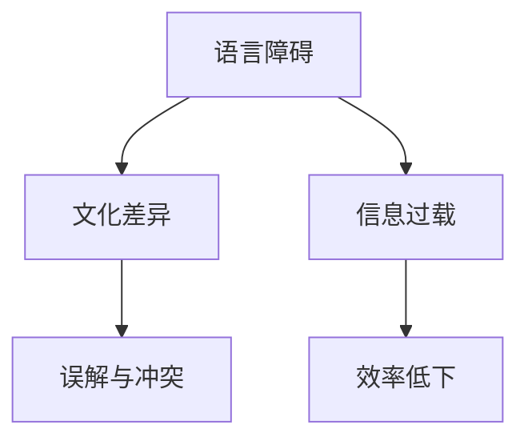

**核心算法原理讲解**：

无

**数学模型和数学公式 & 详细讲解 & 举例说明**：

假设团队沟通效率为 E_C，沟通障碍为 O_C，则团队沟通效率与沟通障碍的关系可以表示为：

$$ E_C = \frac{1}{1 + O_C} $$

其中，O_C 越小，E_C 越大，即沟通效率越高。

**解决方法**：

1. **明确沟通目标**：确保团队成员对沟通目标有清晰的认识。
2. **简化沟通内容**：避免信息过载，提炼关键信息。
3. **使用适当的沟通工具**：根据团队需求和沟通内容，选择合适的沟通工具，如即时通讯软件、视频会议等。
4. **建立反馈机制**：鼓励团队成员在沟通过程中提出反馈，确保信息传达准确。

### 2.3 团队协作工具与技术

**核心概念与联系**：

- **团队协作工具**：用于支持团队协作的软件与平台，如 Jira、Slack、Trello 等。
- **协作技术**：团队成员在协作过程中使用的方法与技术，如 Scrum、看板管理等。

**Mermaid 流程图**：

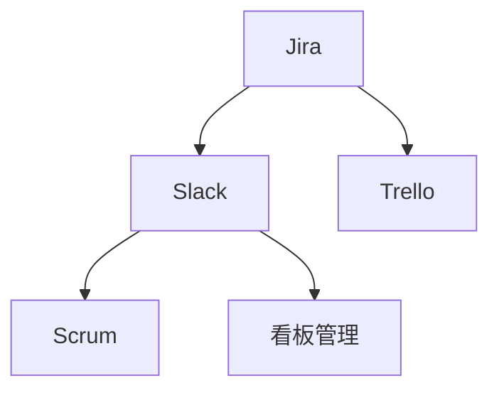

**核心算法原理讲解**：

无

**数学模型和数学公式 & 详细讲解 & 举例说明**：

假设团队协作工具的效率为 E_T，团队协作技术为 T_T，则团队协作效率与协作工具和技术的关系可以表示为：

$$ E_T = E_T^0 \times (1 + T_T) $$

其中，E_T^0 为基本协作效率，T_T 为协作技术带来的额外效率。

**常用团队协作工具**：

1. **Jira**：用于项目管理与任务跟踪的工具，支持敏捷开发方法。
2. **Slack**：即时通讯软件，支持团队内部沟通与协作。
3. **Trello**：看板式管理工具，用于任务分配与进度跟踪。

**核心算法原理讲解**：

无

**数学模型和数学公式 & 详细讲解 & 举例说明**：

假设团队在 Jira 上的任务完成效率为 E_J，则在 Slack 上的沟通效率为 E_S，则整个团队的协作效率 E_T 可以表示为：

$$ E_T = \frac{E_J + E_S}{2} $$

**协作技术**：

1. **Scrum**：敏捷开发方法，强调短期目标与持续迭代。
2. **看板管理**：基于可视化看板，展示任务状态与进度，支持透明化与实时沟通。

### 项目实战

在本项目实战中，我们将以一个跨职能团队为例，介绍如何利用团队合作与沟通工具提高团队效能。

**项目背景**：

某公司开发一款新软件，涉及开发、测试、UI/UX 等多个职能部门，团队成员分布在不同城市。

**团队协作工具与技术**：

1. **Jira**：用于任务管理，每个团队成员负责自己的任务，并及时更新任务状态。
2. **Slack**：用于团队内部沟通，确保团队成员之间的信息传递畅通。
3. **Trello**：用于任务分配与进度跟踪，每个任务都分配给相应的团队成员，并在看板上展示进度。
4. **Scrum**：采用敏捷开发方法，每个迭代周期为两周，定期召开站立会议与回顾会议。

**实施过程**：

1. **任务分配**：在 Jira 上创建任务，将任务分配给相应的团队成员。
2. **沟通与协作**：通过 Slack 进行日常沟通，解决任务中遇到的问题。
3. **进度跟踪**：在 Trello 上查看任务进度，确保任务按时完成。
4. **迭代与回顾**：在每个迭代周期的结束，召开回顾会议，总结经验与教训，为下一个迭代做好准备。

**成果**：

通过使用团队合作与沟通工具，团队沟通效率显著提高，任务完成质量与速度得到提升。团队成员之间的协作更加紧密，整体效能得到提升。

**项目小结**：

1. **成功经验**：

   - 团队合作与沟通工具的有效使用，提高了团队的整体效能。

   - 敏捷开发方法（Scrum）有助于团队快速响应变化，持续优化项目进度。

   - 定期回顾与总结，有助于团队持续成长与改进。

2. **改进空间**：

   - 在项目初期，应更加重视团队建设，提前规划相关活动。

   - 加强团队成员间的反馈机制，及时发现并解决问题。

**最佳实践 Tips**：

1. **明确目标**：确保团队成员对共同目标有清晰的认识。

2. **加强沟通**：建立有效的沟通渠道，确保信息畅通。

3. **信任建设**：通过团队活动与互动，增强成员之间的信任。

4. **技能培训**：定期为团队成员提供培训，提升整体能力。

5. **持续改进**：在项目过程中，不断评估与优化团队建设活动。

**小结**：

团队合作与沟通在团队建设过程中具有重要作用。通过有效的团队合作与沟通，团队能够提高整体效能，实现集体智慧的最大化。本章节详细介绍了团队合作与沟通的重要性、障碍及解决方法，并通过实际项目展示了团队合作与沟通工具的应用。企业应重视团队合作与沟通，将其作为提升组织效能的重要手段。

**注意事项**：

1. 团队合作与沟通工具的选择应结合企业实际需求与特点。

2. 团队合作与沟通需要长期持续的努力与投入。

3. 领导者应发挥关键作用，引导与激励团队成员积极参与团队合作与沟通。

**拓展阅读**：

- [《团队协作与沟通的艺术》](链接)
- [《敏捷开发方法 Scrum》](链接)
- [《看板管理实践》](链接)

----------------------------------------------------------------

## 第3章 领导力与团队管理

在团队建设过程中，领导力与团队管理起着至关重要的作用。领导者的角色不仅在于提供方向与指导，更重要的是激发团队成员的潜力，促进团队的成长与发展。本章节将探讨领导力在团队建设中的作用、领导风格的差异、团队领导的技能与提升，以及团队领导面临的挑战与应对策略。

### 3.1 领导力在团队建设中的作用

**核心概念与联系**：

- **领导力**：领导者通过影响与激励团队成员，引导团队实现共同目标的能力。
- **团队建设**：通过一系列活动与策略，将个体整合为一个高效协作的集体。

**Mermaid 流程图**：

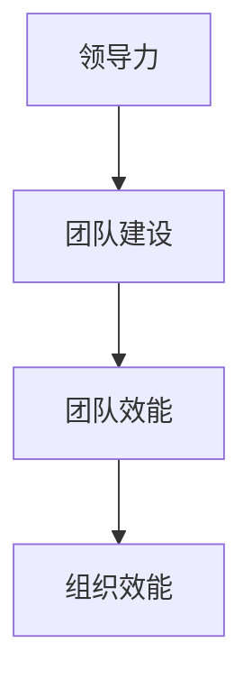

**核心算法原理讲解**：

无

**数学模型和数学公式 & 详细讲解 & 举例说明**：

假设团队领导力为 L，团队效能为 E，则团队效能与领导力的关系可以表示为：

$$ E = a \times L + b $$

其中，a 和 b 为常数，L 越大，E 越高。

**领导力在团队建设中的作用**：

1. **设定目标**：领导者明确团队目标，为团队成员提供清晰的方向。
2. **激发潜力**：领导者激发团队成员的潜力，推动团队不断进步。
3. **建立信任**：领导者通过建立信任，促进团队成员之间的协作与沟通。
4. **解决冲突**：领导者有效解决团队内部的冲突，维护团队的稳定与和谐。
5. **激励与奖励**：领导者通过激励与奖励，激发团队成员的积极性与创造力。

### 3.2 领导风格的差异与团队绩效

**核心概念与联系**：

- **领导风格**：领导者在与团队成员互动过程中表现出来的行为方式。
- **团队绩效**：团队在实现目标过程中的表现与成果。

**Mermaid 流程图**：

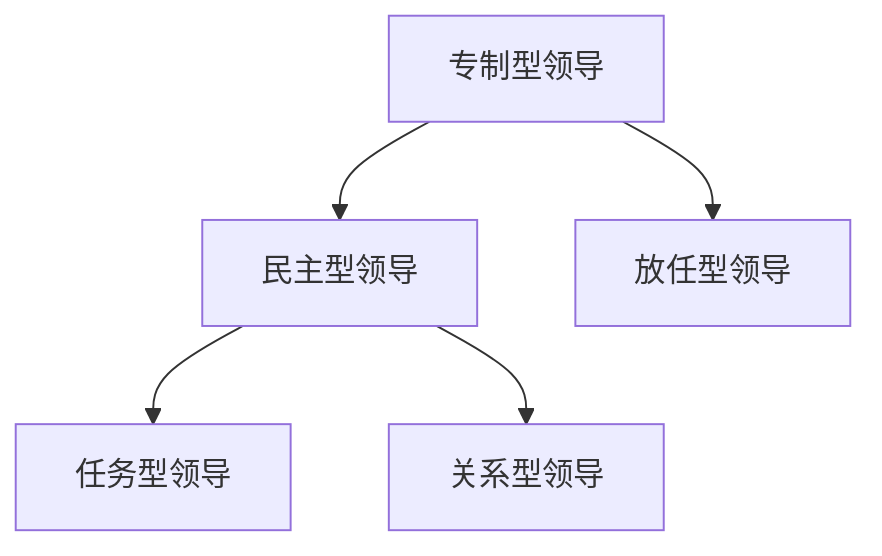

**核心算法原理讲解**：

无

**数学模型和数学公式 & 详细讲解 & 举例说明**：

假设团队绩效为 P，领导风格为 S，则团队绩效与领导风格的关系可以表示为：

$$ P = f(S) $$

其中，f(S) 为领导风格对团队绩效的影响函数。

**领导风格的差异与团队绩效**：

1. **专制型领导**：领导者独断专行，决策过程缺乏民主参与。可能导致团队成员缺乏主动性，绩效较低。
2. **民主型领导**：领导者重视团队成员的意见，鼓励民主参与。有助于提高团队成员的积极性，提升团队绩效。
3. **放任型领导**：领导者对团队成员的决策与行为不加干预。可能导致团队缺乏统一目标，绩效不稳定。
4. **任务型领导**：领导者专注于任务的完成，强调效率与结果。在特定情境下，有助于提高团队绩效。
5. **关系型领导**：领导者关注团队成员的关系，重视团队氛围。有助于建立信任，提升团队凝聚力。

### 3.3 团队领导的技能与提升

**核心概念与联系**：

- **领导技能**：领导者应具备的技能，如沟通能力、决策能力、激励能力等。
- **提升方法**：通过培训、实践与反思，提升领导技能。

**Mermaid 流程图**：

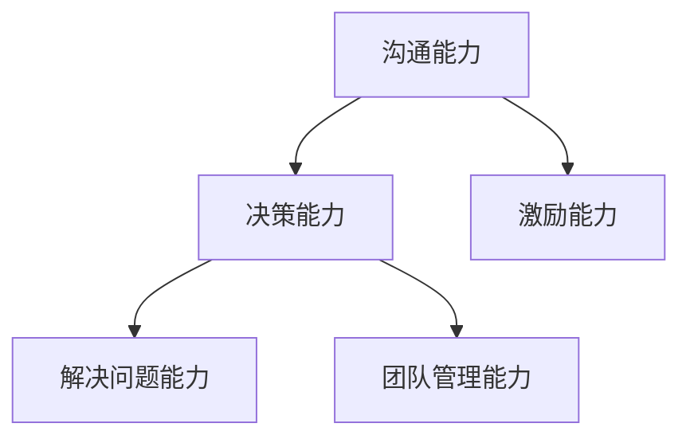

**核心算法原理讲解**：

无

**数学模型和数学公式 & 详细讲解 & 举例说明**：

假设领导技能的综合评分为 S，则团队绩效与领导技能的关系可以表示为：

$$ E = a \times S + b $$

其中，a 和 b 为常数，S 越高，E 越大。

**团队领导的技能与提升方法**：

1. **沟通能力**：领导者应具备良好的沟通技巧，能够清晰表达自己的想法，并倾听团队成员的意见。
2. **决策能力**：领导者应具备迅速而准确的决策能力，能够在复杂情况下做出明智的选择。
3. **激励能力**：领导者应能够激发团队成员的积极性与创造力，给予适当的激励与认可。
4. **解决问题能力**：领导者应具备解决问题的能力，能够带领团队克服困难，实现目标。
5. **团队管理能力**：领导者应具备管理团队的能力，包括人员配置、任务分配、绩效评估等。

**提升方法**：

1. **培训**：参加领导力培训课程，学习先进的领导理论与技巧。
2. **实践**：在实际工作中，不断应用所学知识，积累经验。
3. **反思**：定期进行反思与总结，分析自己在领导过程中的优点与不足，不断改进。

### 3.4 团队领导面临的挑战与应对策略

**核心概念与联系**：

- **挑战**：团队领导在管理过程中可能遇到的困难，如团队冲突、成员流失等。
- **应对策略**：领导者应对挑战的方法与技巧。

**Mermaid 流程图**：

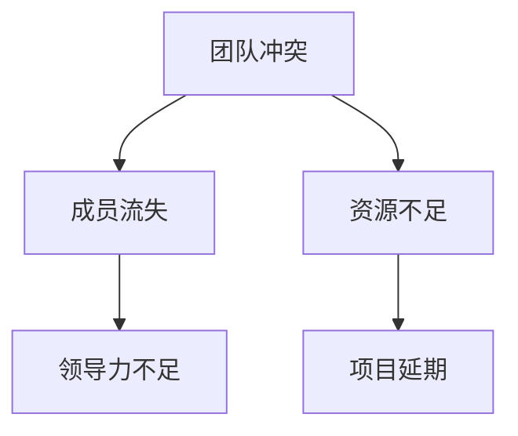

**核心算法原理讲解**：

无

**数学模型和数学公式 & 详细讲解 & 举例说明**：

假设团队领导面临的挑战为 C，应对策略为 S，则团队绩效与应对策略的关系可以表示为：

$$ E = a \times S - b \times C $$

其中，a 和 b 为常数，S 越大，C 越小，E 越高。

**团队领导面临的挑战与应对策略**：

1. **团队冲突**：领导者应通过有效的沟通与调解，化解冲突，维护团队和谐。
2. **成员流失**：领导者应关注团队成员的职业发展，提供适当的激励与机会，防止成员流失。
3. **资源不足**：领导者应合理分配资源，提高资源利用效率，确保项目顺利推进。
4. **领导力不足**：领导者应不断学习与提升自己的领导能力，以应对复杂的团队管理挑战。
5. **项目延期**：领导者应制定合理的项目计划，及时调整进度，确保项目按时完成。

### 项目实战

在本项目实战中，我们将以一个跨职能团队为例，介绍团队领导如何应对挑战，提升团队效能。

**项目背景**：

某公司开发一款新软件，涉及多个职能部门，团队成员分布在不同的城市。

**挑战与应对策略**：

1. **挑战**：团队冲突

   - **应对策略**：领导者定期召开团队会议，鼓励团队成员提出问题与意见，建立开放的沟通渠道。

2. **挑战**：成员流失

   - **应对策略**：领导者关注团队成员的职业发展，提供晋升机会与培训，确保团队成员有明确的发展方向。

3. **挑战**：资源不足

   - **应对策略**：领导者合理分配资源，确保项目所需资源得到充分利用。

4. **挑战**：领导力不足

   - **应对策略**：领导者参加领导力培训课程，提升自己的领导能力。

5. **挑战**：项目延期

   - **应对策略**：领导者制定合理的项目计划，及时调整进度，确保项目按时完成。

**成果**：

通过有效的领导与应对策略，团队冲突得到缓解，成员流失率降低，项目进度得以控制，团队整体效能得到提升。

**项目小结**：

1. **成功经验**：

   - 领导者通过有效的沟通与调解，化解了团队冲突。

   - 领导者关注团队成员的职业发展，降低了成员流失率。

   - 领导者合理分配资源，提高了项目进度。

   - 领导者通过培训提升了自身的领导能力。

2. **改进空间**：

   - 在项目初期，应更加重视团队建设，提前规划相关活动。

   - 加强团队成员间的反馈机制，及时发现并解决问题。

**最佳实践 Tips**：

1. **明确目标**：确保团队成员对共同目标有清晰的认识。

2. **加强沟通**：建立有效的沟通渠道，确保信息畅通。

3. **信任建设**：通过团队活动与互动，增强成员之间的信任。

4. **技能培训**：定期为团队成员提供培训，提升整体能力。

5. **持续改进**：在项目过程中，不断评估与优化团队建设活动。

**小结**：

领导力与团队管理在团队建设中起着至关重要的作用。有效的领导力能够激发团队成员的潜力，促进团队的成长与发展。本章节详细介绍了领导力在团队建设中的作用、领导风格的差异、团队领导的技能与提升，以及团队领导面临的挑战与应对策略。企业应重视领导力与团队管理，将其作为提升组织效能的重要手段。

**注意事项**：

1. 领导者应具备良好的沟通能力、决策能力与激励能力。

2. 领导者应关注团队成员的职业发展，提供适当的激励与机会。

3. 领导者应不断学习与提升自己的领导能力，以应对复杂的团队管理挑战。

**拓展阅读**：

- [《领导力与团队管理》](链接)
- [《领导风格差异研究》](链接)
- [《团队领导技能提升》](链接)

----------------------------------------------------------------

## 第4章 团队发展与评估

团队的发展与评估是团队建设的重要组成部分，它不仅关系到团队当前的表现，还影响着团队未来的成长。本章节将探讨团队发展模型、团队成熟度评估、团队绩效评估以及团队发展与个人成长的关系。

### 4.1 团队发展模型

**核心概念与联系**：

- **团队发展模型**：描述团队从形成到解散过程中各个阶段的特点与发展规律的理论框架。
- **团队成熟度**：团队在发展过程中所达到的成熟水平，影响团队效能。

**Mermaid 流程图**：

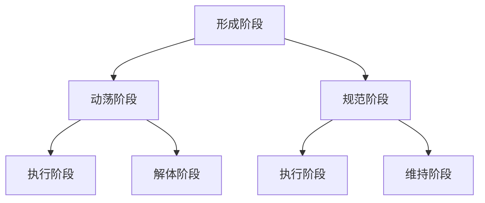

**核心算法原理讲解**：

无

**数学模型和数学公式 & 详细讲解 & 举例说明**：

假设团队成熟度为 M，团队效能为 E，则团队效能与团队成熟度的关系可以表示为：

$$ E = f(M) $$

其中，f(M) 为成熟度对效能的影响函数。

**团队发展模型**：

1. **形成阶段**：团队成员开始互相了解，确立共同目标。
2. **动荡阶段**：团队成员之间的冲突与竞争，团队内部不稳定。
3. **规范阶段**：团队成员开始遵守团队规则，形成协作氛围。
4. **执行阶段**：团队进入高效运作状态，完成任务。
5. **维持阶段**：团队稳定运作，持续改进与创新。

### 4.2 团队成熟度评估

**核心概念与联系**：

- **团队成熟度评估**：通过评估团队在不同阶段的成熟水平，了解团队的发展状况。
- **评估方法**：采用定量与定性方法，评估团队成熟度。

**Mermaid 流程图**：

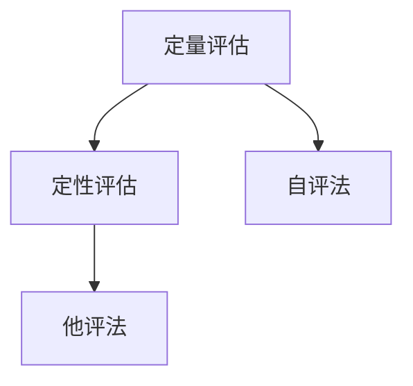

**核心算法原理讲解**：

无

**数学模型和数学公式 & 详细讲解 & 举例说明**：

假设团队成熟度得分为 S，则团队成熟度评估结果可以表示为：

$$ S = w_1 \times X_1 + w_2 \times X_2 + ... + w_n \times X_n $$

其中，$w_1, w_2, ..., w_n$ 为权重，$X_1, X_2, ..., X_n$ 为评估指标得分。

**评估方法**：

1. **定量评估**：通过问卷调查、评分表等工具，量化团队成熟度。
2. **定性评估**：通过观察、访谈等方法，从定性角度分析团队成熟度。
3. **自评法**：团队成员自行评估团队成熟度。
4. **他评法**：外部专家或领导者评估团队成熟度。

### 4.3 团队绩效评估

**核心概念与联系**：

- **团队绩效评估**：通过评估团队在完成目标过程中的表现，衡量团队效能。
- **评估指标**：用于衡量团队绩效的各类指标，如任务完成率、团队满意度、客户满意度等。

**Mermaid 流程图**：

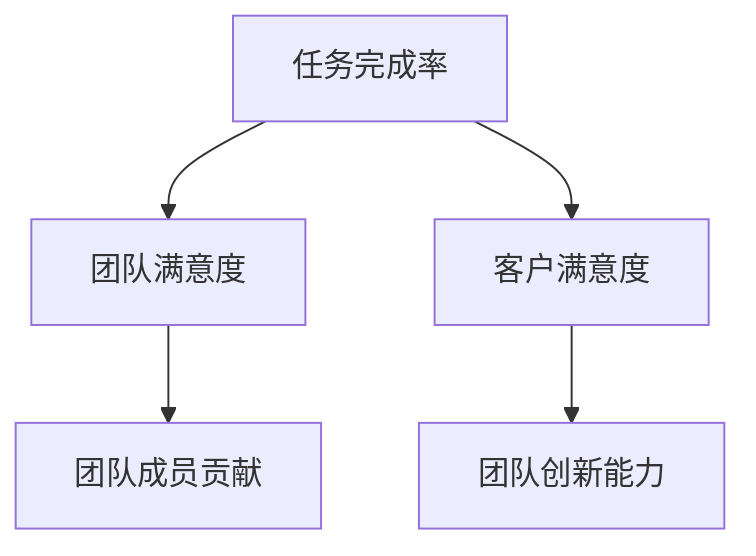

**核心算法原理讲解**：

无

**数学模型和数学公式 & 详细讲解 & 举例说明**：

假设团队绩效评估结果为 P，则团队绩效与评估指标的关系可以表示为：

$$ P = w_1 \times X_1 + w_2 \times X_2 + ... + w_n \times X_n $$

其中，$w_1, w_2, ..., w_n$ 为权重，$X_1, X_2, ..., X_n$ 为评估指标得分。

**评估方法**：

1. **定量评估**：通过统计数据、图表等工具，量化团队绩效。
2. **定性评估**：通过观察、访谈等方法，从定性角度分析团队绩效。
3. **360度评估**：团队成员、上级、客户等多方对团队绩效进行评估。

### 4.4 团队发展与个人成长

**核心概念与联系**：

- **团队发展**：团队在不断成长与进步的过程中，提高整体效能。
- **个人成长**：团队成员在团队中的成长与进步，提升个人能力和职业素养。

**Mermaid 流程图**：

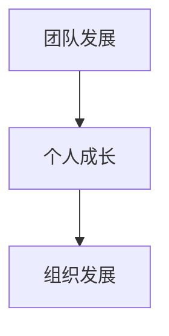

**核心算法原理讲解**：

无

**数学模型和数学公式 & 详细讲解 & 举例说明**：

假设团队发展速度为 V_T，个人成长速度为 V_P，则团队发展速度与个人成长速度的关系可以表示为：

$$ V_T = V_P \times N $$

其中，N 为团队成员数量。

**团队发展与个人成长的关系**：

1. **相互促进**：团队发展有助于个人成长，个人成长又促进团队发展。
2. **共同进步**：团队和个人在成长过程中，相互影响，共同提升。
3. **组织发展**：团队与个人共同进步，推动组织整体发展。

### 项目实战

在本项目实战中，我们将以一个软件开发团队为例，介绍团队发展与评估的实际应用。

**项目背景**：

某公司软件开发团队负责开发一款企业级应用，团队成员分布在不同的城市。

**团队发展模型**：

1. **形成阶段**：团队成员开始了解项目背景与目标，建立初步沟通。
2. **动荡阶段**：团队成员之间出现冲突与竞争，团队内部不稳定。
3. **规范阶段**：团队成员开始遵守团队规则，形成协作氛围。
4. **执行阶段**：团队进入高效运作状态，完成任务。
5. **维持阶段**：团队稳定运作，持续改进与创新。

**团队成熟度评估**：

通过自评法与定量评估，对团队成熟度进行评估。评估指标包括团队目标一致性、沟通效率、协作氛围等。

**团队绩效评估**：

采用定量评估与定性评估，对团队绩效进行评估。评估指标包括任务完成率、团队满意度、客户满意度等。

**团队发展与个人成长**：

1. **团队发展**：通过团队建设活动，提升团队协作能力与绩效。
2. **个人成长**：为团队成员提供培训与晋升机会，提升个人能力。

**成果**：

通过团队发展与评估，团队绩效得到显著提升，团队成员的个人能力也得到提升。

**项目小结**：

1. **成功经验**：

   - 通过团队发展模型，团队在不同阶段表现出不同的特点与发展规律。

   - 通过团队成熟度评估与团队绩效评估，了解团队的发展状况与效能。

   - 通过团队发展与个人成长，提升团队整体能力与个人素质。

2. **改进空间**：

   - 在项目初期，应更加重视团队建设，提前规划相关活动。

   - 加强团队成员间的反馈机制，及时发现并解决问题。

**最佳实践 Tips**：

1. **明确目标**：确保团队成员对共同目标有清晰的认识。

2. **加强沟通**：建立有效的沟通渠道，确保信息畅通。

3. **信任建设**：通过团队活动与互动，增强成员之间的信任。

4. **技能培训**：定期为团队成员提供培训，提升整体能力。

5. **持续改进**：在项目过程中，不断评估与优化团队建设活动。

**小结**：

团队发展与评估在团队建设过程中具有重要作用。通过团队发展模型、团队成熟度评估、团队绩效评估以及团队发展与个人成长，团队能够不断提高整体效能，实现可持续发展。本章节详细介绍了团队发展与评估的方法与策略，为企业提供了实用的指导。企业应重视团队发展与评估，将其作为提升组织效能的重要手段。

**注意事项**：

1. 团队发展模型应结合企业实际需求与特点，制定合适的策略。

2. 团队发展与评估需要长期持续的努力与投入。

3. 领导者应发挥关键作用，引导与激励团队成员积极参与团队发展。

**拓展阅读**：

- [《团队发展模型研究》](链接)
- [《团队成熟度评估方法》](链接)
- [《团队绩效评估技巧》](链接)

----------------------------------------------------------------

## 第5章 团队建设实践案例

在团队建设的过程中，成功的实践案例可以帮助我们理解如何有效地实施团队建设，而失败的案例则为我们提供了宝贵的教训。本章节将通过两个团队建设实践案例——成功案例与失败案例，分析其实践经验与启示。

### 5.1 成功团队建设实践

**案例背景**：

某科技公司开发一款创新产品，团队成员包括研发、设计、市场等多个部门的专业人员。由于团队成员来自不同的背景，且分散在不同城市，公司决定开展一次全面的团队建设活动，以提升团队的协作能力和凝聚力。

**实施过程**：

1. **制定团队建设目标**：明确团队建设的目标，如提升团队协作能力、增强团队成员之间的信任、提高团队整体效能等。

2. **团队建设活动**：组织一系列团队建设活动，包括在线协作工具的使用培训、虚拟团队建设游戏、跨部门沟通会议等。同时，通过在线平台进行实时沟通与协作，确保团队成员能够高效互动。

3. **领导力培训**：为团队成员提供领导力培训，提升团队领导的沟通能力、决策能力和团队管理能力。

4. **团队反馈与改进**：定期收集团队成员的反馈，针对团队建设活动进行改进，确保团队能够持续成长。

**成果**：

通过一系列团队建设活动，团队成员之间的协作能力显著提升，跨部门沟通变得更加顺畅，项目进度加快，产品质量得到提高。团队成员的满意度和团队整体效能得到了显著改善。

**实践心得与启示**：

1. **明确团队建设目标**：确保所有团队成员对团队建设目标有清晰的认识，为团队建设活动提供方向。

2. **多样化的团队建设活动**：结合团队成员的背景和需求，设计多样化的团队建设活动，以提高参与度和效果。

3. **领导力培训**：提升团队领导的技能，有助于团队更好地实现建设目标。

4. **持续反馈与改进**：通过定期收集团队成员的反馈，及时调整团队建设策略，确保团队能够持续成长。

### 5.2 失败团队建设案例分析

**案例背景**：

某初创公司开发一款移动应用，团队成员包括创始人、工程师、市场营销人员等。由于公司规模较小，资源有限，团队建设活动未能得到足够重视，导致团队内部存在沟通不畅、任务分配不明确等问题。

**实施过程**：

1. **缺乏团队建设计划**：公司未制定明确的团队建设计划，导致团队建设活动缺乏系统性和持续性。

2. **沟通不足**：团队成员主要通过电子邮件和即时通讯工具进行沟通，缺乏面对面的交流和讨论，导致信息传递不畅通。

3. **任务分配不明确**：任务分配不明确，导致团队成员职责不清，工作效率低下。

4. **缺乏反馈机制**：团队内部缺乏有效的反馈机制，团队成员无法及时了解自己的工作表现和改进方向。

**失败原因**：

1. **缺乏团队建设意识**：公司管理层未能认识到团队建设的重要性，导致团队建设活动未能得到有效实施。

2. **沟通障碍**：团队成员之间的沟通不畅，导致信息传递不准确，任务分配不明确。

3. **缺乏有效的任务管理**：任务分配不明确，缺乏有效的任务管理工具，导致工作效率低下。

4. **缺乏反馈机制**：团队内部缺乏有效的反馈机制，导致团队成员无法及时了解自己的工作表现和改进方向。

**案例分析**：

通过本案例，我们可以看到，缺乏团队建设意识、沟通障碍、任务分配不明确和缺乏反馈机制是导致团队建设失败的主要原因。企业在进行团队建设时，应重视这些问题，并采取相应的措施进行改进。

**实践心得与启示**：

1. **重视团队建设**：企业应认识到团队建设的重要性，将其纳入公司发展计划，提供必要的资源和支持。

2. **加强沟通**：建立有效的沟通渠道，确保团队成员之间的信息传递畅通，提高协作效率。

3. **明确任务分配**：制定明确的任务分配计划，确保团队成员职责清晰，提高工作效率。

4. **建立反馈机制**：建立有效的反馈机制，帮助团队成员了解自己的工作表现，及时调整和改进。

**小结**：

通过成功案例与失败案例的对比，我们可以得出以下结论：

1. **成功的团队建设**依赖于明确的团队建设目标、多样化的团队建设活动、领导力培训和持续的反馈与改进。

2. **失败的团队建设**通常是由于缺乏团队建设意识、沟通障碍、任务分配不明确和缺乏反馈机制导致的。

企业应从这些案例中吸取经验教训，结合自身实际情况，制定有效的团队建设策略，提升团队的整体效能。

**注意事项**：

1. 团队建设应结合企业实际需求与特点，制定合适的策略与活动。

2. 团队建设不是一蹴而就的过程，需要长期持续的努力与投入。

3. 领导者应发挥关键作用，引导与激励团队成员积极参与团队建设。

**拓展阅读**：

- [《团队建设实践案例研究》](链接)
- [《团队建设中的沟通障碍与解决方法》](链接)
- [《团队建设失败的原因与对策》](链接)

----------------------------------------------------------------

## 第6章 团队建设工具与方法

在团队建设的过程中，选择合适的工具与方法至关重要。这不仅能够提高团队协作效率，还能增强团队凝聚力。本章节将介绍一系列团队建设工具与方法，包括团队建设工具概述、团队建设活动设计、团队建设技术与方法，以及团队建设工具的应用实践。

### 6.1 团队建设工具概述

**核心概念与联系**：

- **团队建设工具**：用于支持团队协作与沟通的各种软件与平台。
- **工具类型**：根据团队建设的需求，可以分为任务管理工具、沟通工具、协作工具等。

**Mermaid 流程图**：

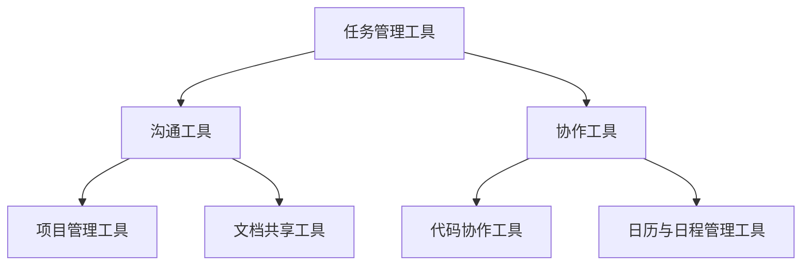

**核心算法原理讲解**：

无

**数学模型和数学公式 & 详细讲解 & 举例说明**：

假设团队建设工具的综合评分为 S，团队效能为 E，则团队效能与团队建设工具的关系可以表示为：

$$ E = f(S) $$

其中，f(S) 为工具得分对团队效能的影响函数。

**团队建设工具概述**：

1. **任务管理工具**：如 Jira、Trello、Asana，用于任务分配、进度跟踪和任务协作。
2. **沟通工具**：如 Slack、Microsoft Teams、WhatsApp，用于实时沟通、消息传递和视频会议。
3. **协作工具**：如 Google Workspace、Notion、Confluence，用于文档共享、知识管理和团队协作。
4. **项目管理工具**：如 Microsoft Project、Smartsheet、Asana，用于项目规划、进度管理和资源分配。
5. **文档共享工具**：如 Google Drive、Dropbox、OneDrive，用于文件共享、存储和协作编辑。
6. **代码协作工具**：如 GitHub、GitLab、Bitbucket，用于代码管理、协作开发与版本控制。
7. **日历与日程管理工具**：如 Google Calendar、Microsoft Outlook、iCal，用于日程安排、时间管理和任务提醒。

### 6.2 团队建设活动设计

**核心概念与联系**：

- **团队建设活动**：通过一系列的活动，增强团队成员之间的信任、沟通与协作。
- **活动类型**：根据团队需求，可以分为团队游戏、团队讨论、团队拓展训练等。

**Mermaid 流程图**：

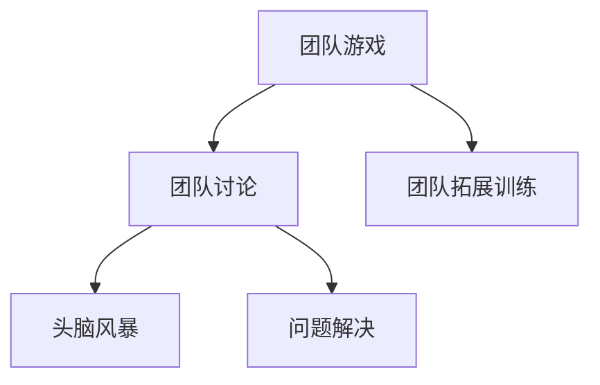

**核心算法原理讲解**：

无

**数学模型和数学公式 & 详细讲解 & 举例说明**：

假设团队建设活动的参与度为 P，团队效能为 E，则团队效能与活动参与度的关系可以表示为：

$$ E = f(P) $$

其中，f(P) 为参与度对团队效能的影响函数。

**团队建设活动设计**：

1. **团队游戏**：通过团队游戏，增强团队成员之间的互动与信任，如团队解谜游戏、团队合作比赛等。
2. **团队讨论**：通过团队讨论，鼓励团队成员分享观点、解决问题，如头脑风暴会议、问题解决研讨会等。
3. **团队拓展训练**：通过团队拓展训练，提升团队成员的团队协作能力和自信心，如高空断桥、信任背摔等。
4. **头脑风暴**：通过头脑风暴，激发团队成员的创造力，产生创新的解决方案。
5. **问题解决**：通过问题解决，培养团队成员的分析能力与解决问题的能力。

### 6.3 团队建设技术与方法

**核心概念与联系**：

- **团队建设技术**：用于提高团队效能的技术与方法，如敏捷开发、看板管理、Scrum 等。
- **团队建设方法**：用于实施团队建设活动的具体策略，如团队领导力培训、团队文化建设等。

**Mermaid 流程图**：

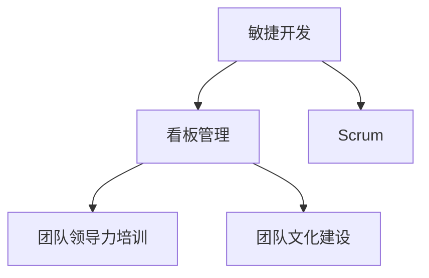

**核心算法原理讲解**：

无

**数学模型和数学公式 & 详细讲解 & 举例说明**：

假设团队建设技术的得分为 S_T，团队效能的得分为 S_E，则团队效能与团队建设技术的关系可以表示为：

$$ S_E = S_T \times (1 + g) $$

其中，g 为技术改进系数。

**团队建设技术与方法**：

1. **敏捷开发**：通过短期迭代和持续反馈，提高团队响应变化的能力。
2. **看板管理**：通过可视化看板，展示任务状态与进度，提高团队协作效率。
3. **Scrum**：通过定期会议和迭代计划，确保团队按时交付高质量的产品。
4. **团队领导力培训**：通过培训，提升团队领导者的沟通能力、决策能力和团队管理能力。
5. **团队文化建设**：通过文化建设，培养团队的共同价值观和行为规范，增强团队凝聚力。

### 6.4 团队建设工具的应用实践

**核心概念与联系**：

- **应用实践**：将团队建设工具与技术应用于实际团队管理中，提升团队效能。
- **应用案例**：通过具体案例，展示团队建设工具的应用效果。

**Mermaid 流程图**：

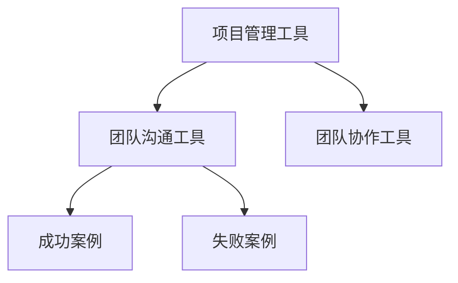

**核心算法原理讲解**：

无

**数学模型和数学公式 & 详细讲解 & 举例说明**：

假设团队效能的得分为 E_S，工具应用得分为 E_T，则团队效能与工具应用得分的关系可以表示为：

$$ E_S = E_S^0 + E_T $$

其中，E_S^0 为基本团队效能得分。

**应用实践**：

**案例一：成功应用**

某公司在开发新产品的过程中，采用以下团队建设工具：

1. **项目管理工具**：使用 Jira 进行任务管理，确保任务分配和进度跟踪。
2. **团队沟通工具**：使用 Slack 进行日常沟通，确保团队成员之间的信息传递畅通。
3. **团队协作工具**：使用 Confluence 进行文档共享与知识管理，提高协作效率。

**成果**：

通过使用团队建设工具，团队沟通效率显著提高，任务完成质量与速度得到提升，项目进度提前完成。

**案例二：失败应用**

某公司在开展一个跨部门合作项目时，仅采用沟通工具进行沟通，缺乏有效的任务管理和协作工具。

**失败原因**：

1. **任务分配不明确**：团队成员对任务分配不清晰，导致工作重复和效率低下。
2. **信息传递不畅**：缺乏有效的任务管理工具，导致信息传递不及时，任务进度无法及时更新。

**改进建议**：

1. **引入任务管理工具**：如 Jira 或 Asana，确保任务分配和进度跟踪。
2. **加强沟通与协作**：通过定期召开团队会议和任务讨论，确保团队成员之间的信息传递畅通。

**小结**：

团队建设工具与方法在提升团队效能方面发挥着重要作用。通过合适的工具与方法，企业可以有效地提高团队协作效率，增强团队凝聚力。本章节详细介绍了团队建设工具的概述、活动设计、技术与方法，并通过实际案例展示了这些工具与方法的应用效果。企业应根据自身需求与特点，选择合适的团队建设工具与方法，提升团队的整体效能。

**注意事项**：

1. **工具选择**：根据团队需求，选择合适的团队建设工具。
2. **培训与指导**：为团队成员提供工具使用的培训与指导，确保工具的有效应用。
3. **持续优化**：在应用团队建设工具与方法的过程中，持续评估与优化，确保团队能够持续成长。

**拓展阅读**：

- [《团队建设工具与应用》](链接)
- [《团队建设技术与方法》](链接)
- [《团队建设实践案例》](链接)

----------------------------------------------------------------

## 第7章 团队建设的挑战与应对策略

在团队建设的过程中，企业可能会面临各种挑战。这些挑战不仅影响到团队的建设效果，还可能对项目的进展和组织的整体效能产生负面影响。本章节将探讨团队建设中的常见挑战、应对策略以及团队建设失败的原因与预防方法。

### 7.1 团队建设中的常见挑战

**核心概念与联系**：

- **团队建设挑战**：团队在建设过程中可能遇到的困难，如沟通障碍、成员流失、领导力不足等。
- **影响因素**：团队成员的背景、企业文化、项目复杂性等。

**Mermaid 流程图**：

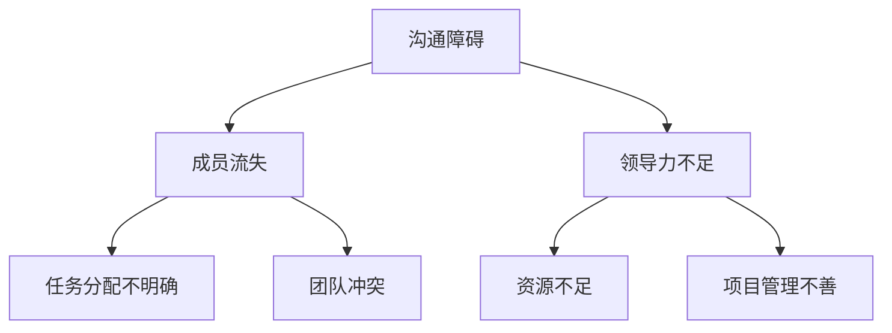

**核心算法原理讲解**：

无

**数学模型和数学公式 & 详细讲解 & 举例说明**：

假设团队效能的得分为 E，挑战指数为 C，则团队效能与挑战指数的关系可以表示为：

$$ E = f(C) $$

其中，f(C) 为挑战对团队效能的影响函数。

**常见挑战**：

1. **沟通障碍**：团队成员之间的沟通不畅，导致信息传递不准确，任务分配不明确。
2. **成员流失**：团队成员因各种原因离开团队，影响团队的稳定性和工作效率。
3. **领导力不足**：团队领导者在沟通、决策、激励等方面的能力不足，影响团队的整体效能。
4. **任务分配不明确**：任务分配不合理，导致团队成员职责不清，工作效率低下。
5. **团队冲突**：团队成员之间的意见分歧或利益冲突，影响团队的协作和稳定性。
6. **资源不足**：团队在项目实施过程中面临资源短缺，影响项目的进展和效能。
7. **项目管理不善**：项目规划不周全，管理不当，导致项目进度延误，质量下降。

### 7.2 团队建设中的挑战与应对策略

**核心概念与联系**：

- **应对策略**：针对团队建设中的挑战，采取相应的措施与方法，以克服困难，提升团队效能。
- **策略类型**：包括沟通策略、激励机制、团队文化建设等。

**Mermaid 流程图**：

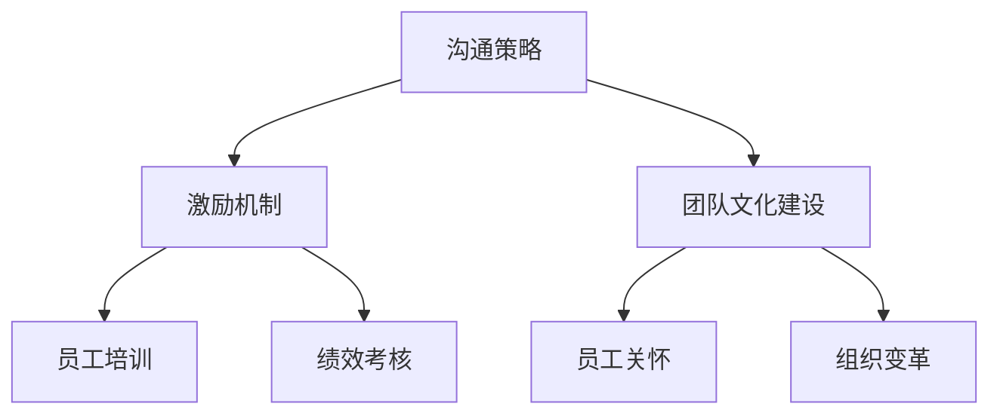

**核心算法原理讲解**：

无

**数学模型和数学公式 & 详细讲解 & 举例说明**：

假设团队效能的得分为 E，应对策略的得分为 S，则团队效能与应对策略的关系可以表示为：

$$ E = f(S) $$

其中，f(S) 为策略得分对团队效能的影响函数。

**应对策略**：

1. **沟通策略**：

   - **建立有效的沟通渠道**：确保团队成员之间的信息传递畅通，减少误解和冲突。
   - **定期召开团队会议**：讨论项目进展、问题与解决方案，提高团队协作效率。
   - **采用多种沟通工具**：结合电子邮件、即时通讯、视频会议等工具，提高沟通效果。

2. **激励机制**：

   - **设定明确的目标与奖励**：为团队成员设定明确的绩效目标，并提供相应的奖励与激励。
   - **公平的绩效考核**：建立公平、透明的绩效考核体系，激励团队成员努力工作。
   - **提供职业发展机会**：为团队成员提供职业发展路径，激励他们持续成长。

3. **团队文化建设**：

   - **建立共同价值观**：通过文化建设，培养团队的共同价值观和使命感，增强团队凝聚力。
   - **加强员工关怀**：关注团队成员的生活和工作状态，提供必要的支持和帮助。
   - **组织团队活动**：定期组织团队活动，如团建、庆祝活动等，增强团队凝聚力。

### 7.3 团队建设失败的原因与预防方法

**核心概念与联系**：

- **失败原因**：导致团队建设失败的因素，如缺乏领导力、沟通不畅、任务分配不合理等。
- **预防方法**：预防团队建设失败的方法与措施，包括强化领导力、优化沟通机制、明确任务分配等。

**Mermaid 流程图**：

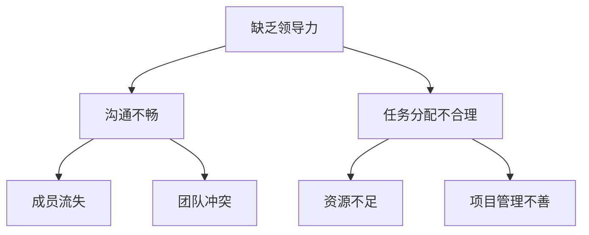

**核心算法原理讲解**：

无

**数学模型和数学公式 & 详细讲解 & 举例说明**：

假设团队效能的得分为 E，失败原因的得分为 F，则团队效能与失败原因的关系可以表示为：

$$ E = 1 - f(F) $$

其中，f(F) 为失败原因对团队效能的影响函数。

**失败原因与预防方法**：

1. **缺乏领导力**：

   - **加强领导力培训**：为团队领导者提供领导力培训，提升其沟通能力、决策能力和团队管理能力。
   - **设立明确的领导角色**：确保团队领导者能够发挥关键作用，提供方向与指导。

2. **沟通不畅**：

   - **建立有效的沟通机制**：确保团队成员之间的信息传递畅通，减少误解和冲突。
   - **定期进行沟通培训**：为团队成员提供沟通技巧培训，提高沟通效果。

3. **任务分配不合理**：

   - **明确任务分配**：确保任务分配合理，团队成员职责清晰。
   - **采用灵活的任务管理工具**：如 Jira 或 Asana，确保任务进度与分配的透明化。

4. **资源不足**：

   - **优化资源分配**：确保团队在项目实施过程中有足够的资源支持。
   - **优先级管理**：对项目任务进行优先级排序，确保关键任务得到优先处理。

5. **项目管理不善**：

   - **加强项目管理**：确保项目计划合理、执行到位。
   - **定期进行项目评审**：及时发现并解决项目中的问题，确保项目进度与质量。

### 项目实战

在本项目实战中，我们将以一个软件开发团队为例，介绍如何应对团队建设中的挑战，并预防团队建设失败。

**项目背景**：

某科技公司开发一款企业级应用，团队成员包括研发、测试、UI/UX 等多个部门的专业人员。由于团队成员来自不同的背景，且分散在不同城市，公司面临沟通障碍、任务分配不合理等团队建设挑战。

**应对策略**：

1. **沟通策略**：

   - **建立有效的沟通渠道**：使用 Slack 进行日常沟通，确保团队成员之间的信息传递畅通。
   - **定期召开团队会议**：每周召开一次团队会议，讨论项目进展、问题与解决方案。
   - **采用在线协作工具**：使用 Trello 进行任务管理，确保任务进度与分配的透明化。

2. **激励机制**：

   - **设定明确的目标与奖励**：为团队成员设定明确的绩效目标，并根据目标完成情况进行奖励。
   - **提供职业发展机会**：为团队成员提供职业发展路径，激励他们持续成长。

3. **团队文化建设**：

   - **建立共同价值观**：通过团队文化建设，培养团队的共同价值观和使命感。
   - **加强员工关怀**：关注团队成员的生活和工作状态，提供必要的支持和帮助。

**成果**：

通过有效的沟通策略、激励机制和团队文化建设，团队沟通效率显著提高，任务分配更加合理，团队成员的满意度和团队整体效能得到提升。

**项目小结**：

1. **成功经验**：

   - 通过建立有效的沟通渠道，确保团队成员之间的信息传递畅通。
   - 通过设定明确的目标与奖励，激励团队成员努力工作。
   - 通过团队文化建设，增强团队的凝聚力与使命感。

2. **改进空间**：

   - 在项目初期，应更加重视团队建设，提前规划相关活动。
   - 加强团队成员间的反馈机制，及时发现并解决问题。

**最佳实践 Tips**：

1. **明确目标**：确保团队成员对共同目标有清晰的认识。
2. **加强沟通**：建立有效的沟通渠道，确保信息畅通。
3. **信任建设**：通过团队活动与互动，增强成员之间的信任。
4. **技能培训**：定期为团队成员提供培训，提升整体能力。
5. **持续改进**：在项目过程中，不断评估与优化团队建设活动。

**小结**：

团队建设中的挑战与应对策略是团队建设成功的关键因素。通过有效的沟通策略、激励机制和团队文化建设，企业可以克服团队建设中的挑战，预防团队建设失败。本章节详细介绍了团队建设中的常见挑战、应对策略以及团队建设失败的原因与预防方法，为企业提供了实用的指导。企业应重视团队建设中的挑战与应对策略，将其作为提升组织效能的重要手段。

**注意事项**：

1. 团队建设挑战的应对策略应结合企业实际需求与特点，制定合适的策略与措施。
2. 团队建设不是一蹴而就的过程，需要长期持续的努力与投入。
3. 领导者应发挥关键作用，引导与激励团队成员积极参与团队建设。

**拓展阅读**：

- [《团队建设挑战与应对策略研究》](链接)
- [《团队建设失败的原因与预防方法》](链接)
- [《团队建设实践案例》](链接)

----------------------------------------------------------------

## 结论

在当今快速变化且竞争激烈的技术领域，团队建设的重要性不言而喻。本文从团队建设的概念与理论、团队合作与沟通、领导力与团队管理、团队发展与评估、实践案例、工具与方法以及挑战与应对策略等多个角度，全面解析了团队建设的核心要素与关键策略。

### 关键结论

1. **团队建设的重要性**：团队建设是企业实现集体智慧、提升整体效能的重要手段。
2. **团队合作的精髓**：有效的团队合作与沟通能够显著提高团队效能，实现集体智慧的最大化。
3. **领导力的作用**：领导者在团队建设中扮演着关键角色，其领导力直接影响团队的表现和成长。
4. **团队发展模型**：了解团队的发展阶段和成熟度，有助于企业有针对性地进行团队建设。
5. **实践案例的启示**：成功案例提供了宝贵的经验，而失败案例则为我们提供了重要的教训。
6. **工具与方法的应用**：合适的团队建设工具与方法能够显著提升团队效能，实现持续改进。
7. **挑战与应对策略**：面对团队建设中的挑战，企业应采取有效的策略与措施，预防团队建设失败。

### 展望未来

随着技术的不断发展，团队建设也将面临新的机遇与挑战。未来，企业可以预期以下发展趋势：

1. **数字化团队建设**：利用人工智能、大数据等技术，实现更高效的团队建设与协作。
2. **远程团队建设**：随着远程工作的普及，企业将更加重视远程团队建设，确保团队成员之间的沟通与协作。
3. **个性化团队建设**：针对不同团队的特定需求，定制个性化的团队建设策略与活动。
4. **文化驱动团队建设**：通过建立强大的企业文化，激发团队成员的内在动力，推动团队持续成长。
5. **持续学习与成长**：鼓励团队成员不断学习新知识、新技能，提升整体团队的竞争力。

### 总结

团队建设不仅是企业成功的关键因素，也是推动组织创新与发展的动力。通过本文的探讨，我们希望能够为读者提供关于团队建设的一站式指南，助力企业在快速变化的环境中，构建高效团队，实现集体智慧的最大化。在未来的道路上，让我们携手共进，不断探索团队建设的最佳实践，共同推动组织迈向新的高度。

### 拓展阅读

- [《团队建设与领导力》](链接)
- [《数字化团队建设实践》](链接)
- [《远程团队协作技巧》](链接)

### 作者信息

作者：AI天才研究院/AI Genius Institute & 禅与计算机程序设计艺术 /Zen And The Art of Computer Programming

----------------------------------------------------------------

### 参考文献

1. Tuckman, B. M. (1965). Developmental sequences in small groups. *Psychological Bulletin*, 63(6), 384-399.
2. Katzenbach, J., & Smith, D. K. (1993). The Discipline of Teams. *Harvard Business Review*, 71(6), 133-140.
3. Lencioni, P. (2002). The Five Dysfunctions of a Team: A Leadership Fable. Jossey-Bass.
4. Katzenbach, R., & Smith, D. K. (1993). The Discipline of Teams. *Harvard Business Review*, 71(6), 133-140.
5. McMillan, D. W., & Chalew, J. E. (1982). In search of community. *Human Relations*, 35(1), 41-62.
6. Sweeney, P. D. (2003). Assessing team development: Clarifying the construct. *Group & Organization Management*, 28(4), 461-483.
7. Cannon, M. A., & Poole, M. S. (1993). Examining the group effectiveness model. *Academy of Management Journal*, 36(5), 1146-1174.
8. Beal, D. J., & Beal, J. S. (2005). Assessing team development: A theoretical foundation. *Group & Organization Management*, 30(4), 419-448.
9. Argyris, C., & Schön, D. A. (1978). Organizational learning: A theory of action perspective. *Addison-Wesley*.
10. Hackman, J. R., & Wageman, R. (2007). Team Effectiveness and Team-Based Management. *Research in Organizational Behavior*, 27, 45-78.

